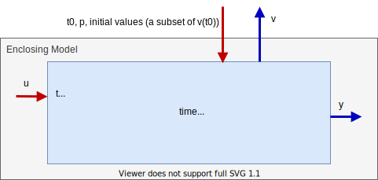

== Overview

The FMI (Functional Mock-up Interface) defines an interface to
be implemented by an executable called an FMU (Functional Mock-up Unit).
The FMI functions are used (called) by a simulation environment to
create one or more instances of the FMU and to simulate them,
typically together with other models.
An FMU may either have its own solvers
(FMI for Co-Simulation, chapter 4)
or require the simulation environment to perform numerical integration
(FMI for Model Exchange, chapter 3).
The goal of this interface is that the calling of an FMU
in a simulation environment is reasonably simple.
No provisions are provided in this document for how to generate an FMU from a modeling environment.

The [underline]#FMI for Model Exchange# interface defines an interface to the model
of a dynamic system described by [underline]#differential#,
[underline]#algebraic# and [underline]#discrete-time# equations.
It provides an interface to evaluate these
equations as needed in different [underline]#simulation environments#,
as well as in [underline]#embedded control systems#,
with explicit or implicit integrators, and fixed or variable step-size.
The interface is designed to allow the
description of large models.

The [underline]#FMI for Co-Simulation# interface is designed both for the [underline]#coupling of simulation tools#
(simulator coupling, tool coupling),
and coupling with subsystem models,
which have been exported by their
simulators together with its solvers as [underline]#runnable code#.
The goal is to compute the solution of time-dependent
coupled systems consisting of subsystems that are continuous in time (model components
that are described by differential-algebraic equations) or are time-discrete (model components that are
described by difference equations, for example discrete controllers).
In a block representation of the coupled system,
the subsystems are represented by blocks with (internal) state variables `x(t)` that are
connected to other subsystems (blocks) of the coupled problem
by subsystem inputs `u(t)` and subsystem outputs `y(t)`.

In case of tool coupling,
the modular structure of coupled problems is exploited in all stages of the
simulation process beginning with the separate model setup and pre-processing for the individual
subsystems in different simulation tools.
During time integration, the simulation is again performed independently for all
subsystems restricting the data exchange between subsystems to discrete _communication points_.
Finally, the visualization and post-processing of simulation data is done
individually for each subsystem in its own native simulation tool.

The two interfaces have large parts in common.
These parts are defined in chapter 2.
In particular:

- [underline]#FMI Application Programming Interface \(C)# +
All required equations or tool coupling computations are evaluated by calling standardized [underline]#C functions#.
C is used
because it is the most portable programming language today and is the only
programming language that can be utilized in all embedded control systems.

- [underline]#FMI Description Schema (XML)# +
The schema defines the structure and content of an XML file generated by a modeling environment.
This XML file contains the definition of all variables of the FMU in a standardized way.
It is then
possible to run the C code in an embedded system without the overhead of the variable definition
(the alternative would be to store this information in the C code and access it via function calls,
but this is neither practical for embedded systems nor for large models).
Furthermore, the variable definition is a complex data structure and tools should
be free to determine how to represent this data structure in their programs.
The selected approach allows a tool to store and access the variable definitions
(without any memory or efficiency overhead of standardized access functions) in the programming
language of the simulation environment,
such as C++, C#, Java, or Python. Note that there are many free and commercial libraries
in different programming languages to read XML files into an appropriate data structure.
See for example http://en.wikipedia.org/wiki/XML#Parsers
and especially the efficient open source parser SAX (http://sax.sourceforge.net/,
http://en.wikipedia.org/wiki/Simple_API_for_XML).

An FMU (in other words a model without integrators,
a runnable model with integrators,
or a tool coupling interface) is distributed in one ZIP file.
The ZIP file contains (more details are given in section 2.3):

- The FMI Description File (in XML format).
- The C sources of the FMU,
including the needed run-time libraries used in the model,
and/or binaries for one or several target machines,
such as Windows dynamic link libraries (.dll) or
Linux shared object libraries (.so).
The latter solution is especially used if the FMU provider
wants to hide the source code to secure the contained know-how or to allow a fully automatic
import of the FMU in another simulation environment.
An FMU may contain physical parameters or geometrical dimensions,
which should not be open.
On the other hand,
some functionality requires source code.
- Additional FMU data (such as tables or maps) in FMU specific file formats.

A schematic view of an FMU is shown in Figure 1:

.Data flow between the environment and an FMU.
For details, see chapters 3 and 4.
[blue]#Blue# arrows: Information provided by the FMU.
[red]#Red# arrows: Information provided to the FMU.
[caption="Figure 1: "]

Publications for FMI are available from https://fmi-standard.org/literature/, 
specially Blochwitz et.al. http://www.ep.liu.se/ecp/063/013/ecp11063013.pdf[2011] and http://www.ep.liu.se/ecp/076/017/ecp12076017.pdf[2012].

=== Properties and Guiding Ideas

In this section,
properties are listed and some principles are defined that guided the low-level design of
the FMI.
This shall increase self consistency of the interface functions.
The listed issues are sorted,
starting from high-level properties to low-level implementation issues.

[role=indented]
_Expressivity_:
The FMI provides the necessary features that Modelica(R), Simulink(R) and SIMPACK(R) models
footnote:[Modelica is a registered trademark of the Modelica Association, Simulink is
a registered trademark of the MathWorks Inc., SIMPACK is a registered trademark of SIMPACK AG.]
can transform to an FMU.

[role=indented]
_Stability_: The FMI is expected to be supported by many simulation tools worldwide.
Implementing such
support is a major investment for tool vendors.
Stability and backwards compatibility of the FMI
has therefore high priority.
To support this, the FMI defines "capability flags" that will be used by
future versions of the FMI to extend and improve the FMI in a backwards compatible way,
whenever feasible.

[role=indented]
_Implementation_:
FMUs can be written manually or can be generated automatically from a modeling environment.
Existing manually coded models can be transformed manually to a model according to the FMI standard.

[role=indented]
_Processor independence_: It is possible to distribute an FMU without knowing the target processor.
This allows an FMU to run on a PC,
a Hardware-in-the-Loop simulation platform or as part of the controller software of an ECU,
for example, as part of an AUTOSAR SWC.
Keeping the FMU independent of the target processor increases the usability
of the FMU and is even required by the AUTOSAR software component model.
Implementation: Using a textual FMU (distribute the C
source of the FMU).

[role=indented]
_Simulator independence_: It is possible to compile,
link and distribute an FMU without knowing the target simulator.
Reason: The standard would be much less attractive otherwise,
unnecessarily restricting the later use of an FMU at compile time
and forcing users to maintain simulator specific variants of an FMU.
Implementation: Using a binary FMU.
When generating a binary FMU
such as a Windows dynamic link library (.dll) or a Linux shared object library (.so),
the target operating system and eventually the target processor must be known.
However, no run-time libraries,
source files or header files of the target simulator are needed to generate the binary FMU.
As a result,
the binary FMU can be executed by any simulator running on the target platform
(provided the necessary licenses are available,
if required from the model or from the used run-time libraries).

[role=indented]
_Small run-time overhead_:
Communication between an FMU and a target simulator through the FMI does
not introduce significant run-time overhead.
This is achieved by a new caching technique
(to avoid computing the same variables several times)
and by exchanging vectors instead of scalar quantities.

[role=indented]
_Small footprint_: A compiled FMU (the executable) is small.
Reason: An FMU may run on an ECU (Electronic Control Unit,
for example, a microprocessor),
and ECUs have strong memory limitations.
This is achieved by storing signal attributes
(names, units, etc.)
and all other static information not needed for model evaluation in a separate text file
(= Model Description File)
that is not needed on the microprocessor where the executable might run.

[role=indented]
_Hide data structure_:
The FMI for Model Exchange does not prescribe a data structure (a C struct) to represent a model.
Reason: the FMI standard shall not unnecessarily restrict or prescribe a
certain implementation of FMUs or simulators (whichever contains the model data)
to ease implementation by different tool vendors.

[role=indented]
_Support many and nested FMUs_:
A simulator may run many FMUs in a single simulation run and/or multiple instances of one FMU.
The inputs and outputs of these FMUs can be connected with
direct feedthrough.
Moreover, an FMU may contain nested FMUs.

[role=indented]
_Numerical Robustness_:
The FMI standard allows that problems which are numerically critical
(for example, time and state events, multiple sample rates, stiff problems)
can be treated in a robust way.

[role=indented]
_Hide cache_:
A typical FMU will cache computed results for later reuse.
To simplify usage and to reduce error possibilities by a simulator,
the caching mechanism is hidden from the usage of the FMU.
Reason: First, the FMI should not force an FMU to implement a certain caching policy.
Second, this helps to keep the FMI simple.
Implementation:
The FMI provides explicit methods
(called by the FMU environment)
for setting properties that invalidate cached data.
An FMU that chooses to implement a cache may maintain a set of "dirty" flags,
hidden from the simulator.
A get method,
for example to a state, will then either trigger a computation, or return cached data,
depending on the value of these flags.

[role=indented]
_Support numerical solvers_:
A typical target simulator will use numerical solvers.
These solvers require vectors for states,
derivatives and zero-crossing functions.
The FMU directly fills the values of such vectors provided by the solvers.
Reason: minimize execution time.
The exposure of these vectors conflicts somewhat with the "hide data structure" requirement,
but the efficiency gain justifies this.

[role=indented]
_Explicit signature_:
The intended operations, argument types and return values are made explicit in the signature.
For example, an operator (such as `compute_derivatives`) is not passed as an int
argument but a special function is called for this.
The `const` prefix is used for any pointer that should not be changed,
including `const char*` instead of `char*`.
Reason: the correct use of the FMI can be checked at compile time
and allows calling of the C code in a C++ environment
(which is much stricter on `const` than C is).
This will help to develop FMUs that use the FMI in the intended way.

[role=indented]
_Few functions_:
The FMI consists of a few,
"orthogonal" functions,
avoiding redundant functions that could be defined in terms of others.
Reason: This leads to a compact, easy-to-use,
and hence attractive API with a compact documentation.

[role=indented]
_Error handling_:
All FMI methods use a common set of methods to communicate errors.

[role=indented]
_Allocator must free_:
All memory (and other resources) allocated by the FMU are freed (released) by the FMU.
Likewise, resources allocated by the simulator are released by the simulator.
Reason: this helps to prevent memory leaks and run-time errors due
to incompatible run-time environments for different components.

[role=indented]
_Immutable strings_:
All strings passed as arguments or returned are read-only
and must not be modified by the receiver.
Reason: This eases the reuse of strings.

[role=indented]
_Named list elements_:
All lists defined in the `fmiModelDescription.xsd` XML schema file have a String
attribute `name` to a list element.
This attribute must be unique with respect to all other `name`
attributes of the _same_ list.

[role=indented]
_Use C_:
The FMI is encoded using C, not C++.
Reason: Avoid problems with compiler and linker dependent behavior.
Run FMU on embedded target.

This version of the functional mock-up interface does
[underline]#not# have the following desirable properties.
They might be added in a future version.

- The FMI for Model Exchange is for ordinary differential equations (ODEs) in state space form.
It is not for a general differential-algebraic equation system.
However, algebraic equation systems inside the FMU are supported
(for example, the FMU can report to the environment to re-run the current step
with a smaller step size since a solution could not be found for an algebraic equation system).

- Special features that might be useful for multibody system programs,
like SIMPACK, are not included.

- The interface is for simulation and for embedded systems.
Properties that might be additionally
needed for trajectory optimization,
for example, derivatives of the model with respect to parameters
during continuous integration are not included.

- No explicit definition of the variable hierarchy in the XML file.

- The number of states and number of event indicators are fixed for an FMU and cannot be changed.

=== Acknowledgements

Until Dec. 2011, this work was carried out within the ITEA2 MODELISAR project (project number: ITEA2-07006, https://itea3.org/project/modelisar.html).

Daimler AG, DLR, ITI GmbH, Martin Luther University Halle-Wittenberg, QTronic GmbH and SIMPACK AG thank BMBF for partial funding of this work within MODELISAR (BMBF Förderkennzeichen: 01lS0800x).

Dassault Systèmes (Sweden) thanks the Swedish funding agency VINNOVA (2008-02291) for partial funding of this work within MODELISAR.

LMS Imagine and IFPEN thank DGCIS for partial funding of this work within MODELISAR.

Since Sept. 2012 until Nov. 2015, this work is partially carried out within the ITEA2 MODRIO project (project number: ITEA 2-11004, https://itea3.org/project/modrio.html).

- DLR, ITI GmbH, QTronic GmbH and SIMPACK AG thank BMBF for partial funding of this work within MODRIO (BMBF Förderkennzeichen: 01IS12022E).
- Dassault Systèmes (Sweden), Linköping University and Modelon AB thank the Swedish funding agency VINNOVA (2012--01157) for partial funding of this work within MODRIO.
- Siemens PLM Software (France) and IFPEN thank DGCIS for partial funding of this work within MODRIO.
