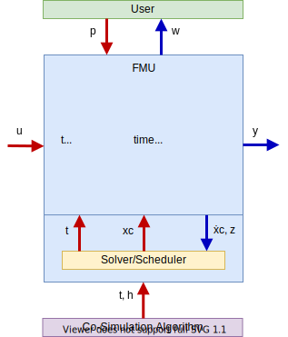

== Introduction

=== What is new in FMI 3.0 [[fmi-whats-new]]

The FMI Design Community has improved the FMI standard to react to new requirements from the system simulation community.

Especially the ability to package control code into FMUs required some workarounds in FMI 2.0.
With FMI 3.0, virtual electronic control units (vECUs) can be exported as FMUs in a more natural way.
Concrete features to support vECU export are:

* introduction of <<definitionOfTerminals,terminals>> to group variables semantically to ease connecting compatible signals,

* introduction of <<graphicalRepresentation,icons>> to define a graphical representation of the FMU and its terminals,

* introduction of <<Clock,Clocks>> to more exactly control timing of events and evaluation of model partitions across FMUs,

* introduction of more integer types and a 32-bit float type (see <<fmi-description-schema>>) to communicate native controller types to the outside,

* introduction of a binary type to support non-numeric data handling, such as complex sensor data interfaces,

* extension of variables to arrays for more efficient and natural handling of non-scalar variables,

* introduction of structural parameters that allow description and changing of array sizes, even during runtime to support advanced online calibration of control code, and

* addition of the new interface type "Scheduled Execution" (see <<fmi-for-scheduled-execution>>) that allows activation of individual model partitions by an external scheduler, e.g. on real-time platforms.

To allow implementation of more robust and efficient co-simulation algorithms, the following features were added to <<fmi-for-co-simulation,FMI for Co-Simulation>>:

* <<early-return,Early return>> from a <<fmi3DoStep>> call,

* <<EventMode>> (see <<state-machine-co-simulation,FMI Co-Simulation state machine>>),

* the <<IntermediateUpdateMode>>, and

* <<Clocks,Clocks and clocked variables>>.

Besides <<directionDerivatives,directional derivatives>>, now <<adjointDerivatives,adjoined derivatices>> of variables can be obtained.

The newly introduced <<BuildConfiguration>> simplifies the integration of source-code FMUs.

The following features have been removed:

* The asynchronous mode for FMUs known from FMI 2.0 CS: this mode was not supported by tools and it can be suitably replaced by Co-Simulation implementations that control the asynchronous computation of FMUs via separate processes/threads created for each FMU.

* The FMI `fmi2SetRealInputDerivatives` function: replaced by enabling the setting of inputs in <<IntermediateUpdateMode>>.

Parallel to the new standard features, the FMI Design Community has improved the standard quality by:

* modernizing the development methodology (e.g. moving to github and following the github process) and a text-based source format,

* publishing the FMI Standard now primarily as html to support easier navigation within the document and viewing on a wider range of devices,

* supplying a large set of continuously validated Reference FMUs, and

* integrating within the FMI Standard only validated C-code, XML and XSD snippets to reduce redundancy and ensure correctness.

=== Overview

The Functional Mock-up Interface (FMI) defines a ZIP archive and an application programming interface (API) to exchange dynamic models using a combination of XML files, binaries and C code: the Functional Mock-up Unit (FMU).
The API is used by a simulation environment, the importer, to create one or more instances of an FMU and to simulate them, typically together with other models.
The FMI defines three interface types:

* <<fmi-for-co-simulation,Co-Simulation (CS)>> where the FMU typically contains its own solver or scheduler,

* <<fmi-for-model-exchange,Model Exchange (ME)>> that requires the importer to perform numerical integration, and

* <<fmi-for-scheduled-execution,Scheduled Execution (SE)>> where the importer triggers the execution of the model partitions.

This document does not describe how to generate an FMU from a modeling environment.

The interface types have large parts in common, defined in <<fmi-common-concepts,Common Concepts>>.
In particular:

* FMI Application Programming Interface \(C) -- <<general-mechanisms>> +
All required computations are triggered by calling standardized C functions from the importer into the FMU.
The FMU can signal certain events back to the importer using callback functions provided by the importer.
C is used because it is the most portable programming language today and is the only programming language that can be utilized in all embedded control systems.
The FMI API does not restrict what operating system services an FMU can use on the platform it runs on.
However, for maximal portability, any dependency on the target platform should be minimized and operating system services should be accessed only through standard libraries.
Special run-time requirements should be documented in the appropriate directory inside the <<fmu-distribution,ZIP file>>.

* FMI Description Schema (XML) -- <<fmi-description-schema>> +
The schema defines the structure and content of a model description file (<<modelDescription.xml>>), for example, generated by a modeling environment.
This XML file contains the definition of all exposed variables, their interdependencies (model structure) and capability flags of the FMU.
Providing variable descriptions outside the C-API allows an importer to access and store the variable definitions (without any memory or efficiency overhead of standardized access functions) in its own representation.

* FMU Distribution (ZIP) -- <<fmu-distribution>> +
An FMU is distributed as one ZIP file.
The ZIP file contains the FMI <<modelDescription.xml>>, the binaries and libraries required to execute the FMI functions (.dll or .so files), and/or the sources of the FMI functions, documentation, and other data used by the FMU (e.g., tables or maps).

==== FMI for Model Exchange (ME)

The Model Exchange interface exposes an ODE to an external solver of an importing tool.
Models are described by differential, algebraic and discrete equations with time-, state- and step-events.
That integration algorithm of the importing tool, usually a ODE/DAE solver, is responsible for advancing time, setting states, handling events, etc.
(See <<fmi-for-model-exchange>>.)

.Schematic view of data flow between user, the solver of the importer and the FMU for Model Exchange
[#figure-model-exchange-data-flow]
image::images/model-exchange-data-flow.svg[width=40%, align="center"]

==== FMI for Co-Simulation (CS)

The Co-Simulation interface is designed both for the coupling of simulation tools, and the coupling of subsystem models, exported by a modeling environment together with their solvers as runnable code.
(See <<fmi-for-co-simulation>>.)

.Schematic view of data flow between user, the co-simulation algorithm of the importer and the FMU for Co-Simulation
[#figure-co-simulation-data-flow]

==== FMI for Scheduled Execution (SE)

The Scheduled Execution interface exposes individual <<model-partition, model partitions>>.
A scheduler provided by the <<importer>> can control the execution of each model partition separately.
In some ways the Scheduled Execution interface has similarities to the Model Exchange interface: the first externalizes a scheduling algorithm usually found in a controller algorithm (see <<fmi-for-scheduled-execution>>) and the second interface externalizes the ODE/DAE solver.

.Schematic view of data flow between user, the scheduler of the importer and model partitions of the FMU for Scheduled Execution
[#figure-scheduled-execution-data-flow]
image::images/scheduled-execution-data-flow.svg[width=40%, align="center"]

==== Feature Overview of the Interface Types

Co-Simulation FMUs contain all code necessary to abstract away the details of their internal computations.
This simplifies the importer compared to Model Exchange and Scheduled Execution, at the cost of reduced flexibility of use.

.Simplicity of import versus flexibility of use
image::images/fmi-types-overview.svg[width=50%, align="center"]

<<table-overview-features>> gives a non-normative overview of the features of the different interface types.

.Non-normative overview of features per interface type.
[[table-overview-features]]
[cols=",^,^,^",options="header"]
|====
|Feature
|Model Exchange
|Co-Simulation
|Scheduled Execution

|Advancing Time
|Call <<fmi3SetTime>>
|Call <<fmi3DoStep>> and monitor argument <<lastSuccessfulTime>>
|Call <<fmi3ActivateModelPartition>>

|Solver Included
|icon:times[]
|Possibly
|Possibly

|Scheduler included
|Possibly
|Possibly
|icon:times[]

|<<eventIndicator,Event Indicators>>
|icon:check[]
|icon:times[]
|icon:times[]

|<<early-return,Early Return>>
|Includes similar or better mechanism
|icon:check[]
|icon:times[]

|<<IntermediateUpdateMode,Intermediate Update>>
|Includes similar or better mechanism
|icon:check[]
|Signal output <<Clock>> ticks: icon:check[] +
Inputs/Outputs: icon:times[]

|<<Clock,Clocks>>
|icon:check[]
|icon:check[]
|icon:check[]

|Direct Feedthrough
|icon:check[]
|In <<EventMode>>: icon:check[] +
Else: icon:times[]
|icon:times[]
|====

=== Properties and Guiding Ideas

In this section, properties are listed and some principles are defined that guided the design of the FMI API and XML schema itself (not the content of the FMUs).
These principle may help the reader understand why certain design decisions have been made.
The listed principles are sorted, starting from high-level properties to low-level implementation issues.

Expressivity::
The FMI provides the necessary features to package models of different domains, such as multi-body and virtual ECUs, into an FMU.

Stability::
The FMI is expected to be supported by many simulation tools worldwide.
Implementing such support is a major investment for tool vendors.
Stability and backwards compatibility of the FMI has therefore high priority.

Implementation::
FMUs can be written manually or can be generated automatically from a modeling environment.
Existing manually coded models can be transformed manually to a model according to the FMI standard.

Processor and operating system independence::
It is possible to distribute an FMU without knowing the target processor.
This allows an FMU to run on a PC, a Hardware-in-the-Loop simulation platform or as part of the controller software of an ECU.
Keeping the FMU independent of the target processor increases the usability of the FMU.
To be processor and operating system independent, the FMU must include its C (or C++) sources.
To be maximally portable, FMUs must reduce their dependency on operating system services and use these only through standard library calls.

Simulator independence::
It is possible to compile, link and distribute an FMU without knowing the environment in which the FMU will be loaded.
+
Reason: The standard would be much less attractive otherwise, unnecessarily restricting the later use of an FMU at compile time and forcing users to maintain simulator specific variants of an FMU.
To be simulator independent, the FMU must export its implementation in self-contained binary form.
This requires the processor and target operating system (if dependencies exist) to be known.
Once exported with binaries, the FMU can be executed by any simulator running on the target platform (provided the necessary licenses are available, if required from the model or from the used runtime libraries).

Semantic versioning::
The FMI standard uses semantic version numbers, as defined in <<PW13>>, where the standard version consists of a triple of version numbers, consisting of major version, minor version, and patch version numbers, see <<VersioningLayered>>.

Version independence::
FMUs with a specific major and minor version number are valid FMUs w.r.t. the same major version and any minor version because features of minor versions are optional and ignorable.
+
Reason: A tool can always export the greatest minor version it supports.
Such an FMU can be imported into all tools supporting this major version and arbitrary minor versions.
This achieves maximal longevity of FMUs protecting its value for users.

Small runtime overhead::
Communication between an FMU and an importer through the FMI does not introduce significant runtime overhead.
This can be achieved by enabling caching of the FMU outputs and by exchanging multiple quantities with one call.

Small footprint::
The FMI standard shall not significantly increase the memory requirements of the binary.
+
Reason: An FMU may run on an ECU with strong memory limitations.
This is achieved by storing variable attributes (`name`, `unit`, etc.) and all other static information not needed for model evaluation in the separate <<modelDescription.xml>> that is not needed on the microprocessor where the executable might run.

Hide data structure::
The FMI does not prescribe a data structure (e.g., a C struct) to represent a model and its variables.
+
Reason: the FMI standard shall not unnecessarily restrict or prescribe a certain implementation of FMUs or simulators (whichever contains the model data) to ease implementation by different tool vendors.

Support many and nested FMUs::
A simulator may run many FMUs in a single simulation run and/or multiple instances of one FMU.
The inputs and outputs of these FMUs can be connected with direct feedthrough.
Moreover, an FMU may contain nested FMUs.

Numerical Robustness::
The FMI standard allows problems which are numerically critical (for example, <<time event,`time`>> and <<state event,`state events`>>, multiple sample rates, stiff problems) to be treated in a robust way.

Hide cache::
A typical FMU will cache computed results for later reuse.
To simplify usage and to reduce likelihood of programming errors by the importer, the caching mechanism is hidden from the usage of the FMU.
+
Reason: First, the FMI should not force an FMU to implement a certain caching policy.
Second, this helps to keep the FMI simple.
To help implement this cache, the FMI provides explicit methods called by the importer for setting properties that invalidate cached data.
An FMU that chooses to implement a cache may maintain a set of "dirty" flags, hidden from the importer.
A get method, for example to a state, will then either trigger a computation, or return cached data, depending on the value of these flags.

Support numerical solvers::
A typical importer for Model Exchange FMUs uses numerical solvers.
These solvers require vectors for <<state,`states`>>, <<derivative,`derivatives`>> and zero-crossing functions.
The FMU directly fills the values of such vectors provided by the solvers.
+
Reason: minimize execution time.
The exposure of these vectors conflicts somewhat with the "hide data structure" requirement, but the efficiency gain justifies this.

Explicit signature::
The intended operations, arguments, and return types are made explicit in the signature.
For example, an operator (such as `doStep`) is not passed as an integer argument but a special function is provided.
The `const` prefix is used for any pointer that should not be changed, including `const char*` instead of `char*`.
+
Reason: the correct use of the FMI can be checked at compile time and allows calling of the C code in a C++ environment (which is much stricter on `const` than C is).
This will help to develop FMUs that use the FMI in the intended way.

Few functions::
The FMI consists of a few, "orthogonal" functions, avoiding redundant functions that could be defined in terms of others.
+
Reason: This leads to a compact, easy-to-use, and hence attractive API with a compact documentation.

Error handling::
All FMI methods use a common set of methods to communicate errors.

Allocator must free::
All memory (and other resources) allocated by the FMU are freed (released) by the FMU.
Likewise, resources allocated by the importer are released by the importer.
+
Reason: this helps to prevent memory leaks and runtime errors due to incompatible runtime environments for different components.

Immutable strings::
All strings passed as arguments or returned are read-only and must not be modified by the receiver.
+
Reason: This eases the reuse of strings.

Named list elements::
Each element of lists defined in the `fmi3ModelDescription.xsd` have a string attribute called `name`.
This attribute must be unique with respect to all other `name` attributes of the same list.

Use C::
The FMI API is written in C, not C++, to avoid problems with compiler and linker dependent behavior, and to enable the use of FMUs on embedded systems.

This version of the FMI standard does not have the following desirable properties.
They might be added in a future version.

* The FMI for Model Exchange is for ordinary differential equations (ODEs) in state space form.
It is not for a general differential-algebraic equation (DAE) system.
However, algebraic equation systems inside the FMU are supported (for example, the FMU can report to the environment to re-run the current step with a smaller step size since a solution could not be found for an algebraic equation system).

* Special features that might be useful for multi-body system programs are not included.

* The interface is for simulation and for embedded systems.
Properties that might be additionally needed for trajectory optimization, for example, derivatives of the model with respect to parameters during continuous integration are not included.

* No explicit definition of the variable hierarchy in the XML file, except for terminal variables.

=== How to Read This Document

The core of this document is the description of the state machines and their states for each of the three interface types, each interface type in its own section.
Each state description starts with a brief state's purpose, then the mathematical model in a table linking formulas with C-API functions, and finally descriptions of all allowed functions for this particular state.

To keep the descriptions brief and redundancy low, <<fmi-common-concepts,common concepts>>, which are used by more than one interface type, are described once.

The standard document is in HTML allowing heavy use of in-document links: all state names, function names, many function arguments, XML elements and attributes are links to definitions or descriptions.
By pressing "t", the table of contents can be displayed on the left side or hidden.

Conventions used in this document:

* Non-normative text is given in square brackets in italic font: _[Especially examples are defined in this style.]_

* The key words "MUST", "MUST NOT", "REQUIRED", "SHALL", "SHALL NOT", "SHOULD", "SHOULD NOT", "RECOMMENDED", "MAY", and "OPTIONAL" in this document are to be interpreted as described in https://tools.ietf.org/html/rfc2119[RFC 2119] (regardless of formatting and capitalization).

[[VariableType,`{VariableType}`]]
* `{VariableType}` is used as a placeholder for all variable type names without the `fmi3` prefix (e.g. <<get-and-set-variable-values,`fmi3Get{VariableType}`>> stands for `fmi3GetUInt8`, `fmi3GetBoolean`, `fmi3GetFloat64`, `fmi3GetClock`, `fmi3GetBinary`, etc.).

[[VariableTypeExclClock,`{VariableTypeExclClock}`]]
* `{VariableTypeExclClock}` is used just like <<VariableType>>, except does not include functions on variable type `fmi3Clock`.

* State machine states are formatted as *bold* link, e.g. <<InitializationMode>>.
