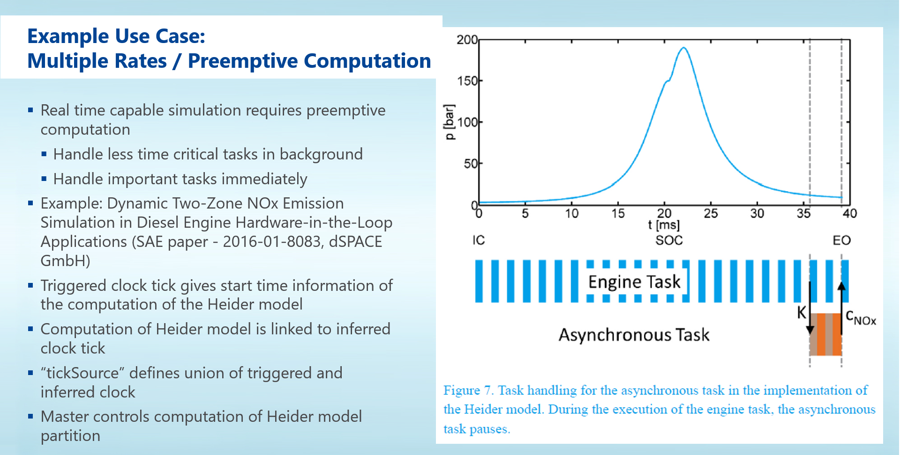

=== FMI Application Programming Interface [[fmi-application-programming-interface]]

This section contains the common interface definitions to execute functions of an FMU from a C program.

Note that the following general properties hold for an FMU:

- FMI functions of one instance do not need to be thread-safe. +
_[For example, if the functions of one instance of an FMU are accessed from more than one thread;
the multi-threaded environment that uses the FMU must guarantee that the calling sequences of functions defined in <<state-machine-model-exchange>> and <<state-machine-co-simulation>>. are used.
The FMU itself does not implement any services to support this.]_

- FMI functions must not change global settings which affect other processes/threads.
An FMI function may change settings of the thread in which it is called (such as floating point control registers), provided these changes are restored before leaving the function or before a callback function is called. +
_[This property ensures that functions of different FMU instances can be called safely in any order._
_Additionally, they can be called in parallel provided the functions are called in different process/threads._
_If an FMI function changes for example the floating point control word of the CPU, it must restore the previous value before return of the function._
_For x86 CPUs, the floating point control word is set using the `fldcw` instruction._
_This can be used to switch on additional exceptions such as floating point division by zero._
_An FMU might temporarily change the floating point control word and get notified on floating point exceptions internally, but has to restore the flag and clear the floating point status word before return of the respective FMI function.]_

==== Header Files and Naming of Functions [[header-files-and-naming-of-functions]]

Three header files are provided that define the interface of an FMU.
In all header files the convention is used that all C function and type definitions start with the prefix `fmi3`:

`fmi3PlatformTypes.h`::
contains the type definitions of the <<input>> and output arguments of the functions as well as some C preprocessor macro defintions for constants.
This header file must
be used both by the FMU and by the target simulator.
_[Example of a definition in this header file:_
+
[source, C]
----
typedef double fmi3Float64;
----
+
_]_

`fmi3FunctionTypes.h`::
contains `typedef` definitions of all function prototypes of an FMU as well as enumerations for constants.
This header file includes `fmi3PlatformTypes.h`.
When dynamically loading an FMU, these definitions can be used to type-cast the function pointers to the respective function definition.
// TODO: add note why "TYPE" suffix is necessary
+
// TODO: include example from header
_[Example of a definition in this header file:_
+
[source, C]
----
typedef fmi3Status fmi3SetTimeTYPE(fmi3Instance, fmi3Float64);
----
+
_]_

`fmi3Functions.h`::
contains the function prototypes of an FMU that can be accessed in simulation environments and that are defined in <<fmi-common-concepts>>, <<fmi-for-model-exchange>> and <<fmi-for-basic-co-simulation>>.
+
This header file includes `fmi3PlatformTypes.h` and `fmi3FunctionTypes.h`.
The header file version number for which the model was compiled, can be inquired in the target simulator with <<fmi3GetVersion>> (see <<inquire-platform-and-version-number>>). +
+
_[Example of a definition in this header file:_
+
[source, C]
----
FMI3_Export fmi3SetTimeTYPE fmi3SetTime;
----
+
_For Microsoft and Cygwin compilers `FMI3_Export` is defined as_ `pass:[__]declspec(dllexport)` _and for Gnu-Compilers as_ `pass:[__]attribute__ ( ( visibility("default") ) )` _in order to export the name for dynamic loading._
_Otherwise it is an empty definition.]_

The goal is that both textual and binary representations of FMUs are supported and that several FMUs might be present at the same time in an executable (for example, FMU A may use an FMU B).
In order for this to be possible, the names of the functions in different FMUs must be different, or function pointers must be used.
To support the first variant macros are provided in `fmi3Functions.h` to build the actual function names by using a function prefix that depends on how the FMU is shipped.

_[These macros can be defined differently in a target specific variant of `fmi3Functions.h` to adjust them to the requirements of the supported compilers and platforms of the importing tool.]_

An FMU C-file must include at the beginning a `define` of `FMI3_FUNCTION_PREFIX` with the same value as the value of the `modelIdentifier` attribute defined in `<fmiModelDescription><ModelExchange>` or `<fmiModelDescription><CoSimulation>` together with `pass:[_]` at the end (see <<ModelExchange>> and <<basic-co-simulation-schema>>).

This `define` must be directly followed with an `#include "fmi3Functions.h"` statement.

Typically, FMU functions are used as follows:

[source, C]
----
// FMU is shipped with C source code, or with static link library
#define FMI3_FUNCTION_PREFIX MyModel_
#include "fmi3Functions.h"
< usage of the FMU functions e.g. MyModel_fmi3SetTime >

// FMU is shipped with DLL/SharedObject
#include "fmi3FunctionTypes.h"
fmi3SetTimeTYPE *myname_setTime = < load symbol "fmi3SetTime" from DLL/SharedObject >;
< usage of the FMU function pointers, e.g. myname_setTime >
----

A function that is defined as `fmi3GetFloat64` is changed by the macros to a function name as follows:

- If the FMU is shipped with C source code or with static link library: +
The constructed function name is `MyModel_fmi3GetFloat64`.
In other words the function name is prefixed with the model name and an `pass:[_]`.
A simulation environment can therefore construct the relevant function names by generating code for the actual function call.
In case of a static link library, the name of the library is `MyModel.lib` on Windows and `libMyModel.a` on Linux; in other words the `modelIdentifier` attribute is used to create the library name.

- If the FMU is shipped with DLL/SharedObject: +
The constructed function name is `fmi3GetFloat64`, in other words, it is not changed.
_[This can be realized in the case of a source code FMU with a target-specific version of `fmi3Functions.h` that does not use FMI3_FUNCTION_PREFIX to construct the function names.]_
A simulation environment will then dynamically load this library and will explicitly import the function symbols by providing the FMI function names as strings.
The name of the library is `MyModel.dll` on Windows or `MyModel.so` on Linux; in other words the `modelIdentifier` attribute is used as library name.

_[An FMU can be optionally shipped so that it basically contains only the communication to another tool (`needsExecutionTool = true`, see <<fmi-for-basic-co-simulation>>)._
_This is particularily common for co-simulation tasks._
_In this tool coupling case one DLL/Shared Object can be used for all models due to no function prefixing.]_

Since `modelIdentifier` is used as prefix of a C-function name it must fulfill the restrictions on C-function
names (only letters, digits and/or underscores are allowed).
_[For example, if `modelName = "A.B.C"`, then `modelIdentifier` might be "A_B_C".]_
Since `modelIdentifier` is also used as name in a file system, it must also fulfill the restrictions of the targeted operating system.
Basically, this means that it should be short.
For example, the Windows API only supports full path-names of a file up to 260 characters (see: http://msdn.microsoft.com/en-us/library/aa365247%28VS.85%29.aspx).

==== Platform Dependent Definitions (fmi3PlatformTypes.h)

To simplify porting, no C types are used in the function interfaces, but the alias types are defined in this section.
All definitions in this section are provided in the header file `fmi3PlatformTypes.h`.
It is required to use this definition for all binary FMUs.
_[Only for source code FMUs, a change might be useful in some cases.]_:

[source, C]
----
include::../headers/fmi3PlatformTypes.h[tags=Component]
----

This is a pointer to an FMU specific data structure that contains the information needed to process the model equations or to process the co-simulation of the respective slave.
This data structure is implemented by the environment that provides the FMU; in other words, the calling environment does not know its content, and the code to process it must be provided by the FMU generation environment and must be shipped with the FMU.

[source, C]
----
include::../headers/fmi3PlatformTypes.h[tags=ComponentEnvironment]
----

This is a pointer to a data structure in the simulation environment that calls the FMU.
Using this pointer, data from the `modelDescription.xml` file _[for example, mapping of <<valueReference>>pass:[s] to variable names]_ can be transferred between the simulation environment and the <<logMessage>> function (see <<creation-destruction-and-logging>>).

[source, C]
----
include::../headers/fmi3PlatformTypes.h[tags=FMUState]
----

This is a pointer to a data structure in the FMU that saves the internal FMU state of the actual or a previously saved time instant.
This allows to restart a simulation from a saved FMU state (see <<get-set-fmu-state>>).

[source, C]
----
include::../headers/fmi3PlatformTypes.h[tags=ValueReference]
----

This is a handle to a (base type) variable value of the model.
A handle uniquely identifies the value of a variable.
Variables that have the same handle, always have identical values, but other parts of the variable definition might be different _[for example, min/max attributes]_.

Structured entities, such as records, must be flattened into a set of values (scalars or arrays) of type `fmi3Float64`, `fmi3Int32` etc.
Arrays may be flattened into a set of scalars or represented directly as array values.
An `fmi3ValueReference` references one such value (scalar or array).
The coding of `fmi3ValueReference` is a "secret" of the environment that generated the FMU.
The interface to the equations only provides access to variables via this handle.
Extracting concrete information about a variable is specific to the used environment that reads the Model Description File in which the value handles are defined.
If a function in the following sections is called with a wrong `fmi3ValueReference` value _[for example, setting a constant with a call to `fmi3SetFloat64`]_, then the function has to return with an error ( `fmi3Status = fmi3Error`, see <<status-returned-by-functions>>).

[source, C]
----
include::../headers/fmi3PlatformTypes.h[tags=VariableTypes]
----

These data types are the base types used in the interfaces of the C functions.

The data types `fmi3Float32`, `fmi3Float64`, `fmi3Int8`, `fmi3UInt8`, `fmi3Int16`, `fmi3UInt16`, `fmi3Int32`, `fmi3UInt32`, `fmi3Int64`, `fmi3UInt64` and `fmi3Boolean` are called "numeric types" in the following.

If an `fmi3String` or an `fmi3Binary` variable is passed as `input` argument to an FMI function and the FMU needs to use the string/binary later,
the FMI function must copy the string/binary before it returns and store it in the internal FMU memory,
because there is no guarantee for the lifetime of the string/binary after the function has returned.

If an `fmi3String` or an `fmi3Binary` variable is passed as `output` argument from an FMI function and the string/binary shall be used in the target environment,
the target environment must copy the whole string/binary (not only the pointer).
The memory of this string/binary may be deallocated by the next call to any of the FMI interface functions (the string/binary memory might also be just a buffer, that is reused).

==== Status Returned by Functions [[status-returned-by-functions]]

This section defines the `status` flag (an enumeration of type `fmi3Status` defined in file `fmi3FunctionTypes.h` ) that is returned by all functions to indicate the success of the function call:

[source, C]
----
include::../headers/fmi3FunctionTypes.h[tags=Status]
----

Status returned by functions.
The status has the following meaning

`fmi3OK`::
all well.

`fmi3Warning`::
things are not quite right, but the computation can continue.
Function <<logMessage>> was called in the model (see below), and it is expected that
this function has shown the prepared information message to the user.

`fmi3Discard`::
this return status is only possible if explicitly defined for the corresponding function.
_[Functions `fmi3Set{VariableType}` are usually not performing calculations but just store the passed values in internal buffers._
_The actual calculation is performed by `fmi3Get{VariableType}` functions._
_Still `fmi3Set{VariableType}` functions could check whether the input arguments are in their validity range._
_If not, these functions could return with `fmi3Discard`.]_
(Model Exchange: `fmi3Set{VariableType}`, <<fmi3SetContinuousStates>>, `fmi3Get{VariableType}`, <<fmi3GetDerivatives>>, <<fmi3GetContinuousStates>>, <<fmi3GetEventIndicators>>; Co-Simulation: `fmi3Set{VariableType}`, <<fmi3DoStep>>):
+
For Model Exchange: It is recommended to perform a smaller step size and evaluate the model equations again, for example because an iterative solver in the model did not converge or because a function is outside of its domain _[for example, `sqrt(<negative number>)`]_.
If this is not possible, the simulation has to be terminated.
+
For Co-Simulation: `fmi3Discard` is returned also if the slave is not able to return the required status information.
The master has to decide if the simulation run can be continued. +
In both cases, function <<logMessage>> was called in the FMU (see below), and it is expected that this function has shown the prepared information message to the user if the FMU was called in debug mode (`loggingOn = fmi3True`).
Otherwise, <<logMessage>> should not show a message.

`fmi3Error`::
the FMU encountered an error.
The simulation cannot be continued with this FMU instance.
If one of the functions returns `fmi3Error`, it can be tried to restart the simulation from a formerly stored FMU state by calling <<fmi3SetFMUState>>.
This can be done if the capability flag `canGetAndSetFMUState = true` and <<fmi3GetFMUState>> was called before in non-erroneous state.
If not, the simulation cannot be continued and <<fmi3FreeInstance>> or <<fmi3Reset>> [.underline]#must# be called afterwards.
_[Typically, `fmi3Error` return is for non-numerical reasons, like "disk full"._
_There may be cases where the environment can fix such errors (possibly with the help of the user), and the simulation can continue at the last consistent state set with <<fmi3SetFMUState>>.]_ +
Further processing is possible after this call; especially other FMU instances are not affected.
Function <<logMessage>> was called in the FMU (see below), and it is expected that this function has shown the prepared information message to the user.

`fmi3Fatal`::
the model computations are irreparably corrupted for all FMU instances.
_[For example, due to a run-time exception such as access violation or integer division by zero during the execution of an fmi function]_.
Function <<logMessage>> was called in the FMU (see below), and it is expected that this function has shown the prepared information message to the user.
It is not possible to call any other function for any of the FMU instances.

==== Inquire Platform and Version Number of Header Files [[inquire-platform-and-version-number]]

This section documents functions to inquire information about the header files used to compile its functions.

[[fmi3GetVersion,`fmi3GetVersion`]]
[source, C]
----
include::../headers/fmi3FunctionTypes.h[tags=GetVersion]
----

Returns the version of the `fmi3Functions.h` header file which was used to compile the functions of the FMU.
The function returns `fmi3Version` which is defined in this header file.
The standard header file as documented in this specification has version `"3.0"` (so this function usually returns `"3.0"`).

==== Creation, Destruction and Logging of FMU Instances [[creation-destruction-and-logging]]

This section documents functions that deal with instantiation, destruction and logging of FMUs.

[[fmi3Instantiate,`fmi3Instantiate`]]
[source, C]
----
include::../headers/fmi3FunctionTypes.h[tags=Instantiate]
----

The function returns a new instance of an FMU.
If a null pointer is returned, then instantiation failed.
In that case, `functions->logMessage` is called with detailed information about the reason.
An FMU can be instantiated many times (provided capability flag `canBeInstantiatedOnlyOncePerProcess = false`).

This function must be called successfully before any of the following functions can be called.

Argument `instanceName` is a unique identifier for the FMU instance.
It is used to name the instance, for example, in error or information messages generated by one of the `fmi3XXX` functions.
It is not allowed to provide a null pointer and this string must be non-empty (in other words, must have at least one character that is no white space).
_[If only one FMU is simulated, as `instanceName` attribute `modelName` or `<ModelExchange/CoSimulation modelIdentifier="..">` from the XML schema `fmi3ModelDescription` might be used.]_

Argument `fmuType` defines the type of the FMU:

`fmi3ModelExchange`::
FMU with initialization and events; between events simulation of continuous systems is performed with external integrators from the environment (see <<fmi-for-model-exchange>>).
The modelDescription has to include the Element with name `ModelExchange` to be allowed to set the `fmuType` to `fmi3ModelExchange`.

`fmi3CoSimulation`::
Black box interface for Basic Co-Simulation (see <<fmi-for-basic-co-simulation>>).
The modelDescription has to include the Element with name `CoSimulation` to be allowed to set the `fmuType` to `fmi3CoSimulation`.

Argument `fmuInstantiationToken` can be used by the FMU to check that the `modelDescription.xml` file (see <<fmu-distribution>>) is compatible with the implementation of the FMU.
It is an opaque string generated by the FMU exporter that is stored in the xml file as mandatory attribute instantiationToken (see <<fmiModelDescription>>).
It must be passed unchanged to the FMU, this argument must not be null.

Argument `fmuResourceLocation` is a URI according to the http://datatracker.ietf.org/doc/rfc3986/[IETF RFC3986] syntax to indicate the location to the `resources` directory of the unzipped FMU archive.
The following schemes must be understood by the FMU:

- Mandatory: `file` with absolute path (either including or omitting the authority component)

- Optional: `http`, `https`, `ftp`

_[Example: An FMU is unzipped in directory `C:\temp\MyFMU`, then `fmuResourceLocation` = `file:///C:/temp/MyFMU/resources` or `file:/C:/temp/MyFMU/resources`._
_Function <<fmi3Instantiate>> is then able to read all needed resources from this directory, for example maps or tables used by the FMU.]_

Argument `functions` provides callback functions to be used from the FMU functions to utilize resources from the environment (see type <<fmi3CallbackFunctions>> below).

Argument `visible = fmi3False` defines that the interaction with the user should be reduced to a minimum (no application window, no plotting, no animation, etc.).
In other words, the FMU is executed in batch mode.
If `visible = fmi3True`, the FMU is executed in interactive mode, and the FMU might require to explicitly acknowledge start of simulation / instantiation / initialization (acknowledgment is non-blocking).

If `loggingOn = fmi3False`, then any logging is disabled and the logger function is not called by the FMU.
If `loggingOn = fmi3True`, the FMU enables a vendor defined set of LogCategories.
This set should typically contain categories for messages that explain execution errors, like `fmi3Discard`, `fmi3Error` and `fmi3Fatal`.
The function <<fmi3SetDebugLogging>> gives more detailed control about required LogCategories (see <<definition-of-log-categories>>).

Argument `fmuCoSimulationConfiguration` is used to configure Co-Simulation features used by the Co-Simulation master.
//TODO: add cross reference
It is only used if `fmuType = fmi3CoSimulation`.
It is NULL for fmuType `fmi3ModelExchange`.

[[fmi3CallbackFunctions,`fmi3CallbackFunctions`]]
[source, C]
----
include::../headers/fmi3FunctionTypes.h[tags=CallbackFunctions]
----

These function pointers are provided by the environment to be used by the FMU.
It is not allowed to change these functions between <<fmi3Instantiate>> and <<fmi3Terminate>> calls.
Additionally, a pointer to the environment is provided (instanceEnvironment) that needs to be passed to all of the callback functions, in order that those functions can utilize data from the environment, such as mapping a <<valueReference>> to a string, or assigning memory to a certain FMU instance.

The `instanceEnvironment` pointer is also passed to the <<fmi3CallbackIntermediateUpdate>> function in order that the environment can provide an efficient way to identify the slave that called <<fmi3CallbackIntermediateUpdate>>.

In the default `fmi3FunctionTypes.h` file, typedefs for the function definitions are present to simplify the usage; this is non-normative.
The functions have the following meaning:

[[logMessage,`logMessage`]]
Function `logMessage`::
Pointer to a function that is called in the FMU, usually if an `fmi3XXX` function does not behave as desired.
If <<logMessage>> is called with `status = fmi3OK`, then the message is a pure information message.
`instanceName` is the instance name of the model that calls this function.
`category` is the category of the message.
The meaning of `category` is defined by the modeling environment that generated the FMU.
Depending on this modeling environment, none, some or all allowed values of `category` for this FMU are defined in the `modelDescription.xml` file via element `<fmiModelDescription><LogCategories>`, see <<definition-of-log-categories>>.
Only messages are provided by function <<logMessage>> that have a category according to a call to <<fmi3SetDebugLogging>> (see below).
Argument `message` is a string that contains the message.
_[Typically, this function prints the message and stores it optionally in a log file.]_
+
All string-valued arguments passed by the FMU to the <<logMessage>> may be deallocated by the FMU directly after function <<logMessage>> returns.
The environment must therefore create copies of these strings if it needs to access these strings later. +
The <<logMessage>> function will append a line break to each message when writing messages after each other to a terminal or a file (the messages may also be shown in other ways, for example, as separate text-boxes in a GUI).
The caller may include line-breaks (using "\n") within the message, but should avoid trailing line breaks. +
Variables can be referenced in a message with `pass:[#]<ValueReference>pass:[#]`.
If the character `pass:[#]` shall be included in the message, it has to be prefixed with `pass:[#]`, so `pass:[#]` is an escape character.
+
_[Example: The message `\#1365# must be larger than zero (used in IO channel ##4)` might be changed by the <<logMessage>> function to `body.m must be larger than zero (used in IO channel #4)` if `body.m` is the name of the variable with value reference 1365.]_

[[allocateMemory,`allocateMemory`]]
Function `allocateMemory`::
Pointer to a function that is called in the FMU if memory needs to be allocated.
If attribute `canNotUseMemoryManagementFunctions = true` in `<fmiModelDescription><ModelExchange / CoSimulation>`, then function <<allocateMemory>> is not used in the FMU and a null pointer can be provided.
If this attribute has a value of `false` (which is the default), the FMU must not use `malloc`, `calloc` or other memory allocation functions.
One reason is that these functions might not be available for embedded systems on the target machine.
Another reason is that the environment may have optimized or specialized memory allocation functions.
<<allocateMemory>> returns a pointer to space for a vector of `nobj` objects, each of size `size` or `NULL`, if the request cannot be satisfied.
The space is initialized to zero bytes _[(a simple implementation is to use `calloc` from the C standard library)]_.

[[freeMemory,`freeMemory`]]
Function `freeMemory`::
Pointer to a function that must be called in the FMU if memory is freed that has been allocated with <<allocateMemory>>.
If a null pointer is provided as input argument `obj`, the function shall perform no action _[(a simple implementation is to use free from the C standard library; in ANSI C89 and C99, the null pointer handling is identical as defined here)]_.
If attribute `canNotUseMemoryManagementFunctions = true` in `<fmiModelDescription><ModelExchange / CoSimulation>`, then function <<freeMemory>> is not used in the FMU and a null pointer can be provided.

[[intermediateUpdate,`intermediateUpdate`]]
Function `intermediateUpdate`::
This callback allows internal events of different types (e.g. associated to <<outputClock>> ticks or intermediate variable access) to be signaled from an FMU to the Co-Simulation master.
For Hybrid Co-Simulation and Scheduled Co-Simulation or if any of the intermediate variable access modes is set to `true`, the callback function <<fmi3CallbackIntermediateUpdate>> must be passed to <<fmi3Instantiate>>.
In other cases a `NULL` can be assigned to the `intermediateUpdate` callback.

Function `lockPreemption` and `unlockPreemption`::
To provide more options to secure the code against unwanted preemption these callback functions are defined.
They can be used to prevent preemption for certain code parts enclosed by `lockPreemption` and `unlockPreemption` in Scheduled Co-Simulation.
Even if the Co-Simulation master does not support preemption, at least an empty implementation of these callback functions must be provided to allow the reuse of code for different modes together with an efficient preemption.

[[fmi3FreeInstance,`fmi3FreeInstance`]]
[source, C]
----
include::../headers/fmi3FunctionTypes.h[tags=FreeInstance]
----

Disposes the given instance, unloads the loaded model, and frees all the allocated memory and other resources that have been allocated by the functions of the FMU interface.
If a null pointer is provided for `c`, the function call is ignored (does not have an effect).

[[fmi3SetDebugLogging,`fmi3SetDebugLogging`]]
[source, C]
----
include::../headers/fmi3FunctionTypes.h[tags=SetDebugLogging]
----
The function controls debug logging that is output via the logger function callback.

If `loggingOn = fmi3True`, debug logging is enabled, otherwise it is switched off.
If `loggingOn = fmi3True` and `nCategories = 0`, then all debug messages shall be output.
If `loggingOn = fmi3True` and `nCategories > 0`, then only debug messages according to the `categories` argument shall be printed via the <<logMessage>> function.
Vector `categories` has `nCategories` elements.
The allowed values of `categories` are defined by the modeling environment that generated the FMU.
Depending on the generating modeling environment, none, some or all allowed values for `categories` for this FMU are defined in the `modelDescription.xml` file via element `fmiModelDescription.LogCategories`, see <<definition-of-log-categories>>.

==== Configuration, Initialization, Termination, and Resetting an FMU

This section documents functions that deal with configuration, initialization, termination, and resetting of an FMU.

[[fmi3SetupExperiment,`fmi3SetupExperiment`]]
[source, C]
----
include::../headers/fmi3FunctionTypes.h[tags=SetupExperiment]
----

Informs the FMU to setup the experiment.
This function must be called after <<fmi3Instantiate>> and before <<fmi3EnterInitializationMode>> is called.
Arguments `toleranceDefined` and `tolerance` depend on the FMU type:

`fmuType = fmi3ModelExchange`::
If `toleranceDefined = fmi3True`, then the model is called with a numerical integration scheme where the step size is controlled by using `tolerance` for error estimation (usually as relative 'tolerance').
In such a case all numerical algorithms used inside the model (for example, to solve non-linear algebraic equations) should also operate with an error estimation of an appropriate smaller relative tolerance.

`fmuType = fmi3CoSimulation`::
If `toleranceDefined = fmi3True`, then the communication step size of the slave is controlled by error estimation.
In case the slave utilizes a numerical integrator with variable step size and error estimation, it is suggested to use `tolerance` for the error estimation of the internal integrator (usually as relative tolerance). +
An FMU for Co-Simulation might ignore this argument.

The arguments `startTime` and `stopTime` can be used to check whether the model is valid within the given boundaries or to allocate memory which is necessary for storing results.
Argument `startTime` is the <<fixed>> <<initial>> value of the <<independent>> variable _[(that is defined with <<causality>> = <<independent>> in the `modelDescription.xml`]_). _[If the <<independent>> variable is `time`, `startTime` is the starting time of initializaton.]_
If `stopTimeDefined = fmi3True`, then `stopTime` is the defined final value of the <<independent>> variable.
_[If the <<independent>> variable is `time`, `stopTime` is the stop time of the simulation.]_
If the environment tries to compute past `stopTime` the FMU has to return `fmi3Status = fmi3Error`.
If `stopTimeDefined = fmi3False`, then no final value of the <<independent>> variable is defined and argument `stopTime` is meaningless.

[[fmi3EnterConfigurationMode,`fmi3EnterConfigurationMode`]]
[source, C]
----
include::../headers/fmi3FunctionTypes.h[tags=EnterConfigurationMode]
----

Informs the FMU to enter the *Configuration Mode* or *Reconfiguration Mode*.

[[fmi3ExitConfigurationMode,`fmi3ExitConfigurationMode`]]
[source, C]
----
include::../headers/fmi3FunctionTypes.h[tags=ExitConfigurationMode]
----

Informs the FMU to exit the *Configuration Mode* or *Reconfiguration Mode*.

[[fmi3EnterInitializationMode,`fmi3EnterInitializationMode`]]
[source, C]
----
include::../headers/fmi3FunctionTypes.h[tags=EnterInitializationMode]
----

Informs the FMU to enter *Initialization Mode*.
Before calling this function, all variables with attribute <<initial>> = <<exact>> or <<approx>> can be set with the `fmi3Set{VariableType}` functions (the variable attributes are defined in the Model Description File, see <<definition-of-model-variables>>).
Setting other variables is not allowed.
Furthermore, <<fmi3SetupExperiment>> must be called at least once before calling <<fmi3EnterInitializationMode>>, in order that `startTime` is defined.

[[fmi3ExitInitializationMode,`fmi3ExitInitializationMode`]]
[source, C]
----
include::../headers/fmi3FunctionTypes.h[tags=ExitInitializationMode]
----

Informs the FMU to exit *Initialization Mode*.
For `fmuType = fmi3ModelExchange`, this function switches off all initialization equations, and the FMU enters *Event Mode* implicitly; that is, all continuous-time and active discrete-time equations are available.

[[fmi3Terminate,`fmi3Terminate`]]
[source, C]
----
include::../headers/fmi3FunctionTypes.h[tags=Terminate]
----

Informs the FMU that the simulation run is terminated.
After calling this function, the final values of all variables can be inquired with the `fmi3Get{VariableType}` functions.
It is not allowed to call this function after one of the functions returned with a status flag of `fmi3Error` or `fmi3Fatal`.

[[fmi3Reset,`fmi3Reset`]]
[source, C]
----
include::../headers/fmi3FunctionTypes.h[tags=Reset]
----

Is called by the environment to reset the FMU after a simulation run.
The FMU goes into the same state as if <<fmi3Instantiate>> would have been called.
All variables have their default values.
Before starting a new run, <<fmi3SetupExperiment>> and <<fmi3EnterInitializationMode>> have to be called.

==== Getting and Setting Variable Values [[get-and-set-variable-values]]

All variables of an FMU are identified with a handle called "value reference".
The handle is defined in the `modelDescription.xml` file as attribute <<valueReference>> in variable elements.
Each variable must have a unique <<valueReference>>.

Variables can be scalar or array variables.
When getting or setting the values of array variables, the serialization of array variable values used in C-API function calls, as well as in the XML <<start>> attributes is defined as row major - i.e. dimension order from left to right for the C-API (e.g. `array[dim1][dim2]...[dimN]`), and document order in the XML attributes.
For this serialization of array variables the sparsity pattern of the array is not taken into account.
All elements of the array, including structural zeros, are serialized.

_[Example: A 2D matrix_
[latexmath]
++++
A = \left( \begin{array}{cc} a_{11}&a_{12}\\
                             a_{21}&a_{22}\\
                             a_{31}&a_{32}\\
            \end{array} \right)
++++
_is serialized as follows:_
[frame="none",grid="none"]
|========================================
|_A[0][0]=a11_ | _memory  address: A_   |
|_A[0][1]=a12_ | _memory  address: A+1_ |
|_A[1][0]=a21_ | _memory  address: A+2_ |
|_A[1][1]=a22_ | _memory  address: A+3_ |
|_A[2][0]=a31_ | _memory  address: A+4_ |
|_A[2][1]=a32_ | _memory  address: A+5_ |
|========================================
_]_

The actual values of the variables that are defined in the `modelDescription.xml` file can be inquired after calling <<fmi3EnterInitializationMode>> with the following functions:

[source, C]
----
include::../headers/fmi3FunctionTypes.h[tags=Getters]
----

Get actual values of variables by providing their variable references.
_[These functions are especially used to get the actual values of output variables if a model is connected with other models.
Since state derivatives are also variables, it is possible to get the value of a state derivative.
This is useful when connecting FMUs together.
Furthermore, the actual value of every variable defined in the `modelDescription.xml` file can be determined at the actually defined time instant (see <<definition-of-model-variables>>).]_

- Argument `valueReferences` is a vector of `nValueReferences` value handles that define the variables that shall be inquired.

- Argument `values` is a vector with the actual values of these variables.

- Argument `sizes` is a vector with the actual sizes of the values for binary variables.

- Argument `nValues` provides the number of values in the `values` vector (and `sizes` vector, where applicable) which is only equal to `nValueReferences` if all <<valueReference>>pass:[s] point to scalar variables.

- The strings returned by `fmi3GetString`, as well as the binary values returned by `fmi3GetBinary`, must be copied in the target environment because the allocated memory for these strings might be deallocated by the next call to any of the fmi3 interface functions or it might be an internal string buffer that is reused.

- For Model Exchange: `fmi3Status = fmi3Discard` is possible for `fmi3GetFloat32` and `fmi3GetFloat64` only, but not for `fmi3Get*Int*`, `fmi3GetBoolean`, `fmi3GetString`, `fmi3GetBinary`, because these are discrete-time variables and their values can only change at an event instant where `fmi3Discard` does not make sense.

It is also possible to set the values of certain variables at particular instants in time using the following functions:

[source, C]
----
include::../headers/fmi3FunctionTypes.h[tags=Setters]
----

Set <<parameter,`parameters`>>, <<input,`inputs`>>, and <<start>> values, and re-initialize caching of variables that depend on these variables (see <<definition-of-model-variables>> for the exact rules on which type of variables `fmi3Set{VariableType}` can be called, as well as <<state-machine-model-exchange>> in case of Model Exchange and <<state-machine-co-simulation>> in case of Co-Simulation).

- Argument `valueReferences` is a vector of `nValueReferences` value handles that define the variables that shall be set.

- Argument `values` is a vector with the actual values of these variables.

- Argument `sizes` is a vector with the actual sizes of the values of binary variables.

- Argument `nValues` provides the number of values in the `values` vector (and `sizes` vector, where applicable) which is only equal to `nValueReferences` if all <<valueReference>>pass:[s] point to scalar variables.

- All strings passed as arguments to `fmi3SetString`, as well as all binary values passed as arguments to `fmi3SetBinary`, must be copied inside these functions, because there is no guarantee of the lifetime of strings or binary values, when these functions return.

- Note, `fmi3Status = fmi3Discard` is possible for the `fmi3Set{VariableType}` functions.

For Co-Simulation FMUs, additional functions are defined in <<transfer-of-input-output-and-parameters>> to set and inquire <<derivative,`derivatives`>> of variables with respect to time in order to allow interpolation.

The value of a variable may only be accessed with the respective `fmi3Get/Set{VariableType}` for its type.

==== Operation on Clocks [[operation-on-clocks]]

In the following section the operations on <<clock,`clocks`>> are described.
Clocks are defined for the evaluation of *clocked model partitions* and the related definition of suitable *communication points*.
Two types of <<clock,`clocks`>> are available, designed to address similar use cases with differences in details.
One <<clock>> type (Synchronous Clocks) complies with the limitations imposed by the synchronous clock theory, the other clock type (Communication Point Clocks) is a general purpose co-simulation clock for providing suitable communication points for the timed evaluation of model partitions.
The term <<clock>> and clocked is therefore used for both <<clock>> types.
Both clock types can handle two different variants, the <<inputClock,`input clocks`>> and the <<outputClock,`output clocks`>>.
First the two different clock types are presented with the mathematical definition of their use cases.
After that the two clock variants are described. The section ends with a short description of connecting clocked FMUs.

===== Clock Types for Evaluation of Clocked Model Partitions [[clock-types-for-evaluation-of-clocked-model-partitions]]

====== Synchronous Clocks

A set of equations that are associated to a <<clock>> and are executed when the corresponding <<clock>> is active, is called a clocked partition.
A clocked partition is mathematically defined as:

[latexmath]
++++
x_j=\begin{cases}
    x_{j-1} & \text{if subactive}\\
    f_j(x_{j-1},u_j,t_j) & \text{else}
    \end{cases}
++++

[latexmath]
++++
y_j=g_j(x_{j-1},u_j,t_j);
++++

[latexmath]
++++
\text{mit } j=0,1,2,...;x_{-1}=x_{start}
++++

Variables latexmath:[x_j] are called `states of a clocked partition`, or `discrete-time states` and latexmath:[j] is the latexmath:[j+1]th tick of the associated <<clock>>.
Variables latexmath:[u_j] are the (external or <<local>>) <<input,`inputs`>> and latexmath:[y_j] are the (external or <<local>>) <<output,`outputs`>> of a clocked partition.
A discrete-time <<state>> can be from any type of a variable (with exception of a <<clock>>) such as of type `fmi3Float64` or `fmi3Boolean`.
A clocked partition is not executed during *Initialization Mode*, but it is executed the first time at its first <<clock>> tick.
The associated <<clock>> of the model partion is synchronous to its discrete-time <<state,`states`>>.
Discrete-time <<state,`states`>> are listed in the ModelStructure.
They can have initial values defined by xml-attributes <<initial>> and <<start>>, or the initial values are computed internally as a function of parameters.

There are two kinds of evaluation modes:
[start=1]
. Regular evaluation for an active <<clock>>: <<state>> and <<output>> equations are evaluated.
States get updated.
. Partly evaluation for a subactive <<clock>>: <<state,`states`>> are left unmodified.
_[Modelica uses this mode for the first tick in clocked continuous equations._
_This mode can also be requested by the calling environment with <<fmi3SetClock>>, e.g. to form partial derivatives_ latexmath:[\partial y_j / \partial x_{j-1}] _.]_

====== Communication Point Clocks

In addition to the above definition also a simplified <<clock>> definition used only in FMI for Basic Co-Simulation is available that can be used to define the communication points of model partitions of the model (in the following such partitions are called model partitions).
Such <<clock,`clocks`>> are called Communication Point Clocks.
These <<clock,`clocks`>> are not compatible to synchronous clocks theory and must not be used together with synchronous clocks in one model.

A model partition is mathematically defined as:

[latexmath]
++++
x_j=f_j(x_{j-1},u_j,t_j)
++++

[latexmath]
++++
y_j=g_j(x_{j-1},u_j,t_j)
++++

Communication Point Clocks can also be defined for continuous or piecewise continuous parts of the model.

===== Variants of Clocks [[variants-of-clocks]]

This section gives a definition of the two clock variants.

====== Output Clocks

An <<outputClock>> is a general <<clock>> that ticks when a time-, state- or step-event occurs in the continuous-model partition of the FMU (for Communication Point Clocks these <<outputClock>> tick events can occour in all model partitions) and are identified based on their <<clockReference>> (see <<operation-on-clocks>>).
It can be periodic or non-periodic.
_[Example: If_ latexmath:[b = x > 0] _, and a state event is defined when b changes from `false` to `true`, and b is defined as <<outputClock>>, then this <<clock>> is active whenever x changes from negative to positive values.]_

Since <<outputClock,`output clocks`>> are ticking based on model internal information it is required in case of FMI for Co-Simulation to signal the ticking of an <<outputClock>> to the simulation environment during a `fmi3DoStep` computation.
In most cases the signaling of an <<outputClock>> tick is a `strong event` that requires creating a communication point for exchanging additional information (i.e. variable values) with the simulation environment.
Additional cases need to be handled if a <<clock>> tick is not associated to an event that requires the creation of a communication point for the model partition that generated the event.

_[Outside of the FMU it is not known in advance when this <<clock>> ticks._
_Instead, only when the <<clock>> is activated by the FMU, then the environment is informed that the <<clock>> ticks at this time instant._
_It is the task of the environment to handle the messaged events appropriately based on the <<clockReference>> information._
_Example:_
// TODO: add example
_]_

====== Input Clocks

An <<inputClock>> is a periodic or non-periodic <<clock>> that is defined directly or indirectly by a <<clock>> outside of the FMU.
Its interval is initialized by the environment.

_[Inside of the FMU it is not known in advance when this <<clock>> ticks._
_Instead, only when the <<clock>> is activated by the environment of the FMU, then the FMU is informed that the <<clock>> ticks at this time instant._
_Example:_
_A clocked PI controller can be defined as an FMU and the input and output signal of the controller can be defined to be on the same <<inputClock>>._
_In such a case, the environment deduces the <<clock>> ticks from the components that are connected to the PI controller (e.g. a component connected to the input, or to the output may define the relevant <<clock>>).]_

===== Additional Clock Properties [[additional-clock-properties]]

This section gives a definition of additional clock properties.

====== Periodic Clock Ticks

Either <<output>> or <<input>>, a periodic <<clock>> ticks at equidistant sample time points that are known a priori (defined in `modelDescription.xml`) or are alternatively determined by the environment in case of <<inputClock,`input clocks`>>.
Mathematically, the next <<clock>> tick at time instant ti is defined as:

[latexmath]
++++
\begin{align*}
t_0 &:= t_{start} + t_{offset} \\
t_i &:= t_{i-1} + \Delta T, i = 1,2,3,{...}
\end{align*}
++++

where:

[cols="1,2"]
|===
|latexmath:[t_0]
|The time instant in seconds at which the <<clock>> ticks the first time (= the base <<clock>> starts at the start of the simulation tstart or when the controller is switched on plus an offset time toffset (xml-attributes `shiftCounter` and `resolution`).

|latexmath:[t_{i-1}]
|The previous time instant in seconds, where the <<clock>> ticked.

|latexmath:[\Delta T > 0]
|The constant time interval from the previous <<clock>> tick to the current <<clock>> tick.
It is defined as a rational number based on `intervalCounter` and `resolution` via <<clock>> variable attributes.
|===

The interval latexmath:[\Delta T] and latexmath:[t_{offset}] must be defined for periodic <<clock,`clocks`>> in the XML file.
In case of periodic <<inputClock,`input clocks`>> these values are the start interval values if they are not given by the simulation master.
_[This information can be used for emulating periodic <<inputClock,`input clocks`>> in the interface `fmi3CoSimulation`]_.

If latexmath:[\Delta T] is fixed for an FMU and cannot be changed it is a strictly periodic <<clock>>.
The <<clock>> is periodic, if latexmath:[\Delta T] can be defined before calling `fmi3EnterInitializationMode` via <<fmi3SetIntervalDecimal>> or <<fmi3SetIntervalFraction>>.
The <<clock>> is aperiodic if latexmath:[\Delta T] is not constant during a simulation run (<<fmi3SetIntervalDecimal>> or <<fmi3SetIntervalFraction>> can be called for that <<clock>> during *Event Mode*).

====== Clock Priority

The <<clock,`clocks`>> are ordered descending based on their priorities.
It is nevertheless possible to define multiple <<clock,`clocks`>> with the same priority.
No ordering is defined for <<clock,`clocks`>> of the same priority.
If a computational order information is needed, different priorities for <<clock,`clocks`>> have to be defined.
The priority of a <<clock>> has to be defined in the `modelDescription.xml` via the <<clock>> variable integer attribute `priority` - smaller values have a higher priority.
For periodic <<clock,`clocks`>> it is recommended to derive the priorities based on a rate monotonic scheduling scheme (smallest period leads to highest priority (smallest priority value)).

_[The clock priorities are local to an FMU.
It is not possible for an FMU exporting tool to know in advance the priorities of other FMUs that will be connected to an FMU in a simulation setup.
It is the task of the simulation master to derive a computational order for the computation of two or more distinct FMUs based on the local FMU clock priorities and input-output relationships of connected FMUs.

For real-time computation use cases i.e. in Scheduled Co-Simulation the priority information is used also for task preemption configurations.
It is therefore important to restrict the number of distinct priority levels for an FMU to available priority levels on the target platform.
A common number of different priority levels is e.g. 100 (0 to 99) as defined in Linux based operating systems.
Nevertheless, restricting the number of used distinct priority levels as much as possible is recommended to avoid unnecessary computational overhead.]_

====== Clock Relationships for Communication Point Clocks [[clock-relationships-for-communication-point-clocks]]

If <<outputClock,`output clocks`>> and <<inputClock,`input clocks`>> are defined it is possible to define a tick relationship from an <<outputClock>> to an <<inputClock>>.
This is needed to allow for an external resource management to achieve an optimal control of model partitions.
The <<outputClock,`output clocks`>> and the associated <<inputClock,`input clocks`>> define a union of <<clock,`clocks`>>.
In that sense, if an <<outputClock>> ticks the associated <<inputClock>> ticks at the same time instant in such a union.
It is only meaningful to combine one or multiple <<outputClock,`output clocks`>> with a single aperiodic <<inputClock>> in such a union.
It is possible to define multiple unions of <<clock,`clocks`>>, with the maximum number defined by the number of available aperiodic <<inputClock,`input clocks`>>.

[cols="1,2"]
|===
|*Input clock variant*
|*Output clock variant*

|aperiodic
|aperiodic, periodic, strictly periodic

|periodic
|-

|strictly periodic
|-
|===

A clock union can be defined based on the <<clockReference>> attribute of <<inputClock>> variables.

[#ExampleUseCase]

===== Connecting Clocked FMUs [[connecting-clocked-fmus]]

When connecting imported FMUs together, <<input>> and <<output>> variables can readily be connected together only when they are defined on a <<clock>> with identical properties.
If this is not possible, an explicit cast of one <<clock>> to another <<clock>> is typically defined in the environment.

The environment can evaluate required <<clock>> adaptions/casts for connections basing on the <<clockReference>> attribute of assigned variables _[i.e. the variables that are assigned to a <<clock>> based on `modelDescription.xml` information]_.

_[Example: Elementary blocks like a PI controller will have all variables on an <<inputClock>> with identical properties._
_Connecting such blocks together will therefore be possible without computationally expensive clock cast operations (and the environment can readily do the computation of assigned variables of the connected blocks based on the same <<clock>>).]_

==== FMI Application Programming Interface for setting/getting Clock activation state [[fmi-api-setting-getting-clock-activation-state]]

A <<clock>> is activated by the environment for the current time instant by the function <<fmi3SetClock>>, and the status of a <<clock>> can be inquired with the function <<fmi3GetClock>>:

[[fmi3SetClock,`fmi3SetClock`]]
[source, C]
----
include::../headers/fmi3FunctionTypes.h[tag=SetClock]
----

Sets the <<clock>> activation status by providing the value references of the corresponding <<clock>> variables and their values.
A <<clock>> with <<valueReference>>s[i] is activated at the current time instant if values[i] is set to `fmi3ClockActive`, otherwise the <<clock>> is deactivated.
The clocked partition is evaluated in subactive mode (only output equations) if the argument subactive is non NULL and `subactive[i] = fmi3True`.
The <<parameter>> `subactive` has no meaning for Communication Point Clocks and is ignored for such <<clock,`clocks`>>.
It is not allowed to call this function within the callback function `fmi3IntermediateUpdate()`.

[[fmi3GetClock,`fmi3GetClock`]]
[source, C]
----
include::../headers/fmi3FunctionTypes.h[tag=GetClock]
----

Inquires whether a set of <<clock,`clocks`>> is active by providing the value references of the corresponding <<clock>> varaibels.
A <<clock>> with <<valueReference>>s[i] is active at the current time instant if `values[i] = fmi3ClockActive`, otherwise the <<clock>> is not active. It is allowed to call this function within the callback function `fmi3IntermediateUpdate()`.
It is required for an FMU to directly internally set back the activation <<state>> of an <<outputClock>> latexmath:[i] to `fmi3ClockInactive`, if the function <<fmi3GetClock>> is called for a <<clock>> latexmath:[i] and the interface is Scheduled Co-Simulation`.
_[This is required to allow preemption.]_

A <<clock>> interval is set by the environment for the current time instant by the function <<fmi3SetIntervalDecimal>> or <<fmi3SetIntervalFraction>>, and it can be inquired with the function <<fmi3GetIntervalDecimal>> or <<fmi3GetIntervalFraction>>:

[[fmi3SetIntervalDecimal,`fmi3SetIntervalDecimal`]]
[source, C]
----
include::../headers/fmi3FunctionTypes.h[tag=SetIntervalDecimal]
----

[[fmi3SetIntervalFraction,`fmi3SetIntervalFraction`]]
[source, C]
----
include::../headers/fmi3FunctionTypes.h[tag=SetIntervalFraction]
----

[[fmi3GetIntervalDecimal,`fmi3GetIntervalDecimal`]]
[source, C]
----
include::../headers/fmi3FunctionTypes.h[tag=GetIntervalDecimal]
----

[[fmi3GetIntervalFraction,`fmi3GetIntervalFraction`]]
[source, C]
----
include::../headers/fmi3FunctionTypes.h[tag=GetIntervalFraction]
----

Both functions inquire the interval value for the provided <<clock,`clocks`>> (periodic or non-periodic).
If the <<clock,`clocks`>> are non-periodic, the interval has to be inquired at every <<clock>> tick, to define the follow-up <<clock>> tick.

The following table summarizes the use of the API functions by the environment for different kind of <<clock,`clocks`>>:

[cols="1,2,3"]
|===
|*API function*
|<<outputClock,`Output clock`>>
|<<inputClock,`Input clock`>>

|_fmi3GetClock_
|Call during *Event Mode*
|Call during *Event Mode*

|_fmi3SetClock_
|Call only if recomputations of clock state are needed during *Event Mode*.
|Call after entering *Event Mode*.
Repeated calls if recomputations of clock state are needed during *Event Mode*.

|_fmi3GetIntervalDecimal_ _fmi3GetIntervalFraction_
|Call during *Event Mode*
|Call during *Event Mode*

|_fmi3SetIntervalDecimal_ _fmi3SetIntervalFraction_
|Don't call.
|Call after first <<clock>> activation.
(only for periodic <<clock,`clocks`>>)
|===

//TODO-API: check if addition (only for periodic clocks) is correct

==== Getting and Setting the Complete FMU State [[get-set-fmu-state]]

The FMU has an internal state consisting of all values that are needed to continue a simulation.
This internal state consists especially of the values of the continuous-time states, iteration variables, <<parameter>> values, <<input>> values, delay buffers, file identifiers, and FMU internal status information.
With the functions of this section, the internal FMU state can be copied and the pointer to this copy is returned to the environment.
The FMU state copy can be set as actual FMU state, in order to continue the simulation from it.

_[Examples for using this feature:_

_For variable step-size control of co-simulation master algorithms (get the FMU state for every accepted communication step; if the follow-up step is not accepted, restart co-simulation from this FMU state)._

_For nonlinear Kalman filters (get the FMU state just before initialization; in every sample period, set new continuous states from the Kalman filter algorithm based on measured values; integrate to the next sample instant and inquire the predicted continuous states that are used in the Kalman filter algorithm as basis to set new continuous states)._

_For nonlinear model predictive control (get the FMU state just before initialization; in every sample period, set new continuous states from an observer, initialize and get the FMU state after initialization._
_From this state, perform many simulations that are restarted after the initialization with new input signals proposed by the optimizer).]_

Furthermore, the FMU state can be serialized and copied in a byte vector:
_[This can be, for example, used to perform an expensive steady-state initialization, copy the received FMU state in a byte vector and store this vector on file._
_Whenever needed, the byte vector can be loaded from file and deserialized, and the simulation can be restarted from this FMU state, in other words, from the steady-state initialization.]_

[[fmi3GetFMUState, `fmi3GetFMUState`]]
[source, C]
----
include::../headers/fmi3FunctionTypes.h[tags=GetFMUState]
----

[[fmi3SetFMUState, `fmi3SetFMUState`]]
[source, C]
----
include::../headers/fmi3FunctionTypes.h[tags=SetFMUState]
----

[[fmi3FreeFMUState, `fmi3FreeFMUState`]]
[source, C]
----
include::../headers/fmi3FunctionTypes.h[tags=FreeFMUState]
----

<<fmi3GetFMUState>> makes a copy of the internal FMU state and returns a pointer to this copy (`FMUState`).
If on entry `*FMUState == NULL`, a new allocation is required.
If `*FMUState != NULL`, then `*FMUState` points to a previously returned `FMUState` that has not been modified since.
In particular, <<fmi3FreeFMUState>> had not been called with this `FMUState` as an argument.
_[Function <<fmi3GetFMUState>> typically reuses the memory of this `FMUState` in this case and returns the same pointer to it, but with the actual `FMUState`.]_

<<fmi3SetFMUState>> copies the content of the previously copied `FMUState` back and uses it as actual new FMU state.
The `FMUState` copy still exists.

<<fmi3FreeFMUState>> frees all memory and other resources allocated with the <<fmi3GetFMUState>> call for this `FMUState`.
The input argument to this function is the `FMUState` to be freed.
If a null pointer is provided, the call is ignored.
The function returns a null pointer in argument `FMUState`.

These functions are only supported by the FMU, if the optional capability flag `canGetAndSetFMUState` in `<fmiModelDescription> <ModelExchange / CoSimulation>` in the XML file is explicitly set to `true` (see <<ModelExchange>> and <<fmi-for-basic-co-simulation>>).

[source, C]
----
include::../headers/fmi3FunctionTypes.h[tags=SerializedFMUState]
----

[[fmi3SerializedFMUStateSize,`fmi3SerializedFMUStateSize`]]
`fmi3SerializedFMUStateSize`::
returns the `size` of the byte vector, in order that `FMUState` can be stored in it.
With this information, the environment has to allocate an `fmi3Byte` vector of the required length `size`.

[[fmi3SerializeFMUState,`fmi3SerializeFMUState`]]
<<fmi3SerializeFMUState>>::
serializes the data which is referenced by pointer `FMUState` and copies this data in to the byte vector `serializedState` of length `size`, that must be provided by the environment.

[[fmi3DeSerializeFMUState,`fmi3DeSerializeFMUState`]]
`fmi3DeSerializeFMUState` deserializes the byte vector `serializedState` of length `size`, constructs a copy of the FMU state and returns `FMUState`, the pointer to this copy.
_[The simulation is restarted at this state, when calling <<fmi3SetFMUState>> with `FMUState`.]_

These functions are only supported by the FMU, if the optional capability flags `canGetAndSetFMUState` and `canSerializeFMUState` in `<fmiModelDescription><ModelExchange / CoSimulation>` in the XML file are explicitly set to `true` (see <<ModelExchange>> and <<fmi-for-basic-co-simulation>>).

==== Getting Partial Derivatives

It is optionally possible to provide evaluation of partial derivatives for an FMU.
For Model Exchange, this means computing the partial derivatives at a particular time instant.
For co-simulation, this means to compute the partial derivatives at a particular communication point.

The partial derivatives refer are defined as partial derivatives of certain variables of the FMU w.r.t. to other variables:

An FMU has different states and in every state an FMU might be described by different equations and different unknowns.
The precise definitions are given in the mathematical descriptions of Model Exchange (<<math-model-exchange>>) and Co-Simulation (<<math-basic-co-simulation>>).
In every state, the general form of the FMU equations are:

[latexmath]
++++
\mathbf{v}_{unknown} = \mathbf{h}(\mathbf{v}_{known}, \mathbf{v}_{rest}),
++++

where

* latexmath:[\mathbf{v}_{unknonwn}] is the vector of unknown floating point variables computed in the actual state:

** *Initialization Mode*: The exposed unknowns listed as elements `<ModelStructure><InitialUnknown>` that have a floating point type.

** *Continuous-Time Mode* (Model Exchange): The continuous-time outputs and state derivatives (= the variables listed as elements `<ModelStructure><Output>` with a floating point type and <<variability>> = <<continuous>> and the variables listed as elements `<ModelStructure><Derivative>`).

** *Event Mode* (Model Exchange): The same variables as in the *Continuous-Time Mode* and additionally variables listed as elements `<ModelStructure><Output>` with a floating point type and <<variability>> = <<discrete>>.

** *Step Mode* (Basic Co-Simulation and Hybrid Co-Simulation): The variables listed as elements `<ModelStructure><Output>` with a floating point type and <<variability>> = <<continuous>> or <<discrete>>.
Each state derivative variable listed as elements `<ModelStructure><Derivative>`, if present.

* latexmath:[\mathbf{v}_{known}] is the vector of known floating point <<input>> variables of function *h* that changes its value in the actual state.

Details are described in the description of element <<dependencies>> in <<ModelStructure>>.
_[For example continuous-time <<input,`inputs`>> in *Continuous-Time Mode*._
_If a variable with <<causality>> = <<independent>> is explicitly defined under `ModelVariables`, a directional derivative with respect to this variable can be computed._
_If such a variable is not defined, the directional derivative with respect to the <<independent>> variable cannot be calculated]._

* latexmath:[{\mathbf{v}_{rest}}] is the set of <<input>> variables of function *h* that either changes its value in the actual state but are non-floating point variables, or do not change their values in this state, but change their values in other states _[for example, discrete-time <<input,`inputs`>> in *Continuous-Time Mode*]_.

_[The variable relationships are different in different states._
_For example, during *Continuous-Time Mode*, a continuous-time output y does not depend on discrete-time <<input,`inputs`>> (because they are held constant between events)._
_However, at *Event Mode*, y depends on discrete-time <<input,`inputs`>>._
_The function may compute the directional derivatives by numerical differentiation taking into account the sparseness of the equation system, or (preferred) by analytic derivatives.]_

There are two access functions for partial derivatives:

- <<fmi3GetDirectionalDerivative>> to compute the directional derivatives latexmath:[\mathbf{v}_{sensitivity} = \mathbf{J} \cdot \mathbf{v}_{seed}], and

- <<fmi3GetAdjointDerivative>> to calculate the adjoint derivatives latexmath:[\mathbf{v}_{sensitivity}^T = \mathbf{v}_{seed}^T \cdot \mathbf{J}]

with the Jacobian

[latexmath]
++++
\mathbf{J}
=
\begin{bmatrix}
\frac{\partial h_1}{\partial v_{knwon,1}} & \cdots & \frac{\partial h_1}{\partial v_{knwon, n}} \\
\vdots & \ddots & \vdots \\
\frac{\partial h_m}{\partial v_{known, 1}} & \cdots & \frac{\partial h_m}{\partial v_{known, n}}
\end{bmatrix}
++++

where latexmath:[\mathbf{v}_{known}] are the latexmath:[n] knowns, and latexmath:[\mathbf{h}] are the latexmath:[m] functions to calculate the latexmath:[m] unknwon variables latexmath:[\mathbf{v}_{unknwon}]  from the knowns.

Both functions can also be used to construct the partial derivative matrices.
The functions may only be called if their availability is indicated by the attributes `providesDirectionalDerivative` and `providesAdjointDerivative` respectively.

[[fmi3GetDirectionalDerivative,`fmi3GetDirectionalDerivative`]]
[source, C]
----
include::../headers/fmi3FunctionTypes.h[tags=GetDirectionalDerivative]
----

[[fmi3GetAdjointDerivative,`fmi3GetAdjointDerivative`]]
[source, C]
----
include::../headers/fmi3FunctionTypes.h[tags=GetAdjointDerivative]
----

Both functions have the same parameters:

- `unknowns`: value references to the unknowns
- `nUnknowns`: length of `unknowns`
- `knowns`:value references of the knowns
- `nKnowns`: length of `knowns`
- `seed`: seed values
- `nSeed`: length of `seed`
- `sensitivity`: the sensitivities
- `nSensitivity`: length of `sensitivity`

_[Note that array variables will be serialized, so `nSeed` is only equal to `nKnowns` in the case of directional derivatives resp. equal to `nUnknowns` in the case of adjoint derivatives, if all value references of `knowns` resp. `unknowns` point to scalar variables._
_Likewise `nSensitivity` is only equal to `nUnknowns` resp. `nKnowns` if all value references of `unknowns` resp. `knowns` point to scalar variables.]_

===== Directional derivatives

_[Example 1_ +
_Assume an FMU has the output equations_

[latexmath]
++++
\begin{bmatrix}
y_1
\\
y_2
\end{bmatrix}
=
\begin{bmatrix}
g_1(x, u_1, u_3, u_4)
\\
g_2(x, u_1)
\end{bmatrix}
++++

_and this FMU is connected, so that latexmath:[{y_1, u_1, u_3}] appear in an algebraic loop._
_Then the nonlinear solver needs a Jacobian and this Jacobian can be computed (without numerical differentiation) provided the partial derivative of latexmath:[{y_1}] with respect to latexmath:[{u_1}] and latexmath:[{u_3}] is available._
_Depending on the environment where the FMUs are connected, these <<derivative,`derivatives`>> can be provided_

(a) _with one wrapper function around function <<fmi3GetDirectionalDerivative>> to compute the directional derivatives with respect to these two variables (in other words, latexmath:[{v_{unknown} = y_1}], latexmath:[{v_{known} = \left \{ u_1, u_3 \right \}}]), and then the environment calls this wrapper function with latexmath:[{v_{seed} = \left \{ 1, 0 \right \}}] to compute the partial derivative with respect to latexmath:[{u_1}] and latexmath:[{v_{seed} = \left \{ 0, 1 \right \}}] to compute the partial derivative with respect to latexmath:[{u_3}], or_

(b) _with two direct function calls of <<fmi3GetDirectionalDerivative>> (in other words, latexmath:[{v_{unknown} = y_1, v_{known} = u_1, v_{seed} = 1}]; and latexmath:[{v_{unknown} = y_1, v_{known} = u_3, v_{seed} = 1}])._

_Note that a direct implementation of this function with analytic derivatives:_

(a) _Provides the directional derivative for all <<input>> variables; so in the above example: latexmath:[{\Delta y_1 = \frac{\partial g_1}{\partial x} \cdot \Delta x + \frac{\partial g_1}{\partial u_1} \cdot \Delta u_1 + \frac{\partial g_1}{\partial u_3} \cdot \Delta u_3 + \frac{\partial g_1}{\partial u_4} \cdot \Delta u_4}]_

(b) _Initializes all seed-values to zero; so in the above example: latexmath:[{\Delta x = \Delta u_1 = \Delta u_3 = \Delta u_4 = 0}]_

(c) _Computes the directional derivative with the seed-values provided in the function arguments; so in the above example: latexmath:[{v_{sensitivity} = \Delta y_1 (\Delta x = 0, \Delta u_1 = 1, \Delta u_3 = 0, \Delta u_4 = 0)}]] and latexmath:[{v_{sensitivity} = \Delta y_1 (\Delta x = 0, \Delta u_1 = 0, \Delta u_3 = 1, \Delta u_4 = 0)}]]_

_[Note, function <<fmi3GetDirectionalDerivative>> can be utilized for the following purposes:_

- _Numerical integrators of stiff methods need matrix latexmath:[{\frac{\partial \mathbf{f}}{\partial \mathbf{x}}}]._

- _If the FMU is connected with other FMUs, the partial derivatives of the state derivatives and outputs with respect to the continuous states and the <<input,`inputs`>> are needed in order to compute the Jacobian for the system of the connected FMUs._

- _If the FMU shall be linearized, the same <<derivative,`derivatives`>> as in the previous item are needed._

- _If the FMU is used as the model for an extended Kalman filter, latexmath:[{\frac{\partial \mathbf{f}}{\partial \mathbf{x}}}] and latexmath:[{\frac{\partial \mathbf{g}}{\partial \mathbf{x}}}] are needed._

_If a dense matrix shall be computed, the columns of the matrix can be easily constructed by successive calls of <<fmi3GetDirectionalDerivative>>._
_For example, constructing the system Jacobian latexmath:[{\mathbf{A} = \frac{\partial \mathbf{f}}{\partial \mathbf{x}}}] as dense matrix can be performed in the following way:_

[source, C]
----
include::examples/c-code/jacobian.c[tags=GetJacobian]
----

_If the sparsity of a matrix shall be taken into account, then the matrix can be constructed in the following way:_

. _The incidence information of the matrix (whether an element is zero or not zero) is extracted from the XML file from element `<ModelStructure>`._

. _A so called graph coloring algorithm is employed to determine the columns of the matrix that can be computed by one call of fmi2GetDirectionalDerivative._
_Efficient graph coloring algorithms are freely available, such as library https://cscapes.cs.purdue.edu/coloringpage/[ColPack] written in C/C++ (LGPL), or the routines by <<CGM84>>._
_See e.g. http://www.netlib.org/toms/618._

. _For the columns determined in (2), one call to <<fmi3GetDirectionalDerivative>> is made._
_After each such call, the elements of the resulting directional derivative vector are copied into their correct locations of the partial derivative matrix._

_More details and implementational notes are available from <<ABL12>>.

_Example 2_

_Directional derivatives for higher dimension variables are almost treated in the same way.
Consider, for example, an FMU which calculates its output latexmath:[{Y}] by multiplying its 2x2 input latexmath:[{U}] with a 3x2 constant gain latexmath:[{K}], with_

[latexmath]
++++
K=
\begin{bmatrix}
a, b
\\
c, d
\\
e, f
\end{bmatrix}
++++
_The output latexmath:[{Y=K U}] is a matrix of size 3x2._
_The directional derivative of an output element latexmath:[{Y(i,j)}] with respect to the input latexmath:[{U}] and the seed latexmath:[{\Delta U}] is:_

[latexmath]
++++
\Delta Y(i,j) =
\frac{\partial Y(i,j)}{\partial U(1,1)} \cdot \Delta U(1,1) +
\frac{\partial Y(i,j)}{\partial U(1,2)} \cdot \Delta U(1,2) +
\frac{\partial Y(i,j)}{\partial U(2,1)} \cdot \Delta U(2,1) +
\frac{\partial Y(i,j)}{\partial U(2,2)} \cdot \Delta U(2,2)
++++

[latexmath]
++++
\Delta \mathbf{Y} =
\begin{bmatrix}
a \Delta U(1,1)+b \Delta U(2,1), a \Delta U(1,2)+ b \Delta U(2,2)
\\
c \Delta U(1,1)+d \Delta U(2,1), c \Delta U(1,2)+ d \Delta U(2,2)
\\
e \Delta U(1,1)+f \Delta U(2,1), e \Delta U(1,2)+ f \Delta U(2,2)
\end{bmatrix}
++++

_To get the directional derivative of latexmath:[{Y}] with respect to latexmath:[{U(2,1)}] the command `fmi3GetDirectionalDerivative(m, vr_Y, 1, vr_U, 1, {0.0, 0.0, 1.0, 0.0}, 4, dd, 6)` can be used where `vr_Y` and `vr_U` are references of the variable latexmath:[{Y}] and latexmath:[{U}], respectively._
_Note that in order to get the directional derivative of latexmath:[{Y}] with respect to latexmath:[{U(2,1)}], the seed value `{0, 0, 1.0, 0}` has been used._
_The retrieved directional derivative `dd` is stored in a matrix of size 3x2, so `nSensitivity` is 6._

===== Adjoint derivatives

_[Adjoint derivatives are beneficial in several contexts:_

* _in artifical intelligence (AI) frameworks the adjoint derivatives are called "vector gradient products" (VJPs)._
_There adjoint derivatives are used in the backpropagation process to perform gradient-based optimization of parameters using reverse mode automatic differentiation (AD), see, e.g., <<BPRS15>>._

* _in pararameter estimation (see <<BKF17>>)_

_Typically, reverse mode automatic differentiatian (AD) is more efficient for these use cases than forward mode AD, as explained in the cited references._

_If one would like to construct the full Jacobian matrix, one can use either <<fmi3GetDirectionalDerivative>> (to column-wise construct it) or <<fmi3GetAdjointDerivative>> (to row-wise construct it, possibly improved with coloring methods as mentioned above)._
_However in the applications motivating the adjoint derivatives, one does not need the full Jacobian matrix latexmath:[\mathbf{J}], but vector  latexmath:[\mathbf{v}^T] multiplied from the left to the Jacobian, i.e. latexmath:[\mathbf{v}^T\mathbf{J}]._
_For computing the full Jacobian matrix the column-wise construct is generally more efficient.]_

_Example:_ +
_Assume an FMU has the output equations_

[latexmath]
++++
\begin{bmatrix}
y_1
\\
y_2
\end{bmatrix}
=
\begin{bmatrix}
h_1(u_1, u_2)
\\
h_2(u_1, u_2)
\end{bmatrix}
++++

_and latexmath:[\left( w_1,  w_2 \right)^T \cdot \mathbf{ \frac{\partial h}{\partial u} }] for some vector latexmath:[\left( w_1,  w_2 \right)^T] is needed._
_Then one can get this with one function call of <<fmi3GetAdjointDerivative>> (with arguments_ latexmath:[\mathbf{v}_{unknown} = \text{valueReferences of} \left \{ y_1, y_2 \right \},  \mathbf{v}_{knwon} = \text{valueReferences of} \left \{ u_1, u_2 \right \},  \mathbf{v}_{seed} = \left( w_1, w_2 \right)^T] _), while with <<fmi3GetDirectionalDerivative>> at least two calls would be necessary to first construct the Jacobian column-wise and then multiplying from the right with_ latexmath:[\left( w_1,  w_2 \right)^T] _]_

==== Getting Number of Event Indicators

The number of event indicators can change during simulation if it depends on one or more <<tunable>> <<structuralParameter,`structural parameters`>> and can be retrieved after instantiating the FMU by calling:

[source, C]
----
include::../headers/fmi3FunctionTypes.h[tags=GetNumberOfEventIndicators]
----

This function returns the number of event indicators.
The dependency of the number of event indicators on <<structuralParameter,`structural parameters`>> is implicitly given in the `modelDescription.xml` file.
_[All event indicator variables are listed as elements `EventIndicator` in `ModelStructure`._
_If the event indicator variable is an array variable and the `Dimension` element maps to a dependent variable than this dependent variable is a dependency for the number of event indicators.]_
If all <<structuralParameter,`structural parameters`>> are unchanged then this dependency information can be used to calculate the initial number of states just using information given in the XML file without the need to call this C-API function.

- Argument `nz` points to the `size_t` variable that will receive the number of event indicators.

==== Getting Number of States

The number of <<state,`states`>> can change during simulation if it depends on one or more <<tunable>> <<structuralParameter,`structural parameters`>> and can be retrieved after instantiating the FMU by calling:

[source, C]
----
include::../headers/fmi3FunctionTypes.h[tags=GetNumberOfContinuousStates]
----

This function returns the number of <<state,`states`>>.
The dependency of the number of states on <<structuralParameter,`structural parameters`>> is implicitly given in the `modelDescription.xml` file.
_[All state derivative variables are listed as elements `Derivative` in `ModelStructure`._
_Each state derivative variable maps to the corresponding state variable by the `derivative` attribute._
_If the state variable is an array variable and the `Dimension` element maps to a dependent variable than this dependent variable is a dependency for the number of states.]_
If all <<structuralParameter,`structural parameters`>> are unchanged then this dependency information can be used to calculate the initial number of states just using information given in the XML file without the need to call this C-API function.

- Argument `nz` points to the `size_t` variable that will receive the number of <<state,`states`>>.

==== Getting Number of Variable Dependencies and Variable Dependencies

The sparseness information within arrays is not given in the xml description.
The sparseness muss be retrieved during run-time using the C-API functions.
Zeros in the Jacobian are not necessarily due to the structure of the model.
Zero in the Jacobian might be due to the current operating point (current <<state>>, current <<input,`inputs`>>) and not due to a structural independence.

The variable dependency information in the XML description does not resolve to dependencies of individual array elements, nor does it take into account changing dependencies due to resizing of arrays via <<structuralParameter,`structural parameters`>>.
An FMU can indicate via the `providesPerElementDependencies` capability flag that it is able to provide detailed dependency information at runtime through the following C-API.
Note that these functions are only defined if the `providesPerElementDependencies` capability flag = `true`.

The number of dependencies of a given variable, which may change if <<structuralParameter,`structural parameters`>> are changed, can be retrieved by calling the following function:

[[fmi3GetNumberOfVariableDependencies,`fmi3GetNumberOfVariableDependencies`]]
[source, C]
----
include::../headers/fmi3FunctionTypes.h[tags=GetNumberOfVariableDependencies]
----

This function returns the number of <<dependencies>> for a given variable.

- Argument `valueReference` specifies the <<valueReference>> of the variable for which the number of <<dependencies>> should be returned.
- Argument `nDependencies` points to the `size_t` variable that will receive the number of <<dependencies>>.

The actual <<dependencies>> (of type `fmi3DependencyKind`) can be retrieved by calling the function `fmi3GetVariableDependencies`:

[source, C]
----
include::../headers/fmi3FunctionTypes.h[tags=DependencyKind]

include::../headers/fmi3FunctionTypes.h[tags=GetVariableDependencies]
----

This function returns the dependency information for a single variable.

- Argument `dependent` specifies the <<valueReference>> of the variable for which the dependencies should be returned.

- Argument `nDependencies` specifies the number of dependencies that the calling environment allocated space for in the result buffers, and should correspond to the returned by calling <<fmi3GetNumberOfVariableDependencies>>.

- Argument `elementIndicesOfDependent` must point to a buffer of `size_t` values of size `nDependencies` allocated by the calling environment.
It is filled in by this function with the element index of the dependent variable that dependency information is provided for.
The element indices start with 1. Using the element index 0 means all elements of the variable.
(Note: If an array has more than one dimension the indices are serialized in the same order as defined for values).

- Argument `independents` must point to a buffer of `fmi3ValueReference` values of size `nDependencies` allocated by the calling environment.
It is filled in by this function with the value reference of the <<independent>> variable that this dependency entry is dependent upon.

- Argument `elementIndicesIndependents` must point to a buffer of `size_t` values of size `nDependencies` allocated by the calling environment.
It is filled in by this function with the element index of the <<independent>> variable that this dependency entry is dependent upon.
The element indices start with 1.
Using the element index 0 means all elements of the variable.
(Note: If an array has more than one dimension the indices are serialized in the same order as defined for values).

- Argument `dependencyKinds` must point to a buffer of `fmi3DependencyKind` values of size `nDependencies` allocated by the calling environment.
It is filled in by this function with the enumeration value describing the dependency of this dependency entry.

If this function is called before the <<fmi3ExitInitializationMode>> call, it returns the initial dependencies.
If this function is called after the <<fmi3ExitInitializationMode>> call, it returns the run-time dependencies.
The retrieved dependency information of one variable becomes invalid as soon as a <<structuralParameter,`structural parameter`>> linked to the variable or to any of its depending variables are set.
As a consequence, if you change <<structuralParameter,`structural parameters`>> affecting B or A, the dependency of B becomes invalid.
The dependency information must change only if <<structuralParameter,`structural parameters`>> are changed.
