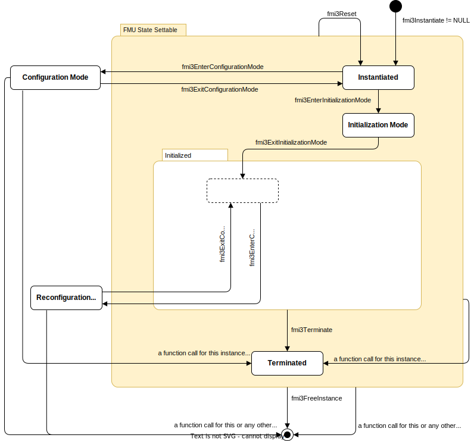
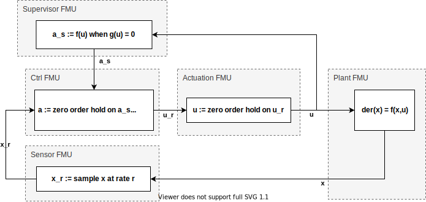
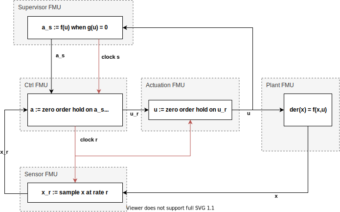

=== FMI Application Programming Interface [[fmi-application-programming-interface]]

This section contains the common interface definitions that allow a C program to invoke the FMU functions.

Note that the following general properties hold for an FMU:

- FMI functions of one instance do not need to be thread-safe. +
_[For example, if the functions of one instance of an FMU are accessed from more than one thread;
the multi-threaded simulation environment that uses the FMU must guarantee that there are no race conditions while invoking the FMI functions.
The FMU itself does not implement any services to support this.]_

- FMI functions must not change global settings which affect other processes/threads.
An FMI function may change settings of the thread in which it is called (such as floating point control registers), provided these changes are restored before leaving the function or before a callback function is called. +
_[This property ensures that functions of different FMU instances can be called safely in any order._
_Additionally, they can be called in parallel provided the functions are called in different processes._
_If an FMI function changes for example the floating point control word of the CPU, it must restore the previous value before return of the function._
_For x86 CPUs, the floating point control word is set using the `fldcw` instruction._
_This can be used to switch on additional exceptions such as floating point division by zero._
_An FMU might temporarily change the floating point control word and get notified on floating point exceptions internally, but has to restore the flag and clear the floating point status word before return of the respective FMI function.]_

- In general, FMI function arguments are not allowed to be NULL, unless explicitly allowed by the standard document where NULL will be assigned a specific semantic. +
_[For an example of NULL being explicitly allowed see <<resourceLocation>>._
_Careful implementations should still guard against NULL pointers.]_

- The FMI Standard does not provide a run-time platform or portability layer.
Access to operating system resources and services, such as memory and file system, must be implemented with special care because the availability of such resources and services is not guaranteed.
If some resource is required by the FMU but is not available, the FMU must log what resource failed and return with error.

==== Header Files and Naming of Functions [[header-files-and-naming-of-functions]]

Three header files are provided that define the interface of an FMU.
In all header files the convention is used that all C function and type definitions start with the prefix `fmi3`:

`fmi3PlatformTypes.h`::
contains the type definitions of the input and output arguments of the functions as well as some C preprocessor macro definitions for constants.
This header file must
be used both by the FMU and by the importer.
_[Example of a definition in this header file:_
+
[source, C]
----
typedef double fmi3Float64;
----
+
_]_

`fmi3FunctionTypes.h`::
contains `typedef` definitions of all function prototypes of an FMU as well as enumerations for constants.
This header file includes `fmi3PlatformTypes.h`.
When dynamically loading an FMU, these definitions can be used to type-cast the function pointers to the respective function definition.
For simplicity, the function type for each function is composed of the function name itself with the suffix `TYPE`.
+
_[Example of a definition in this header file:_
+
[source, C]
----
typedef fmi3Status fmi3SetTimeTYPE(fmi3Instance, fmi3Float64);
----
+
_]_

`fmi3Functions.h`::
contains the function prototypes of an FMU that can be accessed in simulation environments.
+
This header file includes `fmi3PlatformTypes.h` and `fmi3FunctionTypes.h`.
The header file version number for which the model was compiled, can be inquired by the importer with <<fmi3GetVersion>> (see <<inquire-platform-and-version-number>>). +
+
_[Example of a definition in this header file:_
+
[source, C]
----
FMI3_Export fmi3SetTimeTYPE fmi3SetTime;
----
+
_For Microsoft and Cygwin compilers `FMI3_Export` is defined as_ `pass:[__]declspec(dllexport)` _and for Gnu-Compilers as_ `pass:[__]attribute__ ( ( visibility("default") ) )` _in order to export the name for dynamic loading._
_Otherwise it is an empty definition.]_

The goal is that both source code and binary representations of FMUs are supported and that several FMUs might be present at the same time in an executable (for example, FMU A may use an FMU B).
In order for this to be possible, the names of the functions in different FMUs must be different, or function pointers must be used.
To support the source code representation of FMUs, macros are provided in `fmi3Functions.h` to build the actual function names by using a function prefix that depends on how the FMU is shipped.

_[These macros can be defined differently in a target specific variant of `fmi3Functions.h` to adjust them to the requirements of the supported compilers and platforms of the importing tool.]_

An FMU C-file must include at the beginning a `define` of `FMI3_FUNCTION_PREFIX` with the same value as the value of the `modelIdentifier` attribute defined in `<fmiModelDescription><ModelExchange>`, `<fmiModelDescription><CoSimulation>` or `<fmiModelDescription><ScheduledExecution>` together with `pass:[_]` at the end (see <<model-exchange-schema>>, <<co-simulation-schema>>, <<scheduled-execution-schema>>).

This `define` must be directly followed with an `#include "fmi3Functions.h"` statement.

Typically, FMU functions are used as follows:

[source, C]
----
// FMU is shipped with C source code, or with static link library
#define FMI3_FUNCTION_PREFIX MyModel_
#include "fmi3Functions.h"
< usage of the FMU functions e.g. MyModel_fmi3SetTime >

// FMU is shipped with DLL/SharedObject
#include "fmi3FunctionTypes.h"
fmi3SetTimeTYPE *myname_setTime = < load symbol "fmi3SetTime" from DLL/SharedObject >;
< usage of the FMU function pointers, e.g. myname_setTime >
----

A function that is defined as `fmi3GetFloat64` is changed by the macros to a function name as follows:

- If the FMU is shipped with C source code or with static link library: +
The constructed function name is `MyModel_fmi3GetFloat64`.
In other words the function name is prefixed with the model name and an `pass:[_]`.
A simulation environment can therefore construct the relevant function names by generating code for the actual function call.
In case of a static link library, the name of the library is `MyModel.lib` on Windows and `libMyModel.a` on Linux; in other words the `modelIdentifier` attribute is used to create the library name.

- If the FMU is shipped with DLL/SharedObject: +
The constructed function name is `fmi3GetFloat64`, in other words, it is not changed.
_[This can be realized in the case of a source code FMU with a target-specific version of `fmi3Functions.h` that does not use FMI3_FUNCTION_PREFIX to construct the function names.]_
A simulation environment will then dynamically load this library and will explicitly import the function symbols by providing the FMI function names as strings.
The name of the library is `MyModel.dll` on Windows or `MyModel.so` on Linux; in other words the `modelIdentifier` attribute is used as library name.

_[An FMU can be optionally shipped so that it basically contains only the communication to another simulation tool (`needsExecutionTool = true`, see <<fmi-for-co-simulation>>)._
_This is particularily common for co-simulation tasks._
_In this tool coupling case one DLL/Shared Object can be used for all models due to no function prefixing.]_

Since `modelIdentifier` is used as prefix of a C-function name it must fulfill the restrictions on C-function
names (only letters, digits and/or underscores are allowed).
_[For example, if `modelName = "A.B.C"`, then `modelIdentifier` might be "A_B_C".]_
Since `modelIdentifier` is also used as name in a file system, it must also fulfill the restrictions of the targeted operating system.
Basically, this means that it should be short.
These restrictions apply to all interface types and for binary and source-code FMUs.
_[For example, the Windows API only supports full path-names of a file up to 260 characters (see: http://msdn.microsoft.com/en-us/library/aa365247%28VS.85%29.aspx).]_

==== Platform Dependent Definitions

To simplify porting, no C types are used in the function interfaces, but the alias types are defined in this section.
All definitions in this section are provided in the header file `fmi3PlatformTypes.h`.
It is required to use this definition for all binary FMUs.

[source, C]
----
include::../headers/fmi3PlatformTypes.h[tags=Component]
----

This is a pointer to an FMU specific data structure that contains the information needed to process the model equations or to process the co-simulation of the model/subsystem represented by the FMU.

[source, C]
----
include::../headers/fmi3PlatformTypes.h[tags=ComponentEnvironment]
----

This is a pointer to a data structure in the importer.
Using this pointer, data can be transferred between the importer and callback functions it provides (see <<FMUStateSetable>>).

[source, C]
----
include::../headers/fmi3PlatformTypes.h[tags=FMUState]
----

This is a pointer to a data structure in the FMU that saves the internal FMU state of the actual or a previously saved time instant.
This allows to restart a simulation from a saved FMU state (see <<get-set-fmu-state>>).

[source, C]
----
include::../headers/fmi3PlatformTypes.h[tags=ValueReference]
----

This is a handle to a (base type) variable value of the model.
A `fmi3ValueReference` uniquely identifies the value and other properties of a variable, except for the variable name and the display unit that may differ for <<alias>> variable definitions.

Structured entities, such as records, must be flattened into a set of values (scalars or arrays) of type `fmi3Float64`, `fmi3Int32`, etc.
Arrays may be flattened into a set of scalars or represented directly as array values.
An `fmi3ValueReference` references one such value (scalar or array).
The coding of `fmi3ValueReferences` is a "secret" of the environment that generated the FMU.
The interface to the equations only provides access to variable values via `fmi3ValueReferences`.
Extracting concrete information about a variable can be done by reading the <<modelDescription.xml>> in which the `fmi3ValueReferences` are defined.
If a function in the following sections is called with a wrong `fmi3ValueReference` value _[for example, setting a constant with a call to `fmi3SetFloat64`]_, then the function must return with an error ( <<fmi3Error,`fmi3Status == fmi3Error`>>, see <<status-returned-by-functions>>).

Listing <<code-base-types>> shows the base types used in the interfaces of the C functions.

.Base types
[[code-base-types]]
[source, C]
----
include::../headers/fmi3PlatformTypes.h[tags=VariableTypes]
----

The data types `fmi3Float32`, `fmi3Float64`, `fmi3Int8`, `fmi3UInt8`, `fmi3Int16`, `fmi3UInt16`, `fmi3Int32`, `fmi3UInt32`, `fmi3Int64`, `fmi3UInt64` and `fmi3Boolean` are called "numeric types" in the following.

If an `fmi3String` or an `fmi3Binary` variable is passed as `input` argument to an FMI function and the FMU needs to use the string/binary later,
the FMI function must copy the string/binary before it returns and store it in the internal FMU memory,
because there is no guarantee for the lifetime of the string/binary after the function has returned.

If an `fmi3String` or an `fmi3Binary` variable is passed as `output` argument from an FMI function and the string/binary shall be used in the target environment,
the target environment must copy the whole string/binary (not only the pointer).
The memory of this string/binary may be deallocated by the next call to any of the FMI functions (the string/binary memory might also be just a buffer, that is reused).

==== Status Returned by Functions [[status-returned-by-functions]]

This section defines the `status` flag (an enumeration of type `fmi3Status` defined in file `fmi3FunctionTypes.h` ) that is returned by all functions to indicate the success of the function call:

[source, C]
----
include::../headers/fmi3FunctionTypes.h[tags=Status]
----

The status has the following meaning:

[[fmi3OK,`fmi3OK`]]
`fmi3OK`::
The call was successful.
The output argument values are defined.

[[fmi3Warning,`fmi3Warning`]]
`fmi3Warning`::
A non-critical problem was detected, but the computation can continue.
The output argument values are defined.
Function <<logMessage>> was called by the FMU and the user is expected to handle the problem.
_[In certain applications, e.g. in a prototyping environment, warnings may be acceptable._
_For production environments warnings should be treated like errors unless they can be safely ignored.]_

[[fmi3Discard,`fmi3Discard`]]
`fmi3Discard`::
The call was not successful and the FMU is in the same state as before the call.
The output argument values are not defined, but the computation can continue.
When debug logging is enabled (`loggingOn == fmi3True`) the function <<logMessage>> was called by the FMU.
Advanced simulation algorithms can try alternative approaches to drive the simulation by calling the function with different arguments or calling another function.
Otherwise the simulation algorithm has to treat this return code like <<fmi3Error>> and has to terminate the simulation.

[[fmi3Error,`fmi3Error`]]
`fmi3Error`::
The call failed.
The output argument values are undefined and the simulation cannot be continued.
Function <<logMessage>> was called by the FMU and the FMU is in state **Terminated**.
If a function returns <<fmi3Error>>, it is possible to restore a previously retrieved FMU state by calling <<fmi3SetFMUState>>.
Otherwise <<fmi3FreeInstance>> or <<fmi3Reset>> must be called.
When detecting illegal arguments or a wrong function call at the current FMU state, the FMU must return <<fmi3Error>>.
Other instances of this FMU are not affected by the error.

[[fmi3Fatal,`fmi3Fatal`]]
`fmi3Fatal`::
The state of all instances of the model is irreparably corrupted.
_[For example, due to a run-time exception such as access violation or integer division by zero during the execution of an FMI function.]_
Function <<logMessage>> was called by the FMU.
It is not allowed to call any other function for any instance of the FMU.

==== Inquire Platform and Version Number of Header Files [[inquire-platform-and-version-number]]

This section documents functions to inquire information about the header files used to compile its functions.

[[fmi3GetVersion,`fmi3GetVersion`]]
[source, C]
----
include::../headers/fmi3FunctionTypes.h[tags=GetVersion]
----

Returns the version of the `fmi3Functions.h` header file which was used to compile the functions of the FMU.
The function returns `fmi3Version` which is defined in this header file.
The standard header file as documented in this specification has version `"3.0"`, so this function returns `"3.0"`.

==== State Machines and Common States [[state-machine-and-common-states]]

All FMI interface types share a number of states in their respective state machines.
This chapter describes these common modes.
FMI specific state-machine modes will be described in their respective chapters.

.Common calling sequence for C functions of common states for all three FMI types.
[#figure-common-state-machine]

===== Super State: FMU State Setable [[FMUStateSetable]]

The description of the super state *FMU State Setable* generally describes functions that deal with instantiation, destruction and logging of FMUs.

This state is entered when any of the following functions is called: <<fmi3InstantiateModelExchange>>, <<fmi3InstantiateCoSimulation>> and <<fmi3InstantiateScheduledExecution>>.
The state is left by either calling <<fmi3FreeInstance>> or when any of the functions called during *FMU State Setable* returns <<fmi3Fatal>>.

Allowed Function Calls::

In all states of this super state it is allowed to call <<fmi3GetFMUState>>, `fmi3SetFMUState`, `fmi3FreeFMUState`, <<fmi3SerializedFMUStateSize>>, <<fmi3SerializeFMUState>>, <<fmi3DeSerializeFMUState>>, <<fmi3Reset>>, <<fmi3GetVersion>>, `fmi3SetDebugLogging` and <<fmi3FreeInstance>>.

[[fmi3Instantiate,`fmi3InstantiateXXX`]]
[source, C]
----
include::../headers/fmi3FunctionTypes.h[tags=Instantiate]
----

These functions return a new instance of an FMU with the respective interface type.
If a null pointer is returned, then instantiation failed.
In that case, <<logMessage>> is called with detailed information about the reason.
An FMU can be instantiated many times (provided capability flag `canBeInstantiatedOnlyOncePerProcess = false`).

--
[[fmi3InstantiateModelExchange,`fmi3InstantiateModelExchange`]]
`fmi3InstantiateModelExchange`::
FMU with initialization and events; between events, the simulation of continuous systems is performed with external integrators from the environment (see <<fmi-for-model-exchange>>).
The <<modelDescription.xml>> has to include a `<ModelExchange>` element to allow calling `fmi3InstantiateModelExchange`.

[[fmi3InstantiateCoSimulation,`fmi3InstantiateCoSimulation`]]
`fmi3InstantiateCoSimulation`::
Black box interface for Co-Simulation (see <<fmi-for-co-simulation>>).
The <<modelDescription.xml>> has to include a `<CoSimulation>` element to allow calling `fmi3InstantiateCoSimulation`.

[[fmi3InstantiateScheduledExecution,`fmi3InstantiateScheduledExecution`]]
`fmi3InstantiateScheduledExecution`::
Black box interface for Scheduled Execution (see <<fmi-for-scheduled-execution>>).
The <<modelDescription.xml>> has to include a `<ScheduledExecution>` element to allow calling `fmi3InstantiateScheduledExecution`.
--

The arguments of the instantiation functions are detailed as follows:

* `instanceName` is a unique identifier for the FMU instance.
It is used to name the instance, for example, in error or information messages generated by one of the `fmi3XXX` functions.
The argument `instanceName` must be a non empty string (in other words, must have at least one character that is not a white space).
_[If only one FMU is simulated, as `instanceName` attribute `modelName` or `<ModelExchange|CoSimulation|ScheduledExecution modelIdentifier="..">` from the XML schema `fmi3ModelDescription` might be used.]_

* `instantiationToken` can be used by the FMU to check that the <<modelDescription.xml>> file (see <<fmu-distribution>>) is compatible with the implementation of the FMU.
It is an opaque string generated by the FMU exporter that is stored in the xml file as mandatory attribute `instantiationToken` (see <<fmiModelDescription>>).
It must be passed unchanged to the FMU.
This argument must not be a null pointer.

[[resourceLocation,`resourceLocation`]]
* `resourceLocation` is a URI according to the http://datatracker.ietf.org/doc/rfc3986/[IETF RFC3986] syntax to indicate the location to the `resources` directory of the unzipped FMU archive.
The following schemes must be understood by the FMU:

** Mandatory -- `file` with absolute path (either including or omitting the authority component); +
** Optional -- `http`, `https`, `ftp`.

+
_[Example: An FMU is unzipped in directory `C:\temp\MyFMU`, then <<resourceLocation>> = `file:///C:/temp/MyFMU/resources` or `file:/C:/temp/MyFMU/resources`._ +
_The <<fmi3Instantiate>> functions are then able to read all needed resources from this directory, for example maps or tables used by the FMU.]_ +
A NULL pointer is supplied for <<resourceLocation>>, if no resource location can be provided to the FMU, which may occur

** if the FMU does not contain a resources folder, or
** if the environment is not able to provide an URI to the resources folder _[e.g., if the environment does not have a file system._
_If the FMU in such a case cannot be sinmulated, as it depends on the resources folder, it shall terminate with an error.]_

* `visible == fmi3False` defines that the interaction with the user should be reduced to a minimum (no application window, no plotting, no animation, etc.).
In other words, the FMU is executed in batch mode.
If `visible == fmi3True`, the FMU is executed in interactive mode, and the FMU might require to explicitly acknowledge start of simulation / instantiation / initialization (acknowledgment is non-blocking).

* If `loggingOn == fmi3False`, then any logging is disabled and the <<logMessage>> callback function is not called by the FMU.
If `loggingOn == fmi3True`, the FMU enables a vendor defined set of `<LogCategories>`.
This set should typically contain categories for messages that explain execution errors, like <<fmi3Discard>>, <<fmi3Error>> and <<fmi3Fatal>>.
The function <<fmi3SetDebugLogging>> gives more detailed control about required `<LogCategories>` (see <<definition-of-log-categories>>).

* If `eventModeRequired == fmi3True` the simulation algorithm can handle events, otherwise `fmi3EnterEventMode` must not be called.
The flag may only be `fmi3True`, if `hasEventMode == true`, otherwise the FMU must raise an error.

* `instanceEnvironment` is a pointer that can be passed to the <<fmi3CallbackIntermediateUpdate>> function in order that the simulation environment can provide an efficient way to identify the FMU that called <<fmi3CallbackIntermediateUpdate>>.

[[requiredIntermediateVariables,`requiredIntermediateVariables`]]
* `requiredIntermediateVariables` is an array of the value references of all <<input>> variables that the simulation algorithm intends to set and all <<output>> variables it intends to get during intermediate updates.
This set may be empty (<<nRequiredIntermediateVariables>> == 0) when the simulation algorithm does not intend to use intermediate update.
All variables referenced in this set must be marked with the attribute <<intermediateUpdateAttr,`intermediateUpdate = "true"`>> in the model description.
Only the variables in <<requiredIntermediateVariables>> may be accessed by the simulation algorithm using `fmi3Set{VariableType}` and `fmi3Get{VariableType}` during <<fmi3CallbackIntermediateUpdate>> callbacks.

[[nRequiredIntermediateVariables,`nRequiredIntermediateVariables`]]
* `nRequiredIntermediateVariables` gives the number of entries in <<requiredIntermediateVariables>>.
If <<nRequiredIntermediateVariables>> is zero <<requiredIntermediateVariables>> is not defined.

The arguments <<logMessage>>, <<intermediateUpdate>>, <<lockUnlockPreemption,`lockPreemption`>>, and <<lockUnlockPreemption,`unlockPreemption`>>, are function pointers provided by the simulation environment to be used by the FMU.
It is not allowed to change these functions between <<fmi3Instantiate>> and <<fmi3Terminate>> calls.
Additionally, a pointer to the environment is provided (`instanceEnvironment`) that needs to be passed to all of the callback functions, in order that those functions can utilize data from the environment, such as mapping a <<valueReference>> to a string, or assigning memory to a certain FMU instance.

In the default `fmi3FunctionTypes.h` file, typedefs for the function definitions are present to simplify the usage; this is non-normative.
These callback functions are defined below.

[[logMessage,`logMessage`]]
Function `logMessage`::
[source, C]
----
include::../headers/fmi3FunctionTypes.h[tags=CallbackLogMessage]
----

Pointer to a function that is called in the FMU _[usually if an `fmi3XXX` function does not behave as desired]_.

* `instanceName` is the instance name of the model that calls this function.
* `status` contains the severity of the message, see `fmi3Status`.
If <<logMessage>> is called with <<fmi3OK,`status == fmi3OK`>>, then the message is a pure information message.

* `category` is the category of the message.
The meaning of `category` is defined by the modeling environment that generated the FMU.
Depending on this modeling environment, none, some, or all, allowed values of `category` for this FMU are defined in the <<modelDescription.xml>> file via element `<fmiModelDescription><LogCategories>`, see <<definition-of-log-categories>>.
Only messages are provided by function <<logMessage>> that have a category according to a call to <<fmi3SetDebugLogging>>.

* `message` is a string that contains the message.
_[Typically, this function prints the message and stores it optionally in a log file.]_

All string-valued arguments passed by the FMU to the <<logMessage>> may be deallocated by the FMU directly after function <<logMessage>> returns.
The simulation environment must therefore create copies of these strings if it needs to access these strings later. +
The <<logMessage>> function will append a line break to each message when writing messages after each other to a terminal or a file (the messages may also be shown in other ways, for example, as separate text-boxes in a GUI).
The caller may include line-breaks (using "\n") within the message, but should avoid trailing line breaks. +
Variables can be referenced in a message with `pass:[#]<ValueReference>pass:[#]`.
If the character `pass:[#]` shall be included in the message, it has to be prefixed with `pass:[#]`, so `pass:[#]` is an escape character.

_[Example: The message `\#1365# must be larger than zero (used in IO channel ##4)` might be changed by the <<logMessage>> function to `body.m must be larger than zero (used in IO channel #4)` if `body.m` is the name of the variable with value reference 1365.]_

[[intermediateUpdate,`intermediateUpdate`]]
Function `intermediateUpdate`::

See <<fmi3CallbackIntermediateUpdate>> for details.

[[lockUnlockPreemption,`lockUnlockPreemption`]]
Function `lockPreemption` and `unlockPreemption`::
[source, C]
----
include::../headers/fmi3FunctionTypes.h[tags=CallbackPreemptionLock]
----

To provide more options to secure the model or controller code inside the FMU, against unwanted preemption, these callback functions are defined.
They can be used to prevent preemption for certain code parts enclosed by `lockPreemption` and `unlockPreemption` in Scheduled Execution.
Even if the co-simulation algorithm does not support preemption, at least an empty implementation of these callback functions must be provided to allow the reuse of code for different modes together with an efficient preemption.
_[This is included to avoid having to check in the model or controller code if the function pointers are null pointers._
_A function call to a void-void function with an immediate return is hardly any overhead.]_

[[fmi3FreeInstance,`fmi3FreeInstance`]]
[source, C]
----
include::../headers/fmi3FunctionTypes.h[tags=FreeInstance]
----

Disposes the given instance, unloads the loaded model, and frees all the allocated memory and other resources that have been allocated by the functions of the FMU interface.
If a null pointer is provided for argument `instance`, the function call is ignored (does not have an effect).

[[fmi3SetDebugLogging,`fmi3SetDebugLogging`]]
[source, C]
----
include::../headers/fmi3FunctionTypes.h[tags=SetDebugLogging]
----
The function controls debug logging that is output via the <<logMessage>> callback function.

* If `loggingOn == fmi3True`, debug logging is enabled, otherwise it is switched off.

* `nCategories` defines the length of the next argument `categories`
If `loggingOn == fmi3True` and `nCategories == 0`, then all debug messages shall be output.
If `loggingOn == fmi3True` and `nCategories > 0`, then only debug messages according to the `categories` argument shall be printed via the <<logMessage>> function.

* `categories` is a vector with `nCategories` elements.
The allowed values of `categories` are defined by the modeling environment that generated the FMU.
Depending on the generating modeling environment, none, some or all allowed values for `categories` for this FMU are defined in the <<modelDescription.xml>> file via element `<fmiModelDescription><LogCategories>`, see <<definition-of-log-categories>>.

===== Super State: Under Evaluation [[UnderEvaluation]]

This section documents functions that deal with configuration, initialization, termination, and resetting of an FMU.

This super state is entered by the FMU when <<fmi3Instantiate>> was called and returned successfully.
If any function called in super state *Under Evaluation* returns <<fmi3Error>>, the FMU enters state *Terminated*.

Allowed Function Calls::

<<fmi3EnterConfigurationMode>>::
[[fmi3EnterConfigurationMode,`fmi3EnterConfigurationMode`]]
[source, C]
----
include::../headers/fmi3FunctionTypes.h[tags=EnterConfigurationMode]
----

Informs the FMU to enter the *Configuration Mode* or *Reconfiguration Mode*.

<<fmi3ExitConfigurationMode>>::
[[fmi3ExitConfigurationMode,`fmi3ExitConfigurationMode`]]
[source, C]
----
include::../headers/fmi3FunctionTypes.h[tags=ExitConfigurationMode]
----

Informs the FMU to exit the *Configuration Mode* or *Reconfiguration Mode*.

<<fmi3EnterInitializationMode>>::
[[fmi3EnterInitializationMode,`fmi3EnterInitializationMode`]]
[source, C]
----
include::../headers/fmi3FunctionTypes.h[tags=EnterInitializationMode]
----

Informs the FMU to enter *Initialization Mode*.
Before calling this function, all variables with attribute <<initial>> = <<exact>> or <<approx>> can be set with the `fmi3Set{VariableType}` functions (the variable attributes are defined in the Model Description File, see <<definition-of-model-variables>>).
Setting other variables is not allowed.

* `toleranceDefined` and `tolerance` depend on the interface type:

Model Exchange::
If `toleranceDefined == fmi3True`, then the model is called with a numerical integration scheme where the step size is controlled by using `tolerance` for error estimation (usually as relative tolerance).
In such a case all numerical algorithms used inside the model (for example, to solve non-linear algebraic equations) should also operate with an error estimation of an appropriate smaller relative tolerance.

Co-Simulation::
If `toleranceDefined == fmi3True`, then the communication step size of the FMU is controlled by error estimation.
In case the FMU utilizes a numerical integrator with variable step size and error estimation, it is suggested to use `tolerance` for the error estimation of the integrator (usually as relative tolerance). +
An FMU for Co-Simulation might ignore this argument.

* `startTime` and `stopTime` can be used to check whether the model is valid within the given boundaries, or to allocate the necessary memory for storing results.
`startTime` is the <<fixed>> <<initial>> value of the <<independent>> variable and inherits its unit.
+
_[It is defined with <<causality>> = <<independent>> in the <<modelDescription.xml>>._
_If the <<independent>> variable is `time`, `startTime` is the starting time of initialization.]_

* If `stopTimeDefined == fmi3True`, then `stopTime` is the final value of the <<independent>> variable and inherits its unit.
If the environment tries to compute past `stopTime`, the FMU has to return <<fmi3Error,`fmi3Status == fmi3Error`>>.
If `stopTimeDefined == fmi3False`, then no final value of the <<independent>> variable is defined and argument `stopTime` is meaningless.

[[fmi3ExitInitializationMode,`fmi3ExitInitializationMode`]]
<<fmi3ExitInitializationMode>>::
[source, C]
----
include::../headers/fmi3FunctionTypes.h[tags=ExitInitializationMode]
----

Informs the FMU to exit *Initialization Mode*.
This function switches off all initialization equations, and the FMU enters *Event Mode* for Model Exchange, *Step Mode* for Co-Simulation and *Clock Activation Mode* for Scheduled Execution.

<<fmi3Terminate>>::
[[fmi3Terminate,`fmi3Terminate`]]
[source, C]
----
include::../headers/fmi3FunctionTypes.h[tags=Terminate]
----

Informs the FMU that the simulation run is terminated.
After calling this function, the final values of all variables can be inquired with the `fmi3Get{VariableType}` functions.
It is not allowed to call this function after one of the functions returned with a status flag of <<fmi3Error>> or <<fmi3Fatal>>.

<<fmi3Reset>>::
[[fmi3Reset,`fmi3Reset`]]
[source, C]
----
include::../headers/fmi3FunctionTypes.h[tags=Reset]
----

Is called by the environment to reset the FMU after a simulation run.
The FMU goes into the same state as if <<fmi3Instantiate>> would have been called.
All variables have their default values.
Before starting a new run <<fmi3EnterInitializationMode>> has to be called.

====== State: Instantiated [[Instantiated]]

In this state the FMU can do one-time initializations and allocate memory.
This state is entered after <<fmi3Instantiate>> returned successfully.

<<start>> and guess values (variables that have <<initial>> = <<exact>> or <<approx>>) can be set and all variables with <<variability>> latexmath:[\neq] <<constant>> can be set.
This does not include inputs as they do not have an <<initial>> attribute.

Allowed Function Calls::

<<fmi3EnterInitializationMode>>::
Change state of FMU to *Initialization Mode*.

<<fmi3EnterConfigurationMode>>::
Change state of FMU to *Configuration Mode*.

`fmi3Set{VariableType}`::
For variables with <<variability>> latexmath:[\neq] <<constant>> and for which <<initial>> = <<exact>> or <<approx>>.
The intention is to set <<start>> and guess values for these variables.

====== State: Configuration Mode [[ConfigurationMode]]

In this state <<structuralParameter,`structural parameters`>> with <<variability>> = <<fixed>> or <<variability>> = <<tunable>> can be changed.
No other variables can be changed during *Configuration Mode*.
This state is entered from state *Instantiated* by calling <<fmi3EnterConfigurationMode>> and left back to *Instantiated* by calling <<fmi3ExitConfigurationMode>>.
<<fmi3EnterConfigurationMode>> can only be called if the FMU contains at least one <<structuralParameter,`structural parameter`>>

Allowed Function Calls::

<<fmi3ExitConfigurationMode>>::
With this function call, the FMU is returned to state *Instantiated*.

`fmi3Set{VariableType}`::
Only for variables with <<causality>> = <<structuralParameter>> and <<variability>> = <<fixed>> or <<variability>> = <<tunable>>.

====== State: Reconfiguration Mode [[ReconfigurationMode]]

In this state <<structuralParameter,`structural parameters`>> with <<variability>> = <<tunable>> can be changed.
No other variables can be changed during *Reconfiguration Mode*.
This state is entered from state *Event Mode* (ME), *Step Mode* (CS) or *Clock Activation Mode* (SE) by calling <<fmi3EnterConfigurationMode>>.
<<fmi3EnterConfigurationMode>> can only be called if the FMU contains at least one <<structuralParameter,`structural parameter`>>.

Allowed Function Calls::

<<fmi3ExitConfigurationMode>>::
Returns back to *Event Mode* (ME), *Step Mode* (CS) or *Clock Activation Mode* (SE).

`fmi3Set{VariableType}`::
Only for variables with <<causality>> = <<structuralParameter>> and <<variability>> = <<tunable>>.

====== State: Initialization Mode [[InitializationMode]]

This mode is used by the simulation algorithm to compute consistent initial conditions for overall system.
Equations are active to determine the initial FMU state, as well as all <<output,`outputs`>> (and optionally other variables exposed by the exporting tool).
Artificial or real algebraic loops over connected FMUs in *Initialization Mode* may be handled by using appropriate numerical algorithms.
The variables that can be retrieved by `fmi3Get{VariableType}` calls are (1) defined in the XML file as elements `<ModelStructure><InitialUnknown>` and (2) variables with <<causality>> = <<output>>.
Variables with <<initial>> = <<exact>> and <<variability>> latexmath:[\neq] <<constant>>, as well as variables with <<causality>> = <<input>> can be set.

Allowed Function Calls::

<<fmi3ExitInitializationMode>>::
This function call changes the state of the FMU to the start state of the super state *Initialized* which is either *Continuous-Time Mode* (ME), *Step Mode* (CS) or *Clock Activation Mode* (SE).

<<fmi3GetDirectionalDerivative>>::
See <<fmi3GetDirectionalDerivative>>.

`fmi3Set{VariableType}`::
For variables with:
* <<variability>> latexmath:[\neq] <<constant>> that have <<initial>> = <<exact>>, or
* <<causality>> = <<input>>, or
* <<causality>> = <<parameter>> and <<variability>> = <<tunable>>.

`fmi3Get{VariableType}`::
For variables with <<causality>> = <<output>> or continuous-time <<state,`states`>> or state derivatives.

====== Super State: Initialized [[Initialized]]

This super state is entered by the FMU when <<fmi3ExitInitializationMode>> is called.
If the function <<fmi3Terminate>> is called, the FMU enters state *Terminated* from all states of this super state.
If any function returns <<fmi3Error>> in *Initialized*, the FMU switches to state *Terminated*.

The states of this super state differ between the FMI types and will be described in detail in their respective chapters (except *Reconfiguration Mode*).

===== State: Terminated [[Terminated]]
In this state, the solution at the final time of a simulation can be retrieved.

Allowed Function Calls::
`fmi3Get{VariableType}`, <<fmi3GetDirectionalDerivative>>, <<fmi3GetOutputDerivatives>>

===== State: Intermediate Update Mode [[IntermediateUpdateMode]]

This state is only available in Co-Simulation and Scheduled Execution.

The FMU enters this state by calling <<fmi3CallbackIntermediateUpdate>> within *Step Mode* (CS) or *Clock Activation Mode* (SE) and leaves the state towards state *Step Mode* (CS) or *Clock Activation Mode* (SE) if the function returns <<fmi3OK>> or <<fmi3Warning>>.
If the function returns <<fmi3Error>> the FMU enters state *Terminated*.
If the function returns <<fmi3Fatal>> the FMU enters the terminal state.

Allowed Function Calls::

`fmi3Get{VariableType}`::
If <<intermediateVariableGetAllowed,`intermediateVariableGetAllowed == fmi3True`>>, the value of intermediate variables can be retrieved.
Intermediate variables are variables that are marked with attribute <<intermediateUpdateAttr,`intermediateUpdate = true`>> in the <<modelDescription.xml>> and have been included in the <<requiredIntermediateVariables>> argument to <<fmi3Instantiate>>.

`fmi3Set{VariableType}`::
If <<intermediateVariableSetRequested,`intermediateVariableSetRequested == fmi3True`>>, the value of intermediate, continuous variables should be set.
Intermediate variables are variables that are marked with attribute <<intermediateUpdateAttr,`intermediateUpdate = true`>> in the <<modelDescription.xml>> and have been included in the <<requiredIntermediateVariables>> argument to <<fmi3Instantiate>>.

There is a defined order of calling these functions: first all `fmi3Get{VariableType}` calls must be performed, then `fmi3Set{VariableType}` may be called. +
_[This is analogous to the calling sequence of of_ `fmi3Get{VariableType}` _and_ `fmi3Set{VariableType}` _calls at communication points.]_

Please refer to <<IntermediateUpdateModeSE>> for additional allowed functions in *Intermediate Update Mode* for SE.

==== Getting and Setting Variable Values [[get-and-set-variable-values]]

All variables of an FMU are identified with a handle called <<valueReference, value reference>>.
The handle is defined in the <<modelDescription.xml>> file as attribute <<valueReference>> in variable elements.
Each variable must have a unique <<valueReference>>.

A variable can be a scalar or an array.
When getting or setting the values of array variables, the serialization of array variable values used in C-API function calls, as well as in the XML <<start>> attributes, is defined as row major - i.e. dimension order from left to right for the C-API (e.g. `array[dim1][dim2]...[dimN]`), and the document order in the XML attributes for the respective dimensions.
For this serialization of array variables the sparsity pattern of the array is not taken into account.
All elements of the array, including structural zeros, are serialized.

_[Example: A 2D matrix_
[latexmath]
++++
A = \left( \begin{array}{cc} a_{11}&a_{12}\\
                             a_{21}&a_{22}\\
                             a_{31}&a_{32}\\
            \end{array} \right)
++++
_is serialized as follows:_
[frame="none",grid="none"]
|========================================
|_A[0][0]=a11_ | _memory  address: A_   |
|_A[0][1]=a12_ | _memory  address: A+1_ |
|_A[1][0]=a21_ | _memory  address: A+2_ |
|_A[1][1]=a22_ | _memory  address: A+3_ |
|_A[2][0]=a31_ | _memory  address: A+4_ |
|_A[2][1]=a32_ | _memory  address: A+5_ |
|========================================
_]_

The actual values of the variables that are defined in the <<modelDescription.xml>> file can be inquired after calling <<fmi3EnterInitializationMode>> with the following functions:

[source, C]
----
include::../headers/fmi3FunctionTypes.h[tags=Getters]
----

Get actual values of variables by providing their variable references.
_[These functions are used to get the values of output variables if a model is connected with other models.
Since state derivatives are also variables, it is also possible to get the value of a state derivative.
Furthermore, the actual value of every variable defined in the <<modelDescription.xml>> file can be determined at the actually defined time instant (see <<definition-of-model-variables>>).]_

* `valueReferences` is a vector of `nValueReferences` value handles that define the variables that shall be inquired.

* `values` is a vector with the actual values of these variables.

* `sizes` is a vector with the actual sizes of the values for binary variables.

* `nValues` provides the number of values in the `values` vector (and `sizes` vector, where applicable) which is only equal to `nValueReferences` if all <<valueReference>>pass:[s] point to scalar variables.

The strings returned by `fmi3GetString`, as well as the binary values returned by `fmi3GetBinary`, must be copied in the target environment because the allocated memory for these strings might be deallocated or overwritten by the next call to any of the FMI functions.

For Model Exchange: <<fmi3Discard,`fmi3Status == fmi3Discard`>> is possible for `fmi3GetFloat32` and `fmi3GetFloat64` only, but not for `fmi3Get*Int*`, `fmi3GetBoolean`, `fmi3GetString`, `fmi3GetBinary`, because these are discrete-time variables and their values can only change at an event instant where <<fmi3Discard>> does not make sense.

It is also possible to set the values of certain variables at particular instants in time using the following functions:

[source, C]
----
include::../headers/fmi3FunctionTypes.h[tags=Setters]
----

Set <<parameter,`parameters`>>, <<input,`inputs`>>, and <<start>> values, and re-initialize caching of variables that depend on these variables (see <<definition-of-model-variables>> for the exact rules on which type of variables `fmi3Set{VariableType}` can be called, as well as <<state-machine-model-exchange>> in case of Model Exchange, and <<state-machine-co-simulation>> for Co-Simulation and <<state-machine-scheduled-execution>> for Scheduled Execution).

* `valueReferences` is a vector of `nValueReferences` value handles that define the variables that shall be set.

* `values` is a vector with the actual values of these variables.

* `sizes` is a vector with the actual sizes of the values of binary variables.

* `nValues` provides the number of values in the `values` vector (and `sizes` vector, where applicable) which is only equal to `nValueReferences` if all <<valueReference>>pass:[s] point to scalar variables.

All strings passed as arguments to `fmi3SetString`, as well as all binary values passed as arguments to `fmi3SetBinary`, must be copied inside these functions, because there is no guarantee of the lifetime of strings or binary values, when these functions return.

Note, <<fmi3Discard,`fmi3Status == fmi3Discard`>> is possible for the `fmi3Set{VariableType}` functions.

The value of a variable may only be accessed with the respective `fmi3Get/Set{VariableType}` for its type.

==== Advancing Time [[advancing-time]]

This section highlights the differences of the concept of time (in general the independent variable) for the three different FMI types, ME, CS and SE.

In Model Exchange, time is under the sole control of the importer and its integration algorithm.
The model itself receives the current time to be used in its computation with <<fmi3SetTime>>.
In fact, time is not necessarily advancing linearly as solvers might need to find zero-crossing points or the importer uses the Model Exchange FMU to find points of optimal control.

In Co-Simulation, time advances in (possibly variable) steps negotiated between the co-simulation algorithm of the importer and the FMU.
The importer calls <<fmi3DoStep>> with the <<currentCommunicationPoint>> and a target <<communicationStepSize>> (required to be larger than 0.0).
During this <<fmi3DoStep>>, both importer and FMU might encounter events that will reduce the <<communicationStepSize>> (potentially even down to 0.0).
The FMU may use <<earlyReturn>> argument of the <<fmi3DoStep>> function to tell the import that the FMU needs to return earlier, and the importer may use the callback <<fmi3CallbackIntermediateUpdate>> to signal the FMU that the later should return earlier.
This way both can determine if such a step-size reduction is required.
The output argument <<lastSuccessfulTime>> of <<fmi3DoStep>> allows the FMU to signal the importer its current internal time.

In Scheduled Execution, time has a more discrete form.
The scheduler of the importer activates specific tasks according to the time of the importer.
The time itself is communicated to the FMU as <<activationTime>> argument of <<fmi3ActivateModelPartition>>.

Depending on the instantiated FMI type, the importer is restricted in what functions it is allowed to call in order to drive the simulation.
The following chapters will focus on what mechanisms are relevant for the interface type at hand, without trying to constantly declare which functions not to use because they belong to the other interface type mechanisms.

==== Operation on Clocks [[operation-on-clocks]]

In the following section the operations on <<clock,`clocks`>> are described.
Clocks are defined for the exact timing of evaluations of clocked model partitions and exact timing of event handling across FMUs.
_[In FMI 2.0 event detection in a system of FMUs was still done inside each of the FMUs individually with all the issues of floating point arithmetic._
_Clocks offer a way to delegate event triggering to the importer to ensure that events meant to trigger at the exact same time will be synchronized across FMUs.]_

Two types of <<clock,`clocks`>> are available, designed to address similar use cases with differences in details.
The <<clock>> type "<<SynchronousClocks,Synchronous Clocks>>"" complies with the limitations imposed by the synchronous clock theory, the other clock type "<<CommunicationPointClocks,Communication Point Clocks>>" is a general purpose co-simulation clock for providing suitable communication points for the timed evaluation of model partitions.
The term <<clock>> is used for both <<clock>> types.

===== Synchronous Clocks [[SynchronousClocks]]

The main use case of the <<SynchronousClocks,Synchronous Clocks>> is to represent sampled data systems.

Consider the system in <<figure-synchronous-clock-example>>, adapted from the Modelica specification:

- The controller samples the non-linear plant at some rate, and the plant is continuously affected by the actuator values between samples.

- The controller equations are executed synchronously whenever there is a new sample latexmath:[y_d].
This is implicit in the equations.

- The timing of the sample induces an event indicator that forces the importer to execute the controller and plant at the times at which the sensor wants to sample.
_[TODO: How could this be done with a zero crossing function? Wouldn't this be simple with a time-event?
Claudio: use time event instead.
]_

- latexmath:[Previous(xd)] means the value of latexmath:[xd] computed at the previous sample.

- latexmath:[y] is a continuous variable, and latexmath:[u] is piecewise constant.

- The importer

_[TODO: The elements of the example are not FMUs. Hence we cannot talk about an importer.
Claudio: rewrite this sentence to make it clear that the plant is evolving continuously.]_

_[TODO: All of this should be non normative.]_

may execute both controller and plant FMUs at times other than sample times as part of the time integration of the plant.
In this case, the controller must produce the zero order hold value latexmath:[u].

.Sample scenario showcasing use of <<SynchronousClocks,Synchronous Clocks>>.
[[figure-synchronous-clock-example]]
image::images/synchronous-clock-example.svg[width=80%, align="center"]

_[TODO: Improve the example to provide more motivation. Maybe look for one in the synchronous clock text.]_

Now suppose the above architecture is realized with ME FMUs as illustrated in <<figure-synchronous-clock-scenario>>.
Since there's no guarantee that the equations in Ctrl, Actuator, and Sensor FMUs will be invoked exactly at the times that coincide with the sampling times of the Sensor FMU (recall that it is the importer that picks the time advancement, based on the needs of the different FMUs), the Ctrl, Actuator, and Sensor FMUs need to be configured with the same sample rate.
_[TODO: Why do all 3 need to be configured with the same sample rate? Wouldn't the event in the sensor trigger input events?]_
There are two problems associated with this approach:

- It is error-prone for more complex controller architectures; and

- it represents time and the sample rate as real numbers and there are numerical difficulties in guaranteeing that all three FMUs will execute exactly at the same wall-clock time.

These are the problems that <<SynchronousClocks,Synchronous Clocks>> solve.

.Realization of the system in <<figure-synchronous-clock-example>> using ME FMUs.
[[figure-synchronous-clock-scenario]]

The idea of clock comes naturally if we consider that the controller will sample the plant according to some frequency that depends on the frequency of the clock generator of the controller's microprocessor.
It is easy then to describe the controller execution as happening every 100-th processor clock tick.
We can even go further and define a new clock, that is based on the microprocessor clock, but abstracts away from the controller execution platform details.
Such a clock would represent the capabilities of the controller execution platform.

Getting back to the example in <<figure-synchronous-clock-scenario>>, the Ctrl FMU may declare a clock that ticks every 100ms.
In order to inform the importer that the sensor and actuator FMUs are supposed to execute whenever the controller FMU executed, we need to connect that clock to those FMUs, as shown in <<figure-synchronous-clock-scenario-clocked>>.

.Realization of the system in <<figure-synchronous-clock-example>> using <<SynchronousClocks,Synchronous Clocks>>.
[[figure-synchronous-clock-scenario-clocked]]

In <<figure-synchronous-clock-scenario-clocked>>, the red lines show the clock signal.
The clock signal forces the importer to execute the controller, sensor, and actuator, equations at the same time (hence the name Synchronous for these clocks).
It also motivates input and output clocks:

- The ticking of an output clock is determined by the FMU that declares it.

- The ticking of an input clock is determined by the importer, which in turn will find the source that determines the ticking of such clock.

So in <<figure-synchronous-clock-scenario-clocked>>, FMU Ctrl declares an output clock, and the Sensor and Actuator FMUs both declare an input clock.

A clocked partition is a set of equations that are associated to a <<clock>> and are executed when the corresponding <<clock>> is active.
A clocked partition is mathematically defined as:

[latexmath]
++++
x_j=\begin{cases}
    x_{j-1} & \text{if subactive}\\
    f_j(x_{j-1},u_j,t_j) & \text{else}
    \end{cases}
++++

[latexmath]
++++
y_j=g_j(x_{j-1},u_j,t_j);
++++

_[TODO: shouldn't this be:
Claudio: rewrite this to make it clearer: the distinction between these two are just local vars and outputs.
Claudio: Also relate to the previous example.
Claudio: Also change the modelica sentence.
Claudio: Make it clear that clocks are just a way to implement numerically sound event having across different FMUs.
]_
[latexmath]
++++
y_j=g_j(x_{j},u_j,t_j);
++++

[latexmath]
++++
\text{with } j=0,1,2,...;x_{-1}=x_{\mathit{start}}
++++

Variables latexmath:[x_j] are called `states of a clocked partition`, or `discrete-time states` and latexmath:[j] is the latexmath:[j+1]th tick of the associated <<clock>>.
Variables latexmath:[u_j] are the (external or <<local>>) <<input,`inputs`>> and latexmath:[y_j] are the (external or <<local>>) <<output,`outputs`>> of a clocked partition.
A discrete-time <<state>> variable can be of any type (e.g. `fmi3Float64` or `fmi3Boolean`, but not of <<clock>> type).

_[TODO: (external or local) is here very confusing]_

A clocked partition is not executed during *Initialization Mode*, but it is executed the first time at its first <<clock>> tick.
The associated <<clock>> of the model partition is synchronous to its discrete-time <<state,`states`>>.

Discrete-time <<state,`states`>> are listed in the `<ModelStructure>`.
They can have initial values defined by XML attributes <<initial>> and <<start>>, or the initial values are computed internally as a function of the parameters.

There are two kinds of evaluation modes:
[start=1]
* Regular evaluation for an active <<clock>>: <<state>> and <<output>> equations are evaluated.
States get updated.
* Partial evaluation for a subactive <<clock>>: <<state,`states`>> are left unmodified, only outputs are computed.
+
_[Modelica uses this mode for the first tick in clocked continuous equations._
_This mode can also be requested by the calling environment with <<fmi3SetClock>>, e.g. to form partial derivatives_ latexmath:[\partial y_j / \partial x_{j-1}] _.]_

===== Communication Point Clocks [[CommunicationPointClocks]]

<<CommunicationPointClocks,Communication Point Clocks>>, introduced here, are used to define the communication points of model partitions (defined below).
These <<clock,`clocks`>> are not compatible with synchronous clock theory and must not be used together with <<SynchronousClocks,Synchronous Clocks>> in one model.

A model partition is mathematically defined as:

[latexmath]
++++
x_j=f_j(x_{j-1},u_j,t_j)
++++

_[TODO: why do we need y_j here? it is not mentioned afterwards]_
[latexmath]
++++
y_j=g_j(x_{j-1},u_j,t_j)
++++

[latexmath]
++++
\text{with } j=0,1,2,...;x_{-1}=x_{\mathit{start}}
++++

where:

* latexmath:[x] denotes the variables that are associated with the model partition.
These are the variables that are computed when the model partition is evaluated. Each variable in latexmath:[x] is associated with one, and only one, model partition.
Multiple model partitions, when evaluated, may read the value of a single variable, but only one will change it.

* latexmath:[u_j] denotes the variables that are read, but not changed, when the model partition is evaluated.

* latexmath:[t_j] denotes the time at which the model partition is evaluated.

* latexmath:[x_{\mathit{start}}] denotes the start value of the variables that are associated with the model partition.
This is the value that has been computed before <<fmi3ExitInitializationMode>> is called.

<<CommunicationPointClocks,Communication Point Clocks>> can also be defined for continuous or piecewise continuous parts of the model.

Please refer to <<example-scheduled-execution>> for an FMU example of scheduled execution.

====== Clock Priority

The <<clock,`clocks`>> are ordered descending based on their priorities.
It is nevertheless possible to define multiple <<clock,`clocks`>> with the same priority.
No ordering is defined for <<clock,`clocks`>> of the same priority.
If a computational order information is needed, different priorities for <<clock,`clocks`>> have to be defined.
The priority of a <<clock>> has to be defined in the <<modelDescription.xml>> via the <<clock>> variable integer attribute `priority` - smaller values have a higher priority.

_[For <<periodic>> <<clock,`clocks`>> it is recommended to derive the priorities based on a rate monotonic scheduling scheme (smallest period leads to highest priority, that is, has the smallest priority value.]_

_[The clock priorities are local to an FMU.
It is not possible for an FMU exporting tool to know in advance the priorities of other FMUs that will be connected to an FMU in a simulation setup.
It is the task of the simulation algorithm to derive a computational order for the computation of two or more distinct FMUs based on the local FMU clock priorities and input-output relationships of connected FMUs.]_

_[For real-time computation use cases (e.g., in Scheduled Execution), the priority information is used also for task preemption configurations.
It is therefore important to restrict the number of distinct priority levels for an FMU to available priority levels on the target platform and/or to avoid unnecessary computational overhead.
A common number of different priority levels is, e.g., 100 (0 to 99), as defined in Linux based operating systems.]_

===== Output Clocks [[outputClockVariant]]

An <<outputClock>> is a general <<clock>> that ticks when a time-, state- or step-event occurs in the continuous-model partition of the FMU (for <<CommunicationPointClocks,Communication Point Clocks>> these <<outputClock>> activations can occur in all model partitions) and are identified based on their <<valueReference>>.
The clock can be <<periodic>> or <<periodic,aperiodic>>.

_[Example: If_ latexmath:[b = x > 0] _, and a <<state event>> is defined when b changes from `false` to `true`, and b is defined as <<outputClock>>, then this <<clock>> is active whenever x changes from negative to positive values.]_

Since <<outputClock,`output clocks`>> are ticking based on model internal information, it is required in case of FMI for Co-Simulation to signal the ticking of an <<outputClock>> to the simulation environment during a <<fmi3DoStep>> or <<fmi3ActivateModelPartition>> computation.
In most cases _[TODO: not all cases? which cases? if the time of the clock tick is a communication point already?]_ the signaling of an <<outputClock>> tick requires creating a communication point for exchanging additional information (i.e. variable values) with the simulation environment.
Additional cases need to be handled if a <<clock>> tick is not associated to an event that requires the creation of a communication point for the model partition that generated the event. _[TODO: what?]_

_[Outside of the FMU it is not known in advance when this <<clock>> ticks._
_Instead, only when the <<clock>> is activated by the FMU, then the environment is informed that the <<clock>> ticks at this time instant._
_It is the task of the environment to handle the messaged events appropriately based on the <<clockReference>> information._
_Example:_
// TODO: add example
_]_

_[TODO: local clocks should be introduced here too, they are just used afterwards.
Issue 1172 will address the definition of local variables (including local clocks).
Then we can introduce a section here on local clocks.
]_

===== Input Clocks [[inputClockVariant]]

An <<inputClock>> is a <<periodic>> or <<periodic,aperiodic>> <<clock>> that is defined by a <<clock>> outside of the FMU.
I.e., only when the <<clock>> is activated by the environment of the FMU, then the FMU is informed that the <<clock>> ticks at this time instant.
An <<inputClock,input clocks>> must be independent to all other input clocks.
_[TODO: what does that mean?]
If dependent clocks exist, they can be exposed as <<local>> or <<output>> clocks.

_[
TODO:
Claudio: Explain why we have periodic clocks: because of the numerical problems.
]_

===== Clock Unions [[clock-relationships-for-communication-point-clocks]]

It is possible for an <<inputClock>> to depend on an <<outputClock>> of the same FMU using the <<triggeredBy>> attribute of <<inputClock>> variables.
An <<outputClock,`output clock`>> and the associated <<inputClock,`input clocks`>> define a clocks union to indicate that the <<outputClock>> triggers the associated <<inputClock, `input clocks`>> at the same time instant.
It is only meaningful to combine an <<outputClock,`output clock`>> with an <<periodic,aperiodic>> <<inputClock>>.
It is possible to define multiple unions of <<clock,`clocks`>>.
An <<inputClock,`input clock`>> may be contained in at most one clock union _[naturally limited by the single <<triggeredBy>> attribute]_.
An <<outputClock,`output clock`>> can be part of multiple clock unions.

Clock unions are needed to allow for an external scheduler to achieve an optimal control of model partitions and are applicable to both <<SynchronousClocks,Synchronous Clocks>> and <<CommunicationPointClocks,Communication Point Clocks>> and therefore apply to ME, CS and SE.
_[TODO: ??? model partitions only belong to Communication point clocks, how can this be true??
Claudio:
- the FMU needs a mechanism to tell the importer that the FMU needs to go into event iteration when its own output clock ticks. It's just a mechanism for the FMU to use its own output clocks as an input clock without having to rely on the master.
- The importer need to trigger explicitly that input clock (refer to input clock section) after the output clock ticks.
- Replace table by "Only aperiodic input clocks can be part of a union.".
]_
_[TODO: Does the importer have to activate the corresponding input clocks???]_

The following table lists which <<inputClock>> variants can be combined with which <<outputClock>> variants:
[cols="1,2"]
|===
|Input clock variant
|Output clock variant

|aperiodic
|aperiodic, periodic, strictly periodic

|periodic
|-

|strictly periodic
|-
|===

[#ExampleUseCase]
image::images/example_usecase.png[]

_[TODO: This example is given here out of context. Shouldn't this be at SE? The text of of the figure should be normal text and. What is a Heider model?
Claudio: remove it.
]

===== Dependent Output Clocks

If an <<outputClock>> depends on an <<inputClock>>, the attribute <<clockReference>> is used to indicate that the <<outputClock>> may (but does not have to) tick if and only if the referenced <<inputClock>> ticks.
An <<outputClock>> may depend on other unknowns, see the attribute <<dependencies>>.

===== Periodic Clock Ticks [[periodic-clock-ticks]]

Either <<output>> or <<input>>, a <<periodic>> <<clock>> ticks at equidistant sample time points that are known a priori (defined in <<modelDescription.xml>>) or are alternatively determined by the environment in case of <<inputClock,`input clocks`>>.

_[TODO: A <<periodic>> <<output>> <<clock>> ticks at a priori equidistant time points._
_The ticks of a <<periodic>> <<input>> <<clock>> are given by the importer.
FMI Design meeting: merge this sentence with the previous one.
Missing the relationship to strict clocks.]_

Mathematically, the next <<clock>> tick at time instant latexmath:[t_i] is defined as:

[latexmath]
++++
\begin{align*}
t_0 &:= t_{\mathit{start}} + t_{\mathit{offset}} \\
t_i &:= t_{i-1} + \Delta T, i = 1,2,3,{...}
\end{align*}
++++

where:

[cols="1,2"]
|===
|latexmath:[t_0]
|The time instant in seconds at which the <<clock>> ticks the first time (= the base <<clock>> starts at the start of the simulation latexmath:[t_{\mathit{start}}] or when the controller is switched on plus an offset time latexmath:[t_{\mathit{offset}}] (xml-attributes `shiftCounter` and `resolution` in <<clock-type-definition>>).

|latexmath:[t_{i-1}]
|The previous time instant in seconds, where the <<clock>> ticked.

|latexmath:[\Delta T > 0]
|The constant time interval from the previous <<clock>> tick to the current <<clock>> tick.
It is defined as a rational number based on `intervalCounter` and `resolution` via <<clock>> variable attributes.
|===

The interval latexmath:[\Delta T] and latexmath:[t_{\mathit{offset}}] must be defined for <<periodic>> <<clock,`clocks`>> in the XML file.
In case of <<periodic>> <<inputClock,`input clocks`>> these values are the start interval values if they are not given by the simulation algorithm.
_[This information can be used for emulating <<periodic>> <<inputClock,`input clocks`>> in FMI for Co-Simulation.]_.

_[TODO: shouldn't we use constant and fixed like for other variable variabilities (strictly periodic = constant periodic; periodic = fixed periodic; aperiodic = tunable periodic! TorstenBlochwitz will start an issue to collect use cases to clarify clock use.)_
_Does the importer have to call fmi3SetInterval for aperiodic clocks at each clock tick if the clock should tick with the same interval? Or will there be only one clock tick per fmi3SetInterval call?
FMI Design meeting: remark that set interval functions are informative to design model based controllers. The environment is the one that will tick.
]_

A <<clock>> is <<strict,strictly>> <<periodic>> if latexmath:[\Delta T] is fixed for an FMU and cannot be changed.
The <<clock>> is periodic, if latexmath:[\Delta T] can be defined before calling `fmi3EnterInitializationMode` via <<fmi3SetIntervalDecimal>> or <<fmi3SetIntervalFraction>>.
The <<clock>> is <<periodic,aperiodic>> if latexmath:[\Delta T] is not constant during a simulation run (<<fmi3SetIntervalDecimal>> or <<fmi3SetIntervalFraction>> can be called for that <<clock>> during *Event Mode*).

===== Connecting Clocked FMUs [[connecting-clocked-fmus]]

When connecting imported FMUs, <<input>> and <<output>> variables can readily be connected only when they are defined on a <<clock>> with identical properties.
If this is not possible, an explicit cast of one <<clock>> to another <<clock>> is typically defined in the environment.

_[TODO: What is a clock cast? If a clock cast can be done by the environment anyway, why mention which inputs/outputs can be connected?_
_Remove the entire section: we do not want to say: don't be stupid.]_

The environment can evaluate required <<clock>> casts for connections using the information on the <<clockReference>> attribute of assigned variables _[i.e. the variables that are assigned to a <<clock>> based on <<modelDescription.xml>> information]_.

_[Example: Elementary blocks like a PI controller will have all variables on an <<inputClock>> with identical properties._
_Connecting such blocks together will therefore be possible without computationally expensive clock cast operations (and the environment can readily do the computation of assigned variables of the connected blocks based on the same <<clock>>).]_

===== Setting and Getting Clock Activation State [[fmi-api-setting-getting-clock-activation-state]]

A <<clock>> is activated by the environment for the current time instant by the function <<fmi3SetClock>>, and the status of a <<clock>> can be inquired with the function <<fmi3GetClock>>:

[[fmi3SetClock,`fmi3SetClock`]]
[source, C]
----
include::../headers/fmi3FunctionTypes.h[tag=SetClock]
----

Sets <<clock,`clocks`>> activation status by providing the value references of the corresponding <<clock>> variables and their values.
Note that <<clock>> variables, like any other variables can be scalar or array variables.
When getting or setting the values of array variables, the serialization of array variable values used in C-API function calls is defined as row major - i.e. dimension order from left to right for the C-API (e.g. `array[dim1][dim2]...[dimN]`).

_[TODO: the array serialization should be defined once and only referenced here.]_

* `valueReferences` is a vector of `nValueReferences` value handles that define the clock variables that shall be set.

* `values` is a vector with the actual activation values of the clock variables, `fmi3ClockActive` specifying that the clock is activated, otherwise it is deactivated.

* `subactive` requires evaluation of a clocked partition in subactive mode (only output equations, no states change) if the argument subactive is not a null pointer and `subactive[i] = fmi3True`.
`subactive[i]` has no meaning for <<CommunicationPointClocks,Communication Point Clocks>> and is ignored for such <<clock,`clocks`>>.

* `nValues` provides the number of values in the `values` and `subactive` (if not null) vectors, which is only equal to `nValueReferences` if all <<valueReference,`valueReferences`>> point to scalar clock variables.

It is not allowed to call this function within the callback function <<intermediateUpdate>>.

[[fmi3GetClock,`fmi3GetClock`]]
[source, C]
----
include::../headers/fmi3FunctionTypes.h[tag=GetClock]
----

Inquires whether a set of <<clock,`clocks`>> is active by providing the value references of the corresponding <<clock>> variables.

* `valueReferences` is a vector of `nValueReferences` value handles that define the clock variables that shall be inquired.

* `values` will return the activation status at the current time instant of the <<clock,`clocks`>> referenced by `valueReferences[]`.
If `values[i] == fmi3ClockActive` the <<clock>> is currently active, otherwise the <<clock>> is not active.

* `nValues` provides the number of values in the `values` vector, which is only equal to `nValueReferences` if all <<valueReference,`valueReferences`>> point to scalar clock variables.

It is required for an FMU to directly internally set back the activation <<state>> of an output <<clock,clock[i]>> to `fmi3ClockInactive`, if the function <<fmi3GetClock>> is called for a <<clock,`clock[i]`>> and the interface is Scheduled Execution.
_[This is required to allow preemption.]_

_[TODO: WHAT?_
_Separate issue to discuss needs of preemption. Link to example._
_This is necessary but nor sufficient requirement for preemption._
_Pick better name for the Getting to show that the clock is auto-reset._
_]_

A <<clock>> interval is set by the environment for the current time instant by the function <<fmi3SetIntervalDecimal>> or <<fmi3SetIntervalFraction>>, and it can be inquired with the function <<fmi3GetIntervalDecimal>> or <<fmi3GetIntervalFraction>>:

[[fmi3SetIntervalDecimal,`fmi3SetIntervalDecimal`]]
[source, C]
----
include::../headers/fmi3FunctionTypes.h[tag=SetIntervalDecimal]
----

[[fmi3SetIntervalFraction,`fmi3SetIntervalFraction`]]
[source, C]
----
include::../headers/fmi3FunctionTypes.h[tag=SetIntervalFraction]
----

[[fmi3GetIntervalDecimal,`fmi3GetIntervalDecimal`]]
[source, C]
----
include::../headers/fmi3FunctionTypes.h[tag=GetIntervalDecimal]
----

[[fmi3GetIntervalFraction,`fmi3GetIntervalFraction`]]
[source, C]
----
include::../headers/fmi3FunctionTypes.h[tag=GetIntervalFraction]
----

Both functions inquire the interval value for the provided <<clock,`clocks`>> (<<periodic>> or <<periodic,aperiodic>>).
If the <<clock,`clocks`>> are aperiodic, the interval has to be inquired at every <<clock>> tick, to define the follow-up <<clock>> tick.

The following table summarizes the use of the API functions by the environment for different kinds of <<clock,`clocks`>>:

[cols="2,2,2"]
|===
|API function
|<<outputClock,`Output clocks` and `Local clocks`>>
|<<inputClock,`Input clocks`>>

|`fmi3GetClock`
|Call during *Event Mode* and only in SE in *Intermediate Update Mode*.
|Not allowed

|`fmi3SetClock`
|Not allowed
|Call after entering *Event Mode*.
Repeated calls if recomputations of clock state are needed during *Event Mode*.

|`fmi3GetIntervalDecimal` `fmi3GetIntervalFraction`
|Call during *Event Mode* and only in SE in *Intermediate Update Mode*.
|Not allowed

|`fmi3SetIntervalDecimal` `fmi3SetIntervalFraction`
|Not allowed
|Call after first <<clock>> activation.
(only for <<periodic>> <<clock,`clocks`>>)
|===

//TODO-API: check if addition (only for periodic clocks) is correct

==== Getting and Setting the Complete FMU State [[get-set-fmu-state]]

The FMU has an internal state consisting of all values that are needed to continue a simulation.
This internal state consists especially of the values of the continuous-time states, iteration variables, <<parameter>> values, <<input>> values, delay buffers, file identifiers, and FMU internal status information.
With the functions of this section, the internal FMU state can be copied and the pointer to this copy is returned to the environment.
The FMU state copy can be set as actual FMU state, in order to continue the simulation from it.

_[Examples for using this feature:_

_For variable step-size control of co-simulation algorithms (get the FMU state for every accepted communication step; if the follow-up step is not accepted, restart co-simulation from this FMU state)._

_For nonlinear Kalman filters (get the FMU state just before initialization; in every sample period, set new continuous states from the Kalman filter algorithm based on measured values; integrate to the next sample instant and inquire the predicted continuous states that are used in the Kalman filter algorithm as basis to set new continuous states)._

_For nonlinear model predictive control (get the FMU state just before initialization; in every sample period, set new continuous states from an observer, initialize and get the FMU state after initialization._
_From this state, perform many simulations that are restarted after the initialization with new input signals proposed by the optimizer).]_

Furthermore, the FMU state can be serialized and copied in a byte vector.
_[This can be, for example, used to perform an expensive steady-state initialization, copy the received FMU state in a byte vector and store this vector on file._
_Whenever needed, the byte vector can be loaded from file and deserialized, and the simulation can be restarted from this FMU state, in other words, from the steady-state initialization.]_

[[fmi3GetFMUState, `fmi3GetFMUState`]]
[source, C]
----
include::../headers/fmi3FunctionTypes.h[tags=GetFMUState]
----

[[fmi3SetFMUState, `fmi3SetFMUState`]]
[source, C]
----
include::../headers/fmi3FunctionTypes.h[tags=SetFMUState]
----

[[fmi3FreeFMUState, `fmi3FreeFMUState`]]
[source, C]
----
include::../headers/fmi3FunctionTypes.h[tags=FreeFMUState]
----

<<fmi3GetFMUState>>::
makes a copy of the internal FMU state and returns a pointer to this copy (`FMUState`).
If on entry `*FMUState == NULL`, a new allocation is required.
If `*FMUState != NULL`, then `*FMUState` points to a previously returned `FMUState` that has not been modified since.
In particular, <<fmi3FreeFMUState>> had not been called with this `FMUState` as an argument.
_[Function <<fmi3GetFMUState>> typically reuses the memory of this `FMUState` in this case and returns the same pointer to it, but with the actual `FMUState`.]_

<<fmi3SetFMUState>>::
copies the content of the previously copied `FMUState` back and uses it as actual new FMU state.
The `FMUState` copy still exists.
_[The simulation is restarted at this state, when calling <<fmi3SetFMUState>> with `FMUState`.]_

<<fmi3FreeFMUState>>::
frees all memory and other resources allocated with the <<fmi3GetFMUState>> call for this `FMUState`.
The argument to this function is the `FMUState` to be freed.
If a null pointer is provided, the call is ignored.
The function returns a null pointer in argument `FMUState`.

These functions are only supported by the FMU, if the optional capability flag `canGetAndSetFMUState` in `<fmiModelDescription><ModelExchange|CoSimulation|ScheduledExecution>` in the XML file is explicitly set to `true` (see <<ModelExchange>>, <<fmi-for-co-simulation>>, <<fmi-for-scheduled-execution>>).

[source, C]
----
include::../headers/fmi3FunctionTypes.h[tags=SerializedFMUState]
----

[[fmi3SerializedFMUStateSize,`fmi3SerializedFMUStateSize`]]
`fmi3SerializedFMUStateSize`::
returns the `size` of the byte vector, in order that `FMUState` can be stored in it.
With this information, the environment has to allocate an `fmi3Byte` vector of the required length `size`.

[[fmi3SerializeFMUState,`fmi3SerializeFMUState`]]
<<fmi3SerializeFMUState>>::
serializes the data which is referenced by pointer `FMUState` and copies this data in to the byte vector `serializedState` of length `size`, that must be provided by the environment.

[[fmi3DeSerializeFMUState,`fmi3DeSerializeFMUState`]]
<<fmi3DeSerializeFMUState>>::
deserializes the byte vector `serializedState` of length `size`, constructs a copy of the FMU state and returns `FMUState`, the pointer to this copy.

These functions are only supported by the FMU, if the optional capability flags `canGetAndSetFMUState` and `canSerializeFMUState` in `<fmiModelDescription><ModelExchange|CoSimulation|ScheduledExecution>` in the XML file are explicitly set to `true` (see <<ModelExchange>>, <<fmi-for-co-simulation>>, <<fmi-for-scheduled-execution>>).

==== Getting Partial Derivatives

It is optionally possible to provide evaluation of partial derivatives for an FMU.
For Model Exchange, this means computing the partial derivatives at any time instant, whereas for Co-Simulation, this means computing the partial derivatives at a communication point.

An FMU has different states and in every state an FMU might be described by different equations and different unknowns.
The precise definitions are given in the mathematical descriptions of Model Exchange (<<math-model-exchange>>) and Co-Simulation (<<math-co-simulation>>).
In every state, the general form of the FMU equations are:

[latexmath]
++++
\mathbf{v}_{\mathit{unknown}} = \mathbf{h}(\mathbf{v}_{\mathit{known}}, \mathbf{v}_{\mathit{rest}}),
++++

where

* latexmath:[\mathbf{v}_{\mathit{unknonwn}}] is the vector of unknown floating point variables computed in the actual state:

** *Initialization Mode*: The exposed unknowns listed as elements `<ModelStructure><InitialUnknown>` that have a floating point type.

** *Continuous-Time Mode* (Model Exchange): The continuous-time outputs and state derivatives (= the variables listed as elements `<ModelStructure><Output>` with a floating point type and <<variability>> = <<continuous>> and the variables listed as elements `<ModelStructure><Derivative>`).

** *Event Mode* (Model Exchange): The same variables as in the *Continuous-Time Mode* and additionally variables listed as elements `<ModelStructure><Output>` with a floating point type and <<variability>> = <<discrete>>.

** *Step Mode* (Co-Simulation): The variables listed as elements `<ModelStructure><Output>` with a floating point type and <<variability>> = <<continuous>> or <<discrete>>.
Each state derivative variable listed as elements `<ModelStructure><Derivative>`, if present.

* latexmath:[\mathbf{v}_{\mathit{known}}] is the vector of known floating point <<input>> variables of function *h* that changes its value in the actual state.
Details about which variables are in latexmath:[\mathbf{v}_{\mathit{known}}] are given in the description of element <<dependencies>> in <<ModelStructure>>.

* latexmath:[{\mathbf{v}_{\mathit{rest}}}] is the set of <<input>> variables of function *h* that either changes its value in the actual state but are non-floating point variables, or do not change their values in this state, but change their values in other states _[for example, discrete-time <<input,`inputs`>> in *Continuous-Time Mode*]_.

_[The variable relationships are different in different states._
_For example, during *Continuous-Time Mode*, a continuous-time output y does not depend on discrete-time <<input,`inputs`>> (because they are held constant between events)._
_However, at *Event Mode*, y depends on discrete-time <<input,`inputs`>>._
_The function may compute the directional derivatives by numerical differentiation taking into account the sparseness of the equation system, or (preferred) by analytic derivatives.]_

There are two access functions for partial derivatives:

- <<fmi3GetDirectionalDerivative>> to compute the directional derivatives latexmath:[\mathbf{v}_{\mathit{sensitivity}} = \mathbf{J} \cdot \mathbf{v}_{\mathit{seed}}], and

- <<fmi3GetAdjointDerivative>> to calculate the adjoint derivatives latexmath:[\mathbf{v}_{\mathit{sensitivity}}^T = \mathbf{v}_{\mathit{seed}}^T \cdot \mathbf{J}]

with the Jacobian

[latexmath]
++++
\mathbf{J}
=
\begin{bmatrix}
\frac{\partial h_1}{\partial v_{\mathit{known},1}} & \cdots & \frac{\partial h_1}{\partial v_{\mathit{known},n}} \\
\vdots & \ddots & \vdots \\
\frac{\partial h_m}{\partial v_{\mathit{known},1}} & \cdots & \frac{\partial h_m}{\partial v_{\mathit{known},n}}
\end{bmatrix}
++++

where latexmath:[\mathbf{v}_{\mathit{known}}] are the latexmath:[n] knowns, and latexmath:[\mathbf{h}] are the latexmath:[m] functions to calculate the latexmath:[m] unknwon variables latexmath:[\mathbf{v}_{\mathit{unknwon}}]  from the knowns.

Both functions can also be used to construct the partial derivative matrices.
The functions may only be called if their availability is indicated by the attributes `providesDirectionalDerivatives` and `providesAdjointDerivatives` respectively.

[[fmi3GetDirectionalDerivative,`fmi3GetDirectionalDerivative`]]
[source, C]
----
include::../headers/fmi3FunctionTypes.h[tags=GetDirectionalDerivative]
----

[[fmi3GetAdjointDerivative,`fmi3GetAdjointDerivative`]]
[source, C]
----
include::../headers/fmi3FunctionTypes.h[tags=GetAdjointDerivative]
----

Both functions have the same arguments:

* `unknowns` contains value references to the unknowns.
* `nUnknowns` contains the length of argument `unknowns`.
* `knowns` contains value references of the knowns.
* `nKnowns` contains the length of argument `knowns`.
* `seed` contains the components of the seed vector.
* `nSeed` contains the length of `seed`.
* `sensitivity` contains the components of the sensitivity vector.
* `nSensitivity` contains the length of `sensitivity`.

_[Note that array variables will be serialized, so `nSeed` is only equal to `nKnowns` in the case of directional derivatives (resp., equal to `nUnknowns` in the case of adjoint derivatives), if all value references of `knowns` (resp., `unknowns`) point to scalar variables._
_Likewise `nSensitivity` is only equal to `nUnknowns` (resp., `nKnowns`) if all value references of `unknowns` (resp., `knowns`) point to scalar variables.]_

===== Directional Derivatives

[[example-directional-derivatives]]
_[Example:_ +
_Assume an FMU has the output equations_

[latexmath]
++++
\begin{bmatrix}
y_1
\\
y_2
\end{bmatrix}
=
\begin{bmatrix}
g_1(x, u_1, u_3, u_4)
\\
g_2(x, u_1)
\end{bmatrix}
++++

_and this FMU is connected, so that latexmath:[{y_1, u_1, u_3}] appear in an algebraic loop._
_Then the nonlinear solver needs a Jacobian and this Jacobian can be computed (without numerical differentiation) provided the partial derivative of latexmath:[{y_1}] with respect to latexmath:[{u_1}] and latexmath:[{u_3}] is available._
_Depending on the environment where the FMUs are connected, these <<derivative,`derivatives`>> can be provided:_

(a) _with one wrapper function around function <<fmi3GetDirectionalDerivative>> to compute the directional derivatives with respect to these two variables (in other words, latexmath:[{v_{\mathit{unknown}} = y_1}], latexmath:[{v_{\mathit{known}} = \left \{ u_1, u_3 \right \}}]), and then the environment calls this wrapper function with latexmath:[{v_{\mathit{seed}} = \left \{ 1, 0 \right \}}] to compute the partial derivative with respect to latexmath:[{u_1}] and latexmath:[{v_{\mathit{seed}} = \left \{ 0, 1 \right \}}] to compute the partial derivative with respect to latexmath:[{u_3}], or_

(b) _with two direct function calls of <<fmi3GetDirectionalDerivative>> (in other words, latexmath:[{v_{\mathit{unknown}} = y_1, v_{\mathit{known}} = u_1, v_{\mathit{seed}} = 1}]; and latexmath:[{v_{\mathit{unknown}} = y_1, v_{\mathit{known}} = u_3, v_{\mathit{seed}} = 1}])._

_Note that a direct implementation of this function with analytic derivatives:_

(a) _Provides the directional derivative for all <<input>> variables; so in the <<example-directional-derivatives,above example>>: latexmath:[{\Delta y_1 = \frac{\partial g_1}{\partial x} \cdot \Delta x + \frac{\partial g_1}{\partial u_1} \cdot \Delta u_1 + \frac{\partial g_1}{\partial u_3} \cdot \Delta u_3 + \frac{\partial g_1}{\partial u_4} \cdot \Delta u_4}]_

(b) _Initializes all seed-values to zero; so in the <<example-directional-derivatives,above example>>: latexmath:[{\Delta x = \Delta u_1 = \Delta u_3 = \Delta u_4 = 0}]_

(c) _Computes the directional derivative with the seed-values provided in the function arguments; so in the <<example-directional-derivatives,above example>>: latexmath:[{v_{\mathit{sensitivity}} = \Delta y_1 (\Delta x = 0, \Delta u_1 = 1, \Delta u_3 = 0, \Delta u_4 = 0)}]] and latexmath:[{v_{\mathit{sensitivity}} = \Delta y_1 (\Delta x = 0, \Delta u_1 = 0, \Delta u_3 = 1, \Delta u_4 = 0)}]]_

_[Note, function <<fmi3GetDirectionalDerivative>> can be utilized for the following purposes:_

- _Numerical integrators of stiff methods need matrix latexmath:[{\frac{\partial \mathbf{f}}{\partial \mathbf{x}}}]._

- _If the FMU is connected with other FMUs, the partial derivatives of the state derivatives and outputs with respect to the continuous states and the <<input,`inputs`>> are needed in order to compute the Jacobian for the system of the connected FMUs._

- _If the FMU shall be linearized, the same <<derivative,`derivatives`>> as in the previous item are needed._

- _If the FMU is used as the model for an extended Kalman filter, latexmath:[{\frac{\partial \mathbf{f}}{\partial \mathbf{x}}}] and latexmath:[{\frac{\partial \mathbf{g}}{\partial \mathbf{x}}}] are needed._

_If a dense matrix shall be computed, the columns of the matrix can be easily constructed by successive calls of <<fmi3GetDirectionalDerivative>>._
_For example, constructing the system Jacobian latexmath:[{\mathbf{A} = \frac{\partial \mathbf{f}}{\partial \mathbf{x}}}] as dense matrix can be performed in the following way:_

[source, C]
----
include::Reference-FMUs/examples/jacobian.c[tags=GetJacobian]
----

_If the sparsity of a matrix shall be taken into account, then the matrix can be constructed in the following way:_

- _The incidence information of the matrix (whether an element is zero or not zero) is extracted from the XML file from element `<ModelStructure>`._

- _A so called graph coloring algorithm is employed to determine the columns of the matrix that can be computed by one call of `fmi3GetDirectionalDerivative`._
_Efficient graph coloring algorithms are freely available, such as library https://cscapes.cs.purdue.edu/coloringpage/[ColPack] written in C/C++ (LGPL), or the routines by <<CGM84>>._
_See e.g. http://www.netlib.org/toms/618._

- _For the columns determined in (2), one call to <<fmi3GetDirectionalDerivative>> is made._
_After each such call, the elements of the resulting directional derivative vector are copied into their correct locations of the partial derivative matrix._

_More details and implementational notes are available from <<ABL12>>._

_Example:_

_Directional derivatives for higher dimension variables are almost treated in the same way.
Consider, for example, an FMU which calculates its output latexmath:[{Y}] by multiplying its 2x2 input latexmath:[{U}] with a 3x2 constant gain latexmath:[{K}], with_

[latexmath]
++++
K=
\begin{bmatrix}
a, b
\\
c, d
\\
e, f
\end{bmatrix}
++++
_The output latexmath:[{Y=K U}] is a matrix of size 3x2._
_The directional derivative of an output element latexmath:[{Y(i,j)}] with respect to the input latexmath:[{U}] and the seed latexmath:[{\Delta U}] is:_

[latexmath]
++++
\Delta Y(i,j) =
\frac{\partial Y(i,j)}{\partial U(1,1)} \cdot \Delta U(1,1) +
\frac{\partial Y(i,j)}{\partial U(1,2)} \cdot \Delta U(1,2) +
\frac{\partial Y(i,j)}{\partial U(2,1)} \cdot \Delta U(2,1) +
\frac{\partial Y(i,j)}{\partial U(2,2)} \cdot \Delta U(2,2)
++++

[latexmath]
++++
\Delta \mathbf{Y} =
\begin{bmatrix}
a \Delta U(1,1)+b \Delta U(2,1), a \Delta U(1,2)+ b \Delta U(2,2)
\\
c \Delta U(1,1)+d \Delta U(2,1), c \Delta U(1,2)+ d \Delta U(2,2)
\\
e \Delta U(1,1)+f \Delta U(2,1), e \Delta U(1,2)+ f \Delta U(2,2)
\end{bmatrix}
++++

_To get the directional derivative of latexmath:[{Y}] with respect to latexmath:[{U(2,1)}] the command `fmi3GetDirectionalDerivative(m, vr_Y, 1, vr_U, 1, {0.0, 0.0, 1.0, 0.0}, 4, dd, 6)` can be used where `vr_Y` and `vr_U` are references of the variable latexmath:[{Y}] and latexmath:[{U}], respectively._
_Note that in order to get the directional derivative of latexmath:[{Y}] with respect to latexmath:[{U(2,1)}], the seed value `{0, 0, 1.0, 0}` has been used._
_The retrieved directional derivative `dd` is stored in a matrix of size 3x2, so `nSensitivity` is 6._

===== Adjoint Derivatives

_[Adjoint derivatives are beneficial in several contexts:_

* _in artifical intelligence (AI) frameworks the adjoint derivatives are called "vector gradient products" (VJPs)._
_There adjoint derivatives are used in the backpropagation process to perform gradient-based optimization of parameters using reverse mode automatic differentiation (AD), see, e.g., <<BPRS15>>._

* _in parameter estimation (see <<BKF17>>)_

_Typically, reverse mode automatic differentiatian (AD) is more efficient for these use cases than forward mode AD, as explained in the cited references._

_If one would like to construct the full Jacobian matrix, one can use either <<fmi3GetDirectionalDerivative>> (to column-wise construct it) or <<fmi3GetAdjointDerivative>> (to row-wise construct it, possibly improved with coloring methods as mentioned above)._
_However in the applications motivating the adjoint derivatives, one does not need the full Jacobian matrix latexmath:[\mathbf{J}], but vector  latexmath:[\mathbf{v}^T] multiplied from the left to the Jacobian, i.e. latexmath:[\mathbf{v}^T\mathbf{J}]._
_For computing the full Jacobian matrix, the column-wise construct is generally more efficient.]_

_Example:_ +
_Assume an FMU has the output equations_

[latexmath]
++++
\begin{bmatrix}
y_1
\\
y_2
\end{bmatrix}
=
\begin{bmatrix}
h_1(u_1, u_2)
\\
h_2(u_1, u_2)
\end{bmatrix}
++++

_and latexmath:[\left( w_1,  w_2 \right)^T \cdot \mathbf{ \frac{\partial h}{\partial u} }] for some vector latexmath:[\left( w_1,  w_2 \right)^T] is needed._
_Then one can get this with one function call of <<fmi3GetAdjointDerivative>> (with arguments_ latexmath:[\mathbf{v}_{\mathit{unknown}} = \text{valueReferences of} \left \{ y_1, y_2 \right \},  \mathbf{v}_{\mathit{known}} = \text{valueReferences of} \left \{ u_1, u_2 \right \},  \mathbf{v}_{\mathit{seed}} = \left( w_1, w_2 \right)^T] _), while with <<fmi3GetDirectionalDerivative>> at least two calls would be necessary to first construct the Jacobian column-wise and then multiplying from the right with_ latexmath:[\left( w_1,  w_2 \right)^T] _._

_If a dense matrix shall be computed, the rows of the matrix can be easily constructed by successive calls of <<fmi3GetAdjointDerivative>>._
_For example, constructing the system Jacobian latexmath:[{\mathbf{A} = \frac{\partial \mathbf{f}}{\partial \mathbf{x}}}] as a dense matrix can be performed in the following way:_

[source, C]
----
include::Reference-FMUs/examples/jacobian.c[tags=GetJacobianAdjoint]
----

_]_

==== Getting Number of Event Indicators

The number of event indicators can change during simulation if it depends on one or more <<tunable>> <<structuralParameter,`structural parameters`>> and can be retrieved after instantiating the FMU by calling:

[source, C]
----
include::../headers/fmi3FunctionTypes.h[tags=GetNumberOfEventIndicators]
----

This function returns the number of event indicators.
The dependency of the number of event indicators on <<structuralParameter,`structural parameters`>> is implicitly given in the <<modelDescription.xml>> file.
_[All event indicator variables are listed as elements `<EventIndicator>` in `<ModelStructure>`._
_If the event indicator variable is an array variable and the `<Dimension>` element maps to a dependent variable, then this dependent variable is a dependency for the number of event indicators.]_
If all <<structuralParameter,`structural parameters`>> are unchanged then this dependency information can be used to calculate the initial number of states just using information given in the XML file without the need to call this C-API function.

* Argument `nEventIndicators` points to the `size_t` variable that will receive the number of event indicators.

==== Getting Number of States

The number of <<state,`states`>> can change during simulation if it depends on one or more <<tunable>> <<structuralParameter,`structural parameters`>> and can be retrieved after instantiating the FMU by calling:

[source, C]
----
include::../headers/fmi3FunctionTypes.h[tags=GetNumberOfContinuousStates]
----

This function returns the number of <<state,`continuous states`>>.
The dependency of the number of states on <<structuralParameter,`structural parameters`>> is implicitly given in the <<modelDescription.xml>> file.
_[All state derivative variables are listed as elements `<Derivative>` in `<ModelStructure>`._
_Each state derivative variable maps to the corresponding state variable by the `derivative` attribute._
_If the state variable is an array variable and the `<Dimension>` element maps to a dependent variable, then this dependent variable is a dependency for the number of states.]_
If all <<structuralParameter,`structural parameters`>> are unchanged then this dependency information can be used to calculate the initial number of states just using information given in the XML file without the need to call this C-API function.

* Argument `nContinuousStates` points to the `size_t` variable that will receive the number of <<state,`states`>>.

==== Getting Number of Variable Dependencies and Variable Dependencies

The sparseness information within arrays is not given in the xml description.
The sparseness muss be retrieved during run-time using the C-API functions.
Zeros in the Jacobian are not necessarily due to the structure of the model.
Zero in the Jacobian might be due to the current operating point (current <<state>>, current <<input,`inputs`>>) and not due to a structural independence.

The variable dependency information in the XML description does not resolve to dependencies of individual array elements, nor does it take into account changing dependencies due to resizing of arrays via <<structuralParameter,`structural parameters`>>.
An FMU can indicate via the `providesPerElementDependencies` capability flag that it is able to provide detailed dependency information at runtime through the following C-API.
Note that these functions are only defined if the capability flag `providesPerElementDependencies = true`.

The number of dependencies of a given variable, which may change if <<structuralParameter,`structural parameters`>> are changed, can be retrieved by calling the following function:

[[fmi3GetNumberOfVariableDependencies,`fmi3GetNumberOfVariableDependencies`]]
[source, C]
----
include::../headers/fmi3FunctionTypes.h[tags=GetNumberOfVariableDependencies]
----

This function returns the number of <<dependencies>> for a given variable.

* `valueReference` specifies the <<valueReference>> of the variable for which the number of <<dependencies>> should be returned.

* `nDependencies` points to the `size_t` variable that will receive the number of <<dependencies>>.

The actual <<dependencies>> (of type `fmi3DependencyKind`) can be retrieved by calling the function `fmi3GetVariableDependencies`:

[source, C]
----
include::../headers/fmi3FunctionTypes.h[tags=DependencyKind]

include::../headers/fmi3FunctionTypes.h[tags=GetVariableDependencies]
----

This function returns the dependency information for a single variable.

* `dependent` specifies the <<valueReference>> of the variable for which the dependencies should be returned.

* `nDependencies` specifies the number of dependencies that the calling environment allocated space for in the result buffers, and should correspond to value obtained by calling <<fmi3GetNumberOfVariableDependencies>>.

* `elementIndicesOfDependent` must point to a buffer of `size_t` values of size `nDependencies` allocated by the calling environment.
It is filled in by this function with the element index of the dependent variable that dependency information is provided for.
The element indices start with 1. Using the element index 0 means all elements of the variable.
(Note: If an array has more than one dimension the indices are serialized in the same order as defined for values).

* `independents` must point to a buffer of `fmi3ValueReference` values of size `nDependencies` allocated by the calling environment.
It is filled in by this function with the value reference of the <<independent>> variable that this dependency entry is dependent upon.

* `elementIndicesIndependents` must point to a buffer of `size_t` values of size `nDependencies` allocated by the calling environment.
It is filled in by this function with the element index of the <<independent>> variable that this dependency entry is dependent upon.
The element indices start with 1.
Using the element index 0 means all elements of the variable.
(Note: If an array has more than one dimension the indices are serialized in the same order as defined for values).

* `dependencyKinds` must point to a buffer of `fmi3DependencyKind` values of size `nDependencies` allocated by the calling environment.
It is filled in by this function with the enumeration value describing the dependency of this dependency entry.

If this function is called before the <<fmi3ExitInitializationMode>> call, it returns the initial dependencies.
If this function is called after the <<fmi3ExitInitializationMode>> call, it returns the run-time dependencies.
The retrieved dependency information of one variable becomes invalid as soon as a <<structuralParameter,`structural parameter`>> linked to the variable or to any of its depending variables are set.
As a consequence, if you change <<structuralParameter,`structural parameters`>> affecting B or A, the dependency of B becomes invalid.
The dependency information must change only if <<structuralParameter,`structural parameters`>> are changed.
