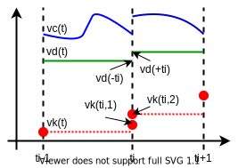

=== Mathematical Notation [[mathematical-definitions]]

This section introduces the mathematical notation used throughout this document to describe:

 * ordinary differential equations in state-space representations with discontinuities (events),
 * algebraic equation systems,
 * discrete-time equations (sampled-data systems).

FMU and importer use variables to exchange information.
The properties and semantics of variables are described in the <<modelDescription.xml>>.
Access to variable values is possible via appropriate API functions.

The <<independent>> variable latexmath:[\mathbf{t} \in \mathbb{T}] _[typically: time]_ is a tuple latexmath:[\mathbf{t} = (\mathbf{t}_R,\mathbf{t}_I)], where latexmath:[\mathbf{t}_R \in \mathbb{R},\ \mathbf{t}_{I} \in \mathbb{N} = \{0, 1, 2, \ldots\}].
The real part latexmath:[\mathbf{t}_R] of this tuple is the <<independent>> variable of the FMU for describing the continuous-time behavior of the model between events.
During continuous-time integration the integer part of time latexmath:[\mathbf{t}_I = 0].
latexmath:[\mathbf{t}_I] is a counter to enumerate (and therefore distinguish) the events at the same continuous-time instant latexmath:[\mathbf{t}_R].
This time definition is also called "super-dense time" in literature, see, for example, <<LZ07>>.
An ordering is defined on latexmath:[\mathbb{\text{T}}] that leads to the notation in <<table-model-exchange-math-notation>>.

.Conventions and notation used for time.
[#table-model-exchange-math-notation]
[cols="1,7,4"]
|====
|Operation
|Mathematical meaning
|Description

^|latexmath:[\mathbf{t}_1 < \mathbf{t}_2]
|latexmath:[(\mathbf{t}_{\mathit{R1}},\mathbf{t}_{\mathit{I1}}) < (\mathbf{t}_{\mathit{R2}}, \mathbf{t}_{\mathit{I2}})\ \Leftrightarrow \ \mathbf{t}_{\mathit{R1}} < \mathbf{t}_{\mathit{R2}}\ \textbf{or} \ \mathbf{t}_{\mathit{R1}}= \mathbf{t}_{\mathit{R2}} \ \textbf{and} \ \mathbf{t}_{\mathit{I1}} < \mathbf{t}_{\mathit{I2}}]
|latexmath:[\mathbf{t}_1] is before latexmath:[\mathbf{t}_2]

^|latexmath:[\mathbf{t}_1 = \mathbf{t}_2]
|latexmath:[(\mathbf{t}_{\mathit{R1}},\mathbf{t}_{\mathit{I1}}) = (\mathbf{t}_{\mathit{R2}},\mathbf{t}_{\mathit{I2}}) \ \Leftrightarrow  \mathbf{t}_{\mathit{R1}}= \mathbf{t}_{\mathit{R2}}\ \textbf{and} \ \mathbf{t}_{\mathit{I1}} = \mathbf{t}_{\mathit{I2}}]
|latexmath:[\mathbf{t}_1] is identical to latexmath:[\mathbf{t}_2]

^|latexmath:[\mathbf{t}^{+}]
|latexmath:[{(\mathbf{t}_R,\mathbf{t}_I)}^{+} \Leftrightarrow (\lim_{\mathit{\epsilon \rightarrow 0}}{\left(\mathbf{t}_R + \varepsilon \right),\mathbf{t}_{\mathit{Imax}})}]
|right limit at latexmath:[\mathbf{t}].
latexmath:[\mathbf{t}_{\mathit{Imax}}] is the largest occurring integer index of super-dense time at this latexmath:[\mathbf{t}_R]

^|latexmath:[^-\mathbf{t}]
|latexmath:[^{-}{(\mathbf{t}_R,\mathbf{t}_I)} \Leftrightarrow (\lim_{\mathit{\epsilon \rightarrow 0}}{\left( \mathbf{t}_R - \varepsilon \right),0)}]
|left limit at latexmath:[\mathbf{t}]

^|latexmath:[v^+(\mathbf{t})]
|latexmath:[v(\mathbf{t}^+)]
|value at the right limit of latexmath:[\mathbf{t}]

^|latexmath:[^{-}v(\mathbf{t})]
|latexmath:[v(^-\mathbf{t})]
|value at the left limit of latexmath:[\mathbf{t}]

^|latexmath:[^{\bullet}v(\mathbf{t})]
|latexmath:[
\begin{cases}
^{\bullet}v(t) \\
^{\bullet}v(\left( \mathbf{t}_R,\mathbf{t}_I \right))
\end{cases}
\Leftrightarrow
\begin{cases}
 v(^-t) & \text{ during } v(\left( \mathbf{t}_R, 0 \right)) \text{, v not clocked }  \\
 v(\left( \mathbf{t}_R,\mathbf{t}_I - 1 \right)) & \text{ for } v(\left( \mathbf{t}_R,\mathbf{t}_I \right)) \text{ with } I > 0  \text{, v not clocked } \\
 v \text{ at previous tick of C } & \text{ if } v \text{ for clocked variable } v \text{ of clock C}
\end{cases}
]
a|previous value
|====

_[Assume that an FMU has an event at latexmath:[\mathbf{t}_R=2.1s] and here a variable changes discontinuously._
_If no event iteration occurs, the time instant when the event occurs is defined as (2.1, 0), and the time instant when the integration is restarted is defined as (2.1, 1).]_

The hybrid differential equations exposed by FMI for Model Exchange or wrapped by FMI for Co-Simulation are described as piecewise continuous-time systems.
Discontinuities can occur at time instants latexmath:[\mathbf{t}_0, \mathbf{t}_1, \ldots, \mathbf{t}_n] where latexmath:[\mathbf{t}_i < \mathbf{t}_{i+1}].
These time instants are called `events`.
Events can be known beforehand (<<time event,`time events`>>), or are defined implicitly (<<state event,`state`>> and <<step event,`step events`>>), see below.
Between events, variables are either <<continuous>> or do not change their value.
A variable is called discrete-time, if it changes its value only at events.
Otherwise the variable is called continuous-time.
Only floating point variables can be continuous-time variables.
The following variable subscripts are used to describe the timing behavior of the corresponding variable (for example, latexmath:[\mathbf{v}_d] is a discrete-time variable):

.Conventions and notation used for variable subscripts.
[#table-subscripts]
[cols="1,10"]
|====
|Subscript
|Description

|`c`
|A continuous-time variable is a floating-point variable representing a continuous function of time inside each interval latexmath:[\mathbf{t}_i^+ < \ ^-\mathbf{t}_{i+1}].

|`d`
|A discrete-time variable changes its value only at event instants latexmath:[\mathbf{t} = (\mathbf{t}_i,n)].
Such a variable can change multiple times at the same continuous-time instant, but only at subsequent super-dense time instants latexmath:[n \in \mathbb{N} = \{0, 1, 2, \ldots\}].

|`k`
|A <<clocked-variable,clocked variable>> is a discrete-time variable associated with a <<Clock>>.
<<Clock>> (not clocked) variables synchronize events with the importer and across FMUs, they carry the information that a specific event happens.

|`c+d`
|A set of continuous-time and discrete-time variables.

|`d-k`
|A set of non-clocked, discrete-time variables.

|`u`
|Intermediate variables: a set of variables accessible in <<IntermediateUpdateMode>>.
These variables are continuous-time variables.

|`start`
|A variable at the start time of the simulation as defined by the argument <<startTime>> of <<fmi3EnterInitializationMode>>.

|`attribute=value`
|A set of variables which have an XML attribute-value combination as defined.
_[Example:_ latexmath:[\mathbf{v}_{\mathit{initial=exact}}] _are variables defined with attribute <<initial>> = <<exact>> (see <<definition-of-model-variables>>).]_

|====

At every event instant latexmath:[\mathbf{t}_i], continuous-time variables might change discontinuously (see <<figure-piecewise-continuous-variables>>):

.Piecewise-continuous variables of an FMU: continuous-time (latexmath:[\mathbf{v}_c]), discrete-time (latexmath:[\mathbf{v}_d]) and clocked (latexmath:[\mathbf{v}_k]).
[#figure-piecewise-continuous-variables]

The mathematical description of an FMU uses the following variables:

.Symbols for specific variable types.
[#table-variable-types]
[cols="1,10"]
|====
|Variable
|Description

a|latexmath:[\mathbf{t}]
a|<<independent>> variable _[typically: time]_ latexmath:[\in \mathbb{T}].
This variable is defined with <<causality>> = <<independent>>.
All other variables are functions of this independent variable.

For Co-Simulation and Scheduled Execution:

* The i-th communication point is denoted as latexmath:[\mathbf{t}_i]. +
* The communication step size is denoted as latexmath:[\mathbf{h}_i = \mathbf{t}_{i+1} - \mathbf{t}_i]. +

|latexmath:[\mathbf{v}]
|All exposed variables as listed in <<definition-of-model-variables,`<ModelVariables>`>>.
A subset of variables is selected via a <<table-subscripts,subscript>>.

|latexmath:[\mathbf{p}]
|Parameters.
The symbol without a subscript references variables with <<causality>> = <<parameter>>.
A subset of parameters is selected via a <<table-subscripts,subscript>>.

|latexmath:[\mathbf{u}]
|Input variables.
The values of these variables are defined outside of the model.
Variables of this type are defined with attribute <<causality>> = <<input>>.
A subset of inputs is selected via a <<table-subscripts,subscript>>.

|latexmath:[\mathbf{y}] +
latexmath:[\mathbf{y^{(j)}}]
|Output variables.
The values of these variables are computed in the FMU and they are designed to be used outside the FMU.
Variables of this type are defined with attribute <<causality>> = <<output>>.
For CS and SE: Also j-th derivatives latexmath:[\mathbf{y}^{(j)}(\mathbf{t}_{i+1})] can be provided if supported by the FMU.
A subset of outputs is selected via a <<table-subscripts,subscript>>.

|latexmath:[\mathbf{w}]
|Local variables of the FMU that must not be used for FMU connections.
Variables of this type are defined with attribute <<causality>> = <<local>>.
A subset of local variables is selected via a <<table-subscripts,subscript>>.

|latexmath:[\mathbf{z}]
|A vector of floating point continuous-time variables representing the <<state-event,event indicators>> used to locate <<state event,state events>>.

|[[state,`state`]]latexmath:[\mathbf{x}_c] +
latexmath:[\mathbf{\dot{x}}_c]
|A vector of floating point continuous-time variables representing the continuous-time <<state,`states`>>. +
A vector of floating point continuous-time variables representing the first derivatives of the continuous-time <<state,`states`>>.

|latexmath:[\mathbf{x}_d] +
latexmath:[^{\bullet}\mathbf{x}_d]
|latexmath:[\mathbf{x}_d] is a vector of (internal) discrete-time variables (of any type) representing the discrete-time states. +
latexmath:[{}^{\bullet}\mathbf{x}_d] is the value of latexmath:[\mathbf{x}_d] at the previous super-dense time instant. +

|latexmath:[\mathbf{T}_{\mathit{next}}]
|At an event instant, an FMU can define the next time instant latexmath:[\mathbf{T}_{\mathit{next}}], at which the next time event occurs (see also the definition of <<EventMode,events>>).
Every event removes automatically a previous definition of latexmath:[\mathbf{T}_{\mathit{next}}], and it must be explicitly defined again, even if a previously defined latexmath:[\mathbf{T}_{\mathit{next}}] was not yet reached (see <<fmi3UpdateDiscreteStates>>).

|[[relations,relations]] latexmath:[\mathbf{r}]
|A vector of Boolean variables representing relations: latexmath:[\mathbf{r}_j := \mathbf{z}_j > 0].
When entering <<ContinuousTimeMode>> all relations reported via the event indicators latexmath:[\mathbf{z}] are fixed and during this mode these relations are replaced by latexmath:[^{\bullet}\mathbf{r}].
Only during <<InitializationMode>> or <<EventMode>> the domains latexmath:[\mathbf{z}_j > 0] can change.
_[For more details, see <<frozen-relations,Remark 3>> below.]_

|[[buffers,buffers]] latexmath:[\mathbf{b}]
|Hidden data of the FMU.
_[For example, delay buffers in Model Exchange FMUs that are used in <<ContinuousTimeMode>>]_.

|====
