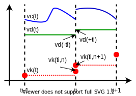

=== Mathematical Definitions [[mathematical-definitions]]

This section introduces the mathematical notation used throughout this document.
It is used to describe

 * ordinary differential equations in state-space representations with discontinuities (events),
 * algebraic equation systems,
 * discrete-time equations (sampled-data systems).

FMU and importer use variables to exchange information.
The properties and semantics of variables are described in the <<modelDescription.xml>>.
Access is possible via appropriate API functions.

The <<independent>> variable latexmath:[t \in \mathbb{T}] _[typically: time]_ is a tuple latexmath:[t = (t_R,t_I)], where latexmath:[t_R \in \mathbb{R},\ t_{I} \in \mathbb{N} = \{0, 1, 2, \ldots\}].
The real part latexmath:[t_R] of this tuple is the <<independent>> variable of the FMU for describing the continuous-time behavior of the model between events.
During continuous-time integration latexmath:[t_I = 0].
The integer part latexmath:[t_I] of this tuple is a counter to enumerate (and therefore distinguish) the events at the same continuous-time instant latexmath:[t_R].
This time definition is also called "super-dense time" in literature, see, for example, <<LZ07>>.
An ordering is defined on latexmath:[\mathbb{\text{T}}] that leads to the notation in <<table-model-exchange-math-notation>>.
_[The notation latexmath:[^{\bullet}t] is from <<BCP10,BCP10>>, adapted from non-standard analysis to super-dense time, in order to precisely define the value from the previous event iteration.]_

.Conventions and notation used.
[#table-model-exchange-math-notation]
[cols="1,7,4"]
|====
|Operation
|Mathematical meaning
|Description

^|latexmath:[t_1 < t_2]
|latexmath:[(t_{\mathit{R1}},t_{\mathit{I1}}) < (t_{\mathit{R2}}, t_{\mathit{I2}})\ \Leftrightarrow \ t_{\mathit{R1}} < t_{\mathit{R2}}\ \textbf{or} \ t_{\mathit{R1}}= t_{\mathit{R2}} \ \textbf{and} \ t_{\mathit{I1}} < t_{\mathit{I2}}]
|latexmath:[t_1] is before latexmath:[t_2]

^|latexmath:[t_1 = t_2]
|latexmath:[(t_{\mathit{R1}},t_{\mathit{I1}}) = (t_{\mathit{R2}},t_{\mathit{I2}}) \ \Leftrightarrow  t_{\mathit{R1}}= t_{\mathit{R2}}\ \textbf{and} \ t_{\mathit{I1}} = t_{\mathit{I2}}]
|latexmath:[t_1] is identical to latexmath:[t_2]

^|latexmath:[t^{+}]
|latexmath:[{{(t}_{R},t_{I})}^{+} \Leftrightarrow (\lim_{\mathit{\epsilon \rightarrow 0}}{\left(t_{R} + \varepsilon \right),t_{\mathit{Imax}})}]
|right limit at latexmath:[t].
latexmath:[t_{\mathit{Imax}}] is the largest occurring integer index of super-dense time

^|latexmath:[^-t]
|latexmath:[^{-}{{(t}_{R},t_{I})} \Leftrightarrow (\lim_{\mathit{\epsilon \rightarrow 0}}{\left( t_{R} - \varepsilon \right),0)}]
|left limit at latexmath:[t]

^|latexmath:[^{\bullet}t]
|latexmath:[^{\bullet}{\left( t_{R},t_{I} \right)\ } \Leftrightarrow \left\{ \begin{matrix} ^-t \ & \mathbf{if} \ t_I = 0 \\ (t_R, t_I - 1) \ & \mathbf{if} \ t_I > 0 \\ \end{matrix} \right.]
|previous time instant (= either left limit or previous event instant).

^|latexmath:[v^+(t)]
|latexmath:[v(t^+)]
|value at the right limit of latexmath:[t]

^|latexmath:[^{-}v(t)]
|latexmath:[v(^-t)]
|value at the left limit of latexmath:[t]

^|latexmath:[^{\bullet}v(t)]
|latexmath:[v(^{\bullet}t)]
|previous value (= either left limit or value from the previous event)
|====

_[Assume that an FMU has an event at latexmath:[t_R=2.1s] and here a variable changes discontinuously._
_If no event iteration occurs, the time instant when the event occurs is defined as (2.1, 0), and the time instant when the integration is restarted is defined as (2.1, 1).]_

The hybrid differential equations exposed by FMI for Model Exchange or wrapped by FMI for Co-Simulation are described as piecewise continuous-time systems.
Discontinuities can occur at time instants latexmath:[t_0, t_1, \ldots, t_n] where latexmath:[t_i < t_{i+1}].
These time instants are called `events`.
Events can be known before hand (= <<time event>>), or are defined implicitly (= <<state event,`state`>> and <<step event,`step events`>>), see below.
Between events, variables are either <<continuous>> or do not change their value.
A variable is called discrete-time, if it changes its value only at an event instant.
Otherwise the variable is called continuous-time.
Only floating point variables can be continuous-time.
The following variable subscripts are used to describe the timing behavior of the corresponding variable (for example, latexmath:[v_d] is a discrete-time variable):

Clock variables synchronize events with the importer and across FMUs, they carry the information that a specific event happens.

.Conventions and notation used for variable subscripts.
[#table-subscripts]
[cols="1,10"]
|====
|Subscript
|Description

|`c`
|A continuous-time variable is a floating-point variable representing a continuous function of time inside each interval latexmath:[t_i^+ < \ ^-t_{i+1}].

|`d`
|A discrete-time variable changes its value only at an event instant latexmath:[t = (t_i,n)].
Such a variable can change multiple times at the same continuous-time instant, but only at subsequent super-dense time instances latexmath:[n \in \mathbb{N} = \{0, 1, 2, \ldots\}].

|`k`
|A clocked variable is a discrete-time variable associated with a <<clock>>.
Clocked variables are a subset of discrete-time variables.
It changes its value only when this clock is active.
_[Formally, a clocked variable has a value only when its associated clock is active.
However, `fmi3Get{VariableType}` will return the value computed at the last clock activation time.]_

|`c`+`d`
|A set of continuous-time and discrete-time variables.

|`u`
|A set of continuous-time variables accessible in *Intermediate Update Mode*.

|`start`
|A variable at the start time of the simulation as defined by the argument <<startTime>> of <<fmi3EnterInitializationMode>>.
|====

At every event instant latexmath:[t_i], continuous-time variables might change discontinuously (see <<figure-piecewise-continuous-variables>>).

.Piecewise-continuous variables of an FMU: continuous-time (latexmath:[v_c]), discrete-time (latexmath:[v_d]) and clocked (latexmath:[v_k]).
[#figure-piecewise-continuous-variables]

The mathematical description of an FMU uses the following variables:

.Symbols for specific variable types.
[#table-variable-types]
[cols="1,10"]
|====
|Variable
|Description

|latexmath:[t]
|<<independent>> variable _[typically: time]_ latexmath:[\in \mathbb{T}].
This variable is defined with <<causality>> = <<independent>>.
All other variables are functions of this independent variable.

For Co-Simulation and Scheduled Execution: +
The i-th communication point is denoted as latexmath:[t_i] +
The communication step size is denoted as latexmath:[h_i = t_{i+1} - t_i] +

|latexmath:[\mathbf{v}]
|A vector of all exposed variables (all variables defined in element `<ModelVariables>`, see <<definition-of-model-variables>>).
A subset of the variables is selected via a subscript.

_[Example:_ latexmath:[\mathbf{v}_{\mathit{initial=exact}}] _are variables defined with attribute <<initial>> = <<exact>> (see <<definition-of-model-variables>>)._
_These are <<parameter,`parameters`>> and <<start>> values of other variables, such as initial values for <<state,`states`>>, state derivatives or <<output,`outputs`>>.]_

|latexmath:[\mathbf{p}]
|Parameters.
The symbol without a subscript references <<parameter,`parameters`>> (variables with <<causality>> = <<parameter>>).
A subset of the variables is selected via a subscript.

_[Example: Dependent <<parameter,`parameters`>> (variables with <<causality>> = <<calculatedParameter>>) are denoted as_ latexmath:[\mathbf{p}_{\mathit{calculated}}] _and <<tunable>> <<parameter,`parameters`>> (variables with <<causality>> = <<parameter>> and <<variability>> = <<tunable>>) are denoted as_ latexmath:[\mathbf{p}_{\mathit{tune}}] _.]_

|latexmath:[\mathbf{u}]
|Input variables.
The values of these variables are defined outside of the model.
Variables of this type are defined with attribute <<causality>> = <<input>>.

|latexmath:[\mathbf{y}] +
latexmath:[\mathbf{y^{(j)}}]
|Output variables.
The values of these variables are computed in the FMU and they are designed to be used outside the FMU.
Variables of this type are defined with attribute <<causality>> = <<output>>.
For CS and SE: Also j-th derivatives latexmath:[\mathbf{y}^{(j)}(t_{i+1})] can be provided if supported by the FMU.

|latexmath:[\mathbf{w}]
|Local variables of the FMU that must not be used for FMU connections.
Variables of this type are defined with attribute <<causality>> = <<local>>.

|latexmath:[\mathbf{z}]
|A vector of floating point continuous-time variables representing the event indicators used to define <<state event,`state events`>> (see <<figure-events>>).

|latexmath:[\mathbf{x}_c]
|A vector of floating point continuous-time variables representing the continuous-time <<state,`states`>>.

|latexmath:[\mathbf{x}_d] +
latexmath:[^{\bullet}\mathbf{x}_d]
|latexmath:[\mathbf{x}_d] is a vector of (internal) discrete-time variables (of any type) representing the discrete-time states. +
latexmath:[{}^{\bullet}\mathbf{x}_d] is the value of latexmath:[\mathbf{x}_d] at the previous super-dense time instant. +

|latexmath:[T_{\mathit{next}}]
|At initialization or at an event instant, an FMU can define the next time instant latexmath:[T_{\mathit{next}}], at which the next time event occurs (see also the definition of <<EventMode,events>>).
Every event removes automatically a previous definition of latexmath:[T_{\mathit{next}}], and it must be explicitly defined again, even if a previously defined latexmath:[T_{\mathit{next}}] was not yet reached (see <<fmi3UpdateDiscreteStates>>).

|latexmath:[\mathbf{r}]
|A vector of Boolean variables representing relations: latexmath:[r_{j} := z_{j} > 0].
When entering *Continuous-Time Mode* all relations reported via the event indicators latexmath:[\mathbf{z}] are fixed and during this mode these relations are replaced by latexmath:[^{\bullet}\mathbf{r}].
Only during *Initialization Mode* or *Event Mode* the domains latexmath:[z_{j} > 0] can change.
_[For more details, see <<Remark3,Remark 3>> below.]_
|====
