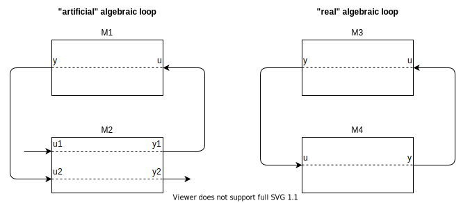

=== General Mechanisms [[general-mechanisms]]

This section contains the common interface definitions that allow a C program to invoke the FMU functions.

Note that the following general properties hold for an FMU:

- FMI functions of one instance do not need to be thread-safe. +
_[For example, if the functions of one instance of an FMU are accessed from more than one thread;
the multi-threaded simulation environment that uses the FMU must guarantee that there are no race conditions while invoking the FMI functions.
The FMU itself does not implement any services to support this.]_

- FMI functions must not change global settings which affect other processes/threads.
An FMI function may change settings of the thread in which it is called (such as floating point control registers), provided these changes are restored before leaving the function or before a callback function is called. +
_[This property ensures that functions of different FMU instances can be called safely in any order._
_Additionally, they can be called in parallel provided the functions are called in different processes._
_If an FMI function changes for example the floating point control word of the CPU, it must restore the previous value before return of the function._
_For x86 CPUs, the floating point control word is set using the `fldcw` instruction._
_This can be used to switch on additional exceptions such as floating point division by zero._
_An FMU might temporarily change the floating point control word and get notified on floating point exceptions internally, but has to restore the flag and clear the floating point status word before return of the respective FMI function.]_

- In general, FMI function arguments are not allowed to be NULL, unless explicitly allowed by the standard document where NULL will be assigned a specific semantic. +
_[For an example of NULL being explicitly allowed see <<resourceLocation>>._
_Careful implementations should still guard against NULL pointers.]_

- The FMI Standard does not provide a run-time platform or portability layer.
Access to operating system resources and services, such as memory and file system, must be implemented with special care because the availability of such resources and services is not guaranteed.
If some resource is required by the FMU but is not available, the FMU must log what resource failed and return with error.

==== Header Files and Naming of Functions [[header-files-and-naming-of-functions]]

Three header files are provided that define the interface of an FMU.
In all header files the convention is used that all C function and type definitions start with the prefix `fmi3`:

`fmi3PlatformTypes.h`::
contains the type definitions of the input and output arguments of the functions as well as some C preprocessor macro definitions for constants.
This header file must
be used both by the FMU and by the importer. +
_[Example of a definition in this header file:_
+
[source, C]
----
typedef double fmi3Float64;
----
+
_]_

`fmi3FunctionTypes.h`::
contains `typedef` definitions of all function prototypes of an FMU as well as enumerations for constants.
This header file includes `fmi3PlatformTypes.h`.
When dynamically loading an FMU, these definitions can be used to type-cast the function pointers to the respective function definition.
For simplicity, the function type for each function is composed of the function name itself with the suffix `TYPE`. +
_[Example of a definition in this header file:_
+
[source, C]
----
typedef fmi3Status fmi3SetTimeTYPE(fmi3Instance, fmi3Float64);
----
+
_]_

`fmi3Functions.h`::
contains the function prototypes of an FMU that can be accessed in simulation environments.
+
This header file includes `fmi3PlatformTypes.h` and `fmi3FunctionTypes.h`.
The header file version number for which the model was compiled, can be inquired by the importer with <<fmi3GetVersion>> (see <<inquire-version-number>>). +
+
_[Example of a definition in this header file:_
+
[source, C]
----
FMI3_Export fmi3SetTimeTYPE fmi3SetTime;
----
+
_For Microsoft and Cygwin compilers `FMI3_Export` is defined as_ `pass:[__]declspec(dllexport)` _and for Gnu-Compilers as_ `pass:[__]attribute__ ( ( visibility("default") ) )` _in order to export the name for dynamic loading._
_Otherwise it is an empty definition.]_

The goal is that both source code and binary representations of FMUs are supported and that several FMUs might be present at the same time in an executable (for example, FMU A may use an FMU B).
In order for this to be possible, the names of the functions in different FMUs must be different, or function pointers must be used.
To support the source code representation of FMUs, macros are provided in `fmi3Functions.h` to build the actual function names by using a function prefix that depends on how the FMU is shipped.

_[These macros can be defined differently in a target specific variant of `fmi3Functions.h` to adjust them to the requirements of the supported compilers and platforms of the importing tool.]_

An FMU C-file must include at the beginning a `define` of `FMI3_FUNCTION_PREFIX` with the same value as the value of the <<modelIdentifier>> attribute defined in `<fmiModelDescription><ModelExchange>`, `<fmiModelDescription><CoSimulation>` or `<fmiModelDescription><ScheduledExecution>` together with `pass:[_]` at the end (see <<model-exchange-schema>>, <<co-simulation-schema>>, <<scheduled-execution-schema>>).

This `define` must be directly followed with an `#include "fmi3Functions.h"` statement.

Typically, FMU functions are used as follows:

[source, C]
----
// FMU is shipped with C source code, or with static link library
#define FMI3_FUNCTION_PREFIX MyModel_
#include "fmi3Functions.h"
< usage of the FMU functions e.g. MyModel_fmi3SetTime >

// FMU is shipped with DLL/SharedObject
#include "fmi3FunctionTypes.h"
fmi3SetTimeTYPE *myname_setTime = < load symbol "fmi3SetTime" from DLL/SharedObject >;
< usage of the FMU function pointers, e.g. myname_setTime >
----

A function that is defined as `fmi3GetFloat64` is changed by the macros to a function name as follows:

- If the FMU is shipped with C source code or with static link library: +
The constructed function name is `MyModel_fmi3GetFloat64`.
In other words the function name is prefixed with the model name and an `pass:[_]`.
A simulation environment can therefore construct the relevant function names by generating code for the actual function call.
In case of a static link library, the name of the library is `MyModel.lib` on Windows and `libMyModel.a` on Linux; in other words the <<modelIdentifier>> attribute is used to create the library name.

- If the FMU is shipped with DLL/SharedObject: +
The constructed function name is `fmi3GetFloat64`, in other words, it is not changed.
_[This can be realized in the case of a source code FMU with a target-specific version of `fmi3Functions.h` that does not use FMI3_FUNCTION_PREFIX to construct the function names.]_
A simulation environment will then dynamically load this library and will explicitly import the function symbols by providing the FMI function names as strings.
The name of the library is `MyModel.dll` on Windows or `MyModel.so` on Linux; in other words the <<modelIdentifier>> attribute is used as library name.

_[An FMU can be optionally shipped so that it basically contains only the communication to another simulation tool (`needsExecutionTool = true`, see <<fmi-for-co-simulation>>)._
_This is particularly common for co-simulation tasks._
_In this tool coupling case one DLL/Shared Object can be used for all models due to no function prefixing.]_

Since <<modelIdentifier>> is used as prefix of a C-function name it must fulfill the restrictions on C-function
names (only letters, digits and/or underscores are allowed).
_[For example, if `modelName = "A.B.C"`, then <<modelIdentifier>> might be "A_B_C".]_
Since <<modelIdentifier>> is also used as name in a file system, it must also fulfill the restrictions of the targeted operating system.
Basically, this means that it should be short.
These restrictions apply to all interface types and for binary and source-code FMUs.
_[For example, the Windows API only supports full path-names of a file up to 260 characters (see: http://msdn.microsoft.com/en-us/library/aa365247%28VS.85%29.aspx).]_

==== Platform Dependent Definitions

To simplify porting, no C types are used in the function interfaces, but the alias types are defined in this section.
All definitions in this section are provided in the header file `fmi3PlatformTypes.h`.
It is required to use this definition for all binary FMUs.

[source, C]
----
include::../headers/fmi3PlatformTypes.h[tags=Component]
----

This is a pointer to an FMU specific data structure that contains the information needed to process the model equations or to process the co-simulation of the model/subsystem represented by the FMU.

[source, C]
----
include::../headers/fmi3PlatformTypes.h[tags=ComponentEnvironment]
----

This is a pointer to a data structure in the importer.
Using this pointer, data can be transferred between the importer and callback functions it provides (see <<FMUStateSetable>>).

[source, C]
----
include::../headers/fmi3PlatformTypes.h[tags=FMUState]
----

This is a pointer to a data structure in the FMU that saves the internal FMU state of the actual or a previously saved time instant.
This allows to restart a simulation from a saved FMU state (see <<get-set-fmu-state>>).

[source, C]
----
include::../headers/fmi3PlatformTypes.h[tags=ValueReference]
----

[[fmi3ValueReference,`fmi3ValueReference`]]
This is a handle to a (base type) variable value of the model.
A <<fmi3ValueReference>> uniquely identifies the value and other properties of a variable, except for the variable name and the display unit that may differ for <<alias>> variable definitions.

Structured entities, such as records, must be flattened into a set of values (scalars or arrays) of type `fmi3Float64`, `fmi3Int32`, etc.
Arrays may be flattened into a set of scalars or represented directly as array values.
An <<fmi3ValueReference>> references one such value (scalar or array).
The coding of <<fmi3ValueReference>> is a "secret" of the environment that generated the FMU.
The interface to the equations only provides access to variable values via <<fmi3ValueReference>>.
Extracting concrete information about a variable can be done by reading the <<modelDescription.xml>> in which the <<fmi3ValueReference>> are defined.
If a function in the following sections is called with a wrong <<fmi3ValueReference>> value _[for example, setting a constant with a call to `fmi3SetFloat64`]_, then the function must return with an error ( <<fmi3Error,`fmi3Status == fmi3Error`>>, see <<status-returned-by-functions>>).

Listing <<code-base-types>> shows the base types used in the interfaces of the C functions.

.Base types
[[code-base-types]]
[source, C]
----
include::../headers/fmi3PlatformTypes.h[tags=VariableTypes]
----

==== Status Returned by Functions [[status-returned-by-functions]]

This section defines the `status` flag (an enumeration of type `fmi3Status` defined in file `fmi3FunctionTypes.h`) that is returned by functions to indicate the success of the function call:

[source, C]
----
include::../headers/fmi3FunctionTypes.h[tags=Status]
----

The status has the following meaning:

[[fmi3OK,`fmi3OK`]]
`fmi3OK`::
The call was successful.
The output argument values are defined.

[[fmi3Warning,`fmi3Warning`]]
`fmi3Warning`::
A non-critical problem was detected, but the computation can continue.
The output argument values are defined.
Function <<logMessage>> was called by the FMU and the user is expected to handle the problem. +
_[In certain applications, e.g. in a prototyping environment, warnings may be acceptable._
_For production environments warnings should be treated like errors unless they can be safely ignored.]_

[[fmi3Discard,`fmi3Discard`]]
`fmi3Discard`::
The call was not successful and the FMU is in the same state as before the call.
The output argument values are not defined, but the computation can continue.
When debug logging is enabled (`loggingOn == fmi3True`) the function <<logMessage>> was called by the FMU.
Advanced simulation algorithms can try alternative approaches to drive the simulation by calling the function with different arguments or calling another function.
Otherwise the simulation algorithm has to treat this return code like <<fmi3Error>> and has to terminate the simulation. +
_[Examples for usage of <<fmi3Discard>> are_
 * _handling of <<min-max-violations,min/max violation>>, or_
 * _signal numerical problems during model evaluation forcing smaller step sizes.]_

[[fmi3Error,`fmi3Error`]]
`fmi3Error`::
The call failed.
The output argument values are undefined and the simulation cannot be continued.
Function <<logMessage>> was called by the FMU and the FMU is in state <<Terminated>>.
If a function returns <<fmi3Error>>, it is possible to restore a previously retrieved FMU state by calling <<fmi3SetFMUState>>.
Otherwise <<fmi3FreeInstance>> or <<fmi3Reset>> must be called.
When detecting illegal arguments or a function call not allowed in the current state according to the respective state machine, the FMU must return <<fmi3Error>>.
Other instances of this FMU are not affected by the error.

[[fmi3Fatal,`fmi3Fatal`]]
`fmi3Fatal`::
The state of all instances of the model is irreparably corrupted.
_[For example, due to a run-time exception such as access violation or integer division by zero during the execution of an FMI function.]_
Function <<logMessage>> was called by the FMU.
It is not allowed to call any other function for any instance of the FMU.

==== Inquire Version Number of Header Files [[inquire-version-number]]

[[fmi3GetVersion,`fmi3GetVersion`]]
[source, C]
----
include::../headers/fmi3FunctionTypes.h[tags=GetVersion]
----

This function returns `fmi3Version` of the `fmi3Functions.h` header file which was used to compile the functions of the FMU.
This function call is allowed always and in all interface types.

The standard header file as documented in this specification has version `"3.0"`, so this function returns `"3.0"`.

==== Advancing Time [[advancing-time]]

This section highlights the differences of the concept of time (in general the independent variable) for the three different FMI types, ME, CS and SE.
Depending on the instantiated FMI type, the importer is restricted in what functions it is allowed to call in order to drive the simulation.

In Model Exchange, time is under the sole control of the importer and its integration algorithm.
The model itself receives the current time to be used in its computation with <<fmi3SetTime>>.
In fact, time is not necessarily always advancing as solvers might need to jump back and forth in time to localize events using zero-crossings of <<eventIndicator, event indicators>>.

In Co-Simulation, time advances in (possibly variable) steps negotiated between the co-simulation algorithm of the importer and the FMU.
The importer calls <<fmi3DoStep>> with the <<currentCommunicationPoint>> and a target <<communicationStepSize>> (required to be larger than 0.0).
During this <<fmi3DoStep>>, both importer and FMU might encounter events (or other situations) that require reduction of the <<communicationStepSize>> (potentially even down to 0.0).
The FMU may use <<earlyReturn>> argument of the <<fmi3DoStep>> function to tell the importer that the FMU needs to return earlier, and the importer may use the callback <<fmi3CallbackIntermediateUpdate>> to signal the FMU that the latter should return earlier.
The output argument <<lastSuccessfulTime>> of <<fmi3DoStep>> allows the FMU to signal the importer its current internal time.

In Scheduled Execution, time has a more discrete form.
The scheduler of the importer activates specific tasks according to the time of the importer.
The time itself is communicated to the FMU as <<activationTime>> argument of <<fmi3ActivateModelPartition>>.

==== Variables [[fmu-variables]]

FMU and importer use variables to exchange information.
All variables are listed in the <<definition-of-model-variables,`modelDescription.xml`>> as elements of `<fmiModelDescription><ModelVariables>`.

They are identified with a unique handle called <<valueReference, value reference>>.

The attribute <<causality>> defines the direction of the information flow with respect to the FMU (e.g. <<input>>, <<output>>, <<parameter>>).

A variable can be a scalar or a multi-dimensional array.

===== Serialization of Array Variables [[serialization-of_variables]]

When getting or setting the values of array variables, the serialization of array variable values used in C-API function calls, as well as in the XML <<start>> attributes, is defined as row major, i.e., dimension order from left to right for the C-API (e.g. `array[dim1][dim2]...[dimN]`), and the document order in the XML attributes for the respective dimensions.
For this serialization of array variables the sparsity pattern of the array is not taken into account.
All elements of the array, including structural zeros, are serialized.

_[Example: A 2D matrix_
[latexmath]
++++
A = \left( \begin{array}{cc} a_{11}&a_{12}\\
                             a_{21}&a_{22}\\
                             a_{31}&a_{32}\\
            \end{array} \right)
++++
_is serialized as follows:_
[frame="none",grid="none"]
|========================================
|_A[0][0]=a11_ | _memory  address: A_   |
|_A[0][1]=a12_ | _memory  address: A+1_ |
|_A[1][0]=a21_ | _memory  address: A+2_ |
|_A[1][1]=a22_ | _memory  address: A+3_ |
|_A[2][0]=a31_ | _memory  address: A+4_ |
|_A[2][1]=a32_ | _memory  address: A+5_ |
|========================================
_]_

===== Getting and Setting Variable Values [[get-and-set-variable-values]]

Restrictions for setting and getting of variables with certain types, causalities and variabilities are described in the state machine and state descriptions (see <<common-state-machine>>, <<state-machine-model-exchange>> in case of Model Exchange, <<state-machine-co-simulation>> for Co-Simulation and <<state-machine-scheduled-execution>> for Scheduled Execution).

The value of a variable must be accessed with the respective <<get-and-set-variable-values,`fmi3Get/Set{VariableType}`>> (see also <<VariableType,`{VariableType}`>> and <<VariableTypeExclClock,`{VariableTypeExclClock}`>>) for the <<definition-of-model-variables,type defined>> in the <<modelDescription.xml>>.
To set or inquire variables of type <<figure-schema-Enumeration,`Enumeration`>>, `fmi3SetInt64` and `fmi3GetInt64` must be used.

The current values of the variables can be inquired with the following functions:

[source, C]
----
include::../headers/fmi3FunctionTypes.h[tags=Getters]

include::../headers/fmi3FunctionTypes.h[tags=GetClock]
----

* `valueReferences` is a vector of `nValueReferences` value handles that define the variables that shall be inquired.

* `values` is a vector with the actual values of these variables.

* `sizes` is a vector with the actual sizes of the values for binary variables.

* `nValues` provides the number of values in the `values` vector (and `sizes` vector, where applicable) which is only equal to `nValueReferences` if all <<valueReference>>pass:[s] point to scalar variables.
_[`nValues` and `nValueReferences` is, strictly speaking, redundant information, but is added to ensure memory safety and other sanity checks.]_

The strings returned by `fmi3GetString`, as well as the binary values returned by `fmi3GetBinary`, must be copied by the importer because the allocated memory for these strings might be deallocated or overwritten by the next call of an FMU function.

It is possible to set the values of variables using the following functions:

[source, C]
----
include::../headers/fmi3FunctionTypes.h[tags=Setters]

include::../headers/fmi3FunctionTypes.h[tags=SetClock]
----

* `valueReferences` is a vector of `nValueReferences` value handles that define the variables that shall be set.

* `values` is a vector with the actual values of these variables.

* `sizes` is a vector with the actual sizes of the values of binary variables.

* `nValues` provides the number of values in the `values` vector (and `sizes` vector, where applicable) which is only equal to `nValueReferences` if all <<valueReference>>pass:[s] point to scalar variables.

With two exceptions, all variables that are allowed to be set with <<get-and-set-variable-values,`fmi3Set{VariableType}`>> keep their respective values until the next call to <<get-and-set-variable-values,`fmi3Set{VariableType}`>>.
Exceptions:

. Variables of type clock must be deactivated during <<fmi3UpdateDiscreteStates>> by the FMU.
. By setting the complete <<get-set-fmu-state,FMU state>> using <<fmi3SetFMUState>>, all variables are potentially changed.

All strings passed as arguments to `fmi3SetString`, as well as all binary values passed as arguments to `fmi3SetBinary`, must be copied during these function calls, because there is no guarantee of the lifetime of strings or binary values, when these functions return.

===== Handling min/max Range Violations [[min-max-violations]]

<<min-max,Attributes `min` and `max`>> can be defined for variables of float, integer or enumeration types.
The question is how <<get-and-set-variable-values,`fmi3Set{VariableType}`>>, <<get-and-set-variable-values,`fmi3Get{VariableType}`>> shall utilize this definition.
There are several conflicting requirements: +
Avoiding forbidden regions (for example, if `u` is an <<input>> and "sqrt(u)" is computed in the FMU, `min = 0` on `u` shall guarantee that only values of `u` in the allowed regions are provided).
Numerical algorithms (solvers or optimizers) do not guarantee constraints.
If a variable is outside of the bounds, the solver tries to bring it back into the bounds.
As a consequence, calling <<get-and-set-variable-values,`fmi3Get{VariableType}`>> during an iteration of such a solver might return values that are not in the defined min/max region.
After the iteration is finalized, it is only guaranteed that a value is within its bounds up to a certain numerical precision. +
During system creation and prototyping, checks on min/max should be performed.
For maximum performance on production or real-time systems, these checks might not be performed. +
The approach in FMI is therefore that min/max definitions are an information from the FMU to the environment defining the region in which the FMU is designed to operate.
In any case, it is expected that the FMU handles variables appropriately where the region definition is critical.
For example, dividing by an <<input>> (so the <<input>> should not be in a small range of zero) or taking the square root of an <<input>> (so the <<input>> should not be negative) may either result in returning <<fmi3Discard>> or <<fmi3Error>>, or the FMU is able to handle this situation in other ways.

If the FMU is generated so that min/max shall be checked whenever meaningful (for example, for debug purposes), then the following strategy should be used:

If <<get-and-set-variable-values,`fmi3Set{VariableType}`>> is called violating the min/max attribute settings of the corresponding variable, the following actions are performed:

* On a <<fixed>> or <<tunable>> <<parameter>> <<fmi3Discard,`fmi3Status == fmi3Discard`>> is returned.
* On an <<input>>, the FMU decides what to return (If no computation is possible, it could return <<fmi3Discard,`fmi3Status == fmi3Discard`>>, in other situations it may return <<fmi3Warning>> or <<fmi3Error>>, or <<fmi3OK>>, if it is uncritical).

If an FMU defines min/max values for integer types and `<Enumeration>` variables (<<local>> and <<output>> variables), then the expected behavior of the FMU is that <<get-and-set-variable-values,`fmi3Get{VariableType}`>> functions return values in the defined range.

If an FMU defines min/max values, then the expected behavior of the FMU is that <<get-and-set-variable-values,`fmi3Get{VariableType}`>> returns values at the solution (accepted steps of the integrators) in the defined range with a certain uncertainty related to the tolerances of the numerical algorithms.]

===== Getting and Setting the Complete FMU State [[get-set-fmu-state]]

--
The FMU has an internal state consisting of all values that are needed to continue a simulation.
This internal state consists especially of the values of the continuous states, iteration variables, <<parameter>> values, <<input>> values, delay buffers, file identifiers, and FMU internal status information.
With the functions of this section, the internal FMU state can be copied and the pointer to this copy is returned to the environment.
The FMU state copy can be set as actual FMU state, in order to continue the simulation from it.

_[Examples for using this feature:_

_For variable step-size control of co-simulation algorithms (get the FMU state for every accepted communication step; if the follow-up step is not accepted, restart co-simulation from this FMU state)._

_For nonlinear Kalman filters (get the FMU state just before initialization; in every sample period, set new continuous states from the Kalman filter algorithm based on measured values; integrate to the next sample instant and inquire the predicted continuous states that are used in the Kalman filter algorithm as basis to set new continuous states)._

_For nonlinear model predictive control (get the FMU state just before initialization; in every sample period, set new continuous states from an observer, initialize and get the FMU state after initialization._
_From this state, perform many simulations that are restarted after the initialization with new input variables proposed by the optimizer).]_

Furthermore, the FMU state can be serialized and copied in a byte vector.
_[This can be, for example, used to perform an expensive steady-state initialization, copy the received FMU state in a byte vector and store this vector on file._
_Whenever needed, the byte vector can be loaded from file and deserialized, and the simulation can be restarted from this FMU state, in other words, from the steady-state initialization.]_

[[fmi3GetFMUState, `fmi3GetFMUState`]]
Function <<fmi3GetFMUState>>::

[source, C]
----
include::../headers/fmi3FunctionTypes.h[tags=GetFMUState]
----

[[FMUState,`FMUState`]]This function makes a copy of the internal FMU state and returns a pointer to this copy in <<FMUState>>.
If on entry `*FMUState == NULL`, a new allocation is required.
If `*FMUState != NULL`, then `*FMUState` points to a previously returned <<FMUState>> that has not been modified since.
In particular, <<fmi3FreeFMUState>> had not been called with this <<FMUState>> as an argument.
_[Function <<fmi3GetFMUState>> typically reuses the memory of this <<FMUState>> in this case and returns the same pointer to it, but with the actual <<FMUState>>.]_

[[fmi3SetFMUState, `fmi3SetFMUState`]]
Function <<fmi3SetFMUState>>::

[source, C]
----
include::../headers/fmi3FunctionTypes.h[tags=SetFMUState]
----

This function copies the content of the previously copied <<FMUState>> back and uses it as actual new FMU state.
The <<FMUState>> copy still exists.
_[The simulation is restarted at this state, when calling <<fmi3SetFMUState>> with <<FMUState>>.]_

[[fmi3FreeFMUState, `fmi3FreeFMUState`]]
Function <<fmi3FreeFMUState>>::

[source, C]
----
include::../headers/fmi3FunctionTypes.h[tags=FreeFMUState]
----

This function frees all memory and other resources allocated with the <<fmi3GetFMUState>> call for this <<FMUState>>.
The argument to this function is the <<FMUState>> to be freed.
If a null pointer is provided, the call is ignored.
The function returns a null pointer in argument <<FMUState>>.

These functions can be called, if the optional capability flag <<canGetAndSetFMUState>> is set to `true`.

[[fmi3SerializedFMUStateSize,`fmi3SerializedFMUStateSize`]]
Function <<fmi3SerializedFMUStateSize>>::

[source, C]
----
include::../headers/fmi3FunctionTypes.h[tags=SerializedFMUStateSize]
----

This function returns the `size` of the byte vector, in order that <<FMUState>> can be stored in it.
With this information, the environment has to allocate an `fmi3Byte` vector of the required length `size`.

[[fmi3SerializeFMUState,`fmi3SerializeFMUState`]]
Function <<fmi3SerializeFMUState>>::

[source, C]
----
include::../headers/fmi3FunctionTypes.h[tags=SerializeFMUState]
----

This function serializes the data which is referenced by pointer <<FMUState>> and copies this data in to the byte vector `serializedState` of length `size`, that must be provided by the environment.

[[fmi3DeSerializeFMUState,`fmi3DeSerializeFMUState`]]
Function <<fmi3DeSerializeFMUState>>::

[source, C]
----
include::../headers/fmi3FunctionTypes.h[tags=DeSerializeFMUState]
----

This function deserializes the byte vector `serializedState` of length `size`, constructs a copy of the FMU state and returns <<FMUState>>, the pointer to this copy.

These functions are only supported by the FMU, if the optional capability flags <<canGetAndSetFMUState>> and <<canSerializeFMUState>> in `<fmiModelDescription><ModelExchange|CoSimulation|ScheduledExecution>` in the XML file are explicitly set to `true` (see <<fmi-for-model-exchange>>, <<fmi-for-co-simulation>>, <<fmi-for-scheduled-execution>>).
--

==== Selective Computation of Variables [[selectiv-computation]]

Depending on the phase of the solver algorithm, different FMU variables need to be computed.
FMI allows selective retrieval of FMU variables with specific get functions (e.g. <<get-and-set-variable-values,`fmi3Get{VariableType}`>>, <<fmi3GetEventIndicators>>, <<fmi3GetDerivatives>>).
This enables computation on demand with subsequent calls returning the same value until some set operation requires re-computation.

For example, during the iteration of an integrator step, only the state derivatives need to be computed, provided the <<output>> of a model is not connected.
When localizing <<state-event,state events>>, only the computation of event indicators might be required.

Because specific set functions exist (<<get-and-set-variable-values,`fmi3Set{VariableType}`>>, <<fmi3SetTime>>, <<fmi3SetContinuousStates>>), caching algorithms can be applied to reuse already computed values.

In all tables describing the mathematical model of a state (e.g. <<table-math-model-exchange,ContinuousTimeMode>>), for notational convenience one function (e.g. latexmath:[\mathbf{f}_\mathit{cont}]) is defined to compute all output arguments from all inputs arguments.
In an FMU, every output argument can be computed by its specific get function.
Additionally, the output argument need not be a function of all input arguments, but of only a subset from it, as defined in the <<modelDescription.xml>> under `<ModelStructure>`.

_[The functions above have the slight drawback that values must always be copied._
_For example, a call to_ <<fmi3SetContinuousStates>> _will provide the actual states in a vector, and this function has to copy the values in to the internal model data structure so that subsequent evaluation calls can utilize these values._
_If this turns out to be an efficiency issue, a future release of FMI might provide additional functions to provide the address of a memory area where the variable values are present.]_

==== Algebraic Loops [[algebraic-loops]]

When connecting FMUs, loop structures can occur that might lead to linear or non-linear algebraic systems of equations, involving continuous and discrete-time variables.
In order to detect and solve such systems of equations efficiently, information which <<output,`output`>> depends directly on which <<input,`inputs`>> is needed.
This data is optionally provided in the <<modelDescription.xml>> under element `<ModelStructure>`.
If this data is not provided, the worst case must be assumed: all <<output>> variables depend algebraically on all <<input>> variables.

_[Example: In <<figure-connected-fmus>> two different types of connected FMUs are shown (the "dotted lines" characterize the dependency information):_

.Calling sequences for FMUs that are connected in a loop.
[#figure-connected-fmus]

_Since different variables are computed in every mode and the causality of variable computation can be different in <<InitializationMode>> as with respect to the other two modes, it might be necessary to solve different kinds of loops in the different modes._
_Artificial algebraic loops (see left diagram of <<figure-connected-fmus>>) can be solved in the modes <<InitializationMode>>, <<EventMode>>, and <<ContinuousTimeMode>> by an appropriate sequence of <<get-and-set-variable-values,`fmi3Set{VariableType}`>> and <<get-and-set-variable-values,`fmi3Get{VariableType}`>> calls:_

[source, C]
----
fmi3Instance FMI1, FMI2;
fmi3ValueReference vr_FMU1_u, vr_FMU1_y, vr_FMU2_u1, vr_FMU2_u2, vr_FMU2_y1, vr_FMU2_y2;
fmi3Float64 s=0.1, FMU2_y1, FMU1_y, FMU2_y2;
...
fmi3SetFloat64(FMU2, &vr_FMU2_u1, 1, &s,        1);
fmi3GetFloat64(FMU2, &vr_FMU2_y1, 1, &FMU2_y1,  1);
fmi3SetFloat64(FMU1, &vr_FMU1_u,  1, &FMU2_y1,  1);
fmi3GetFloat64(FMU1, &vr_FMU1_y,  1, &FMU1_y,   1);
fmi3SetFloat64(FMU2, &vr_FMU2_u2, 1, &FMU1_y,   1);
fmi3GetFloat64(FMU2, &vr_FMU2_y1, 1, &FMU2_y2,  1);
...
----

_In the right diagram, FMU3 and FMU4 are connected in such a way that a real algebraic loop is formed._
_This loop might be solved iteratively, for example with a Newton method._
_In every iteration the iteration variable FMU4_u is provided by the solver, and via the shown sequence of <<get-and-set-variable-values,`fmi3Set{VariableType}`>> and <<get-and-set-variable-values,`fmi3Get{VariableType}`>> calls, the residual is computed and used by the solver to determine a new value of FMU4_u._
_The iteration is terminated when the residual is small enough._
_This method works for <<InitializationMode>>, <<EventMode>>, and <<ContinuousTimeMode>>._

[source, C]
----
fmi3Instance FMU3, FMU4;
fmi3ValueReference vr_FMU3_u, vr_FMU3_y, vr_FMU4_u, vr_FMU4_y;
fmi3Float64 s, FMU3_y, FMU4_y, residual;
bool converged = false;

while (!converged) { // start iteration
  // s determined by the solver
  ...
  fmi3SetFloat64(FMU4, &vr_FMU4_u, 1, &s,   1);
  fmi3GetFloat64(FMU4, &vr_FMU4_y, 1, &FMU4_y,  1);
  fmi3SetFloat64(FMU3, &vr_FMU3_u, 1, &FMU4_y,  1);
  fmi3GetFloat64(FMU3, &vr_FMU3_y, 1, &FMU3_y,  1);
  residual=s-FMU3_y; // provided to the solver
  converged=residual<tolerance;
}
----

_In <<StepMode>>, <<fmi3SetFMUState>> is required to restore the FMU state before the next iteration with <<get-and-set-variable-values,`fmi3Set{VariableType}`>>, <<fmi3DoStep>>, and <<get-and-set-variable-values,`fmi3Get{VariableType}`>> is executed._

_In <<EventMode>>, the algorithms from above must be embedded in an event iteration:_
[source, C]
----
fmi3Instance FMUx, FMUy;
bool newDiscreteStatesNeededx;
bool newDiscreteStatesNeededy;

fmi3EnterEventMode(FMUx,...);
fmi3EnterEventMode(FMUy,...);
do { // start event iteration
    // solve algebraic loop as described in the sample codes above

    // introduce new instant of super-dense time
    fmi3NewDiscreteStates(FMUx, newDiscreteStatesNeededx, ...);
    fmi3NewDiscreteStates(FMUy, newDiscreteStatesNeededy, ...);
} while (newDiscreteStatesNeededx || newDiscreteStatesNeededy);

fmi3EnterStepMode(FMUx); // for CS
fmi3EnterStepMode(FMUy); // for CS
// or for ME: fmi3EnterContinuousTimeMode(FMUx);
// or for ME: fmi3EnterContinuousTimeMode(FMUy);
----

_When solving algebraic loops in <<EventMode>>, limitations to variable manipulations declared with XML attribute <<canHandleMultipleSetPerTimeInstant>> must be considered.]_

==== Clocks [[clocks,clocks]]

FMI 3.0 specifies the behavior of a clocked FMU.
FMI 3.0 does not specify how the importer uses this functionality.
This allows different use cases to be implemented with different semantics.

===== Motivation

Clock variables synchronize events between importer and across FMUs, by

. communicating exactly which specific event happens and
. exactly at which time instant, independent from continuous time specified by the arguments of `fmi3SetTime` or `fmi3DoStep`.

The first point solves the issue that an FMU must know exactly which event happens during an <<EventMode>> if several events are very close to one another.

The second point solves the issue that computing exactly when an event happens is impossible to guarantee across importer and FMUs when using floating point computations.

===== Clock Types

Clocks are <<discrete>> <<fmu-variables,variables>> with a special semantic.

The following clock types are described in detail after the table.

Input clocks::
[[inputClock, `input clock`]]
denote all clocks with <<causality>> <<input>>.
The importer will activate <<inputClock, `input clocks`>> using <<fmi3SetClock>> or <<fmi3ActivateModelPartition>>.
Contrary to the importer being the source of the actual clock activations, the definition of the clock timing comes from the FMU, either through the <<modelDescription.xml>> or calling <<fmi3GetInterval>>, or from another clock connected to a <<triggered>> input clock.

Output clocks::
[[outputClock, `output clock`]]
denote the <<triggered>> <<outputClock>>.
There is only one such <<clock>> type.
We still refer to it as <<outputClock>> for simplicity.
The importer calls <<fmi3GetClock>> to inquire the clock activation state.

.Overview of Clock Types.
[[table-overview-clocks]]
[cols="9,9,16,9,40,40",options="header"]
|====
2+|Clock Type
|Attribute <<causality>>
|Attribute <<interval>>
|Related API Calls and Arguments
|Example

.6+|time-based
.4+|[[periodic]]periodic clock
.4+|`input`
|`constant`
|[[constantClock,`constant`]]<<fmi3SetClock>> in <<EventMode>>,
<<fmi3ActivateModelPartition>> in <<ClockActivationMode>>,
<<fmi3GetInterval>> and <<fmi3GetShift>> in <<InitializationMode>>
|clocked PI-controller with a defined constant interval

|`fixed`
|[[fixedClock,`fixed`]]<<fmi3SetClock>> in <<EventMode>>,
<<fmi3ActivateModelPartition>> in <<ClockActivationMode>>,
<<fmi3SetInterval>> in <<InitializationMode>>
|clocked PI-controller with an adaptable interval

|`calculated`
|[[calculateClock,`calculated`]]<<fmi3SetClock>> in <<EventMode>>,
<<fmi3ActivateModelPartition>> in <<ClockActivationMode>>,
<<fmi3GetInterval>> and <<fmi3GetShift>> in <<InitializationMode>>
|clocked PI-controller with interval defined by fixed parameter(s) of the FMU

|`tunable`
|[[tunableClock,`tunable`]]<<fmi3SetClock>> in <<EventMode>>,
<<fmi3ActivateModelPartition>> in <<ClockActivationMode>>,
<<fmi3GetShift>> in <<InitializationMode>>,
<<fmi3GetInterval>> in <<EventMode>> and in <<ClockActivationMode>>
|clocked PI-controller with interval defined by tunable parameter(s) of the FMU

.2+|[[aperiodic]]aperiodic clock
.2+|`input`
|`changing`
|[[changing,`changing`]]<<fmi3SetClock>> in <<EventMode>>,
<<fmi3ActivateModelPartition>> in <<ClockActivationMode>>,
<<fmi3GetInterval>> in <<InitializationMode>>,
<<fmi3GetInterval>> in both <<EventMode>> and <<ClockActivationMode>> if and only if this clock ticked
|simulation of the behavior of a control algorithm with variable execution time, generation of pulse sequences

|`countdown`
|[[countdown,`countdown`]]<<fmi3SetClock>> in <<EventMode>>,
<<fmi3ActivateModelPartition>> in <<ClockActivationMode>>,
<<fmi3GetInterval>> in <<InitializationMode>>, in every <<EventMode>>, and in <<IntermediateUpdateMode>>.
In Scheduled Execution the FMU has to inform the importer by calling <<fmi3CallbackIntermediateUpdate>> that the clock is about to tick.
|time-delayed actions after an event, for example, ignition signal some time after specific crank shaft angle

.2+|triggered
|input clock
|`input`
|`triggered`
|[[triggered,`triggered`]]<<fmi3SetClock>> in <<EventMode>>,
<<fmi3ActivateModelPartition>> in <<ClockActivationMode>>,
argument <<clocksTicked>> of <<fmi3CallbackIntermediateUpdate>>
|triggered by a hardware interrupt of an embedded system, e.g. a control algorithm, triggered by a crankshaft angle

|output clock
|`output`
|`triggered`
|<<fmi3GetClock>> in both <<EventMode>> and <<IntermediateUpdateMode>>,
and argument <<clocksTicked>> of <<fmi3CallbackIntermediateUpdate>>
|crankshaft angle sensor ticking several times per revolution

|====

[[time-based-clocks,time-based clocks]]Time-based clocks::

are in a sense predictable and help the importer to take these clock ticks into account a priori.
All time-based clocks are defined to be input clocks because the importer calls <<fmi3SetClock>> or <<fmi3ActivateModelPartition>> on these clocks.
The importer queries the FMU about when a time-based clock should be activated.
The importer will then activate the clock by calling <<fmi3SetClock>> with `values == fmi3ClockActive`.
+
The mathematical descriptions of <<time-based-clocks>> will use the following notations:

+
.Mathematical Notation Description.
[#table-notation-description]
[cols="1,2"]
|===
|latexmath:[\mathbf{t}_0]
|The time instant at which the <<clock>> is activated the first time.

|latexmath:[\mathbf{t}_\mathit{i-1}]
|The previous time instant, where the <<clock>> ticked.

|latexmath:[\mathbf{T}_{\mathit{shift}}]
|Delay for the first clock activation relative to latexmath:[\mathbf{t}_{\mathit{start}}]. latexmath:[\mathbf{T}_{\mathit{shift}}] is defined differently for the different clock types, and can be retrieved from the FMU with <<fmi3GetShiftDecimal>> as floating point value, or with <<fmi3GetShiftFraction>> as rational number: latexmath:[\mathit{shiftCounter} / \mathit{resolution}] (see <<resolution>>).

|latexmath:[\mathbf{T}_{interval, i}]
|The time interval until the next <<clock>> tick, defined differently for the different clock types.
latexmath:[\mathbf{T}_{interval, i}] can be set with <<fmi3SetIntervalDecimal>> or retrieved with <<fmi3GetIntervalDecimal>> as floating point value, or as rational number using <<fmi3SetIntervalFraction>> or <<fmi3GetIntervalFraction>>: latexmath:[\mathit{intervalCounter} / \mathit{resolution}] (see <<resolution>>).

|latexmath:[\mathbf{t}_\mathit{event}]
|Current event time in <<EventMode>>, or the current time in SE.

|===

[[periodic-clock-ticks]]Periodic clocks::
are time-based clocks which have a constant interval, except when `interval = tunable` which indicates that the interval can change when <<tunable>> parameters change.
The time instant of the first clock activation is defined by a <<shift>>.
+
The next <<clock>> activation at time instant latexmath:[t_i] is defined as: +
latexmath:[\begin{align*}
\mathbf{t}_0 &:= \mathbf{t}_{\mathit{start}} + \mathbf{T}_{\mathit{shift}} \\
\mathbf{t}_i &:= \mathbf{t}_{i-1} + \mathbf{T}_{interval, i} \qquad i = 1,2,3,{...}
\end{align*}]

+
.Restrictions.
[#periodic-clock-restrictions]
[cols="1,2"]
|===

|latexmath:[\mathbf{T}_{interval, i} > 0]
|The time interval from the previous <<clock>> tick to the current <<clock>> tick, specified differently for the different clock types.
|===

Constant periodic clocks::
are time-based periodic clocks that define their <<interval>> and <<shift>> in the <<modelDescription.xml>>.

[[fixed-periodic-clocks,fixed periodic clocks]]Fixed periodic clocks::
are time-base periodic clocks which can be activated by the importer with an arbitrary, but constant interval starting after an arbitrary <<shift>>.
The importer informs the FMU about the interval using <<fmi3SetInterval>>.

Calculated periodic clocks::
are time-base periodic clocks where the interval and <<shift>> depend on <<fixed>> <<parameter, parameters>>.
The importer must use <<fmi3GetInterval>> and <<fmi3GetShift>> to retrieve the clock interval and <<shift>> in <<InitializationMode>>.

Tunable periodic clocks::
are time-base periodic clocks where the interval depends on <<tunable>> <<parameter, parameters>>.
The importer must use <<fmi3GetInterval>> to retrieve the clock interval in <<EventMode>> or <<ClockActivationMode>>, if any of the <<tunable>> <<parameter, parameters>> it depends on was changed.
<<shift>> may only depend on <<fixed>> <<parameter, parameters>>.
The importer must use <<fmi3GetShift>> to retrieve the clock <<shift>> in <<InitializationMode>>.

[[aperiodic-clocks,aperiodic clocks]]Aperiodic clocks::
are time-based clocks which have a nonconstant interval.
<<fmi3GetInterval>> must be called to retrieve the first interval in <<InitializationMode>>.
Calling <<fmi3GetShift>> is not allowed.

[[changing-aperiodic-clocks,changing aperiodic clocks]]Changing aperiodic clocks::
are time-based clocks where the next interval is unchangeably known right after the clock just ticked.
+
The next <<clock>> activation at time instant latexmath:[t_i] is defined as: +
latexmath:[\begin{align*}
\mathbf{t}_0 &:= \mathbf{t}_{\mathit{start}} + \mathbf{T}_{interval, 0} \\
\mathbf{t}_i &:= \mathbf{t}_{i-1} + \mathbf{T}_{interval, i} \qquad i = 1,2,3,{...}
\end{align*}]

+
.Restrictions.
[#changing-clock-restrictions]
[cols="1,2"]
|===

|latexmath:[\mathbf{T}_{interval, 0} \geq 0]
|The time interval from latexmath:[\mathbf{t}_{\mathit{start}}] to first <<clock>> tick.
Must be retrieved in <<InitializationMode>>.

|latexmath:[\mathbf{T}_{interval, i} > 0, \qquad i = 1,2,3,{...}]
|The time interval from the current <<clock>> tick to the next <<clock>> tick.
Must be retrieved in <<EventMode>> or <<ClockActivationMode>> if and only if the corresponding clock ticked.

|===

[[countdown-aperiodic-clocks,countdown aperiodic clocks]]Countdown aperiodic clocks::
are time-based clocks where the next interval is not yet known right after the clock just ticked, forcing the importer to call <<fmi3GetInterval>> in every <<EventMode>> and in <<IntermediateUpdateMode>> if <<clocksTicked, `clocksTicked == fmi3True`>> in <<fmi3CallbackIntermediateUpdate>>.
The return argument <<qualifier>> of <<fmi3GetInterval>> is used to indicate if the next interval is already known.
+
The next <<clock>> activation at time instant latexmath:[t_i] is defined as: +
latexmath:[\begin{align*}
\mathbf{t}_0 &:= \mathbf{t}_{\mathit{start}} + \mathbf{T}_{interval, 0} \\
\mathbf{t}_i &:= \mathbf{t}_{event} + \mathbf{T}_{interval, i} \qquad i = 1,2,3,{...}
\end{align*}]

+
.Restrictions.
[#countdown-clock-restrictions]
[cols="1,2"]
|===

|latexmath:[\mathbf{T}_{interval, 0} \geq 0]
|The time interval from latexmath:[\mathbf{t}_\mathit{start}] to the first <<clock>> tick.
Must be retrieved in <<InitializationMode>>.

|latexmath:[\mathbf{T}_{interval, i} \geq 0, \qquad i = 1,2,3,{...}]
|The time interval from the event time at which the argument <<qualifier,`qualifier == fmi3NewInterval`>> of <<fmi3GetInterval>> to the next <<clock>> tick.

|===

Triggered clocks::
tick unpredictably.

Triggered input clocks::
are activated with <<fmi3SetClock>> by the importer in <<EventMode>>, or with <<fmi3ActivateModelPartition>> in <<ClockActivationMode>>.

Triggered output clocks::
are activated within the FMU and the importer must call <<fmi3GetClock>> in <<EventMode>> or in <<IntermediateUpdateMode>>.

_[Output clocks are intended to enable an FMU to provide a trigger to the outside world, e.g. to a <<triggered, `triggered input clock`>> of another FMU._
_Note, that if intended to activate model partitions or a clock of the same FMU calling <<fmi3GetInterval>> for a <<countdown, `countdown clock`>> and evaluating the <<qualifier>> is recommended._
_An example is provided in <<example-scheduled-execution>>.]_

===== Model Partitions and Clocked Variables [[clocked-variable]]

A <<clocks, `clock`>> with <<causality, `causality == input`>> activates its specific <<model-partition>>.

_[Such a model partition may represent a task or an interrupt service routine of an embedded system, or a discretized part of a plant model.]_

Discrete-time variables computed in such a model partition are called <<clocked-variable,clocked variables>>.
Therefore, the value of a <<clocked-variable,clocked variable>> changes only when its clock is active.
Model partitions are initialized at their first clock activation, not in <<InitializationMode>>.

In some clock semantics (e.g. <<MLS12>>), a clocked variable has a value only when its associated clock is active.
However, <<get-and-set-variable-values,`fmi3Get{VariableType}`>> will return the value computed at the last clock activation time.
Before the first clock tick, clocked variables have their initial value.

The association between <<clocked-variable,clocked variables>> and their <<clock,clocks>> is defined by the <<model-dependencies,model dependency>> elements <<Clock>>.
<<clocked-variable,Clocked variables>> can depend on multiple clocks.
_[For example, a global counter could be incremented by multiple tasks, each controlled by a different clock.]_

===== Scheduled Execution

During <<ClockActivationMode>> after <<fmi3ActivateModelPartition>> has been called for a <<calculated>>, <<tunable>> or <<changing>> <<clocks, `clock`>> the FMU provides the information on when the clock will tick again, i.e. when the corresponding model partition has to be scheduled the next time.
To retrieve this information the importer calls <<fmi3GetInterval>> on the clock.

The FMU may request to schedule another model partition even while currently a model partition is being executed.
<<countdown, `countdown clocks`>> can tick at any time during the execution of any model partition.
The FMU signals their ticking by calling <<fmi3CallbackIntermediateUpdate>> with argument <<clocksTicked,`clocksTicked == fmi3True`>>.
The importer calls <<fmi3GetInterval>> for all countdown clocks.
If a new interval is provided, the importer initiates the scheduling of the associated model partitions with the returned <<interval>>.
<<qualifier,`qualifier == fmi3NewInterval`>> indicates that the corresponding <<clocks, `clock`>> has to be scheduled.

In case more than one clock has to be activated at the same time instant, the scheduler needs a priority to define the activation sequence.
This ordering is defined by the <<priority>> attributes of the <<clocks, `clocks`>>.

_[For real-time computation use cases, the priority information is used also for task preemption configurations._
_It is therefore important to restrict the number of distinct priority levels for an FMU to available priority levels on the target platform and/or to avoid unnecessary computational overhead._
_A common number of different priority levels is, e.g., 100 (0 to 99), as defined in Linux based operating systems.]_

_[The clock priorities are local to an FMU._
_It is not possible for an FMU exporting tool to know in advance the priorities of other FMUs that will be connected to an FMU in a simulation setup._
_It is the task of the importer to derive a computational order for the computation of two or more distinct FMUs based on the local FMU clock priorities and input-output relationships of connected FMUs.]_

_[For periodic <<clocks, `clocks`>> it is recommended to derive the priorities based on a rate monotonic scheduling scheme (smallest period leads to highest priority, that is, has the smallest priority value.]_

===== [[fmi3SetInterval]] API

[[fmi3GetClock,`fmi3GetClock`]]
[[fmi3SetClock,`fmi3SetClock`]]Clocks are get and set just like any other variable (see also <<get-and-set-variable-values>>):

[source, C]
----
include::../headers/fmi3FunctionTypes.h[tags=GetClock]

include::../headers/fmi3FunctionTypes.h[tags=SetClock]
----

For some <<clock>> types, the interval [[fmi3SetInterval,`fmi3SetInterval`]] is set by the environment for the current time instant by the function <<fmi3SetIntervalDecimal>> or <<fmi3SetIntervalFraction>>.
The values of the arguments `interval`, `intervalCounter`, `resolution`, `shift` and `shiftCounter` refer to the unit of the <<independent>> variable.

The attribute <<supportsFraction>> of a <<clock>> declares, if the `fmi3SetXXXFraction` and/or `fmi3GetXXXFraction` functions are allowed to be called.

[[fmi3SetIntervalDecimal,`fmi3SetIntervalDecimal`]]
[source, C]
----
include::../headers/fmi3FunctionTypes.h[tag=SetIntervalDecimal]
----

[[fmi3SetIntervalFraction,`fmi3SetIntervalFraction`]]
[source, C]
----
include::../headers/fmi3FunctionTypes.h[tag=SetIntervalFraction]
----

* `interval` is a vector of size `nValues` containing the clock interval to be set.

* `intervalCounter` and `resolution` are vectors of size `nValues` containing the clock intervals specified in the <<modelDescription.xml>>, see <<resolution>>.

[[fmi3GetInterval,`fmi3GetInterval`]]
For other clock types, the importer calls <<fmi3GetIntervalDecimal>> or <<fmi3GetIntervalFraction>> to query the next clock interval:

[[fmi3GetIntervalDecimal,`fmi3GetIntervalDecimal`]]
[source, C]
----
include::../headers/fmi3FunctionTypes.h[tag=GetIntervalDecimal]
----

[[fmi3GetIntervalFraction,`fmi3GetIntervalFraction`]]
[source, C]
----
include::../headers/fmi3FunctionTypes.h[tag=GetIntervalFraction]
----

[[qualifier,`qualifier`]]
* `qualifier` describes how to treat the `interval` and `intervalCounter` arguments and is defined as:
[[fmi3IntervalQualifier,`fmi3IntervalQualifier`]]
[source, C]
----
include::../headers/fmi3FunctionTypes.h[tag=IntervalQualifier]
----

[[shift, `shift`]]
For <<table-overview-clocks,some clocks>>, the importer has to query the delay to the first clock tick from the FMU using the following functions[[fmi3GetShift,`fmi3GetShift`]]:

[[fmi3GetShiftDecimal,`fmi3GetShiftDecimal`]]
[source, C]
----
include::../headers/fmi3FunctionTypes.h[tag=GetShiftDecimal]
----

[[fmi3GetShiftFraction,`fmi3GetShiftFraction`]]
[source, C]
----
include::../headers/fmi3FunctionTypes.h[tag=GetShiftFraction]
----

* `shift` and `shiftCounter` define the time of the first clock activation, as defined in <<shiftCounter>>.

==== Dependencies of Variables [[model-dependencies]]

Dependencies between variables of an FMU:

* are helpful to classify <<algebraic-loops,algebraic loops>> across inputs and outputs when connecting FMUs.
* associate continuous states and derivatives with each other and variables.
* associate event indicators with variables.
* define the sparseness when computing <<partial-derivatives,partial derivatives>>, avoiding unnecessary calls to <<fmi3GetDirectionalDerivative>> and <<fmi3GetAdjointDerivative>>.
* assign <<clocked-variable,clocked variables>> to <<clock,clocks>>.

The dependencies are encoded in the <<modelDescription.xml>> with the element <<ModelStructure,`<ModelStructure>`>> up to <<valueReference>> resolution, not individual elements of array variables.

The variable dependency information in the XML description:

* does not resolve to dependencies of individual array elements,
* does not take changing dependencies due to resizing of arrays via <<structuralParameter,`structural parameters`>> into account,
* is independent of the FMUs current operating point and parameter settings.

An FMU can indicate via the `providesPerElementDependencies` capability flag that it is able to provide detailed dependency information at runtime through the following C-API.
The dependency information returned by these functions depend on the current operating point and parameter settings.

The number of dependencies of a given variable, which may change if <<structuralParameter,`structural parameters`>> are changed, can be retrieved by calling the following function:

[[fmi3GetNumberOfVariableDependencies,`fmi3GetNumberOfVariableDependencies`]]
[source, C]
----
include::../headers/fmi3FunctionTypes.h[tags=GetNumberOfVariableDependencies]
----

This function returns the number of <<dependencies>> for a given variable.

* `valueReference` specifies the <<valueReference>> of the variable for which the number of <<dependencies>> should be returned.

* `nDependencies` points to the `size_t` variable that will receive the number of <<dependencies>>.

[[fmi3GetVariableDependencies,`fmi3GetVariableDependencies`]]
The actual <<dependencies>> (of type <<dependenciesKind>>) can be retrieved by calling the function <<fmi3GetVariableDependencies>>:

[source, C]
----
include::../headers/fmi3FunctionTypes.h[tags=DependencyKind]

include::../headers/fmi3FunctionTypes.h[tags=GetVariableDependencies]
----

This function returns the dependency information for a single variable.

* `dependent` specifies the <<valueReference>> of the variable for which the dependencies should be returned.

* `nDependencies` specifies the number of dependencies that the calling environment allocated space for in the result buffers, and should correspond to value obtained by calling <<fmi3GetNumberOfVariableDependencies>>.

* `elementIndicesOfDependent` must point to a buffer of `size_t` values of size `nDependencies` allocated by the calling environment.
It is filled in by this function with the element index of the dependent variable that dependency information is provided for.
The element indices start with 1. Using the element index 0 means all elements of the variable.
(Note: If an array has more than one dimension the indices are serialized in the same order as defined for values in <<serialization-of_variables>>.)

* `independents` must point to a buffer of <<fmi3ValueReference>> values of size `nDependencies` allocated by the calling environment.
It is filled in by this function with the value reference of the <<independent>> variable that this dependency entry is dependent upon.

* `elementIndicesIndependents` must point to a buffer of `size_t` values of size `nDependencies` allocated by the calling environment.
It is filled in by this function with the element index of the <<independent>> variable that this dependency entry is dependent upon.
The element indices start with 1.
Using the element index 0 means all elements of the variable.
(Note: If an array has more than one dimension the indices are serialized in the same order as defined for values in <<serialization-of_variables>>.)

* `dependencyKinds` must point to a buffer of <<dependenciesKind>> values of size `nDependencies` allocated by the calling environment.
It is filled in by this function with the enumeration value describing the dependency of this dependency entry.

If this function is called before the <<fmi3ExitInitializationMode>> call, it returns the initial dependencies.
If this function is called after the <<fmi3ExitInitializationMode>> call, it returns the run-time dependencies.
The retrieved dependency information of one variable becomes invalid as soon as a <<structuralParameter,`structural parameter`>> linked to the variable or to any of its depending variables are set.
As a consequence, if you change <<structuralParameter,`structural parameters`>> affecting B or A, the dependency of B becomes invalid.
The dependency information must change only if <<structuralParameter,`structural parameters`>> are changed.

==== Getting Partial Derivatives [[partial-derivatives]]

Partial derivatives can be used:

* in Newton algorithms to solve <<algebraic-loops,algebraic loops>>,
* in implicit integration algorithms in Model Exchange, and
* in iterative co-simulation algorithms.

To avoid expensive numeric approximations of these derivatives, FMI offers dedicated functions to retrieve partial derivatives for an FMU.
For Model Exchange, this means computing the partial derivatives at any time instant, whereas for Co-Simulation, this means computing the partial derivatives at a communication point.

An FMU has different states and in every state an FMU might be described by different equations and different unknowns.
The precise definitions are given in the mathematical descriptions of Model Exchange (<<state-machine-model-exchange>>) and Co-Simulation (<<state-machine-co-simulation>>).
In every state, the general form of the FMU equations are:

[latexmath]
++++
\mathbf{v}_{\mathit{unknown}} = \mathbf{f}(\mathbf{v}_{\mathit{known}}, \mathbf{v}_{\mathit{rest}}),
++++

where

* latexmath:[\mathbf{v}_{\mathit{unknonwn}}] is the vector of unknown variables computed in the current state:

** <<InitializationMode>>: The exposed unknowns listed as elements <<InitialUnknown>> in `<ModelStructure>` that have a floating point type.

** <<ContinuousTimeMode>> (Model Exchange): The continuous-time outputs and state derivatives (= the variables listed as elements <<Output>> of `<ModelStructure>` with a floating point type and <<variability>> = <<continuous>> and the variables listed as elements <<ContinuousStateDerivative>> in `<ModelStructure>`).

** <<EventMode>> (Model Exchange): The same variables as in the <<ContinuousTimeMode>> and additionally variables listed as elements <<Output>> of `<ModelStructure>` with a floating point type and <<variability>> = <<discrete>>.

** <<StepMode>> (Co-Simulation): The variables listed as elements <<Output>> of `<ModelStructure>` with a floating point type and <<variability>> = <<continuous>> or <<discrete>>.
Each continuous state derivative variable listed as elements <<ContinuousStateDerivative>> in `<ModelStructure>`, if present.

* latexmath:[\mathbf{v}_{\mathit{known}}] is the vector of <<input>> variables of function *f* which can be changed by the importer in the current state.
Details about which variables are in latexmath:[\mathbf{v}_{\mathit{known}}] are given in the description of element <<dependencies>> in <<ModelStructure>>.

* latexmath:[{\mathbf{v}_{\mathit{rest}}}] is the set of <<input>> variables and discrete-time states of function *f* which cannot be set by the importer in the current state, but in other states _[for example, discrete-time <<input,`inputs`>> in <<ContinuousTimeMode>>]_.

_[The variable relationships are different in different states._
_For example, during <<ContinuousTimeMode>>, the partial derivate of a continuous-time output *y* with respect to discrete-time <<input,`inputs`>> is undefined, because discrete-time <<input,`inputs`>> cannot be set between events.]_

There are two access functions for partial derivatives:

- <<fmi3GetDirectionalDerivative>> to compute the directional derivatives latexmath:[\mathbf{v}_{\mathit{sensitivity}} = \mathbf{J} \cdot \mathbf{v}_{\mathit{seed}}], and

- <<fmi3GetAdjointDerivative>> to calculate the adjoint derivatives latexmath:[\mathbf{v}_{\mathit{sensitivity}}^T = \mathbf{v}_{\mathit{seed}}^T \cdot \mathbf{J}]

with the Jacobian

[latexmath]
++++
\mathbf{J}
=
\begin{bmatrix}
\frac{\partial h_1}{\partial v_{\mathit{known},1}} & \cdots & \frac{\partial h_1}{\partial v_{\mathit{known},n}} \\
\vdots & \ddots & \vdots \\
\frac{\partial h_m}{\partial v_{\mathit{known},1}} & \cdots & \frac{\partial h_m}{\partial v_{\mathit{known},n}}
\end{bmatrix}
++++

where latexmath:[\mathbf{v}_{\mathit{known}}] are the latexmath:[n] knowns, and latexmath:[\mathbf{h}] are the latexmath:[m] functions to calculate the latexmath:[m] unknwon variables latexmath:[\mathbf{v}_{\mathit{unknwon}}]  from the knowns.

Both functions can also be used to construct the partial derivative matrices.
The functions may only be called if their availability is indicated by the attributes <<providesDirectionalDerivatives>> and <<providesAdjointDerivatives>> respectively.

[[fmi3GetDirectionalDerivative,`fmi3GetDirectionalDerivative`]]
[source, C]
----
include::../headers/fmi3FunctionTypes.h[tags=GetDirectionalDerivative]
----

[[fmi3GetAdjointDerivative,`fmi3GetAdjointDerivative`]]
[source, C]
----
include::../headers/fmi3FunctionTypes.h[tags=GetAdjointDerivative]
----

Both functions have the same arguments:

* `unknowns` contains value references to the unknowns.
* `nUnknowns` contains the length of argument `unknowns`.
* `knowns` contains value references of the knowns.
* `nKnowns` contains the length of argument `knowns`.
* `seed` contains the components of the seed vector.
* `nSeed` contains the length of `seed`.
* `sensitivity` contains the components of the sensitivity vector.
* `nSensitivity` contains the length of `sensitivity`.

_[Note that array variables will be serialized, so `nSeed` is only equal to `nKnowns` in the case of directional derivatives (resp., equal to `nUnknowns` in the case of adjoint derivatives) if all value references of `knowns` (resp., `unknowns`) point to scalar variables._
_Likewise `nSensitivity` is only equal to `nUnknowns` (resp., `nKnowns`) if all value references of `unknowns` (resp., `knowns`) point to scalar variables.]_

===== Directional Derivatives [[directionDerivatives]]

[[example-directional-derivatives]]
_[Example:_ +
_Assume an FMU has the output equations_

[latexmath]
++++
\begin{bmatrix}
y_1
\\
y_2
\end{bmatrix}
=
\begin{bmatrix}
g_1(x, u_1, u_3, u_4)
\\
g_2(x, u_1)
\end{bmatrix}
++++

_and this FMU is connected, so that latexmath:[{y_1, u_1, u_3}] appear in an algebraic loop._
_Then the nonlinear solver needs a Jacobian and this Jacobian can be computed (without numerical differentiation) provided the partial derivative of latexmath:[{y_1}] with respect to latexmath:[{u_1}] and latexmath:[{u_3}] is available._
_Depending on the environment where the FMUs are connected, these <<derivative,`derivatives`>> can be provided:_

(a) _with one wrapper function around function <<fmi3GetDirectionalDerivative>> to compute the directional derivatives with respect to these two variables (in other words, latexmath:[{v_{\mathit{unknown}} = y_1}], latexmath:[{v_{\mathit{known}} = \left \{ u_1, u_3 \right \}}]), and then the environment calls this wrapper function with latexmath:[{v_{\mathit{seed}} = \left \{ 1, 0 \right \}}] to compute the partial derivative with respect to latexmath:[{u_1}] and latexmath:[{v_{\mathit{seed}} = \left \{ 0, 1 \right \}}] to compute the partial derivative with respect to latexmath:[{u_3}], or_

(b) _with two direct function calls of <<fmi3GetDirectionalDerivative>> (in other words, latexmath:[{v_{\mathit{unknown}} = y_1, v_{\mathit{known}} = u_1, v_{\mathit{seed}} = 1}]; and latexmath:[{v_{\mathit{unknown}} = y_1, v_{\mathit{known}} = u_3, v_{\mathit{seed}} = 1}])._

_Note that a direct implementation of this function with analytic derivatives:_

(a) _Provides the directional derivative for all <<input>> variables; so in the <<example-directional-derivatives,above example>>: latexmath:[{\Delta y_1 = \frac{\partial g_1}{\partial x} \cdot \Delta x + \frac{\partial g_1}{\partial u_1} \cdot \Delta u_1 + \frac{\partial g_1}{\partial u_3} \cdot \Delta u_3 + \frac{\partial g_1}{\partial u_4} \cdot \Delta u_4}]_

(b) _Initializes all seed-values to zero; so in the <<example-directional-derivatives,above example>>: latexmath:[{\Delta x = \Delta u_1 = \Delta u_3 = \Delta u_4 = 0}]_

(c) _Computes the directional derivative with the seed-values provided in the function arguments; so in the <<example-directional-derivatives,above example>>: latexmath:[{v_{\mathit{sensitivity}} = \Delta y_1 (\Delta x = 0, \Delta u_1 = 1, \Delta u_3 = 0, \Delta u_4 = 0)}]] and latexmath:[{v_{\mathit{sensitivity}} = \Delta y_1 (\Delta x = 0, \Delta u_1 = 0, \Delta u_3 = 1, \Delta u_4 = 0)}]]_

_[Note, function <<fmi3GetDirectionalDerivative>> can be utilized for the following purposes:_

- _Numerical integrators of stiff methods need matrix latexmath:[{\frac{\partial \mathbf{f}}{\partial \mathbf{x}}}]._

- _If the FMU is connected with other FMUs, the partial derivatives of the state derivatives and outputs with respect to the continuous states and the <<input,`inputs`>> are needed in order to compute the Jacobian for the system of the connected FMUs._

- _If the FMU shall be linearized, the same <<derivative,`derivatives`>> as in the previous item are needed._

- _If the FMU is used as the model for an extended Kalman filter, latexmath:[{\frac{\partial \mathbf{f}}{\partial \mathbf{x}}}] and latexmath:[{\frac{\partial \mathbf{g}}{\partial \mathbf{x}}}] are needed._

_If a dense matrix shall be computed, the columns of the matrix can be easily constructed by successive calls of <<fmi3GetDirectionalDerivative>>._
_For example, constructing the system Jacobian latexmath:[{\mathbf{A} = \frac{\partial \mathbf{f}}{\partial \mathbf{x}}}] as dense matrix can be performed in the following way:_

[source, C]
----
include::Reference-FMUs/examples/jacobian.c[tags=GetJacobian]
----

_If the sparsity of a matrix shall be taken into account, then the matrix can be constructed in the following way:_

- _The incidence information of the matrix (whether an element is zero or not zero) is extracted from the XML file from element `<ModelStructure>`._

- _A so called graph coloring algorithm is employed to determine the columns of the matrix that can be computed by one call of `fmi3GetDirectionalDerivative`._
_Efficient graph coloring algorithms are freely available, such as library https://cscapes.cs.purdue.edu/coloringpage/[ColPack] written in C/C++ (LGPL), or the routines by <<CGM84>>._
_See e.g. http://www.netlib.org/toms/618._

- _For the columns determined in (2), one call to <<fmi3GetDirectionalDerivative>> is made._
_After each such call, the elements of the resulting directional derivative vector are copied into their correct locations of the partial derivative matrix._

_More details and implementational notes are available from <<ABL12>>._

_Example:_

_Directional derivatives for higher dimension variables are almost treated in the same way.
Consider, for example, an FMU which calculates its output latexmath:[{Y}] by multiplying its 2x2 input latexmath:[{U}] with a 3x2 constant gain latexmath:[{K}], with_

[latexmath]
++++
K=
\begin{bmatrix}
a, b
\\
c, d
\\
e, f
\end{bmatrix}
++++
_The output latexmath:[{Y=K U}] is a matrix of size 3x2._
_The directional derivative of an output element latexmath:[{Y(i,j)}] with respect to the input latexmath:[{U}] and the seed latexmath:[{\Delta U}] is:_

[latexmath]
++++
\Delta Y(i,j) =
\frac{\partial Y(i,j)}{\partial U(1,1)} \cdot \Delta U(1,1) +
\frac{\partial Y(i,j)}{\partial U(1,2)} \cdot \Delta U(1,2) +
\frac{\partial Y(i,j)}{\partial U(2,1)} \cdot \Delta U(2,1) +
\frac{\partial Y(i,j)}{\partial U(2,2)} \cdot \Delta U(2,2)
++++

[latexmath]
++++
\Delta \mathbf{Y} =
\begin{bmatrix}
a \Delta U(1,1)+b \Delta U(2,1), a \Delta U(1,2)+ b \Delta U(2,2)
\\
c \Delta U(1,1)+d \Delta U(2,1), c \Delta U(1,2)+ d \Delta U(2,2)
\\
e \Delta U(1,1)+f \Delta U(2,1), e \Delta U(1,2)+ f \Delta U(2,2)
\end{bmatrix}
++++

_To get the directional derivative of latexmath:[{Y}] with respect to latexmath:[{U(2,1)}] the command `fmi3GetDirectionalDerivative(m, vr_Y, 1, vr_U, 1, {0.0, 0.0, 1.0, 0.0}, 4, dd, 6)` can be used where `vr_Y` and `vr_U` are references of the variable latexmath:[{Y}] and latexmath:[{U}], respectively._
_Note that in order to get the directional derivative of latexmath:[{Y}] with respect to latexmath:[{U(2,1)}], the seed value `{0, 0, 1.0, 0}` has been used._
_The retrieved directional derivative `dd` is stored in a matrix of size 3x2, so `nSensitivity` is 6._

===== Adjoint Derivatives [[adjointDerivatives]]

_[Adjoint derivatives are beneficial in several contexts:_

* _in artificial intelligence (AI) frameworks the adjoint derivatives are called "vector gradient products" (VJPs)._
_There adjoint derivatives are used in the backpropagation process to perform gradient-based optimization of parameters using reverse mode automatic differentiation (AD), see, e.g., <<BPRS15>>._

* _in parameter estimation (see <<BKF17>>)_

_Typically, reverse mode automatic differentiation (AD) is more efficient for these use cases than forward mode AD, as explained in the cited references._

_If one would like to construct the full Jacobian matrix, one can use either <<fmi3GetDirectionalDerivative>> (to column-wise construct it) or <<fmi3GetAdjointDerivative>> (to row-wise construct it, possibly improved with coloring methods as mentioned above)._
_However in the applications motivating the adjoint derivatives, one does not need the full Jacobian matrix latexmath:[\mathbf{J}], but vector  latexmath:[\mathbf{v}^T] multiplied from the left to the Jacobian, i.e. latexmath:[\mathbf{v}^T\mathbf{J}]._
_For computing the full Jacobian matrix, the column-wise construct is generally more efficient.]_

_Example:_ +
_Assume an FMU has the output equations_

[latexmath]
++++
\begin{bmatrix}
y_1
\\
y_2
\end{bmatrix}
=
\begin{bmatrix}
h_1(u_1, u_2)
\\
h_2(u_1, u_2)
\end{bmatrix}
++++

_and latexmath:[\left( w_1,  w_2 \right)^T \cdot \mathbf{ \frac{\partial h}{\partial u} }] for some vector latexmath:[\left( w_1,  w_2 \right)^T] is needed._
_Then one can get this with one function call of <<fmi3GetAdjointDerivative>> (with arguments_ latexmath:[\mathbf{v}_{\mathit{unknown}} = \text{valueReferences of} \left \{ y_1, y_2 \right \},  \mathbf{v}_{\mathit{known}} = \text{valueReferences of} \left \{ u_1, u_2 \right \},  \mathbf{v}_{\mathit{seed}} = \left( w_1, w_2 \right)^T] _), while with <<fmi3GetDirectionalDerivative>> at least two calls would be necessary to first construct the Jacobian column-wise and then multiplying from the right with_ latexmath:[\left( w_1,  w_2 \right)^T] _._

_If a dense matrix shall be computed, the rows of the matrix can be easily constructed by successive calls of <<fmi3GetAdjointDerivative>>._
_For example, constructing the system Jacobian latexmath:[{\mathbf{A} = \frac{\partial \mathbf{f}}{\partial \mathbf{x}}}] as a dense matrix can be performed in the following way:_

[source, C]
----
include::Reference-FMUs/examples/jacobian.c[tags=GetJacobianAdjoint]
----

_]_

==== Getting Derivatives of Continuous Outputs [[getting-output-derivatives]]

In FMI for Co-Simulation, the n-th <<derivative,`derivatives`>> with respect to time of continuous <<output,`outputs`>> can be retrieved with <<fmi3GetOutputDerivatives>> to allow interpolation/extrapolation of connected input variables between communication points by the importer in <<IntermediateUpdateMode>>. +

Whether the FMU is able to provide the <<derivative,`derivatives`>> of <<output,`outputs`>> is given by the unsigned integer capability flag <<maxOutputDerivativeOrder>> that represents the maximum order of the <<output>> <<derivative, `derivatives`>>.
If the actual order is lower (because the order of integration algorithm is low), the retrieved value is 0.

Restrictions on calling the function are the same as for the <<get-and-set-variable-values,`fmi3Get{VariableType}`>> function for <<continuous>> <<output,`outputs`>>.
The returned values correspond to the current time of the FMU.
For example, after a successful call to <<fmi3DoStep>>, the returned values are related to the end of the communication step.

Function <<fmi3GetOutputDerivatives>>::

[[fmi3GetOutputDerivatives,`fmi3GetOutputDerivatives`]]
[source, C]
----
include::../headers/fmi3FunctionTypes.h[tags=GetOutputDerivatives]
----

--
* `valueReferences` is a vector of value references that define the variables whose <<derivative,`derivatives`>> shall be retrieved.
If multiple derivatives of a variable shall be retrieved, list the value reference multiple times.

* `nValueReferences` is the dimension of the arguments `valueReferences` and `orders`.

* `orders` contains the orders of the respective <<derivative>> (1 means the first <<derivative>>, 2 means the second <<derivative>>, ..., 0 is not allowed).
If multiple derivatives of a variable shall be retrieved, provide a list of them in the `orders` array, corresponding to a multiply occurring value reference in the `valueReferences` array.

* `values` is a vector with the values of the <<derivative,`derivatives`>>.
The order of the `values` elements is derived from a twofold serialization: the outer level corresponds to the combination of a value reference (e.g., `valueReferences[k]`) and order (e.g., `orders[k]`), and the inner level to the serialization of variables as defined in <<serialization-of_variables>>.
The inner level does not exist for scalar variables.

* `nValues` is the size of the argument `values`.
`nValues` only equals `nValueReferences` if all corresponding output variables are scalar variables.
--

_[ Example:_ +
_Assuming an FMU has outputs latexmath:[y_1][2*3] with value reference 1, latexmath:[y_2] with value reference 2, latexmath:[ y_3][2] value reference 3, latexmath:[y_4] with value reference 4 and `maxOutputDerivativeOrder`=2._ +
_With `valueReferences`= [1, 1, 3, 3, 4, 4], and `orders`= [1, 2, 1, 2, 1, 2], <<fmi3GetOutputDerivatives>> will provide first and second time derivatives of the outputs y1, y3, y4, which in `values` are serialized in the following way:_
_((array serialization of latexmath:[\dot y_1]), (array serialization of latexmath:[\ddot y_1]), (array serialization of latexmath:[\dot y_3]), (array serialization of latexmath:[\ddot y_3]), latexmath:[\dot y_4], latexmath:[\ddot y_4])_ +
_If the internal polynomial is of order 1 and the importer inquires the second <<derivative>> of an <<output>>, the FMU will return zero.]_
