=== FMI Description Schema

All static information related to an FMU is stored in the text file `modelDescription.xml`
in XML format.
Especially, the FMU variables and their attributes such as name, unit,
default initial value, etc. are stored in this file.
The structure of this XML file is defined with the schema file `"fmiModelDescription.xsd`".
This schema file utilizes the following helper schema files:

[role=indented2]
`fmi2Annotation.xsd` +
`fmi2AttributeGroups.xsd` +
`fmi2ScalarVariable.xsd` +
`fmi2Type.xsd` +
`fmi2VariableDependency.xsd` +
`fmi2Unit.xsd`

In this section these schema files are discussed.
The normative definition are the above mentioned schema files
footnote:[Note that the screenshots of this section have been generated from the schema files with the tool "Altova XMLSpy" (www.altova.com).
With the enterprise edition of XMLSpy it is possible to automatically generate C++,
C# and Java code that reads an XML file of fmiModelDescription.xsd.
An efficient open source XML parser is SAX
(http://sax.sourceforge.net/, http://en.wikipedia.org/wiki/Simple_API_for_XML).
All data from the XML file is only defined via "attributes" and not via "elements".
Therefore, only an "attribute" handler needs to be defined for a SAX parser.].
Below, optional elements are marked with a "dashed" box.
The required data types (like: xs:normalizedString) are defined in the XML-schema standard: http://www.w3.org/TR/XMLschema-2/.
The types used in the fmi2 schema files are:

[cols="1,3,1"]
|====
|_XML_
|Description (http://www.w3.org/TR/xmlschema-2/[http://www.w3.org/TR/XMLschema-2/])
|_Mapping to C_

|xs:double
|IEEE double-precision 64-bit floating point type _[In order to not loose precision,
a number of this type should be stored on an XML file with at least *16* significant digits; for example, 2/3 should be stored as `0.6666666666666667`]_
|double

|xs:int
|Integer number with maximum value 2147483647 and minimum value -2147483648 (32 bit Integer)
|int

|xs:unsignedInt
|Integer number with maximum value 4294967295 and minimum value 0 (unsigned 32 bit Integer)
|unsigned int

|xs:boolean
|Boolean number. Legal literals: false, true, 0, 1
|char

|xs:string
|Any number of characters
|char*

|xs:normalizedString
|String without carriage return, line feed, and tab characters
|char*

|xs:dateTime
|Date, time and time zone (for details see the link above).
Example: 2002-10-23T12:00:00Z (noon on October 23, 2002, Greenwich Mean Time)
|tool specific
|====

The first line of an XML file, such as `modelDescription.xml`,
must contain the encoding scheme of the XML file.
It is required that the encoding scheme is always UTF-8:

[source, xml]
----
<?xml version="1.0" encoding="UTF-8"?>
----

The FMI schema files (*.xsd) are also stored in "UTF-8". +
_[Note that the definition of an encoding scheme is a prerequisite
in order for the XML file to contain letters outside of the 7 bit ANSI ASCII character set,
such as German umlauts, or Asian characters. Furthermore,
note the FMI calling interface requires that strings are encoded in UTF-8.
Since the XML files are also required to be encoded in UTF-8,
string variables need not to be transformed when reading from the XML files in to C string variables.]._

The special values NAN, INF, +INF, and -INF for variables values are not allowed in the FMI XML files.

_[Note that child information items,
such as "elements" in a "sequence" are [underline]#ordered lists# according to document order,
whereas attribute information items are [underline]#unordered sets# (see http://www.w3.org/TR/XML-infoset/#infoitem.element).
The FMI schema is based on ordered lists in a sequence and therefore parsing must preserve this order.
For example, the information stored in `ModelVariables.Derivatives` is only correct if this property is fulfilled.]_

==== Definition of an FMU (fmiModelDescription)

This is the root-level schema file and contains the following definition (the figure below contains all
elements in the schema file.
Data is defined by attributes to these elements):

[[system_overview]]
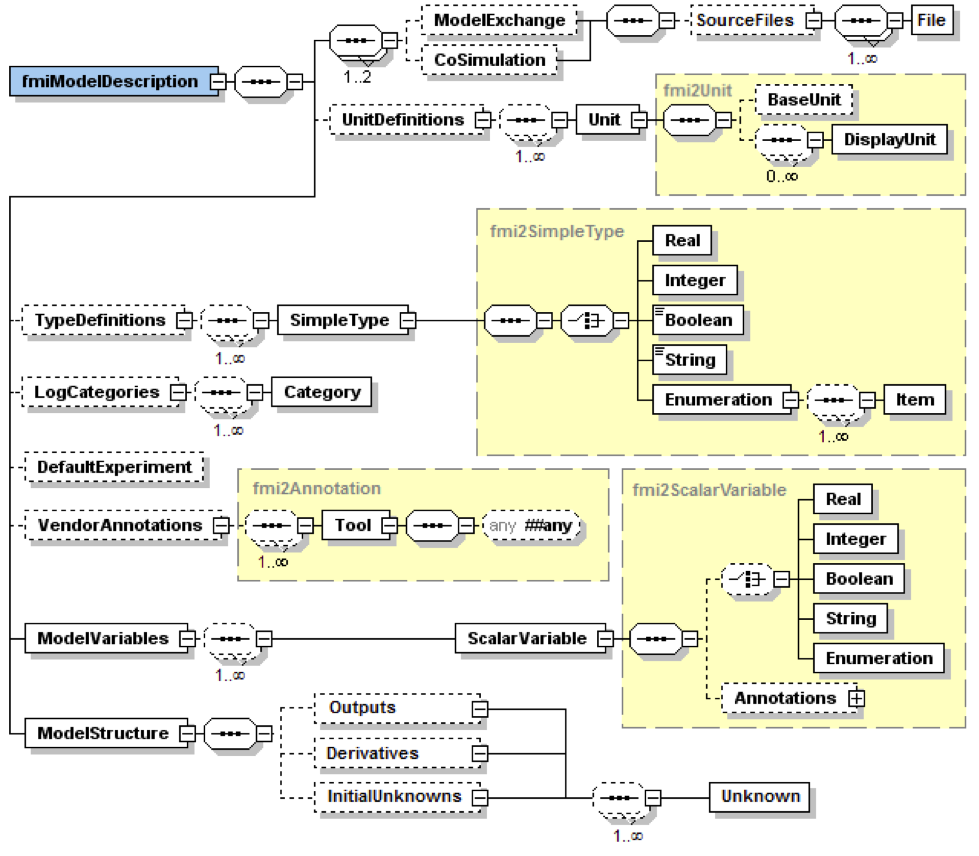

On the top level,
the schema consists of the following elements (see xref:system_overview[figure above]
footnote:[Note, elements `<ModelVariables>` and `<ModelStructure>` are mandatory,
whereas `<UnitDefinitions>`, `<TypeDefinitions>`, `<LogCategories>`, `<DefaultExperiment>`,
`<VendorAnnotation>` are optional.
If an optional element is present and defines a list (such as `<UnitDefinitions>`),
the list must have at least one element (such as `<Unit>`).]):

[cols="1,3",options="header"]
|====
|Element-Name
|Description

|`ModelExchange`
|If present,
the FMU is based on "FMI for Model Exchange" _[(in other words, the FMU includes the model or the communication to a tool that provides the model,
and the environment provides the simulation engine)]_.

|`CoSimulation`
|If present,
the FMU is based on "FMI for Co-Simulation" _[(in other words, the FMU includes the model [underline]#and# the simulation engine,
or a communication to a tool that provides the model and the simulation engine,
and the environment provides the master algorithm to run coupled FMU co-simulation slaves together)]_.

|`UnitDefinitions`
|A global list of unit and display unit definitions _[for example, to convert display units into the units used in the model equations]_.
These definitions are used in the XML element `"ModelVariables`".

|`TypeDefinitions`
|A global list of type definitions that are utilized in `"ModelVariables`".

|`LogCategories`
|A global list of log categories that can be set to define the log information that is supported from the FMU.

|`DefaultExperiment`
|Providing default settings for the integrator,
such as stop time and relative tolerance.

|`VendorAnnotations`
|Additional data that a vendor might want to store and that other vendors might ignore.

|`ModelVariables`
|The central FMU data structure defining all variables of the FMU that are visible/accessible via the FMU functions.

|`ModelStructure`
|Defines the structure of the model.
Especially, the ordered lists of all outputs,
all continuous-time states and all initial unknowns (the unknowns during Initialization Mode) must be defined here.
For more details on ModelStructure, see section <<Definition of the Model Structure (ModelStructure)>>.
Furthermore, the dependency of the unkowns from the knowns can be optionally defined.
_[This information can be,
for example, used to compute efficiently a sparse Jacobian for simulation, or to utilize the input/output dependency in order to detect that in some cases there are actually no algebraic loops when connecting FMUs together]_.
|====

At least one element of `ModelExchange` or `CoSimulation` must be present to identify the type of the FMU.
If both elements are defined, different types of models are included in the FMU.
The details of these elements are defined in section 3.3.1 and section 4.3.1.

The XML attributes of `fmiModelDescription` are:

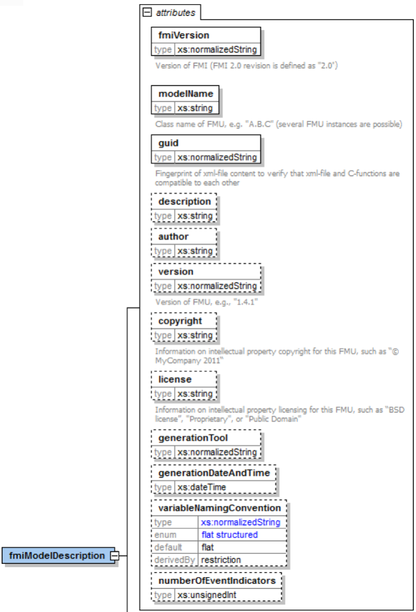

[cols="1,3",options="header"]
|====
|Attribute-Name
|Description

|`fmiVersion`
|Version of "FMI for Model Exchange or Co-Simulation" that was used to generate the XML file.
The value for this version is "2.0". +
_[Clarification for FMI 2.0.1: The version string for FMUs generated according to FMI 2.0.1 shall be “2.0” to be compatible with FMI 2.0 importers.]_

|`modelName`
|The name of the model as used in the modeling environment that generated the XML file,
such as "Modelica.Mechanics.Rotational.Examples.CoupledClutches".

|`guid`
|The "Globally Unique IDentifier" is a string that is used to check that the XML file is compatible with the C functions of the FMU.
Typically when generating the XML file,
a fingerprint of the "relevant" information is stored as guid and in the generated C function.

|`description`
|Optional string with a brief description of the model.

|`author`
|Optional string with the name and organization of the model author.

|`version`
|Optional version of the model, for example, "1.0".

|`copyright`
|Optional information on the intellectual property copyright for this FMU. +
_[Example: copyright = "© My Company 2011"]_.

|`license`
|Optional information on the intellectual property licensing
for this FMU. +
_[Example: license = "BSD license <license text or link to license>"]_.

|`generationTool`
|Optional name of the tool that generated the XML file.

|`generationDateAndTime`
|Optional date and time when the XML file was generated.
The format is a subset of "xs:dateTime" and should be: "YYYY-MM-DDThh:mm:ssZ" (with one "T" between date and time; "Z" characterizes the Zulu time zone,
in other words, Greenwich meantime). +
_[Example: "2009-12-08T14:33:22Z"]_.

|`variableNamingConvention`
|Defines whether the variable names in `ModelVariables / ScalarVariable / name` and in `TypeDefinitions / Type / name` follow a particular convention.
For the details, see section 2.2.9. Currently standardized are:

- `flat`: A list of strings (the default).

- `structured`: Hierarchical names with "." as hierarchy separator,
and with array elements and derivative characterization.

|`numberOfEventIndicators`
|The (fixed) number of event indicators for an FMU based on FMI for Model Exchange. +
For Co-Simulation, this value is ignored.
|====

_[The attribute `numberOfContinuousStates` available in FMI 1.0 has been removed for FMI 2.0,
since this information can be deduced from the remaining data in the XML file.]_

==== Definition of Units (UnitDefinitions)

_[In this section, the units of the variables are (optionally) defined.
Unit support is important for technical systems since otherwise it is very easy for errors to occur.
Unit handling is a difficult topic, and there seems to be no method available that is really satisfactory for all applications, such as unit check,
unit conversion, unit propagation or dimensional analysis.
In FMI, a pragmatic approach is used that takes into account that every software system supporting units has potentially its own specific technique to describe and utilize units.
The approach used here is slightly different than FMI 1.0 to reduce the need for standardized string representations.]_

Element "*UnitDefinitions*" of `fmiModelDescription` is defined as:

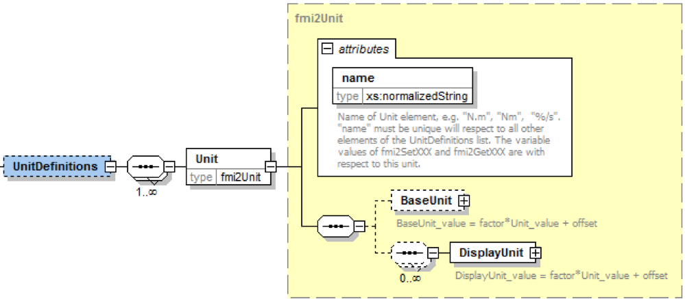

It consists of zero or more `Unit` definitions footnote:[If no units are defined,
element `<UnitDefinitions>` must not be present.
If 1 or more units are defined, this element must be present.].
A `Unit` is defined by its `name` attribute such as "N.m" or "N*m" or "Nm",
which must be unique with respect to all other defined elements of the `UnitDefinitions` list.
If a variable is associated with a `Unit`,
then the value of the variable has to be provided with the `fmi2SetXXX` functions and is returned by the `fmi2GetXXX` functions with respect to this `Unit`.
_[The purpose of the name is to uniquely identify a unit and,
for example, use it to display the unit in menus or in plots.
Since there is no standard to represent units in strings,
and there are different ways how this is performed in different tools,
no specific string representation of the unit is required.]_

Optionally, a value given in unit `Unit` can be converted to a value with respect to unit `BaseUnit` utilizing the conversion `factor` and `offset` attributes:

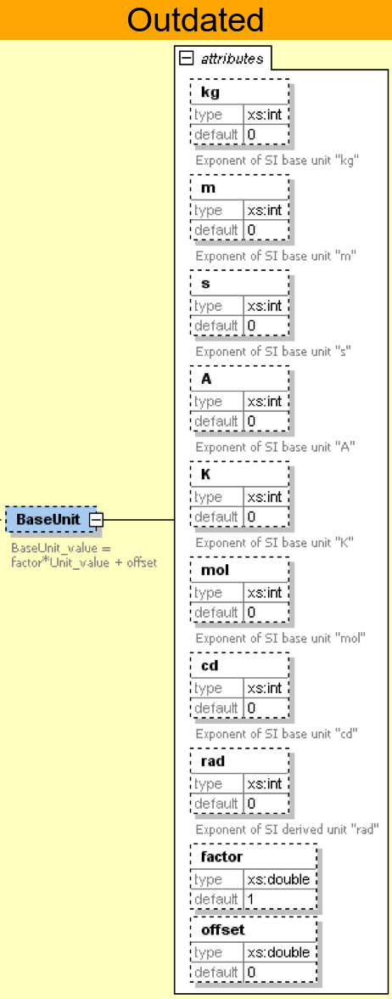

Besides `factor` and `offset`,
the `BaseUnit` definition consists of the exponents of the 7 SI base units "kg",
"m", "s", "A", "K", "mol", "cd", and of the exponent of the SI derived unit "rad".
_[Depending on the analysis/operation carried out,
the SI derived unit "rad" is or is not utilized, see discussion below.
The additional "rad" base unit helps to handle the often occurring quantities in technical systems that depend on an angle.]_

A value with respect to `Unit` (abbreviated as "Unit_value") is converted with respect to `BaseUnit` (abbreviated as "BaseUnit_value") by the equation:

BaseUnit_value = `factor`* Unit_value +  (if `relativeQuantity` then 0 else `offset`) +
where `factor` and `offset` are attributes of the `<BaseUnit>`, and  `relativeQuantity` an attribute of the `TypeDefinition` of a variable.

_[For example, if_ latexmath:[\color{blue}{p_{bar}}] _is a pressure value in unit "bar", and_ latexmath:[\color{blue}{p_{Pa}}] _is the pressure value in `BaseUnit`, then_

latexmath:[\color{blue}{p_{Pa} = 10^5 p_{bar}}]

_and therefore, `factor = 1.0e5` and `offset = 0.0`._

_[In the following table several unit examples are given
(Note that if in column `"exponents"` the definition "latexmath:[\color{blue}{kgm^2 / s^2}]"
is present, then the attributes of `BaseUnit` are: `"kg=1, m=2, s=-2`"):_

[cols="1,1,1,1,1"]
|====
.2+^|*Quantity*
.2+^|*Unit.name* +
(examples)
3+^|*Unit.BaseUnit*
^|*exponents*
^|*factor*
^|*offset*

^|_Torque_
^|`"N.m"`
^|latexmath:[\color{blue}{kg \cdot m^2 / s^2}]
^|`1.0`
^|`0.0`

^|_Energy_
^|`"J"`
^|latexmath:[\color{blue}{kg \cdot m^2 / s^2}]
^|`1.0`
^|`0.0`

^|_Pressure_
^|`"bar"`
^|latexmath:[\color{blue}{\frac{kg}{m \cdot s^2}}]
^|`1.0e5`
^|`0.0`

^|_Angle_
^|`"deg"`
^|`rad`
^|`0.01745329251994330 (= pi/180)`
^|`0.0`

^|_Angular velocity_
^|`"rad/s"`
^|`rad/s`
^|`1.0`
^|`0.0`

^|_Angular velocity_
^|`"rpm"`
^|`rad/s`
^|`0.1047197551196598 (=2*pi/60)`
^|`0.0`

^|_Frequency_
^|`"Hz"`
^|`rad/s`
^|`6.283185307179586` +
`(= 2*pi)`
^|`0.0`

^|_Temperature_
^|`"°F"`
^|`K`
^|`0.5555555555555556` +
`(= 5/9)`
|`255.3722222222222` +
`(= 273.15-32*5/9)`

^|_Per cent by length_
^|`"%/m"`
^|`1/m`
^|`0.01`
^|`0.0`

^|_Parts per million_
^|`"ppm"`
^|`1`
^|`1.0e-6`
^|`0.0`

^|_Length_
^|`"km"`
^|`m`
^|`1000`
^|`0.0`

^|_Length_
^|`"yd"`
^|`m`
^|`0.9144`
^|`0.0`
|====

_Note that "Hz" is typically used as `Unit.name` for a frequency quantity,
but it can also be used as `DisplayUnit` for an angular velocity quantity (since `"revolution/s`").]_

_The `BaseUnit` definitions can be utilized for different purposes (the following application examples are optional and a tool may also completely ignore the `Unit` definitions):_

*Signal connection check*:

_When two signals v1 and v2 are connected together,
and on at least one of the signals no `BaseUnit` element is defined,
then the connection equation "v2 = v1" holds (if v1 is an output of an FMU and v2 is an input of another FMU,
with `fmi2GetXXX` the value of v1 is inquired and used as value for v2 by calling `fmi2SetXXX`)._

_When two signals v1 and v2 are connected together,
and for both of them `BaseUnit` elements are defined,
then they must have identical exponents of their `BaseUnit`.
If `factor` and `offset` are also identical,
again the connection equation "v2 = v1" holds.
If `factor` and `offset` are not identical,
the tool may either trigger an error or, if supported, perform a conversion;
in other words, use the connection equation (in this case the `relativeQuantity` of the `TypeDefinition`,
see below,
has to be taken into account in order to determine whether `offset` shall or shall not be utilized):_

`factor(v1) * v1 + (if relativeQuantity(v1) then 0 else offset(v1)) = factor(v2) * v2 + (if relativeQuantity(v2) then 0 else offset(v2))` +
where `relativeQuantity(v1) == relativeQuantity(v2)` is required.

_As a result,
wrong connections can be detected (for example, connecting a force with an angle signal would trigger an error) and conversions between, say,
US and SI units can be either automatically performed or, if not supported,
an error is triggered as well.

_[Note that this approach is not satisfactory for variables belonging to different quantities that have,
however, the same `BaseUnit`, such as quantities "Energy" and "Torque",
or "AngularVelocity" and "Frequency".
To handle such cases, quantity definitions have to be taken into account (see `TypeDefinitions`) and quantity names need to be standardized.]_

_This approach allows a general treatment of units,
without being forced to standardize the grammar and allowed values for units (for example, in FMI 1.0,
a unit could be defined as "N.m" in one FMU and as "N*m" in another FMU, and a tool would have to reject a connection,
since the units are not identical. In FMI 2.0, the connection would be accepted,
provided both elements have the same `BaseUnit` definition)._

*Dimensional analysis of equations:*

_In order to check the validity of equations in a modeling language,
the defined units can be used for dimensional analysis,
by using the `BaseUnit` definition of the respective unit.
For this purpose, the `BaseUnit` "rad" has to be treated as "1".
Example:_

----
J*α = τ → [kg.m2]*[rad/s2] = [kg.m2/s2]). // o.k. ("rad" is treated as "1")
J*α = f → [kg.m2]*[rad/s2] = [kg.m/s2]). // error, since dimensions do not agree
----

*Unit propagation:*

_If unit definitions are missing for signals,
they might be deduced from the equations where the signals are used.
If no unit computation is needed, "rad" is propagated.
If a unit computation is needed and one of the involved units has "rad" as a `BaseUnit`,
then unit propagation is not possible.
Examples:_

- _a = b + c, and `Unit` of c is provided, but not `Unit` of a and b:_ +
_The Unit definition of c (in other words, `Unit.name`, `BaseUnit`,
`DisplayUnit`) is also used for a and b.
For example, if BaseUnit(c) = "rad/s", then BaseUnit(a) = BaseUnit(b) = "rad/s"._

- _a = b*c, and `Unit` of a and of c is provided, but not `Unit` of b:_ +
_If "rad" is either part of the `BaseUnit` of "a" and/or of "c",
then the `BaseUnit` of b cannot be deduced (otherwise it can be deduced).
Example: If BaseUnit(a)="kg.m/s2" and BaseUnit(c)="m/s2",
then the BaseUnit(b) can be deduced to be "kg".
In such a case `Unit.name` of b cannot be deduced from the `Unit.name` of a and c,
and a tool would typically construct the `Unit.name` of b from the deduced `BaseUnit`.]_

Additionally to the unit definition,
optionally a set of display units can be defined that can be utilized for input/output of a value:

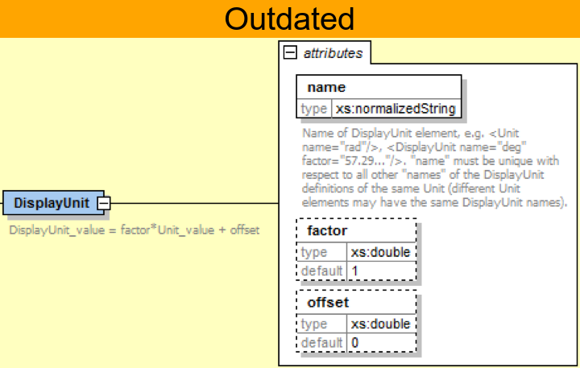

A `DisplayUnit` is defined by `name`, `factor` and `offset`.
The attribute `name` must be unique with respect to all other `names` of the `DisplayUnit` definitions of the same `Unit` [(different `Unit` elements may have the same `DisplayUnit` names)].
A value with respect to Unit (abbreviated as "Unit_value") is converted with respect to `DisplayUnit` (abbreviated as "DisplayUnit_value") by the equation:

DisplayUnit_value = `factor` * Unit_value + `offset`

_["offset" is, for example, needed for temperature units.]_

_[For example, if latexmath:[\color{blue}{T_K}] is the temperature value of `Unit.name` (in "K") and latexmath:[\color{blue}{T_F}] is the temperature value of `DisplayUnit` (in "°F"),
then_

[latexmath]
++++
T_F = (9/5) * (T_K - 273.15) + 32
++++

_and therefore, `factor = 1.8 (=9/5)` and `offset = -459.67 (= 32 - 273.15*9/5)`._

_Both the `DisplayUnit.name` definitions as well as the `Unit.name` definitions are used in the `ScalarVariable` elements.
Example for a definition:_

[source, xml]
----
<Unit name="rad/s">
    <BaseUnit s="-1" rad="1"/>
    <DisplayUnit name="deg/s" factor= "57.29577951308232"/>
    <DisplayUnit name="rev/min" factor= "9.549296585513721"/>
</Unit>
 <Unit name="bar">
    <BaseUnit kg="1", m="-1", s="-2", factor="1.0e5", offset="0"/>
</Unit>
 <Unit name="Re">
    <BaseUnit/>    // unit = "1"
                   //(dimensionless, all exponents of BaseUnit are zero)
 </Unit>
 <Unit name="Euro/PersonYear"/>  // no mapping to BaseUnit defined
----
_]_

The schema definition is present in a separate file `"fmi2Unit.xsd`".

==== Definition of Types (TypeDefinitions)

Element *"TypeDefinitions"* of `fmiModelDescription` is defined as:

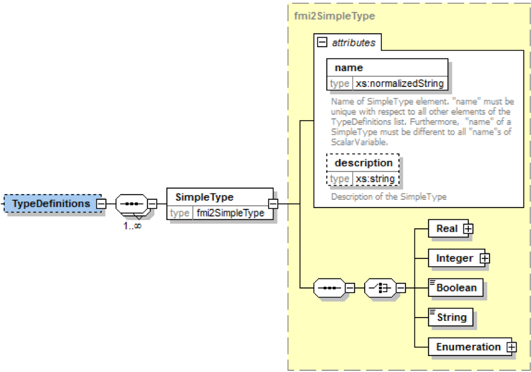

This element consists of a set of `"SimpleType"` definitions according to schema `"fmi2SimpleType"` in file `"fmi2Type.xsd"`.
One `"SimpleType"` has a type `"name"` and `"description"` as attributes.
Attribute "name" must be unique with respect to all other elements of the `TypeDefinitions` list.
Furthermore,
`"name"` of a `"SimpleType"` must be different to all `"name"` attributes of `ScalarVariable`pass:[s] _[if the same names would be used,
then this would nearly always give problems when importing the FMU in an environment such as Modelica,
where a type name cannot be used as instance name]_.
Additionally, one of the elements `Real`, `Integer`, `Boolean`, `String`,
or `Enumeration` must be present.
They have the following definitions:

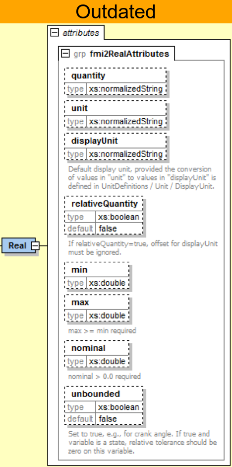

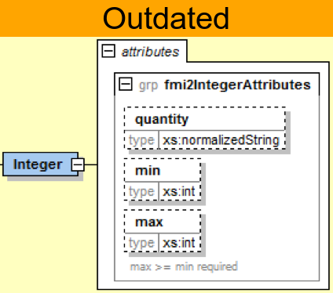

_[The attributes of "Real" and "Integer" are collected in the attribute groups "fmi2RealAttributes" and "fmi2IntegerAttributes" in file "fmi2AttributeGroups.xsd",
since these attributes are reused in the `ScalarVariable` element definitions below.]_

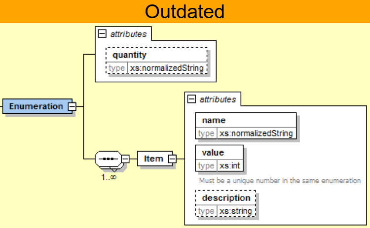

These definitions are used as default values in element `ScalarVariable`pass:[s]
_[in order that, say,
the definition of a "Torque" type does not have to be repeated over and over again]_.
The attributes and elements have the following meaning:

[cols="1,5",options="header"]
|====
|_Name_
|_Description_

|quantity
|Physical quantity of the variable. _[For example, "Angle", or "Energy".
The quantity names are not standardized]_

|unit
|Unit of the variable defined with `UnitDefinitions.Unit.name` that is used for the model equations.
_[For example, "N.m": in this case a `Unit.name = "N.m"` must be present under `UnitDefinitions`.
Note that for variables that are without a unit, the element should not have a `unit` attribute.
Giving an empty string as a `unit` attribute specifies a valid unit that needs to be defined among the unit definitions.]_

|displayUnit
|Default display unit. The conversion to the `"unit"` is defined with the
element `"<fmiModelDescription><UnitDefinitions>`".
If the corresponding
`"displayUnit"` is not defined under `<UnitDefinitions> <Unit> <DisplayUnit>`,
then `displayUnit` is ignored.
It is an error if `displayUnit` is defined in element `Real`,
but `unit` is not, or unit is not defined under `<UnitDefinitions><Unit>`.

|relativeQuantity
|If this attribute is `true`,
then the `"offset"` of `"BaseUnit"` and `"displayUnit"` must be ignored.
_[For example, 10 degree Celsius = 10 Kelvin if `"relativeQuantity = true"` and not 283.15 Kelvin.]_

|min
|Minimum value of variable (variable value ≥ `min`).
If not defined, the minimum is the largest negative number that can be represented on the machine.
The `min` definition is information from the FMU to the environment defining the region in which the FMU is designed to operate,
see also comment after this table.

|max
|Maximum value of variable (variable value ≤ `max`).
If not defined, the maximum is the largest positive number that can be represented on the machine.
The `max` definition is information from the FMU to the environment defining the region in which the FMU is designed to operate,
see also comment after this table.

|nominal
|Nominal value of variable.
If not defined and no other information about the nominal value is available,
then nominal = 1 is assumed. +
_[The nominal value of a variable can be,
for example, used to determine the absolute tolerance for this variable as needed by numerical algorithms:_ +
absoluteTolerance = `nominal` * `tolerance` * 0.01 +
_where `tolerance` is, for example, the relative tolerance defined in `<DefaultExperiment>`,
see section 2.2.5.]_

|unbounded
|If true,
indicates that during time integration, the variable gets a value much larger than its nominal value `nominal`.
_[Typical examples are the monotonically increasing rotation angles of crank shafts and the longitudinal position of a vehicle along the track in long distance simulations.
This information can, for example,
be used to increase numerical stability and accuracy by setting the corresponding bound for the relative error to zero (relative tolerance = 0.0),
if the corresponding variable or an alias of it is a continuous state variable.]_

|Item
|Item of an enumeration has a sequence of `"name"` and `"value"` pairs.
The values can be any integer number
but must be unique within the same enumeration (in order that the mapping between `"name"` and `"value"` is bijective).
An `Enumeration` element must have at least one Item.
|====

_[Attributes `min` and `max` can be set for variables of type Real, Integer or Enumeration.
The question is how `fmi2SetReal`, `fmi2SetInteger`, `fmi2GetReal`,
`fmi2GetInteger` shall utilize this definition.
There are several conflicting requirements:_ +
_Avoiding forbidden regions
(for example, if "u" is an input and "sqrt(u)" is computed in the FMU,
min=0 on "u" shall guarantee that only values of "u" in the allowed regions are provided)._
_Numerical algorithms
(ODE-solver, optimizers. nonlinear solvers) do not guarantee constraints.
If a variable is outside of the bounds, the solver tries to bring it back into the bounds.
As a consequence,
calling fmi2GetReal during an iteration of such a solver might return values that are not in the defined min/max region.
After the iteration is finalized,
it is only guaranteed that a value is within its bounds up to a certain numerical precision._ +
_In debug mode checks on min/max should be performed.
For maximum performance on a real-time system the checks might not be performed._ +
_The approach in FMI is therefore that min/max definitions are an information from the FMU to the environment defining the region in which the FMU is designed to operate.
The environment is free to utilize this information
(typically, in debug mode of the environment the min/max is checked in the cases as stated above).
In any case,
it is expected that the FMU handles variables appropriately where the region definition is critical.
For example,
dividing by an input (so the input should not be in a small range of zero) or taking the square root of an input (so the input should not be negative) may either result in fmi2Error,
or the FMU is able to handle this situation in other ways._

_If the FMU is generated so that min/max shall be checked whenever meaningful
(for example, for debug purposes), then the following strategy should be used:_

_If `fmi2SetReal` or `fmi2SetInteger` is called violating the min/max attribute settings of the corresponding variable,
the following actions are performed:_

- _On a fixed or tunable parameter `fmi2Status = fmi2Discard` is returned._
- _On an input, the FMU decides what to return (If no computation is possible,
it could return `fmi2Status =  fmi2Discard`,
in other situations it may return `fmi2Warning` or `fmi2Error`,
or `fmi2OK`, if it is uncritical)._

_If an FMU defines min/max values for Integer and Enumerations (local and output variables),
then the expected behavior of the FMU is that `fmi2GetInteger` returns values in the defined range._

_If an FMU defines min/max values for Reals,
then the expected behavior of the FMU is that `fmi2GetReal` returns values at the solution (accepted steps of the integrators) in the defined range with a certain uncertainty related to the tolerances of the numerical algorithms.]_

==== Definition of Log Categories (LogCategories)

Element `"LogCategories"` of `"fmiModelDescription` is defined as:

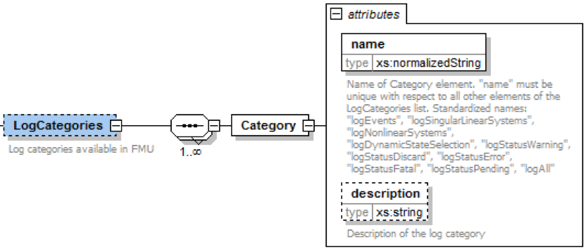

`LogCategories` defines an unordered set of category strings that can be utilized to define the log output via function `"logger"`, see section 2.1.5.
A tool is free to use any `normalizedString` for a category value.
The `"name"` attribute of `"Category"` must be unique with respect to all other elements of the `LogCategories` list.

There are the following standardized names for `"Category"` and these names should be used if a tool supports the corresponding log category.
If a tool supports one of these log categories and wants to expose it,
then an element Category with this name should be added to `LogCategories` _[To be clear, only the Category names listed under `LogCategories` in the XML file are known to the environment in which the FMU is called.]_

[cols="1,3",options="header"]
|====
|_Category name_
|_Description_

|`logEvents`
|Log all events (during initialization and simulation).

|`logSingularLinearSystems`
|Log the solution of linear systems of equations if the solution is singular (and the tool picked one solution of the infinitely many solutions).

|`logNonlinearSystems`
|Log the solution of nonlinear systems of equations.

|`logDynamicStateSelection`
|Log the dynamic selection of states.

|`logStatusWarning`
|Log messages when returning fmi2Warning status from any function.

|`logStatusDiscard`
|Log messages when returning fmi2Discard status from any function.

|`logStatusError`
|Log messages when returning fmi2Error status from any function.

|`logStatusFatal`
|Log messages when returning fmi2Fatal status from any function.

|`logStatusPending`
|Log messages when returning fmi2Pending status from any function.

|logAll
|Log all messages.
|====

The optional attribute `description` shall contain a description of the respective log category.
_[Typically, this string can be shown by a tool if more details for a log category shall be presented.]_

_[This approach to define `LogCategories` has the following advantages:_

. _A simulation environment can present the possible log categories in a menu and the user can select the desired one (in the FMI 1.0 approach,
there was no easy way for a user to figure out from a given FMU what log categories could be provided)._

_[Note that since element `<LogCategories>` is optional,
an FMU does not need to expose its log categories.]_

. _The log output is drastically reduced,
because via `fmi2SetDebugLogging` exactly the categories are set that shall be logged and therefore the FMU only has to print the messages with the corresponding categories to the `"logger"` function.
In FMI 1.0, it was necessary to provide all log output of the FMU to the `"logger"` and then a filter in the `"logger"` could select what to show to the end-user.
The approach introduced in FMI 2.0 is therefore much more efficient.]_

==== Definition of a Default Experiment (DefaultExperiment)

Element `"DefaultExperiment"` of `fmiModelDescription` is defined as:

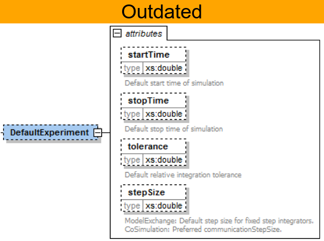

`DefaultExperiment` consists of the optional default start time,
stop time, relative tolerance, and step size for the first simulation run.
A tool may ignore this information.
However, it is convenient for a user that `startTime`, `stopTime`,
`tolerance` and `stepSize` have already a meaningful default value for the model at hand.
Furthermore, for CoSimulation the `stepSize` defines the preferred `communicationStepSize`.

==== Definition of Vendor Annotations (VendorAnnotations)

Element `"VendorAnnotations"` of `fmiModelDescription` is defined as:

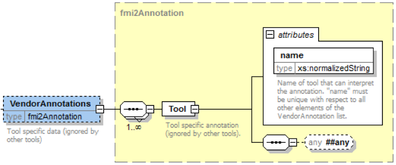

`VendorAnnotations` consist of an ordered set of annotations that are identified by the name of the tool that can interpret the `"any"` element.
The `"any"` element can be an arbitrary XML data structure defined by the tool.
Attribute `"name"` must be unique with respect to all other elements of the `VendorAnnotation` list.

==== Definition of Model Variables (ModelVariables)

The `"ModelVariables"` element of `fmiModelDescription` is the central part of the model description.
It provides the static information of all exposed variables and is defined as:

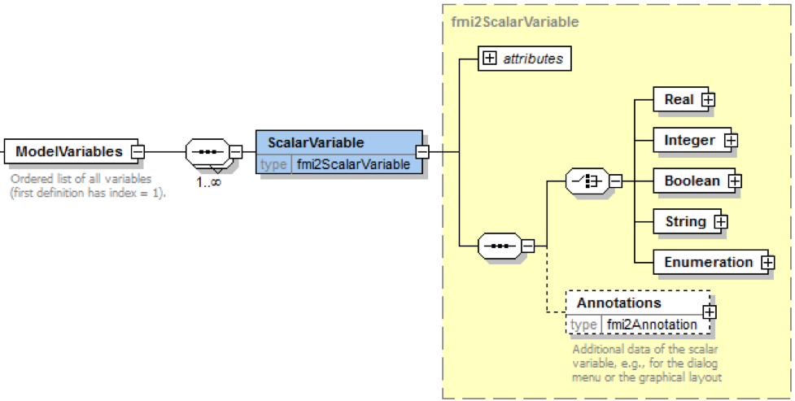

The `"ModelVariables"` element consists of an ordered set of `ScalarVariable` elements (see figure above).
The first element has `index = 1`,
the second `index=2`, etc.
This `ScalarVariable` `index` is used in element `ModelStructure` to uniquely and efficiently refer to `ScalarVariable` definitions.
A `ScalarVariable` represents a variable of primitive type, like a real or integer variable.
For simplicity,
only scalar variables are supported in the schema file in this version and structured entities (like arrays or records) have to be mapped to scalars.
The schema definition is present in a separate file `fmi2ScalarVariable.xsd`.
The attributes of `ScalarVariable` are:

image::images/ScalarVariable_schema.png[width=90%, align="center"]

[cols="1,5",options="header"]
|====
|_Attribute-Name_
|_Description_

|`name`
|The full, [underline]#unique name# of the variable.
Every variable is uniquely identified within an FMU instance by this name or by its `ScalarVariable index` (the element position in the `ModelVariables` list; the first list element has `index=1`).

|`valueReference`
|A handle of the variable to efficiently identify the variable value in the model interface.
This handle is a secret of the tool that generated the C functions.
It is not required to be unique.
The only guarantee is that valueReference is sufficient to identify the respective variable value in the call of the C functions.
This implies that it is unique for a particular base data type
(`Real`, `Integer/Enumeration`, `Boolean`, `String`)
with exception of variables that have identical values (such variables are also called "alias" variables).
This attribute is "required".

|`description`
|An optional description string describing the meaning of the variable.

|`causality`
| Enumeration that defines the causality of the variable.
Allowed values of this enumeration:

- `"parameter"`: Independent parameter (a data value that is constant during the simulation and is provided by the environment and cannot be used in connections).
`variability` must be `"fixed"` or `"tunable"`.
`initial` must be `exact` or not present (meaning `exact`).

- `"calculatedParameter"`: A data value that is constant during the simulation and is computed during initialization or when tunable parameters change.
`variability` must be `"fixed"` or `"tunable"`.
initial must be `"approx"`, `"calculated"` or not present (meaning `calculated`).

- `"input"`: The variable value can be provided from another model or slave.
It is not allowed to define `initial`.

- `"output"`: The variable value can be used by another model or slave.
The algebraic relationship to the inputs is defined via the `dependencies` attribute of `<fmiModelDescription><ModelStructure><Outputs><Unknown>`.

- `"local"`: Local variable that is calculated from other variables or is a continuous-time state (see section 2.2.8).
It is not allowed to use the variable value in another model or slave.

- `"independent"`: The independent variable (usually `"time"`).
All variables are a function of this independent variable.
`variability` must be `"continuous"`.
At most one `ScalarVariable` of an FMU can be defined as `"independent"`.
If no variable is defined as `"independent"`,
it is implicitly present with name = `"time"` and `unit = "s"`.
If one variable is defined as `"independent"`,
it must be defined as `"Real"` without a `"start"` attribute.
It is not allowed to call function `fmi2SetReal` on an `"independent"` variable.
Instead, its value is initialized with `fmi2SetupExperiment` and after initialization set by `fmi2SetTime` for ModelExchange and by arguments `currentCommunicationPoint` and `communicationStepSize` of `fmi2DoStep` for CoSimulation.
_[The actual value can be inquired with `fmi2GetReal`.]_

The default of causality is `"local"`. +
A continuous-time state must have `causality = "local"` or `"output"`, see also section 2.2.8.

_[`causality = "calculatedParameter"` and `causality = "local"` with `variability = "fixed"` or `"tunable"` are similar.
The difference is that a `calculatedParameter` can be used in another model or slave,
whereas a local variable cannot.
For example, when importing an FMU in a Modelica environment,
a `"calculatedParameter"` should be imported in a `public` section as `final parameter`,
whereas a `"local"` variable should be imported in a `protected` section of the model.]_

|`variability`
|Enumeration that defines the time dependency of the variable,
in other words, it defines the time instants when a variable can change its value.
_[The purpose of this attribute is to define when a result value needs to be inquired and to be stored.
For example, discrete variables change their values only at event instants (ModelExchange) or at a communication point (CoSimulation) and it is therefore only necessary to inquire them with `fmi2GetXXX` and store them at event times.]_
Allowed values of this enumeration:

- `"constant"`: The value of the variable never changes.

- `"fixed"`: The value of the variable is fixed after initialization,
in other words, after `fmi2ExitInitializationMode` was called the variable value does not change anymore.

- `"tunable"`: The value of the variable is constant between `external events` (ModelExchange) and between _Communication Points_ (Co-Simulation) due to changing variables with `causality = "parameter"` or `"input"` and `variability = "tunable"`.
Whenever a parameter or input signal with `variability = "tunable"` changes,
an event is triggered externally (ModelExchange), or the change is performed at the next _Communication Point_ (Co-Simulation) and the variables with `variability = "tunable"` and `causality = "calculatedParameter"` or `"output"` must be newly computed.

- `"discrete"`: +
ModelExchange: The value of the variable is constant between _external_ and _internal events_ (= time,
state, step events defined implicitly in the FMU). +
Co-Simulation: By convention, the variable is from a "real" sampled data system and its value is only changed at Communication Points (also inside the slave).

- `"continuous"`: Only a variable of `type = "Real"` can be `"continuous"`. +
ModelExchange: No restrictions on value changes. +
Co-Simulation: By convention, the variable is from a differential

The default is `"continuous"`.

_[Note that the information about continuous states is defined with element
`fmiModelDescription.ModelStructure.Derivatives`.]_

|`initial`
|Enumeration that defines how the variable is initialized.
It is not allowed to provide a value for `initial` if `causality = "input"` or `"independent"`:

- = `"exact"`: The variable is initialized with the start value (provided under `Real`,
`Integer`, `Boolean`, `String` or `Enumeration`).

- = `"approx"`: The variable is an iteration variable of an algebraic loop and the iteration at initialization starts with the start value.

- = `"calculated"`: The variable is calculated from other variables during initialization.
It is not allowed to provide a `"start"` value.

If `"initial"` is not present,
it is defined by the table below based on `"causality"` and `"variability"`.
If `initial = "exact"` or `"approx"`, or `causality = "input"`, a start value must be provided.
If `initial = "calculated"`,
or `causality = "independent"`, it is not allowed to provide a start value.

_[The environment decides when to use the start value of a variable with `causality = "input"`.
Examples: (a) automatic tests of FMUs are performed,
and the FMU is tested by providing the start value as constant input.
(b) For a ModelExchange FMU, the FMU might be part of an algebraic loop.
If the input variable is iteration variable of this algebraic loop,
then initialization starts with its start value.]_

If `fmiSetXXX` is not called on a variable with `causality = "input"`, then the FMU must use the start value as value of this input.

2+|`canHandleMultipleSetPerTimeInstant`
|
|Only for ModelExchange (if only CoSimulation FMU, this attribute must not be present.
If both ModelExchange and CoSimulation FMU, this attribute is ignored for CoSimulation): +
Only for variables with `variability = "input"`: +
If present with `value = false`, then only one `fmi2SetXXX` call is allowed at one super dense time instant (model evaluation) on this variable.
That is, this input is not allowed to appear in a (real) algebraic loop requiring multiple calls of `fmi2SetXXX` on this variable
_[for example, due to a Newton iteration]_. +
_[This flag must be set by FMUs where (internal) discrete-time states are directly updated when assigned (xd := f(xd) instead of xd = f(previous(xd)),
and at least one output depends on this input and on discrete states._ +
_It is strongly recommended that such an FMU checks the fulfillment of the requirement by itself during run-time,
because an environment might not be able to check it;
usually, there is a generic mechanism to import an FMU in an environment,
but the mechanism to connect FMUs together is unrelated to the import mechanism.
For example,
there is no mechanism in the Modelica language to formulate connection restrictions for C functions (the FMU) called in a Modelica model.]_
|====

*fmi2SetXXX* can be called on any variable with `variability ≠ "constant"` *before initialization* (before calling `fmi2EnterInitializationMode`)

- if `initial = "exact"` or `"approx"` _[in order to set the corresponding `start` value.]_
_[Note that this prevents any changes to the input before `fmi2EnterInitializationMode` is called.]_

*fmi2SetXXX* can be called on any variable with `variability ≠ "constant"` *during initialization* (after calling `fmi2EnterInitializationMode` and before `fmi2ExitInitializationMode` is called)

- if `initial = "exact"` _[in order to set the corresponding `start` value]_, or

- if `causality = "input"` _[in order to provide new values for inputs]_,

*fmi2SetXXX* can be called on any variable *for ModelExchange* *at an event instant* (after calling `fmi2EnterEventMode` and before `fmi2EnterContinuousTimeMode` is called),
and *for Co-Simulation at every communication point*,

- if `causality = "parameter"` and `variability = "tunable"` _[in order to change the value of the tunable parameter at an event instant or at a communication point]_, or

- if causality = "input" _[in order to provide new values for inputs]_

*fmi2SetXXX* can be called on any variable for *ModelExchange in Continuous-Time Mode*

- if `causality = "input"` and `variability = "continuous"` +
_[in order to provide new values for inputs during continuous integration]_

If `initial` is not present, its value is defined by the following tables
based on the values of `causality` and `variability`:

[cols="1,1,1,1,1,1,1,1,1"]
|====
3.2+|
6+^|*causality*
^|*parameter*
^|*calculated* *parameter*
^|*input*
^|*output*
^|*local*
^|*independent*

.5+^|*variability*
.3+^|data
^|*constant*
^|[red]#--#
^|[red]#--#
^|[red]#--#
^|[green]#(A)#
^|[green]#(A)#
^|[red]#--#

^|*fixed*
^|[green]#(A)#
^|[maroon]#(B)#
^|[red]#--#
^|[red]#--#
^|[maroon]#(B)#
^|[red]#--#

^|*tunable*
^|[green]#(A)#
^|[maroon]#(B)#
^|[red]#--#
^|[red]#--#
^|[maroon]#(B)#
^|[red]#--#

.2+^|signals
^|*discrete*
^|[red]#--#
^|[red]#--#
^|[aqua]#(D)#
^|\(C)
^|\(C)
^|[red]#--#

^|*continuous*
^|[red]#--#
^|[red]#--#
^|[aqua]#(D)#
^|\(C)
^|\(C)
^|[purple]#(E)#
|====

with

[cols="1,3,3", width=50%, align="center"]
|====
|
2+^|*initial*
|
^|*default*
^|*possible values*

|[green]#(A)#
|[green]#exact#
|[green]#exact#

|[maroon]#(B)#
|[maroon]#calculated#
|[maroon]#approx,# +
 [maroon]#calculated#

|\(C)
|calculated
|exact, +
approx, +
calculated

|[aqua]#(D)#
|[aqua]#---#
|[aqua]#---#

|[purple]#(E)#
|[purple]#---#
|[purple]#---#
|====

_[Note: (1) If `causality = "independent"`,
it is neither allowed to define a value for `initial` nor a value for start.
(2) If `causality = "input"`,
it is not allowed to define a value for `initial` and a value for start must be defined.
(3) If \(C) and `initial = "exact"`,
then the variable is explicitly defined by its start value in Initialization Mode (so directly after calling `fmi2ExitInitializationMode`,
the value of the variable is either the start value stored in element `<ScalarVariable><XXX start=YYY/>`
or the value provided by `fmiSetXXX`,
if this function was called on this variable).]_

The following combinations of variability/causality settings are allowed:

[cols="1,1,1,1,1,1,1,1,1"]
|====
3.2+|
6+^|*causality*
^|*parameter*
^|*calculated* *parameter*
^|*input*
^|*output*
^|*local*
^|*independent*

.5+^|*variability*
.3+^|data
^|*constant*
^|[red]#-- (a)#
^|[red]#-- (a)#
^|[red]#-- (a)#
^|[green]#(7)#
^|[green]#(10)#
^|[red]#-- (c)#

^|*fixed*
^|[green]#(1)#
^|[green]#(3)#
^|[red]#-- (d)#
^|[red]#-- (e)#
^|[green]#(11)#
^|[red]#-- (c)#

^|*tunable*
^|[green]#(2)#
^|[green]#(4)#
^|[red]#-- (d)#
^|[red]#-- (e)#
^|[green]#(12)#
^|[red]#-- (c)#

.2+^|signals
^|*discrete*
^|[red]#-- (b)#
^|[red]#-- (b)#
^|[green]#(5)#
^|[green]#(8)#
^|[green]#(13)#
^|[red]#--(c)#

^|*continuous*
^|[red]#-- (b)#
^|[red]#-- (b)#
^|[green]#(6)#
^|[green]#(9)#
^|[green]#(14)#
^|[green]#(15)#
|====

_Discussion of the combinations that are [underline]#not allowed#_:

[cols="1,10"]
|====
|
|_Explanation why this combination is not allowed_

^|_[red]#(a)#_
|_The combinations `"constant" / "parameter"`,
`"constant" / "calculatedParameter"` and `"constant" / "input"` do not make sense,
since parameters and inputs are set from the environment,
whereas a constant has always a value._

^|_[red]#(b)#_
|_The combinations `"discrete / parameter"`,
`"discrete / calculatedParameter"`,
`"continuous / parameter"` and `"continuous" / "calculatedParameter"` do not make sense,
since `causality = "parameter"` and `"calculatedParameter"` define variables that do not depend on time,
whereas `"discrete"` and `"continuous"` define variables where the values can change during simulation._

^|_[red]#(c)#_
|_For an `"independent"` variable only `variability = "continuous"` makes sense._

^|_[red]#(d)#_
|_A `"fixed"` or `"tunable"` input has exactly the same properties as a `"fixed"` or `"tunable"` parameter.
For simplicity, only `"fixed"` and `"tunable"` parameters shall be defined._

^|_[red]#(e)#_
|_A `"fixed"` or `"tunable"` output has exactly the same properties as a `"fixed"` or `"tunable"` `calculatedParameter`.
For simplicity, only `"fixed"` and `"tunable"` `calculatedParameters` shall be defined._
|====

_Discussion of the combinations that are_ [underline]#allowed#:

[cols="1,3,8", options="header"]
|====
|
|_Setting_
|_Example_

>|_[green]#(1)#_
|_fixed parameter_
|_Non-tunable independent parameter_

>|_[green]#(2)#_
|_tunable parameter_
|_Tunable independent parameter (changing such a parameter triggers an external event (ModelExchange) or takes effect at the next Communication Point (CoSimulation),
and tunable calculatedParameter/output/local variables might change their values)._

>|_[green]#(3)#_
|_fixed dependent parameter_
|_Non-tunable dependent parameter (variable that is computed directly or indirectly from constants or parameters)._

>|_[green]#(4)#_
|_tunable dependent parameter_
|_Tunable dependent parameter (changing an independent parameter triggers an external event (ModelExchange) or takes effect at the next Communication Point (CoSimulation),
and tunable dependent parameters and tunable local variables might change their values)._

>|_[green]#(5)#_
|_discrete input_
|_Discrete input variable from another model._

>|_[green]#(6)#_
|_continuous input_
|_Continuous input variable from another model._

>|_[green]#(7)#_
|_constant output_
|_Variable where the value never changes and that can be used in another model._

>|_[green]#(8)#_
|_discrete output_
|_Discrete variable that is computed in the FMU.
Can be used in another model._

>|_[green]#(9)#_
|_continuous output_
|_Continuous variable that is computed in the FMU and can be used in another model._

>|_[green]#(10)#_
|_constant local_
|_Variable where the value never changes.
Cannot be used in another model._

>|_[green]#(11)#_
|_fixed local_
|_Local variable that depends on fixed parameters only and is computed in the FMU.
Cannot be used in another model.
After initialization, the value of this local variable cannot change._

>|_[green]#(12)#_
|_tunable local_
|_Local variable that depends on tunable parameters only and is computed in the FMU.
Cannot be used in another model.
The value of this local variable can only change during initialization and at event instants,
provided a tunable parameter was changed._

>|_[green]#(13)#_
|_discrete local_
|_Discrete variable that is computed in the FMU and cannot be used in another model._

>|_[green]#(14)#_
|_continuous local_
|_Continuous variable that is computed in the FMU and cannot be used in another model._

>|_[green]#(15)#_
|_continuous independent_
|_All variables are a function of the continuous-time variable marked as `"independent"`.
Usually, this is `"time"`_
|====

_How to treat tunable variables:_

_A parameter p is a variable that does not change its value during simulation,
in other words, dp/dt = 0.
If the parameter "p" is changing,
then Dirac impulses are introduced since dp/dt of a discontinuous constant variable "p" is a Dirac impulse.
Even if this Dirac impulse would be modeled correctly by the modeling environment,
it would introduce unwanted "vibrations".
Furthermore,
in many cases the model equations are derived under the assumption of a constant value (like mass or capacity),
and the model equations would be different if "p" would be time varying._

_FMI for Model Exchange:_ +
_Therefore,
"tuning a parameter" during simulation does not mean to "change the parameter online" during simulation.
Instead, this is a short hand notation for:_

. _Stop the simulation at an event instant_
(usually, a step event, in other words, after a successful integration step).

. _Change the values of the tunable parameters._

. _Compute all parameters that depend on the tunable parameters._

. _Newly start the simulation using as initial values the current values of all previous variables and the new values of the parameters._

_Basically this means that a new simulation run is started from the previous FMU state with changed parameter values.
With this interpretation, changing parameters online is "clean",
as long as these changes appear at an event instant._

_FMI for Co-Simulation:_
_Changing of tunable parameters is allowed before an `fmi2DoStep` call (so, whenever an input can be set with `fmi2SetXXX`) and before `fmi2ExitInitializationMode` is called (that is before and during Initialization Mode).
The FMU internally carries out event handling if necessary.]_

Variables of the same base type (like `fmi2Real`) that have identical `valueReference` definitions are called "alias" variables.
The main purpose of "alias" variables is to enhance efficiency.
If two variables `a` and `b` are alias variables,
then this is only allowed if the behavior of the FMU would be exactly the same
if `a` and `b` were not treated as alias variables (that is,
had different `valueReference`pass:[s]).
This requirement leads naturally to the following restrictions:

. Variables `a` and `b` that can both be set with `fmi2SetXXX`,
or variable `a` that can be set with `fmiSetXXX` and variable `b` that is defined with `causality = "independent"`,
cannot be alias variables [since these variables are `"independent"` variables and alias means that there is a constraint equation between variables (= the values are the same),
these variables are no longer `"independent"`. +
For example, if variables `a` and `b` have `causality = "parameter"`,
then the value references of `a` and `b` must be different.
However, if variable a has `causality = "parameter"` and `b` has `causality = "calculatedParameter"` and `b := a`,
then `a` and `b` can have the same value reference.].

. At most one variable of the same alias set of variables with `variability ≠ "constant"` can have a start attribute.
[Since start variables are independent initial values.]

. A variable with `variability = "constant"` can only be aliased to another variable with `variability = "constant"`.
It is then required that the start values of all aliased (constant) variables are identical.

. All variables of the same alias set must all have either no `<Unit>` element defined, or all of them must have the same `<Unit name>` and the same `<Unit><BaseUnit>` definitions.

The aliasing of variables only means that the `"value"` of the variables is always identical.
However, aliased variables may have different attributes,
such as `min/max/nominal` values or description texts.
_[For example, if v1, v2 are two alias variables with `v1=v2` and `v1.max=10` and `v2.max=5`,
then the FMU will trigger an error if either `v1` or `v2` becomes larger than 5.]_

_[The dependency definition in `fmiModelDescription.ModelStructure` is completely unrelated to the alias definition.
In particular,
the "direct dependency" definition can be a superset of the "real" direct dependency definition,
even if the "alias" information shows that this is too conservative.
For example, if it is stated that the output `y1` depends on input `u1` and the output `y2` depends on input `u2`,
and `y1` is an alias to `y2`, then this definition is fine,
although it can be deduced that in reality neither `y1` nor `y2` depend on any input.]._

_[In case of different variability among the set of alias variables,
and if that set of aliases does not contain an input or parameter,
the variability should be the highest of the variables in the set, e.g. continuous > discrete > tunable >fixed.
If the set includes a parameter or input the aliases will have the stated variability of that parameter or input]._

Type specific properties are defined in the required choice element,
where exactly one of `"Real"`, `"Integer"`, `"Boolean"`, `"String"`,
`"Enumeration"` must be present in the XML file:

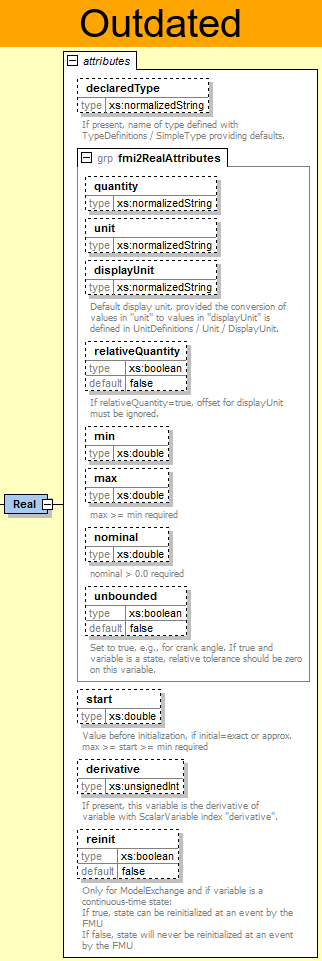

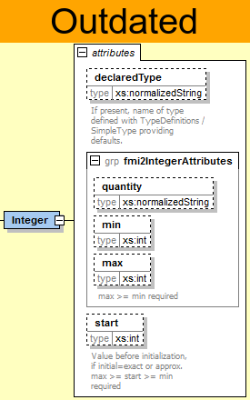

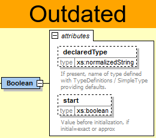

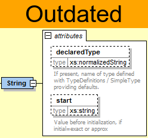

image::images/Enumeration_Schema_large.png[width=50%, align="center"]

The attributes are defined in section 2.2.3 ("`TypeDefinitions"`), except:

[cols="1,7", options="header"]
|====
|_Attribute-Name_
|_Description_

|`declaredType`
|If present, name of type defined with `TypeDefinitions / SimpleType`.
The value defined in the corresponding `TypeDefinition` (see section 2.2.3) is used as default.
_[For example, if `min` is present both in `Real` (of `TypeDefinition`) and in `"Real"` (of `ScalarVariable`),
then the `min` of `ScalarVariable` is actually used.]_
For `Real`, `Integer`, `Boolean`, `String`, this attribute is optional.
For `Enumeration` it is required,
because the Enumeration items are defined in `TypeDefinitions / SimpleType`.

|`start`
|Initial or guess value of variable.
*This value is also stored in the C functions*.

_[Therefore, calling `fmi2SetXXX` to set start values is only necessary, if a different value as stored
in the xml file is desired.
WARNING: It is not recommended to change the start values in the modelDescription.xml file of an FMU, as this would break the consistency with the hard-coded start values in the C-Code.
This could lead to unpredictable behaviour of the FMU in different importing tools, as it is not mandatory to call `fmi2SetXXX` to set start values during initialization. Instead it is recommended to use the SSP Standard (https://ssp-standard.org/) to handle modified parameters of FMUs or different parameter sets.]_

The interpretation of start is defined by `ScalarVariable / initial`.
A different start value can be provided with an `fmi2SetXXX` function before `fmi2ExitInitializationMode` is called (but not for variables with `variability = "constant"`).

_[The standard approach is to set the start value before `fmi2EnterInitializationMode`.
However, if the initialization shall be modified in the calling environment
(for example, changing from initialization of states to steady-state initialization),
it is also possible to use the start value as iteration variable of an algebraic loop: using an additional condition in the environment,
such as_ latexmath:[\color{blue}{\dot{x} = 0}] _, the actual start value is determined.]_

If `initial = "exact"` or `"approx"` or `causality = "input"`,
a `start` value must be provided.

If `initial = "calculated"` or `causality = "independent"`,
it is not allowed to provide a start value.

Variables with `causality = "parameter"` or `"input"`,
as well as variables with `variability = "constant"`, must have a `"start"` value.

- If `causality = "parameter"`, the start-value is the value of it.

- If `causality = "input"`, the start value is used by the model as value of the input,
if the input is not set by the environment.

- If `variability = "constant"`, the start value is the value of the constant.

- If `causality = "output"` or `"local"`, then the start value is either an `initial` or a `guess` value,
depending on the setting of attribute `initial`.

|`derivative`
|If present, this variable is the derivative of variable with `ScalarVariable` index "derivative".
_[For example,
if there are 10 `ScalarVariable`pass:[s] and `derivative = 3` for `ScalarVariable` 8,
then `ScalarVariable` 8 is the derivative of `ScalarVariable` 3 with respect to the independent variable (usually time).
This information might be especially used if an input or an output is the derivative of another input or output,
or to define the states.]_

The state derivatives of an FMU are listed under element `<ModelStructure><Derivatives>`.
All `ScalarVariable`pass:[s] listed in this element must have attribute `derivative` (in order that the continuous-time states are uniquely defined).

|`reinit`
|Only for ModelExchange (if only CoSimulation FMU,
this attribute must not be present.
If both ModelExchange and CoSimulation FMU,
this attribute is ignored for CoSimulation): +
Can only be present for a continuous-time state. +
If true, state can be reinitialized at an event by the FMU. +
If false, state will not be reinitialized at an event by the FMU.

|`min / max`
|The optional attributes `min` and `max` in element `Enumeration` restrict the allowed values of the enumeration.
The `min/max` definitions are information from the FMU to the environment defining the region in which the FMU is designed to operate,
see also comment in section 2.2.3.
_[If, for example, an `Enumeration` is defined with `name1 = -4`, `name2 = 1`, `name3 = 5`,
`name4 = 11` and min=-2, max = 5, then only `name2` and `name3` are allowed.]_
|====

With element `Annotations` additional, tool specific data can be defined:

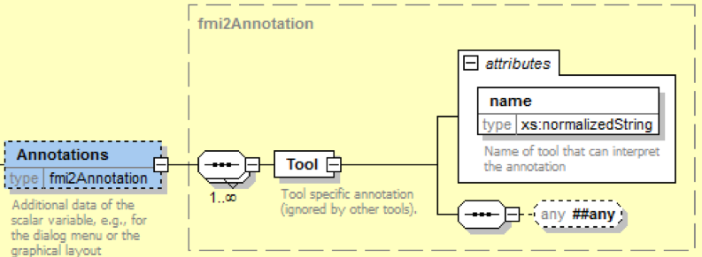

With `Tool.name` the name of the tool is defined that can interpret the `any` element.
The `any` element can be an arbitrary XML data structure defined by the tool.
_[Typically, additional data is defined here how to build up the menu for the variable,
including the graphical layout and enabling/disabling an input field based on the values of other parameters.]_

==== Definition of the Model Structure (ModelStructure)

The structure of the model is defined in element `ModelStructure` within `fmiModelDescription`.
This structure is with respect to the underlying model equations,
independently how these model equations are solved.
_[For example, when exporting a model both in Model Exchange and Co-Simulation format;
then the model structure is identical in both cases.
The Co-Simulation FMU has either an integrator included that solves the model equations,
or the discretization formula of the integrator and the model equations are solved together ("inline integration").
In both cases the model has the same continuous-time states.
In the second case the internal implementation is a discrete-time system,
but from the outside this is still a continuous-time model that is solved with an integration method.]_

The required part defines an ordering of the outputs and of the (exposed) derivatives,
and defines the unknowns that are available during Initialization
_[Therefore, when linearizing an FMU, every tool will use the same ordering for the outputs,
states, and derivatives for the linearized model.
The ordering of the inputs should be performed in this case according to the ordering in `ModelVariables`.]_ A ModelExchange FMU must expose all derivatives of its continuous-time states in element `Derivatives`.
A Co- Simulation FMU does not need to expose these state derivatives.
_[If a Co-Simulation FMU exposes its state derivatives,
they are usually not utilized for the co-simulation,
but, for example, to linearize the FMU at a communication point.]_

The optional part defines in which way derivatives and outputs depend on inputs,
and continuous-time states at the current super dense time instant (ModelExchange) or at the current Communication Point (CoSimulation).
_[A simulation environment can utilize this information to improve the efficiency,
for example, when connecting FMUs together,
or when computing the partial derivative of the derivatives with respect to the states in the simulation engine.]_.

`ModelStructure` has the following definition:

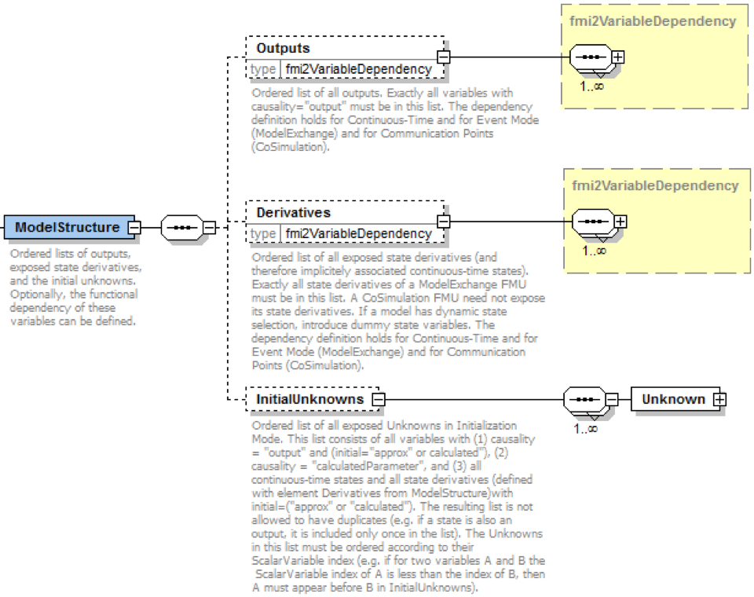

`fmi2VariableDependency` is defined as:

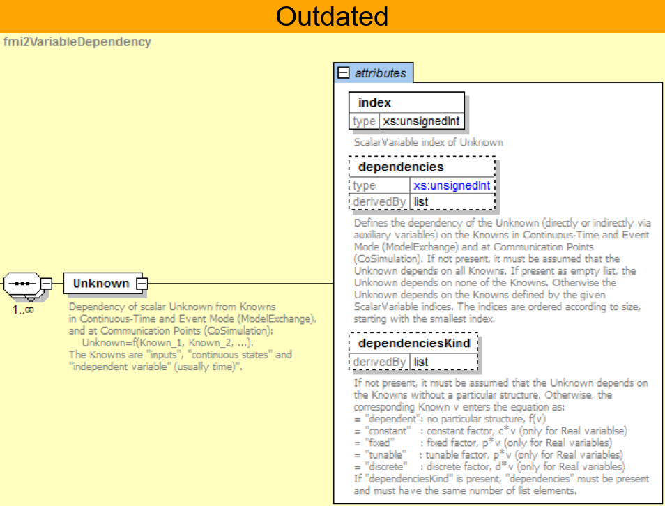

Elements of the `InitialUnknowns` list:

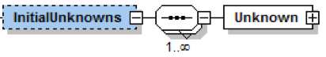

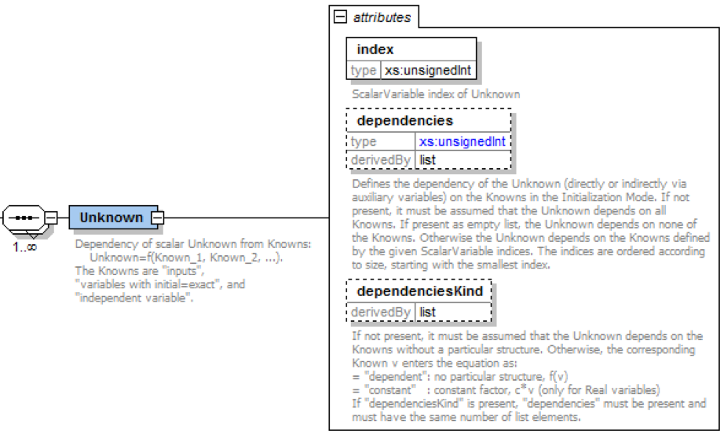

Note that attribute `dependenciesKind` for element `InitialUnknowns` has less enumeration values as `dependenciesKind` in the other lists.

ModelStructure consists of the following elements (see also figures above; the symbols of the mathematical equations describing the dependency are defined in section 3.1):

[cols="1,5",options="header"]
|====
|_Element-Name_
|_Description_

|`Outputs`
|Ordered list of all outputs,
in other words, a list of `ScalarVariable` indices where every corresponding `ScalarVariable` must have `causality = "output"` (and *every variable with `causality="output"` must be listed here*).
_[Note that all output variables are listed here,
especially discrete and continuous outputs.
The ordering of the variables in this list is defined by the exporting tool.
Usually, it is best to order according to the declaration order in the source model,
since then the `Outputs` list does not change
if the declaration order of outputs in the source model is not changed.
This is for example, important for linearization,
in order that the interpretation of the output vector does not change for a re-exported FMU.]_
Attribute `dependencies` defines the dependencies of the outputs from the knowns at the current super dense time instant in _Event_ and in _Continuous-Time Mode_ (ModelExchange) and at the current _Communication Point_ (CoSimulation).
The functional dependency is defined as (dependencies of variables that are fixed in _Event_ and _Continuous-Time Mode_ and at _Communication Points_ are not shown): +
[blue]#latexmath:[\color{blue}{(\mathbf{y}_c, \mathbf{y}_d) := \mathbf{f}_{output}(\mathbf{x}_c, \mathbf{u}_c, \mathbf{u}_d, t, \mathbf{p}_{tune})}]#

|`Derivatives`
|Ordered list of all state derivatives,
in other words, a list of `ScalarVariable` `indices` where every corresponding `ScalarVariable` must be a state derivative.
_[Note that only continuous Real variables are listed here.
If a state or a derivative of a state shall not be exposed from the FMU,
or if states are not statically associated with a variable (due to dynamic state selection),
then dummy `ScalarVariable`pass:[s] have to be introduced,
for example, `x[4]`, or `xDynamicStateSet2[5]`.
The ordering of the variables in this list is defined by the exporting tool.
Usually,
it is best to order according to the declaration order of the states in the source model,
since then the <Derivatives> list does not change
if the declaration order of states in the source model is not changed.
This is for example, important for linearization,
in order that the interpretation of the state vector does not change for a re-exported FMU._].
The number of Unknown elements in the Derivatives element uniquely defines the number of continuous time state variables,
as required by the corresponding Model Exchange functions (integer argument "nx" of `fmi2GetContinuousStates`, `fmi2SetcontinuousStates`, `fmi2GetDerivatives`, `fmi2GetNominalsOfContinuousStates` see hereafter) that require it.
The corresponding continuous-time states are defined by attribute `derivative` of the corresponding `ScalarVariable` state derivative element.
_[Note that higher order derivatives must be mapped to first order derivatives but the mapping definition can be preserved due to attribute `derivative`.
Example: if_ latexmath:[\color{blue}{\frac{\text{ds}}{\text{dt}} = v,\ \frac{\text{dv}}{\text{dt}} =f(..)}] _,then_ latexmath:[\color{blue}{\left\{ v,\ \frac{\text{dv}}{\text{dt}} \right\}}] _ is the vector of state derivatives and attribute `derivative` of_ latexmath:[\color{blue}{v}] _references_ latexmath:[\color{blue}{s}] _,
and attribute `derivative` of_ latexmath:[\color{blue}{\frac{\text{dv}}{\text{dt}}}] _references_ latexmath:[\color{blue}{v}] _.]_ +
For Co-Simulation,
element `Derivatives` is ignored if capability flag `providesDirectionalDerivative` has a value of `false`,
in other words, it cannot be computed. _[This is the default.
If an FMU supports both ModelExchange and CoSimulation,
then the `Derivatives` element might be present,
since it is needed for ModelExchange.
If the above flag is set to false for the CoSimulation case,
then the `Derivatives` element is ignored for CoSimulation.
If "inline integration" is used for a CoSimulation slave,
then the model still has continuous-time states and just a special solver is used (internally the implementation results in a discrete-time system,
but from the outside, it is still a continuous-time system).]_ +
Attribute `dependencies` defines the dependencies of the state derivatives from the knowns at the current super dense time instant in _Event_ and in _Continuous-Time Mode_ (ModelExchange) and at the current _Communication Point_ (CoSimulation).
The functional dependency is defined as (dependencies of variables that are fixed in _Event_ and _Continuous-Time Mode_ and at _Communication Points_ are not shown): +
[blue]#latexmath:[\color{blue}{\dot{\mathbf{x}_c} := \mathbf{f}_{der}(\mathbf{x}_c, \mathbf{u}_c, \mathbf{u}_d, t, \mathbf{p}_{tune})}]#

|`InitialUnknowns`
|Ordered list of all exposed `Unknowns` in Initialization Mode.
This list
consists of all variables with

1. `causality = "output"` and (`initial = "approx"` or `"calculated"`), and

2. `causality = "calculatedParameter"` and

3. all continuous-time states and all state derivatives (defined with element `<Derivatives>` from `<ModelStructure>`) with `initial = "approx"` or `"calculated"` _[if a Co-Simulation FMU does not define the <Derivatives> element, (3) cannot be present]_.

The resulting list is not allowed to have duplicates
(for example, if a state is also an output, it is included only once in the list).
The `Unknowns` in this list must be ordered according to their `ScalarVariable` index
(for example, if for two variables A and B the `ScalarVariable` index of A is less than the index of B, then A must appear before B in `InitialUnknowns`). +
Attribute `dependencies` defines the dependencies of the `Unknowns` from the `Knowns` in _Initialization Mode_ at the initial time.
The functional dependency is defined as:

[blue]#latexmath:[\color{blue}{\dot{\mathbf{v}}_{initialUnknowns} := \mathbf{f}_{init}(\mathbf{u}_c, \mathbf{u}_d, t_0, \mathbf{v}_{initial = exact})}]#

Since, outputs, continuous-time states and state derivatives are either present as `Knowns` (if `initial = "exact"`) or as `Unknowns` (if `initial = "approx"` or `"calculated"`),
they can be inquired with `fmiGetXXX` in InitializationMode.

_[Example: Assume an FMU is defined in the following way:_

latexmath:[\color{blue}{(\mathbf{y}_{c+d}, \dot{\mathbf{x}}_c) := \mathbf{f}_{init}(\mathbf{x}_c, \mathbf{u}_{c+d}, t_0, \mathbf{p})}] +

latexmath:[\color{blue}{(\mathbf{y}_{c+d}, \dot{\mathbf{x}}_c) := \mathbf{f}_{sim}(\mathbf{x}_c, \mathbf{u}_{c+d}, t_i, \mathbf{p})}] +

_Therefore, the initial state latexmath:[\color{blue}{\mathbf{x}_c(t_0)}]
has `initial = "exact"` and the initial state derivative
latexmath:[\color{blue}{\dot{\mathbf{x}}_c(t_0)}]
has `initial = "calculated"`.
The environment can still initialize this FMU in steady-state,
by using
latexmath:[\color{blue}{\mathbf{x}_c(t_0)}]
as iteration variables and adding the equations latexmath:[\color{blue}{\mathbf{x}_c(t_0) = \mathbf{0}}]
in the environment.]_

|`Unknown`
|An element of one of the lists above defining the unknown with a reference to the corresponding `ScalarVariable` element.
It is assumed that at a super-dense time instant latexmath:[\color{blue}{t = (t_R, t_I)}] (ModelExchange) and at a Communication Point (CoSimulation) the following relationship holds:

latexmath:[\color{blue}{v_{unknown} = h(\mathbf{v}_{known}, \mathbf{v}_{freeze})}]

where

- latexmath:[\color{blue}{v_{unknown}}] is the unknown variable defined with this element _[for example, an output or a state derivative]._

- latexmath:[\color{blue}{\mathbf{v}_{known}}] is the vector of input arguments of function _h_ that changes its value in the actual Mode _[for example, continuous-time inputs in Continuous-Time Mode]_.

- latexmath:[\color{blue}{\mathbf{v}_{freeze}}] is the set of input arguments of function _h_ that do not change their values in this Mode,
but change their values in other Modes _[for example, fixed parameters in Continuous-Time Mode]_.

Attribute `dependencies` of `Unknown` defines the dependency of latexmath:[\color{blue}{v_{unknown}}] with respect to latexmath:[\color{blue}{\mathbf{v}_{known}}]. +
_[If, for example, a continuous-time output_ latexmath:[\color{blue}{y_{2}}] _is a function of the continuous-time inputs_ latexmath:[\color{blue}{u_{3}}] _and_ latexmath:[\color{blue}{u_{5}}], _and these inputs have changed, then_ `fmi2SetXXX` _on_ latexmath:[\color{blue}{u_{3}}] _and_ latexmath:[\color{blue}{u_{5}}] _must always be called before calling_ `fmi2GetXXX` _on_ latexmath:[\color{blue}{y_{2}}] _.]_
|====

Element `Unknown` in `Outputs`,
`Derivatives` and `InitialUnknowns` has the following attributes:

[cols="1,5", options="header"]
|====
|_Attribute-Name_
|_Description_

|`index`
|The `ScalarVariable` index of the `Unknown` latexmath:[\color{blue}{v_{\text{unknown}}}].
_[For example, if there are 10 `ScalarVariable`pass:[s] and index = 3,
then the third `ScalarVariable` is the unknown defined with this element.]_

|`dependencies`
|Optional attribute defining the dependencies of the unknown latexmath:[\color{blue}{v_{\text{unknown}}}] (directly or indirectly via auxiliary variables) with respect to latexmath:[\color{blue}{\mathbf{v}_{\text{known}}}].
If not present, it must be assumed that the `Unknown` depends on all `Knowns`.
If present as empty list, the `Unknown` depends on none of the `Knowns`.
Otherwise the `Unknown` depends on the `Knowns` defined by the given `ScalarVariable` indices.
The indices are ordered according to magnitude, starting with the smallest index. +
`Knowns` latexmath:[\color{blue}{\mathbf{v}_{\text{known}}}] in _Event_ and _Continuous-Time Mode_ (ModelExchange) and at _Communication Points_ (CoSimulation) for elements `Outputs`, `Derivatives`:

- inputs (variables with `causality = "input"`)

- continuous-time states

- independent variable (usually time; `causality = "independent"`).
If an independent variable is not explicitly defined under `ScalarVariable`pass:[s],
it is assumed that the `Unknown` depends explicitly on the independent variable.

`Knowns` latexmath:[\color{blue}{\mathbf{v}_{\text{known}}}] in _Initialization Mode_ (for elements `InitialUnknowns`):

- inputs (variables with `causality = "input"`)

- variables with `initial = "exact"` +
_[for example, independent parameters or initial states.]_

- independent variable (usually time; `causality = "independent"`).
If an independent variable is not explicitly defined under `ScalarVariable`pass:[s],
it is assumed that the `Unknown` depends explicitly on the independent variable.

For Co-Simulation, `dependencies` does not list the dependency on continuous-time,
if the capability flag `providesDirectionalDerivative` has a value of `"false"`.
In other words, the respective partial derivatives cannot be computed.

|`dependenciesKind`
|If not present,
it must be assumed that the `Unknown` latexmath:[\color{blue}{v_{\text{unknown}}}] depends on the `Knowns` latexmath:[\color{blue}{\mathbf{v}_{\text{known}}}] without a particular structure.
Otherwise, the corresponding Known latexmath:[\color{blue}{v_{known,i}}] enters the equation as:

If `dependenciesKind` is present, `dependencies` must be present and
must have the same number of list elements.

`= "dependent"`: no particular structure, latexmath:[\color{blue}{{h(..,\ v}_{known,i}}],..)

Only for Real unknowns latexmath:[\color{blue}{v_{\text{unknown}}}]:

`= "constant"`: constant factor,
latexmath:[\color{blue}{c \cdot v_{known,i}}] where latexmath:[\color{blue}{c}] is an expression that is evaluated before `fmi2EnterInitializationMode` is called.

Only for Real unknowns latexmath:[\color{blue}{v_{\text{unknown}}}] in Event and Continuous-Time Mode (ModelExchange) and at _Communication Points_ (CoSimulation),
and not for `InitialUnknowns` for Initialization Mode:

`= "fixed"`: fixed factor,
latexmath:[\color{blue}{p \cdot v_{known,i}}] where latexmath:[\color{blue}{p}] is an expression that is evaluated before `fmi2ExitInitializationMode` is called.

`= "tunable"`: tunable factor,
latexmath:[\color{blue}{p \cdot v_{known,i}}] where latexmath:[\color{blue}{p}] is an expression that is evaluated before `fmi2ExitInitializationMode` is called and in Event Mode due to an external event (ModelExchange) or at a Communication Point (CoSimulation)

`= "discrete"`: discrete factor,
latexmath:[\color{blue}{d \cdot v_{known,i}}] where latexmath:[\color{blue}{d}] is an expression that is evaluated before `fmi2ExitInitializationMode` is called and in Event Mode due to an external or internal event or at a Communication Point (CoSimulation).

If `dependenciesKind` is present,
`dependencies` must be present and must have the same number of list elements.
|====

_[Example 1:_

_An FMU is defined by the following equations:_

[latexmath]
++++
\begin{align*}

\frac{d}{\text{dt}}\begin{bmatrix}
x_{1} \\
x_{2} \\
x_{3} \\
\end{bmatrix}

&=

\begin{bmatrix}
f_{1}\left( x_{2} \right) \\
f_{2}\left( x_{1} \right) + 3 \cdot p^{2} \cdot x_{2} + 2 \cdot u_{1} + 3 \cdot u_{3} \\
f_{3}\left( x_{1},x_{3},u_{1},u_{2},u_{3} \right) \\
\end{bmatrix}

\\

y &= g_1(x_2, x_3)

\end{align*},
++++

_where_ latexmath:[\color{blue}{u_{1}}] _is a continuous-time input (`variability="continuous"`),_ latexmath:[\color{blue}{u_{2}}] _is any type of input,_ latexmath:[\color{blue}{u_{3}}] _is a Real discrete-time input (`variability="discrete"`),
and_ latexmath:[\color{blue}{p}] _is a fixed parameter (`variability="fixed"`).
The initialization is defined by:_

[latexmath]
++++
x_1 = 1.1, \frac{dx_2}{dt} = 0, y = 3.3,
++++

_and therefore, the initialization equations are:_

[latexmath]
++++
\begin{align*}
x_{2} &= \frac{1}{3 \cdot p^{2}} \cdot ( f_{2}\left( x_{1} \right) + 2 \cdot u_{1} + 3 \cdot u_{3} )
\\
x_{3} &= g_{1}^{- 1}( x_{2}, y)
\end{align*}
++++

_This equation system can be defined as:_

[source, xml]
----
<ModelVariables>
   <ScalarVariable name="p"       ...> … </ScalarVariable>  <!--index="1" -->
   <ScalarVariable name="u1"      ...> … </ScalarVariable>  <!--index="2" -->
   <ScalarVariable name="u2"      ...> … </ScalarVariable>  <!--index="3" -->
   <ScalarVariable name="u3"      ...> … </ScalarVariable>  <!--index="4" -->
   <ScalarVariable name="x1"      ...> … </ScalarVariable>  <!--index="5" -->
   <ScalarVariable name="x2"      ...> … </ScalarVariable>  <!--index="6" -->
   <ScalarVariable name="x3"      ...> … </ScalarVariable>  <!--index="7" -->
   <ScalarVariable name="der(x1)" ...> … </ScalarVariable>  <!--index="8" -->
   <ScalarVariable name="der(x2)" ...> … </ScalarVariable>  <!--index="9" -->
   <ScalarVariable name="der(x3)" ...> … </ScalarVariable>  <!--index="10" -->
   <ScalarVariable name="y"       ...> … </ScalarVariable>  <!--index="11" -->
</ModelVariables>

<ModelStructure>
   <Outputs>
     <Unknown index="11" dependencies="6 7" />
   </Outputs>
   <Derivatives>
     <Unknown index="8"  dependencies="6" />
     <Unknown index="9"  dependencies="2 4 5 6"
                         dependenciesKind="constant constant dependent fixed"/>
     <Unknown index="10" dependencies="2 3 4 5 6" />
   </Derivatives>

   <InitialUnknowns>
     <Unknown index="6" dependencies="2 4 5" />
     <Unknown index="7" dependencies="2 4 5 11" />
     <Unknown index="8" ... />
     <Unknown index="10" ... />
   </InitialUnknowns>
</ModelStructure>
----

_Example 2:_

[latexmath]
++++
y = \left\{ \begin{matrix}
2 \cdot u \ \mathrm{if} \ u > 0 \\
3 \cdot u \ \mathrm{else} \\
\end{matrix}\right.
++++

_where_ latexmath:[\color{blue}{u}] _is a continuous-time input with index="1" and_ latexmath:[\color{blue}{y}] _is a continuous-time output with index="2".
The definition of the model structure is then:_

[source, xml]
----
<ModelStructure>
  <Outputs>
    <Unknown index="2" dependencies="1" dependenciesKind="discrete"/>
  </Outputs>
</ModelStructure>
----

_[Note that_ latexmath:[\color{blue}{y = d \cdot u}] _where_ latexmath:[\color{blue}{d}] __changes only during Event Mode (__latexmath:[\color{blue}{d = 2 \cdot u}] _or_ latexmath:[\color{blue}{3 \cdot u\ }] _depending on relation_ latexmath:[\color{blue}{u > 0}] _that changes only at Event Mode).
Therefore dependenciesKind="discrete".]_

_Example 3:_

[latexmath]
++++
y = \left\{ \begin{matrix}
2\ \ \mathrm{if}\ \ u > 0 \\
3\ \ \mathrm{else} \\
\end{matrix}\right.
++++

_where_ latexmath:[\color{blue}{u}] _is a continuous-time input with index="1" and_ latexmath:[\color{blue}{y}] _is a continuous-time output with index="2".
The definition of the model structure is then:_

[source, xml]
----
<ModelStructure>
  <Outputs>
    <Unknown index="2" dependencies="1" dependenciesKind="dependent"/>
  </Outputs>
</ModelStructure>
----

_[Note that_ latexmath:[\color{blue}{y = c}] _where_ latexmath:[\color{blue}{c}] __changes only during Event Mode (__latexmath:[\color{blue}{c = 2}] _or_ latexmath:[\color{blue}{3\ }]__depending on relation__ latexmath:[\color{blue}{u > 0}] _that changes only at Event Mode).
Therefore `dependenciesKind="dependent"` because it is not a linear relationship on_ latexmath:[\color{blue}{u}].]

_Example 4:_

[latexmath]
++++
\frac{dx}{dt} = u, y = x
++++

_where_ latexmath:[\color{blue}{u}] _is a continuous-time input with index="1" and_ latexmath:[\color{blue}{y}] _is a continuous-time output with index="2",_ latexmath:[\color{blue}{x}] _is a continuous-time state with index="3"  and_ latexmath:[\color{blue}{\frac{dx}{dt}}] _is a continuous-time derivative with index="4"._
The definition of the model structure is then:_
[source, xml]
----
<ModelVariables>
   <ScalarVariable name="u"     , ...> … </ScalarVariable>  <!--index="1" -->
   <ScalarVariable name="y"     , ...> … </ScalarVariable>  <!--index="2" -->
   <ScalarVariable name="x"     , ...> … </ScalarVariable>  <!--index="3" -->
   <ScalarVariable name="der(x)", ...> … </ScalarVariable>  <!--index="4" -->
</ModelVariables>

<ModelStructure>
   <Outputs>
     <Unknown index="2" dependencies="3"  dependenciesKind="constant"/>
   </Outputs>
   <Derivatives>
     <Unknown index="4"  dependencies="1"  dependenciesKind="constant"/>
   </Derivatives>

   <InitialUnknowns>
     <Unknown index="2" dependencies="3" />
     <Unknown index="4" dependencies="1" />
   </InitialUnknowns>
</ModelStructure>
----
_Defining FMU features with the_ `dependencies` _list:_

_[Note that via the `dependencies` list the supported features of the FMU can be defined.
Examples:_

- _If a state derivative `der_x` is a function of a parameter p (so of a start value of a variable with `causality = "parameter"` and `variability = "fixed"`),
and the FMU does not support an iteration over `p` during `InitializationMode`
(for example, to iterate over p such that the state derivative `der_x` is zero),
then the dependencies list of `der_x` should not include `p`.
If an FMU is imported in an environment and such an iteration is set up,
then the tool can figure out that the resulting algebraic system of equations is structurally singular and therefore can reject such a definition._

- _For standard Co-Simulation FMUs, it is common that no algebraic loops over the input/output variables nor over start-values is supported.
In such a case,
all `dependencies` lists for output variables under the `InitialUnknowns` element should be defined as empty lists defining that the setting of inputs and/or of start values does not influence the outputs.
As a result,
it is not possible to formulate algebraic loops of connected FMUs during InitializationMode.]_

==== Variable Naming Conventions (variableNamingConvention)

With attribute `variableNamingConvention` of element `fmiModelDescription`,
the convention is defined how the `ScalarVariable.name`pass:[s] have been constructed.
If this information is known,
the environment may be able to represent the names in a better
way (for example, as a tree and not as a linear list).

In the following definitions,
the http://en.wikipedia.org/wiki/Extended_BNF[EBNF] is used:

----
=   production rule
[ ] optional
{ } repeat zero or more times
|   or
----

The names must be unique, non-empty strings. +
_[It is recommended that the names are visually clearly different from each other; but it is not required.]_

The following conventions for scalar names are defined:

*`variableNamingConvention = "flat"`*

----
name = Unicode-char { Unicode-char } // identical to xs:normalizedString
Unicode-char = any Unicode character without carriage return (#xD),
line feed (#xA) nor tab (#x9)
----

*`variableNamingConvention = "structured"`*

Structured names are hierarchical using "." as a separator between hierarchies.
A name consists of "pass:[_]",
letters and digits or may consist of any characters enclosed in single apostrophes.
A name may identify an array element on every hierarchical level using "[...]" to identify the respective array index.
A derivative of a variable is defined with `der(name)` for the first time derivative and `der(name,N)` for the N-th derivative.
Examples:

----
vehicle.engine.speed
resistor12.u
v_min
robot.axis.'motor #234'
der(pipe[3,4].T[14],2) // second time derivative of pipe[3,4].T[14]
----

The precise syntax is footnote:[This definition is identical to the syntax of an identifier in Modelica version 3.2.]:

----
name            = identifier | "der(" identifier ["," unsignedInteger ] ")"
identifier      = B-name [ arrayIndices ] {"." B-name [ arrayIndices ] }
B-name          = nondigit { digit | nondigit } | Q-name
nondigit        = "pass:[_]" | letters "a" to "z" | letters "A" to "Z"
digit           = "0" | "1" | "2" | "3" | "4" | "5" | "6" | "7" | "8" | "9"
Q-name          = "’" ( Q-char | escape ) { Q-char | escape } "’"
Q-char          = nondigit | digit | "!" | "#" | "$" | "%" | "&" | "(" | ")" |
                                     "*" | "+" | "," | "-" | "." | "/" | ":" |
                                     ";" | "<" | ">" | "=" | "?" | "@" | "[" |
                                     "]" | "^" | "{" | "}" | "|" | "~" | " "
escape          = "\’" | "\"" | "\?" | "\\" | "\a" | "\b" |
                  "\f" | "\n" | "\r" | "\t" | "\v"
arrayIndices    = "[" unsignedInteger {"," unsignedInteger} "]"
unsignedInteger = digit { digit }
----

[line-through]#The tree of names is mapped to an ordered list of `ScalarVariable.name`pass:[s] in http://en.wikipedia.org/wiki/Depth-first_search[depth-first] order.#

_[Clarification for FMI 2.0.1: this constraint has been removed.]_

Example:

----
vehicle
  transmission
    ratio
    outputSpeed
  engine
    inputSpeed
    temperature
----

is mapped to the following list of `ScalarVariable.name`pass:[s]:

----
vehicle.transmission.ratio
vehicle.transmission.outputSpeed
vehicle.engine.inputSpeed
vehicle.engine.temperature
----

All array elements are given in a consecutive sequence of `ScalarVariable`pass:[s].
Elements of multi-dimensional arrays are ordered
according to "row major" order that is elements of the last index are
given in sequence.

_[For example, the vector "centerOfMass" in body "arm1" is mapped to the following `ScalarVariable`pass:[s]:_

----
robot.arm1.centerOfMass[1]
robot.arm1.centerOfMass[2]
robot.arm1.centerOfMass[3]
----

_[For example, a controller might receive 3 rpm sensors mapped to the following variables:_

----
transmission.rpms[0]
transmission.rpms[1]
transmission.rpms[2]
----

_For example,
a table T[4,3,2] (first dimension 4 entries,
second dimension 3 entries,
third dimension 2 entries) is mapped to the following `ScalarVariable`pass:[s]:_

----
T[1,1,1]
T[1,1,2]
T[1,2,1]
T[1,2,2]
T[1,3,1]
T[1,3,2]
T[2,1,1]
T[2,1,2]
T[2,3,1]
…
----
_]_

It might be that not all elements of an array are present.
If they are present, they are given in consecutive order in the XML file.

_[Clarification for FMI 2.0.2: The `variableNamingConvention` `structured` does not define if array indices are 0- or 1-based.]_
