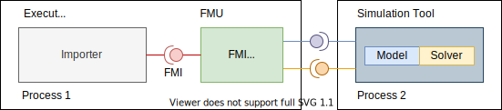
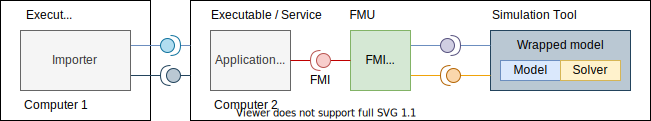
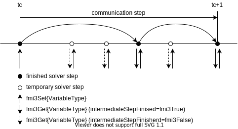

=== Common Concepts for Co-Simulation [[common-concepts-cosim]]

//TODO: This should not overlap with the other cosim types.

Co-simulation exploits the modular structure of coupled problems in all stages of the simulation process beginning with the separate model setup and preprocessing for the individual subsystems in different simulation tools (which can be powerful simulators as well as simple C programs).
During time integration, the simulation is again performed independently for all subsystems restricting the data exchange between subsystems to discrete communication points latexmath:[tc_i].
For simulator coupling, also the visualization and post-processing of simulation data is done individually for each subsystem in its own native simulation tool.
In different contexts, the communication points latexmath:[tc_i], the communication steps latexmath:[tc_i \rightarrow tc_{i+1}] and the communication step sizes latexmath:[hc_i := tc_{i+1} - tc_i] are also known as sampling points (synchronization points), macro steps and sampling rates, respectively.
The term "communication point" in FMI for Co-Simulation refers to the communication between subsystems in a co-simulation environment and should not be mixed with the output points for saving simulation results to file.

FMI for Co-Simulation provides 3 interface standards for the solution of time-dependent coupled systems consisting of subsystems that are continuous in time (model components that are described by non-stationary differential equations) or time-discrete (model components that are described by difference equations such as discrete controllers).
In a block representation of the coupled system, the subsystems are represented by blocks with (internal) <<state>> variables latexmath:[x(t)] that are connected to other subsystems (blocks) of the coupled problem by _subsystem <<input,`inputs`>>_ latexmath:[u(t)] and _subsystem <<output,`outputs`>>_ latexmath:[y(t)].
In this framework, the physical connections between subsystems are represented by mathematical coupling conditions between the inputs latexmath:[u(t)] and the <<output,`outputs`>> latexmath:[y(t)] of all subsystems, <<KS00>>.

.Data flow at communication points.
image::images/co-simulation-data-flow.svg[width=80%, align="center"]

For co-simulation, two basic groups of functions have to be implemented:

. functions for the data exchange between subsystems

. functions to synchronize the simulation of all subsystems and to proceed in communication steps latexmath:[tc_i \rightarrow tc_{i+1}] from initial time latexmath:[tc_0 := t_{\mathit{start}}] to end time latexmath:[tc_N := t_{\mathit{stop}}]

// TODO: Add "A Co-sim interface..."
In FMI for Co-Simulation, both groups of functions are implemented in one software component, the Co-Simulation master.
The data exchange between the subsystems (slaves) is handled via the master only.
There is no direct communication between the slaves.
The master functionality can be implemented by a special software tool (a separate simulation backplane) or by one of the involved simulation tools.
In its most general form, the coupled system may be simulated in nested co-simulation environments and FMI for Co-Simulation applies to each level of the hierarchy.

// TODO: Add "A Co-sim interface..."
FMI for Co-Simulation defines interface routines for the communication between the master and all slaves (subsystems) in a co-simulation environment.
The most common master algorithm stops at each communication point latexmath:[tc_i] the simulation (time integration) of all slaves, collects the outputs latexmath:[y(tc_i)] from all subsystems, determines the subsystem inputs latexmath:[u(tc_i)], distributes these subsystem inputs to the slaves and continues the (co-)simulation with the next communication step latexmath:[tc_i \rightarrow tc_{i+1} = tc_i + hc] with fixed communication step size latexmath:[hc].
In each slave, an appropriate solver is used to integrate one of the subsystems for a given communication step latexmath:[tc_i \rightarrow tc_{i+1}].
The most simple co-simulation algorithms approximate the (unknown) subsystem inputs latexmath:[u(t), (t > tc_i))] by frozen data latexmath:[u(tc_i)] for latexmath:[tc_i \leq t < tc_{i+1}].
FMI for Co-Simulation supports this classical brute force approach as well as more sophisticated master algorithms.
FMI for Co-Simulation is designed to support a very general class of master algorithms but it does not define the master algorithm itself.

The ability of slaves to support more sophisticated master algorithms is characterized by a set of capability flags inside the XML description of the slave (see <<fmi-for-basic-co-simulation>>).
Typical examples are:

- the ability to handle variable communication step sizes latexmath:[hc_i],

- the ability to repeat a rejected communication step latexmath:[tc_i \rightarrow tc_{i+1}] with reduced communication step size,

- the ability to provide <<derivative,`derivatives`>> of <<output,`outputs`>> w.r.t. time, to allow input approximation (<<transfer-of-input-output-and-parameters>>),

- or the ability to provide Jacobians.

FMI for Co-Simulation is restricted to slaves with the following properties:

. All calculated values are time-dependent functions within an a priori defined time interval latexmath:[t_{\mathit{start}} \leq t \leq t_{\mathit{stop}}] (provided `stopTimeDefined == fmi3True` when calling <<fmi3EnterInitializationMode>>).

. All simulations are carried out with increasing time in general.
The current time latexmath:[t] is running step by step from latexmath:[t_{\mathit{start}}] to latexmath:[t_{\mathit{stop}}].
The algorithm of the slave may have the property to be able to repeat the simulation of parts of latexmath:[[t_{\mathit{start}}, t_{\mathit{stop}}]] or the whole time interval latexmath:[[t_{\mathit{start}}, t_{\mathit{stop}}]].

. The slave can be given a time value latexmath:[tc_i, t_{\mathit{start}} \leq tc_i \leq t_{\mathit{stop}}].

. The slave is able to interrupt the simulation when latexmath:[tc_i] is reached.

. During the interrupted simulation, the slave (and its individual solver) can receive values for <<input,`inputs`>> latexmath:[u(tc_i)] and send values of outputs latexmath:[y(tc_i)].

. Whenever the simulation in a slave is interrupted, a new time value latexmath:[tc_{i+1}, tc_i \leq tc_{i+1} \leq t_{\mathit{stop}}], can be given to simulate the time subinterval latexmath:[tc_i < t \leq tc_{i+1}]

. The subinterval length latexmath:[hc_i] is the communication step size of the latexmath:[i^{th}] communication step, latexmath:[hc_i = tc_{i+1} - tc_i].

The communication step size has to be greater than zero.

FMI for Co-Simulation allows a Co-Simulation flow which starts with instantiation and initialization (all slaves are prepared for computation, the communication links are established), followed by simulation (the slaves are forced to simulate a communication step), and finishes with shutdown.
The details of the flow are given in the state machine of the calling sequences from master to slave, for each co-simulation interface (see <<state-machine-basic-co-simulation>>, <<state-machine-calling-sequence-clocked-co-simulation>>, and <<state-machine-scheduled-co-simulation>>).

==== Overview of Different Co-Simulation Interfaces

===== Basic Co-Simulation

Basic Co-Simulation is a rather general approach to the simulation of coupled technical systems and coupled physical phenomena in engineering with focus on non-stationary (time-dependent) problems.
The Basic Co-Simulation interface is similar to the feature set of FMI 2.0 for Co-Simulation.
The asynchronous mode for FMUs has been removed since this mode was not supported by tools and it can be suitably replaced by Co-Simulation master implementations that control the asynchronous computation of FMUs via separate tasks/threads created for each FMU.

===== Hybrid Co-Simulation

The <<hybrid-co-simulation-api,Hybrid Co-Simulation>> interface provides functionalities to control and observe the ticking of <<clock,clocks>>.
For FMI for Hybrid Co-Simulation, the ticking of a clock is interpreted as an activity of the associated model partition.
During simulation, the Co-Simulation master updates and manages values of inputs and outputs of FMUs and further models at communication points for each model partition.
The ratio between communication points created for a model partition and time can be seen as a model rate.
In that sense multiple model partitions of a model define multiple model rates in a model.

===== Scheduled Co-Simulation

The <<hybrid-co-simulation-api,Hybrid Co-Simulation>> interface provides an indirect control over the computation of model partitions.
With <<scheduled-co-simulation-api,Scheduled Co-Simulation>> a simulation master can directly control the time of computation (i.e. scheduling) for such model partitions.

The Scheduled Co-Simulation interface addresses simulation use cases with the following requirements:

* At any time (even for unpredictable events), an event can be signaled to an FMU;
* If multiple FMUs share resources (e.g. control tasks), the time requirements (e.g. execution time, communication deadlines) of all model partitions have to be observed and respected;
** Time requirements may exist due to communication constraints (that are not apparent at FMU simulation level) which have to be fulfilled by the simulation master;
** That requires a global evaluation order and preemption policy for all model partitions of the multiple FMUs
** Priority information provided by the FMUs has to be evaluated and merged to an overall priority for available model partitions
* Data shall move between the different FMU model partitions for the same or next activation time.
** Get/set operations must also be possible for the same activation time for different model partitions between the computation of these model partitions.
* This Co-Simulation interface provides support for concurrent computation of model partitions (i.e. a support of multiple rates) on a single computational resource (e.g. CPU-core) of an FMU.
For that a preemptive multitasking regime is intended (cooperative multitasking is not covered by this description).

_[A parallel computation of model partitions is not part of the FMI 3.0 API._
_An FMU may still internally use parallel computation on multiple cores, but handling this is (currently) not part of the FMI standard. Such an internal parallel computation is not visible to the simulation master._
_It is a tool vendor specific solution that has ties to the used OS and the co-simulation environment.]_

===== Supporting Multiple Co-Simulation Interfaces in one FMU
Exporters are encouraged to support multiple Co-Simulation interfaces in one FMU, so it can be used in differently capable Co-Simulation master implementations and for different use cases.
To indicate support for a specific Co-Simulation interface, the `<fmiModelDescription>` must have the respective Co-Simulation element present. +
_[That improves the reusability of FMUs._
_A common application of this multiple mode support is the reuse of FMUs for real-time and non-real-time simulations.]_ +
The described multi-mode support is based on wrapping functionality into the <<fmi3DoStep>> function by emulating missing features of the Co-Simulation interface, the FMU has been specifically exported for. +
_[An FMU that supports <<scheduled-co-simulation-api,Scheduled Co-Simulation>> will in most cases also support <<hybrid-co-simulation-api,Hybrid Co-Simulation>>._
_Wrapping towards other Co-Simulation interfaces can influence the simulation results._
_Depending on the model, wrapping towards the Basic Co-Simulation interface may result in divergent simulation results._
_Especially <<periodic,aperiodic>> <<inputClock,`input clocks`>> can not always be sufficiently emulated in modes that do not directly support <<clock,`clocks`>>._
_Therefore it is recommended that the FMU provides logging information to the user about the influence of the current mode on simulation results, if non-optimal modes are used by the simulation environment.]_

===== Coupling Scenarios

<<figure-co-simulation-with-generated-code>> and <<figure-co-simulation-with-tool-coupling>> illustrate the most common Co-Simulation coupling scenarios.

.Co-Simulation with generated code on a single computer (for simplicity shown for one slave only).
[#figure-co-simulation-with-generated-code]
image::images/co-simulation-single-slave.svg[width=50%, align="center"]

.Co-Simulation with tool coupling on a single computer (for simplicity shown for one slave only).
[#figure-co-simulation-with-tool-coupling]

In the tool coupling case (<<figure-co-simulation-with-tool-coupling>>) the FMU implementation wraps the FMI function calls to API calls which are provided by the simulation tool (for example, a COM, CORBA or DCP API).
Additionally to the FMU, the simulation tool is needed to run a co-simulation.

In its most general form, a tool coupling based co-simulation is implemented on distributed hardware with subsystems being handled by different computers with different operating systems (cluster computer, computer farm, computers at different locations).
The data exchange and communication between the subsystems is typically performed using one of the network communication technologies (for example, MPI, TCP/IP).
The definition of this communication layer is not part of the FMI standard.
However, distributed co-simulation scenarios can be implemented using FMI as shown in <<figure-distributed-co-simulation>>.

.Distributed co-simulation infrastructure (for simplicity shown for one slave only).
[#figure-distributed-co-simulation]

The master has to implement the communication layer.
Additional parameters for establishing the network communication (for example, identification of the remote computer, port numbers, user account) are to be set via the GUI of the master.
This data is not transferred via the FMI API.

The Co-Simulation master signals to the FMU which features shall be used for the current instance of the FMU in <<fmi3Instantiate>>.

If the FMU does not support the Co-Simulation interface selected in <<fmi3Instantiate>>, it has to return a null pointer.

==== Early Return [[early-return]]

An FMU is allowed to stop the execution of <<fmi3DoStep>> and return without reaching the predefined communication time, i.e. <<currentCommunicationPoint>> `+` <<communicationStepSize>>.
This mechanism is called "early return".

[[canReturnEarlyAfterIntermediateUpdate,`canReturnEarlyAfterIntermediateUpdate`]]
The Boolean capability flag <<canReturnEarlyAfterIntermediateUpdate>> in the <<modelDescription.xml>> file indicates whether the FMU supports the early-return feature.
The default value of this capability flag is `false`.

Each time an internal discontinuity or an event happens inside an FMU with capability flag <<canReturnEarlyAfterIntermediateUpdate,`canReturnEarlyAfterIntermediateUpdate = true`>>, the callback function <<fmi3CallbackIntermediateUpdate>> is called by the FMU.
The master can only use this early return functionality if it provides the <<fmi3CallbackIntermediateUpdate>> callback function pointer in the instantiate function.

With the early return feature, an FMU can signal <<outputClock>> events or internal state changes, i.e., discontinuity events to the Co-Simulation master at any time (not only at the end of <<fmi3DoStep>> function calls).
When an internal event occurs inside the FMU at a time instant, it informs the master that a new communication point for the Co-Simulation can be created.
Note that an event signal is not seen in the narrow sense of solver induced discontinuity events but in the general sense of a simulation event that has to be handled by the Co-Simulation master (e.g. state changes that require extended handling).

A second use of the early-return mechanism is the following:
In particular in multi-node architectures, significant co-simulation speed-up may be obtained if the Co-Simulation master can avoid waiting until the end of the slowest <<fmi3DoStep>> when many FMUs are integrating in parallel and an event occurres.
To exploit such efficiency gains, the Co-Simulation master can command the FMU to return early from the current communication step.
_[In this use case, early return is a simple form of cooperative multitasking.]_

Early return is even helpful if the FMU or the Co-Simulation master do not support the advanced handling of events based on the <<hybrid-co-simulation-api, Hybrid Co-Simulation>> functionalities.
Multiple event types and also <<outputClock>> ticks or interrupts can be supported based on the early-return functionality and additional functionalities provided by <<hybrid-co-simulation-api,Hybrid Co-Simulation>>.

==== Intermediate Variable Access [[intermediate-variable-access]]

Intermediate variable access has three main use cases:

- An FMU is able to produce valid output variables at intermediate points between two consecutive communication points.
This is typically the result of an internal solver taking multiple integration steps between two consecutive communication points of a <<fmi3DoStep>>.
It is possible for the FMU to inform the master whether the internal solver is in a temporary state or if it has just completed an internal integration step.
The FMU exposes intermediate output variables for the master whenever they are available.
If the internal integration step is completed, the master can forward intermediate outputs to other FMUs, where they can be used, for e.g., for extrapolation, interpolation, filtering or asynchronous co-simulation.

- Intermediate <<input>> variables for an FMU are available in the Co-Simulation master.
The FMU requests updated intermediate <<input>> variables every time they are required by the internal solver.
This can be either at temporary solver states or after successful integration steps.

- Intermediate <<output>> variables of the FMU can be computed for the Co-Simulation master.
The computation requires intermediate output variables from the FMU.
Whenever the internal solver in the FMU needs updated intermediate <<input>> variables, it provides the intermediate output variables for and requests the intermediate <<input>> variables from the master.

Combinations of the above use cases are also allowed.

Access to intermediate variables enables several features such as:

* Advanced interpolation/extrapolation techniques _[especially enabling the same input approximation that was possible in FMI 2.0 with `fmi2SetInputDerivatives`, now evaluating the approximation polynomial in the master compared to within the FMU in FMI 2.0]_,

* Asynchronous communication,

* Anti-alias filtering, and

* Smoothing of inputs.

Intermediate variable access can be activated in all Co-Simulation interface types, if both, the FMU and the master, support it.

If the Co-Simulation master signals the support for intermediate variable access and an FMU has at least one variable with <<intermediateAccess,`intermediateAccess = true`>>, the FMU can use the callback function <<fmi3CallbackIntermediateUpdate>> to communicate information back to the Co-Simulation master:

[[fmi3CallbackIntermediateUpdate,`fmi3CallbackIntermediateUpdate`]]
[source, C]
----
include::../headers/fmi3FunctionTypes.h[tag=CallbackIntermediateUpdate]
----

[[intermediateUpdateTime,`intermediateUpdateTime`]]
* <<intermediateUpdateTime>> is the internal simulation time of the FMU at which the callback has been called.
If an event happens or an <<outputClock>> ticks, <<intermediateUpdateTime>> is the time of event or <<outputClock>> tick.
If the FMU returns with <<earlyReturn,`earlyReturn == fmi3True`>> from <<fmi3DoStep>> then <<intermediateUpdateTime>> is the internal simulation time of the FMU of the last <<fmi3CallbackIntermediateUpdate>> call that signaled <<canReturnEarly,`canReturnEarly == fmi3True`>>.
<<intermediateUpdateTime>> is also the time of intermediate steps of the internal FMU solver.
The FMU must not call the callback function <<fmi3CallbackIntermediateUpdate>> with an <<intermediateUpdateTime>> that is smaller than the <<intermediateUpdateTime>> given in a previous call of <<fmi3CallbackIntermediateUpdate>> with `intermediateStepFinished == fmi3True`.

The following two `fmi3Boolean` variables define reasons for the <<fmi3CallbackIntermediateUpdate>> call and can only be set to `fmi3True` in Hybrid Co-Simulation.

[[eventOccurred,`eventOccurred`]]
* When <<eventOccurred,`eventOccurred == fmi3True`>>, the master returns <<earlyReturnRequested,`earlyReturnRequested == fmi3True`>> from <<fmi3CallbackIntermediateUpdate>> and request the FMU to return early from the current <<fmi3DoStep>> and handle the event via entering *Event Mode*.
In *Event Mode* the master shall call <<fmi3NewDiscreteStates>> to gather related information about the event that occurred at <<intermediateUpdateTime>>.

[[clocksTicked,`clocksTicked`]]
* When <<clocksTicked,`clocksTicked == fmi3True`>>, it means that <<fmi3GetClock>> function should be called for gathering all <<clock>> related information about ticking <<outputClock,`output clocks`>> at <<intermediateUpdateTime>>.
If this flag is `fmi3True` the master must return with <<earlyReturnRequested,`earlyReturnRequested == fmi3True`>> from <<fmi3CallbackIntermediateUpdate>> to request an early return and handle the <<clock>> event in *Event Mode*.

[[intermediateVariableSetAllowed,`intermediateVariableSetAllowed`]]
* If <<intermediateVariableSetAllowed,`intermediateVariableSetAllowed == fmi3True`>>, the Co-Simulation master may provide intermediate <<input>> variables by calling `fmi3Set{VariableType}` for variables with <<intermediateAccess,`intermediateAccess = true`>>.

[[intermediateVariableGetAllowed,`intermediateVariableGetAllowed`]]
* If <<intermediateVariableGetAllowed,`intermediateVariableGetAllowed == fmi3True`>>, the Co-Simulation master may collect intermediate output variables by calling `fmi3Get{VariableType}` for variables with <<intermediateAccess,`intermediateAccess = true`>>.

[[intermediateStepFinished,`intermediateStepFinished`]]
* If <<intermediateStepFinished, `intermediateStepFinished == fmi3False`>>, the Co-Simulation master shall only use intermediate output variables to compute intermediate <<input>> variables at the current state for the given FMU.
The master *MUST NOT* pass information obtained with `fmi3Get{VariableTypes}` in this case to other connected FMUs nor use these information to derive any kind information (e.g. extrapolation) that is passed to other connected FMUs or other model parts.
However, the master is allowed to use the obtained with `fmi3Get{VariableTypes}` for calculations that are directly passed back to the FMU `fmi3Set{VariableTypes}`.

_[The use case for this to let the Master do some calculations for the FMU even for not finished sovler steps._
_This is beneficial for example for Transmission Line (TLM) Co-Simulation, where this helps to keep the interface clearer._
_Instead of FMUs exchanging hard-to-understand variables such as "wave variable" and "characteristic impedance", they can exchange intuitive variables like "force" and "speed". ]_

[[canReturnEarly,`canReturnEarly`]]
* When <<canReturnEarly,`canReturnEarly == fmi3True`>> the master can request the FMU to return early at the current <<intermediateUpdateTime>> time instant by returning with <<earlyReturnRequested,`earlyReturnRequested == fmi3True`>> from the callback function <<fmi3CallbackIntermediateUpdate>>.
If <<canReturnEarly,`canReturnEarly == fmi3False`>> the FMU will not do the early return, regardless of the master request.

[[earlyReturnRequested,`earlyReturnRequested`]]
* `earlyReturnRequested == fmi3True` requests the FMU to end the <<fmi3DoStep>> at a Newtonian time instant and return early.
This is only allowed if <<canReturnEarly,`canReturnEarly == fmi3True`>>.

[[earlyReturnTime,`earlyReturnTime`]]
* `earlyReturnTime` is used to tell the FMU at what time to return early from the current <<fmi3DoStep>> (at the earliest), if the return value of <<earlyReturnRequested>> of <<fmi3CallbackIntermediateUpdate>> is `fmi3True`.
If the <<earlyReturnTime>> is greater than the last signaled <<intermediateUpdateTime>>, the FMU may integrate up to the time instant <<earlyReturnTime>>.

If the early return is conducted successfully by the FMU it must return with <<earlyReturn,`earlyReturn == fmi3True`>> from <<fmi3DoStep>>, indicating the current FMU time with <<lastSuccessfulTime>>.

The Co-Simulation master can decide if a rollback of the FMU to reach the <<earlyReturnTime>> time is required or it may continue the simulation from <<lastSuccessfulTime>> for that FMU.
Note that *Event Mode* is not supported in Basic Co-Simulation and Scheduled Co-Simulation.

It is important to distinguish intermediate output from successful internal integration steps from intermediate outputs valid only for temporary solver states.
<<figure-intermediate-variable-access>> shows an overview of the solver states and the intended use of intermediate variable access.
It is not allowed to call <<intermediateUpdate>> for a simulation time point prior to or equal to a previous call with <<intermediateStepFinished,`intermediateStepFinished == fmi3True`>>.

.Overview of solver states and intermediate variable access during a communication step
[#figure-intermediate-variable-access]

The following code example shows an implementation of <<fmi3CallbackIntermediateUpdate>> that uses intermediate variable access to record a set of variables at every internal solver step:

[source, c]
----
include::Reference-FMUs/examples/bcs_intermediate_variable_access.c[tag=IntermediateUpdateCallback]
----
