[[modelDescription.xml,`modelDescription.xml`]]
=== FMI Description Schema

All static information related to the core functionality of an FMU is stored in the text file <<modelDescription.xml>> in XML format as specified by the XML schema file `fmi3ModelDescription.xsd`.
Especially, the FMU variables and their attributes such as `name`, `unit`, <<start>> value, etc. are stored in this file.

Additional optional information about the graphical representation and the grouping of FMU variables into terminals is stored in the optional text file `terminalsAndIcons/terminalsAndIcons.xml` in XML format as specified by the XML schema file <<fmiTerminalsAndIcons,`fmi3TerminalsAndIcons.xsd`>>.

Build information for source code FMUs is provided together with a <<BuildConfiguration,`buildDescription.xml`>> file in the `sources` directory that adheres to the `fmi3BuildDescription.xsd` schema file.

It is not allowed to change the <<modelDescription.xml>> file within an FMU.
_[Reason: The <<modelDescription.xml>> file has to be consistent with the binary or source code implementations._
_Specifically, changes to the start values would introduce such inconsistencies.]_

In this section the schema files mentioned above, including their helper schema files, are discussed.
In the graphical representation of the schemata, optional elements are marked with a dashed box (e.g., see <<figure-schema-Annotations>>).
The required data types (like: `xs:normalizedString`) are defined in https://www.w3.org/TR/xmlschema-2/[XML Schema Part 2: Datatypes Second Edition].
The types used in the FMI schema files are:

.Types used in the FMI 3.0 schema files.
[#table-types-in-schema]
[cols="2,6,2,2",options="header"]
|====
|XML
|Description (https://www.w3.org/TR/xmlschema-2/)
|Mapping to C
|Mapping to FMI

|`double`
|IEEE 754 double-precision 64-bit floating point type _[An IEEE 754 double-precision floating point value can have up to 17 significant digits in its decimal representation.
In order to not loose precision, either an appropriate minimal printer algorithm should be used, or alternatively a number of this type should be stored in XML files with at least 17 significant digits.]_
|`double`
|`fmi3Float64`

|`single`
|IEEE 754 single-precision 32-bit floating point type _[An IEEE 754 single-precision floating point value can have up to 9 significant digits in its decimal representation.
In order to not loose precision, either an appropriate minimal printer algorithm should be used, or alternatively a number of this type should be stored in XML files with at least 9 significant digits.]_
|`float`
|`fmi3Float32`

|`byte`
|Integer number with maximum value 127 and minimum value -128 (8-bit signed integer)
|`int8_t`
|`fmi3Int8`

|`unsignedByte`
|Integer number with maximum value 255 and minimum value 0 (8-bit unsigned integer)
|`uint8_t`
|`fmi3UInt8`

|`short`
|Integer number with maximum value 32767 and minimum value -32768 (16-bit signed integer)
|`int16_t`
|`fmi3Int16`

|`unsignedShort`
|Integer number with maximum value 65535 and minimum value 0 (16-bit unsigned integer)
|`uint16_t`
|`fmi3UInt16`

|`int`
|Integer number with maximum value 2147483647 and minimum value -2147483648 (32-bit signed integer)
|`int32_t`
|`fmi3Int32`

|`unsignedInt`
|Integer number with maximum value 4294967295 and minimum value 0 (32-bit unsigned integer)
|`uint32_t`
|`fmi3UInt32`

|`long`
|Integer number with maximum value 9223372036854775807 and minimum value -9223372036854775808 (64-bit signed integer)
|`int64_t`
|`fmi3Int64`

|`unsignedLong`
|Integer number with maximum value 18446744073709551615 and minimum value 0 (64-bit unsigned integer)
|`uint64_t`
|`fmi3UInt64`

|`boolean`
|Boolean number.
Legal literals: `false`, `true`, `0`, `1`
|`bool`
|`fmi3Boolean`

|`string`
|Any number of characters
|`char*`
|`fmi3String`

|`normalizedString`
|String without carriage return, line feed, and tab characters
|`char*`
|`fmi3String`

|`hexBinary`
|Arbitrary hex-encoded binary data
|`uint_8*`
|`fmi3Binary`

|`dateTime`
|Date, time and time zone (for details see https://www.w3.org/TR/xmlschema-2/[XML Schema Part 2: Datatypes Second Edition]).
Example: `2002-10-23T12:00:00Z` (noon on October 23, 2002, Greenwich Mean Time)
|tool specific
|not defined
|====

The first line of an XML file, such as <<modelDescription.xml>>, must contain the encoding scheme of the XML file.
It is required that the encoding scheme is always UTF-8:

[source, xml]
----
include::examples/co_simulation.xml[lines=1]
----

The FMI schema files (`fmi3*.xsd`) are also stored in UTF-8. +
_[Note that the definition of an encoding scheme is a prerequisite in order for the XML file to contain letters outside of the 7-bit ANSI ASCII character set, such as German umlauts, or Asian characters._
_Furthermore, note the FMI calling interface requires that strings are encoded in UTF-8._
_Since the XML files are also required to be encoded in UTF-8, string variables need not to be transformed when reading from the XML files in to C string variables.]._

[[uniqueNameAttribute]]
`name` attributes of list elements (for example <<table-type-details,VariableType>> or <<table-variableBase-attributes,Variable>>) must be unique within that list and must not be empty strings.
Additional restrictions for these `name` attributes are listed in their respective sections.

_[Note that child information items, such as elements in a sequence are ordered lists according to document order, whereas attribute information items are unordered sets (see https://www.w3.org/TR/XML-infoset/#infoitem.element)._
_The FMI schema is based on ordered lists in a sequence and therefore parsing must preserve this order._
_For example, the order of the <<ContinuousStateDerivative>> elements define the order to be used in <<fmi3GetContinuousStates>>, <<fmi3SetContinuousStates>>, and <<fmi3GetContinuousStateDerivatives>>.]_

[[Annotations,`<Annotations>`]]
All XML-based file formats defined in this standard allow optional `Annotation` elements to be inserted in certain XML elements.
This is achieved through the `Annotations` element:

.Annotations Element.
[#figure-schema-Annotations]
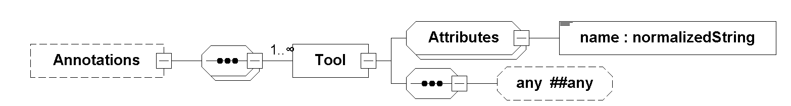

Each `Annotation` element contains a required `type` attribute, which contains the namespace for that annotation.
The content of the `Annotation` element can be arbitrary XML data, and can make use of XML namespaces and XML schemas for combined validation where appropriate.

The namespace mechanism for the `type` attribute is based on reverse domain notation:
The originator of a specification for additional data specifies a domain name under their control as the namespace for the additional data, in order to avoid conflicts due to name collisions.
All namespaces under both the `org.modelica` and `org.fmi-standard` domains are reserved for use in future layered standards.

_[For example, extensions defined by the Modelica Association might make use of the `org.modelica.fmi` namespace._
_This could lead to annotations with a `type` attribute of `org.modelica.fmi.something`, and/or extra files under the `extra/org.modelica.ssp.something` sub-directory.]_

Annotations are intended to allow structured extensions of the FMI XML files, without creating conflicting extensions, or leaving ambiguities in interpretation.
All annotations may safely be ignored by implementations that just implement the base FMI standard.

==== Model Description [[fmiModelDescription,`<fmiModelDescription>`]]

<<system_overview>> shows the root element `fmiModelDescription`.

.`fmiModelDescription` element.
[[system_overview]]
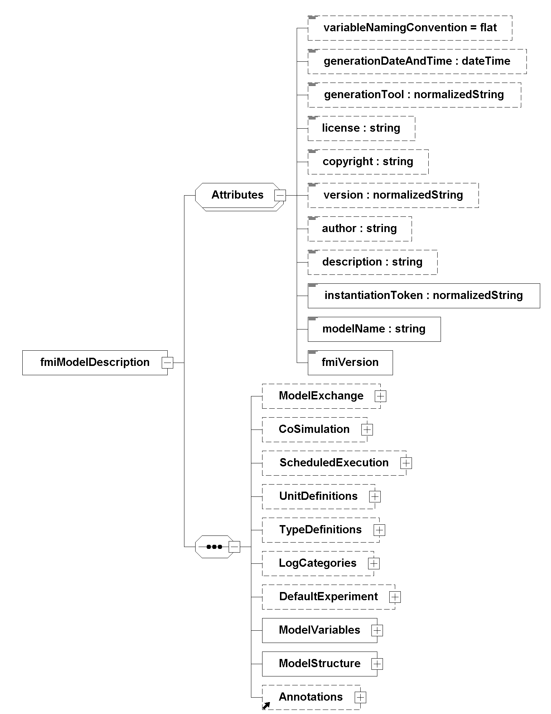

_[If an optional element is present and defines a list (such as `<UnitDefinitions>`), the list must have at least one element (such as `<Unit>`).]_

.`fmiModelDescription` element details.
[[table-schema-fmiModelDescription]]
[cols="1,3",options="header"]
|====
|Element
|Description

|`<ModelExchange>`
|If present, the FMU is based on FMI for Model Exchange (<<fmi-for-model-exchange>>).

|`<CoSimulation>`
|If present, the FMU is based on FMI for Co-Simulation (<<fmi-for-co-simulation>>).

|`<ScheduledExecution>`
|If present, the FMU is based on FMI for Scheduled Execution (<<fmi-for-scheduled-execution>>).

|`<UnitDefinitions>`
|A list of unit and display unit definitions _[for example, used to convert display units into the units used in the model equations]_.
These definitions are used in the XML element <<ModelVariables>>.

|`<TypeDefinitions>`
|A list of type definitions that are utilized in <<ModelVariables>>.

|`<LogCategories>`
|A list of log categories that can be set to define the log information that is supported from the FMU.

|`<DefaultExperiment>`
|Default settings for the importer algorithms, such as stop time and relative tolerance.

|<<ModelVariables>>
|A list of all variables of the FMU that are accessible via the FMU functions.

|<<ModelStructure>>
|Defines the structure of the model.
Especially, the ordered lists of <<output,`outputs`>>, continuous-time <<state,states>>, clocked states, initial unknowns (the unknowns during <<InitializationMode>>), and the event indicators are defined here.
Furthermore, the dependency of the unknowns from the knowns (as described in <<model-dependencies>>) can be optionally defined for <<output,`outputs`>>, continuous-time <<state,states>> and initial unknowns.

|<<Annotations>>
|Optional annotations for the top-level element.

|====

At least one element of `<ModelExchange>`, `<CoSimulation>` or `<ScheduledExecution>` must be present to identify the type of the FMU.
The details of these elements are defined in <<model-exchange-schema>>, <<co-simulation-schema>> or <<scheduled-execution-schema>>.
How to support multiple interface types within one FMU, see <<multipleInterfaceTypes>>.

The XML attributes of `<fmiModelDescription>` are:

.`fmiModelDescription` attribute details.
[[table-schema-fmiModelDescription-attributes]]
[cols="1,3",options="header"]
|====
|Attribute
|Description

|`fmiVersion`
|Version of FMI the XML file complies with.
The value for this version is `3.0`.
Future minor revisions will be denoted as `3.1`, `3.2` ...

_[During development prototype FMU implementations can indicate compliance with a certain development version based on the tags available at https://github.com/modelica/fmi-standard/tags._
_For example the value for the FMI 3.0 Alpha 2 release is `3.0-alpha.2`.]_

|`modelName`
|The name of the model as used in the modeling environment that generated the XML file, such as `Modelica.Mechanics.Rotational.Examples.CoupledClutches`.

|`instantiationToken`
|[[instantiationToken,`instantiationToken`]]The <<instantiationToken>> is a string that may be used by the FMU to check that the XML file is compatible with the implementation of the FMU.
For this purpose the importer must pass the <<instantiationToken>> from the <<modelDescription.xml>> to the <<fmi3Instantiate>> function call.

|`description`
|Optional string with a brief description of the model.

|`author`
|Optional string with the name of the model author.

|`version`
|Optional version of the model _[for example `1.0`]_.

|`copyright`
|Optional information on the intellectual property copyright for this FMU _[for example `(C) My Company 2022`]_.

|`license`
|Optional information on the intellectual property licensing for this FMU. +
_[For example `BSD license <license text or link to license>`._
_If more space is required, the folder <<license-information,`licenses`>> should be used.]_

|`generationTool`
|Optional name of the tool that generated the XML file.

|`generationDateAndTime`
|Optional date and time when the XML file was generated.
The format is a subset of `dateTime` and should be: `YYYY-MM-DDThh:mm:ssZ` (with one `T` between date and time; `Z` characterizes the Zulu time zone, in other words, Greenwich meantime) _[for example `2009-12-08T14:33:22Z`, according to ISO 8601]_.

|[[variableNamingConvention,`variableNamingConvention`]]`variableNamingConvention`
|Defines whether the variable names in <<ModelVariables>> and in `<TypeDefinitions>` follow the `flat` or `structured` convention as defined in <<namingSection>>.

|====

==== Attributes and Capability Flags [[common-capability-flags]]

The elements `<ModelExchange>`, `<CoSimulation>` and `<ScheduledExecution>` contain attributes, some representing capability flags, describing which optional functionalities the FMU supports.

Note that future FMI minor releases may add additional capability flags for optional features.
Importers must be prepared to ignore unknown capability flags.
Exporters must not generate capability flags without an XML namespace, unless specified by this standard or any later release of this standard.

The following table contains attributes and capability flags common to all three interface types.
For all Boolean attributes the default is `false`.

.Common attributes and capability flags.
[[table-common-capability-flags]]
[cols="1,1",options="header"]
|====
|Attribute
|Description

|`modelIdentifier`
|[[modelIdentifier,`modelIdentifier`]]Short class name according to C syntax, for example, `A_B_C`.
Used as prefix for FMI functions if the functions are provided in C source code or in static libraries, but not if the functions are provided by a DLL/SharedObject.
<<modelIdentifier>> is also used as name of the static library or DLL/SharedObject.
See also <<header-files-and-naming-of-functions>>.

|`needsExecutionTool`
|[[needsExecutionTool,`needsExecutionTool`]]If `true`, a tool is needed to execute the FMU.
The FMU implements the communication to this tool.
These tool dependencies must be <<documentation-directory,documented>>.
_[Typically, this information is only utilized for information purposes._
_For example, when loading an FMU with `needsExecutionTool = true`, the importer should inform the user that a tool has to be available on the computer where the FMU is instantiated.]_

|`canBeInstantiatedOnlyOncePerProcess`
|If `true`, the FMU must be instantiated only once per process.

|`canGetAndSetFMUState`
|[[canGetAndSetFMUState,`canGetAndSetFMUState`]]If `true`, the environment may inquire the internal FMU state and may restore it.
That is, functions <<fmi3GetFMUState>>, <<fmi3SetFMUState>>, and <<fmi3FreeFMUState>> are supported by the FMU.

|`canSerializeFMUState`
|[[canSerializeFMUState,`canSerializeFMUState`]]If `true`, the environment may serialize the internal FMU state, in other words, functions <<fmi3SerializedFMUStateSize>>, <<fmi3SerializeFMUState>>, <<fmi3DeserializeFMUState>> are supported by the FMU.
If `true`, the flag <<canGetAndSetFMUState>> must be `true` as well.

|`providesDirectionalDerivatives`
|[[providesDirectionalDerivatives,`providesDirectionalDerivatives`]]If `true`, the directional derivative of the equations may be retrieved using <<fmi3GetDirectionalDerivative>>.

|`providesAdjointDerivatives`
|[[providesAdjointDerivatives,`providesAdjointDerivatives`]]If `true`, the adjoint derivatives of the equations may be retrieved using <<fmi3GetAdjointDerivative>>.

|`providesPerElementDependencies`
|If `true`, the FMU is able to provide detailed dependency information at runtime using <<fmi3GetNumberOfVariableDependencies>> and <<fmi3GetVariableDependencies>>.

|`providesEvaluateDiscreteStates`
|[[providesEvaluateDiscreteStates,`providesEvaluateDiscreteStates`]]If `true`, the FMU supports <<fmi3EvaluateDiscreteStates>>.
This flag is ignored in Scheduled Execution.

|====

==== Physical Units

This section describes how units for variables can be defined.
These descriptions allow automatic unit checks and value conversion in the importer to bridge the gap between FMUs from different simulation domains.
The FMI unit descriptions are more secure than using humanly readable unit strings only, because all units can be defined as combinations of the seven SI base units.

Element `<fmiModelDescription><UnitDefinitions>` is defined as:

.`UnitDefinitions` element.
[[figure-schema-UnitDefinitions]]
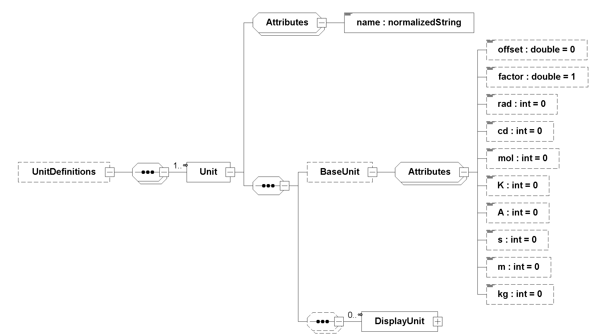

Units are referenced via its <<uniqueNameAttribute,unique>> attribute `name` by the attribute `unit` and `displayUnit` of <<table-type-details,variable types>> and <<table-type-attributes,variables>>.
The `name` of a `Unit` must be <<uniqueNameAttribute,unique>> with respect to all other `<Unit>` elements.
If a variable is associated with a `Unit`, the value passed to <<get-and-set-variable-values,`fmi3Set{VariableType}`>> (resp. retrieved with <<get-and-set-variable-values,`fmi3Get{VariableType}`>>) has this unit.
_[The purpose of the name is to uniquely identify a unit and, for example, use it to display the unit in menus or in plots._
_Since there is no standard to represent units in strings, and there are different ways how this is performed in different tools, no specific format for the string representation of the unit is required.]_

The `Unit` definition consists of the exponents of the seven SI base units `kg`, `m`, `s`, `A`, `K`, `mol`, `cd`, the exponent of the SI derived unit `rad`, and optionally a `factor` and an `offset`.
_[The additional `rad` base unit helps to handle the often occurring quantities in technical systems that depend on an angle.]_

.`BaseUnit` element.
[[figure-schema-BaseUnit]]
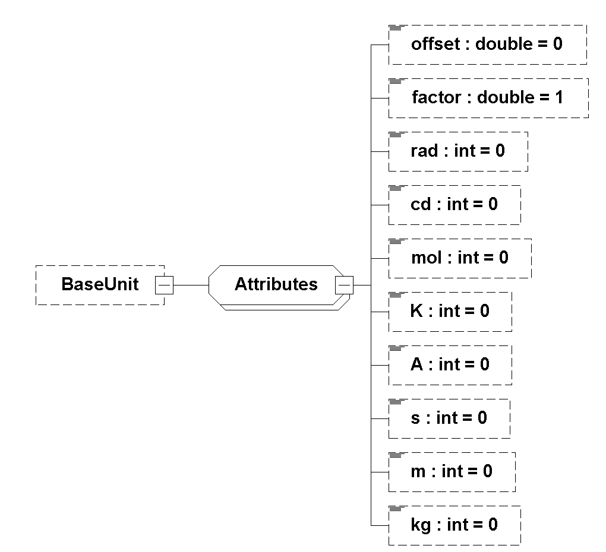

A value latexmath:[v_{\mathit{unit}}] in `Unit` is converted to the base unit latexmath:[v_{\mathit{base}}] by the equation

[latexmath]
++++
v_{\mathit{base}} = \texttt{factor} * v_{\mathit{unit}} + \texttt{if relativeQuantity then 0 else offset}
++++
where `factor` and `offset` are attributes of the `<BaseUnit>`, and  `relativeQuantity` an attribute of the `TypeDefinition` of a variable.

_[For example, if_ latexmath:[{p_{\mathit{bar}}}] _is a pressure value in unit `bar`, and_ latexmath:[{p_{\mathit{Pa}}}] _is the pressure value in `<BaseUnit>`, then_

[latexmath]
++++
{p_{\mathit{Pa}} = 10^5 p_{\mathit{bar}}}
++++

_and therefore, `factor = 1.0e5` and `offset = 0.0`._

_In the following table several unit examples are given._
_Note that if in column `exponents` the definition_ latexmath:[\frac{kg \cdot m^2}{s^2}] _is present, then the attributes of `<BaseUnit>` are  `kg=1, m=2, s=-2`._

.Unit examples.
[[table-unit-examples]]
[cols="1,1,1,1,1"]
|====
.2+h|Quantity
.2+h|Unit.name (examples)
3+h|Unit.BaseUnit

h|exponents
h|factor
h|offset

|_Torque_
|`N.m`
|latexmath:[{kg \cdot m^2 / s^2}]
|`1.0`
|`0.0`

|_Energy_
|`J`
|latexmath:[{kg \cdot m^2 / s^2}]
|`1.0`
|`0.0`

|_Pressure_
|`bar`
|latexmath:[{\frac{kg}{m \cdot s^2}}]
|`1.0e5`
|`0.0`

|_Angle_
|`deg`
|`rad`
|`0.01745329251994330 (= pi/180)`
|`0.0`

|_Angular velocity_
|`rad/s`
|`rad/s`
|`1.0`
|`0.0`

|_Angular velocity_
|`rpm`
|`rad/s`
|`0.1047197551196598 (= 2*pi/60)`
|`0.0`

|_Frequency_
|`Hz`
|`rad/s`
|`6.283185307179586 (= 2*pi)`
|`0.0`

|_Temperature_
|`&#176;F`
|`K`
|`0.5555555555555556 (= 5/9)`
|`255.3722222222222 (= 273.15-32*5/9)`

|_Percent by length_
|`%/m`
|`1/m`
|`0.01`
|`0.0`

|_Parts per million_
|`ppm`
|`1`
|`1.0e-6`
|`0.0`

|_Length_
|`km`
|`m`
|`1000`
|`0.0`

|_Length_
|`yd`
|`m`
|`0.9144`
|`0.0`
|====

_Note that `Hz` is typically used as `Unit.name` for a frequency quantity, but it can also be used as `<DisplayUnit>` for an angular velocity quantity (since `revolution/s`)._

_The `<BaseUnit>` definitions can be utilized for different purposes (the following application examples are optional and a tool may also completely ignore the `Unit` definitions):_

Unit check when connecting variables of different FMUs::
+
_When only one of <<input>> `v2` and <<output>> `v1`, connected with equation `v2 = v1`, defines a `<BaseUnit>` element, <<get-and-set-variable-values,`fmi3Get{VariableType}`>> must be used to get the value of `v1`  to then set it with <<get-and-set-variable-values,`fmi3Set{VariableType}`>> for `v2`._
+
_When two variables v1 and v2 are connected and for both of them `<BaseUnit>` elements are defined, then they must have identical exponents of their `<BaseUnit>`._
_If `factor` and `offset` are also identical, again the connection equation `v2 = v1` holds._
_If `factor` and `offset` are not identical, the tool may either trigger an error or, if supported, perform a conversion; in other words, use the connection equation (in this case the `relativeQuantity` of the `<TypeDefinition>`, see below, has to be taken into account in order to determine whether `offset` shall or shall not be utilized):_
+
`factor(v1) * v1 + (if relativeQuantity(v1) then 0 else offset(v1)) = factor(v2) * v2 + (if relativeQuantity(v2) then 0 else offset(v2))` +
_where_ `relativeQuantity(v1) = relativeQuantity(v2)` _is required_.
+
_As a result, wrong connections can be detected (for example, connecting a force with an angle-based variable would trigger an error) and conversions between, say, US and SI units can be either automatically performed or, if not supported, an error is triggered as well._
+
_This approach is not satisfactory for variables belonging to different quantities that have, however, the same `<BaseUnit>`, such as quantities `Energy` and `Torque`, or `AngularVelocity` and `Frequency`._
_To handle such cases, quantity definitions have to be taken into account (see `<TypeDefinitions>`) and quantity names need to be standardized._
+
_This approach allows a general treatment of units, without being forced to standardize the grammar and allowed values for units (for example, in FMI 1.0, a unit could be defined as `N.m` in one FMU and as `N*m` in another FMU, and a tool would have to reject a connection, since the units are not identical._
_In FMI 2.0, the connection would be accepted, provided both elements have the same `<BaseUnit>` definition)._

Dimensional analysis of equations::
+
_In order to check the validity of equations in a modeling language, the defined units can be used for dimensional analysis, by using the `<BaseUnit>` definition of the respective unit._
_For this purpose, the `<BaseUnit>` `rad` has to be treated as `1`._
_Example:_
+
[latexmath]
++++
\begin{align*}
J \cdot \alpha = \tau \rightarrow [kg.m^2]*[rad/s^2] = [kg.m^2/s^2] & \quad \text{// o.k. ("rad" is treated as "1")} \\
J \cdot \alpha = f \rightarrow [kg.m^2]*[rad/s^2] = [kg.m/s^2] & \quad \text{// error, since dimensions do not agree}
\end{align*}
++++

Unit propagation::
+
_If unit definitions are missing for variables, they might be deduced from the equations where the variables are used._
_If no unit computation is needed, `rad` is propagated._
_If a unit computation is needed and one of the involved units has `rad` as a `<BaseUnit>`, then unit propagation is not possible._
_Examples:_
+
- _a = b + c, and `Unit` of c is provided, but not `Unit` of a and b:_ +
_The Unit definition of `c` (in other words, `Unit.name`, `<BaseUnit>`, `<DisplayUnit>`) is also used for `a` and `b`._
_For example, if BaseUnit(c) = `rad/s`, then BaseUnit(a) = BaseUnit(b) = `rad/s`._
+
- _a = b*c, and `Unit` of a and of c is provided, but not `Unit` of b:_ +
_If `rad` is either part of the `<BaseUnit>` of `a` and/or of `c`, then the `<BaseUnit>` of `b` cannot be deduced (otherwise it can be deduced)._
_Example: If `BaseUnit(a) = kg.m/s2` and `BaseUnit(c) = m/s2`, then the `BaseUnit(b)` can be deduced to be `kg`._
_In such a case `Unit.name` of b cannot be deduced from the `Unit.name` of `a` and `c`, and a tool would typically construct the `Unit.name` of `b` from the deduced `<BaseUnit>`.]_

A `<Unit>` can contain any number of `<DisplayUnit>` elements.

.DisplayUnit element.
[[figure-schema-DisplayUnit]]
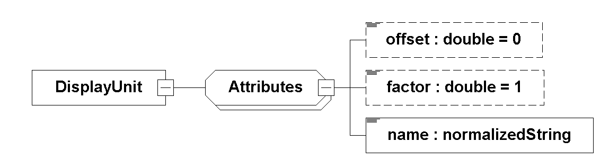

A `<DisplayUnit>` is defined by `name`, `factor`, `offset`, and `inverse`.
The attribute `name` must be unique with respect to all other names of the `<DisplayUnit>` definitions of the same `Unit`.
_[Different `Unit` elements may have the same `<DisplayUnit>` names]._ +
`inverse = true` is only allowed if `offset = 0`. +
_[Reason: no use case is known for the combination of inverse and offset, which would also be more complicated.]_

A value latexmath:[v_{\mathit{unit}}] in `Unit` is converted to a value latexmath:[v_{\mathit{display}}] in `DisplayUnit` by the equation:

[latexmath]
++++
v_{\mathit{display}} =
\left\{\begin{array}{ll}
\texttt{factor} *          v_{\mathit{unit}}  + \texttt{offset} &\text{if} \; \texttt{inverse = false} \\
\texttt{factor} * \frac{1}{v_{\mathit{unit}}}  &\text{if} \; \texttt{inverse = true}
\end{array}\right.
++++

_[`offset` is needed for temperature units like `F` (Fahrenheit), `inverse` for inverse display units like `mpg` (miles per gallon) or `S` (Siemens)._

_For example, if latexmath:[{T_K}] is the temperature value of `Unit.name` (in `K`) and latexmath:[{T_F}] is the temperature value of `<DisplayUnit>` (in `&#176;F`), then_

[latexmath]
++++
T_F = (9/5) * (T_K - 273.15) + 32
++++

_and therefore, `factor = 1.8 (=9/5)` and `offset = -459.67 (= 32 - 273.15*9/5)`._

_Both the `DisplayUnit.name` definitions as well as the `Unit.name` definitions are used in the variable elements._

_Example of a definition:_

[source, xml]
----
include::examples/unit_definition.xml[tags=UnitDefinitions]
----
_]_

==== Variable Types [[definition-of-types]]

Element `<fmiModelDescription><TypeDefinitions>` is defined as:

.TypeDefinitions element.
[[figure-schema-TypeDefinitions]]
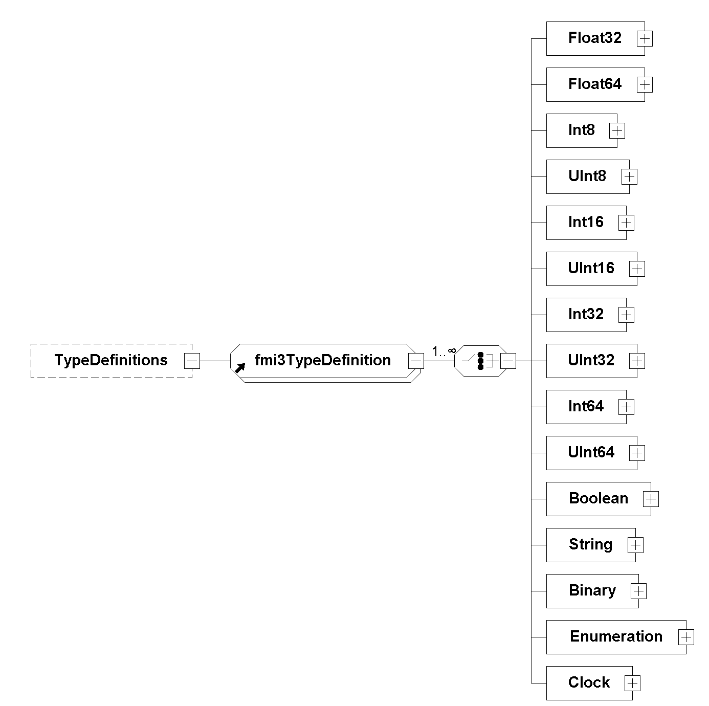

This element consists of a set of `<TypeDefinition>` elements according to schema `fmi3TypeDefinition` in file `fmi3Type.xsd`.

Each variable type has its own set of attributes.
<<figure-schema-Float64Type>>, <<figure-schema-Int32Type>>, <<figure-schema-BooleanType>>, <<figure-schema-BinaryType>>, <<figure-schema-EnumerationType>>, and <<figure-schema-ClockType>> are representative examples.

.Float64Type element.
[[figure-schema-Float64Type]]
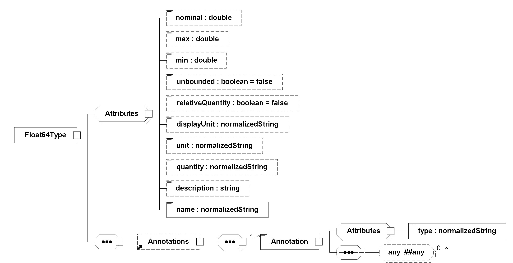

.Int32Type element.
[[figure-schema-Int32Type]]
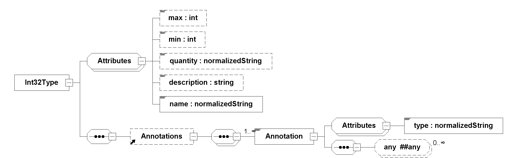

.BooleanType element.
[[figure-schema-BooleanType]]
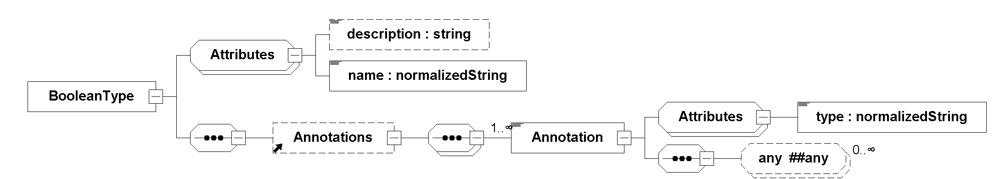

.BinaryType element.
[[figure-schema-BinaryType]]
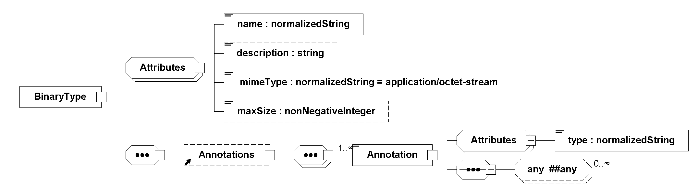

.EnumerationType element.
[[figure-schema-EnumerationType]]
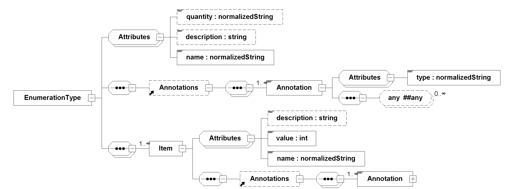

.ClockType element.
[[figure-schema-ClockType]]
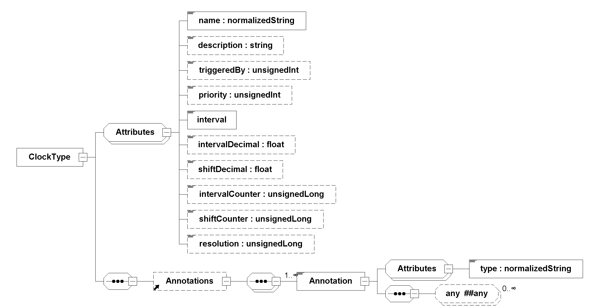

The `<TypeDefinition>` elements are referred to in variable elements to declare their type.
_[The alternative would be to define a type per variable._
_However, this would lead to a situation where, e.g., the definition of a `Torque` type would have to be repeated over and over.]_
The attributes and elements have the following meaning:

.Type element and attribute details.
[[table-type-details]]
[cols="1,5",options="header"]
|====
|Attribute or Element
|Description

|`name`
|The <<uniqueNameAttribute,unique>> name of the variable type referenced using the attribute <<table-type-attributes,`declaredType`>>.
This attribute must be different to all `name` attributes of variables _[if the same names would be used, then this would nearly always give problems when importing the FMU in an environment using the Modelica language, where a type name cannot be used as instance name]_.

|`description`
|An optional description string describing the meaning of the variable type.

|`quantity`
|Physical quantity of the variable.
_[For example, `Angle`, or `Energy`._
_The quantity names are not standardized.]_

|`unit`
|Unit of the variable referencing to a `<UnitDefinitions><Unit>` with the same `name`, which must exist.
Type definitions without unit must not have a `unit` attribute.

|`displayUnit`
|[[displayUnit,`displayUnit`]]Default display unit of the variable referencing to a `<DisplayUnit>` which must exist under `<UnitDefinitions><Unit>` with the `name` of `unit`.
The conversion to the `unit` is defined with the element `<fmiModelDescription><UnitDefinitions><Unit><DisplayUnit>`.
If `displayUnit` is defined a `unit` must also be defined.

|`mimeType`
|[[mimeType,`mimeType`]]Indicates the type of data passed as a binary.
Defaults to `application/octet-stream`, which is unspecific.
Implementations may use this information to provide guidance about valid/useful connections.

|`maxSize`
|Indicates the maximum size (bytes) of the data passed as a binary.

|`relativeQuantity`
|If this attribute is `true`, then the `offset` of `BaseUnit` and `displayUnit` must be ignored.
_[For example, 10 degree Celsius = 10 Kelvin if `relativeQuantity = true` and not 283.15 Kelvin.]_

|`min`
|[[min,`min`]]Minimum value of variable (variable value latexmath:[\geq] `min`).
If not defined, the minimum is the largest negative number that can be represented on the machine for that `<TypeDefinition>`.
The `min` defines the region in which the FMU is designed to operate (see <<min-max-violations>>).
_[If, for example, an `<Enumeration>` is defined with `name1 = -4`, `name2 = 1`, `name3 = 5`, `name4 = 11` and `min = -2`, `max = 5`, then only `name2` and `name3` are allowed.]_

|`max`
|[[max,`max`]]Maximum value of variable (variable value latexmath:[\leq] `max`).
If not defined, the maximum is the largest positive number that can be represented on the machine for that `<TypeDefinition>`.
The `max` defines the region in which the FMU is designed to operate (see <<min-max-violations>>).
_[If, for example, an `<Enumeration>` is defined with `name1 = -4`, `name2 = 1`, `name3 = 5`, `name4 = 11` and `min = -2`, `max = 5`, then only `name2` and `name3` are allowed.]_

|`nominal`
|Nominal value of variable.
If not defined and no other information about the nominal value is available, then `nominal = 1` is assumed.
For array variables, this nominal value applies to all elements of the array. +
_[The nominal value of a variable can be, for example, used to determine the absolute tolerance for this variable as needed by numerical algorithms:_ +
`absoluteTolerance = nominal * tolerance * 0.01` +
_where `tolerance` is, for example, the relative tolerance defined in <<DefaultExperiment>>.]_

|`unbounded`
|If `true`, indicates that during time integration, the variable gets a value much larger than its nominal value `nominal`.
_[Typical examples are the monotonically increasing rotation angles of crank shafts and the longitudinal position of a vehicle along the track in long distance simulations._
_This information can, for example, be used to increase numerical stability and accuracy by setting the corresponding bound for the relative error to zero (relative tolerance = 0.0), if the corresponding variable is a continuous <<state>> variable.]_

|`Item`
|An `<EnumerationType>` must have a non-empty sequence of `<Item>` elements with attributes `name` and `value`.
`name` and `value` must be unique within the same `<EnumerationType>`.

2+|Attributes for `ClockType`

|`canBeDeactivated`
|[[canBeDeactivated,`canBeDeactivated`]]
<<Clock,`Clocks`>> with the attribute <<canBeDeactivated,`canBeDeactivated = true`>> may be actively deactivated using <<fmi3SetClockEM>>.

|`priority`
|[[priority,`priority`]]
This attribute is mandatory for input <<Clock,`Clocks`>> in Scheduled Execution.
For Co-Simulation and Model Exchange, this attribute must be ignored _[i.e. if present in <<multipleInterfaceTypes,mixed interface FMUs>>]_.
Output <<Clock,`Clocks`>> must not have this attribute.
Smaller values signal higher priorities.
<<Clock,`Clocks`>> that have to be activated at the same time instant are ordered according to this attribute.
For multiple <<Clock,`Clocks`>> with the same priority the order is undefined.

|`intervalVariability`
|
[[intervalVariability,`intervalVariability`]]
The attribute `intervalVariability` declares the Clock type, see <<table-overview-clocks>>.

2+|The values of the following float and integer attributes refer to the unit of the <<independent>> variable.

|`intervalDecimal`
|
[[intervalDecimal,`intervalDecimal`]]
This attribute defines the time interval latexmath:[T_{\mathit{interval}}] between consecutive <<Clock>> ticks.
This value must be greater than 0.0.
This attribute is required if Clock type is <<constant-clock,`constant`>>, <<fixed-clock,`fixed`>> or <<tunable-clock,`tunable`>> <<periodic-clock,periodic Clocks>>.
It must not be used otherwise.

|`shiftDecimal`
|
[[shiftDecimal,`shiftDecimal`]]
This attribute defines the delay of the first clock activation relative to latexmath:[t_{\mathit{start}}] (<<startTime>>).
This attribute requires that <<intervalDecimal,`intervalDecimal`>> is present.
The value of this attribute value must be equal to or greater than 0.0.
Default value is 0.0.

|`supportsFraction`
|
[[supportsFraction,`supportsFraction`]]
This attribute defines, if the functions `fmi3GetXXXFraction` and `fmi3SetIntervalFraction` are allowed to be called for all <<time-based-clock,time-based Clocks>>.

|`resolution`
|[[resolution, `resolution`]]Instead of defining clock timing using floating point numbers, FMI allows the definition of rational numbers using <<intervalCounter>> and <<shiftCounter>>.
The `resolution` defines the minimal quanta clock timing can be resolved by.
This attribute is required for <<periodic-clock,time-based periodic clocks>> if <<supportsFraction,`supportsFraction = true`>> and <<intervalCounter>> is present.
This attribute must only be used for <<periodic-clock,periodic Clocks>>.

|`intervalCounter`
|[[intervalCounter,`intervalCounter`]]This attribute defines (together with <<resolution>>) the interval between consecutive clock ticks:

latexmath:[T_{\mathit{interval}} = ] `intervalCounter / resolution`.

<<intervalCounter>> and <<resolution>> have no default value.
If present the value of this attribute must be greater than 0.
This attribute may be present if <<supportsFraction,`supportsFraction = true`>> and Clock type is <<constant-clock,`constant`>>, <<fixed-clock,`fixed`>> or <<tunable-clock,`tunable`>> <<periodic-clock,periodic Clocks>>.
It must not be used otherwise.

|`shiftCounter`
|[[shiftCounter,`shiftCounter`]]This value defines (together with <<resolution>>) the delay of the first clock activation relative to latexmath:[t_{\mathit{start}}] (<<startTime>>):

latexmath:[T_{\mathit{shift}} = ] `shiftCounter / resolution`.

This attribute requires that <<intervalCounter,`intervalCounter`>> is present.
The value of this attribute value must be equal to or greater than `0`.
Default value is `0`.

|====

==== Log Categories [[definition-of-log-categories]]

Element `<fmiModelDescription><LogCategories>` is defined as:

.LogCategories element.
[[figure-schema-LogCategories]]
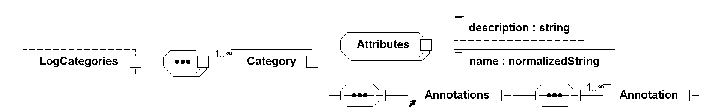

`<LogCategories>` defines an unordered set of category strings that classify output of the callback function <<logMessage>>.
The importer may use the function <<fmi3SetDebugLogging>> to control for which `<LogCategories>` the callback function <<logMessage>> is allowed to be called.
The `name` attribute of `<Category>` must be <<uniqueNameAttribute,unique>> with respect to all other elements of the `<LogCategories>` list.

<<table-standard-categories>> shows the standardized values for `name` of `<Category>`.
These names should be used if a tool supports the corresponding log category.
If an FMU supports one of these log categories, then an element `<Category>` with this `name` must be added to `<LogCategories>`.
Any other FMU specific `<LogCategories>` may be defined.

.Standard `name` definitions for `<Category>`.
[[table-standard-categories]]
[cols="1,3",options="header"]
|====
|Category
|Description

|`logEvents`
|Log all events (during initialization and simulation).

|`logSingularLinearSystems`
|Log the solution of linear systems of equations if the solution is singular (and the tool picked one solution of the infinitely many solutions).

|`logNonlinearSystems`
|Log the solution of nonlinear systems of equations.

|`logDynamicStateSelection`
|Log the dynamic selection of <<state,states>>.

|`logStatusWarning`
|Log messages when returning <<fmi3Warning>> status from any function.

|`logStatusDiscard`
|Log messages when returning <<fmi3Discard>> status from any function.

|`logStatusError`
|Log messages when returning <<fmi3Error>> status from any function.

|`logStatusFatal`
|Log messages when returning <<fmi3Fatal>> status from any function.
|====

The optional attribute `description` shall contain a description of the respective log category.

_[Typically, this string can be shown by a tool if more details for a log category are presented._
_This approach to define `<LogCategories>` has the following advantages:_

* _An importer may present the possible log categories in a menu and the user can select the desired one._ +

* _The log output is drastically reduced, because via <<fmi3SetDebugLogging>> the categories are set that shall be logged and therefore the FMU will print only the messages with the corresponding categories to the <<logMessage>> function._

_Note that since element `<LogCategories>` is optional, an FMU does not need to expose its log categories.]_

==== Default Experiment [[DefaultExperiment]]

Element `<fmiModelDescription><DefaultExperiment>` is defined as:

.DefaultExperiment element.
[[figure-schema-DefaultExperiment]]
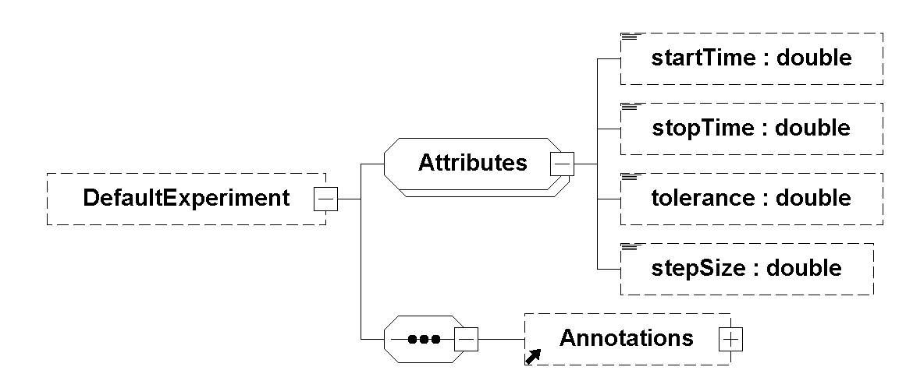

[[stepSize,`stepSize`]]`<DefaultExperiment>` consists of the optional default start time, stop time, relative tolerance, and step size for a simulation run.
A tool may ignore this information. +
_[However, it is convenient for a user that <<startTime>>, <<stopTime>>, <<tolerance>> and <<stepSize>> have already a meaningful default value for the model at hand.]_ +
<<startTime>>, <<stopTime>> and <<stepSize>> refer to the unit of the <<independent>> variable.
<<stepSize>> defines the preferred <<communicationStepSize>> for Co-Simulation.
For Model Exchange and Scheduled Execution <<stepSize>> has no defined meaning.

[[ModelVariables,`<ModelVariables>`]]
==== Model Variables

===== Static information

The element of `<fmiModelDescription><ModelVariables>` is the central part of the <<modelDescription.xml>>.
It provides the static information of all exposed variables and is defined as follows:

.ModelVariables element.
[[figure-schema-ModelVariables]]
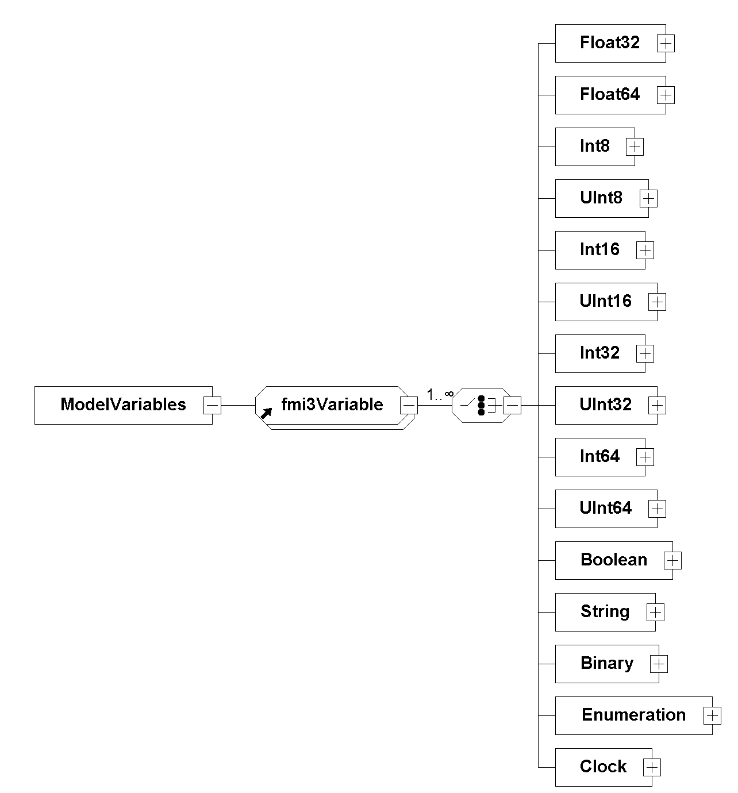

The <<ModelVariables>> element consists of an arbitrary number of `<fmi3Variable>` elements (see <<figure-schema-ModelVariables>>).
`<fmi3Variable>` elements represent scalars or arrays of an arbitrary (but fixed) number of dimensions for variables of different types, like single-precision floating point, string or binary.
The schema definition is present in a separate file `fmi3Variable.xsd`.

[[Dimension,`<Dimension>`]]
===== Array variables and structural parameters

Except for Clocks, variable elements can represent an array variable.
Variable elements representing array variables must contain at least one <<Dimension>> element.
Each <<Dimension>> element specifies the size of one dimension of the array:

- If the <<start>> attribute of the <<Dimension>> element is present, it defines a constant unsigned 64-bit integer size for this dimension.
The <<variability>> of the dimension size is <<constant>> in this case.

- If the <<valueReference>> attribute of the <<Dimension>> element is present, it defines the size of this dimension to be the value of the variable with the value reference given by the <<valueReference>> attribute.
The referenced variable must be a variable of type `<UInt64>`, and must either be a constant (i.e. with <<variability>> = <<constant>>) or a <<structuralParameter,`structural parameter`>> (i.e. with <<causality>> = <<structuralParameter>>).
The <<variability>> of the dimension size is in this case the <<variability>> of the referenced variable.
A <<structuralParameter,`structural parameter`>> must be a variable of type `<UInt64>` only if it is referenced in <<Dimension>>.

These two options are mutually exclusive, i.e., for each <<Dimension>> element either a <<start>> attribute or a <<valueReference>> attribute can be supplied, but not both.
However different <<Dimension>> sizes for the same variable may be specified using different mechanisms by having different <<variability>> attributes.

All initial dimension sizes (defined by <<start>> values either directly or indirectly in the <<fmiModelDescription>>) must be positive integers (i.e. not zero), so that no dimension is initially vanished.

_[This allows importers to ignore <<structuralParameter,`structural parameters`>> because their <<start>> values reflect the internal default settings of <<structuralParameter,`structural parameters`>>._
_If we allowed 0 dimension sizes for initial values, tools that do not even care about changing dimension sizes would need to be able to handle vanishing arrays.]_

_[Example:_
_The variable `V` is a floating point vector parameter._
_The length of the vector depends on the <<structuralParameter,`structural parameter`>> `len`, connected via the `valueReference = "100"`._
_The default length of the vector is 7._
_This length can be changed in <<ConfigurationMode>> because the <<variability>> of the <<structuralParameter,`structural parameter`>> `len` is <<fixed>>._
_The values of `V` can be changed whenever <<tunable>> parameters can be changed._

[source, xml]
----
include::examples/structural_parameter_example.xml[tags=structuralParameter]
----

_]_

Changes to dimension sizes are constrained by the `min`/`max` attributes of the referenced <<structuralParameter,`structural parameters`>>, which can be any non-negative integer, including zero.
Specifying a minimum size of zero on a <<structuralParameter,`structural parameter`>> allows any related dimension sizes to be changed to zero in <<ConfigurationMode>> or <<ReconfigurationMode>>, thus causing the respective array size to go to zero, which leaves the respective array variable without any active elements.

The actual dimension sizes of arrays are also constrained by the importer, due to memory and addressing constraints:
Since the API functions to access variables and their values are constrained to `size_t` individual elements, platforms with addresses of less than 64-bit width will not be able to access elements beyond their addressing limits, neither will they be able to allocate enough memory or address space to represent such arrays.
For these reasons implementations must take platform-specific constraints into account when changing dimension sizes, and must be prepared to handle the inability of the FMU to adjust to the desired sizes during <<ConfigurationMode>> or <<ReconfigurationMode>>.

Changing any dimension of a variable in <<ConfigurationMode>> or <<ReconfigurationMode>> invalidates the variable's current value (including its <<start>> value).
Changing one <<structuralParameter,`structural parameter`>> might affect dimension sizes of several variables.

===== Alias variables

[[alias,`alias`]]
A variable can have any number of `<Alias>` elements that define a variable alias.
Each variable alias has a required attribute `name` whose value must be unique among all variables and variable aliases, and an optional attribute `description`.
Variable aliases of floating point variables may additionally have a <<displayUnit>> that follows the same rules as for variables.

_[ Example:_

[source, xml]
----
include::examples/alias_example.xml[tags=VariableAliases]
----
_]_

===== Variable Attributes

The common attributes of variables are shown in <<figure-schema-fmi3ArrayableVariable>>.

.fmi3ArrayableVariable element.
[[figure-schema-fmi3ArrayableVariable]]
image::images/schema/fmi3ArrayableVariable.png[width=80%, align="center"]

.fmi3ArrayableVariable attribute details.
[[table-variableBase-attributes]]
[cols="1,5a",options="header"]
|====
|Attribute
|Description

|`name`
|The <<uniqueNameAttribute,unique>> name of the variable.
This attribute may follow a defined <<namingSection, naming convention>>.

|`valueReference`
|
[[valueReference,`valueReference`]]
A handle of the variable to identify the variable value in the C-API functions and for references within the <<modelDescription.xml>>.
The `valueReference` must be unique for all variables of an FMU.

|`description`
|An optional description string describing the meaning of the variable.

|`causality`
|
[[causality,`causality`]]
Enumeration that defines the causality of the variable.
Allowed combinations of <<causality>> and <<variability>> and their semantics are defined in <<table-allowed-variability-causality-combinations>>.

Values of this enumeration are:

[[parameter,`parameter`]]
`= parameter`: A data value that is provided by the importer or user to change the behavior of the FMU.
It is constant during the simulation (except for <<tunable>> parameters) and should not be used in connections, except for parameter propagation in terminals as described in <<GeneralRemarkOnSignal>>.
These parameters can be changed independently, unlike <<calculatedParameter,calculated parameters>>.

[[calculatedParameter,`calculatedParameter`]]
`= calculatedParameter`: A data value that is constant during the simulation and is computed during initialization or when <<tunable>> <<parameter,`parameters`>> change.

[[input,`input`]]
`= input`: The variable value may be provided by the importer. +
_[For example, the importer could forward the output of another FMU into this input.]_

[[output,`output`]]
`= output`: The variable value may be used by the importer. +
_[For example, this value can be forwarded to an input of another FMU.]_ +
The algebraic relationships to the <<input,`inputs`>> may be defined via the <<dependencies>> attribute of <<Output,`<fmiModelDescription><ModelStructure><Output>`>>.

[[local,`local`]]
`= local`: Local variables are: +

* continuous <<state,states>>.
These variables are referenced by the <<derivative>> attribute of a <<ContinuousStateDerivative>>.
* <<ContinuousStateDerivative,`ContinuousStateDerivatives`>>, <<ClockedState,`ClockedStates`>>, <<EventIndicator,`EventIndicators`>> or <<InitialUnknown,`InitialUnknowns`>>.
These variables are listed in the <<ModelStructure>>. +
* [[localClock,`local clock`]] internal, intermediate variables or local clocks which may be read for debugging purposes and are not listed in the <<ModelStructure>>.

Setting of local variables: +

* See <<InitializationMode>> and <<Instantiated>> for restrictions.

* In super state <<Initialized>>, <<get-and-set-variable-values,`fmi3Set{VariableType}`>> must not be called on any of the local variables.
Only in Model Exchange, continuous <<state,states>> can be set with <<fmi3SetContinuousStates>>.

Local variable values must not be used as input to another model or FMU.

[[independent,`independent`]]
`= independent`: The independent variable (usually `time` _[but could also be, for example, `angle`]_).
All variables are a function of this <<independent>> variable.
Exactly one variable of an FMU must be defined as <<independent>>.
If the unit for the independent variable is not defined, it is implicitly `s` (seconds).
The independent variable must be defined as a floating point type without a <<start>> attribute.
It is not allowed to call function <<get-and-set-variable-values,`fmi3Set{VariableType}`>> on an <<independent>> variable.
See <<advancing-time>> for how the independent variable is set.
The actual value may be inquired with <<get-and-set-variable-values,`fmi3Get{VariableType}`>>.

[[structuralParameter,`structuralParameter`]]
`= structuralParameter`: The variable value can only be changed in <<ConfigurationMode>> or <<ReconfigurationMode>>.
The <<start>> attribute is mandatory.
A <<structuralParameter,`structural parameter`>> must not have a <<Dimension>> element.
A <<structuralParameter,`structural parameter`>> may be referenced in <<Dimension>> elements.
If a <<structuralParameter,`structural parameter`>> is referenced in <<Dimension>> elements, it must be of type `<UInt64>` and its <<start>> attribute must be larger than 0.
The `min` attribute might still be 0.

The default of <<causality>> is <<local>>. +
A continuous-time <<state>> or an event indicator must have <<causality>> = <<local>> or <<output>>, see also <<ModelStructure>>.

The causality of variables of type <<Clock>> must be either <<input>>, <<output>> or <<local>>. +
For Clocks the <<causality>> indicates the information flow of the activation of the Clock. +
Only for triggered Clocks, the <<causality>> also indicates the information flow of the timing.

|`variability`
|
[[variability,`variability`]]
Enumeration that defines the time dependency of the variable, in other words, it defines the time instants when a variable may be changed by the importer or may change its value due to FMU internal computations, depending on their <<causality>>.

_[For example, <<discrete>> variables change their values only at event instants (ME) or at communication points (CS and SE) and it is therefore only necessary to inquire them with <<get-and-set-variable-values,`fmi3Get{VariableType}`>> them at these points in time.]_

Allowed combinations of <<causality>> and <<variability>> and their semantics are defined in <<table-allowed-variability-causality-combinations>>.

Values of this enumeration are:

[[constant,`constant`]]
`= constant`: The value of the variable never changes.

[[fixed,`fixed`]]
`= fixed`: The value of the variable is fixed in super state <<Initialized>>, in other words, after <<fmi3ExitInitializationMode>> was called the variable value does not change anymore.
The default for variables of causality `parameter`, `structural parameter` or `calculated parameter` is `fixed`.

[[tunable,`tunable`]]
`= tunable`: The value of the variable is constant between events (ME and CS if <<EventMode>> is supported) and between communication points (CS and SE).
A <<parameter>> with <<variability>> = <<tunable>> may be changed only in <<EventMode>> or, if <<EventMode>> is not supported, at communication points (CS and SE).

[[discrete,`discrete`]]
`= discrete`:

 * Model Exchange: The value of the variable may change only in <<EventMode>>.
 * Co-Simulation: If <<EventMode>> is used (see <<eventModeUsed>>), the value of the variable may only change in <<EventMode>>.
If <<EventMode>> is not used, the value may change at communication points and the FMU must detect and handle such events internally.
During <<IntermediateUpdateMode>>, <<discrete>> variables are not allowed to change.
 * Scheduled Execution: The value may change only at communication points.

The <<variability>> of <<Clock,Clocks>> must be <<discrete>>.
The <<variability>> of <<clocked-variable,`clocked variables`>> must be <<discrete>> or <<tunable>>.
The default for variables of causality `input`, `output` or `local` of type other than `Float32` or `Float64` is <<discrete>>.

[[continuous,`continuous`]]
`= continuous`: Only variables of type `Float32` or `Float64` may be <<continuous>>.
The default for variables of type `Float32` and `Float64` and causality other than <<parameter>>, <<structuralParameter>> or <<calculatedParameter>> is <<continuous>>.
Variables with <<variability>> `continuous` may change in <<InitializationMode>> and in super state <<Initialized>>.

For more explanations on value changes see <<smoothness>>.

|`canHandleMultipleSetPerTimeInstant`
|
[[canHandleMultipleSetPerTimeInstant,`canHandleMultipleSetPerTimeInstant`]]
Only for variables with <<causality>> = <<input>>. +
The default value is `true`.
If `canHandleMultipleSetPerTimeInstant = false`, then only one <<get-and-set-variable-values,`fmi3Set{VariableType}`>> call is allowed for this variable per super-dense time instant in <<EventMode>>.

_[This flag can be set to `false` for variables where discrete-time states are directly updated when assigned (_ latexmath:[\mathbf{x}_{d} := f(\mathbf{x}_{d},\mathbf{u}_{c+d})] _instead of_ latexmath:[\mathbf{x}_{d} := f({}^\bullet\mathbf{x}_{d},\mathbf{u}_{c+d})] _)._
_If an <<output>> depends on this <<input>> and on discrete-time states, then an algebraic loop could be formed with such an <<input>>._
_Such loops cannot be solved iteratively because of the limitation on <<get-and-set-variable-values,`fmi3Set{VariableType}`>>._
_Therefore, such an <<input>> should not appear in an algebraic loop.]_

|`intermediateUpdate`
|
[[intermediateUpdate,`intermediateUpdate`]]
If this boolean attribute is `true`, the variable can be accessed in <<IntermediateUpdateMode>>.
Only continuous-time variables can have <<intermediateUpdate,`intermediateUpdate = true`>>.
The default value of this attribute is `false`.

Variables of type <<Clock>> must not have the <<intermediateUpdate>> attribute.

This attribute is ignored in Model Exchange and Scheduled Execution.

|`previous`
a|
[[previous,`previous`]]
If present, this variable is a <<ClockedState>> and this attribute contains the value reference of the variable with the previous value.
The following constraints apply:

* Only clocked variables (i.e. variables with the attribute <<clocks>>) may have the <<previous>> attribute.
* Only variables with <<variability,`variability = discrete`>> may have the <<previous>> attribute.
* Variables of type <<Clock>> must not have the <<previous>> attribute.
* Two variables must not have the same <<previous>> attribute reference.
* A variable must not refer to itself in the <<previous>> attribute.
* The variable referenced by the <<previous>> attribute must have the same numeric type, <<variability,`variability = discrete`>>, and must not have <<causality,`causality = input`>>.

_[For example, if `previous = 3` for variable `8`, then variable `3` is the previous value of variable `8`._
_See also <<fmi3UpdateDiscreteStates>>._
_Note: This is reverse compared to the <<derivative>> attribute.]_

|`clocks`
|
[[clocks,`clocks`]]
If present, this variable is clocked.
The value of the attribute <<clocks>> is a non-empty list of value references of <<Clock,Clocks>> this variable belongs to.
Only variables with <<variability,`variability = discrete`>> or <<variability,`variability = tunable`>> can have this attribute.
_[Some importers might require a variable to be dependent on a single Clock for technical reasons._
_They could reject FMUs violating this restriction._
_Note: It is not further restricted, which variables can be clocked to not restrict currently unknown use cases._
_For example, an <<input>> Clock could be a clocked variable of another (<<input>> or <<output>>) clock to indicate that it can only be activated when that Clock is active.]_

|====

<<table-allowed-variability-causality-combinations>> shows the combinations of <<variability>>/<<causality>> settings that are allowed.

.Allowed combinations of <<variability>>/<<causality>>.
[[table-allowed-variability-causality-combinations]]
[cols="1,1,1,1,1,1,1,1"]
|====
.2+h|<<variability>>
7+^h|<<causality>>

^|<<structuralParameter,`structural Parameter`>>
^|<<parameter>>
^|<<calculatedParameter,`calculated Parameter`>>
^|<<input>>
^|<<output>>
^|<<local>>
^|<<independent>>

^|<<constant>>
^|-- (a)
^|-- (a)
^|-- (a)
^|-- (a)
^|(7)
^|(10)
^|-- (c)

^|<<fixed>>
^|(16)
^|(1)
^|(3)
^|-- (d)
^|-- (e)
^|(11)
^|-- (c)

^|<<tunable>>
^|(17)
^|(2)
^|(4)
^|-- (d)
^|-- (e)
^|(12)
^|-- (c)

^|<<discrete>>
^|-- (b)
^|-- (b)
^|-- (b)
^|(5)
^|(8)
^|(13)
^|-- (c)

^|<<continuous>>
^|-- (b)
^|-- (b)
^|-- (b)
^|(6)
^|(9)
^|(14)
^|(15)
|====

_[Discussion of the combinations that are not allowed:_

.Combinations of variability and causality that are not allowed and why.
[[table-Combinations-not-allowed]]
[cols="1,10", options="header"]
|====
|
|_Explanation why this combination is not allowed_

^|_(a)_
|_The combinations <<constant>> / <<structuralParameter>>, <<constant>> / <<parameter>>, <<constant>> / <<calculatedParameter>> and <<constant>> / <<input>> do not make sense, since <<parameter,`parameters`>> and <<input,`inputs`>> are set by the importer, whereas <<constant>> variables have an unchangeable value._

^|_(b)_
|_The combinations <<discrete>> / <<structuralParameter>>, <<discrete>> / <<parameter>>, <<discrete>> / <<calculatedParameter>>, <<continuous>> / <<structuralParameter>>, <<continuous>> / <<parameter>> and <<continuous>> / <<calculatedParameter>> do not make sense, since <<causality>> = <<structuralParameter>>, <<causality>> = <<parameter>> and <<causality>> = <<calculatedParameter>> define variables that do not depend on time, whereas <<discrete>> and <<continuous>> define variables where the values can change during simulation._

^|_(c)_
|_For an <<independent>> variable only <<variability>> = <<continuous>> makes sense._

^|_(d)_
|_A <<fixed>> or <<tunable>> <<input>> has exactly the same properties as a <<fixed>> or <<tunable>> <<parameter>>._
_For simplicity, only <<fixed>> and <<tunable>> <<parameter,`parameters`>> are allowed._

^|_(e)_
|_A <<fixed>> or <<tunable>> <<output>> has exactly the same properties as a <<fixed>> or <<tunable>> <<calculatedParameter>>._
_For simplicity, only <<fixed>> and <<tunable>> <<calculatedParameter,`calculatedParameters`>> are allowed._
|====

_Discussion of the combinations that are allowed_:

.Combinations of variability and causality that are allowed and why.
[[table-Combinations-allowed]]
[cols="1,3,8", options="header"]
|====
|
|_Setting_
|_Example_

>|_(1)_
|_<<fixed>> <<parameter>>_
|_Non-<<tunable>> <<parameter>>_

>|_(2)_
|_<<tunable>> <<parameter>>_
|_<<tunable,`Tunable`>> <<parameter>> (<<HowToTreatTunable,See below this table.>>)._

>|_(3)_
|_<<fixed>> <<calculatedParameter>>_
|_Non-<<tunable>> <<calculatedParameter>> (variable that depends directly or indirectly on constants or <<fixed>> <<parameter,`parameters`>>)._

>|_(4)_
|_<<tunable>> <<calculatedParameter>>_
|_<<tunable,`Tunable`>> <<calculatedParameter>> (variable that depends directly or indirectly on constants or <<fixed>> and <<tunable>> <<parameter,`parameters`>>)._

>|_(5)_
|_<<discrete>> <<input>>_
|_<<discrete,`Discrete`>> <<input>> variable from the importer._

>|_(6)_
|_<<continuous>> <<input>>_
|_<<continuous,`Continuous`>> <<input>> variable from the importer._

>|_(7)_
|_<<constant>> <<output>>_
|_Variable where the value never changes and that can be used in another model._

>|_(8)_
|_<<discrete>> <<output>>_
|_<<discrete,`Discrete`>> variable that is computed in the FMU._
_Can be used by the importer._

>|_(9)_
|_<<continuous>> <<output>>_
|_<<continuous,`Continuous`>> variable that is computed in the FMU and can be used by the importer._

>|_(10)_
|_<<constant>> <<local>>_
|_Variable that never changes its value._
_Cannot be used in another model._

>|_(11)_
|_<<fixed>> <<local>>_
|_Local variable that depends on <<fixed>> <<parameter,`parameters`>> only and is computed in the FMU._
_Cannot be used in another model._
_After initialization, the value of this <<local>> variable cannot change._

>|_(12)_
|_<<tunable>> <<local>>_
|_Local variable that depends on <<tunable>> <<parameter,`parameters`>> only and is computed in the FMU._
_Cannot be used in another model._
_The value of this <<local>> variable can only change during initialization and at event instants, provided a <<tunable>> <<parameter>> was changed._

>|_(13)_
|_<<discrete>> <<local>>_
|_<<discrete,`Discrete`>> variable that is computed in the FMU and cannot be used in another model._

>|_(14)_
|_<<continuous>> <<local>>_
|_<<continuous,`Continuous`>> variable that is computed in the FMU and cannot be used in another model._

>|_(15)_
|_<<continuous>> <<independent>>_
|_All variables are a function of the continuous-time variable marked as <<independent>>._
_Usually, this is `time`._

>|_(16)_
|_<<fixed>> <<structuralParameter>>_
|_<<parameter,`Parameter`>> used in <<Dimension>> element._
_Can be changed in <<ConfigurationMode>>._

>|_(17)_
|_<<tunable>> <<structuralParameter>>_
|_<<parameter,`Parameter`>> used in <<Dimension>> element._
_Can be changed in <<ConfigurationMode>> and in <<ReconfigurationMode>>._

|====

[[HowToTreatTunable]]
_How to treat <<tunable>> variables:_

_A <<parameter>> p is a variable that does not change its value during simulation, in other words, dp/dt = 0._
_If the <<parameter>> p is changing, then Dirac impulses are introduced since dp/dt of a discontinuous <<constant>> variable `p` is a Dirac impulse._
_Even if this Dirac impulse would be modeled correctly by the FMU, it would introduce unwanted `vibrations`._
_Furthermore, in many cases the model equations are derived under the assumption of a <<constant>> value (like mass or capacity), and the model equations would be different if `p` would be time varying._

_FMI for Model Exchange:_ +
_Therefore, "tuning a (structural) <<parameter>>" during simulation does not mean to "change the parameter online" during simulation._
_Instead, this is a short hand notation for:_

. _Stop the simulation at an event instant (usually, a <<step event>>, in other words, after a successful integration step)._

. _Change the values of the <<tunable>> (structural) <<parameter,`parameters`>>._
_For <<tunable>> <<structuralParameter,`structural parameters`>>, the <<ReconfigurationMode>> must be entered before and left afterwards._

. _Compute all <<parameter,`parameters`>> (and sizes of variables, <<state,states>>, <<derivative,`derivatives`>>, event indicators, ...) that depend on the <<tunable>> (structural) <<parameter,`parameters`>>._

. _Newly start the simulation using as initial values previously stored values and the new values of the <<parameter,`parameters`>>._

_Basically this means that a new simulation run is started from the previous FMU state with changed <<parameter>> values._
_With this interpretation, changing <<parameter,`parameters`>> online is "clean", as long as these changes appear at an event instant._

_FMI for Co-Simulation:_
_Changing of <<tunable>> <<parameter,`parameters`>> is allowed before an <<fmi3DoStep>> call (so, whenever an <<input>> can be set with <<get-and-set-variable-values,`fmi3Set{VariableType}`>>) and before <<fmi3ExitInitializationMode>> is called (that is before and during <<InitializationMode>>)._
_The FMU internally carries out event handling if necessary._

_FMI for Scheduled Execution:_
_Changing of <<tunable>> <<parameter,`parameters`>> is allowed before an <<fmi3ActivateModelPartition>> call (so, whenever an <<input>> can be set with <<get-and-set-variable-values,`fmi3Set{VariableType}`>>) and before <<fmi3ExitInitializationMode>> is called (that is before and during <<InitializationMode>>).]_

===== Type-specific properties

<<ModelVariables>> can be of different types, for example <<figure-schema-Float64,Float64>>, <<figure-schema-Int32,Int32>>, <<figure-schema-Boolean,Boolean>>, <<figure-schema-Binary,Binary>>, <<figure-schema-Enumeration,Enumeration>> and <<figure-schema-Clock,Clock>>.

.Float64 element.
[[figure-schema-Float64]]
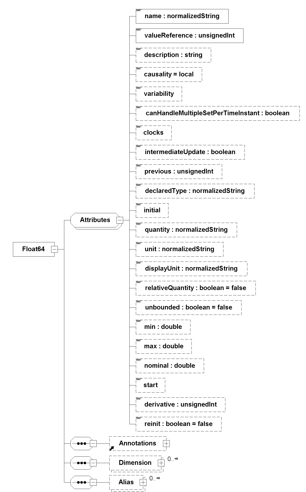

.Int32 element.
[[figure-schema-Int32]]
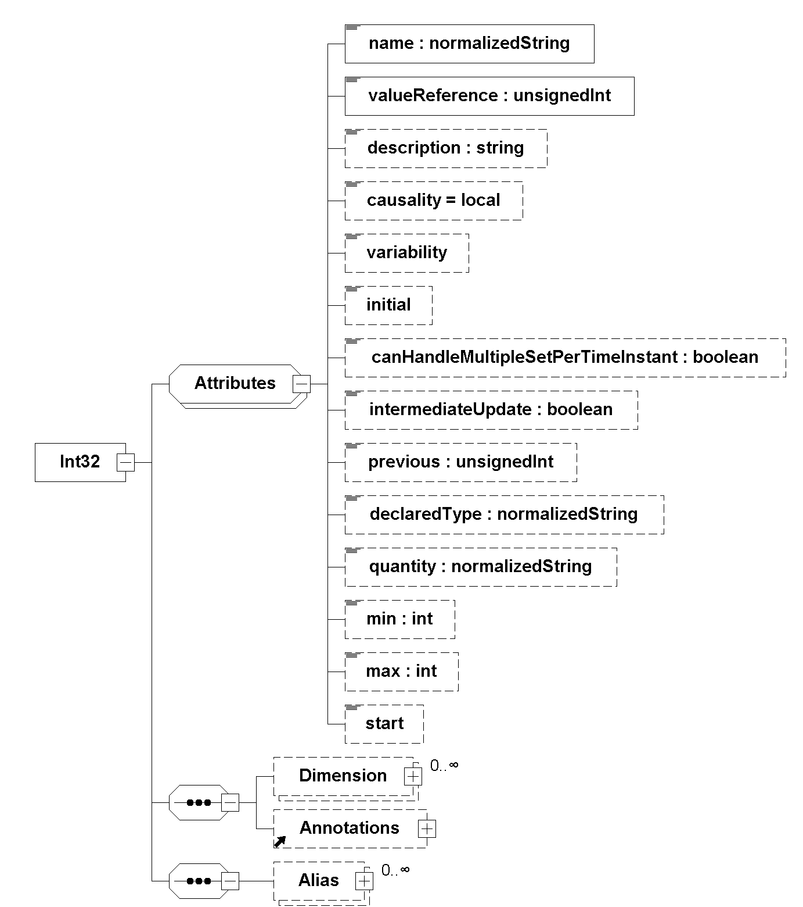

.Boolean element.
[[figure-schema-Boolean]]
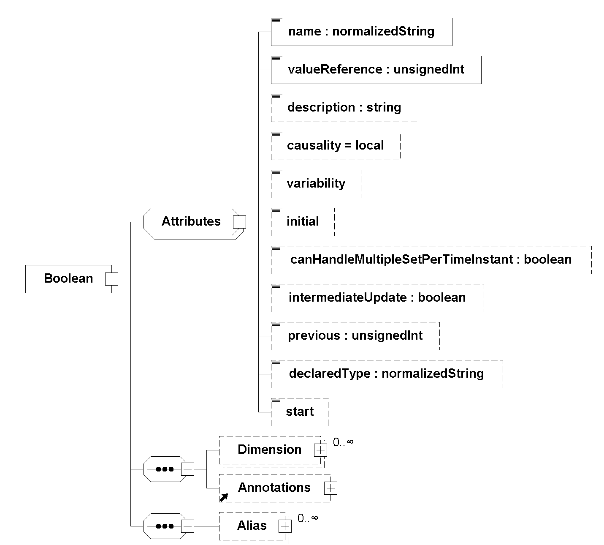

.Binary element.
[[figure-schema-Binary]]
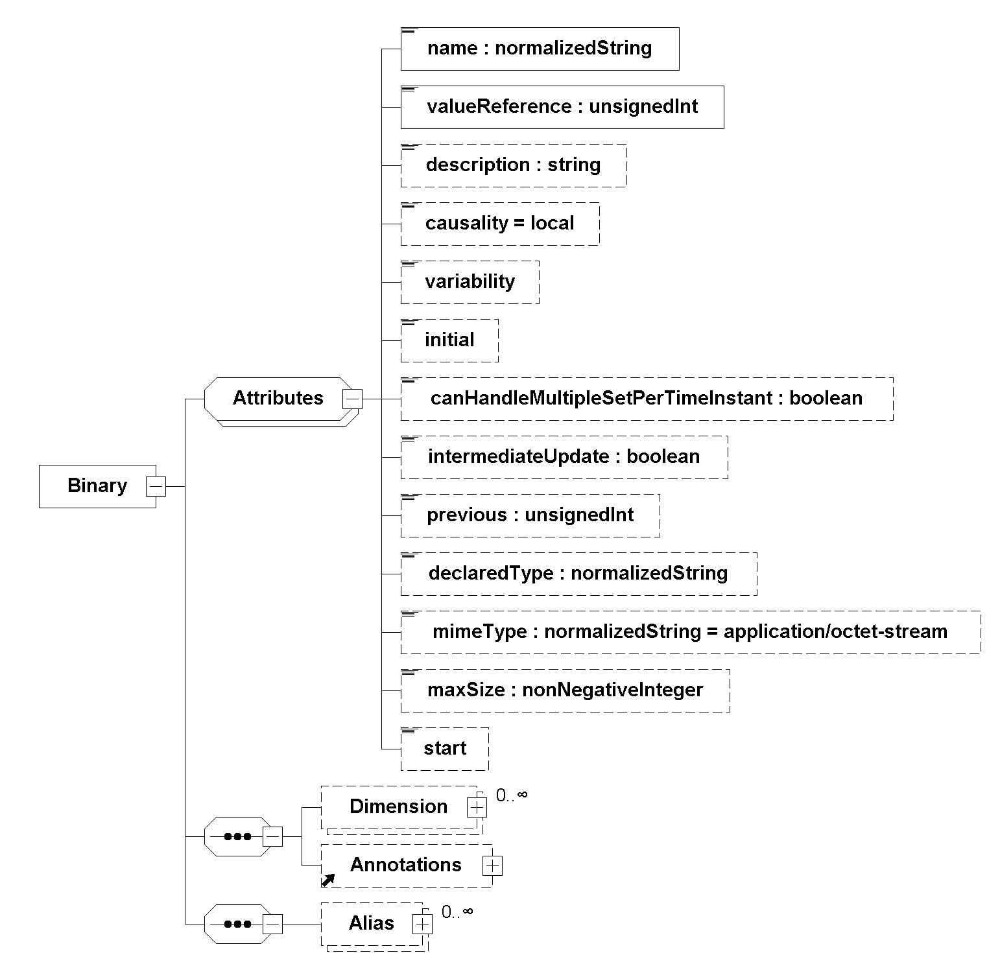

.Enumeration element.
[[figure-schema-Enumeration]]
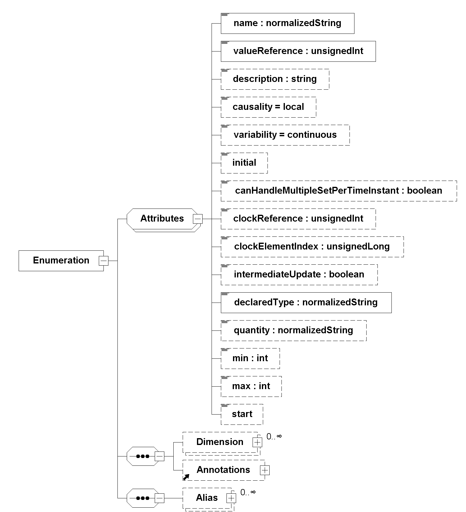

.Clock element.
[[figure-schema-Clock]]
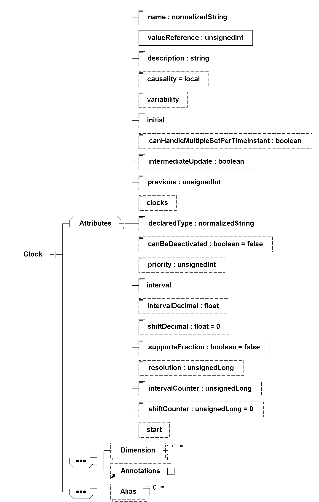

The attributes common to all variable types are defined in <<table-type-details>> and <<table-variableBase-attributes>>.
Type specific attributes are listed in the following table.

.Type specific attributes.
[[table-type-attributes]]
[cols="1,7a", options="header"]
|====
|Attribute
|Description

|`declaredType`
|If present, name of type defined with `<TypeDefinitions><TypeDefinition>`.
The attributes defined in the corresponding `<TypeDefinition>` (see <<definition-of-types>>) are used as defaults.
_[For example, if `min` is present both in variable type element of `<TypeDefinition>` and in the specific variable type element of the variable, then the `min` of the variable is actually used.]_
For `<Enumeration>` the attribute `declaredType` is required because the `<Enumeration>` items are defined in `<TypeDefinitions><TypeDefinition>`.
For all other types, this attribute is optional.

|`unit`
|This attribute defines the unit of the variable by referencing a `<UnitDefinitions><Unit>` with the same `name`, which must exist.
Variables without unit must not have a `unit` attribute.

|`displayUnit`
|Default display unit of the variable referencing to a `<DisplayUnit>` which must exist under `<UnitDefinitions><Unit>` with the `name` of `unit`.
The conversion to the `unit` is defined with the element `<fmiModelDescription><UnitDefinitions><Unit><DisplayUnit>`.
If `displayUnit` is defined a `unit` must also be defined.

|`initial`
|
[[initial,`initial`]]
Enumeration that defines how the variable is initialized, i.e. if a <<get-and-set-variable-values,`fmi3Set{VariableType}`>> is allowed and how the FMU internally treats this value in <<Instantiated>> and <<InitializationMode>>.

For the variable with <<causality>> = <<independent>>, the attribute <<initial>> must not be provided, because its start value is set with the <<startTime>> parameter of <<fmi3EnterInitializationMode>>.

The attribute <<initial>> for other variables can have the following values and meanings:
[[exact,`exact`]]
`= exact`: The variable is initialized with the <<start>> value by the FMU.
The importer may set a different initial value using <<get-and-set-variable-values,`fmi3Set{VariableType}`>>.

[[approx,`approx`]]
`= approx`: The variable is an iteration variable of an algebraic loop within the FMU and the
iterative solution process in <<InitializationMode>> starts with the <<start>> value as guess value.
_[The importer may call <<get-and-set-variable-values,`fmi3Set{VariableType}`>> in <<Instantiated>> to help the FMU find a solution.]_

[[calculated,`calculated`]]
`= calculated`: The variable is calculated by the FMU from other variables during initialization.
For `calculated` variables a <<start>> attribute must not be provided.

<<table-definition-initial>> defines the allowed values for <<initial>> as combination of <<causality>> and <<variability>> and the default value if <<initial>> is not present.

|`start`
|
[[start,`start`]]
Initial or guess value of the variable.
During instantiation, the FMU initializes its variables with their <<start>> values.
_[Therefore, calling_ <<get-and-set-variable-values,`fmi3Set{VariableType}`>> _to set <<start>> values is only necessary, if a different value as stored in the XML file is desired._
_It is not allowed to change the start values in the <<modelDescription.xml>> file of an FMU, as this would break the consistency with the hard-coded start values within the FMU._
_This could lead to unpredictable behavior of the FMU in different importers, as it is not mandatory to call <<get-and-set-variable-values,`fmi3Set{VariableType}`>> to set <<start>> values during initialization.]_

The <<start>> attribute is either a single value or a list of values.
The serialization of a multi-dimensional array variable is described in <<serialization-of-variables>>.
If only a single value is given for a multi-dimensional array, all values of the multi-dimensional array are equal to this value.

For variables of type `<String>` and `<Binary>`, the start values are not given as a list in the `start` attribute but as a sequence of `<Start>` elements with a `value` attribute.

_[ Example:_
_Start values of string array variable_
[source, xml]
----
include::examples/string_vector_example.xml[tags=string_start_values]
----
_]_

The interpretation of <<start>> is defined by variable attribute <<initial>>. +
If <<initial>> = <<exact>> or <<approx>>, a <<start>> attribute must be provided. +
If <<initial>> = <<calculated>> or <<causality>> = <<independent>>, it is not allowed to provide a <<start>> attribute.

Variables with <<causality>> = <<parameter>> or <<input>>, as well as variables with <<variability>> = <<constant>>, must have a <<start>> attribute which has the following meaning:

* If <<causality>> = <<parameter>>, the <<start>> attribute defines the default value of the parameter.

* If <<variability>> = <<constant>>, the <<start>> attribute defines the value of the constant.

* If <<causality>> = <<input>>, the <<start>> value is used by the FMU as value of the <<input>>, if it is not set by the importer, except for variables of type <<Clock>>.

|`derivative`
|
[[derivative,`derivative`]]
If present, then the variable with this attribute is the derivative of the variable with value reference given in `derivative`. +
_[For example, if `derivative = 3` for variable 8, then variable 8 is the derivative of variable 3 with respect to the <<independent>> variable (usually time).]_ +
This information may be used to signal that an <<input>> or an <<output>> is the derivative of another <<input>> or <<output>>, respectively.
Furthermore, this attribute defines the continuous <<state,states>> of the FMU.
The derivatives of continuous <<state,states>> of an FMU are listed as elements <<ContinuousStateDerivative>> in <<ModelStructure>>.
All variables listed in these elements must have attribute `derivative`.

|`reinit`
|[[reinit,`reinit`]]
Only used in Model Exchange, ignored for the other interface types.
May only be present for a <<state,continuous-time state>>. +
If `true`, the <<state>> may be <<reinitialization,reinitialized>> by the FMU in <<EventMode>>. +
If `false`, the <<state>> will not be <<reinitialization,reinitialized>>.

|====

If <<initial>> is not present in a type that can have that attribute, its value is defined by <<table-definition-initial>> based on the values of <<causality>> and <<variability>> (default [.underline]#underlined#):

.Definition of <<initial>>.
[#table-definition-initial]
[cols="1,1,1,1,1,1,1,1"]
|====
.2+^h|<<variability>>
7+^h|<<causality>>

^|<<structuralParameter,`structural Parameter`>>
^|<<parameter>>
^|<<calculatedParameter,`calculated Parameter`>>
^|<<input>>
^|<<output>>
^|<<local>>
^|<<independent>>

^|<<constant>>
^|--
^|--
^|--
^|--
^|[.underline]#exact#
^|[.underline]#exact#
^|--

^|<<fixed>>
^|[.underline]#exact#
^|[.underline]#exact#
^|[.underline]#calculated# +
approx
^|--
^|--
^|[.underline]#calculated# +
approx
^|--

^|<<tunable>>
^|[.underline]#exact#
^|[.underline]#exact#
^|[.underline]#calculated# +
approx
^|--
^|--
^|[.underline]#calculated# +
approx
^|--

^|<<discrete>>
^|--
^|--
^|--
^|[.underline]#exact#
^|[.underline]#calculated# +
exact +
approx
^|[.underline]#calculated# +
exact +
approx
^|--

^|<<continuous>>
^|--
^|--
^|--
^|[.underline]#exact#
^|[.underline]#calculated# +
exact +
approx
^|[.underline]#calculated# +
exact +
approx
^|--
|====

====== Variable Naming Conventions [[namingSection]]

With attribute <<variableNamingConvention>> in `<fmiModelDescription>`, the convention is defined how the variable names have been constructed.
The importer may use this information to represent the names in a better way (for example, as a tree and not as a linear list).

In the following definitions, the https://en.wikipedia.org/wiki/Extended_BNF[Extended Backus-Naur Form (EBNF)] is used:

----
=   production rule
[ ] optional
{ } repeat zero or more times
|   or
----

The names must be unique, non-empty strings.

The following conventions for scalar names are defined:

*<<variableNamingConvention,`variableNamingConvention = flat`>>*

----
name = Unicode-char { Unicode-char } // identical to xs:normalizedString
Unicode-char = any Unicode character without carriage return (#xD),
line feed (#xA) nor tab (#x9)
----

*<<variableNamingConvention,`variableNamingConvention = structured`>>*

Structured names are using "." as a separator between hierarchies.
A name consists of "pass:[_]", letters and digits or may consist of any characters enclosed in single apostrophes.
A name may identify an array element on every hierarchical level using "[...]" to identify the respective array index.
If an array is a leaf node of the variable hierarchy then the array can also be represented as a single variable of type array.
A <<derivative>> of a variable is defined with `der(name)` for the first time derivative and `der(name,N)` for the N-th derivative.
Examples:

----
vehicle.engine.speed
resistor12.u
v_min
robot.axis.'motor #234'
der(pipe[3,4].T[14],2) // second time derivative of pipe[3,4].T[14]
----

The precise syntax is:

----
name            = identifier | "der(" identifier ["," unsignedInteger ] ")"
identifier      = B-name [ arrayIndices ] {"." B-name [ arrayIndices ] }
B-name          = nondigit { digit | nondigit } | Q-name
nondigit        = "pass:[_]" | letters "a" to "z" | letters "A" to "Z"
digit           = "0" | "1" | "2" | "3" | "4" | "5" | "6" | "7" | "8" | "9"
Q-name          = "'" ( Q-char | escape ) { Q-char | escape } "'"
Q-char          = nondigit | digit | "!" | "#" | "$" | "%" | "&" | "(" | ")" |
                                     "*" | "+" | "," | "-" | "." | "/" | ":" |
                                     ";" | "<" | ">" | "=" | "?" | "@" | "[" |
                                     "]" | "^" | "{" | "}" | "|" | "~" | " "
escape          = "\'" | "\"" | "\?" | "\\" | "\a" | "\b" |
                  "\f" | "\n" | "\r" | "\t" | "\v"
arrayIndices    = "[" unsignedInteger {"," unsignedInteger} "]"
unsignedInteger = digit { digit }
----

_[This definition is identical to the syntax of an identifier in the <<MLS12,Modelica Language Specification>>.]_

Example:

----
vehicle
  transmission
    ratio
    outputSpeed
  engine
    inputSpeed
    temperature
----

is mapped to the following list of variable names:

----
vehicle.transmission.ratio
vehicle.transmission.outputSpeed
vehicle.engine.inputSpeed
vehicle.engine.temperature
----

It might be that not all elements of an array are present.

The <<variableNamingConvention>> `structured` does not define if arrays are 0-based or 1-based.

==== Model Structure [[ModelStructure,`<ModelStructure>`]]

The structure of the model is defined in element `<fmiModelDescription><ModelStructure>`.
It defines the <<model-dependencies,dependencies>> between variables.

The required part of the model structure for all FMI types defines the ordering of outputs in <<Output>> and unknowns during initialization in <<InitialUnknown>>.
A Model Exchange FMU must also expose all derivatives of continuous states in <<ContinuousStateDerivative>> and all event indicators in <<EventIndicator>>.

The optional part of the model structure defines in which way <<derivative,`derivatives`>>, <<output,`outputs`>>, and initial unknowns depend on <<input,`inputs`>> and/or <<parameter,`parameters`>>, and continuous-time <<state,states>>.
The listed <<dependencies>> declare the dependencies between whole (multi-dimensional-)variables and not individual elements of the variables.
_[Dependencies of individual array elements can be retrieved during runtime using <<fmi3GetVariableDependencies>>.]_

<<figure-schema-ModelStructure>> shows the definition of <<ModelStructure>>.

.ModelStructure element.
[#figure-schema-ModelStructure]
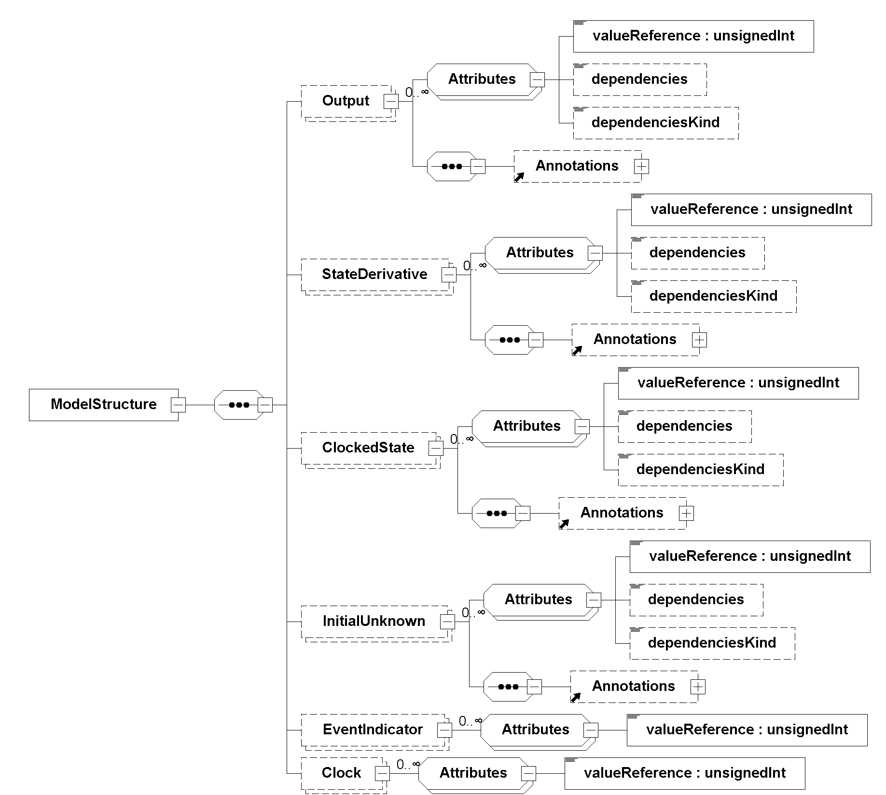

Note that attribute <<dependenciesKind>> for element <<InitialUnknown>> has less enumeration values as <<dependenciesKind>> in the other lists, as detailed in <<table-output-der-initialUnknown-details>>.

<<ModelStructure>> consists of the elements detailed in <<table-model-structure-elements>> (see also <<figure-schema-ModelStructure>>; the symbols of the mathematical equations describing the dependencies are defined in <<concepts-model-exchange>>):

.ModelStructure elements.
[#table-model-structure-elements]
[cols="1,5",options="header"]
|====
|Element
|Description

|`Output`
|[[Output,`<Output>`]]
Ordered list of all outputs, in other words, a list of value references where every corresponding variable must have <<causality>> = <<output>> (and every variable with <<causality>> = <<output>> must be listed here).
Attribute <<dependencies>> defines the dependencies of the <<output,`outputs`>> from the knowns after the <<InitializationMode>>.
Attribute <<dependencies>> for <<output>> <<Clock,`Clocks`>> lists all known variables (including input clocks) that contribute to trigger a clock tick for that <<outputClock,output Clock>>.
The functional dependency is defined as: +
latexmath:[{(\mathbf{y}_c, \mathbf{y}_d) := \mathbf{f}_{\mathit{output}}(\mathbf{x}_c, \mathbf{u}_c, \mathbf{u}_d, t, \mathbf{p})}]

|`ContinuousStateDerivative`
|[[ContinuousStateDerivative,`<ContinuousStateDerivative>`]]
Ordered list of value references of all derivatives of continuous <<state,states>>.
The order defined by this list defines the order of the elements for <<fmi3GetContinuousStates>>, <<fmi3SetContinuousStates>>, and <<fmi3GetContinuousStateDerivatives>>.
_[Note that only <<continuous>> floating point variables are listed here._
_If a <<state>> or a <<derivative>> of a <<state>> shall not be exposed from the FMU, or if states are not statically associated with a variable (due to <<dynamic-state-selection,dynamic state selection>>), then dummy variables have to be introduced, for example, `x[4]`, or `xDynamicStateSet2[5]`.]_

The corresponding continuous-time <<state,states>> are defined by attribute <<derivative>> of the corresponding variable state-derivative element.
_[Note that higher order derivatives must be mapped to first order derivatives but the mapping definition can be preserved due to attribute <<derivative>>._
_Example: if_ latexmath:[{\frac{\text{ds}}{\text{dt}} = v,\ \frac{\text{dv}}{\text{dt}} =f(..)}] _,then_ latexmath:[{\left\{ v,\ \frac{\text{dv}}{\text{dt}} \right\}}] _is the vector of state derivatives and attribute <<derivative>> of_ latexmath:[{v}] _references_ latexmath:[{s}] _, and attribute <<derivative>> of_ latexmath:[{\frac{\text{dv}}{\text{dt}}}] _references_ latexmath:[{v}] _.]_ +
For Co-Simulation, elements <<ContinuousStateDerivative>> are ignored if capability flag <<providesDirectionalDerivatives>> has a value of `false`, in other words, it cannot be computed.
The functional dependency is defined as: +
latexmath:[{\dot{\mathbf{x}}_c := \mathbf{f}_{\mathit{der}}(\mathbf{x}_c, \mathbf{u}_c, \mathbf{u}_d, t, \mathbf{p})}]

|`ClockedState`
|
[[ClockedState,`<ClockedState>`]]
A <<ClockedState>> is part of the discrete state of a model partition and represented by a clocked variable.
To which Clock or Clocks it belongs is described by the attribute <<clocks>> of that variable.
Each <<ClockedState>> must have the attribute <<previous>> to represent the previous value of this <<ClockedState>>.
All clocked states must have <<variability,`variability = discrete`>>, must have the attribute <<clocks>>, and must not be of type <<fmi3Clock>>.

|`InitialUnknown`
a|
[[InitialUnknown,`<InitialUnknown>`]]
Ordered list of all exposed unknowns in <<InitializationMode>>.
This list consists of all variables which:

* are not <<clocked-variable,clocked variables>> and have <<causality>> = <<output>> (with <<initial>> = <<approx>> or <<calculated>>), or
* have <<causality>> = <<calculatedParameter>>, or
* are continuous-time <<state,states>> or state derivatives (defined with elements <<ContinuousStateDerivative>>) with <<initial>> = <<approx>> or <<calculated>>, or
* are <<clocked-variable,clocked variables>> that the FMU wishes to initialize in initialization mode.

The resulting list is not allowed to have duplicates (for example, if a <<state>> is also an <<output>>, it is included only once in the list). +
Attribute <<dependencies>> defines the dependencies of the unknowns from the knowns in <<InitializationMode>>.
The functional dependency is defined as:

latexmath:[{\mathbf{v}_{\mathit{initialUnknowns}} := \mathbf{f}_{\mathit{init}}(\mathbf{u}_c, \mathbf{u}_d, t_{\mathit{start}}, \mathbf{v}_{\mathit{initial=exact}})}]

Since, <<output,`outputs`>>, continuous-time <<state,states>> and state derivatives are either present as knowns (if <<initial>> = <<exact>>) or as unknowns (if <<initial>> = <<approx>> or <<calculated>>), they can be inquired with <<get-and-set-variable-values,`fmi3Get{VariableType}`>> in <<InitializationMode>>.

<<EventIndicator,`EventIndicators`>> are available during <<InitializationMode>>, however their dependencies are intended for debugging purposes only (and not for connection with other FMU's), and therefore they must not be listed as <<InitialUnknown>>.

_[Example: Assume an FMU is defined in the following way:_

latexmath:[{(\mathbf{y}_{c+d}, \dot{\mathbf{x}}_c) := \mathbf{f}_{\mathit{init}}(\mathbf{x}_c, \mathbf{u}_{c+d}, t_{\mathit{start}}, \mathbf{p})}] +

latexmath:[{(\mathbf{y}_{c+d}, \dot{\mathbf{x}}_c) := \mathbf{f}_{\mathit{sim}}(\mathbf{x}_c, \mathbf{u}_{c+d}, t_i, \mathbf{p})}] +

_Therefore, the initial state_ latexmath:[{\mathbf{x}_c(t_{\mathit{start}})}] _has <<initial>> = <<exact>> and the initial state derivative_ latexmath:[{\dot{\mathbf{x}}_c(t_{\mathit{start}})}] _has <<initial>> = <<calculated>>._
_The importer can still initialize this FMU in steady-state, by using_ latexmath:[{\mathbf{x}_c(t_{\mathit{start}})}] _as iteration variables and adding the equations_ latexmath:[{\dot{\mathbf{x}}_c(t_{\mathit{start}}) = \mathbf{0}}] _in the importer.]_

|`EventIndicator`
|
[[EventIndicator,`<EventIndicator>`]]
An ordered list of value references where every referenced variable must be an event indicator.
The serialized (if value reference points to array variable) and concatenated values of the variables referenced by the attribute `valueReference` form the array that can be retrieved with <<fmi3GetEventIndicators>>.
The number of event indicators may change if one or more value references listed in <<EventIndicator>> point to array variables of variable size (see <<fmi3GetNumberOfEventIndicators>>).
Only <<continuous>> variables of type `Float32` and `Float64` can be referenced by <<EventIndicator>>.

For Co-Simulation and Scheduled Execution, <<EventIndicator>> elements are ignored.

_[The intention for connecting event indicators to variables via `valueReferences` is to facilitate debugging of the FMU._
_If an event indicator shall not be exposed, or if event indicators are not statically associated with a variable (due to dynamic event indicator selection), then dummy variables have to be introduced, for example, `eventIndicator[4]`.]_

|====

Elements <<Output>>, <<ContinuousStateDerivative>>, <<ClockedState>>, <<InitialUnknown>>, and <<EventIndicator>> have (partially) the following attributes:

.<<Output>>, <<ContinuousStateDerivative>>, <<ClockedState>>, <<InitialUnknown>>, and <<EventIndicator>> attribute details.
[[table-output-der-initialUnknown-details]]
[cols="1,5a", options="header"]
|====
|Attribute
|Description

|`valueReference`
|The value reference of the unknown latexmath:[{v_{\mathit{unknown}}}].

|`dependencies`
|
[[dependencies,`dependencies`]]
Optional attribute defining the algebraic dependencies as list of value references of the unknown latexmath:[{\mathbf{v}_{\mathit{unknown}}}] directly with respect to latexmath:[{\mathbf{v}_{\mathit{known}}}].
For a real valued unknown and a real valued known, if the known is not listed among the dependencies then the partial derivative of the unknown with respect to that known is identically zero.
If dependencies is not present, it must be assumed that the unknown depends on all knowns.
If dependencies is present as empty list, the unknown depends on none of the knowns.
Otherwise the unknown depends on the knowns defined by the given value references. +
_[This means that all dependencies must be listed, also the dependencies of clocked variables on their clocks.]_ +
Knowns latexmath:[{\mathbf{v}_{\mathit{known}}}] in <<EventMode>> and <<ContinuousTimeMode>> (ME) and at communication points (CS and SE) for <<Output>> and <<ContinuousStateDerivative>> elements are: +

* inputs (variables with <<causality>> = <<input>>),

* continuous states and discrete-time states,

* parameters (variables with <<causality>> = <<parameter>>),

* <<independent>> variable (usually time; <<causality>> = <<independent>>).

Knowns latexmath:[{\mathbf{v}_{\mathit{known}}}] in <<InitializationMode>> (for elements <<InitialUnknown>>) are:

* inputs (variables with <<causality>> = <<input>>),

* variables with <<initial>> = <<exact>>, _[for example, <<parameter,`parameters`>> or initial <<state,states>>]_

* <<independent>> variable (usually time; <<causality>> = <<independent>>).

_[The <<independent>> variable should be treated as any other variable when it comes to dependencies._
_As only explicit dependencies are listed it is required that unknowns that depend on the <<independent>> variable have a partial derivative w.r.t this variable that is different from identically zero._
_If the FMU supports <<directionDerivatives,directional derivatives>> or <<adjointDerivatives,adjoined derivatives>> the <<independent>> variable is a valid input to those functions if it is listed, just as any other listed variable._
_For example, for a mechanical system, if it has the <<independent>> variable listed among the dependencies it is called a rheonomous system, otherwise it is called a scleronomous system.]_

|`dependenciesKind`
|
[[dependenciesKind, `dependenciesKind`]]
If <<dependenciesKind>> is present, <<dependencies>> must be present and must have the same number of list elements.
If <<dependenciesKind>> is not present, it must be assumed that the unknown latexmath:[{\mathbf{v}_{\mathit{unknown}}}] depends on the knowns latexmath:[{\mathbf{v}_{\mathit{known}}}] without a particular structure.
Otherwise, the corresponding known latexmath:[{\mathbf{v}_{\mathit{known},i}}] enters the equation as:

`= dependent`: no particular structure, latexmath:[{{\mathbf{f}(..,\ \mathbf{v}}_{\mathit{known},i}},..)]

The following <<dependenciesKind>> is only allowed for floating point latexmath:[{\mathbf{v}_{\mathit{unknown}}}]:

`=` <<constant>>: constant factor, latexmath:[{\mathbf{c} \cdot \mathbf{v}_{\mathit{known},i}}] where latexmath:[\mathbf{c}] is an expression that is evaluated before <<fmi3EnterInitializationMode>> is called.

The following <<dependenciesKind>> is only allowed for floating point latexmath:[{\mathbf{v}_{\mathit{unknown}}}] in <<EventMode>> and <<ContinuousTimeMode>> (ME) and at communication points (CS and SE), and not for <<InitialUnknown>> for <<InitializationMode>>:

`=` <<fixed>>: fixed factor, latexmath:[{\mathbf{p} \cdot \mathbf{v}_{\mathit{known},i}}] where latexmath:[\mathbf{p}] is an expression that is evaluated before <<fmi3ExitInitializationMode>> is called.

`=` <<tunable>>: tunable factor, latexmath:[{\mathbf{p} \cdot \mathbf{v}_{\mathit{known},i}}] where latexmath:[\mathbf{p}] is an expression that is evaluated before <<fmi3ExitInitializationMode>> is called and in <<EventMode>> or at a communication point (ME and CS) due to a change of a <<tunable>> parameter.

`=` <<discrete>>: discrete factor, latexmath:[{\mathbf{d} \cdot \mathbf{v}_{\mathit{known},i}}] where latexmath:[\mathbf{d}] is an expression that is evaluated before <<fmi3ExitInitializationMode>> is called and in <<EventMode>> or at a communication point (CS and SE).
|====

==== Terminals and Icons [[fmiTerminalsAndIcons]]

Terminals define semantic groups of variables.
This definition adds an additional layer to the interface description of the FMUs.
It does not change the <<causality>> of the variables (e.g. inputs will remain inputs, outputs will remain outputs, and parameters will remain parameters) but enables the definition of physical and bus-like connectors and variable groups that require special handling on the system level by the importer (e.g. flow variables and bus frames).
Icons define a graphical representation of an FMU and its terminals.

Both features are optional and may be defined in the separate XML file `terminalsAndIcons/terminalsAndIcons.xml`. +
_[The usage of a separate file enables backporting of this feature to previous FMI versions.]_

.fmiTerminalsAndIcons element.
[[terminals_and_icons_overview]]
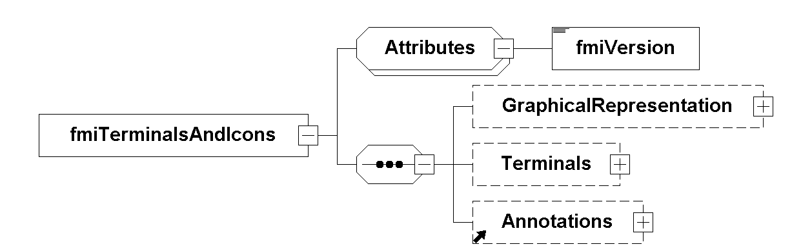

On the top level, the schema consists of the following elements (see <<terminals_and_icons_overview>>).

.fmiTerminalAndIcons element details.
[[table-terminal-and-icon-details]]
[cols="1,3",options="header"]
|====
|Attribute or Element
|Description

|`fmiVersion`
|This attribute declares the FMI version defining the XSD of the `terminalsAndIcons/terminalsAndIcons.xml` file.
Starting with FMI 3.0, this `fmiVersion` attribute must match the `fmiVersion` attribute of element <<fmiModelDescription>> of the <<modelDescription.xml>> file.
If used in previous FMI versions, this attribute points to the FMI version defining this `terminalsAndIcons/terminalsAndIcons.xml` file (e.g. XSD, file location).

|`<GraphicalRepresentation>`
|If present, contains information for importers of FMUs to draw graphical representations of the FMU in a system view.

|`<Terminals>`
|If present, this allows combining variables (e.g. inputs, outputs and parameters) into logical groups, e.g.,  to ease connections on a system level and add semantic information required for system-level connections.
|====

===== Definition of a Graphical Representation [[graphicalRepresentation]]

====== Overview

The graphical representation of the FMU and terminals are needed to more easily comprehend the meaning of connected FMUs and to help importers to display the terminals and the FMU icon in the way the exporter intended.

The graphical representation is fully optional.
The graphical representation of terminals is separate from the terminal definitions in the `<Terminals>` element.

There are two optional elements in the `<GraphicalRepresentation>`:

* The element `<CoordinateSystem>` defines the extent of the whole icon, graphical items may exceed that rectangle.
* The element `<Icon>` defines the image position.

.GraphicalRepresentation element.
[[figure-schema-GraphicalRepresentation]]
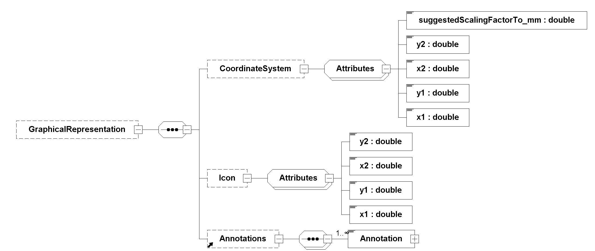

====== CoordinateSystem

.CoordinateSytem element.
[[figure-schema-CoordinateSystem]]
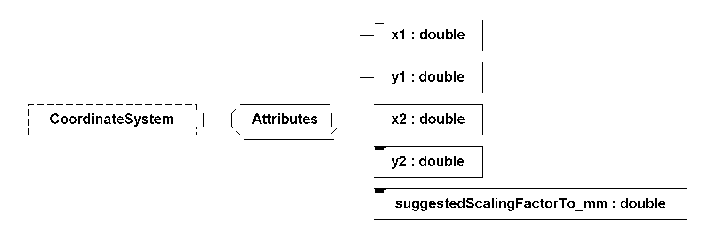

The `<CoordinateSystem>` element and its extent is used as reference for other graphical items.
It also provides a scaling factor to millimeter.

The coordinate system is defined by the coordinates of two points, the lower left (`x1`, `y1`) corner and the upper right (`x2`, `y2`) corner, where the coordinates of the first point shall be less than the coordinates of the second point _[a first quadrant coordinate system]_.
The x-axis is directed to the right, the y-axis is directed upwards.

_[The exporting tool should define how the coordinate system unit relates to mm display or printout size._
_However, an importer might choose to use the factor from the default coordinate system extent to the actual coordinate system extent to calculate a scaling factor, to match the default icon size in the importer._

_The area defined by the coordinate system is suggested to be used as "clickable icon size" in importers._
_A `<Terminal>` might be placed outside of this area, therefore the visible bounding box has to be determined by the importer.]_

The coordinate system default is `x1=-100, y1=-100, x2=100, y2=100`.
This extent is used if the `<CoordinateSystem>` element is missing.
The default `suggestedScalingFactorTo_mm` is `0.1`.
So the default coordinate system display size should be `20 mm` width and `20 mm` height.

The FMU icon and all graphical representations provide the position and extent with the attributes `x1`, `y1`, `x2`, `y2`.
The values of these attributes directly relate to this coordinate system and are not normalized.
Flipping of the FMU icon or a terminal can be realized by setting its attributes `x2 < x1` or `y2 < y1` without changing the coordinate system.

====== Icon

.Icon element.
[[figure-schema-Icon]]
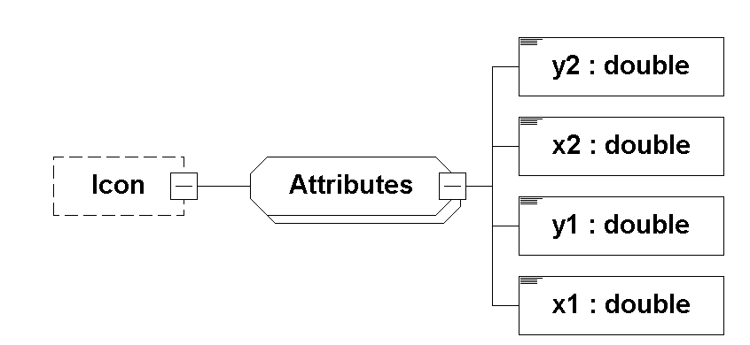

The extent and position of the FMU icon are defined in the `<Icon>` element.
The optional image file of the FMU icon is placed at the path `terminalsAndIcons/icon.png` in the ZIP archive of the FMU.
The terminals should not be visible in the image.
Optionally an SVG file with path `terminalsAndIcons/icon.svg` can be provided if also the PNG file is present.
This enables high quality rendering and printing in importers.

The point (`x1`, `y1`) maps to the left lower corner of the PNG image or SVG viewport.
The point (`x2`, `y2`) maps to the right upper corner of the PNG image or SVG viewport.

====== Placement, Extent, and Painting Order of Graphical Items

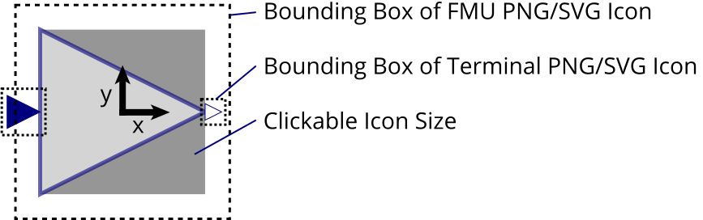

The clickable icon size is defined by the `<CoordinateSystem>` element.
The FMU icon itself may exceed this extent (or bounding box).
The bounding box of the terminals is given by the extent in the terminals element.
Their location is neither limited to the extent of the icon nor the extent of the coordinate system.
_[An importer has to determine the outer bounding box enclosing all graphical items.]_

Transparent SVG or PNG files are allowed and wanted.
The order of the elements in the XML file defines the order of painting.
The first element in the `<TerminalGraphicalRepresentation>` is painted first and therefore behind the others, the last element is painted on top of the others and because of that in front of them.
_[So the FMU icon should be placed first in the XML file, terminal below.]_

===== Definition of Terminals [[definitionOfTerminals]]

====== Overview

Terminals are fully optional and can be ignored by any importer.

A terminal is:

* a structured interface for connections to other models,
* intended to be used for signal flow between models, parameter grouping and propagation, and compatibility checks of the model configuration, and
* a sequence of references to variables with connection and other meta data.

Predefined rules for variable matching in a connection are given in <<table-predefined-matching-rules>>.
Predefined variable kinds are used to describe how the terminal member variables have to be handled.
Domain specific connection rules, terminals and their member variables can be provided by other standards, including layered standards.

_[Algebraic loops in systems of connected FMUs are not addressed or resolved by the terminals._
_The FMU standard does not require that the <<causality>> of the terminal member variables in connected terminals match._
_This must be handled by the importer._

_The https://ssp-standard.org/[System Structure & Parameterization Standard (SSP)] refers to a `connectorKind`._
_This `connectorKind` is not related to the `terminalKind` or `variableKind` described in <<section-terminals>> and <<section-terminalvars>>.]_

[[section-terminals]]
====== Terminals

Element `<fmiTerminalsAndIcons><Terminals>` is defined as:

.Terminals element.
[[figure-schema-Terminals]]
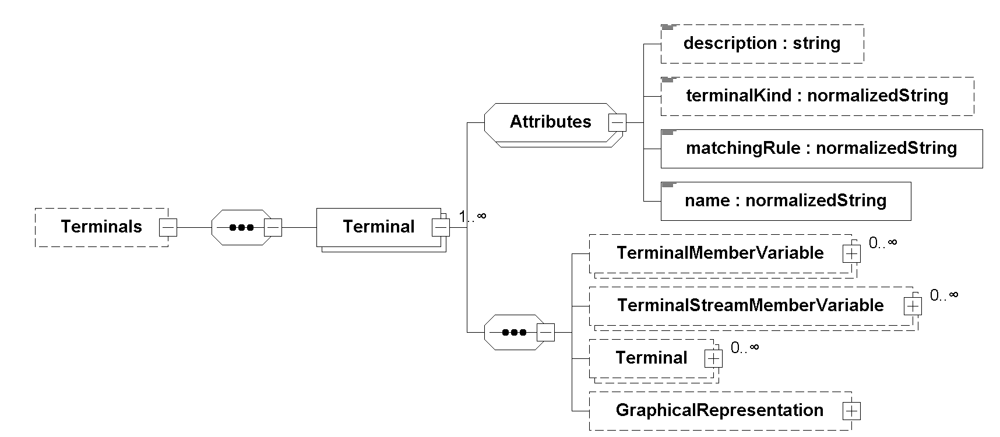

The normalized string attribute `name` of the `<Terminal>` element is the <<uniqueNameAttribute,unique>> instance name of the terminal.
The terminal name must be unique on each level.

[[matchingRule,`matchingRule`]]
The normalized string attribute `matchingRule` describes the rules for variable matching in a connection of terminals.
As detailed in <<table-predefined-matching-rules>>, there are four predefined matching rules: `plug`, `bus`, `sequence`, and `none`.
Other standards may define new matching rules.
In order to avoid ambiguities and conflicts, rule names must follow the reverse domain notation of a domain that is controlled by the entity defining the semantics and content of the additional entries.
The rule names beginning with `org.modelica` and `org.fmi-standard` are explicitly reserved for use by layered standards defined by Modelica Association or its own projects (<<MAP,MAPs>>).

.Predefined matching rules.
[#table-predefined-matching-rules]
[cols="1,3",options="header"]
|====
|`matchingRule`
|Description

[[plug,`plug`]]
|`plug`
|Matching of the variables is based on `memberName`.
An importer should connect terminals only if all member variables are present and match.

[[bus,`bus`]]
|`bus`
|Matching of the variables is based on `memberName`.
An importer may connect terminals if some or no terminal member variables are present.

[[sequence,`sequence`]]
|`sequence`
|Matching of the variables is based on the order of the terminal member variables.
An importer should connect terminals only if the number of member variables matches.

[[none,`none`]]
|`none`
|Matching of the variables is not intended by the creator of the FMU. 
An importer may connect terminals based on the user's additional input.

|====

[[terminalKind,`terminalKind`]]
The normalized string `terminalKind` is an optional attribute.
Other standards may define terminal kinds.
It is intended that the `terminalKind` is used to define domain specific member variable sequences, member names and order, or high level restrictions for connections.

_[Externally defined terminal kinds should refer to a predefined `matchingRule`, if possible._
_Vendor specific terminal kinds should start with `_vendorName` or `_toolName` to avoid namespace clashes._

_Examples for `terminalKind`: `StandardXXX_Mechanical_Translational`, `Modelica.Mechanics.Translational.Interfaces.Flange_a`, `vendorNameA_customTypeA`, `_vendorNameB_customLibrary_customTypeB`._

_The structured naming convention of the <<ModelVariables>> is independent from the terminal names and member variable names._

_A tool may choose to connect terminals with a different or unknown `terminalKind`, if the `matchingRule` matches._

_A tool may choose to take the structured naming convention of variable names into account when matching terminals._
_This can for example be used to allow matching between terminals employing arrays mapped to scalar variables using structured naming convention ("naming convention arrays"), and those using native FMI 3.0 arrays, as in the following example:_

_Assume that an (FMI 3.0) FMU has a one-dimensional array variable `x` of length 3 as member variable of a terminal and is connected to another (FMI 2.0 or FMI 3.0) FMU supporting structured naming convention, which has scalar variables `x[1]`, `x[2]`, `x[3]` as member variables of a terminal._
_Then `x[1]`, `x[2]`, `x[3]` are interpreted as a "naming convention array" with name `x`, which "matches" the array variable `x` of the first FMU, in name-based matching._
_Similarly the notional "naming convention array" `x` would participate in sequence-based matching as a single notional variable in the place of the underlying scalar variables._
_]_

[[section-terminalvars]]
====== Terminal Member Variable

The `<TerminalMemberVariable>` is defined as:

.TerminalMemberVariable element.
[[figure-schema-TerminalMemberVariable]]
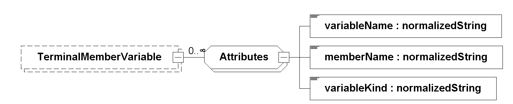

The normalized string `variableName` identifies a variable in <<ModelVariables>> which is actually connected and for which <<get-and-set-variable-values,`fmi3Get{VariableType}`>> and <<get-and-set-variable-values,`fmi3Set{VariableType}`>> is called.

If the `matchingRule` `plug` and `bus` are used, then `memberName` is used for variable matching.
Therefore, the `memberName` attribute is required for `plug` and `bus` and must be unique per terminal.
The `memberName` is not required for `matchingRule` `sequence`.

The normalized string `variableKind` is used to provide general information about the variable.
This information defines how the connection of this variable has to be implemented (e.g. Kirchhoff's current law or common signal flow).

The predefined `variableKind` are:

.Predefined kinds of variables.
[[table-variable-kinds]]
[cols="1,3",options="header"]
|====
|`variableKind`
|Description

[[signal,`signal`]]
|`signal`
|The values in connected terminals are intended to be equal.
Restricted to <<input>> and <<output>>, <<parameter>> and <<calculatedParameter>>.
_[Example: Signal flow, parameter propagation, equality checks]_

[[inoutflow,`inflow/outflow`]]
|`inflow` / `outflow`
|Variables which fulfill Kirchhoff's current law.
Restricted to <<input>> and <<output>>, <<parameter>> and <<calculatedParameter>>.
_[Example: Electric current]_
|====

_[The suggested variable naming scheme for the structured naming convention is <ModelVariable name> = <terminalName>.<memberName>._

_Not all <<ModelVariables>> which have the prefix "<terminalName>." are a member variable, and there may exist member variables which don't have this prefix._

_Example 1 (suggested scheme): <ModelVariable name> is `portA.U`, <terminalName> is `portA`, <memberName> is `U`._

_Example 2 (suggested scheme): <ModelVariable name> is `hierarchConn.innerConn.U`, <outer terminal name> is `hierarchConn`, <inner terminal name> is `innerConn`, <memberName> is `U`._

_Example 3 (no prefix): <ModelVariable name> is `u`, <terminalName> is `portA`, <memberName> is `u`._

_Example 4 (prefix but not a member): <ModelVariable name> is `portA.u`, there is a terminal with <terminalName> `portA`, but this variable is not a terminal member._

_The suggested variable naming scheme for the non-structured naming convention is: <ModelVariable name> = <memberName>_

_Matching is not restricted by <<variability>>, <<causality>> or variable type._
_Example: A <<fixed>> variable may be connected to a <<tunable>> variable, a variable of type `fmi3Float64` may be connected to a variable of type `fmi3Int32`._
_However, it is recommended that the variable types and variabilities are equal._

_The `matchingRule` refers to the `<TerminalMemberVariable>` on the same level only._
_Nested terminals can have different `matchingRules`._

_There is no special handling of <<derivative,`derivatives`>>._
_If a <<derivative>> is a terminal member variable then it is considered as normal member variable._
_However, if a <<derivative>> of a terminal member variable is not terminal member, then this <<derivative>> information may be used by an importer.]_

====== Terminal Stream Member Variable

The `<TerminalStreamMemberVariable>` is defined as:

.TerminalStreamMemberVariable element.
[[figure-schema-TerminalStreamMemberVariable]]
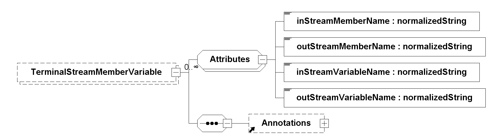

This element is used for variables which fulfill the balance equation for transported quantities.
It is restricted to <<input>> and <<output>>, <<parameter>> and <<calculatedParameter>>.

The Stream concept is described in the appendix D "Derivations of Stream Equations" of the <<MLS12,Modelica Language Specification>>.
Only one terminal member variable with the `variableKind` `inflow` or `outflow` per terminal is allowed, if a `<TerminalStreamMemberVariable>` is present.
_[More sophisticated structures can be implemented using hierarchical terminals.]_

The attribute `inStreamVariableName` and `outStreamVariableName` are used to identify the <<ModelVariables>>.
If the referenced model variables are arrays, then the size of the `inStreamVariableName` and `outStreamVariableName` has to be equal.
A terminal may have more than one `<TerminalStreamMemberVariable>`.
The `inStreamMemberName` and `outStreamMemberName` describe the terminal member name for matching purposes, similar to the `memberName` attribute in the `<TerminalMemberVariable>`.

_[An example of use for an array of stream variables is a gas mixture flow._
_The gas composition could be implemented as a mass fraction vector._
_The `outStreamVariableName` refers to_ latexmath:[portA.q_\textit{outStream}\textit{[\]}] _and the `inStreamVariableName` refers to_  latexmath:[portA.q_\textit{inStream}\textit{[\]}] _._
_The `inStreamMemberName` and `outStreamMemberName` are "_ latexmath:[q_\textit{inStream}\textit{[\]}] _" and "_ latexmath:[q_\textit{outStream}\textit{[\]}] _"._

_Balance equation for transported quantities:_

_latexmath:[0 = \sum{q_i\dot{m}_i}]_

_latexmath:[0 = \sum{\dot{m}_i}\cdot
\left\{\begin{array}{ll}
q_{i, \mathit{outStream}} &\textit{if $\dot{m}$ is outflowing through terminal $i$}\\
q_{i, \mathit{inStream}} &\textit{if $\dot{m}$ is inflowing through terminal $i$}
\end{array}\right.]_

_The_ latexmath:[q_{i,\mathit{outStream}}] _is the convective quantity in case the matter flows out of the FMU._
latexmath:[q_{i,\mathit{inStream}}] _is the convective quantity in case the matter flows into the FMU._
_Both variables are present in the terminal._
_The outStream variable has the <<causality>> <<output>> or <<calculatedParameter>> because this information has to be provided by each FMU._
_The inStream variable has the <<causality>> <<input>> or <<parameter>>._
_To display the actual value in an importer, this actual value has to be selected depending on the sign of the terminal member variable with `variableKind` `inflow` or `outflow`._
_However, calculating the actual value is not necessary._

_If only two terminals with a variable are connected and their <<causality>> matches, then the values of the outStream variables can be forwarded to the corresponding inStream values._

_In Modelica the inStream variable is not directly visible, the value can only be accessed using "inStream()", therefore an additional model variable has to be added during the export._
_It is suggested that Modelica tools exporting an FMU derive the member name for the inStream variable according to the scheme "<outStream name>_inStream"._
_E.g. if the outStream name is "h_outflow" then the inStream name should be "h_outflow_inStream".]_

====== Terminal Graphical Representation

The `<TerminalGraphicalRepresentation>` is defined as:

.TerminalGraphicalRepresentation element.
[[figure-schema-TerminalGraphicalRepresenation]]
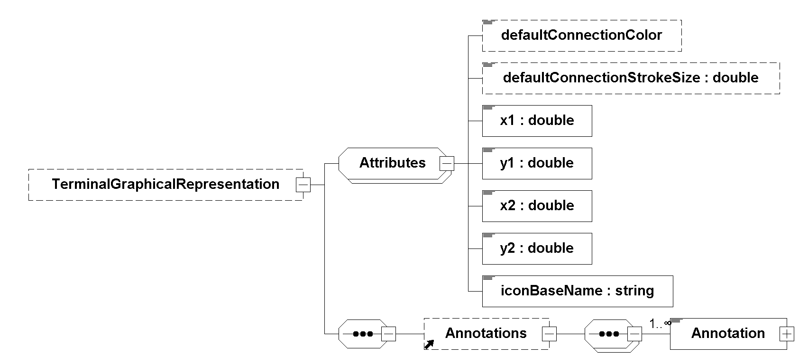

The `iconBaseName` attribute is mandatory.
This attribute defines the base name of the image file as a relative URI according to RFC 3986.
The base URI that this relative URI is resolved against is the URI of the `terminalsAndIcons/terminalsAndIcons.xml` file in the FMU ZIP archive.
Implementations are required to support relative URIs, excluding relative URIs that move beyond the baseURI (i.e. go "up" a level via ..).
Implementations are not required to support any absolute URIs and any specific URI schemes.
The PNG file with the extension '.png' has to be provided.
An additional SVG file with extension '.svg' is optional.

_[Note that this specification is functionally equivalent to looking up image sources from the `terminalsAndIcons` folder of the FMU ZIP archive after dot removal from the path as per section 5.2.4 of RFC 3986.]_

The `defaultConnectionStrokeSize` and `defaultConnectionColor` can be provided to define the intended connection line layout in the importer.
The stroke size is given relative to the coordinate system extent.
The stroke color is given in RGB values from 0 to 255. E.g.: `255 255 0`.

_[Nested terminals may have a `<TerminalGraphicalRepresentation>` element._
_However, if and how nested terminals are displayed, is up to the importer.]_

_[The order of painting of the `<TerminalGraphicalRepresentation>` of terminals on each level is equal to the order in the `<Terminal>` element._
_So graphical representations appearing first, are painted first, are behind graphical representations which appear below.]_

The `Annotations` element can be used by vendors to store additional information for the graphical representation.
_[It is suggested that Modelica tools store the Modelica annotation of the connector under the `type` `org.modelica.Modelica4Annotation` in the annotations of an element `connector`._
_The attribute `name` of the connector element is equal to the `name` attribute of the referenced `fmi3Terminal`.]_

_[If the graphical representation is used for an <<input>> or <<output>> (e.g. a `fmi3Float64` <<input>> `u`), then a `<Terminal>` has to be added to the `<Terminals>` element which has one `<TerminalMemberVariable>`.]_

====== General Remark on Signal [[GeneralRemarkOnSignal]]

_[The signal `variableKind` can be applied for different use cases._
_The first use case is a signal flow from an <<output>> of one FMU to an <<input>> of another FMU._
_The <<output>> value has to be forwarded to the <<input>>._

_The signal flow can cause algebraic loops._
_If variables in connected terminals have the <<causality>> <<output>>, then an importer may iterate an undefined <<input>> of an FMU to ensure that the connected output values are equal._

_Another use case is the parameter propagation._
_If a variable in both connected terminals has the <<causality>> <<parameter>>, then an importer could ask the user for the value of one of those <<parameter,`parameters`>> only, and propagate this value to the other FMU._
_If only one of the variables has <<causality>> <<parameter>>, and the other is a <<constant>> <<output>> or <<calculatedParameter>>, then the importer could also propagate the <<parameter>> value without presenting a parameter to the user._
_One example of use would be the name of a substance flowing through a pipe._
_If the fluid flows from one pipe FMU to another, the substance should be the same._
_This substance name could be propagated over several FMUs._

_Finally the `variableKind` `signal` can be applied to implement compatibility checks._
_If for example the <<variability>> of the variables in connected terminals are <<constant>>, then the importer can implement an equality assertion._
_This is also possible with <<calculated>> <<parameter,`parameters`>>._
_One example of use would be the cross sectional flow area in pipes which is calculated from geometry parameters._
_A change in the cross sectional flow area is relevant for the momentum equation, and therefore the connection has to be deemed incompatible if these variables are present and unequal.]_

====== General Remark on Inflow and Outflow

_[Flow variables have a direction and must fulfill a zero sum constraint i.e. the sum of all flow variables connected must be zero (Kirchhoff's current law)._
_In addition because different tools might have different direction definitions both, `inflow` and `outflow` are available as `variableKind`._
_For variables with `inflow` a positive value means that the flow is inwards, and for `outflow` a positive value means that the flow is outwards._
_For the sake of simplicity in the following latexmath:[\dot{m}_i] denotes an inflowing quantity:_

_latexmath:[0 = \sum{\dot{m}_i}]_

_[Connecting a single <<output>> `outflow` to a single <<input>> `inflow`, or vice versa automatically fulfills the flow constraint, while connecting two variables of the same flow type requires a negation of the variable value._

`inflow` _and_ `outflow` _is only used as a sign convention for scalar flow quantities which obey Kirchhoff's current law (sum up to zero)._
_Other, nonscalar, quantities which also sum up to zero, like a mechanical force in 3D space according to D'Alembert's principle, are not covered by this sign convention._
_This is the case since Kirchhoff's current law only holds for scalars where a sign convention is sufficient._
_Other definitions are beyond the scope of this terminal specification and need clear definition in other specifications on top of this.]_

==== Build Configurations [[BuildConfiguration,`<BuildConfiguration>`]]

Build configurations are defined in an optional XML file called `sources/buildDescription.xml`.
This file declares a root element <fmiBuildDescription> that has the following attributes and elements:

.fmiBuildDescription element and attributes details.
[cols="1,3",options="header"]
|===
|Attribute or Element
|Description

|`fmiVersion`
|This mandatory attribute declares the FMI version defining the XSD of the `sources/buildDescription.xml` file.
Starting with FMI 3.0, this `fmiVersion` attribute must match the `fmiVersion` attribute of element <<fmiModelDescription>> of the <<modelDescription.xml>> file.
If used in previous FMI versions, this attribute points to the FMI version defining this `sources/buildDescription.xml` file (e.g. XSD, file location).

|<<BuildConfiguration>>
|This element defines all the needed information for compiling and linking the binary part of the FMU for a specified target.
|===

The <fmiBuildDescription> element must contain at least one <<BuildConfiguration>> element.
Each <<BuildConfiguration>> provides the necessary information to compile and link the sources of the model into a dynamic library or as part of an executable.
An FMU importer may not regard more than one <<BuildConfiguration>> when building the FMU for a specific <<platform>>.
The importer chooses the matching <<BuildConfiguration>> based on the <<platform>> and <<modelIdentifier>> attributes.
_[On platforms that support shared libraries, executables should not be linked statically against or be compiled directly from the sources of an FMU in order to avoid name conflicts.]_

In order to avoid symbol name conflicts when compiling and linking multiple source code FMUs, source files should keep the exported symbols to a minimum by declaring all symbols not needed for linking as `static`.
If only a single <<SourceFile>> is provided in the <<BuildConfiguration>> all symbols except for the FMI functions should be defined as `static`.
This source file may include other source files that are not listed in the <<BuildConfiguration>>.
It is also recommended to use a descriptive name (e.g. `<model_identifier>.c`) for this single <<SourceFile>> instead of generic names (like `all.c`, or `model.c`) in order to aid readability and reduce integration effort.

.`fmiBuildDescription` element.
[[figure-fmiBuildDescription]]
image::images/schema/fmiBuildDescription.png[width=90%]

.BuildConfiguration attribute details.
[[table-BuildConfiguration-details]]
[cols="1,3a",options="header"]
|====
|Attribute
|Description

|`modelIdentifier`
|The attribute <<modelIdentifier>> of the `<ModelExchange>`, `<CoSimulation>` or `<ScheduledExecution>` elements this build configuration is associated with.

|`platform`
|[[platform,`platform`]]Platform tuple of the platform the <<BuildConfiguration>> is intended for (e.g. `x86_64-linux`).
This attribute is optional.
Thus there must not be more than one <<BuildConfiguration>> without a <<platform>> attribute.
If a <<BuildConfiguration>> without a <<platform>> attribute is provided this is the fallback <<BuildConfiguration>> an importer can use if it cannot find any other <<BuildConfiguration>> with a matching <<platform>> attribute.
_[A BuildDescription may contain multiple BuildConfigurations for the same <<platform>> to support e.g. different compilers._
_In this case the importer has to select the BuildConfiguration based on the other attributes of the BuildConfiguration and the contained SourceFileSets.]_

|`description`
|Description of the build configuration
|====

===== SourceFileSet

The `<SourceFileSet>` element groups source files that can be compiled with the same compiler and compiler options.
Every build configuration must contain at least one `<SourceFileSet>`.
An importer of the FMU has to process every `<SourceFileSet>` of the matching <<BuildConfiguration>>.

.`SourceFileSet` element.
[[figure-SourceFileSet]]
image::images/schema/SourceFileSet.png[width=60%]

.SourceFileSet attribute details.
[[table-SourceFileSet-details]]
[cols="1,3a",options="header"]
|====
|Attribute
|Description

|`name`
|<<uniqueNameAttribute,Unique>> name of the `<SourceFileSet>`

|`language`
|Language of the source files (e.g. `C99`, `C++11`)

|`compiler`
|The compiler to compile the sources (e.g. `VisualC`, `gcc`, `clang++`)

|`compilerOptions`
|The compiler flags that have to be used when compiling the sources (e.g. `-fno-rtti`, `/Od`)
|====

_[Please refer to the https://modelica.github.io/fmi-guides/main/fmi-guide/[FMI Implementer's Guide] for lists of commonly agreed upon language and compiler names.]_

===== SourceFile [[SourceFile,`<SourceFile>`]]

.`SourceFileSet` element.
[[figure-SourceFile]]
image::images/schema/SourceFile.png[width=50%]

.SourceFile attribute details.
[[table-SourceFile-details]]
[cols="1,3a",options="header"]
|====
|Attribute
|Description

|`name`
|Path of the source file relative to the `sources` directory.

|====

===== PreprocessorDefinition

The `<PreprocessorDefinition>` element defines a preprocessor definition that needs to be passed to the compiler when compiling the source files in the `<SourceFileSet>`.

.`PreprocessorDefinition` element.
[[figure-PreprocessorDefinition]]
image::images/schema/PreprocessorDefinition.png[width=60%]

.ProcessorDefintition attribute details.
[[table-ProcessorDefinition-details]]
[cols="1,3a",options="header"]
|====
|Attribute
|Description

|`name`
|Name of the preprocessor definition

|`value`
|Value of the preprocessor definition

|`optional`
|Determines whether the definition is optional (default is `false`)

|`description`
|Description of the preprocessor definition
|====

===== PreprocessorDefinition/Option

The `<Option>` element defines a possible value for the `<PreprocessorDefinition>`.
If a `<PreprocessorDefinition>` contains `<Option>` elements, its default value must be contained in the options.

.PreprocessorDefinition attribute details.
[[table-PreprocessorDefinition-details]]
[cols="1,3a",options="header"]
|====
|Attribute
|Description

|`value`
|Value of the preprocessor definition option

|`description`
|Description of the preprocessor definition option
|====

===== IncludeDirectory

The `<IncludeDirectory>` element defines the include directories that need to be passed to the compiler when compiling the source files in the `<SourceFileSet>`.

.`IncludeDirectory` element.
[[figure-IncludeDirectory]]
image::images/schema/IncludeDirectory.png[width=60%]

.IncludeDirectory attribute details.
[[table-IncludeDirectory-details]]
[cols="1,3a",options="header"]
|====
|Attribute
|Description

|`name`
|Path of the include directory relative to the `sources` directory
|====

_[Note that the header files `fmi3PlatformTypes.h` and `fmi3FunctionTypes.h/fmi3Functions.h` are not included in the FMU because:_

_pass:[]`fmi3PlatformTypes.h` makes no sense in the `sources` directory, because if sources are provided, then the importer defines this header file and not the FMU._ +
_This header file is not included in the `binaries` directory, because it is implicitly defined by the platform directory (for example, `x86-windows` for a 32-bit machine running Windows or `x86_64-linux` for a 64-bit machine running Linux)._

_pass:[]`fmi3FunctionTypes.h` / `fmi3Functions.h` are not needed in the `sources` directory, because they are implicitly defined by attribute `fmiVersion` in file <<modelDescription.xml>>._
_Furthermore, in order that the C compiler can check for consistent function arguments, the header file from the importer should be used when compiling the C sources._
_It would therefore be counter-productive (unsafe) if this header file was present._ +
_These header files are not included in the `binaries` directory, since they are already utilized to build the executable of the simulation environment._
_The version number of the header file used to construct the FMU can be deduced via attribute `fmiVersion` in file <<modelDescription.xml>> or via function call <<fmi3GetVersion>>.]_

===== Library

The `<Library>` element defines a static library required to link the model binary.
An importer of the FMU has to link every library of the matching <<BuildConfiguration>>.

.`Library` element.
[[figure-Library]]
image::images/schema/Library.png[width=50%]

.Library attribute details.
[[table-Library-details]]
[cols="1,3a",options="header"]
|====
|Attribute
|Description

|`name`
|Name of the library

|`version`
|Version specifier of the library as defined in https://www.python.org/dev/peps/pep-0440/#version-specifiers[PEP 440].
The characters `>` (greater-than) and `<` (less-than) must be escaped as `&gt;` and `&lt;`.
 _[For example `2.5`, `>=2.0,<3.0` or `>=1.0,!=1.2`]_.

|`external`
|Boolean attribute that determines whether the library is contained in the `binaries/<platform_tuple>` directory (`false`) or if it has to be provided by the environment (`true`).
The default is `false`.

|`description`
|Description of the library definition option
|====

===== Examples

.A minimal build configuration
[source, xml]
----
include::examples/build_description_simple.xml[]
----

.Multiple complex build configurations
[source, xml]
----
include::examples/build_description_complex.xml[]
----
