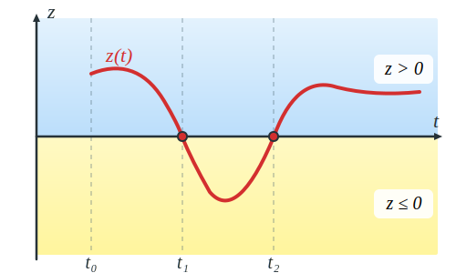
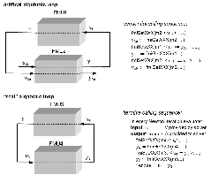
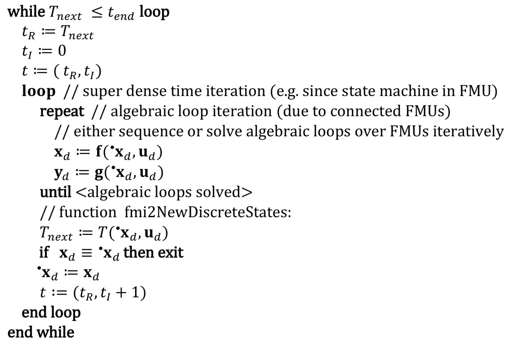

=== Mathematical description

The goal of the Model Exchange interface is to numerically solve a system of differential,
algebraic and
discrete-time equations.
In this version of the interface,
ordinary differential equations in state-space
form with events are handled (abbreviated as "hybrid ODE").
Algebraic equation systems might be
contained inside the FMU.
Also, the FMU might consist of discrete-time equations only,
for example, describing a sampled-data controller.

The independent variable time latexmath:[t \in \mathbb{T}] is a tuple
latexmath:[t = (t_R,t_I)], where latexmath:[t_R \in \mathbb{R},\ t_{I} \in \mathbb{N} = \{0, 1, 2, \ldots\}].
The real part latexmath:[t_R] of this tuple is the independent variable of the FMU for describing the continuous-time behavior of the model between events.
In this phase latexmath:[t_I = 0].
The integer part latexmath:[t_I] of this tuple is a counter to enumerate (and therefore distinguish) the events at the same continuous-time instant latexmath:[t_R].
This time definition is also called "super dense time" in literature,
see, for instance, (Lee and Zheng 2007).
An ordering is defined on latexmath:[\mathbb{\text{T}}] leading to the following notation
footnote:[The notation latexmath:[^{\bullet}t] is from (_Benveniste et.al. 2010_)
adapted from non-standard analysis to super-dense time,
in order to precisely define the value from the previous event iteration.]:

[cols="1,7,4"]
|====
|_Operation_
|_Mathematical meaning_
|_Description_

^|latexmath:[t_1 < t_2]
|latexmath:[(t_{R1},t_{I1}) < (t_{R2}, t_{I2})\ \Leftrightarrow \ t_{R1} < t_{R2}\ \textbf{or} \ t_{R1}= t_{R2} \ \textbf{and} \ t_{I1} < t_{I2}]
|latexmath:[t_1] is before latexmath:[t_2]

^|latexmath:[t_1 = t_2]
|latexmath:[(t_{R1},t_{I1}) = (t_{R2},t_{I2}) \ \Leftrightarrow  t_{R1}= t_{R2}\ \textbf{and} \ t_{I1} = t_{I2}]
|latexmath:[t_1] is identical to latexmath:[t_2]

^|latexmath:[t^{+}]
|latexmath:[{{(t}_{R},t_{I})}^{+} \Leftrightarrow (\lim_{\epsilon \rightarrow 0}{\left(t_{R} + \varepsilon \right),t_{Imax})}]
|right limit at latexmath:[t].
latexmath:[t_{Imax}] is the largest occurring Integer index of super dense time

^|latexmath:[^-t]
|latexmath:[^{-}{{(t}_{R},t_{I})} \Leftrightarrow (\lim_{\epsilon \rightarrow 0}{\left( t_{R} - \varepsilon \right),0)}]
|left limit at latexmath:[t]

^|latexmath:[^{\bullet}t]
|latexmath:[^{\bullet}{\left( t_{R},t_{I} \right)\ } \Leftrightarrow \left\{ \begin{matrix} ^-t \ & \mathbf{if} \ t_I = 0 \\ (t_R, t_I - 1) \ & \mathbf{if} \ t_I > 0 \\ \end{matrix} \right.]
|previous time instant (= either left limit or previous event instant).

^|latexmath:[v^+]
|latexmath:[v(t^+)]
|value at the right limit of latexmath:[t]

^|latexmath:[^{-}v]
|latexmath:[v(^-t)]
|value at the left limit of latexmath:[t]

^|latexmath:[^{\bullet}v]
|latexmath:[v(^{\bullet}t)]
|previous value (= either left limit or value from the previous event)
|====

_[Assume that an FMU has an event at latexmath:[t_R=2.1s] and here a signal changes discontinuously.
If no event
iteration occurs,
the time instant when the event occurs is defined as (2.1, 0),
and the time instant whenthe integration is restarted is defined as (2.1, 1).]_

The hybrid ODEs supported by FMI are described as [underline]#piecewise continuous-time systems#.
Discontinuities
can occur at time instants latexmath:[t_0, t_1, \ldots, t_n] where latexmath:[t_i < t_{i+1}].
These time instants are called "events".
Events can
be known before hand (= time event),
or are defined implicitly (= state and step events), see below.
Between events, variables are either continuous or do not change their value.
A variable is called
discrete-time, if it changes its value only at an event instant.
Otherwise the variable is called continuoustime.
Only real variables can be continuous-time.
The following variable indices are used to describe the timing behavior of the corresponding variable
(for example, 𝑣𝑑 is a discrete-time variable).

[cols="1,10"]
|====
|_Index_
|_Description_

|c
|A *continuous-time* variable,
that is, a variable that is a continuous function of time inside each interval latexmath:[t_i^+ < \ ^-t_{i+1}]

|d
|A *discrete-time* variable,
that is, a variable that changes its value only at an event instant latexmath:[t_i].

|c+d
|A set of *continuous-time* and *discrete-time* variables
|====

At every event instant latexmath:[t_i], variables might be discontinuous (see Figure 3).

.Piecewise-continuous variables of an FMU: continuous-time (latexmath:[v_c]) and discrete-time (latexmath:[v_d]).
[caption="Figure 3: "]
image::images/PieceWiseContinuousVariables.svg[width=60%]

An [underline]#event instant# latexmath:[t_i] is defined by one of the following conditions that give the smallest time instant:

. The environment of the FMU triggers an event at the current time instant because at least one discrete-time input changes its value,
a continuous-time input has a discontinuous change,
or a tunable parameter changes its value.
Such an event is called [underline]#external event#.
 _[Note that if an FMU A is connected to an FMU B, and an event is triggered for A,
 then potentially all outputs of A will be discontinuous at this time instant.
 It is therefore adviceable to trigger an external event for B at this time instant too,
 if an output of A is connected to B.
 This means to call `fmi2EnterEventMode` on B.]_ +
All the following events are internal events.

. At a predefined time instant latexmath:[t_i=(T_{next}(t_{i-1}, 0)]
that was defined at the previous event instant ti-1 by the FMU.
Such an event is called [underline]##time event##.

. At a time instant,
where an [underline]#event indicator# latexmath:[z_j(t)] changes its domain from latexmath:[z_j > 0] to latexmath:[z_j \leq 0] or from latexmath:[z_j \leq 0] to latexmath:[z_j > 0] (see Figure 4 below).
More precisely: An event latexmath:[t = t_i] occurs at the smallest time instant "min t" with latexmath:[t>t_{i-1}] where "latexmath:[(z_j(t)>0) \ne (z_j(t_{i-1}) >0)]".
Such an event is called [underline]#state event#
footnote:[This definition is slightly different from the standard definition of state events: "latexmath:[z_j(t) \cdot z_j(t_{i-1}) \leq 0]".
This often used definition has the
severe drawback that latexmath:[z_j(t_{i-1}) \ne 0] is required in order to be well-defined and this condition cannot be guaranteed.].
All event indicators are piecewise continuous and are collected together in one vector of real numbers latexmath:[\mathbf{z(t)}]. +

.An event occurs when the event indicator changes its domain from latexmath:[z>0] to latexmath:[z\leq 0] or vice versa.
[caption="Figure 4: "]

[start=4]
. At every completed step of an integrator,
`fmi2CompletedIntegratorStep` must be called (provided the capability flag `ModelDescription.completedIntegratorStepNotNeeded = false`).
An event occurs at this time instant,
if indicated by the return argument `enterEventMode = fmi2True`.
Such an event is called [underline]#step event#.
_[Step events are,
for example, used to dynamically change the (continuous) states of a model internally in the FMU,
because the previous states are no longer suited numerically.]_

An FMI Model-Exchange model is described by the following variables:

[cols="1,10"]
|====
^|_Variable_
|_Description_

^|latexmath:[t]
|Independent variable time latexmath:[\in \mathbb{T}].
(Variable defined with `causality = "independent"`).

^|latexmath:[v]
|A vector of all exposed variables (all variables defined in element `<ModelVariables>`,
see section 2.2.7).
A subset of the variables is selected via a subscript.
Example: latexmath:[\mathbf{v}_{initial=exact}] are variables defined with attribute `initial ="exact"` (see section 2.2.7).
These are independent parameters and startvalues of other variables,
such as initial values for states, state derivatives or outputs.

^|latexmath:[\mathbf{p}]
|Parameters that are constant during simulation.
The symbol without a subscript references independent parameters (variables with `causality = "parameter"`).
Dependent parameters (variables with `causality = "calculatedParameter"`) are denoted as latexmath:[\mathbf{p}_{calculated}].

^|latexmath:[\mathbf{u}(t)]
|Input variables.
The values of these variables are defined outside of the model.
Variables of this type are defined with attribute `causality = "input"`.
Whether the input is a discrete-time or continuous-time variable is defined
via attribute `variability = "discrete"` or `"continuous"` (see section 2.2.7).

^|latexmath:[\mathbf{y}(t)]
|Output variables.
The values of these variables are computed in the FMU and they are designed to be used in a model connection.
For instance, output variables might be used in the environment as input values to other FMUs or other submodels.
Variables of this type are defined with attribute `causality = "output"`.
Whether the output is a discrete-time or continuous-time variable is defined
via attribute `variability = "discrete"` or `"continuous"` (see section 2.2.7).

^|latexmath:[\mathbf{w}(t)]
|Local variables of the FMU that cannot be used for FMU connections.
Variables of this type are defined with attribute `causality = "local"`, see section 2.2.7.

^|latexmath:[\mathbf{z}(t)]
|A vector of real continuous-time variables utilized to define state events, see below.

^|latexmath:[\mathbf{x}_c(t)]
|A vector of real continuous-time variables representing the continuous-time states.
For notational convenience,
a continuous-time state is conceptually treated as a different type of variable as an output or a local variable for the mathematical description below.
In reality, a continuous-time state is however part of the outputs latexmath:[\mathbf{y}] or the local variables latexmath:[\mathbf{w}] of an FMU.

^|latexmath:[\mathbf{x}_d(t)] +
latexmath:[^{\bullet}\mathbf{x}_d(t)]
|latexmath:[\mathbf{x}_d(t)] is a vector of (internal) discrete-time variables (of any type) representing the discrete states. +
latexmath:[{}^{\bullet}\mathbf{x}_d(t)] a is the value of latexmath:[\mathbf{x}_d(t)] at the previous super dense time instant,
so latexmath:[{}^{\bullet}\mathbf{x}_d(t)=\mathbf{x}_d({}^{\bullet}t)].
Given the previous values of the discrete-time states,
latexmath:[{}^{\bullet}\mathbf{x}_d(t)], at the actual time instant latexmath:[t],
all other discrete-time variables,
especially the discrete states latexmath:[\mathbf{x}_d(t)], can be computed. +
Discrete states are not visible in the interface of an FMU and are only introduced here to clarify the mathematical description.
Formally, a discrete state is part of the outputs latexmath:[\mathbf{y}] or the local variables latexmath:[\mathbf{w}] of an FMU.

^|latexmath:[T_{next}(t_{i})]
|At initialization or at an event insant,
an FMU can define the next time instant latexmath:[T_{next}],
at which the next event occurs (see also the definition of events above).
Every event removes automatically a previous definition of latexmath:[T_{next}],
and it must be explicitly defined again,
if a previously defined latexmath:[T_{next}] was not triggered at the current event instant.

^|latexmath:[\mathbf{r}(t_i)]
|A vector of Boolean variables with latexmath:[r_{i} := z_{i} > 0].
When entering Continuous-Time Mode all relations reported via the event indicators latexmath:[\mathbf{z}] are fixed and during this Mode these relations are replaced by latexmath:[\mathbf{r}].
Only during Initialization or Event Mode the domains latexmath:[z_{i} > 0] can be changed.
For notational convenience,
latexmath:[\mathbf{r} := \mathbf{z} > 0]is an abbreviation for latexmath:[\mathbf{r}:=\{z_1>0, z_2>0, \ldots \}].
_[For more details, see "Remark 3" below.]_
|====

Computing the solution of an FMI model means to split the solution process in different phases, and in
every phase different equations and solution methods are utilized.
The phases can be categorized
according to the following modes:

. *Initialization Mode:* +
This mode is used to compute at the start time stem[t_0] initial values for continuous-time states,
latexmath:[\mathbf{x}_c(t_0)],
and for the previous (internal) discrete-time states,
latexmath:[\mathbf{x}_d(t_0)],
by utilizing extra equations not present in the other modes (for example, equations to define the start value for a state or for the derivative of a state).

. *Continuous-Time Mode:* +
This mode is used to compute the values of all (real) continuous-time variables between events by numerically solving ordinary differential and algebraic equations.
All discrete-time variables are fixed during this phase and the corresponding discrete-time equations are not evaluated.

. *Event Mode:* +
This mode is used to compute new values for all continuous-time variables,
as well as for all discrete-time variables that are activated at the current event instant latexmath:[t],
given the values of the variables from the previous instant latexmath:[{}^{\bullet}t].
This is performed by solving algebraic equations consisting
of all continuous-time and all active discrete-time equations.
In FMI 2.0 there is no mechanism that the FMU can provide the information whether a discrete-time variable is active or is not active (is not computed) at an event instant.
Therefore, the environment has to assume that at an event instant always all discrete-time variables are computed,
although internally in the FMU only a subset might be newly computed.

When connecting FMUs together,
loop structures can occur that lead to particular difficulties because
linear or non-linear algebraic systems of equations in Real variables but also in Boolean or Integer
variables might be present.
In order to solve such systems of equations over FMUs efficiently,
the dependency information is needed stating,
for example, which outputs depend directly on inputs.
This data is optionally provided in the XML file under element `<ModelStructure>`.
If this data is not provided,
the worst case must be assumed
(for example, all output variables depend algebraically on all input variables).

_[Example: In Figure 5 two different types of connected FMUs are shown (the "dotted lines" characterize the dependency information):_

.Calling sequences for FMUs that are connected in a loop.
[caption="Figure 5: "]

_In the upper diagram, FMU1 and FMU2 are connected in such a way that by an appropriate sequence of `fmi2SetXXX` and `fmi2GetXXX` calls, the FMU variables can be computed.
In the lower diagram, FMU3 and FMU4 are connected in such a way that a "real" algebraic loop is present.
This loop might be solved iteratively with a Newton method.
In every iteration the iteration variable u~4~ is
provided by the solver, and via the shown sequence of `fmi2SetXXX` and `fmi2GetXXX` calls, the residue is computed and is provided back to the solver.
Based on the residue a new value of u~4~ is provided.
The iteration is terminated when the residue is close to zero.
These types of artifical or real algebraic loops can occur in all the different modes,
such as Initialization Mode,
Event Mode, and Continuous-Time Mode.
Since different variables are computed in every Mode and the causality of variable computation can be different in Initialization Mode as with respect to the other two
Modes, it might be necessary to solve different kinds of loops in the different Modes.]_

In Table 1 the equations are defined that can be evaluated in the respective Mode.
The following color coding is used in the table:

* [silver]#*grey*#: If a variable in an argument list is marked in [silver]#grey#,
then this variable is not changing in this mode and just the last calculated value from the previous mode is internally used.
For an input argument, it is not allowed to call `fmi2SetXXX`.
For an output argument,
calling `fmi2GetXXX` on such a variable returns always the same value in this mode.
* [lime]#*green*#: Functions marked in [lime]#green# are special functions to enter or leave a mode.
* [blue]#*blue*#: Equations and functions marked in [blue]#blue# define the actual computations to be performed in the respective mode.

Function `fmi2SetXXX` is an abbreviation for functions `fmi2SetReal`, `fmi2SetBoolean`,
`fmi2SetInteger` and `fmi2SetString` respectively.
Function `fmi2GetXXX` is an abbreviation for functions `fmi2GetReal`, `fmi2GetBoolean`,
`fmi2GetInteger` and `fmi2GetString` respectively.

_[In the following table the setting of the super dense time, (t~R~, t~I~),
is precisely described.
Tools will usually not have such a representation of time.
However, super-dense time defines precisely when a new "model evaluation" starts
and therefore which variable values belong to the same "model evaluation" at
the same (super dense) time instant and should be stored together.]_

[caption="Table 1: "]
.Mathematical description of an FMU for Model Exchange.
[cols="5,3"]
|====
|*Equations*| *FMI functions*
2+| *_Equations before Initialization Mode_*
|Set independent variable time latexmath:[T_{R0}] and define latexmath:[t_0 := (t_{R0},0)]|`fmi2SetupExperiment`
|Set variables latexmath:[\mathbf{v}_{initial=exact}] and latexmath:[\mathbf{v}_{initial=approx}]  that have a start value (`initial` = `"exact"` or `"approx`") |`fmi2SetXXX`
2+|*_Equations during Initialization Mode_*
|[lime]#Enter Initialization Mode at latexmath:[t=t_0] (activate initialization,
discrete-time and continuous-time equations)#| `[lime]#fmi2EnterInitializationMode#`
|Set variables latexmath:[\mathbf{v}_{initial=exact}] that have a start value with
`initial="exact"` (independent parameters latexmath:[\mathbf{p}] and
continuous-time states with start values latexmath:[\mathbf{x_c}],
initial=exact_~ are included here) | `fmi2SetXXX`
|Set continuous-time and discrete-time inputs latexmath:[\mathbf{u}(\color{grey}t_{\color{grey} 0})]| `fmi2SetXXX`
|[blue]#latexmath:[\mathbf{v}_{initialUnknowns}:=f_{init}(\mathbf{u_c}, \mathbf{u_d}, \color{grey}t_{\color{grey} 0}, \mathbf{v}_{initial=exact}])# | `[blue]#fmi2GetXXX#`, `[blue]#fmi2GetContinuousStates#`,
`[blue]#fmi2GetEventIndicators#`
|[lime]#Exit Initialization Mode (de-activate initialization equations)#| `[lime]#fmi2ExitInitializationMode#`
2+|*_Equations during Event Mode_*
|[lime]#Enter Event Mode at latexmath:[t = t_{i}] with latexmath:[{t_{i}\ : = (t}_{R},t_{I} + 1)] *if*  _externalEvent_ *or* _nextMode_ latexmath:[\equiv] _EventMode_ *or* latexmath:[t_i=(T_{next}(t_{i-1}), 0)] *or*  latexmath:[\min_{t>t_{i-1}} t:\left\lbrack z_{j}\left( t \right) > 0\  \neq \ z_{j}\left( t_{i - 1} \right) > 0 \right\rbrack] +
(activate discrete-time equations)#|
`[lime]#fmi2EnterInitializationMode#` [lime]#(only from Continuous-Time Mode or after calling# `[lime]#fmi2SetTime#`
[lime]#if FMU has no continuous-time equations)#
|Set independent tunable parameters latexmath:[\mathbf{p}_{tune}] +
(and do not set other parameters latexmath:[\mathbf{p}_{other}])
|`fmi2SetXXX`

|Set continuous-time and discrete-time inputs latexmath:[\mathbf{u}(t_i)]|`fmi2SetXXX`

|[blue]#latexmath:[(\mathbf{y}_{c+d}, \mathbf{\dot{x}}_c, \mathbf{w}_{c+d}, \mathbf{z}, \mathbf{x}_{c, reinit})=\mathbf{f}_{sim}(\mathbf{x_c}, \mathbf{u_{c+d}}, \color{grey}t_{\color{grey} i}, \mathbf{p}_{tune}, \color{grey}{\mathbf{p}_{other})}]#  +
latexmath:[\mathbf{f}_{sim}]is also a function of the internal variables  latexmath:[{}^\bullet\mathbf{x}_d] | `[blue]#fmi2GetXXX#`,
`[blue]#fmi2GetContinuousStates#`,
`[blue]#fmi2GetDerivatives#`,
`[blue]#fmi2GetEventIndicators#`

|[lime]#Increment super dense time and define with#
`[lime]#newDiscreteStatesNeeded#` [lime]#whether a new event iteration is required.# +
[blue]#latexmath:[\qquad]*if not*# `[blue]#newDiscreteStatesNeeded#`[blue]#*then* +
latexmath:[\qquad \qquad T_{next}=T_{next}(\mathbf{x}_c,{}^\bullet\mathbf{x}_d, \mathbf{u_{c+d}}, \color{grey}t_{\color{grey} i}, \mathbf{p}_{tune}, \color{grey}{\mathbf{p}_{other})}]# +
[blue]#latexmath:[\qquad]*end if*# +
[blue]#latexmath:[\qquad t:=t(t_R, t_i+1)]# +
[blue]#latexmath:[\qquad {}^\bullet\mathbf{x}_d:=\mathbf{x}_d]#
|`[lime]#fmi2NewDiscreteState#`
|Set independent variable time latexmath:[t_i := (T_{next},0)]| `fmi2SetTime` +
(if no continuous-time equations)
2+|*_Equations during Continuous-Time Mode_*
|[lime]#Enter Continuous-Time Mode:# +
[lime]#latexmath:[\qquad \textrm{// de-activate discrete-time equations}]# +
[lime]#latexmath:[\qquad \textrm{// "freeze" variables:}]# +
[lime]#latexmath:[\qquad \mathbf{r} := \mathbf{z}>0 \qquad \textrm{//all relations}]# +
[lime]#latexmath:[\qquad \textbf{x}_d, \textbf{w}_d \qquad \textrm{//all discrete-time variables}]# +
|`[lime]#fmi2EnterContinuousTimeMode#`

|Set independent variable time latexmath:[t(>t_{enter  mode}): t:=(t_R, 0)]|`fmi2SetTime`

|Set continuous-time inputs latexmath:[\mathbf{u}_{c}(t)]
|`fmi2SetXXX`

|Set continuous-time states latexmath:[\mathbf{x}_{c}(t)] |`fmi2SetXXX`,
`fmi2SetContinuousStates`

a|[blue]#latexmath:[(\mathbf{y}_{c}\mathbf{,} \color{grey}{\mathbf{y}_{d}}\mathbf{,\ }{\dot{\mathbf{x}}}_{c}\mathbf{,}_{}\mathbf{w}_{c}\mathbf{,}\color{grey}{\mathbf{w}_{d}}\mathbf{,z,}\color{grey}{\mathbf{x}_{c,reinit}}):=\mathbf{f}_{sim}(\mathbf{x}_{c},\ \mathbf{u}_{c}\mathbf{,} \color{grey}{\mathbf{\ u}_{d}}, t,\color{grey}{\mathbf{p}_{tune},\mathbf{p}_{other}})]# +
[blue]#latexmath:[\qquad \mathbf{f}_{sim}] is also a function of the internal variables# [silver]#latexmath:[{}^\bullet\mathbf{x}_{d},\mathbf{r}].#
 a|
`[blue]#fmi2GetXXX,#`
`[blue]#fmi2GetDerivatives,#`
`[blue]#fmi2GetEventIndicators#`

|[lime]#Complete integrator step and return _enterEventMode_#
|`[lime]#fmi2CompletedIntegratorStep#`

2+|*Data types*

2+|latexmath:[t \in \mathbb{R}, \mathbf{p} \in \mathbb{P}^{np},  \mathbf{u}(t) \in \mathbb{P}^{nu},\mathbf{y}(t) \in \mathbb{P}^{ny}, \mathbf{x}_c(t) \in \mathbb{R}^{nxc}, \mathbf{x}_d(t) \in \mathbb{P}^{nxd}, \mathbf{w}(t) \in \mathbb{P}^{nw}, \mathbf{z}(t) \in \mathbb{R}^{nz}] +
latexmath:[\qquad \mathbb{R}]: Real variable, latexmath:[\mathbb{P}]: real *or* boolean *or* integer *or* enumeration *or* string variable +
latexmath:[\mathbf{f}_{init}, \mathbf{f}_{sim} \in C^0] (=continuous functions with respect to all input arguments inside the respective mode).
|====

_[Remark 1 - Calling Sequences:_

_In the table above, for notational convenience in every Mode one function call is defined to compute all output arguments from all inputs arguments.
In reality, every scalar output argument is computed by one
`fmi2GetXXX` function call.
Additionally, the output argument need not be a function of all input arguments,
but of only a subset from it, as defined in the XML file under_ `<ModelStructure>`.
_This is essential when FMUs are connected in a loop,
as shown in_ Figure 6: _For example, since_ latexmath:[y_{2a}] _depends only on_
latexmath:[u_{1a}] _, but not on_ latexmath:[u_{1b}]_, it is
possible to call_ `fmi2SetXXX` _to set_ latexmath:[u_{1a}] _,
and then inquire_ latexmath:[y_{2a}] _with_ `fmi2GetXXX` _without setting_ latexmath:[u_{1b}] _beforehand._

_It is non-trivial to provide code for `fmi2SetXXX`, `fmi2GetXXX`,
if the environment can call_ `fmi2SetXXX` _on the inputs in quite different orders.
A simple remedy is to provide the [underline]#dependency information#, not according to the "real" functional dependency,
but according to the [underline]#sorted equations in the generated code#.
Example:_

Assume an FMU is described by the following equations
(`u1`, `u2` are inputs, `y1`, `y2` are outputs,`w1`, `w2` are internal variables):
-----
w1 = w2 + u1
w2 = u2
y1 = w1
y2 = w2
-----
Sorting of the equations might result in (this ordering is not unique):
-----
w2 := u2
y2 := w2
w1 := w2 + u1
y1 := w1
-----
With this ordering, the dependency should be defined as `y2 = f(u2), y1 = f(u1,u2)`.
When `y2` is called first with `fmi2GetXXX`,
then only `u2` must be set first (since `y2 = f(u2)`),
and the first two equations are evaluated.
If later `y1` is inquired as well,
then the first two equations are not evaluated
again and only the last two equations are evaluated.
On the other hand,
if `y1` is inquired first,
then `u1` and `u2` must be set first (since `y1 = f(u1,u2)`) and then all equations are computed.
When `y2` is inquired afterwards,
the cached value is returned.

If sorting of the equations in this example would instead result in the following code:
----
w2 := u2
w1 := w2 + u1
y1 := w1
y2 := w2
----
then the dependency should be defined as `y2 = f(u1,u2)`,
`y1 = f(u1,u2)`, because `u1` and `u2` must be first set,
before `y2` can be inquired with `fmi2GetXXX` when executing this code.

_Remark 2 - Mathematical Model of Discrete-Time FMUs:_

_There are many different ways discrete-time systems are described.
For FMI, the following basic mathematical model for discrete-time systems is used
(other description forms must be mapped, as sketched below):_

_At an event instant,
the discrete system is described by algebraic equations as function of the previous (internal) discrete-time states_ latexmath:[_{‍}^{\bullet}\mathbf{x}_{d}] _and the discrete-time inputs_ latexmath:[\mathbf{u}_{d}]__.
If FMUs are connected in a loop, these algebraic equations are called iteratively,
until the solution is found.
If the actual discrete-time states__ latexmath:[\mathbf{x}_{d}] __and the previous discrete-time states__ latexmath:[_{‍}^{\bullet}\mathbf{x}_{d}] _are not identical,
the discrete-time states are updated,
the Integer part of the time is incremented and a new event iteration is performed.
Other discrete-time models must be mapped to this description form.
Examples:_

- _Synchronous systems:_ +
_A synchronous system,
such as Lucid Synchrone (Pouzet 2006) or Modelica 3.3 (Modelica 2012),
is called periodically, and at every sample instant the discrete-time equations are evaluated exactly once.
An FMU of this type can be implemented by activating the model equations only at the first event iteration and returning always `newDiscreteStatesNeeded = false` from `fmi2NewDiscreteStates`.
Furthermore, the discrete-time states are not updated by `fmi2NewDiscreteStates`,
but as first action before the discrete-time equations are evaluated,
in order that_ latexmath:[^{\bullet}\mathbf{x}_d] _(= value at the previous clock tick) and_ latexmath:[\mathbf{x}_d] _(value at the latest clock tick) have reasonable values between clock ticks._

- _State machines with one memory location for a state:_ +
_In such a system there is only one memory location for a discrete-time state and not two,
and therefore a discrete-time state is updated in the statement where it is assigned (and not in `fmi2NewDiscreteStates`).
As a result,
`fmi2NewDiscreteStates` is basically just used to start a new (super dense) time instant.
This is unproblematic, as long as no algebraic loops occur.
FMUs of this type can therefore not be used in "real" algebraic loops if the involved variables depend on a discrete-time state.
This restriction is communicated to the environment of the FMU by the `ScalarVariable` definition of the corresponding input with flag `canHandleMultipleSetPerTimeInstant = false` (so an input with this flag is not allowed to be called in an algebraic loop)._

_Remark 3 - Event Indicators / Freezing Relations:_

_In the above table, vector_ *r* _is used to collect all relations together that are utilized in the event indicators_ **z** _.
In Continuous-Time Mode all these relations are "frozen" and do not change during the evaluations in the respective Mode.
This is indicated in the table above by computing__ *r* _when entering the Continuous-Time Mode and providing_ *r* _as (internal) input argument to the evaluation functions.
Example:_

_An equation of the form_

----
y = if x1 > x2 or x1 < x3 then +1 else -1;
----

_can be implemented in the FMU as:_

----
z1 := x1 - x2;
z2 := x3 - x1;
if InitializationMode or EventMode then
  r1 := z1 > 0;
  r2 := z2 > 0;
end if;
y = if r1 or r2 then +1 else -1
----

_Therefore,
the original if-clause is evaluated in this form only during Initialization and Event Mode.
In Continuous-Time Mode this equation is evaluated as:_

----
z1 = x1 - x2;
z2 = x3 - x1
y = if r1 or r2 then +1 else -1;
----

_and when entering Continuous-Time Mode r1 and r2 are computed as_

----
r1 = z1 > 0
r2 = z2 > 0
----

_When z1 changes from z1 > 0 to z1 <= 0 or vice versa, or z2 correspondingly,
the integration is halted, and the environment must call `fmi2EnterEventMode`._

_An actual implementation will pack the code in an impure function,
say Greater(...), resulting in:_

----
y = if Greater(x1-x2,...) or Greater(x3-x1,...) then +1 else -1;
----

_Furthermore, a hysteresis should be added for the event indicators._

_Remark 4 - Pure Discrete-Time FMUs:_

_If an FMU has only discrete-time equations (and no variables with `variability = "continuous"`),
then the environment need not call `fmi2EnterContinuousTimeMode` but can directly call
`fmi2SetTime` to set the value of the next event instant,
before `fmi2EnterEventMode` is called.
*This is an optional optimization for the master, the FMU must support all functions that are required for a continuous time FMU and should run in a master that treats it as such.*
If a Pure Discrete time FMU has state events and uses crossing functions, it has to enter continuousTimeMode to evaluate these.
In fact it is no longer a Pure Discrete time FMU but this was not clearly defined in 2.0 so this clarification is needed for 2.0.1]_

An FMU is initialized in Initialization Mode with latexmath:[\mathbf{f}_{init}(\ldots)].
The input arguments to this function consist of the input variables (= variables with `causality = "input"`),
of the independent variable (= variable with `causality = "independent"`; usually the default value `"time"`), and of all variables that have a start value with (explicitly or implicitly) `initial = "exact"` in order to compute the continuous-time states and the output variables at the initial time latexmath:[t_0].
In the above table,
the variables with `initial = "exact"` are collected together in variable latexmath:[\mathbf{v}_{initial=exact}].
For example, initialization might be defined by providing initial start values for the states,
latexmath:[\mathbf{x}_{c0}],
or by stating that the state derivatives are zero (latexmath:[\dot{\mathbf{x}}_{c} = \mathbf{0}]).
Initialization is a difficult topic by itself, and it is required that an FMU solves a well-defined initialization problem inside the FMU in Initialization Mode. +
After calling `fmi2ExitInitializationMode`, the FMU is implicitly in Event Mode, and all discrete-time and continuous-time variables at the initial time instant latexmath:[(t_R, 0)] can be calculated.
If these variables are present in an algebraic loop,
iteration can be used to compute them.
Once finalized, `fmi2NewDiscreteStates` must be called,
and depending on the value of the return argument,
the FMU either continues the event iteration at the initial time instant or switches to Continuous-Time Mode. +
After switching to Continuous-Time Mode, the integration is started.
Basically, in this phase the derivatives of the continuous states are computed.
If FMUs and/or submodels are connected together,
then the inputs of these models are the outputs of other models, and therefore, the corresponding FMU outputs must be computed.
Whenever result values shall be stored,
usually at output points defined before the start of the simulation,
the `fmi2GetXXX` function with respect to the desired variables must be called. +
Continuous integration is stopped at an event instant.
An event instant is determined by a time,
state or step event, or by an external event triggered by the environment.
In order to determine a state event,
the event indicators *z* have to be inquired at every completed integrator step.
Once the event indicators signal a change of their domain,
an iteration over time is performed between the previous and the actual completed integrator step,
in order to determine the time instant of the domain change up to a certain precision. +
After an event is triggered,
the FMU needs to be switched to Event Mode.
In this mode, systems of equations over connected FMUs might be solved (similarily as in Continuous-Time Mode).
Once convergence is reached,
`fmi2NewDiscreteStates(..)` must be called to increment super dense time (and conceptually update the discrete-time states defined internally in the FMU by latexmath:[^{\bullet}\mathbf{x}_d := \mathbf{x}_d]).
Depending on the discrete-time model,
a new event iteration might be needed
(for example, because the FMU describes internally a state machine
and transitions are still able to fire,
but new inputs shall be taken into account). +
The function calls in the table above describe precisely
which input arguments are needed to compute the desired output argument(s).
There is no 1:1 mapping of these mathematical functions to C functions.
Instead, all input arguments are set with `fmi2SetXXX(..)` C function calls, and then the result argument(s) can be determined with the C functions defined in the right column of the above table.
This technique is discussed in detail in section 3.2.1.
_[In short:
For efficiency reasons,
all equations from the table above will usually be available in [underline]#one# (internal) C function.
With the C functions described in the next sections,
input arguments are copied into the internal model data structure only when their value has changed in the environment.
With the C functions in the right column of the table above,
the internal function is called in such a way
that only the minimum needed equations are evaluated.
Hereby, variable values calculated from previous calls can be reused.
This technique is called "caching" and can significantly enhance the simulation efficiency of real-world models.]_
