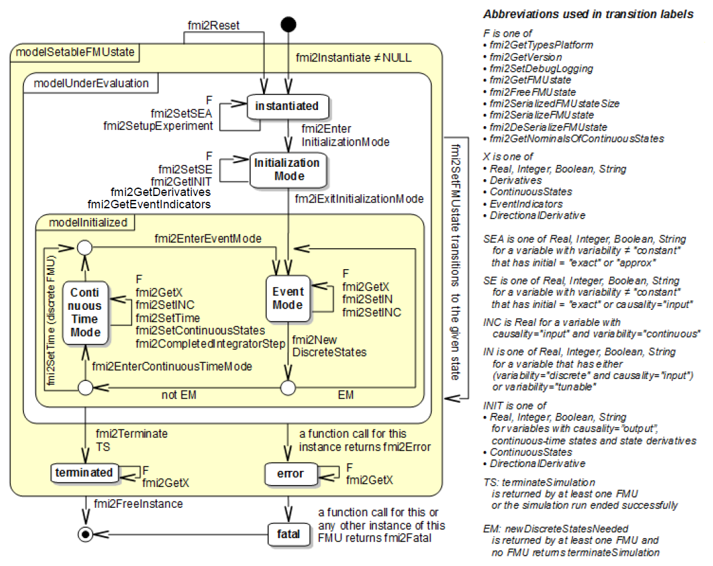

=== FMI Application Programming Interface

This section contains the interface description to evaluate different model parts from a C program.

==== Providing Independent Variables and Re-initialization of Caching

Depending on the situation,
different variables need to be computed.
In order to be [underline]#efficient#,
it is important that the interface requires only the [underline]#computation# of variables that are needed in the [underline]#present  context#.
For example, during the iteration of an integrator step,
only the state derivatives need to be computed,
provided the output of a model is not connected.
It might be that at the same time instant other variables are needed.
For example, if an integrator step is completed,
the event indicator functions need to be computed as well.
If the state derivatives have already been computed at the present time instant,
then it is important for efficiency that they are not newly computed
in the call to compute the event indicator functions.
This means, the state derivatives shall be reused from the previous call.
This feature is called "[underline]#caching of variables#" in the sequel. +
Caching requires that the model evaluation can detect when the input arguments,
like time or states, have changed.
This is achieved by setting them explicitly with a function call,
since every such function call signals precisely a change of the corresponding variables.
For this reason,
this section contains functions to set the input arguments of the equation evaluation functions.
This is unproblematic for time and states,
but is more involved for parameters and inputs,
since the latter may have different data types.

[source, C]
----
fmi2Status fmi2SetTime(fmi2Component c, fmi2Real time);
----
[role=indented2]
Set a new time instant and re-initialize caching of variables that depend on time,
provided the newly provided time value is different to the previously set time value (variables that depend solely on constants or parameters need not to be newly computed in the sequel,
but the previously computed values can be reused).

[source, C]
----
fmi2Status fmi2SetContinuousStates(fmi2Component c, const fmi2Real x[], size_t nx);
----
[role=indented2]
Set a new (continuous) state vector and re-initialize caching of variables that depend on the states.
Argument nx is the length of vector x and is provided for checking purposes (variables that depend solely on constants,
parameters, time, and inputs do not need to be newly computed in the sequel,
but the previously computed values can be reused).
Note that the continuous states might also be changed in Event Mode.
Note that `fmi2Status = fmi2Discard` is possible.

[source, C]
----
fmi2Status fmi2SetXXX(..);
----
[role=indented2]
Set new values for (independent) parameters,
start values and inputs and re-initialize caching of variables that depend on these variables.
The details of these functions are defined in section 2.1.7.

_[The functions above have the slight drawback that values must always be copied.
For example, a call to_ `"fmi2SetContinuousStates"` _will provide the actual states in a vector, and this function has to copy the values in to the internal model data structure "_ `c` _" so that subsequent evaluation calls can utilize these values.
If this turns out to be an efficiency issue,
a future release of FMI might provide additional functions to provide the address of a memory area where the variable values are present.]_

==== Evaluation of Model Equations

This section contains the core functions to evaluate the model equations.
Before one of these functions can be called,
the appropriate functions from the previous section have to be used,
to set the input arguments to the current model evaluation.

[source, C]
----
fmi2Status fmi2EnterEventMode(fmi2Component c);
----
[role=indented2]
The model enters Event Mode from the Continuous-Time Mode and discrete-time equations may become active (and relations are not "frozen").

[source, C]
----
fmi2Status fmi2NewDiscreteStates(fmi2Component  c, fmi2EventInfo* fmi2eventInfo);

typedef struct{
  fmi2Boolean newDiscreteStatesNeeded;
  fmi2Boolean terminateSimulation;
  fmi2Boolean nominalsOfContinuousStatesChanged;
  fmi2Boolean valuesOfContinuousStatesChanged;
  fmi2Boolean nextEventTimeDefined;
  fmi2Real nextEventTime; // next event if nextEventTimeDefined=fmi2True
} fmi2EventInfo;
----

[role=indented2]
The FMU is in Event Mode and the super dense time is incremented by this call. +
If the super dense time before a call to `fmi2NewDiscreteStates` was latexmath:[(t_R,t_I)], then the time instant after the call is latexmath:[(t_R,t_I)]. +
If return argument `pass:[fmi2eventInfo->newDiscreteStatesNeeded]` = `fmi2True`,
the FMU should stay in Event Mode, and the FMU requires to set new inputs to the FMU (`fmi2SetXXX` on inputs)
to compute and get the outputs (`fmi2GetXXX` on outputs) and to call `fmi2NewDiscreteStates` again.
Depending on the connection with other FMUs,
the environment shall

[role=indented2]
* call `fmi2Terminate`, if `terminateSimulation` = `fmi2True` is returned by at least one FMU,
* call `fmi2EnterContinuousTimeMode` if all FMUs return `newDiscreteStatesNeeded` = `fmi2False`, and
* stay in Event Mode otherwise.

[role=indented2]
When the FMU is terminated,
it is assumed that an appropriate message is printed by the logger function (see section 2.1.5) to explain the reason for the termination. +
If `nominalsOfContinuousStatesChanged = fmi2True`, then the nominal values of the states have changed due to the function call and can be inquired with `fmi2GetNominalsOfContinuousStates`. +
If `valuesOfContinuousStatesChanged = fmi2True`, then at least one element of the continuous state vector has changed its value due to the function call.
The new values of the states can be retrieved with `fmi2GetContinuousStates` or individually for each state for which `reinit="true"` by calling `getReal`.
If no element of the continuous state vector has changed its value,
`valuesOfContinuousStatesChanged` must return `fmi2False`.
_[If `fmi2True` would be returned in this case,
an infinite event loop may occur.]_ +
If `nextEventTimeDefined = fmi2True`,
then the simulation shall integrate at most until `time = nextEventTime`,
and shall call `fmi2EnterEventMode` at this time instant.
If integration is stopped before nextEventTime,
for example, due to a state event,
the definition of `nextEventTime` becomes obsolete.

[source, C]
----
fmi2Status fmi2EnterContinuousTimeMode(fmi2Component c);
----

[role=indented2]
The model enters Continuous-Time Mode and all discrete-time equations become inactive and all relations are "frozen". +
This function has to be called when changing from Event Mode (after the global event iteration in Event Mode over all involved FMUs and other models has converged) into Continuous-Time Mode. +

_[This function might be used for the following purposes:_

* _If the FMU stores results internally on file,
then the results after the initialization and/or the event has been processed can be stored._

* _If the FMU contains dynamically changing states,
then a new state selection might be performed with this function.]_

[source, C]
----
fmi2Status fmi2CompletedIntegratorStep(fmi2Component c,
                                 fmi2Boolean  noSetFMUStatePriorToCurrentPoint,
                                 fmi2Boolean* enterEventMode,
                                 fmi2Boolean* terminateSimulation);
----

[role=indented2]
This function must be called by the environment after every completed step of the integrator provided the capability flag completedIntegratorStepNotNeeded = false.
Argument noSetFMUStatePriorToCurrentPoint is `fmi2True` if `fmi2SetFMUState` will no longer be called for time instants prior to current time in this simulation run [the FMU can use this flag to flush a result buffer]. +
The function returns enterEventMode to signal to the environment if the FMU shall call `fmi2EnterEventMode`,
and it returns terminateSimulation to signal if the simulation shall be terminated.
If `enterEventMode` = `fmi2False` and `terminateSimulation` = `fmi2False` the FMU stays in Continuous-Time Mode without calling `fmi2EnterContinuousTimeMode` again.
When the integrator step is completed and the states are [underline]#modified# by the integrator [underline]#afterwards# (for example, correction by a BDF method),
then `fmi2SetContinuousStates(..)` has to be called with the updated states [underline]#before# `fmi2CompletedIntegratorStep(..)` is called. +
When the integrator step is completed and one or more event indicators change sign (with respect to the previously completed integrator step),
then the integrator or the environment has to determine the time instant of the sign change that is closest to the previous completed step up to a certain precision (usually a small multiple of the machine epsilon).
This is usually performed by an iteration where time is varied and state variables needed during the iteration are determined by interpolation.
Function `fmi2CompletedIntegratorStep` must be called after this state event location procedure and not after the successful computation of the time step by the integration algorithm.
The intended purpose of the function call is to indicate to the FMU that at this stage all inputs and state variables have valid (accepted) values.
After `fmi2CompletedIntegratorStep` is called,
it is still allowed to go back in time (calling `fmi2SetTime`) and inquire values of variables at previous time instants with `fmi2GetXXX` _[for example, to determine values of non-state variables at output points]_. However,
it is not allowed to go back in time over the previous `fmi2CompletedIntegratorStep` or the previous `fmi2EnterEventMode` call.

_[This function might be used, for example, for the following purposes:_

. _Delays:_ +
_All variables that are used in a "delay(..)" operator are stored in an appropriate buffer and the function returns with `enterEventMode` = `fmi2False`, and `terminateSimulation` = `fmi2False`._
. _Dynamic state selection: +
It is checked whether the dynamically selected states are still numerically appropriate.
If yes,
the function returns with `enterEventMode` = `fmi2False`  otherwise with `enterEventMode` = `fmi2True`._
_In the latter case, `fmi2EnterEventMode(..)` has to be called and the states are dynamically changed by a subsequent `fmi2NewDiscreteStates(..)`._

_Note that this function is not used to detect time or state events,
for example, by comparing event indicators of the previous with the current call of `fmi2CompletedIntegratorStep(..)`.
These types of events are detected in the environment, and the environment has to call `fmi2EnterEventMode(..)` independently in these cases,
whether the return argument `enterEventMode` of `fmi2CompletedIntegratorStep(..)` is `fmi2True` or `fmi2False`.]_

[source, C]
----
fmi2Status fmi2GetDerivatives    (fmi2Component c, fmi2Real derivatives[],
                                  size_t nx);
fmi2Status fmi2GetEventIndicators(fmi2Component c, fmi2Real eventIndicators[],
                                  size_t ni);
----

[role=indented2]
Compute state derivatives and event indicators at the current time instant and for the current states.
The derivatives are returned as a vector with `"nx"` elements.
A state event is triggered when the domain of an event indicator changes from latexmath:[z_j > 0] to latexmath:[z_j \leq 0] or vice versa.
The FMU must guarantee that at an event restart latexmath:[z_j \neq 0],
for example, by shifting latexmath:[z_j] with a small value.
Furthermore, latexmath:[z_j] should be scaled in the FMU with its nominal value (so all elements of the returned vector `"eventIndicators"` should be in the order of "one").
The event indicators are returned as a vector with `"ni"` elements. +
The ordering of the elements of the derivatives vector is identical to the ordering of the state vector (for example, `derivatives[2]` is the derivative of `x[2]`).
Event indicators are not necessarily related to variables on the Model Description File. +
Note that `fmi2Status` = `fmi2Discard` is possible for both functions.

[source, C]
----
fmi2Status fmi2GetContinuousStates(fmi2Component c, fmi2Real x[], size_t nx);
----

[role=indented2]
Return the new (continuous) state vector x.

[source, C]
----
fmi2Status fmi2GetNominalsOfContinuousStates(fmi2Component c,
                                             fmi2Real x_nominal[], size_t nx);
----

[role=indented2]
Return the nominal values of the continuous states.
This function should always be called after calling function `fmi2NewDiscreteStates` if it returns with `eventInfo->nominalsOfContinuousStatesChanged = fmi2True`, since then the nominal values of the continuous states have changed
_[for example, because the association of the continuous states to variables has changed due to internal dynamic state selection]_.
If the FMU does not have information about the nominal value of a continuous state i,
a nominal value `x_nominal[i] = 1.0` should be returned.
Note that it is required that `x_nominal[i] > 0.0`.
_[Typically, the nominal values of the continuous states are used to compute the absolute tolerance required by the integrator.
Example: +
`absoluteTolerance[i] = 0.01*tolerance*x_nominal[i];`]_

==== State Machine of Calling Sequence

Every implementation of the FMI must support calling sequences of the functions according to the following state chart:

.Calling sequence of Model Exchange C functions in form of an UML 2.0 state machine.

The objective of the start chart is to define the allowed calling sequences for functions of the FMI: Calling sequences not accepted by the state chart are not supported by the FMI.
The behavior of an FMU is undefined for such a calling sequence.
For example, the state chart indicates that when an FMU for Model Exchange is in state "Continuous-Time Mode",
a call to `fmi2SetReal` for a discrete input is not supported.
The state chart is given here as UML 2.0 state machine.
If a transition is labelled with one or more function names (for example, `fmi2GetReal`,
`fmi2GetInteger`), this means that the transition is taken if any of these functions is successfully called.
Note that the FMU can always determine in which state it is since every state is entered by a particular function call (such as `fmi2EnterEventMode`),
or a particular return value (such as `fmi2Fatal`).
_[Bugfix in FMI 2.0.1: Note that there was an inconsistency in FMI 2.0 in the state graph and the table regarding if `fmi2GetEventIndicators` is allowed to be called in `initializationMode`.
The table (see further down) is correct and `fmi2GetEventIndicators` can be called in `initializationMode`.  Additionally the function fmi2GetDerivatives may by called in `initializationMode`.]_

The transition conditions `external event`, `time event`, and `state event` are defined in section 3.1.
Each state of the state machine corresponds to a certain phase of a simulation as follows:

*Instantiated:* +
In this state,
start and guess values of variables that have `initial = "exact"` or `"approx"` and `variability` ≠ `"constant"` can be set,
this does not include inputs as they do not have an `initial` attribute.

*Initialization Mode:* +
In this state, equations are active to determine all continuous-time states,
as well as all outputs (and optionally other variables exposed by the exporting tool).
The variables that can be retrieved by `fmi2GetXXX` calls are (1) defined in the XML file under `<ModelStructure><InitialUnknowns>` and (2) variables with `causality` = `"output"`.
Variables with `initial` = `"exact"` and `variability` ≠ `"constant"`,
as well as variables with `causality` = `"input"` can be set.

*Continuous-Time Mode:* +
In this state, the continuous-time model equations are active and integrator steps are performed.
The event time of a state event may be determined if a domain change of at least one event indicator is detected at the end of a completed integrator step.

*Event Mode:* +
If an event is triggered in Continuous-Time Mode,
then Event Mode is entered by calling `fmi2EnterEventMode`.
In this mode all continuous-time and discrete-time equations are active and the unknowns at an event can be computed and retrieved.
After an event is completely processed,
`fmi2NewDiscreteStates` must be called and depending on the return argument,
`newDiscreteStatesNeeded`,
the state chart stays in Event Mode or switches to Continuous-Time Mode.
When the Initialization Mode is terminated with `fmi2ExitInitializationMode`,
then Event Mode is directly entered,
and the continuous-time and discrete-time variables at the initial time are computed based on the initial continuous-time states determined in the Initialization Mode

*terminated:* +
In this state, the solution at the final time of a simulation can be retrieved.

Note that simulation backward in time is only allowed over continuous time intervals.
As soon as an event occurred (`fmi2EnterEventMode` was called), going back in time is forbidden,
because `fmi2EnterEventMode` / `fmi2NewDiscreteStates` can only compute the next discrete state,
not the previous one.

Note that during Initialization, Event, and Continuous-Time Mode input variables can be set with `fmi2SetXXX`
and output variables can be retrieved with `fmi2GetXXX` interchangeably according to the model structure defined under element `<ModelStructure>` in the XML file.
_[For example, if one output `y1` depends on two inputs `u1`, `u2`,
then these two inputs must be set, before `y1` can be retrieved.
If additionally an output `y2` depends on an input `u3`,
then `u3` can be set and `y2` can be retrieved afterwards.
As a result, artificial or "real" algebraic loops over connected FMUs in any of these three modes can be handled by using appropriate numerical algorithms.]_

The allowed function calls in the respective states are summarized in the following table
(functions marked in "[yellow-background]#yellow#" are only available for "Model Exchange",
the other functions are available both for "Model Exchange" and "Co-Simulation"):

[cols="10,1,1,1,1,1,1,1,1", width=70%]
|====
.2+.>|*Function*
8+|*FMI 2.0 for Model Exchange*

|[vertical-text]#start, end#
|[vertical-text]#instantiated#
|[vertical-text]#Initialization Mode#
|[vertical-text]#Event Mode#
|[vertical-text]#Continuous-Time Mode#
|[vertical-text]#terminated#
|[vertical-text]#error#
|[vertical-text]#fatal#

|fmi2GetTypesPlatform              |x |x |x |x |x |x |x |
|fmi2GetVersion                    |x |x |x |x |x |x |x |
|fmi2SetDebugLogging               |  |x |x |x |x |x |x |
|fmi2Instantiate                   |x |  |  |  |  |  |  |
|fmi2FreeInstance                  |  |x |x |x |x |x |x |
|fmi2SetupExperiment               |  |x |  |  |  |  |  |
|fmi2EnterInitializationMode       |  |x |  |  |  |  |  |
|fmi2ExitInitializationMode        |  |  |x |  |  |  |  |
|fmi2Terminate                     |  |  |  |x |x |  |  |
|fmi2Reset                         |  |x |x |x |x |x |x |
|fmi2GetReal                       |  |  |2 |x |x |x |7 |
|fmi2GetInteger                    |  |  |2 |x |x |x |7 |
|fmi2GetBoolean                    |  |  |2 |x |x |x |7 |
|fmi2GetString                     |  |  |2 |x |x |x |7 |
|fmi2SetReal                       |  |1 |3 |4 |5 |  |  |
|fmi2SetInteger                    |  |1 |3 |4 |  |  |  |
|fmi2SetBoolean                    |  |1 |3 |4 |  |  |  |
|fmi2SetString                     |  |1 |3 |4 |  |  |  |
|fmi2GetFMUstate                   |  |x |x |x |x |x |7 |
|fmi2SetFMUstate                   |  |x |x |x |x |x |x |
|fmi2FreeFMUstate                  |  |x |x |x |x |x |x |
|fmi2SerializedFMUstateSize        |  |x |x |x |x |x |x |
|fmi2SerializeFMUstate             |  |x |x |x |x |x |x |
|fmi2DeSerializeFMUstate           |  |x |x |x |x |x |x |
|fmi2GetDirectionalDerivative      |  |  |x |x |x |x |7 |
| fmi2EnterEventMode               {set:cellbgcolor:yellow} |  {set:cellbgcolor!} |  |  |x |x |  |  |
|fmi2NewDiscreteStates             {set:cellbgcolor:yellow} |  {set:cellbgcolor!} |  |  |x |  |  |  |
|fmi2EnterContinuousTimeMode       {set:cellbgcolor:yellow} |  {set:cellbgcolor!} |  |  |x |  |  |  |
|fmi2CompletedIntegratorStep       {set:cellbgcolor:yellow} |  {set:cellbgcolor!} |  |  |  |x |  |  |
|fmi2SetTime                       {set:cellbgcolor:yellow} |  {set:cellbgcolor!} |  |  |8 |x |  |  |
|fmi2SetContinuousStates           {set:cellbgcolor:yellow} |  {set:cellbgcolor!} |  |  |  |x |  |  |
|fmi2GetEventIndicators            {set:cellbgcolor:yellow} |  {set:cellbgcolor!} |  |x |x |x |x |7 |
|fmi2GetContinuousStates           {set:cellbgcolor:yellow} |  {set:cellbgcolor!} |  |x |x |x |x |7 |
|fmi2GetDerivatives                {set:cellbgcolor:yellow} |  {set:cellbgcolor!} |  |x |x |x |x |7 |
|fmi2GetNominalsOfContinuousStates {set:cellbgcolor:yellow} |  {set:cellbgcolor!} |x |x |x |x |x |7 |
|====

*x* means: call is allowed in the corresponding state +
*number* means: call is allowed if the indicated condition holds: +
*1* for a variable with `variability` latexmath:[\neq] `"constant"` that has `initial` =
`"exact"` or `"approx"` +
*2* for a variable with `causality = "output"` or variables listed under `<ModelStructure><InitalUnkowns> +
*3* for a variable with `variability` latexmath:[\neq] `"constant"` that has `initial` = `"exact"`,
or `causality` = `"input"` +
*4* for a variable with `causality` = `"input"`,
or (`causality` = `"parameter"` and `variability` = `"tunable"`) +
*5* for a variable with `causality` = `"input"` and `variability` = `"continuous"`, and for a continuous-time state variable +
_[Clarification in FMI 2.0.1: This rule regarding a continuous-time state variable is not shown in the state machine diagram above but shall be applied.]_ +
*7* always, but retrieved values are usable for debugging only +
*8* only for a Pure Discrete-Time FMU. This exits the current event mode and sets the time for the next event instant. `fmi2NewDiscreteStates` must have been called with `newDiscreteStatesNeeded` = `fmi2False` at least once before this can be done:

==== Pseudocode Example

In the following example,
the usage of the `fmi2XXX` functions is sketched in order to clarify the typical calling sequence of the functions in a simulation environment.
The example is given in a mix of pseudocode and C,
in order to keep it small and understandable.
Furthermore, it is assumed that one FMU is directly integrated in a simulation environment.
If the FMU would be used inside another model,
additional code is needed,
especially initialization and event iteration has to be adapted.

[source, C]
----
m = M_fmi2Instantiate("m", ...)  // "m" is the instance name
                                 // "M_" is the MODEL_IDENTIFIER
nx = ...         // number of states, from XML file
nz = ...         // number of event indicators, from XML file
Tstart = 0       // could also be retrieved from XML file
Tend = 10        // could also be retrieved from XML file
dt = 0.01        // fixed step size of 10 milli-seconds

// set the start time
time = TStart

// set variable start values (of "ScalarVariable / <type> / start")
M_fmi2SetReal/Integer/Boolean/String(m, ...)

// initialize
// determine continuous and discrete states
M_fmi2SetupExperiment(m, fmi2False, 0.0, Tstart, fmi2True, Tend)
M_fmi2EnterInitializationMode(m)

// set the input start values at time = Tstart
M_fmi2SetReal/Integer/Boolean/String(m, ...)

M_fmi2ExitInitializationMode(m)

initialEventMode = fmi2True
enterEventMode = fmi2False
timeEvent = fmi2False
stateEvent = fmi2False
previous_z = zeros(nz)

// retrieve initial state x and
// nominal values of x (if absolute tolerance is needed)
M_fmi2GetContinuousStates(m, x, nx)
M_fmi2GetNominalsOfContinuousStates(m, x_nominal, nx)

// retrieve solution at t=Tstart, for example, for outputs
M_fmi2GetReal/Integer/Boolean/String(m, ...)

do
  // handle events
  if initialEventMode or enterEventMode or timeEvent or stateEvent then
    if not initialEventMode then
      M_fmi2EnterEventMode(m)
    end if
    // event iteration
    eventInfo.newDiscreteStatesNeeded = fmi2True;
    valuesOfContinuousStatesChanged   = fmi2False;
    nominalsOfContinuousStatesChanged = fmi2False
    while eventInfo.newDiscreteStatesNeeded loop
      // set inputs at super dense time point
      M_fmi2SetReal/Integer/Boolean/String(m, ...)
      // update discrete states
      M_fmi2NewDiscreteStates(m, &eventInfo)
      // getOutput at super dense time point
      M_fmi2GetReal/Integer/Boolean/String(m, ...)
      valuesOfContinuousStatesChanged =
      valuesOfContinuousStatesChanged or eventInfo.valuesOfContinuousStatesChanged;
      nominalsOfContinuousStatesChanged =
      nominalsOfContinuousStatesChanged or eventInfo.nominalsOfContinuousStatesChanged;
      if eventInfo.terminateSimulation then goto TERMINATE_MODEL
    end while

    // enter Continuous-Time Mode
    M_fmi2EnterContinuousTimeMode(m)
    // retrieve solution at simulation (re)start
    M_fmi2GetReal/Integer/Boolean/String(m, ...)
    if initialEventMode or valuesOfContinuousStatesChanged then
      // the model signals a value change of states, retrieve them
      M_fmi2GetContinuousStates(m, x, nx)
    end if

    if initialEventMode or nominalsOfContinuousStatesChanged then
      // the meaning of states has changed; retrieve new nominal values
      M_fmi2GetNominalsOfContinuousStates(m, x_nominal, nx)
    end if

    if eventInfo.nextEventTimeDefined then
      tNext = min(eventInfo.nextEventTime, Tend)
    else
      tNext = Tend
    end if
    initialEventMode = fmi2False
  end if

  if time >= Tend then
   goto TERMINATE_MODEL
  end if

  // compute derivatives
  M_fmi2GetDerivatives(m, der_x, nx)

  // advance time
  h    = min(dt, tNext-time)
  time = time + h
  M_fmi2SetTime(m, time)

  // set continuous inputs at t = time
  M_fmi2SetReal(m, ...)

  // set states at t = time and perform one step
  x = x + h * der_x // forward Euler method
  M_fmi2SetContinuousStates(m, x, nx)

  // get event indicators at t = time
  M_fmi2GetEventIndicators(m, z, nz)

  // detect  events, if any
  timeEvent = time >= tNext
  stateEvent = sign(z) <> sign(previous_z) or previous_z != 0 && z == 0
  previous_z = z

  // inform the model about an accepted step
  M_fmi2CompletedIntegratorStep(m, fmi2True, &enterEventMode, &terminateSimulation)
  // get continuous output
  M_fmi2GetReal(m, ...)
until terminateSimulation

// terminate simulation and retrieve final values
TERMINATE_MODEL:
M_fmi2Terminate(m)
M_fmi2GetReal/Integer/Boolean/String(m, ...)

// cleanup
M_fmi2FreeInstance(m)
----

In the code above, errors are not handled. Typically, `fmi2XXX` function calls are performed in the following way:

[source, C]
----
status = M_fmi2GetDerivatives(m, der_x, nx);
switch ( status ) { case fmi2Discard: ....; break; // reduce step size and try again
                    case fmi2Error  : ....; break; // cleanup and stop simulation
                    case fmi2Fatal  : ....; }      // stop using the model
----

The switch statement could also be stored in a macro to simplify the code.
