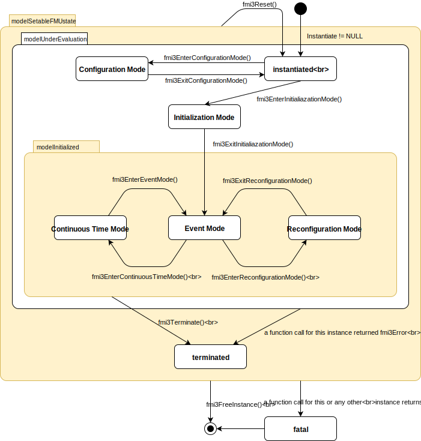

=== FMI Application Programming Interface

This section contains the interface description to evaluate different model parts from a C program.

==== Providing Independent Variables and Re-initialization of Caching [[providing-independent-variables-and-re-initialization]]

Depending on the situation, different variables need to be computed.
In order to be [underline]#efficient#, it is important that the interface requires only the [underline]#computation# of variables that are needed in the [underline]#present  context#.
For example, during the iteration of an integrator step, only the state derivatives need to be computed, provided the output of a model is not connected.
It might be that at the same time instant other variables are needed.
For example, if an integrator step is completed, the event indicator functions need to be computed as well.
If the state derivatives have already been computed at the present time instant, then it is important for efficiency that they are not newly computed in the call to compute the event indicator functions.
This means, the state derivatives shall be reused from the previous call.
This feature is called "[underline]#caching of variables#" in the sequel. +
Caching requires that the model evaluation can detect when the input arguments, like time or states, have changed.
This is achieved by setting them explicitly with a function call, since every such function call signals precisely a change of the corresponding variables.
For this reason, this section contains functions to set the input arguments of the equation evaluation functions.
This is unproblematic for time and states, but is more involved for parameters and inputs, since the latter may have different data types.

[source, C]
----
include::../headers/fmi3FunctionTypes.h[tags=SetTime]
----

Set a new time instant and re-initialize caching of variables that depend on time, provided the newly provided time value is different to the previously set time value (variables that depend solely on constants or parameters need not to be newly computed in the sequel, but the previously computed values can be reused).

[source, C]
----
include::../headers/fmi3FunctionTypes.h[tags=SetContinuousStates]
----

Set a new (continuous) state vector and re-initialize caching of variables that depend on the states.
Argument nx is the length of vector x and is provided for checking purposes (variables that depend solely on constants, parameters, time, and inputs do not need to be newly computed in the sequel, but the previously computed values can be reused).
Note that the continuous states might also be changed in Event Mode.
Note that `fmi3Status = fmi3Discard` is possible.

[source, C]
----
fmi3Status fmi3SetXXX(..);
----

Set new values for (independent) parameters, start values and inputs and re-initialize caching of variables that depend on these variables.
The details of these functions are defined in <<get-and-set-variable-values>>.

_[The functions above have the slight drawback that values must always be copied.
For example, a call to_ `fmi3SetContinuousStates` _will provide the actual states in a vector, and this function has to copy the values in to the internal model data structure "_ `c` _" so that subsequent evaluation calls can utilize these values.
If this turns out to be an efficiency issue, a future release of FMI might provide additional functions to provide the address of a memory area where the variable values are present.]_

==== Evaluation of Model Equations [[evaluation-of-model-equations]]

This section contains the core functions to evaluate the model equations.
Before one of these functions can be called,
the appropriate functions from the previous section have to be used,
to set the input arguments to the current model evaluation.

[source, C]
----
include::../headers/fmi3FunctionTypes.h[tags=EnterEventMode]
----

The model enters *Event Mode* from the *Continuous-Time Mode* and discrete-time equations may become active (and relations are not "frozen").

The followings arguments can be set to `fmi3True` to inform the FMU why *Event Mode* was entered.
_[These arguments are not mutually exclusive and may all be `fmi3False` if the caller cannot provide this information.]_

`inputEvent`:: an input event occurred

`stepEvent`:: a step event occurred

`rootsFound`:: array of length `nEventIndicators`. For `i = 1, ..., nEventIndicators, rootsFound[i] != 0` if the event indicator latexmath:[z_i] has a root, and `rootsFound[i] == 0` if not.
For the components latexmath:[z_i] for which a root was found, the sign of `rootsFound[i]` indicates the direction of the zero-crossing.
A value of `+1` indicates that latexmath:[z_i] is increasing, while a value of `−1` indicates a decreasing latexmath:[z_i].
If `nEventIndicators == 0` the value of `rootsFound` is not defined.

`nEventIndicators`:: the number of event indicators or `0` if the caller cannot provide this information.

`timeEvent`:: a time event occurred

[source, C]
----
include::../headers/fmi3FunctionTypes.h[tags=NewDiscreteStates]

include::../headers/fmi3FunctionTypes.h[tags=EventInfo]
----

The FMU is in *Event Mode* and the super dense time is incremented by this call. +
If the super dense time before a call to `fmi3NewDiscreteStates` was latexmath:[(t_R,t_I)], then the time instant after the call is latexmath:[(t_R,t_I)]. +
If return argument `pass:[fmi3eventInfo->newDiscreteStatesNeeded]` = `fmi3True`, the FMU should stay in Event Mode, and the FMU requires to set new inputs to the FMU (`fmi3SetXXX` on inputs) to compute and get the outputs (`fmi3GetXXX` on outputs) and to call `fmi3NewDiscreteStates` again.
Depending on the connection with other FMUs, the environment shall

- call `fmi3Terminate`, if `terminateSimulation` = `fmi3True` is returned by at least one FMU,

- call `fmi3EnterContinuousTimeMode` if all FMUs return `newDiscreteStatesNeeded` = `fmi3False`, and

- stay in *Event Mode* otherwise.

When the FMU is terminated, it is assumed that an appropriate message is printed by the logMessage function (see <<creation-destruction-and-logging>>) to explain the reason for the termination. +
If `nominalsOfContinuousStatesChanged = fmi3True`, then the nominal values of the states have changed due to the function call and can be inquired with `fmi3GetNominalsOfContinuousStates`. +
If `valuesOfContinuousStatesChanged = fmi3True`, then at least one element of the continuous state vector has changed its value due to the function call.
The new values of the states can be inquired with `fmi3GetContinuousStates`.
If no element of the continuous state vector has changed its value, `valuesOfContinuousStatesChanged` must return `fmi3False`.
_[If `fmi3True` would be returned in this case, an infinite event loop may occur.]_ +
If `nextEventTimeDefined = fmi3True`, then the simulation shall integrate at most until `time = nextEventTime`, and shall call `fmi3EnterEventMode` at this time instant.
If integration is stopped before `nextEventTime`, for example, due to a state event, the definition of `nextEventTime` becomes obsolete.

[source, C]
----
include::../headers/fmi3FunctionTypes.h[tags=EnterContinuousTimeMode]
----

The model enters *Continuous-Time Mode* and all discrete-time equations become inactive and all relations are "frozen". +
This function has to be called when changing from *Event Mode* (after the global event iteration in *Event Mode* over all involved FMUs and other models has converged) into *Continuous-Time Mode*. +

_[This function might be used for the following purposes:_

* _If the FMU stores results internally on file, then the results after the initialization and/or the event has been processed can be stored._

* _If the FMU contains dynamically changing states, then a new state selection might be performed with this function.]_

[source, C]
----
include::../headers/fmi3FunctionTypes.h[tags=CompletedIntegratorStep]
----

This function must be called by the environment after every completed step of the integrator provided the capability flag `completedIntegratorStepNotNeeded = false`.
Argument `noSetFMUStatePriorToCurrentPoint` is `fmi3True` if `fmi3SetFMUState` will no longer be called for time instants prior to current time in this simulation run [the FMU can use this flag to flush a result buffer]. +
The function returns `enterEventMode` to signal to the environment if the FMU shall call `fmi3EnterEventMode`, and it returns `terminateSimulation` to signal if the simulation shall be terminated.
If `enterEventMode` = `fmi3False` and `terminateSimulation` = `fmi3False` the FMU stays in *Continuous-Time Mode* without calling `fmi3EnterContinuousTimeMode` again.
When the integrator step is completed and the states are [underline]#modified# by the integrator [underline]#afterwards# (for example, correction by a BDF method),
then `fmi3SetContinuousStates` has to be called with the updated states [underline]#before# `fmi3CompletedIntegratorStep` is called. +
When the integrator step is completed and one or more event indicators change sign (with respect to the previously completed integrator step),
then the integrator or the environment has to determine the time instant of the sign change that is closest to the previous completed step up to a certain precision (usually a small multiple of the machine epsilon).
This is usually performed by an iteration where time is varied and state variables needed during the iteration are determined by interpolation.
Function `fmi3CompletedIntegratorStep` must be called after this state event location procedure and not after the successful computation of the time step by the integration algorithm.
The intended purpose of the function call is to indicate to the FMU that at this stage all inputs and state variables have valid (accepted) values.
After `fmi3CompletedIntegratorStep` is called, it is still allowed to go back in time (calling `fmi3SetTime`) and inquire values of variables at previous time instants with `fmi3GetXXX` _[for example, to determine values of non-state variables at output points]_.
However, it is not allowed to go back in time over the previous `fmi3CompletedIntegratorStep` or the previous `fmi3EnterEventMode` call.

_[This function might be used, for example, for the following purposes:_

. _Delays:_ +
_All variables that are used in a "delay(..)" operator are stored in an appropriate buffer and the function returns with `enterEventMode` = `fmi3False`, and `terminateSimulation` = `fmi3False`._

. _Dynamic state selection: +
It is checked whether the dynamically selected states are still numerically appropriate.
If yes, the function returns with `enterEventMode` = `fmi3False`  otherwise with `enterEventMode` = `fmi3True`._
_In the latter case, `fmi3EnterEventMode` has to be called and the states are dynamically changed by a subsequent `fmi3NewDiscreteStates`._

_Note that this function is not used to detect time or state events, for example, by comparing event indicators of the previous with the current call of `fmi3CompletedIntegratorStep`.
These types of events are detected in the environment, and the environment has to call `fmi3EnterEventMode` independently in these cases,
whether the return argument `enterEventMode` of `fmi3CompletedIntegratorStep` is `fmi3True` or `fmi3False`.]_

[source, C]
----
include::../headers/fmi3FunctionTypes.h[tags=GetDerivatives]

include::../headers/fmi3FunctionTypes.h[tags=GetEventIndicators]
----

Compute state derivatives and event indicators at the current time instant and for the current states.
The derivatives are returned as a vector with `nx` elements.
A state event is triggered when the domain of an event indicator changes from latexmath:[z_j > 0] to latexmath:[z_j \leq 0] or vice versa.
The FMU must guarantee that at an event restart latexmath:[z_j \neq 0], for example, by shifting latexmath:[z_j] with a small value.
Furthermore, latexmath:[z_j] should be scaled in the FMU with its nominal value (so all elements of the returned vector `eventIndicators` should be in the order of "one").
The event indicators are returned as a vector with `ni` elements. +
The ordering of the elements of the derivatives vector is identical to the ordering of the state vector (for example, `derivatives[2]` is the derivative of `x[2]`).
Event indicators are not necessarily related to variables on the Model Description File. +
Note that `fmi3Status` = `fmi3Discard` is possible for both functions.

[source, C]
----
include::../headers/fmi3FunctionTypes.h[tags=GetContinuousStates]
----

Return the new (continuous) state vector x.
This function has to be called directly after calling function `fmi3EnterContinuousTimeMode` if it returns with `eventInfo->valuesOfContinuousStatesChanged = fmi3True` (indicating that the (continuous-time) state vector has changed).

[source, C]
----
include::../headers/fmi3FunctionTypes.h[tags=GetNominalsOfContinuousStates]
----

Return the nominal values of the continuous states.
This function should always be called after calling function `fmi3NewDiscreteStates` if it returns with `eventInfo->nominalsOfContinuousStatesChanged = fmi3True`, since then the nominal values of the continuous states have changed _[for example, because the association of the continuous states to variables has changed due to internal dynamic state selection]_.
If the FMU does not have information about the nominal value of a continuous state i, a nominal value `x_nominal[i] = 1.0` should be returned.
Note that it is required that `x_nominal[i] > 0.0`.
_[Typically, the nominal values of the continuous states are used to compute the absolute tolerance required by the integrator.
Example: +
`absoluteTolerance[i] = 0.01*tolerance*x_nominal[i];`]_

==== State Machine of Calling Sequence [[state-machine-model-exchange]]

Every implementation of the FMI must support calling sequences of the functions according to the following state chart:

.Calling sequence of Model Exchange C functions in form of an UML 2.0 state machine.
[#figure-model-exchange-state-machine]

The objective of the start chart is to define the allowed calling sequences for functions of the FMI: Calling sequences not accepted by the state chart are not supported by the FMI.
The behavior of an FMU is undefined for such a calling sequence.
For example, the state chart indicates that when an FMU for Model Exchange is in state *Continuous-Time Mode*, a call to `fmi3SetReal` for a discrete input is not supported.
The state chart is given here as UML 2.0 state machine.
If a transition is labelled with one or more function names (for example, `fmi3GetReal`, `fmi3GetInteger`), this means that the transition is taken if any of these functions is successfully called.
Note that the FMU can always determine in which state it is since every state is entered by a particular function call (such as `fmi3EnterEventMode`), or a particular return value (such as `fmi3Fatal`).

The transition conditions `external event`, `time event`, and `state event` are defined in <<math-model-exchange>>.
Each state of the state machine corresponds to a certain phase of a simulation as follows:

instantiated::
In this state, start and guess values (= variables that have `initial = "exact"` or `"approx"`) can be set.

Configuration Mode::
In this state structural parameters with `variability` = `fixed` or `variability` = `tunable` can be changed.
This state is entered from state *instantiated* by calling `fmi3EnterConfigurationMode()` and left back to *instantiated* by calling `fmi3ExitConfigurationMode()`.
`fmi3EnterConfigurationMode()` can only be called if the FMU contains at least one structural parameter.

Initialization Mode::
In this state, equations are active to determine all continuous-time states, as well as all outputs (and optionally other variables exposed by the exporting tool).
The variables that can be retrieved by `fmi3GetXXX` calls are (1) defined in the XML file under `<ModelStructure><InitialUnknowns>` and (2) variables with `causality` = `"output"`.
Variables with `initial` = `"exact"`, as well as variables with `variability` = `"input"` can be set.

Continuous-Time Mode::
In this state, the continuous-time model equations are active and integrator steps are performed.
The event time of a state event may be determined if a domain change of at least one event indicator is detected at the end of a completed integrator step.

Event Mode::
If an event is triggered in *Continuous-Time Mode*, then *Event Mode* is entered by calling `fmi3EnterEventMode`.
In this mode all continuous-time and discrete-time equations are active and the unknowns at an event can be computed and retrieved.
After an event is completely processed, `fmi3NewDiscreteStates` must be called and depending on the return argument, `newDiscreteStatesNeeded`, the state chart stays in *Event Mode* or switches to *Continuous-Time Mode*.
When the *Initialization Mode* is terminated with `fmi3ExitInitializationMode`, then *Event Mode* is directly entered, and the continuous-time and discrete-time variables at the initial time are computed based on the initial continuous-time states determined in the *Initialization Mode*.

Reconfiguration Mode::
In this state structural parameters with `variability` = `tunable` can be changed.
This state is entered from state *Event Mode* by calling `fmi3EnterConfigurationMode()` and left back to *Event Mode* by calling `fmi3ExitConfigurationMode()`.
`fmi3EnterConfigurationMode()` can only be called if the FMU contains at least one structural parameter.

terminated::
In this state, the solution at the final time of a simulation can be retrieved.

Note that simulation backward in time is only allowed over continuous time intervals.
As soon as an event occurred (`fmi3EnterEventMode` was called), going back in time is forbidden, because `fmi3EnterEventMode` / `fmi3NewDiscreteStates` can only compute the next discrete state, not the previous one.

Note that during *Initialization*, *Event*, and *Continuous-Time Mode* input variables can be set with `fmi3SetXXX` and output variables can be retrieved with `fmi3GetXXX` interchangeably according to the model structure defined under element `<ModelStructure>` in the XML file.
_[For example, if one output `y1` depends on two inputs `u1`, `u2`, then these two inputs must be set, before `y1` can be retrieved.
If additionally an output `y2` depends on an input `u3`, then `u3` can be set and `y2` can be retrieved afterwards.
As a result, artificial or "real" algebraic loops over connected FMUs in any of these three modes can be handled by using appropriate numerical algorithms.]_

The allowed function calls in the respective states are summarized in the following table (functions marked in "[yellow-background]#yellow#" are only available for "Model Exchange", the other functions are available both for "Model Exchange" and "Co-Simulation"):

[cols="10,1,1,1,1,1,1,1,1", width=70%]
|====
.2+.>|*Function*
8+|*FMI 2.0 for Model Exchange*

|[vertical-text]#start, end#
|[vertical-text]#instantiated#
|[vertical-text]#Initialization Mode#
|[vertical-text]#Event Mode#
|[vertical-text]#Continuous-Time Mode#
|[vertical-text]#terminated#
|[vertical-text]#error#
|[vertical-text]#fatal#

|fmi3GetVersion                    |x |x |x |x |x |x |x |
|fmi3SetDebugLogging               |  |x |x |x |x |x |x |
|fmi3Instantiate                   |x |  |  |  |  |  |  |
|fmi3FreeInstance                  |  |x |x |x |x |x |x |
|fmi3SetupExperiment               |  |x |  |  |  |  |  |
|fmi3EnterInitializationMode       |  |x |  |  |  |  |  |
|fmi3ExitInitializationMode        |  |  |x |  |  |  |  |
|fmi3Terminate                     |  |  |  |x |x |  |  |
|fmi3Reset                         |  |x |x |x |x |x |x |
|fmi3GetReal                       |  |  |2 |x |x |x |7 |
|fmi3GetInteger                    |  |  |2 |x |x |x |7 |
|fmi3GetBoolean                    |  |  |2 |x |x |x |7 |
|fmi3GetString                     |  |  |2 |x |x |x |7 |
|fmi3SetReal                       |  |1 |3 |4 |5 |  |  |
|fmi3SetInteger                    |  |1 |3 |4 |  |  |  |
|fmi3SetBoolean                    |  |1 |3 |4 |  |  |  |
|fmi3SetString                     |  |1 |3 |4 |  |  |  |
|fmi3GetFMUState                   |  |x |x |x |x |x |7 |
|fmi3SetFMUState                   |  |x |x |x |x |x |x |
|fmi3FreeFMUState                  |  |x |x |x |x |x |x |
|fmi3SerializedFMUStateSize        |  |x |x |x |x |x |x |
|fmi3SerializeFMUState             |  |x |x |x |x |x |x |
|fmi3DeSerializeFMUState           |  |x |x |x |x |x |x |
|fmi3GetDirectionalDerivative      |  |  |x |x |x |x |7 |
|fmi3EnterEventMode               {set:cellbgcolor:yellow} |  {set:cellbgcolor!} |  |  |x |x |  |  |
|fmi3NewDiscreteStates             {set:cellbgcolor:yellow} |  {set:cellbgcolor!} |  |  |x |  |  |  |
|fmi3EnterContinuousTimeMode       {set:cellbgcolor:yellow} |  {set:cellbgcolor!} |  |  |x |  |  |  |
|fmi3CompletedIntegratorStep       {set:cellbgcolor:yellow} |  {set:cellbgcolor!} |  |  |  |x |  |  |
|fmi3SetTime                       {set:cellbgcolor:yellow} |  {set:cellbgcolor!} |  |  |x |x |  |  |
|fmi3SetContinuousStates           {set:cellbgcolor:yellow} |  {set:cellbgcolor!} |  |  |  |x |  |  |
|fmi3GetEventIndicators            {set:cellbgcolor:yellow} |  {set:cellbgcolor!} |  |x |x |x |x |7 |
|fmi3GetContinuousStates           {set:cellbgcolor:yellow} |  {set:cellbgcolor!} |  |x |x |x |x |7 |
|fmi3GetDerivatives                {set:cellbgcolor:yellow} |  {set:cellbgcolor!} |  |x |x |x |x |7 |
|fmi3GetNominalsOfContinuousStates {set:cellbgcolor:yellow} |  {set:cellbgcolor!} |x |  |x |x |x |7 |
|====

*x* means: call is allowed in the corresponding state +
*number* means: call is allowed if the indicated condition holds: +
*1* for a variable with `variability` latexmath:[\neq] `"constant"` that has `initial` =
`"exact"` or `"approx"` +
*2* for a variable with `causality = "output"`, or continuous-time states or state derivatives +
*3* for a variable with `variability` latexmath:[\neq] `"constant"` that has `initial` = `"exact"`,
or `causality` = `"input"` +
*4* for a variable with `causality` = `"input"`,
or (`causality` = `"parameter"` and `variability` = `"tunable"`) +
*5* for a variable with `causality` = `"input"` and `variability` = `"continuous"` +
*7* always, but retrieved values are usable for debugging only

==== Code Example

In the following example, the usage of the `fmi3XXX` functions is sketched in order to clarify the typical calling sequence of the functions in a simulation environment.
Furthermore, it is assumed that one FMU is directly integrated in a simulation environment.
If the FMU would be used inside another model, additional code is needed, especially initialization and event iteration has to be adapted.

[source, c]
----
include::examples/c-code/model_exchange.c[tags=ModelExchange]
----

In the code above, errors are not handled. Typically, `fmi3XXX` function calls are performed in the following way:

[source, C]
----
include::examples/c-code/model_exchange.c[tags=CheckStatus]
----

The switch statement could also be stored in a macro to simplify the code.

==== Clocks API

Triggered Clocks::
For a triggered clock, the environment integrates until a continuous-time event occurs and calls `fmi3EnterEventMode`. Afterwards with function call `fmi3GetClock` the triggered clocks that became active at this event instant can be inquired by the environment.

Inferred Clocks::
Intervall is set with the function `fmi3SetIntervalDecimal` or `fmi3SetIntervalFraction`. It is activated by the environment with the function `fmi3SetClock`.

==== Handling of clock events 

This concerns the following API calls: `fmi3SetClock`, `fmi3GetClock`, `fmi3SetIntervalDecimal`, `fmi3SetIntervalFraction`, `fmi3GetIntervalDecimal`, `fmi3GetIntervalFraction`

A clock-event is handled by the environment in the following way:

Enter event mode::
The event mode is entered after initialization (call to function `fmi3ExitInitializationMode`) or during simulation with a call to the function `fmi3EnterEventMode`. The FMU activates triggered clocks.

Synchronize clock activation and intervals with the environment::

The clock activation status can be inquired with the function `fmi3GetClock`. The environment calls the function `fmi3SetClock` for periodic clocks and inferred clocks.
Moreover the current clock intervals may be inquired with the function `fmi3GetIntervalDecimal()` or `fmi3GetIntervalFraction()` and set with the function `fmi3SetIntervalDecimal()` `fmi3SetIntervalFraction()`.
_[In the Modelica language this is the value returned by the interval() operator. The initialization of intervals is needed for triggered and inferred sample times if a clock ticks the first time. The FMU determines the interval itself at subsequent clock ticks.]_

Solve algebraic loops among discrete-time equations of multiple FMUs or repeated evaluation in model-based control applications (optional)::
With the `fmi3SetXXX` functions the input variables of the clocked partition can be set. 
If algebraic loops are present among clocked partitions of multiple FMUs, then with the `fmi3GetXXX` functions all variables on the corresponding clock can be inquired. 
The latter function call triggers the evaluation of the discrete-time equations, provided the corresponding clock is active at this time instant. 
If the corresponding clock is not active, the last evaluated value of the variable is returned. 
Clocks are automatically deactivated if the corresponding discrete-time equations have been evaluated. 
Before a new loop iteration is started, the environment must activate the clocks again and reset discrete states using the `fmi3SetXXX` functions.

Leave event mode::
The function `fmi3NewDiscreteStates` evaluates the discrete-time equations, provided the corresponding clock is active and the discrete-time equations have not already been evaluated with calls to `fmi3GetXXX` functions. 
Clocks are automatically deactivated by `fmi3NewDiscreteStates` and by `fmi3Reset`. 
_[This handling of discrete states and time events is forward compatible with FMI 2.0 for any model that could be treated with FMI 2.0 and is exported again using the new features.
The environment may ignore the new functions `fmi3SetClock`, `fmi3GetClock`, `fmi3SetIntervalDecimal`, `fmi3SetIntervalFraction`, `fmi3GetIntervalDecimal` and `fmi3GetIntervalFraction`.
The new functions are needed for FMUs with inferred sample times and to set discrete-time states in model-based control applications or if algebraic loops are present among discrete-time equations of multiple connected FMUs.]_
