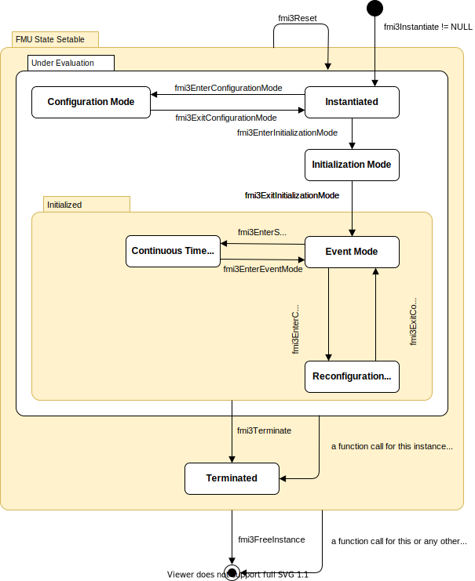

=== Application Programming Interface

This section contains the interface description to evaluate different model parts from a C program.

==== Providing Independent Variables and Re-initialization of Caching [[providing-independent-variables-and-re-initialization]]

Depending on the situation, different variables need to be computed.
In order to be efficient, it is important that the interface requires only the computation of variables that are needed in the present context.
For example, during the iteration of an integrator step, only the state derivatives need to be computed, provided the <<output>> of a model is not connected.
It might be that at the same time instant other variables are needed.
For example, if an integrator step is completed, the event indicator functions need to be computed as well.
If the state derivatives have already been computed at the present time instant, then it is important for efficiency that they are not newly computed in the call to compute the event indicator functions.
This means, the state derivatives shall be reused from the previous call.
This feature is called "caching of variables" in the sequel. +
Caching requires that the model evaluation can detect when the input arguments, like time or states, have changed.
This is achieved by setting them explicitly with a function call, since every such function call signals precisely a change of the corresponding variables.
For this reason, this section contains functions to set the input arguments of the equation evaluation functions.
This is unproblematic for time and states, but is more involved for <<parameter,`parameters`>> and <<input,`inputs`>>, since the latter may have different data types.

[[fmi3SetTime,`fmi3SetTime`]]
[source, C]
----
include::../headers/fmi3FunctionTypes.h[tags=SetTime]
----

Set a new value for the independent variable (typically a time instant) and re-initialize caching of variables that depend on time, provided the newly provided time value is different to the previously set time value (variables that depend solely on <<constant,`constants`>> or <<parameter,`parameters`>> need not to be newly computed in the sequel, but the previously computed values can be reused).

[[fmi3SetContinuousStates,`fmi3SetContinuousStates`]]
[source, C]
----
include::../headers/fmi3FunctionTypes.h[tags=SetContinuousStates]
----

Set a new (continuous) state vector and re-initialize caching of variables that depend on the <<state,`states`>>.

* Argument `nContinuousStates` is the length of

* argument `continuousStates`

and is provided for checking purposes (variables that depend solely on<<constant,`constants`>>, <<parameter,`parameters`>>, time, and <<input,`inputs`>> do not need to be newly computed in the sequel, but the previously computed values can be reused).
Note that the continuous <<state,`states`>> might also be changed in *Event Mode*.
Note that <<fmi3Discard,`fmi3Status == fmi3Discard`>> is possible.

[source, C]
----
fmi3Status fmi3Set{VariableType}(..);
----

Set new values for <<parameter,`parameters`>>, <<start>> values and <<input,`inputs`>> and re-initialize caching of variables that depend on these variables.
The details of these functions are defined in <<get-and-set-variable-values>>.

_[The functions above have the slight drawback that values must always be copied._
_For example, a call to_ <<fmi3SetContinuousStates>> _will provide the actual states in a vector, and this function has to copy the values in to the internal model data structure so that subsequent evaluation calls can utilize these values._
_If this turns out to be an efficiency issue, a future release of FMI might provide additional functions to provide the address of a memory area where the variable values are present.]_

==== Evaluation of Model Equations [[evaluation-of-model-equations]]

This section contains the core functions to evaluate the model equations.
Before one of these functions can be called, the appropriate functions from the previous section have to be used, to set the input arguments to the current model evaluation.

[[fmi3EnterEventMode,`fmi3EnterEventMode`]]
[source, C]
----
include::../headers/fmi3FunctionTypes.h[tags=EnterEventMode]
----

The model enters *Event Mode* from the *Continuous-Time Mode* and discrete-time equations may become active (and relations are not "frozen").

The followings function arguments have to be given to inform the FMU why *Event Mode* was entered.

_[These arguments are not mutually exclusive.]_

* `stepEvent` signals with `fmi3True` that a <<step event>> occurred.

* `rootsFound` is an array of length `nEventIndicators` that signals if a <<state event>> occurred.
For `i = 1, ..., nEventIndicators, rootsFound[i-1] != 0` if the event indicator latexmath:[z_i] has a root, and `rootsFound[i-1] == 0` if not.
For the components latexmath:[z_i] for which a root was found, the sign of `rootsFound[i-1]` indicates the direction of the zero-crossing.
A value of `+1` indicates that latexmath:[z_i] is increasing, while a value of `-1` indicates a decreasing latexmath:[z_i].
If `nEventIndicators == 0` the value of `rootsFound` is not defined.

* `nEventIndicators` contains the number of event indicators (length of `rootsFound`) or `0` if the caller cannot provide this information.

* `timeEvent` signals with `fmi3True` that a <<time event>> occurred.

_[An <<input-event>> can be detected by the FMU by keeping track of the calls of `fmi3Set{VariableType}` in *Event Mode*.]_

[[fmi3NewDiscreteStates,`fmi3NewDiscreteStates`]]
[source, C]
----
include::../headers/fmi3FunctionTypes.h[tags=NewDiscreteStates]
----

The FMU is in *Event Mode*.
If the super-dense time before a call to <<fmi3NewDiscreteStates>> was latexmath:[(t_R,t_I)], then the time instant after the call is latexmath:[(t_R,t_{I + 1})]. +

* If output argument `newDiscreteStatesNeeded == fmi3True`, the FMU should stay in *Event Mode*, and the FMU requires to set new inputs to the FMU (`fmi3Set{VariableType}` on <<input,`inputs`>>) to compute and get the <<output,`outputs`>> (`fmi3Get{VariableType}` on <<output,`outputs`>>) and to call <<fmi3NewDiscreteStates>> again.
Depending on the connection with other FMUs, the environment shall
** call <<fmi3Terminate>>, if <<terminateSimulation,`terminateSimulation == fmi3True`>> is returned by at least one FMU,
** call <<fmi3EnterContinuousTimeMode>> if all FMUs return `newDiscreteStatesNeeded == fmi3False`, and
** stay in *Event Mode* otherwise.
When the FMU is terminated, it is assumed that an appropriate message is printed by the <<logMessage>> function (see <<FMUStateSetable>>) to explain the reason for the termination.

[[terminateSimulation,`terminateSimulation`]]
* If output argument `terminateSimulation == fmi3True`, the FMU signals it needs to terminate the simulation.

* If argument `nominalsOfContinuousStatesChanged == fmi3True`, then the nominal values of the <<state,`states`>> have changed due to the function call and can be inquired with <<fmi3GetNominalsOfContinuousStates>>.

* If argument `valuesOfContinuousStatesChanged == fmi3True`, then at least one element of the continuous state vector has changed its value due to the function call.

[[state,`state`]]
The new values of the <<state,`states`>> can be inquired with <<fmi3GetContinuousStates>> or individually for each state for which <<reinit, `reinit = true`>> by calling `fmi3GetFloat*`.
If no element of the continuous state vector has changed its value, `valuesOfContinuousStatesChanged` must return `fmi3False`.
_[If `fmi3True` would be returned in this case, an infinite event loop may occur.]_

[[nextEventTimeDefined,`nextEventTimeDefined`]]
* If argument `nextEventTimeDefined == fmi3True`, then the simulation shall integrate at most until `time` reaches value of

[[nextEventTime,`nextEventTime`]]
* argument <<nextEventTime>>, and shall call <<fmi3EnterEventMode>> at this time instant.
If integration is stopped before <<nextEventTime>>, for example, due to a <<state event>>, the definition of <<nextEventTime>> becomes obsolete.

[[fmi3CompletedIntegratorStep,`fmi3CompletedIntegratorStep`]]
[source, C]
----
include::../headers/fmi3FunctionTypes.h[tags=CompletedIntegratorStep]
----

This function must be called by the environment after every completed step of the integrator provided the capability flag `completedIntegratorStepNotNeeded = false`.
Argument `noSetFMUStatePriorToCurrentPoint == fmi3True` if `fmi3SetFMUState` will no longer be called for time instants prior to current time in this simulation run [the FMU can use this flag to flush a result buffer]. +
The function returns `enterEventMode` to signal to the environment that the environment shall call <<fmi3EnterEventMode>>, and it returns <<terminateSimulation>> to signal if the simulation shall be terminated.
If `enterEventMode == fmi3False` and <<terminateSimulation,`terminateSimulation == fmi3False`>> the FMU stays in *Continuous-Time Mode* without the environment having to call <<fmi3EnterContinuousTimeMode>> again.
When the integrator step is completed and the <<state,`states`>> are modified by the integrator afterwards (for example, correction by a BDF method),
then <<fmi3SetContinuousStates>> has to be called with the updated states before <<fmi3CompletedIntegratorStep>> is called. +
When the integrator step is completed and one or more event indicators change sign (with respect to the previously completed integrator step), then the integrator or the environment has to determine the time instant of the sign change that is closest to the previous completed step up to a certain precision (usually a small multiple of the machine epsilon).
This is usually performed by an iteration where time is varied and <<state>> variables needed during the iteration are determined by interpolation.
Function <<fmi3CompletedIntegratorStep>> must be called after this <<state event>> location procedure and not after the successful computation of the time step by the integration algorithm.
The intended purpose of the function call is to indicate to the FMU that at this stage all <<input,`inputs`>> and <<state>> variables have valid (accepted) values.
After <<fmi3CompletedIntegratorStep>> is called, it is still allowed to go back in time (calling <<fmi3SetTime>>) and inquire values of variables at previous time instants with `fmi3Get{VariableType}` _[for example, to determine values of non-state variables at output points]_.
However, it is not allowed to go back in time over the previous <<fmi3CompletedIntegratorStep>> or the previous <<fmi3EnterEventMode>> call.

_[This function might be used, for example, for the following purposes:_

_Delays:_ +
_All variables that are used in a "delay(..)" operator are stored in an appropriate buffer and the function returns with `enterEventMode == fmi3False`, and <<terminateSimulation,`terminateSimulation == fmi3False`>>._

. _Dynamic state selection:_ +
_It is checked whether the dynamically selected states are still numerically appropriate._
_If yes, the function returns with `enterEventMode == fmi3False`  otherwise with `enterEventMode == fmi3True`._
_In the latter case, <<fmi3EnterEventMode>> has to be called and the states are dynamically changed by a subsequent <<fmi3NewDiscreteStates>>._

_Note that this function is not used to detect time or <<state event,`state events`>>, for example, by comparing event indicators of the previous with the current call of <<fmi3CompletedIntegratorStep>>._
_These types of events are detected in the environment, and the environment has to call <<fmi3EnterEventMode>> independently in these cases, whether the return argument `enterEventMode` of <<fmi3CompletedIntegratorStep>> is `fmi3True` or `fmi3False`.]_

[[fmi3GetDerivatives,`fmi3GetDerivatives`]]
[source, C]
----
include::../headers/fmi3FunctionTypes.h[tags=GetDerivatives]
----

[[fmi3GetEventIndicators,`fmi3GetEventIndicators`]]
[source, C]
----
include::../headers/fmi3FunctionTypes.h[tags=GetEventIndicators]
----

Compute state derivatives (that is derivatives w.r.t. to the <<independent>> variable also taking into account its unit) and event indicators at the current instant of the <<independent>> variable _[typically: time]_ and for the current <<state,`states`>>.
Note that <<fmi3Discard,`fmi3Status == fmi3Discard`>> is possible for both functions.

The <<derivative,`derivatives`>> are returned as a vector with `nContinuousStates` elements.
The ordering of the elements of the `derivatives` vector must be identical to the ordering of the `continuousStates` vector (for example, `derivatives[2]` is the <<derivative>> of `continuousStates[2]`).
The order of the `continuousStates` and `derivatives` vector must be the same as the ordered list of elements `<ModelStructure><Derivative>`.
_[Array variables are serialized in "row major" order, as usual.]_

The event indicators are returned as a vector with `nEventIndicators` elements.
The order of the `eventIndicators` vector must be the same as the ordered list of elements `<ModelStructure><EventIndicator>`.
_[Array variables are serialized in "row major" order, as usual.]_
A <<state event>> is triggered when the domain of an event indicator changes from latexmath:[z_j > 0] to latexmath:[z_j \leq 0] or vice versa.
The FMU must guarantee that at an event restart latexmath:[z_j \neq 0], for example, by shifting latexmath:[z_j] with a small value.
Furthermore, latexmath:[z_j] should be scaled in the FMU with its nominal value (so all elements of the returned vector `eventIndicators` should be in the order of "one").

[[fmi3GetContinuousStates,`fmi3GetContinuousStates`]]
[source, C]
----
include::../headers/fmi3FunctionTypes.h[tags=GetContinuousStates]
----

Return the new continuous state vector `continuousStates`.
The order of the states is also the same as the ordered list of elements `<ModelStructure><Derivative>`.
_[Array variables are serialized in "row major" order, as usual.]

[[fmi3GetNominalsOfContinuousStates,`fmi3GetNominalsOfContinuousStates`]]
[source, C]
----
include::../headers/fmi3FunctionTypes.h[tags=GetNominalsOfContinuousStates]
----

Return the nominal values of the continuous <<state,`states`>> with the some convention for the order as above.
This function should always be called after calling function <<fmi3NewDiscreteStates>>, if `nominalsOfContinuousStatesChanged == fmi3True`, since then the nominal values of the continuous <<state,`states`>> have changed _[for example, because the association of the continuous <<state,`states`>> to variables has changed due to internal dynamic state selection]_.
If the FMU does not have information about the nominal value of a continuous <<state>> i, a nominal value `nominals[i] == 1.0` should be returned.
Note that it is required that `nominals[i] > 0.0`.
_[Typically, the nominal values of the continuous <<state,`states`>> are used to compute the absolute tolerance required by the integrator._
_Example:_ +
`absoluteTolerance[i] = 0.01 * tolerance * nominals[i];` _]_

Note that simulation backward in time is only allowed over continuous time intervals.
As soon as an event occurs (<<fmi3EnterEventMode>> was called), going back in time is forbidden, because <<fmi3EnterEventMode>> / <<fmi3NewDiscreteStates>> can only compute the next discrete state, not the previous one.

Note that during *Initialization*, *Event Mode*, and *Continuous-Time Mode*, <<input>> variables can be set with `fmi3Set{VariableType}` and output variables can be retrieved with `fmi3Get{VariableType}` interchangeably according to the model structure defined under element `<ModelStructure>` in the XML file.
_[For example, if one <<output>> `y1` depends on two <<input,`inputs`>> `u1`, `u2`, then these two <<input,`inputs`>> must be set, before `y1` can be retrieved._
_If additionally an <<output>> `y2` depends on an <<input>> `u3`, then `u3` can be set and `y2` can be retrieved afterwards._
_As a result, artificial or `real` algebraic loops over connected FMUs in any of these three modes can be handled by using appropriate numerical algorithms.]_

==== State Machine for Model Exchange [[state-machine-model-exchange]]

Every implementation of the FMI must support calling sequences of the functions according to the state machine in <<figure-model-exchange-state-machine>>.

.Calling sequence of Model Exchange C functions.
[#figure-model-exchange-state-machine]

The objective of the state machine is to define the allowed calling sequences for functions of the FMI: Calling sequences not accepted by the state machine are not supported by the FMI.
The behavior of an FMU is undefined for such a calling sequence.
The state machine is given here as UML 2.0 state machine.
If a transition is labelled with one or more function names (for example, <<fmi3EnterEventMode>>, <<fmi3EnterContinuousTimeMode>>), this means that the transition is taken if any of these functions is successfully called.
Note that the FMU can always determine in which state it is since every state is entered by a particular function call (such as <<fmi3EnterEventMode>>), or a particular return value (such as <<fmi3Fatal>>).

The transition conditions <<external event>>, <<time event>>, and <<state event>> are defined in <<math-model-exchange>>.

Each state of the state machine corresponds to a certain phase of a simulation.
Common states are defined in <<state-machine-and-common-states>>, such as super states <<FMUStateSetable,*FMU State Setable*>> and  <<Initialized,*Initialized*>>, states <<Instantiated,*Instantiated*>>, <<ConfigurationMode,*Configuration Mode*>>, <<ReconfigurationMode,*Reconfiguration Mode*>>, <<InitializationMode,*Initialization Mode*>>, and <<Terminated,*Terminated*>>.

===== State: Continuous-Time Mode

In this state, the continuous-time model equations are active and integrator steps are performed.

*Continuous-Time Mode* is entered by calling <<fmi3ExitInitializationMode>>, or when returning from *Event Mode* with `fmi3ExitEventMode`, or when returning from *Reconfiguration Mode* with <<fmi3ExitConfigurationMode>>, or when the importer returns from <<intermediateUpdate>>.

Allowed Function Calls::

Function <<fmi3EnterEventMode>>::
When an event is detected, the importer must call this function to move the FMU into *Event Mode*.

Function <<fmi3EnterConfigurationMode>>::
If the environment wants to change <<structuralParameter,`structural parameters`>>, it must move the FMU into *Reconfiguration Mode* using <<fmi3EnterConfigurationMode>>.

Function <<fmi3GetDirectionalDerivative>>::
See <<fmi3GetDirectionalDerivative>>.

==== Code Example

In the following example, the usage of the `fmi3XXX` functions is sketched in order to clarify the typical calling sequence of the functions in a simulation environment.
Furthermore, it is assumed that one FMU is directly integrated in a simulation environment.
If the FMU would be used inside another model, additional code is needed, especially initialization and event iteration has to be adapted.

[source, c]
----
include::Reference-FMUs/examples/model_exchange.c[tags=ModelExchange]
----

In the code above errors are handled by the following definition:

[source, C]
----
include::Reference-FMUs/examples/util.h[tags=CheckStatus]
----

==== Event Handling

This concerns the following API calls: <<fmi3SetClock>>, <<fmi3GetClock>>, <<fmi3SetIntervalDecimal>>, <<fmi3SetIntervalFraction>>, <<fmi3GetIntervalDecimal>>, <<fmi3GetIntervalFraction>>

A <<clock>> event is handled by the environment in the following way:

_[TODO: Move this section into Common and there the Event Mode description.]_

Enter event mode::
The *Event Mode* is entered after initialization (call to function <<fmi3ExitInitializationMode>>) or during simulation with a call to the function <<fmi3EnterEventMode>>.
The FMU activates <<outputClock,`output clocks`>>.

Synchronize clock activation and intervals with the environment::

_[TODO: remove usage of clock tick and use clock activation instead (Note to self: search also for "`clock` tick").]_

The <<clock>> activation status can be inquired with the function <<fmi3GetClock>>.
The environment calls the function <<fmi3SetClock>> for <<periodic>> <<clock,`clocks`>> and <<inputClock,`input clocks`>>.
Moreover the current <<clock>> intervals may be inquired with the function <<fmi3GetIntervalDecimal>> or <<fmi3GetIntervalFraction>> and set with the function <<fmi3SetIntervalDecimal>> <<fmi3SetIntervalFraction>>.
_[In the Modelica language this is the value returned by the interval() operator._
_The initialization of intervals is needed for <<output>> and <<input>> sample times if a <<clock>> ticks the first time._
_The FMU determines the interval itself at subsequent <<clock>> ticks.]_

_[TODO: This should not be in Event Handling, merge into the other section for clock intervals with the table.]_

_[TODO: Write here a few sentences about how clocks interact with the event iteration.]_

Leave event mode::
The function <<fmi3NewDiscreteStates>> evaluates the discrete-time equations, provided the corresponding <<clock>> is active and the discrete-time equations have not already been evaluated with calls to `fmi3Get{VariableType}` functions.
Clocks are automatically deactivated by <<fmi3NewDiscreteStates>> and by <<fmi3Reset>>.
_[This handling of discrete-time states and <<time event,`time events>> is forward compatible with FMI 2.0 for any model that could be treated with FMI 2.0 and is exported again using the new features._
_The environment may ignore the new functions <<fmi3SetClock>>, <<fmi3GetClock>>, <<fmi3SetIntervalDecimal>>, <<fmi3SetIntervalFraction>>, <<fmi3GetIntervalDecimal>> and <<fmi3GetIntervalFraction>>._
_The new functions are needed for FMUs with input sample times and to set discrete-time states in model-based control applications or if algebraic loops are present among discrete-time equations of multiple connected FMUs.]_
