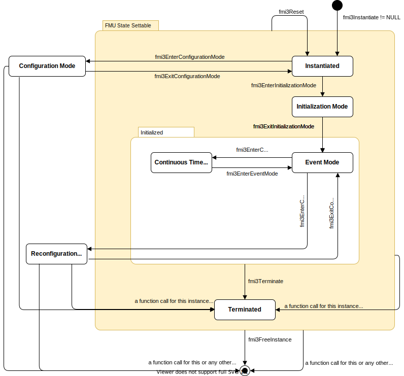

=== State Machine for Model Exchange [[state-machine-model-exchange]]

The state machine in <<figure-model-exchange-state-machine>> defines the allowed calling sequences for FMI for Model Exchange.

.Calling sequence of Model Exchange C functions.
[#figure-model-exchange-state-machine]

Common states are defined in <<common-state-machine>>, such as super states <<FMUStateSetable>> and  <<Initialized>>, states <<Instantiated>>, <<ConfigurationMode>>, <<ReconfigurationMode>>, <<InitializationMode>>, <<EventMode>> and <<Terminated>>.

==== State: Continuous-Time Mode [[ContinuousTimeMode,*Continuous-Time Mode*]]

The <<ContinuousTimeMode>> is used to compute the values of all continuous-time variables between events by numerically solving ordinary differential and algebraic equations.
All discrete-time variables are fixed during this phase and the corresponding discrete-time equations are not evaluated.

In this state, the continuous-time equations are active and integrator steps are performed.

[#table-math-model-exchange]
[cols="7,3",options="header"]
|====
|<<each-state-description,Equations and Actions>>
|Functions Influencing Equations

|latexmath:[\mathbf{t} := (]<<time>>latexmath:[, 0)]
|<<fmi3SetTime>>

|Set continuous-time <<input,`inputs`>> latexmath:[\mathbf{u}_{c}(\mathbf{t})]
|<<get-and-set-variable-values,`fmi3Set{VariableType}`>>

|Set continuous-time <<state,`states`>> latexmath:[\mathbf{x}_{c}(\mathbf{t})]
|`fmi3SetFloat64`, <<fmi3SetContinuousStates>>

a|latexmath:[(\mathbf{y}_{c}, \mathbf{\dot{x}}_c, \mathbf{z}, \mathbf{w}_{c}) := \mathbf{f}_{\mathit{cont}}(\mathbf{x}_{c}, {}^\bullet\mathbf{x}_{d}, \mathbf{u}_{c}, {}^\bullet\mathbf{u}_{d}, \mathbf{p}, {}^\bullet\mathbf{r}, {}^\bullet\mathbf{b}, \mathbf{t})]
a|
<<get-and-set-variable-values,`fmi3Get{VariableType}`>>,
<<fmi3GetContinuousStateDerivatives>>,
<<fmi3GetEventIndicators>>

a|
* Evaluate model equations with valid values for the right-hand side: +
latexmath:[(\mathbf{y}_{c}, \mathbf{\dot{x}}_c, \mathbf{z}, \mathbf{w}_{c}, \mathbf{b},]<<enterEventMode>>latexmath:[) := \mathbf{f}_{\mathit{comp}}(\mathbf{x}_{c}, {}^\bullet\mathbf{x}_{d}, \mathbf{u}_{c}, {}^\bullet\mathbf{u}_{d}, \mathbf{p}, {}^\bullet\mathbf{r}, {}^\bullet\mathbf{b}, \mathbf{t})]
* Update previous values of <<buffers>>: latexmath:[{}^\bullet\mathbf{b}:=\mathbf{b}]

|<<fmi3CompletedIntegratorStep>>

a|
* Evaluate latexmath:[\mathbf{f}_{\mathit{cont}}], if no `fmi3GetXXX` function was called
* Deactivate continuous-time equations latexmath:[\mathbf{f}_{\mathit{cont}}]
* Activate event equations latexmath:[\mathbf{f}_{\mathit{event}}]
* latexmath:[\mathbf{t}:=(\mathbf{t}_\mathit{R}, 0)]
|<<fmi3EnterEventMode>>

|====

Allowed Function Calls::

[[fmi3SetTime,`fmi3SetTime`]]
Function `fmi3SetTime`::
+
[source, C]
----
include::../headers/fmi3FunctionTypes.h[tags=SetTime]
----
+
Set a new value for the independent variable (typically a time instant).
+
* [[time,`time`]] Argument `time` is the new value for the real part latexmath:[\mathbf{t}_\mathit{R}] of latexmath:[\mathbf{t} := (\mathbf{t}_\mathit{R}, 0)].
It refers to the unit of the <<independent>> variable.
<<time>> must be larger or equal to:
** <<startTime>>,
** the time at the second last call to <<fmi3CompletedIntegratorStep>>,
** the time at the last call to <<fmi3EnterEventMode>>.

Function <<get-and-set-variable-values,`fmi3Set{VariableType}`>>::
Only for variables with <<causality>> = <<input>> and <<variability>> = <<continuous>>.

Functions <<get-and-set-variable-values,`fmi3Get{VariableType}`>>::
Getting variables might trigger <<selectiv-computation,computations>>.

[[fmi3SetContinuousStates,`fmi3SetContinuousStates`]]
Function `fmi3SetContinuousStates`::
+
[source, C]
----
include::../headers/fmi3FunctionTypes.h[tags=SetContinuousStates]
----
+
Set new continuous state values.
+
* Argument `continuousStates` contains the new values for each <<state,continuous state>>.
The order of the `continuousStates` vector must be the same as the ordered list of elements <<ContinuousStateDerivative>> in `<ModelStructure>`.
Array variables are serialized as defined in <<serialization-of_variables>>.
This order is also used in the arguments of the following functions: <<fmi3GetNominalsOfContinuousStates>>, <<fmi3GetContinuousStates>>, and <<fmi3GetContinuousStateDerivatives>>.
+
* Argument `nContinuousStates` is the size of the `continuousStates` vector.
+
_[<<fmi3Discard,`fmi3Status == fmi3Discard`>> should be returned if the FMU rejects any of the state values because they, for example, violate min/max value restrictions.]_

Functions <<get-and-set-variable-values,`fmi3Get{VariableType}`>>::
Getting variables might trigger <<selectiv-computation,computations>>.

Function <<fmi3GetContinuousStates>>::
Returns the current continuous state vector.

[[fmi3GetContinuousStateDerivatives,`fmi3GetContinuousStateDerivatives`]]
Function `fmi3GetContinuousStateDerivatives`::
+
[source, C]
----
include::../headers/fmi3FunctionTypes.h[tags=GetDerivatives]
----
+
Returns the first-order derivatives with respect to the independent variable (usually time) of the continuous states.
+
* Return argument `derivatives` contains the derivatives for each <<state,continuous state>> with the same convention for the order as defined for <<fmi3SetContinuousStates>>.

* Argument `nContinuousStates` is the size of the `derivatives` vector.
+
_[<<fmi3Discard,`fmi3Status == fmi3Discard`>> should be returned if the FMU was not able to compute the derivatives according to_ latexmath:[\mathbf{f}_{\mathit{cont}}] _because, for example, a numerical issue, such as division by zero, occurred.]_

[[fmi3GetEventIndicators,`fmi3GetEventIndicators`]]
Function `fmi3GetEventIndicators`::
+
[source, C]
----
include::../headers/fmi3FunctionTypes.h[tags=GetEventIndicators]
----
+
Returns the event indicators signaling <<state-event,state events>> by their sign changes.
+
* [[eventIndicators,`eventIndicators`]]Return argument `eventIndicators` contains the values for the event indicators in the order defined by the ordered list of elements <<EventIndicator>>.

* Argument `nEventIndicators` is the size of the `eventIndicators` vector.

+
_[<<fmi3Discard,`fmi3Status == fmi3Discard`>> should be returned if the FMU was not able to compute the event indicators according to_ latexmath:[\mathbf{f}_{\mathit{cont}}] _because, for example, a numerical issue, such as division by zero, occurred.]_

[[fmi3CompletedIntegratorStep,`fmi3CompletedIntegratorStep`]]
Function `fmi3CompletedIntegratorStep`::
+
[source, C]
----
include::../headers/fmi3FunctionTypes.h[tags=CompletedIntegratorStep]
----
+
This function is called after every completed step of the integrator provided the capability flag `needsCompletedIntegratorStep == true`.
The importer must have set valid values for <<time>>, <<continuous>> <<input,`inputs`>> and <<continuous>> <<state,`states`>> prior to calling this function to evaluate latexmath:[\mathbf{f}_{\mathit{comp}}] with valid right-hand side data.
+
--
* Argument `noSetFMUStatePriorToCurrentPoint == fmi3True` if <<fmi3SetFMUState>> will no longer be called for time instants prior to current time in this simulation run.
* [[enterEventMode,`enterEventMode`]] The return argument `enterEventMode` signals that the importer must call <<fmi3EnterEventMode>> to handle a <<step-event>>.
* [[terminateSimulationCIS,`terminateSimulation`]] When <<terminateSimulationUDS,`terminateSimulation == fmi3True`>>, the FMU requests to stop the simulation and the importer must call <<fmi3Terminate>>.
--

+
When the importer has reached valid values for the current integration step and one or more event indicators change sign (with respect to the previously completed integrator step), then the importer has to determine the time instant of the sign change that is closest to the previously completed integrator step.
This is usually performed by an iteration where time is varied and <<state>> variables are determined by interpolation.
Function <<fmi3CompletedIntegratorStep>> must be called after this <<state event>> location procedure.
The intended purpose of the function call is to indicate to the FMU that at this stage all <<input,`inputs`>> and <<state>> variables have valid (accepted) values.
After <<fmi3CompletedIntegratorStep>> is called, it is still allowed to go back in time (calling <<fmi3SetTime>>) and inquire values of variables at previous time instants with <<get-and-set-variable-values,`fmi3Get{VariableType}`>> _[for example, to determine values of non-state variables at output points]_.
However, it is not allowed to go back in time over the previous <<fmi3CompletedIntegratorStep>> or the last <<fmi3EnterEventMode>> call.

+
_[In this function the FMU might, for example:_

* _Update delay buffers_
* _Detect <<step-event,step events>> and request handling of <<step-event,step events>> for <<dynamic-state-selection,dynamic state selection>>:_ +
_The FMU checks whether the dynamically selected states are still numerically appropriate._
_If not, the function returns with `enterEventMode == fmi3True`, the importer will call <<fmi3EnterEventMode>> and in <<EventMode>> the new mapping is computed by the FMU._
_This new mapping might require a reinitialization of continuous states, which must be signaled to the importer by returning from <<fmi3UpdateDiscreteStates>> with <<valuesOfContinuousStatesChanged,`valuesOfContinuousStatesChanged == fmi3True`>>._

+
_The function <<fmi3CompletedIntegratorStep>> is not used to detect <<time-event,time events>> or <<state-event,state events>>, for example, by comparing event indicators of the previous with the current call of <<fmi3CompletedIntegratorStep>>._
_<<time-event,Time events>> and <<state-event,state events>> must be detected by the importer, which has to call <<fmi3EnterEventMode>> in these cases, even if the returning from <<fmi3CompletedIntegratorStep>> with `enterEventMode == fmi3False`.]_

[[fmi3EnterEventMode,`fmi3EnterEventMode`]]
Function `fmi3EnterEventMode`::
+
[source, C]
----
include::../headers/fmi3FunctionTypes.h[tags=EnterEventMode]
----
+
This function changes the state to <<EventMode>>.

* Model Exchange only: `stepEvent == fmi3True` signals that a <<step-event>> occurs.

* Model Exchange only: `stateEvent == fmi3True` signals that a <<state-event>> occurs.

* Model Exchange only: `rootsFound` is an array of length `nEventIndicators` that informs the FMU which event indicator has a root. +
For `i = 0, ... nEventIndicators-1, rootsFound[i]` informs about event indicator latexmath:[{\mathbf{z}_{\mathit{i}}}]:
** `rootsFound[i] == 0` no root,
** `rootsFound[i] == +1` indicates the direction of the zero-crossing from negative to positive,
** `rootsFound[i] == -1` indicates the direction of the zero-crossing from positive to negative.

+
If `nEventIndicators == 0` the value of `rootsFound` is not defined.
The order in the `rootsFound` array is the same as in <<eventIndicators>> of <<fmi3GetEventIndicators>>.

* Model Exchange only: `nEventIndicators` contains the number of event indicators as deduced from the list <<EventIndicator>> or `0` if the importer cannot provide this information.

* [[timeEvent,`timeEvent`]]`timeEvent == fmi3True` signals that this event is a <<time-event>> triggered by <<nextEventTime>> of <<fmi3UpdateDiscreteStates>>.

+
_[An <<input-event>> can be detected by the FMU by keeping track of the calls of <<get-and-set-variable-values,`fmi3Set{VariableType}`>> in <<EventMode>>.]_

Function <<fmi3GetDirectionalDerivative>>::
See <<fmi3GetDirectionalDerivative>>.

Note that simulation backward in time is only allowed over continuous time intervals.
As soon as an event occurs (<<fmi3EnterEventMode>> was called), going back in time is forbidden, because <<fmi3EnterEventMode>> / <<fmi3UpdateDiscreteStates>> can only compute the next discrete state, not the previous one.

Note that during <<InitializationMode>>, <<EventMode>>, and <<ContinuousTimeMode>>, <<input>> variables can be set with <<get-and-set-variable-values,`fmi3Set{VariableType}`>> and output variables can be retrieved with <<get-and-set-variable-values,`fmi3Get{VariableType}`>> interchangeably according to the model structure defined under element `<ModelStructure>` in the XML file.
_[For example, if one <<output>> `y1` depends on two <<input,`inputs`>> `u1`, `u2`, then these two <<input,`inputs`>> must be set, before `y1` can be retrieved._
_If additionally an <<output>> `y2` depends on an <<input>> `u3`, then `u3` can be set and `y2` can be retrieved afterwards._
_As a result, artificial or `real` algebraic loops over connected FMUs in any of these three modes can be handled by using appropriate numerical algorithms.]_

Function <<fmi3GetAdjointDerivative>>::
See <<fmi3GetAdjointDerivative>>.
