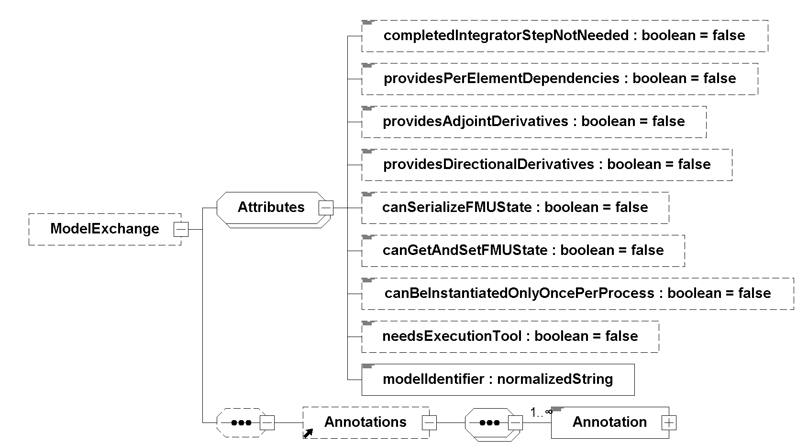

=== Description Schema [[model-exchange-schema]]

This is defined in <<fmi-description-schema>>.
Additionally, the Model Exchange-specific element `<ModelExchange>` is defined in the next section.

==== Model Exchange FMU (ModelExchange) [[ModelExchange]]

If the XML file defines an FMU for Model Exchange, element `<ModelExchange>` must be present.
It is defined as:

The following attributes are defined (all of them are optional, with exception of `modelIdentifier`):

[cols="1,1",options="header"]
|====
|Attribute
|Description

|`modelIdentifier`
|Short class name according to C syntax, for example, `A_B_C`.
Used as prefix for FMI functions if the functions are provided in C source code or in static libraries, but not if the functions are provided by a DLL/SharedObject.
`modelIdentifier` is also used as name of the static library or DLL/SharedObject.
See also <<header-files-and-naming-of-functions>>.

|`needsExecutionTool`
|If `true`, a tool is needed to execute the model and the FMU just contains the communication to this tool.
_[Typically, this information is only utilized for information purposes._
_For example, when loading an FMU with `needsExecutionTool = true`, the environment can inform the user that a tool has to be available on the computer where the model is instantiated._
_The name of the tool can be taken from attribute `generationTool` in `<fmiModelDescription>`.]_

|`completedIntegratorStepNotNeeded`
|If `true`, function <<fmi3CompletedIntegratorStep>> need not be called (this gives a slightly more efficient integration).
If it is called, it has no effect. +
If `false` (the default), the function must be called after every completed integrator step, see <<evaluation-of-model-equations>>.

|`canBeInstantiatedOnlyOncePerProcess`
|This flag indicates cases (especially for embedded code), where only one instance per FMU is possible (multiple instantiation is default = `false`; if multiple instances are needed and the flag `canBeInstantiatedOnlyOncePerProcess = true`, the FMUs must be instantiated in different processes).

|`canNotUseMemoryManagementFunctions`
|If `true`, the FMU uses its own functions for memory allocation and freeing only.
The callback functions <<allocateMemory>> and <<freeMemory>> given in <<fmi3Instantiate>> are ignored.

|`canGetAndSetFMUState`
|If `true`, the environment can inquire the internal FMU state and can restore it.
That is, functions <<fmi3GetFMUState>>, <<fmi3SetFMUState>>, and <<fmi3FreeFMUState>> are supported by the FMU.

|`canSerializeFMUState`
|If `true`, the environment can serialize the internal FMU state, in other words, functions <<fmi3SerializedFMUStateSize>>, <<fmi3SerializeFMUState>>, `fmi3DeSerializeFMUState` are supported by the FMU.
If this is the case, then flag `canGetAndSetFMUState` must be `true` as well.

|`providesDirectionalDerivative`
|If `true`, the directional derivative of the equations can be computed with `fmi3GetDirectionalDerivative`
|====

The flags have the following default values.

boolean: `false` +
unsignedInt: 0

==== Example XML Description File [[xml-example-model-exchange]]

When generating an FMU from the hypothetical model `MyLibrary.SpringMassDamper`, the XML file may have the following content:

[source, xml]
----
include::examples/model_exchange.xml[]
----
