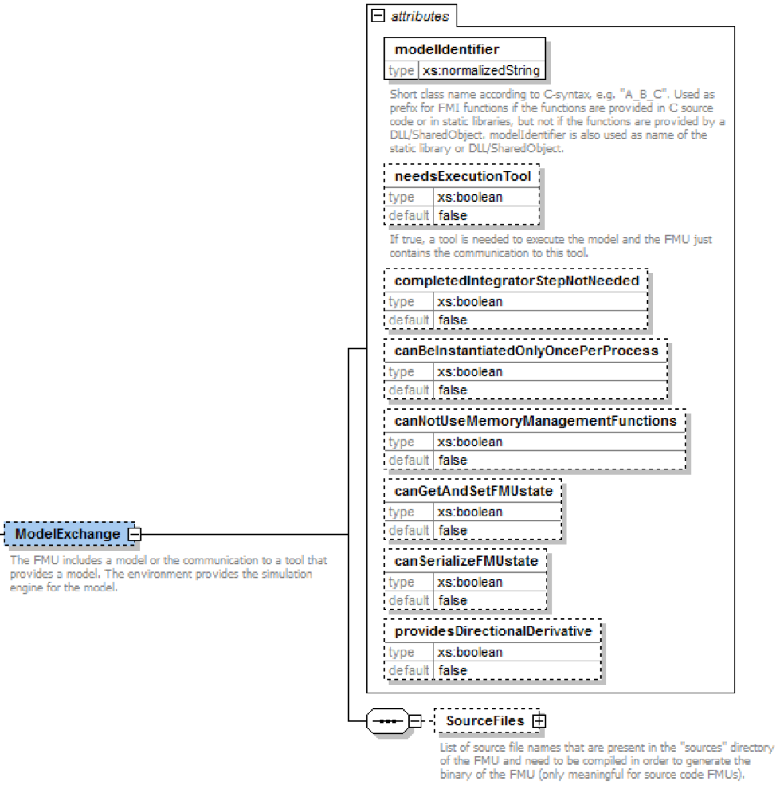
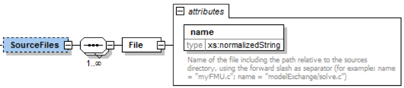

=== FMI Description Schema

This is defined in 2.2.
Additionally, the Model Exchange-specific element "ModelExchange" is defined in the next section.

==== Model Exchange FMU (ModelExchange)

If the XML file defines an FMU for Model Exchange, element "ModelExchange" must be present.
It is defined as:

The following attributes are defined (all of them are optional,
with exception of `"modelIdentifier"`):

[cols="1,1",options="header"]
|====
|Attribute Name
|_Description_

|`modelIdentifier`
|Short class name according to C syntax,
for example, "A_B_C".
Used as prefix for FMI functions if the functions are provided in C source code or in static libraries,
but not if the functions are provided by a DLL/SharedObject.
`modelIdentifier` is also used as name of the static library or DLL/SharedObject.
See also section 2.1.1.

|`needsExecutionTool`
|If `true`,
a tool is needed to execute the model and the FMU just contains the communication to this tool.
_[Typically, this information is only utilized for information purposes.
For example, when loading an FMU with `needsExecutionTool = "true"`,
the environment can inform the user that a tool has to be available on the computer where the model is instantiated.
The name of the tool can be taken from attribute generationTool of fmiModelDescription.]_

|`completedIntegratorStepNotNeeded`
|If `true`,
function `fmi2CompletedIntegratorStep` need not be called (this gives a slightly more efficient integration).
If it is called, it has no effect. +
If `false` (the default),
the function must be called after every completed integrator step,
see section 3.2.2.

|`canBeInstantiatedOnlyOncePerProcess`
|This flag indicates cases (especially for embedded code),
where only one instance per FMU is possible
(multiple instantiation is default = `false`;
if multiple instances are needed and the flag `canBeInstantiatedOnlyOncePerProcess = "true"`,
the FMUs must be instantiated in different processes).

|`canNotUseMemoryManagementFunctions`
|If `true`, the FMU uses its own functions for memory allocation and freeing only.
The callback functions `allocateMemory` and `freeMemory` given in `fmi2Instantiate` are ignored.

|`canGetAndSetFMUstate`
|If `true`, the environment can inquire the internal FMU state and can restore it.
That is, functions `fmi2GetFMUstate`, `fmi2SetFMUstate`,
and `fmi2FreeFMUstate` are supported by the FMU.

|`canSerializeFMUstate`
|If `true`, the environment can serialize the internal FMU state,
in other words, functions `fmi2SerializedFMUstateSize`, `fmi2SerializeFMUstate`,
`fmi2DeSerializeFMUstate` are supported by the FMU.
If this is the case, then flag `canGetAndSetFMUstate` must be true as well.

|`providesDirectionalDerivative`
|If `true`, the directional derivative of the equations can be computed with `fmi2GetDirectionalDerivative(..)`
|====

The flags have the following default values.

boolean: false +
unsignedInt: 0

==== Example XML Description File

When generating an FMU from the hypothetical model "MyLibrary.SpringMassDamper",
the XML file may have the following content:

[source, xml]
----
<?xml version="1.0" encoding="UTF-8"?>
<fmiModelDescription
  fmiVersion="2.0"
  modelName="MyLibrary.SpringMassDamper"
  guid="{8c4e810f-3df3-4a00-8276-176fa3c9f9e0}"
  description="Rotational Spring Mass Damper System"
  version="1.0"
  generationDateAndTime="2011-09-23T16:57:33Z"
  variableNamingConvention="structured"
  numberOfEventIndicators="2">
  <ModelExchange modelIdentifier="MyLibrary_SpringMassDamper"/>
  <UnitDefinitions>
    <Unit name="rad">
      <BaseUnit rad="1"/>
      <DisplayUnit name="deg" factor="57.2957795130823"/>
    </Unit>
    <Unit name="rad/s">
      <BaseUnit s="-1" rad="1"/>
    </Unit>
    <Unit name="kg.m2">
      <BaseUnit kg="1" m="2"/>
    </Unit>
    <Unit name="N.m">
      <BaseUnit kg="1" m="2" s="-2"/>
    </Unit>
  </UnitDefinitions>
  <TypeDefinitions>
    <SimpleType name="Modelica.SIunits.Inertia">
      <Real quantity="MomentOfInertia" unit="kg.m2" min="0.0"/>
    </SimpleType>
    <SimpleType name="Modelica.SIunits.Torque">
      <Real quantity="Torque" unit="N.m"/>
    </SimpleType>
    <SimpleType name="Modelica.SIunits.AngularVelocity">
      <Real quantity="AngularVelocity" unit="rad/s"/>
    </SimpleType>
    <SimpleType name="Modelica.SIunits.Angle">
      <Real quantity="Angle" unit="rad"/>
    </SimpleType>
  </TypeDefinitions>
  <DefaultExperiment startTime="0.0" stopTime="3.0" tolerance="0.0001"/>
  <ModelVariables>
    <ScalarVariable name="inertia1.J" valueReference="1073741824" description="Moment of load inertia" causality="parameter" variability="fixed">
      <Real declaredType="Modelica.SIunits.Inertia" start="1"/>
    </ScalarVariable>
    <!--index="1" -->
    <ScalarVariable name="torque.tau" valueReference="536870912" description="Accelerating torque acting at flange (= -flange.tau)" causality="input">
      <Real declaredType="Modelica.SIunits.Torque" start="0"/>
    </ScalarVariable>
    <!--index="2" -->
    <ScalarVariable name="inertia1.phi" valueReference="805306368" description="Absolute rotation angle of component" causality="output">
      <Real declaredType="Modelica.SIunits.Angle"/>
    </ScalarVariable>
    <!--index="3" -->
    <ScalarVariable name="inertia1.w" valueReference="805306369" description="Absolute angular velocity of component (= der(phi))" causality="output">
      <Real declaredType="Modelica.SIunits.AngularVelocity"/>
    </ScalarVariable>
    <!--index="4" -->
    <ScalarVariable name="x[1]" valueReference="0" ,="," initial = "exact">
      <Real start="0"/>
    </ScalarVariable>
    <!--index="5" -->
    <ScalarVariable name="x[2]" valueReference="1" ,="," initial = "exact">
      <Real start="0"/>
    </ScalarVariable>
    <!--index="6" -->
    <ScalarVariable name="der(x[1])" valueReference="2">
      <Real derivative="5"/>
    </ScalarVariable>
    <!--index="7" -->
    <ScalarVariable name="der(x[2])" valueReference="3">
      <Real derivative="6"/>
    </ScalarVariable>
    <!--index="8" -->
  </ModelVariables>
  <ModelStructure>
    <Outputs>
      <Unknown index="3"/>
      <Unknown index="4"/>
    </Outputs>
    <Derivatives>
      <Unknown index="7"/>
      <Unknown index="8"/>
    </Derivatives>
    <InitialUnknowns>
      <Unknown index="3"/>
      <Unknown index="4"/>
      <Unknown index="7" dependencies="5 2"/>
      <Unknown index="8" dependencies="5 6"/>
    </InitialUnknowns>
  </ModelStructure>
</fmiModelDescription>
----
