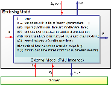

== FMI for Model Exchange
This chapter contains the interface description to access the equations of a dynamic system from a C program.
A schematic view of a model in "FMI for Model Exchange" format is shown in Figure 2:

.Data flow between the environment and an FMU for Model Exchange:
[blue]*Blue* arrows: Information provided by the FMU.
[red]*Red* arrows : Information provided to the FMU.
*vstart*, *u*, *y*, *w*, *xd* are of type Real, Integer, Boolean, String;
*t*, *xc*, *z* are of type Real.
[caption="Figure 2: "]

