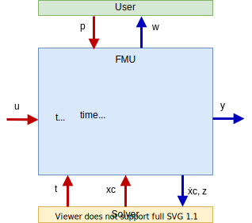

== FMI for Model Exchange [[fmi-for-model-exchange]]

This chapter contains the interface description to access the equations of a dynamic system from a C program.
A schematic view of an FMU for Model Exchange is shown in <<figure-model-exchange-data-flow>>:

.Data flow between the solver of the importer and the FMU for Model Exchange
[#figure-model-exchange-data-flow]

The goal of the Model Exchange interface is to numerically solve a system of differential, algebraic and discrete-time equations.
In this version of the interface, ordinary differential equations in state-space representation with events are handled (abbreviated as "hybrid ODE").
Algebraic equation systems might be contained inside the FMU.
Also, the FMU might consist of discrete-time equations only, for example, describing a sampled-data controller.
