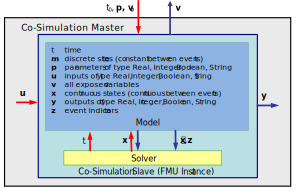

=== Mathematical Description

==== Basics

Co-simulation exploits the modular structure of coupled problems in all stages of the simulation process beginning with the separate model setup and preprocessing for the individual _subsystems_ in different _simulation tools_ (which can be powerful simulators as well as simple C programs).
During time integration,
the simulation is again performed independently for all subsystems restricting the data exchange between subsystems to discrete _communication points_ latexmath:[tc_i].
For simulator coupling,
also the visualization and post-processing of simulation data is done individually for each subsystem in its own native simulation tool.
In different contexts, the communication points latexmath:[tc_i],
the _communication steps_ latexmath:[tc_i \rightarrow tc_{i+1}] and the _communication step sizes_ latexmath:[hc_i := tc_{i+1} - tc_i] are also known as sampling points (synchronization points),
macro steps and sampling rates, respectively.
The term "communication point" in FMI for Co-Simulation refers to the communication between subsystems in a co-simulation environment and should not be mixed with the output points for saving simulation results to file.

FMI for Co-Simulation provides an interface standard for the solution of time dependent _coupled systems_ consisting of subsystems that are continuous in time
(model components that are described by instationary differential equations)
or time-discrete (model components that are described by difference equations such as discrete controllers).
In a block representation of the coupled system,
the subsystems are represented by blocks with (internal) _state variables_ latexmath:[x(t)] that are connected to other subsystems (blocks) of the coupled problem by _subsystem inputs_ latexmath:[u(t)] and _subsystem outputs_  latexmath:[y(t)].
In this framework,
the physical connections between subsystems are represented by mathematical coupling conditions between the inputs latexmath:[u(t)] and the outputs latexmath:[y(t)] of all subsystems,
_Kübler and Schiehlen (2000)_.

.Data flow at communication points.
[caption="Figure 10: "]

For co-simulation two basic groups of functions have to be realized:

. functions for the data exchange between subsystems
. functions for algorithmic issues to synchronize the simulation of _all_ subsystems and to proceed in communication steps latexmath:[tc_i \rightarrow tc_{i+1}] from initial time latexmath:[tc_0 := t_{start}] to end time latexmath:[tc_N := t_{stop}]

In FMI for Co-Simulation, both functions are implemented in one software component,
the co-simulation _master_.
The data exchange between the subsystems (_slaves_) is handled via the master only.
There is no direct communication between the slaves.
The master functionality can be implemented by a special software tool (a separate simulation backplane) or by one of the involved simulation tools.
In its most general form,
the coupled system may be simulated in _nested_ co-simulation environments and FMI for Co-Simulation applies to each level of the hierarchy.

FMI for Co-Simulation defines interface routines for the communication between the master and all slaves (subsystems) in a co-simulation environment.
The most common master algorithm stops at each communication point latexmath:[tc_i] the simulation
(time integration) of all slaves,
collects the outputs latexmath:[y(tc_i)] from all subsystems,
evaluates the subsystem inputs latexmath:[u(tc_i)],
distributes these subsystem inputs to the slaves and continues the (co-)simulation with the next communication step latexmath:[tc_i \rightarrow tc_{i+1} = tc_i + hc] with fixed communication step size latexmath:[hc].
In each slave,
an appropriate solver is used to integrate one of the subsystems for a given communication step latexmath:[tc_i \rightarrow tc_{i+1}].
The most simple co-simulation algorithms approximate the (unknown) subsystem inputs latexmath:[u(t),
(t > tc_i))] by frozen data latexmath:[u(tc_i)] for latexmath:[tc_i \leq t < tc_{i+1}].
FMI for Co-Simulation supports this classical brute force approach as well as more sophisticated master algorithms.
FMI for Co-Simulation is designed to support a very general class of master algorithms but it does _not_ define the master algorithm itself.

The ability of slaves to support more sophisticated master algorithms is characterized by a set of _capability flags_ inside the XML description of the slave (see section 4.3.1).
Typical examples are:

- the ability to handle variable communication step sizes latexmath:[hc_i],
- the ability to repeat a rejected communication step latexmath:[tc_i \rightarrow tc_{i+1}] with reduced communication step size,
- the ability to provide derivatives w.r.t. time of outputs to allow interpolation (section 4.2.1),
- or the ability to provide Jacobians.

FMI for Co-Simulation is restricted to slaves with the following
properties:

. All calculated values are time dependent functions within an a priori defined time interval latexmath:[t_{start} \leq t \leq t_{stop}] (provided `stopTimeDefined = fmi2True` when calling `fmi2SetupExperiment`).
. All calculations (simulations) are carried out with increasing time in general.
The current time latexmath:[t] is running step by step from latexmath:[t_{start}] to latexmath:[t_{stop}].
The algorithm of the slave may have the property to be able to repeat the simulation of parts of latexmath:[[t_{start}, t_{stop}]] or the whole time interval latexmath:[[t_{start}, t_{stop}]].
. The slave can be given a time value latexmath:[tc_i, t_{start} \leq tc_i \leq t_{stop}].
. The slave is able to interrupt the simulation when latexmath:[tc_i] is reached.
. During the interrupted simulation the slave (and its individual solver) can receive values for inputs latexmath:[u(tc_i)] and send values of outputs latexmath:[y(tc_i)].
. Whenever the simulation in a slave is interrupted, a new time value latexmath:[tc_{i+1},
tc_i \leq tc_{i+1} \leq t_{stop}],
can be given to simulate the time subinterval latexmath:[tc_i < t \leq tc_{i+1}]
. The subinterval length latexmath:[hc_i] is the communication step size of the latexmath:[i^{th}] communication step, latexmath:[hc_i = tc_{i+1} - tc_i].
The communication step size has to be greater than zero.

FMI for Co-Simulation allows a co-simulation flow which starts with instantiation and initialization (all slaves are prepared for computation,
the communication links are established),
followed by simulation (the slaves are forced to simulate a communication step),
and finishes with shutdown.
The details of the flow are given in the state machine of the calling sequences from master to slave (see section 4.2.4).

==== Mathematical Model

This section contains a formal mathematical model of a Co-Simulation FMU.
The following fundamental assumptions are made:

The slave simulators are seen by the master simulator as purely sampled-data systems.
Such a sampled-data system can be:

- A "real" sampled-data system (so a sampled discrete controller; the inputs and outputs can be of type Real, Integer, Boolean, String, or enumeration.
Variables of this type are defined with `variability = "discrete"`; the smallest sample period as accessible by the outside of the FMU is defined by attribute `stepSize` in element `DefaultExperiment`).
- A hybrid ODE that is integrated between communication points (known as "sampled access to time continuous systems") where internal events may occur and be handled,
but events are not visible from the outside of the FMU.
It is assumed here that all inputs and all outputs of this hybrid ODE are Real signals (defined with `variability = "continuous"`),
- A combination of the systems above.

The communication between the master and a slave takes only place at a discrete set of time instants,
called _communication points_.

An FMI Co-Simulation model is described by the following variables:

[options="header", cols="^1,7"]
|====
|_Variable_ |_Description_

|latexmath:[t] |Independent variable time latexmath:[\in \mathbb{R}].
(Variable defined with `causality = "independent"`). +
The i-th communication point is denoted as latexmath:[t = tc_i] +
The communication step size is denoted as latexmath:[hc_i = tc_{i+1} - tc_i]

|latexmath:[\mathbf{v}] | A vector of all exposed variables (all variables defined in element `<ModelVariables>`, see section 2.2.7).
A subset of the variables is selected via a subscript.
Example: +
latexmath:[\mathbf{v}_{initial=exact}] are variables defined with attribute `initial = "exact"`,
see section 2.2.7.
These are independent parameters and start values of other variables,
such as initial values for states, state derivatives or outputs.

|latexmath:[\mathbf{p}] |Parameters that are constant during simulation.
The symbol without a subscript references independent parameters (variables with `causality = "parameter"`).
Dependent parameters (variables with `causality = "calculatedParameter"`) are denoted as latexmath:[\mathbf{p}_{calculated}] and tunable parameters (variables with `causality = "parameter"` and `variability = "tunable"`) are denoted as latexmath:[\mathbf{p}_{tune}].

|latexmath:[\mathbf{u}(tc_i)] |Input variables.
The values of these variables are defined outside of the model.
Variables of this type are defined with attribute `causality = "input"`.
Whether the input is a discrete-time or
continuous-time variable is defined via attribute `variability = "discrete"` or
`"continuous"` (see section 2.2.7).

|latexmath:[\mathbf{y}(tc_i)] |Output variables.
The values of these variables are computed in the FMU
and they are designed to be used in a model connection.
So output variables might be used in the environment as
input values to other FMUs or other submodels.
Variables of this type are defined with attribute `causality = "output"`.
Via attribute `variability = "discrete"` or `"continuous"` it is defined whether the
output is a discrete-time or continuous-time variable,
see section 2.2.7.

|latexmath:[\mathbf{w}(tc_i)] |Local variables of the FMU that cannot be used for FMU connections.
Variables of this type are defined with attribute `causality = "local"` (see section 2.2.7).

|latexmath:[\mathbf{x}_c(t)] |A vector of real continuous-time variables representing the continuous-time states.
For notational convenience, a continuous-time state is conceptually
treated as a different type of variable as an output or a local variable
for the mathematical description below.
However, at a communication point, a continuous-time state is part of
the outputs or the local variables latexmath:[\mathbf{w}] of an FMU.

|latexmath:[\mathbf{x}_d(t)] +
latexmath:[^{\bullet}\mathbf{x}_d(t)]
|latexmath:[\mathbf{x}_d(t)] is a vector of (internal) discrete-time variables (of any type) representing the (internal) discrete states. +
latexmath:[^{\bullet}\mathbf{x}_d(t)] is the value of latexmath:[\mathbf{x}_d(t)] at the previous sample time instant,
so latexmath:[^{\bullet}\mathbf{x}_d(t) = \mathbf{x}_d(^{\bullet}t)]. +
Given the previous values of the discrete-time states,
latexmath:[^{\bullet}\mathbf{x}_d(t)],
at the actual time instant latexmath:[t],
all other discrete-time variables,
especially the discrete states latexmath:[\mathbf{x}_d(t)],
can be computed. +
Discrete states are not visible in the interface of an FMU and are only introduced here to clarify the mathematical description.
Formally, a discrete state is part of the outputs latexmath:[\mathbf{y}] or the local variables latexmath:[\mathbf{w}] of an FMU.
|====

When the transient simulation of the coupled system through co-simulation is completed,
the sequence of evaluations is the following (here latexmath:[\mathbf{x} = {\lbrack \mathbf{x}_c; \mathbf{x}_d \rbrack}^T] is the combined vector of continuous-time and discrete-time states,
and latexmath:[\mathbf{y} = {\lbrack \mathbf{y}_c; \mathbf{y}_d \rbrack}^T]) is the combined vector of continuous-time and discrete-time outputs):

.(4.1)
[latexmath]
++++
\mathrm{\text{for}}\ i = 0, \cdots, n-1

\begin{Bmatrix}

\mathbf{x}_{i+1} = \Phi_i \left( \mathbf{x}_i \left\{ \mathbf{u}_i^{(j)} \right\}_{j=0,\cdots,m_{ido}}, \mathbf{p}_{tune,i}, hc_i  \right)

\\

\left( \left\{ \mathbf{y}^{(j)}_{i+1} \right\}_{j=0,\cdots,m_{odo}}, \mathbf{w}_{i+1}\right) = \Gamma_i \left( \mathbf{x}_i, \left\{ \mathbf{u}^{(j)}_i \right\}_{j=0,\cdots,m_{ido}}, \mathbf{p}_{tune}, hc_i \right)

\end{Bmatrix}
++++

where latexmath:[\mathbf{\Phi}_i] and latexmath:[\mathbf{\Gamma}_i] define the system behavior for the time interval latexmath:[tc_i \leq t < tc_{i+1}],
with latexmath:[tc_i = tc_0 + \sum_{k=0}^{i-1}hc_k].

_[For the part of the co-simulation slave that is based on an ODE,
a differential equation is solved between communication points:_

[latexmath]
++++
\dot{\mathbf{x}}_c = \mathbf{\varphi} \left( \mathbf{x}_c(t), \mathbf{u}_c(t),
\mathbf{p}_{tune} \right)
++++

_In this case,
the following relationship should hold (note the use of_ latexmath:[\mathbf{x}_{i+1}] _here):_

[latexmath]
++++
\frac{\partial\mathbf{\Phi_i}}{\partial hc_i}
=
\boldsymbol{\varphi} \left( \mathbf{x}_{c,i+1},
\sum^{m_{ido}}_{j=0} \mathbf{u}^{(j)}_{c,i} \frac{hc^j_i}{j!},
\mathbf{p}_{tune,i}  \right)
++++

_This relation is in practice inexact due to using finite precision on machines and stopping iterations early.
The slave simulators are responsible for implementing_ latexmath:[\mathbf{\Phi}_i] _and_ latexmath:[\mathbf{\Gamma}_i]_;
for example, to handle stiff differential equations as:_

[latexmath]
++++
\mathbf{\Phi}_i \left( \mathbf{x}_{c,i}, \left\{ \mathbf{u}_{c,i}^{(j)} \right\}_{= 0,\cdots,m_{ido}},\ \mathbf{p}_{tune,i}, tc_i \right)
=
\mathbf{x}_{ci} + \left( \mathbf{I} -
hc_i \frac{\partial \mathbf{\varphi}}{\partial \mathbf{x}_c} \right)^{- 1}  hc_i \mathbf{\phi} \left( \mathbf{x}_{c,i}, \mathbf{u}_{c,i}, \mathbf{p}_{tune,i} \right) +
O(hc_i^{2}).
++++

_]_

Definition (4.1) is consistent with the definition of co-simulation by
(Kübler, Schiehlen 2000).

* At the communication points, the master provides generalized inputs to the slave, which can be:

** The current input variables latexmath:[\mathbf{u}_i^{(0)}] of the subsystem
(in other words, the input variables of the model contained in the slave simulator,
in the sense of system-level simulation),
along with some of their successive derivatives latexmath:[\left\{ \mathbf{u}_i^{(j)} \right\}_{j=1,\cdots,m_{ido}}] (in case of continuous-time variables), where latexmath:[m_{ido}] stands for the model input derivative order.

** Varying parameters latexmath:[\mathbf{p}_{tune,i}], also known as tunable parameters.

* The slave provides generalized outputs to the master, which are:

** The current output variables latexmath:[\mathbf{y}_{i+1}^{(0)}]of the subsystem (same remark as above),
along with some of their successive derivatives latexmath:[\left\{ \mathbf{y}_{i+1}^{(j)} \right\}_{j=1,\cdots,m_{odo}}](in case of continuous-time variables).

** Observation variables and "calculated" varying parameters latexmath:[\mathbf{w}_{i+1}],
along with directional derivatives estimated at latexmath:[t = tc_{i+1}] (in case of continuous-time variables).

* Initialization: The slave being a sampled-data system,
its internal states (which can be either continuous-time or discrete-time)
need to be initialized at latexmath:[t = tc_0].
This is performed through an auxiliary function _[this relationship is defined in the XML file under `<ModelStructure><InitialUnknowns>`]_:

Computing the solution of an FMI Co-Simulation model means to split the
solution process in two phases and in every phase different equations
and solution methods are utilized.
The phases can be categorized according to the following modes:

1. *Initialization Mode:* +
This mode is used to compute at the start time latexmath:[t_0] initial values for internal variables of the Co-Simulation slave,
especially for continuous-time states,
latexmath:[\mathbf{x}_d(t_0)],
and for the previous discrete-time states,
latexmath:[^{\bullet}\mathbf{x}_d(t_0)],
by utilizing extra equations not present in the other mode _[for example, equations to set all derivatives to zero, that is, to initialize in steady-state]_.
If the slave is connected in loops with other models,
iterations over the FMU equations are possible.
Algebraic equations are solved in this mode.

2.  *Step* *Mode:* +
This mode is used to compute the values of all (real) continuous-time and discrete-time variables at communication points by numerically solving ordinary differential,
algebraic and discrete equations.
If the slave is connected in loops with other models,
no iterations over the FMU equations are possible.

_[Note that for a Co-Simulation FMU,
no super dense time description is used at communication points.]_

The equations are defined in Table 2 can be evaluated in the respective Mode.
The following color coding is used in the table:

[cols="1,8"]
|====
|[silver]#*grey*# |If a variable in an argument list is marked in grey,
then this variable is not changing in this mode and just the last calculated value from the previous mode is internally used.
For an input argument it is not allowed to call `fmi2SetXXX`.
For an output argument,
calling `fmi2GetXXX` on such a variable returns always the same value in this mode.
|[lime]#*green*# |Functions marked in [lime]#green# are special functions to enter or leave a mode.
|[blue]#*blue*# |Equations and functions marked in [blue]#blue# define the actual computations to be performed in the respective mode.
|====

Function `fmi2SetXXX` used in the table below,
is an abbreviation for functions `fmi2SetReal`, `fmi2SetBoolean`,
`fmi2SetInteger` and `fmi2SetString` respectively.
Function `fmi2GetXXX` is an abbreviation for functions `fmi2GetReal`,
`fmi2GetBoolean`, `fmi2GetInteger` and `fmi2GetString` respectively.

.Mathematical description of an FMU for Co-Simulation.
[cols="2,1",options="header",]
|====
|*Equations* |*FMI functions*

2+|*Equations before Initialization Mode* ("instantiated" in state machine)

|Set and set start value of independent variable latexmath:[tc_{i=0}]
|`fmi2SetupExperiment`

|Set variables and that have a start value (`initial` = `"exact"` or `"approx"`)
|`fmi2SetXXX`

2+|*Equations during Initialization Mode* ("InitializationMode" in state machine)

|[lime]#Enter Initialization Mode at (activate initialization,
discrete-time and continuous-time equations)# |[lime]#fmi2EnterInitializationMode#

|Set variables latexmath:[v_{initial=exact}] and latexmath:[v_{initial=approx}] that have a start value with `initial` = `"exact"` (independent parameters latexmath:[\mathbf{p}] and continuous-time states with start values latexmath:[\mathbf{x}_{c,initial=exact}] are included here)
|`fmi2SetXXX`

|Set continuous-time and discrete-time inputs latexmath:[\mathbf{u}_{c+d}(tc_0)] and optionally the derivatives of continuous-time inputs latexmath:[\mathbf{u}_{c}^{(j)}(tc_0)]
|`fmi2SetXXX` +
`fmi2SetRealInputDerivatives`

|[blue]#latexmath:[\mathbf{v}_{InitialUnknowns} := \mathbf{f}_{init}(\mathbf{u}_c, \mathbf{u}_d, t_0, \mathbf{v}_{initial=exact})]#
|`[blue]#fmi2GetXXX#` +
`[blue]#fmi2GetDirectionalDerivative#`

|[lime]#Exit Initialization Mode (de-activate initialization equations)#
|[lime]#fmi2ExitInitializationMode#

2+|*Equations during Step Mode* ("stepComplete", "stepInProgress" in state machine)

|Set independent tunable parameters latexmath:[\mathbf{p}_{tune}] (and do not set other parameters latexmath:[\mathbf{p}_{other}])
|`fmi2SetXXX`

|Set continuous-time and discrete-time inputs latexmath:[\mathbf{u}_{d+c}(tc_i)] and optionally the derivatives of continuous-time inputs latexmath:[\mathbf{u}_{c}^{(j)}(tc_i)]
|`fmi2SetXXX` +
`fmi2SetRealInputDerivatives`

|[blue]#latexmath:[\begin{matrix} tc_{i+1} := tc_i + hc_i \\ (\mathbf{y}_{c+d}, \mathbf{y}_c^{(j)}, \mathbf{w}_{c+d}) := \mathbf{f}_{doStep}(\mathbf{u}_{c+d}, \mathbf{u}_{c}^{(j)}, tc_i, hc_i, \mathbf{p}_{tune}, \mathbf{p}_{other})_{tc_i} \\ tc_i := tc_{i+1} \end{matrix}]# +
[blue]#latexmath:[\mathbf{f}_{doStep}] is also a function of the internal variables latexmath:[\mathbf{x}_c], latexmath:[^{\bullet}\mathbf{x}_d]#

|`[blue]#fmi2DoStep#` +
`fmi2GetXXX` +
`[blue]#fmi2GetRealOutputDerivatives#` +
`[blue]#fmi2GetDirectionalDerivative#`

2+|*Data types*

2+|latexmath:[t, tc, hc \in \mathbb{R}, \mathbf{p} \in \mathbb{P}^{np}, \mathbf{u}(tc) \in \mathbb{P}^{nu}, \mathbf{y}(tc) \in \mathbb{P}^{ny}, \mathbf{x}_c(t) \in \mathbb{R}^{nxc}, \mathbf{x}_d(t) \in \mathbb{P}^{nxd}, \mathbf{w}(tc) \in \mathbb{P}^{nw}] +
latexmath:[\mathbb{R}]: Real variable, latexmath:[\mathbb{R}]: real *or* boolean *or* integer *or* enumeration *or* string variable +
latexmath:[\mathbf{f}_{init}, \mathbf{f}_{out} \in C^0] (=continuous functions with respect to all input arguments inside the respective mode).
|====

_[Remark - Calling Sequences:_

_In the table above,
for notational convenience in Initialization Mode one function call is defined to compute all output arguments from all inputs arguments.
In reality, every scalar output argument is computed by one_ `fmi2GetXXX` _function call._

_In_ _Step Mode the input arguments to_ latexmath:[\mathbf{f}_{doStep}] _are defined by calls to_ `fmi2SetXXX` _and_ `fmi2SetRealInputDerivatives` _functions.
The variables computed by_ latexmath:[\mathbf{f}_{doStep}] _can be inquired by_  `fmi2GetXXX` _function calls.]_
