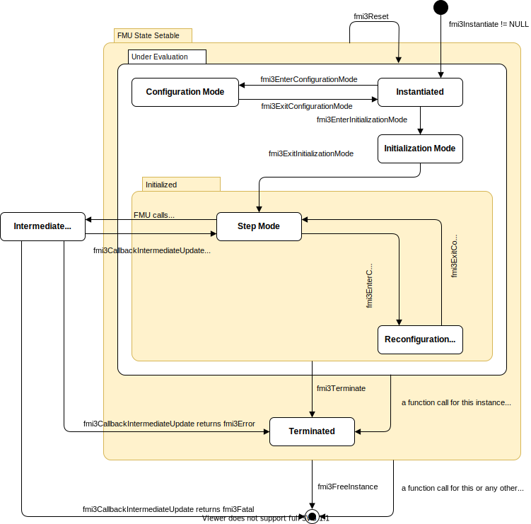
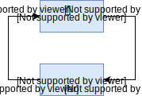

=== Application Programming Interface

This section contains the interface description to access the input/output data and status information of a Co-Simulation slave from a C program.

==== Variables access in Co-Simulation interface types [[transfer-of-input-output-and-parameters]]

<<input,`Input`>> and <<output>> variables and other variables are accessed via the `fmi3Get{VariableType}` and `fmi3Set{VariableType}` functions, defined in <<get-and-set-variable-values>>.

In order to enable the master to interpolate the <<continuous>> floating point <<input,`inputs`>> between communication steps, the <<derivative,`derivatives`>> of the <<output,`outputs`>> with respect to time at the end of a communication step can be enquired by the master. This is also possible for higher <<derivative,`derivatives`>> with respect to time.

_[The master is then able to extrapolate inputs using this information using <<intermediate-variable-access>>. This enables the same functionality as with `fmi2SetInputDerivatives` in FMI1.0 and FMI2.0]_

[[fmi3GetOutputDerivatives,`fmi3GetOutputDerivatives`]]
[source, C]
----
include::../headers/fmi3FunctionTypes.h[tags=GetOutputDerivatives]
----

With the arguments:

--
* `valueReferences` is a vector of value references that define the variables whose <<derivative,`derivatives`>> shall be retrieved.
If multiple derivatives of a variable shall be retrieved, list the value reference multiple times.

* `nValueReferences` is the dimension of the arguments `valueReferences` and `orders`.

* `orders` contains the orders of the respective <<derivative>> (1 means the first <<derivative>>, 2 means the second <<derivative>>, ..., 0 is not allowed).
If multiple derivatives of a variable shall be retrieved, provide a list of them in the `orders` array, corresponding to a multiply occurring value reference in the `valueReferences` array.

* `values` is a vector with the values of the <<derivative,`derivatives`>>. The order of the `values` elements is derived from a twofold serialization: the outer level corresponds to the combination of a value reference (e.g., `valueReferences[k]`) and order (e.g., `orders[k]`), and the inner level to the serialization of variables. The inner level does not exist for scalar variables.

* `nValues` is the size of the argument `values`. `nValues` only equals `nValueReferences` if all corresponding output variables are scalar variables.
--

<<fmi3GetOutputDerivatives>>::
Retrieves the n-th <<derivative>> of <<output>> values.
Restrictions on using the function are the same as for the `fmi3Get{VariableType}` function.
The returned <<output,`outputs`>> correspond to the current slave time.
E.g. after a successful call to <<fmi3DoStep>> the returned values are related to the end of the communication time step.

To allow interpolation/approximation of the floating point output variables between communication steps by the master, the <<derivative,`derivatives`>> of the <<output,`outputs`>> with respect to time can be read.
Whether the slave is able to provide the <<derivative,`derivatives`>> of <<output,`output`>> is given by the unsigned integer capability flag `maxOutputDerivativeOrder`.
It delivers the maximum order of the <<output>> <<derivative, `derivatives`>>.
If the actual order is lower (because the order of integration algorithm is low), the retrieved value is 0.

_[ Example:_ +
_Assuming an FMU has outputs latexmath:[y_1][2*3] with value reference 1, latexmath:[y_2] with value reference 2, latexmath:[ y_3][2] value reference 3, latexmath:[y_4] with value reference 4 and `maxOutputDerivativeOrder`=2._ +
_With `valueReferences`= [1, 1, 3, 3, 4, 4], and `orders`= [1, 2, 1, 2, 1, 2], <<fmi3GetOutputDerivatives>> will provide first and second time derivatives of the outputs y1, y3, y4, which in `values` are serialized in the following way:_
_((array serialization of latexmath:[\dot y_1]), (array serialization of latexmath:[\ddot y_1]), (array serialization of latexmath:[\dot y_3]), (array serialization of latexmath:[\ddot y_3]), latexmath:[\dot y_4], latexmath:[\ddot y_4])_ +
_If the internal polynomial is of order 1 and the master inquires the second <<derivative>> of an <<output>>, the slave will return zero.]_

==== Computation in Co-Simulation interface types

The importer requests the computation of the next time step with the following function:

[[fmi3DoStep,`fmi3DoStep`]]
[source, C]
----
include::../headers/fmi3FunctionTypes.h[tags=DoStep]
----

[[currentCommunicationPoint,`currentCommunicationPoint`]]
* `currentCommunicationPoint` is the current communication point of the master (latexmath:[tc_i]) and

[[communicationStepSize,`communicationStepSize`]]
* `communicationStepSize` is the communication step size (latexmath:[hc_i]). `comunicationStepSize` must be latexmath:[> 0.0].

[[noSetFMUStatePriorToCurrentPoint,`noSetFMUStatePriorToCurrentPoint`]]
* `noSetFMUStatePriorToCurrentPoint == fmi3True` if `fmi3SetFMUState` will no longer be called for time instants prior to <<currentCommunicationPoint>> in this simulation run. _[The slave can use this flag to flush a result buffer]_

* `terminate` signals to the Co-Simulation master that the FMU requests the end of the simulation for internal reasons.
This is not due to an error, but a natural limit to the simulation time has been reached inside the FMU.

[[earlyReturn,`earlyReturn`]]
* `earlyReturn` signals to the Co-Simulation master that the FMU returns early from the <<fmi3DoStep>> at the time specified in <<lastSuccessfulTime>>.

[[lastSuccessfulTime,`lastSuccessfulTime`]]
* `lastSuccessfulTime` represents the internal time of the FMU when <<fmi3DoStep>> returns.

The slave is expected to compute until time latexmath:[tc_{i+1} = tc_i + hc_i], or <<lastSuccessfulTime>> `=` <<currentCommunicationPoint>> `+` <<communicationStepSize>>.

This is especially interesting, if <<fmi3DoStep>> returns with <<earlyReturn,`earlyReturn == fmi3True`>>.
In this case, the step did not compute until latexmath:[tc_{i+1}], but stopped computation error free until <<lastSuccessfulTime>>.
However, even when the FMU returns from <<fmi3DoStep>> with <<fmi3OK>>, it is allowed that <<lastSuccessfulTime>> deviates from the expected <<currentCommunicationPoint>> `+` <<communicationStepSize>>.
_[An example is a fixed-step integrator inside the FMU that cannot possibly stop at exactly the requested time._
_Advanced Co-Simulation master algorithms might be able to take this information into account._
_It is even possible that the <<lastSuccessfulTime>> is still equal to <<currentCommunicationPoint>> when <<earlyReturn,`earlyReturn == fmi3True`>> is returned (contrary to the possibly expected <<fmi3Discard>>) to indicate a changed internal state of the FMU, e.g. steps in super-dense time.]_

_[The calling environment defines the communication points and <<fmi3DoStep>> must synchronize to these points by always integrating exactly to latexmath:[tc_i + hc_i]._
_It is up to <<fmi3DoStep>> how to achieve this.]_

At the first call to <<fmi3DoStep>> after <<fmi3ExitInitializationMode>> was called <<currentCommunicationPoint>> must be equal to `startTime` as set with <<fmi3EnterInitializationMode>>.

_[Formally, argument <<currentCommunicationPoint>> is not needed._
_It is present in order to handle a mismatch between the master and the FMU state of the slave: The <<currentCommunicationPoint>> and the FMU state of the slaves defined by former_ <<fmi3DoStep>> _or_ `fmi3SetFMUState` _calls have to be consistent with respect to each other._
_For example, if the slave does not use the update formula for the <<independent>> variable as required above,_ latexmath:[tc_{i+1} = tc_i + hc_i] _(using argument_ latexmath:[tc_i] = <<currentCommunicationPoint>> _of_ <<fmi3DoStep>>) _but uses internally an own update formula, such as_ latexmath:[tc_{s,i+1} = tc_{s,i} + hc_{s,i}] _then the slave could use as time increment_ latexmath:[\text{hc}_{s,i} := (tc_i - tc_{s,i}) + hc_i] _(instead of_ latexmath:[\text{hc}_{s,i} := hc_i] _) to avoid a mismatch between the master time_ latexmath:[tc_{i+1}] _and the slave internal time_ latexmath:[tc_{s,i+1}] _for large i.]_

It depends on the capabilities of the FMU which argument constellations and calling sequences are allowed (see <<fmi-for-basic-co-simulation>>).

==== State Machine for Basic Co-Simulation [[state-machine-basic-co-simulation]]

The state machine in <<figure-co-simulation-state-machine>> defines the supported calling sequences.

.Calling sequence of Co-Simulation C functions in form of an UML 2.0 state machine.
[#figure-co-simulation-state-machine]

In this Co-Simulation interface the following functions must not be called: <<fmi3ActivateModelPartition>>, <<fmi3NewDiscreteStates>>, <<fmi3EnterEventMode>>, <<fmi3SetClock>>, <<fmi3GetClock>>, <<fmi3SetIntervalFraction>>, <<fmi3GetIntervalFraction>>, <<fmi3SetIntervalDecimal>>, <<fmi3GetIntervalDecimal>> including all functions that are specific to Model Exchange.

===== State: FMU State Setable [[state-fmu-state-setable-co-simulation]]

In all states of this super state it is allowed to call <<fmi3GetFMUState>>, <<fmi3SetFMUState>>, <<fmi3FreeFMUState>>`, <<fmi3SerializedFMUStateSize>>, <<fmi3SerializeFMUState>>, `fmi3DeSerializeFMUState`, <<fmi3Reset>>, <<fmi3GetVersion>>, `fmi3SetDebugLogging` and <<fmi3FreeInstance>>.

If any function returns with <<fmi3Fatal>> the FMU enters the terminal state.

===== State: Under Evaluation [[state-under-evaluation-co-simulation]]

This super state is entered by the FMU when <<fmi3Instantiate>> is called.
If any function returns <<fmi3Error>> the FMU enters state *Terminated*.

===== State: Initialized [[state-initialized-co-simulation]]

This super state is entered by the FMU when <<fmi3ExitInitializationMode>> is called.
If the function <<fmi3Terminate>> is called, the FMU enters state *Terminated*.

===== State: Instantiated [[state-instantiated-co-simulation]]

In this state the FMU can do one-time initializations and allocate memory.
The FMU sets all variables to its <<start>> values.

Allowed Function Calls::
<<fmi3EnterInitializationMode>>, <fmi3EnterConfigurationMode>>

`fmi3Set{VariableType}`::
For variables with <<variability>> latexmath:[\neq] <<constant>> and for which <<initial>> = <<exact>> or <<approx>>.
The intention is to set <<start>> and guess values for these variables.

Forbidden Function Calls::
<<fmi3Instantiate>>, <<fmi3Terminate>>, `fmi3Get{VariableType}`, <<fmi3GetDirectionalDerivative>>, <<fmi3GetOutputDerivatives>>, <<fmi3DoStep>>, <<fmi3ExitInitializationMode>>, <<fmi3ExitConfigurationMode>>, <<fmi3EnterStepMode>>

===== State: Initialization Mode [[state-initialization-mode-co-simulation]]
This mode is used by the master to compute consistent initial conditions for overall system.
Therefore iterative calls of `fmi3Set{VariableType}` and `fmi3Get{VariableType}` are allowed.
In between the FMU must evaluate all relevant equations.
In this way artificial or real algebraic loops over connected FMUs in *Initialization Mode* may be handled by using appropriate numerical algorithms.

Allowed Function Calls::
<<fmi3ExitInitializationMode>>, <<fmi3GetDirectionalDerivative>>

`fmi3Set{VariableType}`::
For variables with:
* <<variability>> latexmath:[\neq] <<constant>> that have <<initial>> = <<exact>>, or
* <<causality>> = <<input>>, or
* <<causality>> = <<parameter>> and <<variability>> = <<tunable>>.

`fmi3Get{VariableType}`::
For variables with <<causality>> = <<output>> or continuous-time <<state,`states`>> or state derivatives.

Forbidden Function Calls::
<<fmi3Instantiate>>, <<fmi3Terminate>>, <<fmi3DoStep>>, <<fmi3EnterInitializationMode>>, <<fmi3EnterConfigurationMode>>, <<fmi3ExitConfigurationMode>>, <<fmi3EnterStepMode>>

===== State: Step Mode [[state-step-mode-co-simulation]]

This state is used by the master to progress simulation time.

Allowed Function Calls::
<<fmi3GetDirectionalDerivative>>, <<fmi3GetOutputDerivatives>>, `fmi3Get{VariableType}`, <<fmi3Terminate>>

<<fmi3EnterConfigurationMode>>::
With this function call the *Reconfiguration Mode* is entered.
This function must not be called if the FMU contains no <<tunable>> <<structuralParameter,`structural parameters`>> (i.e. with <<causality>>= <<structuralParameter>> and <<variability>> = <<tunable>>).

<<fmi3DoStep>>::
Within <<fmi3DoStep>> the FMU may call <<fmi3CallbackIntermediateUpdate>>
* If the function returns with <<fmi3OK>> or <<fmi3Warning>> the FMU stays in this state.
* If the function returns with <<earlyReturn,`earlyReturn == fmi3True`>> the FMU will change to states depending on the flags of <<fmi3CallbackIntermediateUpdate>>.

`fmi3Set{VariableType}`::
For variables with:
* <<causality>> = <<input>>, or
* <<causality>> = <<parameter>> and <<variability>> = <<tunable>>

It is not allowed to call `fmi3Get{VariableType}` functions after `fmi3Set{VariableType}` functions without an <<fmi3DoStep>> call in between.

_[The reason is to avoid different interpretations of the caching, since contrary to FMI for Model Exchange, <<fmi3DoStep>> will perform the actual calculation instead of `fmi3Get{VariableType}`, and therefore, dummy algebraic loops at communication points cannot be handled by an appropriate sequence of `fmi3Get{VariableType}` and, `fmi3Set{VariableType}` calls as for Model Exchange._

_Examples:_

[cols="3,4",options="header"]
|====
|_Correct calling sequence_
|_Wrong calling sequence_

|_fmi3Set{VariableType} on inputs_ +
_fmi3DoStep_ +
_fmi3Get{VariableType} on outputs_ +
_fmi3Set{VariableType} on inputs_ +
_fmi3DoStep_ +
_fmi3Get{VariableType} on outputs_ +

|_fmi3Set{VariableType} on inputs_ +
_fmi3DoStep_ +
_fmi3Get{VariableType} on outputs_ +
_fmi3Set{VariableType} on inputs_ +
_fmi3Get{VariableType} on outputs // not allowed_ +
_fmi3DoStep_ +
_fmi3Get{VariableType} on outputs_ +
|====
_]_

Forbidden Function Calls::
<<fmi3ExitConfigurationMode>>, <<fmi3Instantiate>>, <<fmi3EnterInitializationMode>>, <<fmi3ExitInitializationMode>>, <<fmi3EnterStepMode>>

===== State: Intermediate Update Mode [[state-intermediate-update-mode-co-simulation]]

In this state the master can retrieve information from the FMU between communication points.
Functions called in this state must not return <<fmi3Discard>>.

The FMU enters this state by calling <<fmi3CallbackIntermediateUpdate>> within <<fmi3DoStep>> and leaves the state towards state *Step Mode* if the function returns <<fmi3OK>> or <<fmi3Warning>>.
If the function returns <<fmi3Error>> the FMU enters state *Terminated*.
If the function returns <<fmi3Fatal>> the FMU enters the terminal state.

Allowed Function Calls::

`fmi3Set{VariableType}`::
If <<intermediateVariableSetAllowed,`intermediateVariableSetAllowed == fmi3True`>>, the value of intermediate variables can be set.
Intermediate variables are variables that are marked with attribute <<intermediateAccess,`intermediateAccess = true`>> in the <<modelDescription.xml>>.

`fmi3Get{VariableType}`, <<fmi3GetOutputDerivatives>>::
If <<intermediateVariableGetAllowed,`intermediateVariableGetAllowed == fmi3True`>>, the value of intermediate variables can be retrieved.
Intermediate variables are variables that are marked with attribute <<intermediateAccess,`intermediateAccess = true`>> in the <<modelDescription.xml>>.

Forbidden Function Calls::
The same functions which are not allowed to be called in *Step Mode* must not be called in this state.
Additionally the following functions must not be called <<fmi3EnterConfigurationMode>>, <<fmi3Terminate>>, <<fmi3DoStep>>, <<fmi3GetDirectionalDerivative>>.

===== State: Reconfiguration Mode [[state-reconfiguration-mode-co-simulation]]

In this state <<structuralParameter,`structural parameters`>> with <<variability>> = <<tunable>> can be changed.
This state is entered from state *Step Mode* by calling <<fmi3EnterConfigurationMode>> and left back to *Step Mode* by calling <<fmi3ExitConfigurationMode>>.

Allowed Function Calls::
<<fmi3ExitConfigurationMode>>

`fmi3Set{VariableType}`::
Only for variables with <<causality>> = <<structuralParameter>> and <<variability>> = <<tunable>>.

Forbidden Function Calls::
<<fmi3EnterConfigurationMode>>, <<fmi3Instantiate>>, <<fmi3EnterInitializationMode>>, <<fmi3ExitInitializationMode>>>>, <<fmi3DoStep>>, <<fmi3EnterStepMode>>, <<fmi3GetDirectionalDerivative>>, <<fmi3GetOutputDerivatives>>, `fmi3Get{VariableType}`

===== State: Terminated [[state-terminated-co-simulation]]

In this state, the solution at the final time of the simulation can be retrieved.

Allowed Function Calls::
`fmi3Get{VariableType}`, <<fmi3GetDirectionalDerivative>>, <<fmi3GetOutputDerivatives>>

Forbidden Function Calls::
<<fmi3EnterConfigurationMode>>, <<fmi3ExitConfigurationMode>>, <<fmi3Instantiate>>, <<fmi3EnterInitializationMode>>, <<fmi3ExitInitializationMode>>, <<fmi3DoStep>>, `fmi3Set{VariableType}`

===== State: Configuration Mode [[state-configuration-mode-co-simulation]]

In this state <<structuralParameter,`structural parameters`>> with <<variability>> = <<tunable>> can be changed.

This state is entered from state *Instantiated* by calling <<fmi3EnterConfigurationMode>> and left back to *Instantiated* by calling <<fmi3ExitConfigurationMode>>.

Allowed Function Calls::
<<fmi3ExitConfigurationMode>>

`fmi3Set{VariableType}`::
Only for variables with <<causality>> = <<structuralParameter>> and <<variability>> = <<tunable>>.

Forbidden Function Calls::
 <<fmi3EnterConfigurationMode>>, <<fmi3Instantiate>>, <<fmi3EnterInitializationMode>>, <<fmi3ExitInitializationMode>>, <<fmi3DoStep>>, <<fmi3EnterStepMode>>, <<fmi3GetDirectionalDerivative>>, <<fmi3GetOutputDerivatives>>, `fmi3Get{VariableType}`

==== Code Example for Basic Co-Simulation

In the following example, the usage of the FMI functions is sketched in order to clarify the typical calling sequence of the functions in a simulation environment.
We consider two slaves, where both have one <<continuous>> floating point <<input>> and one <<continuous>> floating point <<output>> which are connected in the following way:

.Connection graph of the slaves.

We assume no algebraic dependency between input and <<output>> of each slave.
The code demonstrates the simplest master algorithm as shown in <<math-basic-co-simulation>>:

[start=8]
. Constant communication step size.
. No repeating of communication steps.
. The slaves do not support asynchronous execution of <<fmi3DoStep>>.

The error handling is implemented in a very rudimentary way.

[source, C]
----
include::Reference-FMUs/examples/co_simulation.c[tags=CoSimulation]
----
