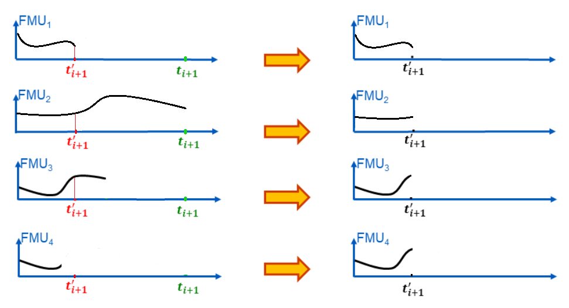
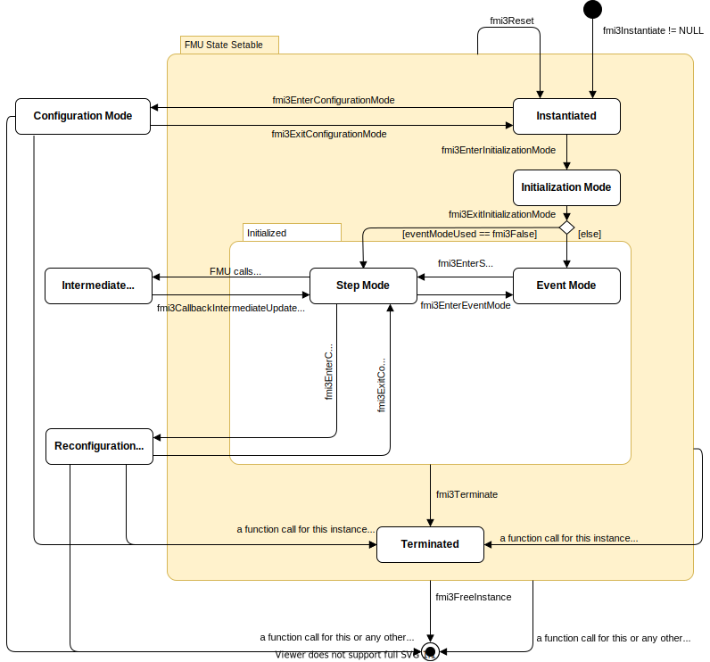
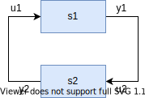

=== Application Programming Interface [[co-simulation-api]]

This section contains the interface description to access the input/output data and status information of a Co-Simulation FMU from a C program.

==== Getting and Setting Variable Values [[transfer-of-input-output-and-parameters]]

<<input,`Input`>>, <<output>> and other variables are accessed via the `fmi3Get{VariableType}` and `fmi3Set{VariableType}` functions, defined in <<get-and-set-variable-values>>.

Function <<fmi3GetOutputDerivatives>>::

--
The n-th <<derivative,`derivatives`>> with respect to time of continuous <<output,`outputs`>> can be retrieved with <<fmi3GetOutputDerivatives>> to allow interpolation/extrapolation of connected input variables between communication points by the co-simulation algorithm using <<fmi3CallbackIntermediateUpdate>>. +
_[This enables the same functionality as `fmi2SetInputDerivatives` did in FMI1.0 and FMI2.0.]_

Whether the FMU is able to provide the <<derivative,`derivatives`>> of <<output,`outputs`>> is given by the unsigned integer capability flag `maxOutputDerivativeOrder` that represents the maximum order of the <<output>> <<derivative, `derivatives`>>.
If the actual order is lower (because the order of integration algorithm is low), the retrieved value is 0.

Restrictions on calling the function are the same as for the `fmi3Get{VariableType}` function for <<continuous>> <<output,`outputs`>>.
The returned values correspond to the current time of the FMU.
For example, after a successful call to <<fmi3DoStep>>, the returned values are related to the end of the communication step.
--

[[fmi3GetOutputDerivatives,`fmi3GetOutputDerivatives`]]
[source, C]
----
include::../headers/fmi3FunctionTypes.h[tags=GetOutputDerivatives]
----

--
* `valueReferences` is a vector of value references that define the variables whose <<derivative,`derivatives`>> shall be retrieved.
If multiple derivatives of a variable shall be retrieved, list the value reference multiple times.

* `nValueReferences` is the dimension of the arguments `valueReferences` and `orders`.

* `orders` contains the orders of the respective <<derivative>> (1 means the first <<derivative>>, 2 means the second <<derivative>>, ..., 0 is not allowed).
If multiple derivatives of a variable shall be retrieved, provide a list of them in the `orders` array, corresponding to a multiply occurring value reference in the `valueReferences` array.

* `values` is a vector with the values of the <<derivative,`derivatives`>>.
The order of the `values` elements is derived from a twofold serialization: the outer level corresponds to the combination of a value reference (e.g., `valueReferences[k]`) and order (e.g., `orders[k]`), and the inner level to the serialization of variables.
The inner level does not exist for scalar variables.

* `nValues` is the size of the argument `values`.
`nValues` only equals `nValueReferences` if all corresponding output variables are scalar variables.
--

_[ Example:_ +
_Assuming an FMU has outputs latexmath:[y_1][2*3] with value reference 1, latexmath:[y_2] with value reference 2, latexmath:[ y_3][2] value reference 3, latexmath:[y_4] with value reference 4 and `maxOutputDerivativeOrder`=2._ +
_With `valueReferences`= [1, 1, 3, 3, 4, 4], and `orders`= [1, 2, 1, 2, 1, 2], <<fmi3GetOutputDerivatives>> will provide first and second time derivatives of the outputs y1, y3, y4, which in `values` are serialized in the following way:_
_((array serialization of latexmath:[\dot y_1]), (array serialization of latexmath:[\ddot y_1]), (array serialization of latexmath:[\dot y_3]), (array serialization of latexmath:[\ddot y_3]), latexmath:[\dot y_4], latexmath:[\ddot y_4])_ +
_If the internal polynomial is of order 1 and the co-simulation algorithm inquires the second <<derivative>> of an <<output>>, the FMU will return zero.]_

==== Computation in Co-Simulation [[Computation-in-Co-Simulation]]

The importer requests the computation of the next time step with the following function:

[[fmi3DoStep,`fmi3DoStep`]]
[source, C]
----
include::../headers/fmi3FunctionTypes.h[tags=DoStep]
----

[[currentCommunicationPoint,`currentCommunicationPoint`]]
* `currentCommunicationPoint` is the current communication point of the co-simulation algorithm (latexmath:[t_i]) with the unit of the <<independent>> variable and

[[communicationStepSize,`communicationStepSize`]]
* `communicationStepSize` is the communication step size (latexmath:[h_i]) with the unit of the <<independent>> variable.
`communicationStepSize` must be latexmath:[> 0.0].

[[noSetFMUStatePriorToCurrentPoint,`noSetFMUStatePriorToCurrentPoint`]]
* `noSetFMUStatePriorToCurrentPoint == fmi3True` if `fmi3SetFMUState` will no longer be called for time instants prior to <<currentCommunicationPoint>> in this simulation run.
_[The FMU can use this flag to flush a result buffer.]_

[[eventEncountered,`eventEncountered`]]
* <<eventEncountered,`eventEncountered == fmi3True`>> indicates that an event was encountered at <<lastSuccessfulTime>> and the co-simulation algorithm has to call <<fmi3NewDiscreteStates>> to gather related information about the event.

[[clocksAboutToTick,`clocksAboutToTick`]]
* <<clocksAboutToTick,`clocksAboutToTick == fmi3True`>> indicates that one or more clocks will tick at <<lastSuccessfulTime>> and, after calling <<fmi3NewDiscreteStates>>, <<fmi3GetClock>> should be called to gather all information related to <<outputClock,`output clocks`>> that have the value `fmi3ClockActive`.

* `terminate` signals to the co-simulation algorithm that the FMU requests the end of the simulation for internal reasons.
This is not due to an error, but a natural limit to the simulation time has been reached inside the FMU.

[[earlyReturn,`earlyReturn`]]
* `earlyReturn` signals to the co-simulation algorithm that the FMU returns early from the <<fmi3DoStep>> at the time specified in <<lastSuccessfulTime>>.

[[lastSuccessfulTime,`lastSuccessfulTime`]]
* `lastSuccessfulTime` represents the internal time of the FMU when <<fmi3DoStep>> returns.

The FMU is expected to compute until time latexmath:[t_{i+1} = t_i + h_i], or <<lastSuccessfulTime>> `=` <<currentCommunicationPoint>> `+` <<communicationStepSize>>.

This is especially interesting, if <<fmi3DoStep>> returns with <<earlyReturn,`earlyReturn == fmi3True`>>.
In this case, the step did not compute until latexmath:[t_{i+1}], but stopped computation error free until <<lastSuccessfulTime>>.
However, even when the FMU returns from <<fmi3DoStep>> with <<fmi3OK>>, it is allowed that <<lastSuccessfulTime>> deviates from the expected <<currentCommunicationPoint>> `+` <<communicationStepSize>>.
_[An example is a fixed-step integrator inside the FMU that cannot possibly stop at exactly the requested time._
_Advanced co-simulation algorithms might be able to take this information into account._
_It is even possible that the <<lastSuccessfulTime>> is still equal to <<currentCommunicationPoint>> when <<earlyReturn,`earlyReturn == fmi3True`>> is returned (contrary to the possibly expected <<fmi3Discard>>) to indicate a changed internal state of the FMU, e.g. steps in super-dense time.]_

_[The calling environment defines the communication points and <<fmi3DoStep>> must synchronize to these points by always integrating exactly to latexmath:[t_i + h_i]._
_It is up to <<fmi3DoStep>> how to achieve this.]_

At the first call to <<fmi3DoStep>> after <<fmi3ExitInitializationMode>> was called <<currentCommunicationPoint>> must be equal to `startTime` as set with <<fmi3EnterInitializationMode>>.

_[Formally, argument <<currentCommunicationPoint>> is not needed._
_It is present in order to handle a mismatch between the co-simulation algorithm and the state of the FMU: The <<currentCommunicationPoint>> and the state of the FMU defined by former_ <<fmi3DoStep>> _or_ `fmi3SetFMUState` _calls have to be consistent with respect to each other._
_For example, if the FMU does not use the update formula for the <<independent>> variable as required above,_ latexmath:[t_{i+1} = t_i + h_i] _(using argument_ latexmath:[t_i] = <<currentCommunicationPoint>> _of_ <<fmi3DoStep>>) _but uses internally an own update formula, such as_ latexmath:[t_{s,i+1} = t_{s,i} + h_{s,i}] _then the FMU could use as time increment_ latexmath:[\text{h}_{s,i} := (t_i - t_{s,i}) + h_i] _(instead of_ latexmath:[\text{h}_{s,i} := h_i] _) to avoid a mismatch between the co-simulation algorithm time_ latexmath:[t_{i+1}] _and the FMU internal time_ latexmath:[t_{s,i+1}] _for large i.]_

It depends on the capabilities of the FMU which argument constellations and calling sequences are allowed (see <<fmi-for-co-simulation>>).

Only <<fmi3DoStep>> can change the time of a Co-Simulation FMU from the outside (time advances internally during a communication interval).

==== Communication of Event Time and Input and Output Values [[Communication-during-update]]

The <<fmi3CallbackIntermediateUpdate>> callback described in <<IntermediateUpdateMode>> is also used in order to communicate the <<input>> and <<output>> and, in particular, the event and <<clock>> time from the FMU to the co-simulation algorithm.
The <<fmi3CallbackIntermediateUpdate>> callback allows internal events (e.g. associated to <<outputClock>> ticks) to be signaled from an FMU to the co-simulation algorithm.
For the interface type Co-Simulation, the <<fmi3CallbackIntermediateUpdate>> callback must be defined in the instantiate function, i.e. NULL is not allowed.

The arguments of <<fmi3CallbackIntermediateUpdate>> are used to signal <<outputClock>> ticks and internal events to the co-simulation algorithm.
See <<IntermediateUpdateMode>> for details of the function parameters.

[source, C]
----
include::../headers/fmi3FunctionTypes.h[tag=CallbackIntermediateUpdate]
----

Only the first discontinuity event at a Newtonian time instant shall be signaled using this function.
There may be an event iteration in *Event Mode* at a Newtonian time instant causing super-dense time instants.

Based on the information provided by <<fmi3CallbackIntermediateUpdate>>, additional information about the discontinuity at that time instant can be obtained by the co-simulation algorithm from the FMU by calling <<fmi3NewDiscreteStates>> and <<fmi3GetClock>>.

==== Early Return [[early-return]]

:DOSTEP: fmi3DoStep()
:CBIU: fmi3CallbackIntermediateUpdate()

//=== Improving efficiency in multi-FMU environment when asynchronous mode is used

_[In the particular context of multi-FMU architectures, significant co-simulation speed-up may be obtained if the co-simulation algorithm can avoid waiting until the end of the slowest FMU step integration._
_If an FMU prematurely stops its current step integration computation due to an unpredictable internal event before the normal end of the step calculation, all other concurrently running FMUs may be stopped as soon as possible in order to minimize the time needed for the co-simulation algorithm to resynchronize all the FMUs at the same event time._

_In this context based on parallel multi-FMU calculations, <<figure-early-return>> illustrates different possibilities to synchronize FMUs at the same event time._

.Different possibilities to synchronize parallel FMUs at the same event time.
[[figure-early-return]]

_Each FMU starts integration from communication point_ latexmath:[t_{i}] _to reach the next communication point_ latexmath:[t_{i+1}] _._
_Assuming an unexpected internal event is detected at_ latexmath:[t^{'}_{i+1}< t_{i+1}] _inside FMU~1~ , the FMU immediately informs the co-simulation algorithm and asks for an early return._
_Since all FMUs should be resynchronized at the event time which will be the next new communication point, the co-simulation algorithm would like to avoid other FMUs exceed the event time._

* _In the case of FMU~1~, the FMU waits to get pushed into the event mode to handle the event at_ latexmath:[t^{'}_{i+1}] _._
* _FMU~2~ can not be interrupted before it reaches_ latexmath:[t_{i+1}] _, which requires a complete rollback and a new co-simulation from_ latexmath:[t_{i}] _to_ latexmath:[t^{'}_{i+1}] _._
* _FMU~3~ triggeres the callback function to the co-simulation algorithm after passing_ latexmath:[t^{'}{i+1}] _, which leads to a request by the co-simulation algorithm to immediately do an early return.
The FMU interrupts its computation and a partial rollback and a new co-simulation from_ latexmath:[t_{i}] _to_ latexmath:[t^{'}_{i+1}] _is necessary._
* _In the case of FMU~4~, the FMU triggered the callback function before reaching_ latexmath:[t^{'}_{i+1}] _.
The co-simulation algorithm requests FMU~4~ to do an early return at_ latexmath:[t^{'}{i+1}] _and the FMU will interrupt its current integration step at_ latexmath:[t^{'}{i+1}] _.
No rollback is necessary for FMU~4~._

_Each ongoing FMU stops its integration either exactly at the interrupt time given by the co-simulation algorithm or immediately after its current intermediate step, if this time is already out-of-date._
_Afterwards, a new step integration done on the FMU returns and signals the premature stop (early-return) to the co-simulation algorithm._

_Due to the early-return mechanism, the overall execution time of the simulation can be reduced.]_

A Co-Simulation FMU is allowed to stop the execution of <<fmi3DoStep>> and return without reaching the predefined communication time, i.e. <<currentCommunicationPoint>> `+` <<communicationStepSize>>.
This mechanism is called "early return".

[[canReturnEarlyAfterIntermediateUpdate,`canReturnEarlyAfterIntermediateUpdate`]]
The Boolean capability flag <<canReturnEarlyAfterIntermediateUpdate>> in the <<modelDescription.xml>> file indicates whether the FMU supports the early-return feature.
The default value of this capability flag is `false`.

Each time an internal discontinuity or an event happens inside an FMU with capability flag <<canReturnEarlyAfterIntermediateUpdate,`canReturnEarlyAfterIntermediateUpdate = true`>>, the callback function <<fmi3CallbackIntermediateUpdate>> is called by the FMU.
The co-simulation algorithm can only use this early return functionality, if it provides the <<fmi3CallbackIntermediateUpdate>> callback function pointer in the instantiate function.

With the early return feature, an FMU can signal <<outputClock>> events or internal state changes, i.e., discontinuity events to the co-simulation algorithm at any time (not only at the end of <<fmi3DoStep>> function calls).
When an internal event occurs inside the FMU at a time instant, it informs the co-simulation algorithm that a new communication point for the Co-Simulation can be created.
Note that an event signal is not seen in the narrow sense of solver induced discontinuity events but in the general sense of a simulation event that has to be handled by the co-simulation algorithm (e.g. state changes that require extended handling).

A second use of the early-return mechanism is the following:
In particular in multi-node architectures, significant co-simulation speed-up may be obtained if the co-simulation algorithm can avoid waiting until the end of the slowest <<fmi3DoStep>>, when many FMUs are integrating in parallel and an event occurs.
To exploit such efficiency gains, the co-simulation algorithm can command the FMUs to return early from the current communication step, if it gets triggered in the callback function by the FMUs.
_[In this use case, early return is a simple form of cooperative multitasking.]_

Early return is even helpful if the FMU or the co-simulation algorithm do not support the advanced handling of events based on the <<co-simulation-api,Co-Simulation>> functionalities.
Multiple event types and also <<outputClock>> ticks or interrupts can be supported based on the early-return functionality and additional functionalities provided by <<co-simulation-api,Co-Simulation>>.

==== Handling Early Return and Events

If the FMU is successful in conducting an early return, <<fmi3DoStep>> returns with <<earlyReturn,`earlyReturn == fmi3True`>>.
If the FMU returns from <<fmi3DoStep>> with <<earlyReturn,`earlyReturn == fmi3True`>>, the co-simulation algorithm has to call <<fmi3EnterEventMode>> for that FMU.

[source, C]
----
include::../headers/fmi3FunctionTypes.h[tag=EnterEventMode]
----

The co-simulation algorithm can also call <<fmi3EnterEventMode>> at communication instants to handle input events, as will be discussed in following sections.

If an FMU provides the early-return capability that includes the handling of events in *Event Mode*,
the FMU signals this via <<canReturnEarlyAfterIntermediateUpdate>> in the <<modelDescription.xml>>.

The FMU stops computation at the first encountered internal event (if any) and the event time is provided through the output argument <<lastSuccessfulTime>>, along with the reason <<eventEncountered, `eventEncountered == fmi3True`>>.
The co-simulation algorithm will start event handling by calling <<fmi3EnterEventMode>> for that FMU to push the FMU into *Event Mode*.
In this mode the co-simulation algorithm is supposed to catch all events through the <<fmi3NewDiscreteStates>> function.

If an early-return request of the co-simulation algorithm is ignored by the FMU, then <<fmi3DoStep>> returns with <<earlyReturn,`earlyReturn == fmi3False`>>.
The co-simulation algorithm can start a resynchronization of FMUs at an event time, if the <<currentCommunicationPoint>> has passed the event time, the co-simulation algorithm can roll-back the FMU and repeat the step with a suitable <<communicationStepSize>> (if the FMU supports the roll-back).

[source, C]
----
include::../headers/fmi3FunctionTypes.h[tag=NewDiscreteStates]
----

In *Event Mode* and only after <<fmi3DoStep>> returned with <<earlyReturn,`earlyReturn == fmi3True`>>, and <<fmi3EnterEventMode>> was called, the function <<fmi3NewDiscreteStates>> may be called.
Only the following output arguments are defined by the FMU:

- When `updateOfDiscreteStatesNeeded= true`, the co-simulation algorithm should stay in *Event Mode* and another call to <<fmi3NewDiscreteStates>> is required.

- When <<nextEventTime,`nextEventTimeDefined == fmi3True`>>, an event time is available and the value is given by <<nextEventTime>>.
This is the case when the model can report in advance the accurate time of the next predictable <<time event>>.

- When <<terminateSimulation,`terminateSimulation == fmi3True`>>, the model requested to stop integration and the co-simulation algorithm should call <<fmi3Terminate>>.

All other output arguments of <<fmi3NewDiscreteStates>> are undefined and have no meaning in Co-Simulation.

In *Event Mode* it is allowed to call `fmi3Get{VariableType}` after <<fmi3NewDiscreteStates>> has been called and it is allowed to call `fmi3Set{VariableType}` before calling <<fmi3NewDiscreteStates>>.
The FMU leaves *Event Mode* when the co-simulation algorithm calls <<fmi3EnterStepMode>>.

//The following pseudo-code example shows an implementation of <<fmi3CallbackIntermediateUpdate>> that uses <<earlyReturn>>, <<earlyReturnRequested>> and //<<earlyReturnTime>> to handle events inside the FMU:

//[source, c]
//----
//include::Reference-FMUs/examples/cs_early_return.c[tag=EventEarlyReturn]
//----

==== Co-Simulation with Clock Support [[api-clocked-co-simulation]]

In this section, signaling and retrieving <<clock>> ticks as well as the interface for supporting <<clock,`clocks`>> in FMI for Co-Simulation will be discussed.
If an FMU for Co-Simulation declares <<clock,`clocks`>> and clocked variables in the <<modelDescription.xml>> file, it supports <<clock,`clocks`>>.
Note, even if no <<clock>> is defined by an FMU in <<modelDescription.xml>>, the co-simulation algorithm can instantiate a Co-Simulation FMU to be able to use early return with event handling in *Event Mode*.

If an FMU provides <<clock,`clocks`>> and the co-simulation algorithm is using the interface type Co-Simulation, the co-simulation algorithm must handle these <<clock,`clocks`>> and early return requests by the FMU.
If the co-simulation algorithm does not support or does not want to support early-return or <<clock,`clocks`>>, it must set the interface type to Co-Simulation if supported by the FMU.
If the FMU provides the Co-Simulation interface and is instantiated with it, the FMU must internally handle all events during <<fmi3DoStep>>.

[[fmi3EnterStepMode,`fmi3EnterStepMode`]]
[source, C]
----
include::../headers/fmi3FunctionTypes.h[tag=EnterStepMode]
----

===== Transfer of Input and Output Values and Parameters [[transfer-of-input-output-and-parameters-clocked-co-simulation]]

If the co-simulation algorithm supports <<clock,`clocks`>>, all <<inputClock,`input clocks`>> of the model should be handled and <<inputClock>> events should be scheduled by the co-simulation algorithm.
If an <<outputClock>> will tick, the FMU returns from <<fmi3DoStep>> with <<clocksAboutToTick,`clocksAboutToTick == fmi3True`>>.
After calling <<fmi3NewDiscreteStates>>, the activation status of <<outputClock,`output clocks`>> can be retrieved with <<fmi3GetClock>>.
Then <<fmi3SetClock>> (and <<fmi3SetIntervalDecimal>> or <<fmi3SetIntervalFraction>> if necessary) should be invoked to enable the ticked <<inputClock,`input clocks`>>.
Each <<clock>>, that ticks outside of the FMU (i.e. <<inputClock>>), is activated for an FMU based on its <<clockReference>> and an associated <<fmi3SetClock>> in *Event Mode*.
<<fmi3SetClock>> can activate multiple <<clock,`clocks`>> with each call.
An event iteration is possible.
Once all <<clock>> events are handled for this time instant, the FMU should be pushed into *Step Mode* by calling <<fmi3EnterStepMode>>.
In *Step Mode*, the co-simulation algorithm can call <<fmi3DoStep>> for the time interval from the current event time instant until the next input event instant.
Note that <<fmi3DoStep>> may not reach the next input event instant because an early return may occur.

The co-simulation algorithm sets and gets <<clock>> variable values similar to the FMI for Model Exchange, as defined in <<fmi-api-setting-getting-clock-activation-state>>.

===== Computation in Co-Simulation [[computation-clocked-co-simulation]]

Similar to FMI for Model Exchange, in order to activate <<inputClock,`input clocks`>> of an FMU, it is required to push the FMU into *Event Mode* by calling <<fmi3EnterEventMode>>.
If <<fmi3DoStep>> returns with <<eventEncountered,`eventEncountered == fmi3True`>> or <<clocksAboutToTick,`clocksAboutToTick == fmi3True`>>, the FMU must be pushed into *Event Mode* and <<fmi3NewDiscreteStates>> must be called.

In order to retrieve the status of <<outputClock,`output clocks`>>, <<fmi3GetClock>> and <<fmi3GetIntervalDecimal>> or <<fmi3GetIntervalFraction>> need to be called in the *Event Mode*.
If the <<fmi3DoStep>> return value is <<fmi3OK>>, the calling of <<fmi3GetClock>>, <<fmi3GetIntervalDecimal>>, <<fmi3GetIntervalFraction>>, <<fmi3NewDiscreteStates>> is only meaningful after <<fmi3SetClock>> in the case of super-dense time iterations are desired.

Similar to the Model Exchange case, the allowed call order is <<fmi3GetClock>>, <<fmi3GetIntervalDecimal>>, <<fmi3GetIntervalFraction>>, `fmi3Get{VariableType}`, `fmi3Set{VariableType}`.
Function calls of this call order can be omitted.

The handling of return values of function calls is identical to Co-Simulation.

If <<terminateSimulation,`terminateSimulation`>> becomes `fmi3True` after calling <<fmi3NewDiscreteStates>> then the co-simulation should be terminated by calling <<fmi3Terminate>>.
Once handling of the <<clock>> events finished, the co-simulation algorithm calls <<fmi3EnterStepMode>> for that FMU to push it into *Step Mode*.
Note that it is not allowed to call <<fmi3EnterEventMode>> or <<fmi3EnterStepMode>> in Scheduled Execution.

_[Usually the co-simulation algorithm should be able to derive (but is not forced to do so) the correct communication point times for <<inputClock,`input clocks`>> in advance and thus it should be able to set the proper <<communicationStepSize>> for <<fmi3DoStep>>._
_This might not be possible if an <<periodic,aperiodic>> <<inputClock>> of an FMU depends on the ticking of an <<periodic,aperiodic>> <<outputClock>> of another FMU or other <<periodic,aperiodic>> tick sources.]_

==== State Machine for Co-Simulation [[state-machine-co-simulation]]

The state machine in <<figure-co-simulation-state-machine>> defines the supported calling sequences.

.Calling sequence of Co-Simulation C functions.
[#figure-co-simulation-state-machine]

Each state of the state machine corresponds to a certain phase of a simulation.
Common states are defined in <<common-state-machine>>, such as super states <<FMUStateSetable,*FMU State Setable*>> and  <<Initialized,*Initialized*>>, states <<Instantiated,*Instantiated*>>, <<ConfigurationMode,*Configuration Mode*>>, <<ReconfigurationMode,*Reconfiguration Mode*>>, <<InitializationMode,*Initialization Mode*>>, <<Terminated,*Terminated*>> and <<IntermediateUpdateMode,*Intermediate Update Mode*>>.

===== State: Step Mode [[state-step-mode-co-simulation]]

This state is used by the co-simulation algorithm to progress simulation time.

Allowed Function Calls::

Function <<fmi3EnterConfigurationMode>>::
Changes state to *Reconfiguration Mode*.
This function must not be called if the FMU contains no <<tunable>> <<structuralParameter,`structural parameters`>> (i.e. with <<causality>>= <<structuralParameter>> and <<variability>> = <<tunable>>).

Function <<fmi3EnterEventMode>>::
Changes state to *Event Mode*.
This function must not be called, if <<fmi3InstantiateCoSimulation>> signaled `eventModeUsed = fmi3False`, which implies that the capability flag `hasEventMode = true`.

Function <<fmi3DoStep>>::
Within <<fmi3DoStep>> the FMU may call <<fmi3CallbackIntermediateUpdate>>
* If the function returns with <<fmi3OK>> or <<fmi3Warning>> the FMU stays in this state.
* The co-simulation algorithm must call <<fmi3DoStep>> with <<communicationStepSize, `communicationStepSize > 0.0`>>.
* If the function returns with <<earlyReturn,`earlyReturn == fmi3True`>> the FMU will change to states depending on the flags of <<fmi3CallbackIntermediateUpdate>>.
* The FMU may return immediately from <<fmi3DoStep>> with <<lastSuccessfulTime,`lastSuccessfulTime == currentCommunicationPoint`>> if an event was detected immediately at the <<currentCommunicationPoint>>.
Such an event might be caused by the change of an input during the communication point, or may be pending after the initialization.

Function `fmi3Set{VariableType}`::
For variables with:
* <<causality>> = <<input>>, or
* <<causality>> = <<parameter>> and <<variability>> = <<tunable>>

It is not allowed to call `fmi3Get{VariableType}` functions after `fmi3Set{VariableType}` functions without an <<fmi3DoStep>> call in between.

_[The reason is to avoid different interpretations of the caching, since contrary to FMI for Model Exchange, <<fmi3DoStep>> will perform the actual calculation instead of `fmi3Get{VariableType}`, and therefore, dummy algebraic loops at communication points cannot be handled by an appropriate sequence of `fmi3Get{VariableType}` and `fmi3Set{VariableType}` calls as for Model Exchange._

_Examples:_

[cols="3,4",options="header"]
|====
|_Correct calling sequence_
|_Wrong calling sequence_

|_fmi3Set{VariableType} on inputs_ +
_fmi3DoStep_ +
_fmi3Get{VariableType} on outputs_ +
_fmi3Set{VariableType} on inputs_ +
_fmi3DoStep_ +
_fmi3Get{VariableType} on outputs_ +

|_fmi3Set{VariableType} on inputs_ +
_fmi3DoStep_ +
_fmi3Get{VariableType} on outputs_ +
_fmi3Set{VariableType} on inputs_ +
_fmi3Get{VariableType} on outputs // not allowed_ +
_fmi3DoStep_ +
_fmi3Get{VariableType} on outputs_ +
|====
_]_

==== Code Example for Co-Simulation

In the following example, the usage of the FMI functions is sketched in order to clarify the typical calling sequence of the functions in a simulation environment.
We consider two FMUs, where both have one <<continuous>> floating point <<input>> and one <<continuous>> floating point <<output>> which are connected in the following way:

.Connection graph of FMUs.

We assume no algebraic dependency between input and <<output>> of each FMU.
The code demonstrates the simplest co-simulation algorithm as shown in <<math-co-simulation>>:

- Constant communication step size.
- No repeating of communication steps.
- The error handling is implemented in a very rudimentary way.

[source, C]
----
include::Reference-FMUs/examples/co_simulation.c[tags=CoSimulation]
----

==== Code Example for Clocks [[code-example-clocked-co-simulation]]

In the following example, the usage of the FMI functions is sketched in order to clarify the typical calling sequence of the functions in a simulation environment.
We consider ...

// TODO: Description of code example. Explained once validated, after examples are ready?

The error handling is implemented in a very rudimentary way.

// TODO: add code example

[source, C]
----
//include::examples/c-code/co_simulation_clocked.c[tags=CoSimulation]
----
