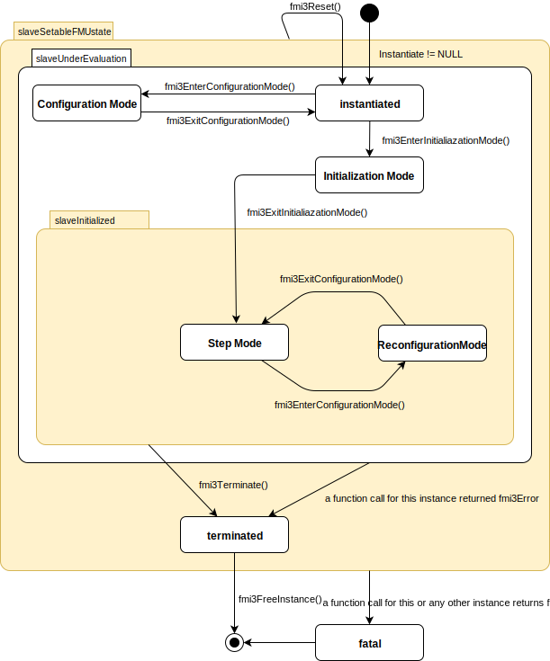
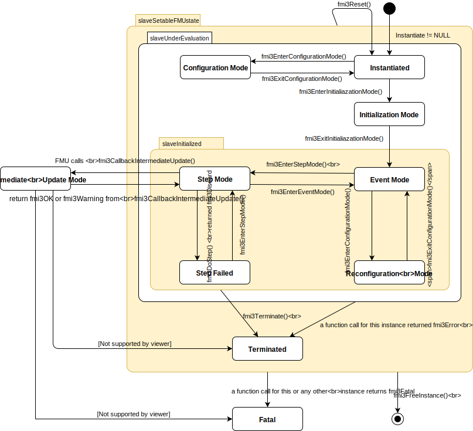
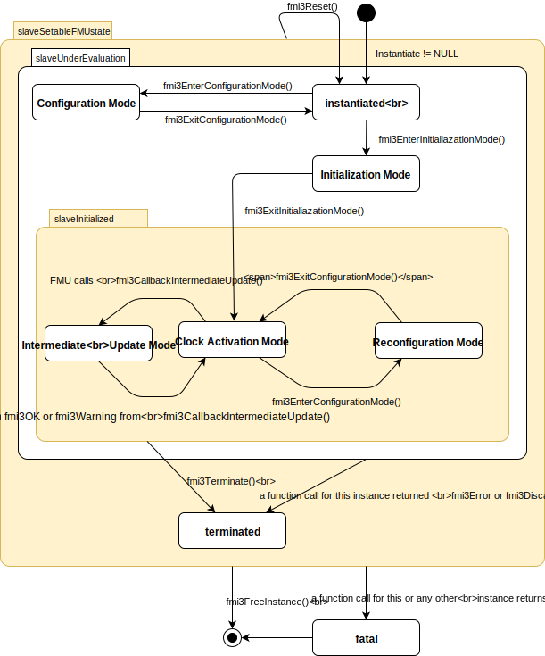

=== FMI Application Programming Interface

==== Mode fmi3ModeCoSimulation

This section contains the interface description to access the input/output data and status information of a Co-Simulation slave from a C program.

===== Variables access in fmi3ModeCoSimulation [[transfer-of-input-output-and-parameters]]

Input and output variables and other variables are accessed via the `fmi3Get{VariableTypes}` and `fmi3Set{VariableTypes}` functions, defined in <<get-and-set-variable-values>>.

In order to enable the slave to interpolate the <<continuous>> real inputs between communication steps, the derivatives of the inputs with respect to time can be provided.
Also, higher derivatives can be set to allow higher order interpolation.
Whether the slave is able to handle the derivatives of inputs is given by the unsigned integer capability flag MaxInputDerivativeOrder. It delivers the maximum order of the input derivative.

[source, C]
----
include::../headers/fmi3FunctionTypes.h[tags=SetInputDerivatives]
----

Sets the n-th time derivative of real input variables.
Argument `vr` is a vector of value references that define the variables whose derivatives shall be set.
The array `order` contains the orders of the respective derivative (1 means the first derivative, 0 is not allowed).
Argument "value" is a vector with the values of the derivatives.
`nValueReferences` is the dimension of the vectors. +
Restrictions on using the function are the same as for the `fmi3SetReal` function.

Inputs and their derivatives are set with respect to the beginning of a communication time step.

To allow interpolation/approximation of the real output variables between communication steps (if they are used as inputs for other slaves), the derivatives of the outputs with respect to time can be read.
Whether the slave is able to provide the derivatives of outputs is given by the unsigned integer capability flag `MaxOutputDerivativeOrder`.
It delivers the maximum order of the output derivative.
If the actual order is lower (because the order of integration algorithm is low), the retrieved value is 0.

_[Example: If the internal polynomial is of order 1 and the master inquires the second derivative of an output, the slave will return zero.]_

The derivatives can be retrieved by:

[source, C]
----
include::../headers/fmi3FunctionTypes.h[tags=GetOutputDerivatives]
----

Retrieves the n-th derivative of output values.
Argument `vr` is a vector of `nValueReferences` value references that define the variables whose derivatives shall be retrieved.
The array `order` contains the order of the respective derivative (1 means the first derivative, 0 is not allowed).
Argument `value` is a vector with the actual values of the derivatives. +
Restrictions on using the function are the same as for the `fmi3GetReal` function.

The returned outputs correspond to the current slave time.
E.g. after a successful call to <<fmi3DoStep>> the returned values are related to the end of the communication time step.

===== Computation in fmi3ModeCoSimulation

The computation of time steps is controlled by the following function.

[[fmi3DoStep,`fmi3DoStep`]]
[source, C]
----
include::../headers/fmi3FunctionTypes.h[tags=DoStep]
----

The computation of a time step is started. +
Argument `currentCommunicationPoint` is the current communication point of the master (latexmath:[tc_i]) and argument `communicationStepSize` is the communication step size (latexmath:[hc_i]).
The latter must be latexmath:[> 0.0].
The slave must integrate until time instant latexmath:[tc_{i+1} = tc_i + hc_i].
_[The calling environment defines the communication points and <<fmi3DoStep>> must synchronize to these points by always integrating exactly to latexmath:[tc_i + hc_i].

It is up to <<fmi3DoStep>> how to achieve this.]_
At the first call to <<fmi3DoStep>> after <<fmi3ExitInitializationMode>> was called `currentCommunicationPoint` must be equal to `startTime` as set with <<fmi3SetupExperiment>>.
_[Formally, argument `currentCommunicationPoint` is not needed.
It is present in order to handle a mismatch between the master and the FMU state of the slave: The `currentCommunicationPoint` and the FMU state of the slaves defined by former_ <<fmi3DoStep>> _or_ `fmi3SetFMUState` _calls have to be consistent with respect to each other.
For example, if the slave does not use the update formula for the <<independent>> variable as required above,_ latexmath:[tc_{i+1} = tc_i + hc_i] _(using argument_ latexmath:[tc_i] = `currentCommunicationPoint` _of_ <<fmi3DoStep>>) _but uses internally an own update formula, such as_ latexmath:[tc_{s,i+1} = tc_{s,i} + hc_{s,i}] _then the slave could use as time increment_ latexmath:[\text{hc}_{s,i} := (tc_i - tc_{s,i}) + hc_i] _(instead of_ latexmath:[\text{hc}_{s,i} := hc_i] _) to avoid a mismatch between the master time_ latexmath:[tc_{i+1}] _and the slave internal time_ latexmath:[tc_{s,i+1}] _for large i.]_

Argument `noSetFMUStatePriorToCurrentPoint` is `fmi3True` if `fmi3SetFMUState` will no longer be called for time instants prior to `currentCommunicationPoint` in this simulation run _[the slave can use this flag to flush a result buffer]_.

The function returns: +
`fmi3OK` - if the communication step was computed successfully until its end. +
`fmi3Discard` - if the slave computed successfully only a subinterval of the communication step.
The master can call `fmi3GetDoStepDiscardedStatus` to get further information.
If possible, the master should retry the simulation with a shorter communication step size.
_[Redoing a step is only possible if the FMU state has been recorded at the beginning of the current (discarded) step with `fmi3GetFMUState`.
Redoing a step is performed by calling `fmi3SetFMUState` and afterwards calling <<fmi3DoStep>> with the new communicationStepSize.
Note that it is not possible to change `currentCommunicationPoint` in such a call.]_ +
`fmi3Error` - the communication step could not be carried out at all.
The master can try to repeat the step with other input values and/or a different communication step size in the same way as described in the `fmi3Discard` case above. +
`fmi3Fatal` - if an error occurred which corrupted the FMU irreparably.
_[The master should stop the simulation run immediately.]_
See <<status-returned-by-functions>> for details.

It depends on the capabilities of the slave which parameter constellations and calling sequences are allowed (see <<fmi-for-co-simulation>>)

===== Retrieving Status Information from the Slave in fmi3ModeCoSimulation [[retrieving-status-from-slave]]

Status information is retrieved from the slave by the following function:

[source, C]
----
include::../headers/fmi3FunctionTypes.h[tags=GetDoStepDiscardedStatus]
----

`terminate` is true if the slave wants to terminate the simulation.
`lastSuccessfulTime` is the time instant at which the slave stopped the <<fmi3DoStep>> call.

===== State Machine of Calling Sequence from Master to Slave in fmi3ModeCoSimulation [[state-machine-co-simulation]]

The following state machine defines the supported calling sequences.

.Calling sequence of Co-Simulation C functions in form of an UML 2.0 state machine.
[#figure-co-simulation-state-machine]

In this Co-Simulation mode the following functions must not be called: `fmi3ActivateModelPartition()`, <<fmi3NewDiscreteStates>>, <<fmi3EnterEventMode>>, <<fmi3SetClock>>, <<fmi3GetClock>>, <<fmi3SetIntervalFraction>>, <<fmi3GetIntervalFraction>>, <<fmi3SetIntervalDecimal>>, <<fmi3GetIntervalDecimal>> including all functions that are specific to fmuType `fmi3ModelExchange`.

====== State: slaveSetableFMUstate [[state-slave-setable-fmu-state-co-simulation]]
In all states of this super state it is allowed to call
`fmi3GetFMUState()`, `fmi3SetFMUState()`, `fmi3FreeFMUState()`, <<fmi3SerializedFMUStateSize>>, <<fmi3SerializeFMUState>>, `fmi3DeSerializeFMUState()`, <<fmi3Reset>>, <<fmi3GetVersion>>, `fmi3SetDebugLogging()` and <<fmi3FreeInstance>>.

If any function returns with `fmi3Fatal` the FMU enters state `Fatal`.

====== State: slaveUnderEvaluation [[state-slave-under-evaluation-co-simulation]]
This super state is entered by the FMU when <<fmi3Instantiate>> is called. If any function returns `fmi3Error` the FMU enters state `Terminated`.

====== State: slaveInitialized [[state-slave-initialized-co-simulation]]
This super state is entered by the FMU when <<fmi3ExitInitializationMode>> is called. If the function <<fmi3Terminate>> is called, the FMU enters state `Terminated`.

====== State: Instantiated [[state-instantiated-co-simulation]]
In this state the FMU can do one-time initializations and allocate memory. The FMU sets all variables to its start values.

Allowed Function Calls::
<<fmi3SetupExperiment>>, <<fmi3EnterInitializationMode>>, `fmi3SetInputDerivatives()`, <<fmi3EnterConfigurationMode>>

`fmi3Set{VariableType}`::
For variables with `variability` unequal to <<constant>> and for which initial equals to <<exact>> or `"approx"`.
The intention is to set start and guess values for these variables.

Forbidden Function Calls::
<<fmi3Instantiate>>, <<fmi3Terminate>>, `fmi3Get{VariableType}`, `fmi3GetDirectionalDerivatives()`, `fmi3GetOutputDerivatives()`, <<fmi3DoStep>>, <<fmi3DoEarlyReturn>>, <<fmi3ExitInitializationMode>>, `fmi3GetDoStepDiscardedStatus()`, <<fmi3ExitConfigurationMode>>, <<fmi3EnterStepMode>>

====== State: Initialization Mode [[state-initialization-mode-co-simulation]]
This mode is used by the master to compute consistent initial conditions for overall system.
Therefore iterative calls of `fmi3Set{VariableTypes}` and `fmi3Get{VariableTypes}` are allowed.
In between the FMU must evaluate all relevant equations.
In this way artificial or "real" algebraic loops over connected FMUs in *Initialization Mode* may be handled by using appropriate numerical algorithms.

Allowed Function Calls::
<<fmi3ExitInitializationMode>>, `fmi3SetInputDerivatives()`,`fmi3GetDirectionalDerivatives()`

`fmi3Set{VariableType}`::
For variables with:
* `variability` unequal <<constant>> that have `initial` equals <<exact>>, or
* `causality` equals `"input"`, or
* `causality` equals to <<parameter>> and `variability` equals to <<tunable>>.

`fmi3Get{VariableType}`::
For variables with `causality equals "output"` or continuous-time states or state derivatives.

Forbidden Function Calls::
<<fmi3Instantiate>>, <<fmi3Terminate>>, <<fmi3DoStep>>, <<fmi3DoEarlyReturn>>, <<fmi3EnterInitializationMode>>, `fmi3GetDoStepDiscardedStatus()`, <<fmi3EnterConfigurationMode>>, <<fmi3ExitConfigurationMode>>, <<fmi3SetupExperiment>>, <<fmi3EnterStepMode>>

====== State: Step Mode [[state-step-mode-co-simulation]]
This state is used by the master to progress simulation time.

Allowed Function Calls::
`fmi3SetInputDerivatives()`, `fmi3GetDirectionalDerivatives()`, `fmi3GetOutputDerivatives()`, `fmi3Get{VariableType}`, <<fmi3Terminate>>

<<fmi3EnterConfigurationMode>>::
With this function call the Reconfiguration Mode is entered.
This function must not be called if the FMU contains no <<tunable>> structural parameters (i.e. with `causality="structuralParameter"` and `variability` = <<tunable>>).

<<fmi3DoStep>>::
Within fmi3DoStep() the FMU may call <<fmi3CallbackIntermediateUpdate>>
If the function returns with `fmi3OK` or `fmi3Warning` the FMU stays in this state.
If the function returns with `fmi3Discard` the FMU enters state `Step Discarded`.

`fmi3Set{VariableType}`::
For variables with:
* `causality` equals `"input"`, or
* `causality` equals <<parameter>> and `variability` equals <<tunable>>

It is not allowed to call `fmi3Get{VariableType}` functions after `fmi3Set{VariableType}` functions without an <<fmi3DoStep>> call in between.

_[The reason is to avoid different interpretations of the caching, since contrary to FMI for Model Exchange, <<fmi3DoStep>> will perform the actual calculation instead of `fmi3Get{VariableType}`, and therefore, dummy algebraic loops at communication points cannot be handled by an appropriate sequence of `fmi3Get{VariableType}` and, `fmi3Set{VariableType}` calls as for Model Exchange.

Examples:

[cols="3,4",options="header"]
|====
|_Correct calling sequence_ |_Wrong calling sequence_
|_fmi3Set{VariableType} on inputs_ +
_fmi3DoStep_ +
_fmi3Get{VariableType} on outputs_ +
_fmi3Set{VariableType} on inputs_ +
_fmi3DoStep_ +
_fmi3Get{VariableType} on outputs_ +

|_fmi3Set{VariableType} on inputs_ +
_fmi3DoStep_ +
_fmi3Get{VariableType} on outputs_ +
_fmi3Set{VariableType} on inputs_ +
_fmi3Get{VariableType} on outputs // not allowed_ +
_fmi3DoStep_ +
_fmi3Get{VariableType} on outputs_ +
|====
]_

Forbidden Function Calls::
<<fmi3ExitConfigurationMode>>, <<fmi3Instantiate>>, <<fmi3SetupExperiment>>, <<fmi3EnterInitializationMode>>, <<fmi3ExitInitializationMode>>, `fmi3GetDoStepDiscardedStatus()`, <<fmi3DoEarlyReturn>>, <<fmi3EnterStepMode>>

====== State: Intermediate Update Mode [[state-intermediate-update-mode-co-simulation]]
In this state the master can retrieve information from the FMU between communication points.
Functions called in this state must not return `fmi3Discard`.

The FMU enters this state by calling <<fmi3CallbackIntermediateUpdate>> within <<fmi3DoStep>> and leaves the state towards state `Step Mode` if the function returns `fmi3OK` or `fmi3Warning`.
If the function returns `fmi3Error` the FMU enters state `Terminated`.
If the function returns `fmi3Fatal` the FMU enters state `Fatal`.

Allowed Function Calls::
<<fmi3DoEarlyReturn>>

`fmi3Set{VariableTypes}()`, `fmi3SetInputDerivatives()`::
If `intermediateUpdateInfo->intermediateVariableSetAllowed` is equal to `fmi3True`, the value of intermediate variables can be set.
Intermediate variables are variables that are marked with attribute "intermediateAccess" equals true in the modelDescription.xml.

`fmi3Get{VariableTypes}()`, `fmi3GetOutputDerivatives()`::
If `intermediateUpdateInfo->intermediateVariableGetAllowed` is equal to `fmi3True`, the value of intermediate variables can be retrieved.
Intermediate variables are variables that are marked with attribute "intermediateAccess" equals true in the modelDescription.xml.

Forbidden Function Calls::
The same functions which are not allowed to be called in `Step Mode` must not be called in this state.
Additionally the following functions must not be called  <<fmi3EnterConfigurationMode>>, <<fmi3Terminate>>, <<fmi3DoStep>>, `fmi3GetDirectionalDerivative()`.

====== State: Reconfiguration Mode [[state-reconfiguration-mode-co-simulation]]
In this state structural parameters with `variability` equals <<tunable>> can be changed.
This state is entered from state `Step Mode` by calling <<fmi3EnterConfigurationMode>> and left back to `Step Mode` by calling <<fmi3ExitConfigurationMode>>.

Allowed Function Calls::
<<fmi3ExitConfigurationMode>>

`fmi3Set{VariableTypes}`::
Only for variables with `causality` equals `"structuralParameter"` and `variability` equals <<tunable>>.

Forbidden Function Calls::
 <<fmi3EnterConfigurationMode>>, <<fmi3Instantiate>>, <<fmi3SetupExperiment>>, <<fmi3EnterInitializationMode>>, <<fmi3ExitInitializationMode>>, `fmi3GetDoStepDiscardedStatus()`, <<fmi3DoStep>>, <<fmi3EnterStepMode>>, `fmi3SetInputDerivatives()`, `fmi3GetDirectionalDerivatives()`, `fmi3GetOutputDerivatives()`, `fmi3Get{VariableTypes}`

====== State: Step Discarded [[state-step-discarded-co-simulation]]
The FMU changes into this state if it is not able to compute a communication step completely by returning `fmi3Discard` from <<fmi3DoStep>>.
This might have been caused by numerical problems or intended stop of the simulation run.
In case of numerical problems the master may try to achieve a correct solution for example by repeating the last step with a different communication step size or by continuing from the `lastSuccessfulTime`.
It does not enter into this state if the FMU returns early from a communication step caused by <<fmi3DoEarlyReturn>>.

Allowed Function Calls::
<<fmi3Terminate>>, `fmi3Get{VariableType}`, `fmi3GetDirectionalDerivatives()`, `fmi3GetOutputDerivatives()`

`fmi3GetDoStepDiscardedStatus()`::
The master calls this functions to retrieve information about the reason for discarding the last communication step.

<<fmi3EnterStepMode>>::
The <<fmi3EnterStepMode>> function pushes the FMU from `Step Discarded` to `Step Mode`.
_[In Step Mode, the master may change again FMU inputs and <<parameter,parameters>>, or push the FMU into other states]_
In this case, a new step may be started from `lastSuccessfulTime` which can be retrieved by the `fmi3GetDoStepDiscardedStatus()` function in state `Step Discarded`.

Forbidden Function Calls::
<<fmi3EnterConfigurationMode>>, <<fmi3ExitConfigurationMode>>, <<fmi3Instantiate>>, <<fmi3SetupExperiment>>, <<fmi3EnterInitializationMode>>, <<fmi3ExitInitializationMode>>, <<fmi3DoStep>>, `fmi3Set{VariableType}`, <<fmi3DoEarlyReturn>>, `fmi3SetInputDerivatives()`

====== State: Terminated [[state-terminated-co-simulation]]
In this state, the solution at the final time of the simulation can be retrieved.

Allowed Function Calls::
`fmi3Get{VariableType}`, `fmi3GetDirectionalDerivatives()`, `fmi3GetOutputDerivatives()`

Forbidden Function Calls::
<<fmi3EnterConfigurationMode>>, <<fmi3ExitConfigurationMode>>, <<fmi3Instantiate>>, <<fmi3SetupExperiment>>, <<fmi3EnterInitializationMode>>, <<fmi3ExitInitializationMode>>, <<fmi3DoStep>>, `fmi3Set{VariableType}`, <<fmi3DoEarlyReturn>>, `fmi3SetInputDerivatives()`

====== State: Fatal [[state-fatal-co-simulation]]
The FMU enters this state if a function call of this or any other instance of this FMU returns `fmi3Fatal`.
In this state it is not allowed to call any function of the FMU.

Allowed Function Calls::
none

Forbidden Function Calls::
all

====== State: Configuration Mode [[state-configuration-mode-co-simulation]]
In this state structural parameters with `variability` equals <<tunable>> can be changed.

This state is entered from state `Instantiated` by calling <<fmi3EnterConfigurationMode>> and left back to `Instantiated` by calling <<fmi3ExitConfigurationMode>>.

Allowed Function Calls::
<<fmi3ExitConfigurationMode>>

`fmi3Set{VariableTypes}`::
Only for variables with `causality` equals `"structuralParameter"` and `variability` equals <<tunable>>.

Forbidden Function Calls::
 <<fmi3EnterConfigurationMode>>, <<fmi3Instantiate>>, <<fmi3SetupExperiment>>, <<fmi3EnterInitializationMode>>, <<fmi3ExitInitializationMode>>, `fmi3GetDoStepDiscardedStatus()`, <<fmi3DoStep>>, <<fmi3EnterStepMode>>, `fmi3SetInputDerivatives()`, `fmi3GetDirectionalDerivatives()`, `fmi3GetOutputDerivatives()`, `fmi3Get{VariableTypes}`

_[
TODO: update table
The allowed function calls in the respective states are summarized in the following table (functions marked in [yellow-background]#"yellow"# are only available for Co-Simulation, the other functions are available both for Model Exchange and Co-Simulation):

[cols="10,1,1,1,1,1,1,1,1,1,1",width="40%"]
|====
.2+.>|*Function*
10+|*FMI 3.0 for Co-Simulation*
|[vertical-text]#start, end#
|[vertical-text]#instantiated#
|[vertical-text]#Initialization Mode#
|[vertical-text]#stepComplete#
|[vertical-text]#stepInProgress#
|[vertical-text]#stepDiscarded#
|[vertical-text]#stepCanceled#
|[vertical-text]#terminated#
|[vertical-text]#error#
|[vertical-text]#fatal#

|<<fmi3GetVersion>>               |x |x |x |x |x |x |x |x |x |
|<<fmi3SetDebugLogging>>          |  |x |x |x |x |x |x |x |x |
|fmi3Instantiate              |x |  |  |  |  |  |  |  |  |
|<<fmi3FreeInstance>>             |  |x |x |x |  |x |x |x |x |
|fmi3SetupExperiment          |  |x |  |  |  |  |  |  |  |
|fmi3EnterInitializationMode  |  |x |  |  |  |  |  |  |  |
|fmi3ExitInitializationMode   |  |  |x |  |  |  |  |  |  |
|fmi3Terminate                |  |  |  |x |  |x |  |  |  |
|fmi3Reset                    |  |x |x |x |  |x |x |x |x |
|fmi3GetReal                  |  |  |2 |x |  |8 |7 |x |7 |
|fmi3GetInteger               |  |  |2 |x |  |8 |7 |x |7 |
|fmi3GetBoolean               |  |  |2 |x |  |8 |7 |x |7 |
|fmi3GetString                |  |  |2 |x |  |8 |7 |x |7 |
|fmi3SetReal                  |  |1 |3 |6 |  |  |  |  |  |
|fmi3SetInteger               |  |1 |3 |6 |  |  |  |  |  |
|fmi3SetBoolean               |  |1 |3 |6 |  |  |  |  |  |
|fmi3SetString                |  |1 |3 |6 |  |  |  |  |  |
|fmi3GetFMUState              |  |x |x |x |  |8 |7 |x |7 |
|fmi3SetFMUState              |  |x |x |x |  |x |x |x |x |
|fmi3FreeFMUState             |  |x |x |x |  |x |x |x |x |
|fmi3SerializedFMUStateSize   |  |x |x |x |  |x |x |x |x |
|fmi3SerializeFMUState        |  |x |x |x |  |x |x |x |x |
|fmi3DeSerializeFMUState      |  |x |x |x |  |x |x |x |x |
|fmi3GetDirectionalDerivative |  |  |x |x |  |8 |7 |x |7 |
|fmi3SetInputDerivatives  {set:cellbgcolor:yellow}     |  {set:cellbgcolor!} |x |x |x |  |  |  |  |  |
|fmi3GetOutputDerivatives {set:cellbgcolor:yellow}     |  {set:cellbgcolor!} |  |  |x |  |8 |x |x |7 |
|fmi3DoStep                   {set:cellbgcolor:yellow} |  {set:cellbgcolor!} |  |  |x |  |  |  |  |  |
|fmi3DoEarlyReturn            {set:cellbgcolor:yellow} |  {set:cellbgcolor!} |  |  |  |x |  |  |  |  |
|fmi3GetDoStepDiscardedStatus {set:cellbgcolor:yellow} |  {set:cellbgcolor!} |  |  |  |  |x |  |  |  |
|fmi3EnterStepMode            {set:cellbgcolor:yellow} |  {set:cellbgcolor!} |  |  |  |  |x |  |  |  |
|====

*x* means: call is allowed in the corresponding state +
*number* means: call is allowed if the indicated condition holds: +
*1* for a variable with `variability !=` <<constant>> that has `initial` = <<exact>> or `"approx"` +
*2* for a variable with `causality = "output"` or continuous-time states or state derivatives
(if element `<Derivatives>` is present) +
*3* for a variable with `variability` = <<constant>> that has `initial` = <<exact>>,
or `causality` = `"input"` +
*6* for a variable with `causality` = `"input"` or (`causality` = <<parameter>> and `variability` = <<tunable>>) +
*7* always, but retrieved values are usable for debugging only +
*8* always, but if status is other than `fmi3Terminated`,
retrieved values are useable for debugging only ]_

===== Code Example for fmi3ModeCoSimulation

In the following example, the usage of the FMI functions is sketched in order to clarify the typical calling sequence of the functions in a simulation environment.
We consider two slaves, where both have one <<continuous>> real input and one <<continuous>> real output which are connected in the following way:

.Connection graph of the slaves.
image::images/co-simulation-connection-of-slaves.svg[width=30%, align="center"]

We assume no algebraic dependency between input and output of each slave.
The code demonstrates the simplest master algorithm as shown in <<math-co-simulation>>:

[start=8]
. Constant communication step size.
. No repeating of communication steps.
. The slaves do not support asynchronous execution of <<fmi3DoStep>>.

The error handling is implemented in a very rudimentary way.

[source, C]
----
include::examples/c-code/co_simulation.c[tags=CoSimulation]
----

==== Early-return Requested by the Co-Simulation Master in fmi3ModeCoSimulation [[earlyreturn-co-simulation]]
The boolean capability flag `canReturnEarlyAfterIntermediateUpdate` in the modelDescription XML file indicates whether the FMU supports the early-return feature.
The default value of this capability flag is false.
Each time an internal discontinuity or an event happens inside an FMU with capability flag `canReturnEarlyAfterIntermediateUpdate=true`, the callback function <<fmi3CallbackIntermediateUpdate>> is invoked by the FMU and the associated structure `fmi3IntermediateUpdateInfo` is sent back to the Co-Simulation master.
The master can only use this early return functionality if it provides the `{CBIU}` callback function pointer in <<fmi3CallbackFunctions>> in <<fmi3Instantiate>>.

[[fmi3CallbackIntermediateUpdate,`fmi3CallbackIntermediateUpdate`]]
[source, c]
----
include::../headers/fmi3FunctionTypes.h[tag=CallbackIntermediateUpdate]
----

[source, c]
----
include::../headers/fmi3FunctionTypes.h[tag=IntermediateUpdateInfo]
----

The Co-Simulation master can request the FMU to end the <<fmi3DoStep>> at a Newtonian time instant and to do an early return by calling the <<fmi3DoEarlyReturn>> function inside the callback function <<fmi3CallbackIntermediateUpdate>>.
The Co-Simulation master is only allowed to call this function, if the boolean variable `fmi3IntermediateUpdateInfo->canReturnEarly` is `fmi3True`.
If the master does not call <<fmi3DoEarlyReturn>> the FMU continues the <<fmi3DoStep>> computation until the next predefined communication instant (i.e., _currentCommunicationPoint_+ _communicationStepSize_) or until the next call of `{CBIU}`.

[[fmi3DoEarlyReturn,`fmi3DoEarlyReturn`]]
[source, c]
----
include::../headers/fmi3FunctionTypes.h[tag=DoEarlyReturn]
----

The FMU should return early from the current <<fmi3DoStep>> at the time instant defined by parameter `earlyReturnTime`.

If the `earlyReturnTime` is greater than the last signaled `intermediateUpdateTime`, the FMU may integrate up to the time instant `earlyReturnTime`.

If the early return is conducted successfully by the FMU it must set the parameter `earlyReturn` to `fmi3True` in <<fmi3DoStep>> and return `fmi3OK`.
In that case the internal simulation time of the FMU equals the value of `earlyReturnTime` of the last <<fmi3DoEarlyReturn>> call.

If the requested `earlyReturnTime` is less than the last signaled `intermediateUpdateTime` or the FMU can not reach the requested `earlyReturnTime` for other reasons, the FMU must set the parameter `earlyReturn` to `fmi3True` in <<fmi3DoStep>> and return `fmi3Discard` and enter state `Step Discarded`.

In state `Step Discarded` the Co-Simulation master can retrieve the `lastSuccessfulTime` via calling `fmi3GetDoStepDiscardedStatus()`.
The Co-Simulation master can decide if a rollback of the FMU to reach the `earlyReturnTime` time is required or it may continue the simulation from `lastSuccessfulTime` for that FMU.
Note that `Event Mode` is not supported in `fmi3ModeCoSimulation`.

==== Mode fmi3ModeHybridCoSimulation [[api-hybrid-co-simulation]]
:DOSTEP: fmi3DoStep()
:CBIU: fmi3CallbackIntermediateUpdate()
:DER:  fmi3DoEarlyReturn()
:STIUI: fmi3IntermediateUpdateInfo
:IUTIME: intermediateUpdateTime

If the boolean capability flag `providesHybridCoSimulation` and `canReturnEarlyAfterIntermediateUpdate` equal true the Co-Simulation master can use the mode `fmi3ModeHybridCoSimulation`.

===== Communication of event time and input/output values

The `{CBIU}` callback described in section <<earlyreturn-co-simulation>> is also used in order to communicate the input and output and, in particular, the event and clock time from the FMU to the Co-Simulation master.
The `{CBIU}` callback allows internal events (e.g. associated to output <<clock>> ticks) to be signaled from an FMU to the Co-Simulation master.
If `fmu3Type` is set to `fmi3CoSimulation` and the Co-simulation mode is set to `fmi3ModeHybridCoSimulation`, the `{CBIU}` callback must be defined in <<fmi3CallbackFunctions>> in <<fmi3Instantiate>>.
In other cases a NULL pointer can be assigned to the `{CBIU}` callback, such as if the `fmu3Type` is set to  `fmi3ModelExchange`.

The `{STIUI}`  argument in the `{CBIU}` function is a structure which is used to signal output <<clock>> ticks and internal events to the master.
Whenever the FMU invokes the `{CBIU}` callback function, it fills the `{STIUI}` structure to pass information concerning the call to the Co-Simulation master.
The structure is defined as follows:

[source, C]
----
include::../headers/fmi3FunctionTypes.h[tag=IntermediateUpdateInfo]
----

* 	`{IUTIME}` is the internal simulation time of the FMU at which the callback has been called.
If an event happens or a output <<clock>> ticks, `{IUTIME}` is the time of event or output <<clock>> tick.
If the FMU signals an `earlyReturn` equals `fmi3True` and `fmi3OK`after returning from <<fmi3DoStep>> then `{IUTIME}` is the internal simulation time of the FMU of the last `{CBIU}` call that signaled `canReturnEarly` equals `fmi3true`.
`{IUTIME}` is also the time of intermediate steps of the internal FMU solver.

The following `fmi3Boolean` variables define the reasons for the <<fmi3CallbackIntermediateUpdate>> call. Several variables can be set by the FMU. Default value of variables is `fmi3False`.

*	when `eventOccurred` is `fmi3True`, the master must call `{DER}` to do an early return and handle the event via entering event mode. In this case, `earlyReturnTime` argument of `{DER}` is ignored. In `Event Mode` the master shall call the <<fmi3NewDiscreteStates>> function for gathering <<fmi3EventInfo>> related information about the event occurred at `{IUTIME}`.

*	when `clocksTicked`  is `fmi3True`, it means that <<fmi3GetClock>> function should be called for gathering all clock related information about ticking output clocks at `{IUTIME}`.
If this flag is `fmi3True` the master must call `{DER}` to do an early return and handle the clock event in `Event Mode`.
In this case, `earlyReturnTime` argument of `{DER}` is ignored.

*	when `intermediateVariableSetAllowed` is `fmi3True`, the FMU signals that intermediate output values can be collected by the Co-Simulation master.

*	when `intermediateVariableGetAllowed` is `fmi3True`, the FMU signals that intermediate input values can be set by the Co-Simulation master.

* when `intermediateStepFinished` is `fmi3True`, the FMU signals that the internal solver step for this time instant is complete.

*   when `canReturnEarly` is `fmi3True` the master can request the FMU to return early at the current `{IUTIME}` time instant via calling `{DER}` within the callback function `{CBIU}`.
If `canReturnEarly` is `fmi3False` the FMU will not do the early return, regardless of the master request.

Note that only the first discontinuity event at a Newtonian time instant shall be signaled that way. But in `Event Mode`, there may be an event iteration at a Newtonian time instant and have super dense time instants.

Based on the information delivered in `{STIUI}`, additional information about the discontinuity at that time instant can be obtained from the <<fmi3EventInfo>> structure after calling  <<fmi3NewDiscreteStates>>  and/or <<fmi3GetClock>>.

The FMU must not call the <<fmi3CallbackIntermediateUpdate>> callback function with a `intermediateUpdateInfo.intermediateUpdateTime` value that is smaller than the `intermediateUpdateInfo.intermediateUpdateTime` value given in a previous call of <<fmi3CallbackIntermediateUpdate>> with `intermediateUpdateInfo.intermediateStepFinished` is `fmi3True`.

===== Handling a Successful Early-Return by the Co-Simulation Master in fmi3ModeHybridCoSimulation

If the FMU is successful in conducting an early return, the return value of the `earlyReturn` argument in <<fmi3DoStep>> is `fmi3True`, otherwise `fmi3False`.
If the FMU returns from <<fmi3DoStep>> with the `earlyReturn = fmi3True` the Co-Simulation master has to call <<fmi3EnterEventMode>> for that FMU.

[source, C]
----
include::../headers/fmi3FunctionTypes.h[tag=EnterEventMode]
----

The Co-Simulation master can also call <<fmi3EnterEventMode>> at communication instants to handle input events, as will be discussed in following sections.

If an FMU provides the early-return capability that includes the handling of events in `Event Mode`, the FMU signals this via `canReturnEarlyAfterIntermediateUpdate` and `providesHybridCoSimulation` equals true in the modelDescription.
The master should indicate to the FMU that this early-return feature is also supported by the master.
The Co-Simulation master signals to the FMU that it supports and has recognized the early return Co-Simulation capabilities of the FMU by setting the CoSimulation mode to `fmi3ModeHybridCoSimulation` in the <<fmi3Instantiate>> function.

The FMU stops computation at the first encountered internal event (if any) and the event time is provided through `{STIUI}.{IUTIME}`.
If <<fmi3DoStep>> returns with `earlyReturn = fmi3True` and an event has happened, i.e., `{STIUI}.eventOccurred` is `fmi3True`, then an event handling has to be done by the Co-Simulation master.
In order to start event handling the Co-Simulation master has to call <<fmi3EnterEventMode>> for that FMU to push the FMU into `Event Mode`. In this mode the Co-Simulation master is supposed to catch all events through the <<fmi3NewDiscreteStates>> function and the <<fmi3EventInfo>> structure.

If the early-return request of the Co-Simulation master is ignored by the FMU, then <<fmi3DoStep>> returns with `earlyReturn = fmi3False`.
The master can start a resynchronization of FMUs at an event time, if the _currentCommunicationPoint_ has passed the event time, the master can roll-back the FMU and repeat the step with a suitable _communicationStepSize_ (if the FMU supports the roll-back).

In `Event Mode` and only after <<fmi3DoStep>> returns with `earlyReturn = fmi3True` a <<fmi3NewDiscreteStates>> call returns <<fmi3EventInfo>> structure as a return argument.
Not all elements of <<fmi3EventInfo>> are relevant and only the following elements may be considered:

-	when _newDiscreteStatesNeeded_ is true it means that the master should stay in Event Mode and another call to <<fmi3NewDiscreteStates>> is required.

-	when _nextEventTimeDefined_ is true it means that an event time is available and the value is given by the `nextEventTime` value.
This is the case when the model can report in advance the accurate time of the next predictable time event.

-	when _terminateSimulation_ is true it means that the model wants to stop integration and the Co-Simulation master should call <<fmi3Terminate>>.

In Event Mode it is allowed to `fmi3Get{VariableType}` variable values of the FMU after the call of <<fmi3NewDiscreteStates>> and it is allowed to `fmi3Set{VariableType}` variable values before calling <<fmi3NewDiscreteStates>>.
The FMU leaves Event Mode when the master calls <<fmi3EnterStepMode>> for that FMU.

It is not allowed to call <<fmi3EnterEventMode>> or <<fmi3EnterStepMode>> for an FMU in mode `fmi3ModeCoSimulation` or `fmi3ModeScheduledExecutionSimulation`.

===== State Machine of Calling Sequence from Master to Slave in fmi3ModeHybridCoSimulation

==== Co-Simulation with Clock Support in fmi3ModeHybridCoSimulation [[api-clocked-co-simulation]]

In this section, signaling and retrieving clock ticks as well as the interface for supporting clocks in FMI for Co-Simulation will be discussed.
If an FMU for Co-Simulation declares clocks and clocked variables in the _modelDescription.xml_ file, it supports clocks.
The Co-Simulation master should indicate the FMU that the master has recognized the clock capabilities of the FMU and supports the clock handling by setting the Co-Simulation mode to `fmi3ModeHybridCoSimulation` in <<fmi3Instantiate>>.
Note, even if no clock is defined by an FMU in _modelDescription.xml_, the master is allowed to set the Co-Simulation mode to `fmi3ModeHybridCoSimulation` to be able to do early return with event handling in `Event Mode`.

If an FMU provides clocks, but the Co-Simulation master does not support or does not want to support early-return or clocks, by setting Co-Simulation mode to `fmi3ModeCoSimulation`, the activation of model partitions inside of the FMU has to be handled internally within <<fmi3DoStep>>.

_[Remark:_
_Wrapping towards other Co-Simulation modes can influence the simulation results._
_Depending on the model especially wrapping towards the mode fmi3ModeCoSimulation may result in divergent simulation results._
_Especially aperiodic input clocks can not always be sufficiently emulated in modes that do not directly support clocks._
_Therefore it is recommended that the FMU provides logging information to the user about the influence of the current mode on simulation results, if non-optimal modes are used by the simulation environment.
]_

[[fmi3EnterStepMode,`fmi3EnterStepMode`]]
[source, C]
----
include::../headers/fmi3FunctionTypes.h[tag=EnterStepMode]
----

===== Transfer of Input / Output Values and Parameters in fmi3ModeHybridCoSimulation [[transfer-of-input-output-and-parameters-clocked-co-simulation]]
If the Co-Simulation master supports clocks, all input clocks of the model should be handled and input <<clock>> events should be scheduled by the master.
If a output <<clock>> ticks, the FMU invokes the <<fmi3CallbackIntermediateUpdate>> callback and sets `intermediateUpdateInfo.clocksTicked` to `fmi3True`.
Then the master must call <<fmi3DoEarlyReturn>> to do an early return from <<fmi3DoStep>>.
Then the master should push the FMU into `Event Mode` by calling <<fmi3EnterEventMode>>.
Once the FMU in `Event Mode`, the activation status of output clocks are retrieved by <<fmi3GetClock>> function.
Then <<fmi3SetClock>> (and <<fmi3SetIntervalDecimal>> or <<fmi3SetIntervalFraction>> if necessary) should be invoked to enable the ticked input clocks.
Each clock, that ticks outside of the FMU (i.e. input clock), is activated for an FMU based on its _clockReference_ and an associated <<fmi3SetClock>> in `Event Mode`.
<<fmi3SetClock>> can activate multiple clocks with each call.
An event iteration is possible.
Once all clock events are handled for this time instant, the FMU should be pushed into Step Mode by calling <<fmi3EnterStepMode>>.
In Step Mode, the Co-Simulation master can call <<fmi3DoStep>> for the time interval from the current event time instant until the next input event instant.
Note that <<fmi3DoStep>> may not reach the next input event instant because an early return may occur.

The simulation master sets and gets <<clock>> variable values similar to the FMI for Model Exchange, as defined in <<fmi-api-setting-getting-clock-activation-state>>.

===== Computation in fmi3ModeHybridCoSimulation [[computation-clocked-co-simulation]]

Similar to FMI for Model Exchange, in order to activate input clocks of an FMU, it is required to push the FMU into Event Mode by calling <<fmi3EnterEventMode>>.
If <<fmi3DoStep>> returns with `earlyReturn` = `fmi3True` and `intermediateUpdateInfo.eventOccurred` or `intermediateUpdateInfo.clocksTicked` is `fmi3True`, the FMU must be pushed into the Event Mode by calling <<fmi3EnterEventMode>>.

In order to retrieve the status of output clocks, <<fmi3GetClock>> and <<fmi3GetIntervalDecimal>> or <<fmi3GetIntervalFraction>> need to be called in the Event Mode.
If the <<fmi3DoStep>> return value is `fmi3OK` and `earlyReturn` = `fmi3False`, the calling of <<fmi3GetClock>>, <<fmi3GetIntervalDecimal>>, <<fmi3GetIntervalFraction>>, <<fmi3NewDiscreteStates>> is only meaningful after <<fmi3SetClock>> in the case of super-dense time iterations are desired.

Similar to the Model Exchange case, the allowed call order is <<fmi3GetClock>>, <<fmi3GetIntervalDecimal>>, <<fmi3GetIntervalFraction>>, `fmi3Get{VariableType}()`, `fmi3Set{VariableType}()`.
Function calls of this call order can be omitted.

The handling of return values of function calls is identical to mode `fmi3ModeCoSimulation`.

If `eventInfo.terminateSimulation` becomes `fmi3True` after calling <<fmi3NewDiscreteStates>> then the co-simulation should be terminated by calling <<fmi3Terminate>>.
Once handling of the clock events finished, the master calls <<fmi3EnterStepMode>> for that FMU to push it into Step Mode.
Note that it is not allowed to call <<fmi3EnterEventMode>> or <<fmi3EnterStepMode>> in Co-Simulation mode `fmi3ModeCoSimulation` or `fmi3ScheduledExecutionSimulation`.

_[Usually the Co-Simulation master should be able to derive (but is not forced to do so) the correct communication point times for input clocks in advance and thus it should be able to set the proper `communicationStepSize` for <<fmi3DoStep>>.
This might not be possible if an aperiodic input <<clock>> of an FMU depends on the ticking of an aperiodic output <<clock>> of another FMU or other aperiodic tick sources.]_

===== State Machine of Calling Sequence from Master to Slave in fmi3ModeHybridCoSimulation [[state-machine-calling-sequence-clocked-co-simulation]]

The following state machine defines the supported calling sequences.

.Calling sequence of clocked Co-Simulation mode.

[#figure-hybrid-co-simulation-state-machine]

In this Co-Simulation mode the following functions must not be called: `fmi3ActivateModelPartition()` including all functions that are specific to fmuType `fmi3ModelExchange`.

Unlike the state machine in section <<state-machine-co-simulation>> the entry state after *Initialization Mode* is the *Event Mode* in order to allow the FMU to handle the very first discrete event.
Each state of the state machine corresponds to a certain phase of a simulation as follows:

====== State: slaveSetableFMUstate
This super state in Hybrid Co-Simulation does not differ from Co-Simulation described in section <<state-slave-setable-fmu-state-co-simulation>>.

====== State: slaveUnderEvaluation
This super state in Hybrid Co-Simulation does not differ from Co-Simulation described in section <<state-slave-under-evaluation-co-simulation>>.

====== State: slaveInitialized
This super state in Hybrid Co-Simulation does not differ from Co-Simulation described in section <<state-slave-initialized-co-simulation>>.

====== State: Instantiated
This super state in Hybrid Co-Simulation does not differ from Co-Simulation described in section <<state-instantiated-co-simulation>>.

====== State: Configuration Mode
This state in Hybrid Co-Simulation does not differ from Co-Simulation described in section <<state-configuration-mode-co-simulation>>.

====== State: Initialization Mode
This state in Hybrid Co-Simulation does not differ from Co-Simulation described in section <<state-initialization-mode-co-simulation>>.

====== State: Event Mode
The master and the FMU enter this state when the master calls <<fmi3ExitInitializationMode>> in state `Initialization Mode` or <<fmi3ExitConfigurationMode>> in state `Reconfiguration Mode` or <<fmi3EnterEventMode>> in state `Step Mode`.
In order to handle discrete events and clock ticks, the FMU is pushed into the event mode by calling <<fmi3EnterEventMode>>

Allowed Function Calls::
<<fmi3Terminate>>::
Upon return of <<fmi3NewDiscreteStates>>, if `fmi3EventInfo->terminateSimulation` equals to fmi3True, the master should finish the cosimulation by calling fmi3Terminate() on all FMUs.

<<fmi3EnterConfigurationMode>>::
With this function call the Reconfiguration Mode is entered.
This function must not be called if the FMU contains no <<tunable>> structural parameters (i.e. with `causality="structuralParameter"` and `variability` = <<tunable>>).

<<fmi3NewDiscreteStates>>::
In order to handle discrete events <<fmi3NewDiscreteStates>> is called.
This function returns the `fmi3EventInfo* eventInfo` structure.
When `eventInfo.newDiscreteStatesNeeded` equals to true, the FMU should stay in Event Mode and another call to <<fmi3NewDiscreteStates>> is required.

<<fmi3EnterStepMode>>::
Once all events are handled and <<fmi3NewDiscreteStates>> returns with `eventInfo.newDiscreteStatesNeeded` equals to false, the FMU should return back to the Step Mode, unless the FMU requests to terminate the Co-Simulation by setting  `fmi3EventInfo->terminateSimulation` to true.
In order to push the FMU into the `Step Mode`, the <<fmi3EnterStepMode>> function is used.
In this case, a new step can be started from the current communication point time.

<<fmi3GetClock>>::
The status of  clocks can be inquired by this function.

<<fmi3SetClock>>::
For input clocks, <<fmi3SetClock>> is called after entering event mode to set the activation status of clocks.
For both input and trigerred clocks, this function can be called several times, only if recomputations of clock state are needed during event mode.

<<fmi3GetIntervalDecimal>> & <<fmi3GetIntervalFraction>>::
For both output and input clocks it is allowed to call these functions during event mode.

<<fmi3SetIntervalDecimal>> & <<fmi3SetIntervalFraction>>::
It is not allowed to call these functions for output, aperiodic and strictly periodic clocks.
For input periodic clocks, these functions are called after the first clock activaion.

====== State: Step Mode
This state in Hybrid Co-Simulation does not differ from Co-Simulation described in section <<state-step-mode-co-simulation>>.

====== State: Intermediate Update Mode
This state in Hybrid Co-Simulation differ from Co-Simulation described in section <<state-step-mode-co-simulation>> as following:

Allowed Function Calls::

<<fmi3DoEarlyReturn>>::
`intermediateUpdateInfo->canReturnEarly` is `fmi3True`, the Co-Simulation master can request the FMU to end the <<fmi3DoStep>> and to do an early return by calling this function.

Forbidden Function Calls::
All API functions not listed in the allowed function list, including <<fmi3GetClock>> and  <<fmi3SetClock>> are forbidden in this mode.

====== State: Reconfiguration Mode
This state in Hybrid Co-Simulation does not differ from Co-Simulation described in section <<state-reconfiguration-mode-co-simulation>>.

====== State: Step Discarded
This state in Hybrid Co-Simulation does not differ from Co-Simulation described in section <<state-step-discarded-co-simulation>>.

====== State: Terminated
This state in Hybrid Co-Simulation does not differ from Co-Simulation described in section <<state-terminated-co-simulation>>.

====== State: Fatal
This state in Hybrid Co-Simulation does not differ from Co-Simulation described in section <<state-fatal-co-simulation>>.

_[
#[TODO]: Update table. Remove stepComplete, stepInProgress, stepCanceled? Where is the state Error described in the state machine?#
The allowed function calls in the respective states are summarized in the following table (functions marked in [yellow-background]#"yellow"# are only available for Co-Simulation, the other functions are available both for Model Exchange and Co-Simulation):

[cols="10,1,1,1,1,1,1,1,1,1,1,1,1,1,1,1",width="40%"]
|====
.2+.>|*Function*
15+|*FMI 3.0 for Co-Simulation*
|[vertical-text]#start, end#
|[vertical-text]#Instantiated#
|[vertical-text]#Configuration Mode#
|[vertical-text]#Initialization Mode#
|[vertical-text]#Event Mode#
|[vertical-text]#Reconfiguration Mode#
|[vertical-text]#Step Mode#
|[vertical-text]#stepComplete#
|[vertical-text]#stepInProgress#
|[vertical-text]#Step Discarded#
|[vertical-text]#Intermediate Update Mode#
|[vertical-text]#stepCanceled#
|[vertical-text]#Terminated#
|[vertical-text]#error#
|[vertical-text]#Fatal#

|<<fmi3GetVersion>>           |x |x |  |x |  |  |  |x |x |  |x |x |x |x |
|<<fmi3SetDebugLogging>>          |  |x |  |x |  |  |  |x |x |  |x |x |x |x |
|fmi3Instantiate              |x |  |  |  |  |  |  |  |  |  |  |  |  |  |
|<<fmi3FreeInstance>>             |  |x |  |x |  |  |  |x |  |  |x |x |x |x |
|fmi3SetupExperiment          |  |x |  |  |  |  |  |  |  |  |  |  |  |  |
|fmi3EnterInitializationMode  |  |x |  |  |  |  |  |  |  |  |  |  |  |  |
|fmi3ExitInitializationMode   |  |  |  |x |  |  |  |  |  |  |  |  |  |  |
|fmi3Terminate                |  |  |  |  |  |  |  |x |  |  |x |  |  |  |
|fmi3Reset                    |  |x |  |x |  |  |  |x |  |  |x |x |x |x |
|fmi3GetReal                  |  |  |  |2 |  |  |  |x |  |  |8 |7 |x |7 |
|fmi3GetInteger               |  |  |  |2 |  |  |  |x |  |  |8 |7 |x |7 |
|fmi3GetBoolean               |  |  |  |2 |  |  |  |x |  |  |8 |7 |x |7 |
|fmi3GetString                |  |  |  |2 |  |  |  |x |  |  |8 |7 |x |7 |
|fmi3SetReal                  |  |1 |  |3 |  |  |  |6 |  |  |  |  |  |  |
|fmi3SetInteger               |  |1 |  |3 |  |  |  |6 |  |  |  |  |  |  |
|fmi3SetBoolean               |  |1 |  |3 |  |  |  |6 |  |  |  |  |  |  |
|fmi3SetString                |  |1 |  |3 |  |  |  |6 |  |  |  |  |  |  |
|fmi3GetFMUState              |  |x |  |x |  |  |  |x |  |  |8 |7 |x |7 |
|fmi3SetFMUState              |  |x |  |x |  |  |  |x |  |  |x |x |x |x |
|fmi3FreeFMUState             |  |x |  |x |  |  |  |x |  |  |x |x |x |x |
|fmi3SerializedFMUStateSize   |  |x |  |x |  |  |  |x |  |  |x |x |x |x |
|fmi3SerializeFMUState        |  |x |  |x |  |  |  |x |  |  |x |x |x |x |
|fmi3DeSerializeFMUState      |  |x |  |x |  |  |  |x |  |  |x |x |x |x |
|fmi3GetDirectionalDerivatives|  |  |  |x |  |  |  |x |  |  |8 |7 |x |7 |
|fmi3EnterStepMode            {set:cellbgcolor:yellow} |  {set:cellbgcolor!} |  |  |  |  |  |  |  |  |  |  |  |  |  |
|fmi3SetInputDerivatives      {set:cellbgcolor:yellow} |  {set:cellbgcolor!} |x |  |x |  |  |  |  |x |  |  |  |  |  |
|fmi3GetOutputDerivatives     {set:cellbgcolor:yellow} |  {set:cellbgcolor!} |  |  |  |  |  |  |  |x |  |8 |x |x |7 |
|fmi3DoStep                   {set:cellbgcolor:yellow} |  {set:cellbgcolor!} |  |  |  |  |  |  |  |x |  |  |  |  |  |
|fmi3ActivateModelPartition   {set:cellbgcolor:yellow} |  {set:cellbgcolor!} |  |  |  |  |  |  |  |  |  |  |  |  |  |
|fmi3DoEarlyReturn            {set:cellbgcolor:yellow} |  {set:cellbgcolor!} |  |  |  |  |  |  |  |  |x |  |  |  |  |
|fmi3GetDoStepDiscardedStatus {set:cellbgcolor:yellow} |  {set:cellbgcolor!} |  |  |  |  |  |  |  |  |  |x |  |  |  |
|====

===== Code Example for fmi3ModeHybridCoSimulation [[code-example-clocked-co-simulation]]

In the following example, the usage of the FMI functions is sketched in order to clarify the typical calling sequence of the functions in a simulation environment.
We consider ... #[TODO]: Description of code example. Explained once validated, after examples are ready?#

The error handling is implemented in a very rudimentary way.

[source, C]
----
include::examples/c-code/co_simulation_clocked.c[tags=CoSimulation]
----

==== Scheduled Execution Simulation [[api-scheduled-execution-simulation]]
:stem: latexmath

This section contains the interface description for supporting the scheduled execution mode from a C program.

The direct scheduling of model partitions based on clock ticks requires an additional handling mode for FMUs.
The FMU signals its support for direct model partition scheduling in the modelDescription.xml via the flag `providesScheduledExecutionSimulation` equals true.
The Co-Simulation master signals to the FMU that it supports and has recognized the clock and model partition scheduling capabilities of the FMU via setting the Co-Simulation mode in `fmi3CoSimulationMode` to `fmi3ModeScheduledExecutionSimulation` in the struct `fmi3CoSimulationConfiguration` function <<fmi3Instantiate>>.

If the flag `providesScheduledExecutionSimulation` equals false, it is not allowed to set the Co-Simulation mode to `fmi3ModeScheduledExecutionSimulation`.

If no input clocks are defined by the FMU it is not allowed to set `providesScheduledExecutionSimulation` to true in the modelDescription.xml.

Error, reset or terminate information is a global state of the FMU. If e.g. an function returns `fmi3Discard` or `fmi3Error` this is also assumed for all active or preempted model partitions.
In case of `fmi3Discard` or `fmi3Error` no repetition of the step is possible, the only possible way to go forward is to enter the `terminated`state and to end or to reset the simulation or - if supported - to set the FMU back to a former state.

===== Transfer of Input / Output Values and Parameters in fmi3ModeScheduledExecutionSimulation

The simulation master sets and gets variable values as defined in section <<get-and-set-variable-values>>.

Before scheduling a model partition it is allowed to set all variables assigned to that model partition via its associated clock (including all global variables that are not associated to a clock) via `fmi3Set{VariableType}()`.
After the computation of a model partition (call of `fmi3ActivateModelPartition()` with the clockReference of the clock that is associated to the model partition) all variables that are assigned to this model partition (including all global variables that are not associated to a clock) can be retrieved via `fmi3Get{VariableType}()`.
Set/get operations have to be atomic for a single variable.

_[The value of global variables can be influenced by more than one model partition if multiple model partitions are active at the same time.]_

The computational effort has to be predictable, thus all computationally expensive operations needed to calculate a model partition have to be contained within the `fmi3ActivateModelPartition()` function.
The simulation master can assume that `fmi3Get{VariableType} and fmi3Set{VariableType}` operations are not computationally expensive.
In mode `fmi3ModeScheduledExecutionSimulation` the handling of <<fmi3CallbackIntermediateUpdate>> callbacks is the same as in section <<clocked-co-simulation>>.
The only difference is that an early return has no meaning in this mode and  no additional event handling based on <<fmi3NewDiscreteStates>> is conducted.
All internal events that shall be handled by the Co-Simulation master are signaled via <<fmi3CallbackIntermediateUpdate>>.
_[In this mode it is recommended to restrict such updates by the FMU to output <<clock>> ticks for reducing the computational load in real-time simulations.]_

===== Computation in fmi3ModeScheduledExecutionSimulation

If this mode is set, the master has to directly control the time of computation of model partitions associated to input clocks.
The activation states of output clocks are transported via <<fmi3CallbackIntermediateUpdate>> and <<fmi3GetClock>>.

[[fmi3ActivateModelPartition]]
Each `fmi3ActivateModelPartition()` call is now associated to the computation of a (publicly disclosed, externally controlled) model partition of the model and therefore to a single defined input clock.

[source, C]
----
include::../headers/fmi3FunctionTypes.h[tag=ActivateModelPartition]
----

The `fmi3ActivateModelPartition()` function has the following parameters:

- `fmi3Instance instance`: same meaning as for other fmi3 functions

- `fmi3ValueReference clockReference`: valueReference of an input <<clock>> defined in the modelDescription.XML which shall be activated

- `fmi3Float64 activationTime`: simulation (i.e. virtual) time of the clock tick

Scheduling of `fmi3ActivateModelPartition()` calls for each FMU is done by the simulation master. Calls are based on ticks of periodic or aperiodic input clocks.
These input clock ticks can be based on clock ticks from FMU external sources (e.g. output clocks of other FMUs) or other external clocks/events/interrupts assigned via the simulation master configuration (such external events can be based on a potentially unpredictable process or can be just simulation time based events e.g. the planned Communication Point).
The `fmi3ActivateModelPartition()` function is not called for output clocks of an FMU.

The <<fmi3DoStep>>, <<fmi3SetClock>>, <<fmi3SetIntervalDecimal>>, <<fmi3SetIntervalFraction>>, <<fmi3DoEarlyReturn>>, <<fmi3EnterEventMode>>, <<fmi3EnterStepMode>> functions must not be called in this Co-Simulation mode.

The value for the `fmi3ActivateModelPartition()` parameter `activationTime` is the clock tick time latexmath:[t_i] from the  assigned input <<clock>> (which is known to the Co-Simulation master).

Refer to <<math-scheduled-execution-simulation>> and <<clock-types-for-evaluation-of-clocked-model-partitions>>.

This is a different timing concept compared to <<fmi3DoStep>> calls.
A `fmi3ActivateModelPartition()` call will compute the results of the model partition defined by clockReference (i.e. valueReference of the variable that defines a clock) for the current clock tick latexmath:[t_i].

The value for the `fmi3ActivateModelPartition()` parameter `activationTime` is the clock tick time latexmath:[t_i] from the assigned input <<clock>> (which is known to the Co-Simulation master).
Refer to the clock time progress definition (<<clock-types-for-evaluation-of-clocked-model-partitions>>) for periodic clocks.

If required, the FMU can internally derive the clock interval stem:[\Delta T_i] based on the last clock tick time stem:[t_{i-1}] i.e. last activationTime for this clockReference (based on last `fmi3ActivateModelPartition()` call)

It is not allowed to call `fmi3ActivateModelPartition()` for a clockReference (i.e. valueReference of <<clock>> variable) more than once for the same activationTime latexmath:[t_i].

===== State Machine for fmi3ModeScheduledExecutionSimulation

This section summarizes the available states and the allowed function calls in the respective states.
All states must not be entered or exited concurrently for model partitions of an FMU but only for the whole FMU instance.

.Calling sequence of scheduled execution simulation mode.
[caption="Figure 10: "]

In this Co-Simulation mode the following functions must not be called: <<fmi3DoStep>>, <<fmi3NewDiscreteStates>>, <<fmi3SetClock>>, <<fmi3SetIntervalDecimal>>, <<fmi3SetIntervalFraction>>, <<fmi3DoEarlyReturn>>, <<fmi3EnterEventMode>>, <<fmi3EnterStepMode>> including all functions that are specific to fmuType `fmi3ModelExchange`.

The states `Configuration Mode`, `Instantiated`, `Initialization Mode`, `Terminated`, `Fatal` are handled in the same way as in mode `fmi3ModeCoSimulation` with the exception that the generally not allowed functions of the Co-Simulation mode `fmi3ModeScheduledExecutionSimulation` must not be called.

====== State: slaveSetableFMUstate
In all states of this super state it is allowed to call
`fmi3GetFMUState()`, `fmi3SetFMUState()`, `fmi3FreeFMUState()`, <<fmi3SerializedFMUStateSize>>, <<fmi3SerializeFMUState>>, `fmi3DeSerializeFMUState()`, <<fmi3Reset>>, <<fmi3GetVersion>>, `fmi3SetDebugLogging()` and <<fmi3FreeInstance>>.

If any function returns with `fmi3Fatal` the FMU enters state `Fatal`.

====== State: slaveUnderEvaluation
This super state is entered by the FMU when <<fmi3Instantiate>> is called. If any function returns `fmi3Error` or `fmi3Discard`  the FMU enters state `Terminated`.

====== State: slaveInitialized
This super state is entered by the FMU when `fmi3ExitInitializatoinMode()` is called.
If the function <<fmi3Terminate>> is called, the FMU enters state `Terminated` from all states of this super state.
The FMU enters state `Terminated` only after all other tasks related to the computation of model partitions of this FMU have ended.
After <<fmi3Terminate>> has been called no new tasks can be started (e.g. related to output <<clock>> ticks) and all other function calls for this FMU must return `fmi3Error` until the state `Terminated` is reached.

====== State: Clock Activation Mode
The FMU enters this state when the master calls <<fmi3ExitInitializationMode>> in state `Initialization Mode` or <<fmi3ExitConfigurationMode>> in state `Reconfiguration Mode`.
In this state the master can create multiple concurrent tasks related to an FMU and in each task the master can activate one or multiple input clocks of an FMU based on the defined clock properties via a `fmi3ActivateModelPartition()` call for each clock.

Allowed Function Calls::

`fmi3ActivateModelPartition()`::
If the function returns with `fmi3OK` or `fmi3Warning` the FMU stays in this state.
In case of `fmi3Fatal` the master can prematurely end all tasks related to the computation of model partitions of this FMU.
In case of `fmi3Discard` or `fmi3Error` the master must wait until all other tasks related to the computation of model partitions of this FMU have ended, but no new tasks can be started (e.g. related to output clock tick) and all other function calls for this FMU must also return `fmi3Discard` or `fmi3Error` until the state `terminated` is reached.
+
It is recommended to call `fmi3Set{VariableType}` and `fmi3Get{VariableType}` in the same task as `fmi3ActivateModelPartition()` for setting and retrieving variable values associated to a clock activation.

<<get-and-set-variable-values,fmi3Set{VariableType}()>>, `fmi3SetRealInputDerivatives()`::
Is called before the start of the computation of a model partition (i.e. before call of `fmi3ActivateModelPartition()`) and only for global variables and variables associated to the input <<clock>> assigned to the model partition.
+
The restrictions related to variable causality and variability defined for `Step Mode` in mode `fmi3ModeCoSimulation` apply.
+
If the function returns with `fmi3OK` or `fmi3Warning` the FMU stays in this state.
In case the function returns `fmi3Fatal` the master can prematurely end all tasks related to the computation of model partitions of this FMU.
In case the function returns `fmi3Discard` or `fmi3Error` the master must wait until all other tasks related to the computation of the model partitions of this FMU have ended, but new tasks must not be started (e.g. related to output <<clock>> ticks) and all other function calls for this FMU must also return `fmi3Discard` or `fmi3Error` until the state `Terminated` is reached.

<<get-and-set-variable-values,fmi3Get{VariableType}>>, `fmi3GetRealOutputDerivatives()`, `fmi3GetDirectionalDerivative()`::
Is called after the end of the computation of a model partition (i.e. after return of `fmi3ActivateModelPartition()`) and only for global variables and variables associated to the input <<clock>> assigned to the model partition.
+
The restrictions related to variable causality and variability defined for `Step Mode` in mode `fmi3ModeCoSimulation` apply.
+
If the function returns with `fmi3OK` or `fmi3Warning` the FMU stays in this state.
In case the function returns `fmi3Fatal` the master can prematurely end all tasks related to the computation of model partitions of this FMU.
In case the function returns `fmi3Discard` or `fmi3Error` the master must wait until all other tasks related to the computation of model partitions of this FMU have ended, but new tasks must not be started (e.g. related to output <<clock>> ticks) and all other function calls for this FMU have to also return `fmi3Discard` or `fmi3Error` until the state `Terminated` is reached.

It is not allowed to call `fmi3Get{VariableType}` functions after `fmi3Set{VariableType}` functions without an `fmi3ActivateModelPartition()` call in between.

_[The reason is to avoid different interpretations of the caching, since contrary to FMI for Model Exchange, <<fmi3DoStep>> will perform the actual calculation instead of `fmi3Get{VariableType}`, and therefore, dummy algebraic loops at communication points cannot be handled by an appropriate sequence of `fmi3Get{VariableType}` and, `fmi3Set{VariableType}` calls as for Model Exchange.

Example:

[cols="3,4",options="header"]
|====
|_Correct calling sequence for a model partition of an FMU_ |_Wrong calling sequence_
|_fmi3Set{VariableType} on inputs_ +
fmi3ActivateModelPartition +
_fmi3Get{VariableType} on outputs_ +
_fmi3Set{VariableType} on inputs_ +
fmi3ActivateModelPartition +
_fmi3Get{VariableType} on outputs_ +

|_fmi3Set{VariableType} on inputs_ +
fmi3ActivateModelPartition +
_fmi3Get{VariableType} on outputs_ +
_fmi3Set{VariableType} on inputs_ +
_fmi3Get{VariableType} on outputs // not allowed_ +
fmi3ActivateModelPartition +
_fmi3Get{VariableType} on outputs_ +
|====
]_

<<fmi3CallbackIntermediateUpdate>>::
Only in this state the FMU is allowed to call the callback <<fmi3CallbackIntermediateUpdate>>.
The callback may be called from concurrent tasks within `fmi3ActivateModelPartition()`.
The function must not return `fmi3Discard`.

<<fmi3EnterConfigurationMode>>::
This function must not be called if the FMU contains no structural parameters or other tasks related to the computation of model partitions of this FMU are currently active or preempted.
Thus this function can not be called concurrently for model partitions of an FMU but only for the whole FMU instance.
+
If the function returns with `fmi3OK` or `fmi3Warning` the FMU goes into state `Reconfiguration Mode`.

`fmi3Terminate(), fmi3Reset()`, <<fmi3FreeInstance>>::
These functions can not be called concurrently for model partitions of an FMU but only for the whole FMU instance.
If these functions are called while a model partition of an FMU is currently active or preempted, the FMU changes its state after the computation of all model partitions of this FMU has ended.

`fmi3GetFMUState(), fmi3SetFMUState(), fmi3FreeFMUState(), fmi3SerializedFMUStateSize(), fmi3SerializeFMUState(), fmi3DeSerializeFMUState()`::
Can be called if no other task related to the computation of model partitions of this FMU is currently active or preempted and the prerequisites defined for these functions in mode `fmi3ModeCoSimulation` are fulfilled.
Thus these functions can not be called concurrently for model partitions of an FMU but only for the whole FMU instance.

Forbidden Function Calls::
Additionally to the generally forbidden functions in this Co-Simulation mode as listed above, the following functions must not be called in this state: <<fmi3ExitConfigurationMode>>, <<fmi3Instantiate>>, <<fmi3SetupExperiment>>, <<fmi3EnterInitializationMode>>, <<fmi3ExitInitializationMode>>, `fmi3GetDoStepDiscardedStatus()`

====== State: Intermediate Update Mode
In this state the master can retrieve information from the FMU between communication points.
Functions called in this state must not return `fmi3Discard`.

The FMU enters this state by calling <<fmi3CallbackIntermediateUpdate>>  within `fmi3ActivateModelPartition()` and leaves the state towards state `Clock Activation Mode` if the function returns `fmi3OK` or `fmi3Warning`.
If the function returns `fmi3Error` the FMU enters state `Terminated`.
If the function returns `fmi3Fatal` the FMU enters state `Fatal`.

Forbidden Function Calls::
The same functions which are not allowed to be called in `Clock Activation Mode` must not be called in this state. Additionally the following functions must not be called `fmi3ActivateModelPartition()`, <<fmi3EnterConfigurationMode>>, <<fmi3Terminate>>.

Allowed Function Calls::
For a output <<clock>> only the first call of fmi3GetClock() for a specific activation of this clock signals `fmi3True`.
The FMU sets the reported activation state immediately back to `fmi3False` for the following fmi3GetClock() calls for that clock (in the same or other model partitions of the FMU) until this output <<clock>> is internally activated again.
The master can call fmi3Set{VariableType} and fmi3Get{VariableType} during the callback for variables associated to a output <<clock>> that is active during this callback.
Also intermediate variable access is allowed as defined in <<state-intermediate-update-mode-co-simulation>>

_[Based on the FMI standard it cannot be determined which part of the code of an FMU has called the callback function <<fmi3CallbackIntermediateUpdate>>.
This is especially the case for the Co-Simulation mode `fmi3ModeScheduledExecutionSimulation` in which multiple model partitions can be active at the same time.
This causes no issues since all function call prerequisites are connected to the activation state of clocks, modelDescription.xml information and additionally available information of the struct `fmi3IntermediateUpdateInfo`]_

====== State: Reconfiguration Mode
In this state structural parameters with `variability` equals <<tunable>> can be changed.
This state is entered from state `Clock Activation Mode` by calling <<fmi3EnterConfigurationMode>> and left back to `Clock Activation Mode` by calling <<fmi3ExitConfigurationMode>>.

Allowed Function Calls::
<<fmi3ExitConfigurationMode>>::

`fmi3Set{VariableTypes}`::
Only for variables with `causality` equals `"structuralParameter"` and `variability` equals <<tunable>>.

Forbidden Function Calls::
Additionally to the generally forbidden functions in this Co-Simulation mode listed above the following functions must not be called in this state: <<fmi3EnterConfigurationMode>>, <<fmi3Instantiate>>, <<fmi3SetupExperiment>>, <<fmi3EnterInitializationMode>>, <<fmi3ExitInitializationMode>>, `fmi3GetDoStepDiscardedStatus()`, `fmi3ActivateModelPartition()`,`fmi3SetRealInputDerivatives()`, `fmi3GetDirectionalDerivatives()`, `fmi3GetRealOutputDerivatives()`, `fmi3Get{VariableTypes}`, <<fmi3DoEarlyReturn>>

_[TODO non-normative table of states and function calls]_

===== Preemption Support [[preemption-support]]

For real-time applications the simulation time equals the real wall clock time, thus each `fmi3ActivateModelPartition()` computation step has to be finished in real-time within its current period time length (computation time is not only defined by the runtime of `fmi3ActivateModelPartition()` but also by the time for setting and getting variables and related operations).
Usually a preemptive scheduling of the `fmi3ActivateModelPartition()`, `fmi3Get{VariableType}()`, `fmi3Set{VariableType}()` calls is required for respecting this constraint.

The FMU’s code has to be prepared for being able to correctly handle preemptive calls of `fmi3ActivateModelPartition()`,`fmi3Get{VariableType}()`,`fmi3Set{VariableType}()`.
That requires a secured internal and external access to global states and variable values.
Thus in this Co-Simulation mode a support for a correct handling of the preemption of model partition computations is required.
That also requires that the FMU reports the active state of a output <<clock>> only with the first call of <<fmi3GetClock>> for a specific activation of this clock and sets the reported activation state immediately back to false for the following <<fmi3GetClock>> calls for that clock until this output <<clock>> is internally activated again.

If a preemptive multitasking regime is intended an individual task (or thread -- task and thread are used synonymously here) for each model partition (associated to an input clock) has to be created.
The task for computing each `fmi3ActivateModelPartition()` is created and controlled by the simulation master, not by the FMU.
So the FMU exporting tool does not need to take care for that (except for preparing its code to support preemption).

_[If only one single model partition (input clock) is available via the interface of an FMU, preemptive calls of the related `fmi3ActivateModelPartition()` function are possible by default since there are no external cross dependencies within one model partition between communication points.]_

Based on the input <<clock>> settings defined in the XML the master calls `fmi3Set{VariableType}()`, `fmi3ActivateModelPartition()`, `fmi3Get{VariableType}()` calls.
Set/get calls for each task are only allowed for variables that are associated to the input <<clock>> associated to that task or – here preemption issues become important – to variables that are associated to no clocks (global variables), based on the XML information (see 4.4.3).

_[The recommendation is to avoid global variable associations as much as possible in the XML.
It is also recommended to reduce dependencies (defined in XML model structure) between variables located in different model partitions of one FMU, since this also requires in most cases that the related variables have to be global variables.]_

The Co-Simulation master has no knowledge about the FMU internal communication between the model partitions of a single FMU and does not handle it.

The simulation master schedules the `fmi3ActivateModelPartition()` (as well as related fmi3Get{VariableType} and fmi3Set{VariableType}) calls based on given priorities for input clocks defined in the modelDescription.xml.

Priority (see <<clock-type-definition>>):

- Same priority: Tasks cannot preempt each other. Arbitrary execution order is possible for tasks of the same priority.
- Different priorities: Tasks of a higher priority preempt tasks of a lower priority as soon as the higher priority task needs to be computed.

_[If multiple tasks are needed to be scheduled for computation at a certain time instant a master must schedule a task of a higher priority always before a task of a lower priority]_

Input <<clock>> ticks (see <<variants-of-clocks>>):

- (strict) periodic (period can be predefined by FMU or be defined by master, depending on XML information)
- aperiodic (based on external possibly unpredictable events)

Based on the period and priority definitions the exporting tool can restrict the code execution order.
It nevertheless has to secure its code against concurrent execution _[not against parallel execution, as this is not supported for model partitions of an FMU in the interface description of this mode]_ along the defined priority restrictions.
Mostly this is required for internal inter-model-partition communication and in general for the joint use of global variables within the FMU.
The exporting tool has to consider external events i.e. interrupts (if input aperiodic clocks are defined) and the influences of computing speed, so the exact preemption occurrence points cannot be foreseen (within the given priority and period restrictions).

To provide more options to secure the code against unwanted preemption new callback functions are defined that can be used to prevent preemption for certain code parts.
If `providesScheduledExecutionSimulation` equals true the default setting is that preemption is permitted.
The preemption lock has to be actively locked and unlocked in the FMU’s code.
Such locks should be used with care and only for securing very short code parts that cannot be secured otherwise.

A lock can be created and released to prevent preemption of that task (i.e. model partition):

[source, C]
----
include::../headers/fmi3FunctionTypes.h[tag=PreemptionLock]
----

Even if the Co-Simulation master does not support preemption and the mode `fmi3ModeScheduledExecutionSimulation`, at least an empty implementation of these callback functions is required.

Example for the use of `fmi3CallbackLockPreemption()` and `fmi3CallbackUnlockPreemption()` callback functions in the FMU code:

[source, C]
----
Int16 DataBuffer[3];   // global buffer

void Task1(void) //low priority
{
   ...
   // write data to DataBuffer
   fmi3CallbackLockPreemption();
   DataBuffer[0] = internal_out_RootSys1_1;
   DataBuffer[1] = internal_out_RootSys1_2;
   DataBuffer[2] = internal_out_RootSys1_3;
   fmi3CallbackUnlockPreemption();
   ...
 }

...
void Task2(void) //high priority
{
   ...
   // read data from DataBuffer
   fmi3CallbackLockPreemption();
   internal_in_RootSys2_1 = DataBuffer[0];
   internal_in_RootSys2_2 = DataBuffer[1];
   internal_in_RootSys2_3 = DataBuffer[2];
   fmi3CallbackUnlockPreemption();
   ...
}
----

===== Pseudo-code Example for fmi3ModeScheduledExecutionSimulation

In the following example, the usage of the FMI functions is sketched in order to clarify the typical calling sequence of the functions in a simulation environment.
The example is given in a mix of pseudo-code and C, in order to keep it small and understandable.
We consider one slave with three model partitions. Two model partitions associated to two periodic input clocks (clock periods 1 ms and 2 ms) and one aperiodic input clock.

[source, c]
----
include::examples/pseudo_code_co_simulation_scheduled_execution_simulation.txt[]
----

==== Intermediate Variable Access [[api-intermediate-variable-access]]
:DOSTEP: fmi3DoStep()

If the Co-Simulation master signals the support for intermediate variable access see section <<co-simulation-feature-selection>> and an FMU has at least one variable with `intermediateAccess=true`, the FMU can invoke the <<fmi3CallbackIntermediateUpdate>> callback function to sent the `fmi3IntermediateUpdateInfo` back to the Co-Simulation master.

[source, C]
----
include::../headers/fmi3FunctionTypes.h[tag=IntermediateUpdateInfo]
----

The following flags in the `fmi3IntermediateInfo` struct are used for intermediate variable access:

*   `intermediateTime` is the simulation time at which the <<fmi3CallbackIntermediateUpdate>> callback-function got called by the FMU.

*   If `intermediateVariableSetAllowed` is `fmi3True`, the Co-Simulation master may provide intermediate input variables by calling `fmi3Set{VariableType}` functions for variables with `intermediateAccess=true`.

*   If `intermediateVariableGetAllowed` is `fmi3True`, the Co-Simulation master may collect intermediate output variables by calling `fmi3Get{VariableType}` functions for variables with `intermediateAccess=true`.

*   If `intermediateStepFinished` is `fmi3False`, the Co-Simulation master shall only use intermediate output variables to compute intermediate input variables at the current state.

Hence, it is important to distinguish intermediate output from successful internal integration steps from intermediate outputs valid only for temporary solver states.
The <<figure-intermediate-variable-access>> shows an overview of the solver states and the intended use of intermediate variable access.
It is not necessary that temporary solver states occur before a finished step.
For example, variable step-size solvers may try longer steps first and then reduce step size before the step is finished.

.Overview of solver states and intermediate variable access during a communication step
[#figure-intermediate-variable-access]
image::images/intermediatevariableaccess.svg[width=400%, align="center"]

===== Pseudo-code Example for Intermediate Variable Access

In the following example, the usage of the intermediate variable access is illustrated in order to clarify the typical calling sequence of the functions:
[source, c]
----
include::examples/pseudo_code_co_simulation_intermediate_variable_access.txt[]
----
