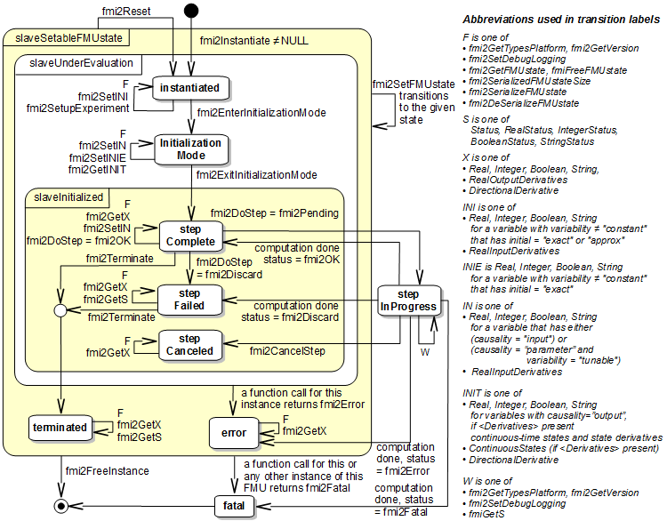
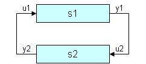

=== FMI Application Programming Interface

This section contains the interface description to access the in/output data and status information of a co-simulation slave from a C program.

==== Transfer of Input / Output Values and Parameters

Input and output variables and variables are transferred via the `fmi3GetXXX` and `fmi3SetXXX` functions, defined in section 2.1.7.

In order to enable the slave to interpolate the continuous real inputs between communication steps, the derivatives of the inputs with respect to time can be provided.
Also, higher derivatives can be set to allow higher order interpolation.
Whether a slave is able to interpolate and therefore needs this information is provided by the capability attribute `canInterpolateInputs`.

[source, C]
----
fmi3Status fmi3SetRealInputDerivatives(fmi3Component c,
          const fmi3ValueReference vr[], size_t nvr,
          const fmi3Integer order[],
          const fmi3Real value[]);
----

Sets the n-th time derivative of real input variables.
Argument `"vr"` is a vector of value references that define the variables whose derivatives shall be set.
The array `"order"` contains the orders of the respective derivative (1 means the first derivative, 0 is not allowed).
Argument "value" is a vector with the values of the derivatives.
`"nvr"` is the dimension of the vectors. +
Restrictions on using the function are the same as for the `fmi3SetReal` function.

Inputs and their derivatives are set with respect to the beginning of a communication time step.

To allow interpolation/approximation of the real output variables between communication steps (if they are used as inputs for other slaves), the derivatives of the outputs with respect to time can be read.
Whether the slave is able to provide the derivatives of outputs is given by the unsigned integer capability flag `MaxOutputDerivativeOrder`.
It delivers the maximum order of the output derivative.
If the actual order is lower (because the order of integration algorithm is low), the retrieved value is 0.

_[Example: If the internal polynomial is of order 1 and the master inquires the second derivative of an output, the slave will return zero.]_

The derivatives can be retrieved by:

[source, C]
----
fmi3Status fmi3GetRealOutputDerivatives (fmi3Component c, +
          const fmi3ValueReference vr[], size_t nvr, +
          const fmi3Integer order[], +
          fmi3Real value[]);
----

Retrieves the n-th derivative of output values.
Argument `"vr"` is a vector of `"nvr"` value references that define the variables whose derivatives shall be retrieved.
The array `order` contains the order of the respective derivative (1 means the first derivative, 0 is not allowed).
Argument `"value"` is a vector with the actual values of the derivatives. +
Restrictions on using the function are the same as for the `fmi3GetReal` function.

The returned outputs correspond to the current slave time.
E.g. after a successful `fmi3DoStep(...)` the returned values are related to the end of the communication time step.

This standard supports polynomial interpolation and extrapolation as well as more sophisticated signal extrapolation schemes like rational extrapolation, see the companion document "FunctionalMockupInterface-ImplementationHints.pdf".

==== Computation

The computation of time steps is controlled by the following function.

[source, C]
----
fmi3Status fmi3DoStep(fmi3Component c,
          fmi3Real currentCommunicationPoint,
          fmi3Real communicationStepSize,
          fmi3Boolean noSetFMUStatePriorToCurrentPoint);
----

The computation of a time step is started. +
Argument `currentCommunicationPoint` is the current communication point of the master (latexmath:[tc_i]) and argument `communicationStepSize` is the communication step size (latexmath:[hc_i]).
The latter must be latexmath:[> 0.0].
The slave must integrate until time instant latexmath:[tc_{i+1} = tc_i + hc_i].
_[The calling environment defines the communication points and `fmi3DoStep` must synchronize to these points by always integrating exactly to latexmath:[tc_i + hc_i].
It is up to `fmi3DoStep` how to achieve this.]_
At the first call to `fmi3DoStep` after `fmi3ExitInitializationMode` was called `currentCommunicationPoint` must be equal to `startTime` as set with `fmi3SetupExperiment`.
_[Formally, argument `currentCommunicationPoint` is not needed.
It is present in order to handle a mismatch between the master and the FMU state of the slave: The `currentCommunicationPoint` and the FMU state of the slaves defined by former_ `fmi3DoStep` _or_ `fmi3SetFMUState` _calls have to be consistent with respect to each other.
For example, if the slave does not use the update formula for the independent variable as required above,_ latexmath:[tc_{i+1} = tc_i + hc_i] _(using argument_ latexmath:[tc_i] = `currentCommunicationPoint` _of_ `fmi3DoStep`) _but uses internally an own update formula, such as_ latexmath:[tc_{s,i+1} = tc_{s,i} + hc_{s,i}] _then the slave could use as time increment_ latexmath:[\text{hc}_{s,i} := (tc_i - tc_{s,i}) + hc_i] _(instead of_ latexmath:[\text{hc}_{s,i} := hc_i] _) to avoid a mismatch between the master time_ latexmath:[tc_{i+1}] _and the slave internal time_ latexmath:[tc_{s,i+1}] _for large i.]_

Argument `noSetFMUStatePriorToCurrentPoint` is `fmi3True` if `fmi3SetFMUState` will no longer be called for time instants prior to `currentCommunicationPoint` in this simulation run _[the slave can use this flag to flush a result buffer]_.

The function returns: +
`fmi3OK` - if the communication step was computed successfully until its end. +
`fmi3Discard` - if the slave computed successfully only a subinterval of the communication step.
The master can call the appropriate `fmi3GetXXXStatus` functions to get further information.
If possible, the master should retry the simulation with a shorter communication step size.
_[Redoing a step is only possible if the FMU state has been recorded at the beginning of the current (failed) step with `fmi3GetFMUState`.
Redoing a step is performed by calling `fmi3SetFMUState` and afterwards calling `fmi3DoStep` with the new communicationStepSize.
Note that it is not possible to change `currentCommunicationPoint` in such a call.]_ +
`fmi3Error` - the communication step could not be carried out at all.
The master can try to repeat the step with other input values and/or a different communication step size in the same way as described in the `fmi3Discard` case above. +
`fmi3Fatal` - if an error occurred which corrupted the FMU irreparably.
_[The master should stop the simulation run immediatlely.]_ See section 2.1.3 for details. +
`fmi3Pending` - this status is returned if the slave executes the function asynchronously.
That means the slave starts the computation but returns immediately.
The master has to call `fmi3GetStatus(...,fmi3DoStep,...)` to find out if the slave is done.
An alternative is to wait until the callback function `fmi3StepFinished` is called by the slave.
`fmi3CancelStep` can be called to cancel the current computation.
It is not allowed to call any other function during a pending `fmi3DoStep`.

[source, C]
----
fmi3Status fmi3CancelStep(fmi3Component c);
----

Can be called if `fmi3DoStep` returned `fmi3Pending` in order to stop the current asynchronous execution.
The master calls this function if, for example, the co-simulation run is stopped by the user or one of the slaves.
Afterwards it is only allowed to call `fmi3Reset` or `fmi3FreeInstance`.

It depends on the capabilities of the slave which parameter constellations and calling sequences are allowed (see 4.3.1)

==== Retrieving Status Information from the Slave

Status information is retrieved from the slave by the following functions:

[source, C]
----
fmi3Status fmi3GetStatus       (fmi3Component c, const fmi3StatusKind s,
                                fmi3Status* value);
fmi3Status fmi3GetRealStatus   (fmi3Component c, const fmi3StatusKind s,
                                fmi3Real* value);
fmi3Status fmi3GetIntegerStatus(fmi3Component c, const fmi3StatusKind s,
                                fmi3Integer* value);
fmi3Status fmi3GetBooleanStatus(fmi3Component c, const fmi3StatusKind s,
                                fmi3Boolean* value);
fmi3Status fmi3GetStringStatus (fmi3Component c, const fmi3StatusKind s,
                                fmi3String* value);
----

Informs the master about the actual status of the simulation run.
Which status information is to be returned is specified by the argument `fmi3StatusKind`.
It depends on the capabilities of the slave which status information can be given by the slave (see 4.3.1).
If a status is required which cannot be retrieved by the slave it returns `fmi3Discard`.

[source, C]
----
typedef enum {fmi3DoStepStatus,
              fmi3PendingStatus,
              fmi3LastSuccessfulTime,
              fmi3Terminated
             } fmi3StatusKind;
----

Defines which status is inquired.

The following status information can be retrieved from a slave:

[options="header", cols="3,2,7"]
|====
| Status |Type of retrieved value |Description

|`fmi3DoStepStatus`
|`fmi3Status`
|Can be called when the `fmi3DoStep` function returned `fmi3Pending`.
The function delivers `fmi3Pending` if the computation is not finished.
Otherwise the function returns the result of the asynchronously executed `fmi3DoStep` call.

|`fmi3PendingStatus`
|`fmi3String`
|Can be called when the `fmi3DoStep` function returned `fmi3Pending`.
The function delivers a string which informs about the status of the currently running asynchronous `fmi3DoStep` computation.

|`fmi3LastSuccessfulTime`
|`fmi3Real`
|Returns the end time of the last successfully completed communication step.
Can be called after `fmi3DoStep` returned `fmi3Discard`.

|`fmi3Terminated`
|`fmi3Boolean`
|Returns true, if the slave wants to terminate the simulation.
Can be called after `fmi3DoStep` returned `fmi3Discard`.
Use `fmi3LastSuccessfulTime` to determine the time instant at which the slave terminated.
|====

==== State Machine of Calling Sequence from Master to Slave

The following state machine defines the supported calling sequences.

.Calling sequence of Co-Simulation C functions in form of an UML 2.0 state machine.

Each state of the state machine corresponds to a certain phase of a simulation as follows:

instantiated::
In this state, start and guess values (= variables that have `initial` = `"exact"` or `"approx"`) can be set.

Initialization Mode::
In this state, equations are active to determine all outputs (and optionally other variables exposed by the exporting tool).
The variables that can be retrieved by `fmi3GetXXX` calls are (1) defined in the XML file under `<ModelStructure><InitialUnknowns>`, and (2) variables with `causality` = `"output"`.
Variables with `initial` = `"exact"`, as well as variables with `variability` = `"input"` can be set.

slaveInitialized::
In this state, the slave is initialized and the co-simulation computation is performed. The calculation until the next communication point is performed with function `fmi3DoStep`. Depending on the return value, the slave is in a different state (step complete, step failed, step canceled).

terminated::
In this state, the solution at the final time of the simulation can be retrieved.

Note that in Initialization Mode input variables can be set with `fmi3SetXXX` and output variables can be retrieved with `fmi3GetXXX` interchangeably according to the model structure defined under element `<ModelStructure><InitialUnknowns>` in the XML file.
_[For example, if one output `y1` depends on two inputs `u1`, `u2`, then these two inputs must be set, before `y1` can be retrieved.
If additionally an output `y2` depends on an input `u3`, then `u3` can be set and `y2` can be retrieved afterwards.
As a result, artificial or "real" algebraic loops over connected FMUs in Initialization Mode can be handled by using appropriate numerical algorithms.]_

There is the additional restriction in `slaveInitialized` state that it is not allowed to call `fmi3GetXXX` functions after `fmi3SetXXX` functions without an `fmi3DoStep` call in between.

_[The reason is to avoid different interpretations of the caching, since contrary to FMI for Model Exchange, `fmi3DoStep` will perform the actual calculation instead of `fmi3GetXXX`, and therefore, dummy algebraic loops at communication points cannot be handeled by an appropriate sequence of `fmi3GetXXX` and, `fmi3SetXXX` calls as for ModelExchange.

Examples:_

[cols="3,4",options="header"]
|====
|_Correct calling sequence_ |_Wrong calling sequence_
|_fmi3SetXXX on inputs_ +
_fmi3DoStep_ +
_fmi3GetXXX on outputs_ +
_fmi3SetXXX on inputs_ +
_fmi3DoStep_ +
_fmi3GetXXX on outputs_ +

|_fmi3SetXXX on inputs_ +
_fmi3DoStep_ +
_fmi3GetXXX on outputs_ +
_fmi3SetXXX on inputs_ +
_fmi3GetXXX on outputs // not allowed_ +
_fmi3DoStep_ +
_fmi3GetXXX on outputs_ +
|====
_]_

The allowed function calls in the respective states are summarized in the following table (functions marked in [yellow-background]#"yellow"# are only available for "Co-Simulation", the other functions are available both for "Model Exchange" and "Co-Simulation"):

[cols="10,1,1,1,1,1,1,1,1,1,1",width="40%"]
|====
.2+.>|*Function*
10+|*FMI 2.0 for Co-Simulation*
|[vertical-text]#start, end#
|[vertical-text]#instantiated#
|[vertical-text]#Initialization Mode#
|[vertical-text]#stepComplete#
|[vertical-text]#stepInProgress#
|[vertical-text]#stepFailed#
|[vertical-text]#stepCanceled#
|[vertical-text]#terminated#
|[vertical-text]#error#
|[vertical-text]#fatal#

|fmi3GetTypesPlatform         |x |x |x |x |x |x |x |x |x |
|fmi3GetVersion               |x |x |x |x |x |x |x |x |x |
|fmi3SetDebugLogging          |  |x |x |x |x |x |x |x |x |
|fmi3Instantiate              |x |  |  |  |  |  |  |  |  |
|fmi3FreeInstance             |  |x |x |x |  |x |x |x |x |
|fmi3SetupExperiment          |  |x |  |  |  |  |  |  |  |
|fmi3EnterInitializationMode  |  |x |  |  |  |  |  |  |  |
|fmi3ExitInitializationMode   |  |  |x |  |  |  |  |  |  |
|fmi3Terminate                |  |  |  |x |  |x |  |  |  |
|fmi3Reset                    |  |x |x |x |  |x |x |x |x |
|fmi3GetReal                  |  |  |2 |x |  |8 |7 |x |7 |
|fmi3GetInteger               |  |  |2 |x |  |8 |7 |x |7 |
|fmi3GetBoolean               |  |  |2 |x |  |8 |7 |x |7 |
|fmi3GetString                |  |  |2 |x |  |8 |7 |x |7 |
|fmi3SetReal                  |  |1 |3 |6 |  |  |  |  |  |
|fmi3SetInteger               |  |1 |3 |6 |  |  |  |  |  |
|fmi3SetBoolean               |  |1 |3 |6 |  |  |  |  |  |
|fmi3SetString                |  |1 |3 |6 |  |  |  |  |  |
|fmi3GetFMUstate              |  |x |x |x |  |8 |7 |x |7 |
|fmi3SetFMUstate              |  |x |x |x |  |x |x |x |x |
|fmi3FreeFMUstate             |  |x |x |x |  |x |x |x |x |
|fmi3SerializedFMUstateSize   |  |x |x |x |  |x |x |x |x |
|fmi3SerializeFMUstate        |  |x |x |x |  |x |x |x |x |
|fmi3DeSerializeFMUstate      |  |x |x |x |  |x |x |x |x |
|fmi3GetDirectionalDerivative |  |  |x |x |  |8 |7 |x |7 |
|fmi3SetRealInputDerivatives  {set:cellbgcolor:yellow} |  {set:cellbgcolor!} |x |x |x |  |  |  |  |  |
|fmi3GetRealOutputDerivatives {set:cellbgcolor:yellow} |  {set:cellbgcolor!} |  |  |x |  |8 |x |x |7 |
|fmi3DoStep                   {set:cellbgcolor:yellow} |  {set:cellbgcolor!} |  |  |x |  |  |  |  |  |
|fmi3CancelStep               {set:cellbgcolor:yellow} |  {set:cellbgcolor!} |  |  |  |x |  |  |  |  |
|fmi3GetStatus                {set:cellbgcolor:yellow} |  {set:cellbgcolor!} |  |  |x |x |x |  |x |  |
|fmi3GetRealStatus            {set:cellbgcolor:yellow} |  {set:cellbgcolor!} |  |  |x |x |x |  |x |  |
|fmi3GetIntegerStatus         {set:cellbgcolor:yellow} |  {set:cellbgcolor!} |  |  |x |x |x |  |x |  |
|fmi3GetBooleanStatus         {set:cellbgcolor:yellow} |  {set:cellbgcolor!} |  |  |x |x |x |  |x |  |
|fmi3GetStringStatus          {set:cellbgcolor:yellow} |  {set:cellbgcolor!} |  |  |x |x |x |  |x |  |
|====

*x* means: call is allowed in the corresponding state +
*number* means: call is allowed if the indicated condition holds: +
*1* for a variable with `variability = "constant"` that has `initial = "exact"` or `"approx"` +
*2* for a variable with `causality = "output"` or continuous-time states or state derivatives
(if element `<Derivatives>` is present) +
*3* for a variable with `variability = "constant"` that has `initial = "exact"`,
or `causality` = `"input"` +
*6* for a variable with `causality` = `"input"` or (`causality` = `"parameter"` and `variability` = `"tunable"`) +
*7* always, but retrieved values are usable for debugging only +
*8* always, but if status is other than `fmi3Terminated`,
retrieved values are useable for debugging only

==== Pseudo-code Example

In the following example, the usage of the FMI functions is sketched in order to clarify the typical calling sequence of the functions in a simulation environment.
The example is given in a mix of pseudo-code and C, in order to keep it small and understandable.
We consider two slaves, where both have one continuous real input and one continuous real output which are connected in the following way:

.Connection graph of the slaves.
[caption="Figure 12: "]

We assume no algebraic dependency between input and output of each slave.
The code demonstrates the simplest master algorithm as shown in section 4.1:

[start=8]
. Constant communication step size.
. No repeating of communication steps.
. The slaves do not support asynchronous execution of `fmi3DoStep`.

The error handling is implemented in a very rudimentary way.

[source, C]
----
//////////////////////////
//Initialization sub-phase
//Set callback functions,
fmi3CallbackFunctions cbf;
cbf.logger = loggerFunction;  //logger function
cbf.allocateMemory = calloc;
cbf.freeMemory = free;
cbf.stepFinished = NULL;      //synchronous execution
cbf.componentEnvironment = NULL;

//Instantiate both slaves
fmi3Component s1 = s1_fmi3Instantiate("Tool1" , fmi3CoSimulation, GUID1, "",
                                    fmi3False, fmi3False, &cbf, fmi3True);
fmi3Component s2 = s2_fmi3Instantiate("Tool2" , fmi3CoSimulation, GUID2, "",
                                    fmi3False, fmi3False, &cbf, fmi3True);

if ((s1 == NULL) || (s2 == NULL))
      return FAILURE;

// Start and stop time
startTime = 0;
stopTime = 10;

//communication step size
h = 0.01;

// set all variable start values (of "ScalarVariable / <type> / start")
s1_fmi3SetReal/Integer/Boolean/String(s1, ...);
s2_fmi3SetReal/Integer/Boolean/String(s2, ...);

//Initialize slaves
s1_fmi3SetupExperiment(s1, fmi3False, 0.0, startTime, fmi3True, stopTime);
s2_fmi3SetupExperiment(s1, fmi3False, 0.0, startTime, fmi3True, stopTime);
s1_fmi3EnterInitializationMode(s1);
s2_fmi3EnterInitializationMode(s2);

// set the input values at time = startTime
s1_fmi3SetReal/Integer/Boolean/String(s1, ...);
s2_fmi3SetReal/Integer/Boolean/String(s2, ...);
s1_fmi3ExitInitializationMode(s1);
s2_fmi3ExitInitializationMode(s2);

//////////////////////////
//Simulation sub-phase
tc = startTime; //Current master time

while ((tc < stopTime) && (status == fmi3OK))
{

    //retrieve outputs
    s1_fmi3GetReal(s1, ..., 1, &y1);
    s2_fmi3GetReal(s2, ..., 1, &y2);

    //set inputs
    s1_fmi3SetReal(s1, ..., 1, &y2);
    s2_fmi3SetReal(s2, ..., 1, &y1);

    //call slave s1 and check status
    status = s1_fmi3DoStep(s1, tc, h, fmi3True);
    switch (status) {
    case fmi3Discard:
      fmi3GetBooleanStatus(s1, fmi3Terminated, &boolVal);
      if (boolVal == fmi3True)
            printf("Slave s1 wants to terminate simulation.");
    case fmi3Error:
    case fmi3Fatal:
      terminateSimulation = true;
      break;
    }
    if (terminateSimulation)
      break;

    //call slave s2 and check status as above
    status = s2_fmi3DoStep(s2, tc, h, fmi3True);
    ...

    //increment master time
    tc += h;
}

//////////////////////////
//Shutdown sub-phase
if ((status != fmi3Error) && (status != fmi3Fatal))
{
    s1_fmi3Terminate(s1);
    s2_fmi3Terminate(s2);
}

if (status != fmi3Fatal)
{
    s1_fmi3FreeInstance(s1);
    s2_fmi3FreeInstance(s2);
}
----
