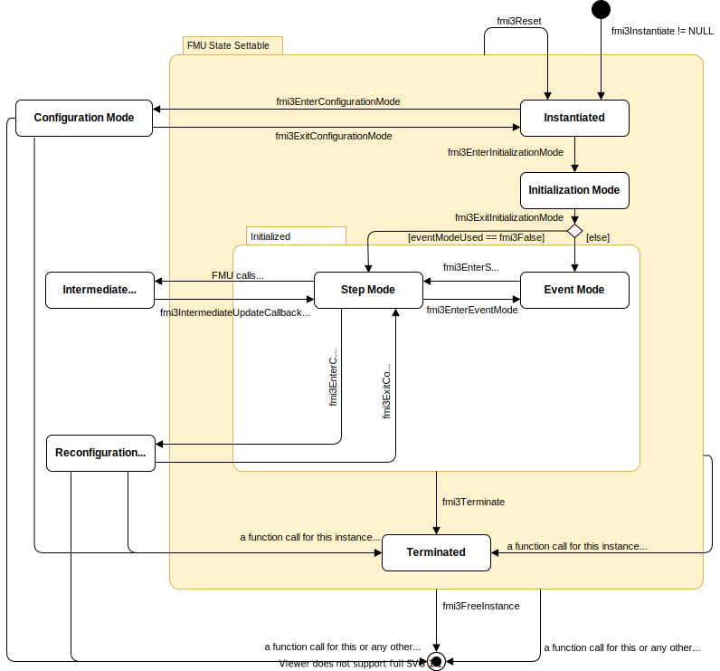

=== State Machine for Co-Simulation [[state-machine-co-simulation]]

The state machine in <<figure-co-simulation-state-machine>> defines the allowed calling sequences for FMI for Co-Simulation.

.Calling sequence of Co-Simulation C functions.
[#figure-co-simulation-state-machine]

Common states are defined in <<common-state-machine>>, such as super states <<FMUStateSetable>> and  <<Initialized>>, states <<Instantiated>>, <<ConfigurationMode>>, <<ReconfigurationMode>>, <<InitializationMode>>, <<EventMode>>, and <<Terminated>>.

==== State: Step Mode [[StepMode,*Step Mode*]]

The state <<StepMode>> is used to compute the values of all variables between communication points and events and to advance time in the FMU.
If the FMU is connected in loops with other models, iterations over the FMU equations requires setting the FMU to a previous communication point and repeating the <<fmi3DoStep>>.

During <<StepMode>>, <<clocked-variable,clocked variables>> can not be set or get because <<Clock,Clocks>> are only active during <<EventMode>>.

[cols="2,1",options="header",]
|====
|<<each-state-description,Equations and Actions>>
|Functions Influencing Equations

|Set <<tunable>> <<parameter,`parameters`>> latexmath:[\mathbf{p}_{\mathit{variability == tunable}}] .
|<<get-and-set-variable-values,`fmi3Set{VariableType}`>>

|Set non-clocked, continuous-time and discrete-time <<input,`inputs`>> latexmath:[\mathbf{u}_{c+d-k}(\mathbf{t})].
|<<get-and-set-variable-values,`fmi3Set{VariableType}`>>

|Get values of non-clocked variables latexmath:[\mathbf{v}_{-k}(\mathbf{t})].
|<<get-and-set-variable-values,`fmi3Get{VariableType}`>>

|Get time derivatives of <<continuous>> <<output,`outputs`>> latexmath:[\mathbf{y}_c^{(j)}(\mathbf{t})].
|<<fmi3GetOutputDerivatives>>

a|
* latexmath:[(\mathbf{y}_{c+d-k}, \mathbf{y}_c^{(j)}, \mathbf{x}_{d-k}, \mathbf{w}_{c+d-k}, \mathbf{b}, \mathbf{t}_\mathit{i+1}) := \mathbf{f}_{\mathit{doStep}}({}^{\bullet}\mathbf{x}_d, \mathbf{u}_{c+d}, {}^{\bullet}\mathbf{u}_{c,u}, \mathbf{p}, {}^{\bullet}\mathbf{b}, \mathbf{t}_i, \mathbf{h}_i)] +
* Update previous values of non-clocked, discrete states: latexmath:[{}^\bullet\mathbf{x}_{d-k}:=\mathbf{x}_{d-k}].
* Update previous values of buffers: latexmath:[{}^\bullet\mathbf{b}:=\mathbf{b}].
* latexmath:[\mathbf{t}:=(\mathbf{t}_\mathit{i+1}, 0)]
|<<fmi3DoStep>>

|latexmath:[(\mathbf{v}_{u-k}, \mathbf{t}_u) := \mathbf{f}_{\mathit{inter}}({}^{\bullet}\mathbf{x}_d, \mathbf{u}_{c+d}, {}^{\bullet}\mathbf{u}_{c,u}, \mathbf{p}, {}^{\bullet}\mathbf{b}, \mathbf{t}_i, \mathbf{h}_i)]
|<<fmi3CallbackIntermediateUpdate>>

|Activate event equations latexmath:[\mathbf{f}_{\mathit{event}}].
|<<fmi3EnterEventModeCS>>

|====

Allowed Function Calls::

Function <<get-and-set-variable-values,`fmi3Set{VariableType}`>>::
sets the values of variables with:
* <<causality>> = <<input>>, or
* <<causality>> = <<parameter>> and <<variability>> = <<tunable>>

+
at time latexmath:[\mathbf{t}].

Function <<get-and-set-variable-values,`fmi3Get{VariableType}`>>::
returns values for all variables at latexmath:[\mathbf{t}].
<<get-and-set-variable-values,`fmi3Get{VariableType}`>> does not trigger an evaluation of latexmath:[\mathbf{f}_\mathit{doStep}].
Therefore, <<algebraic-loops,algebraic loops>> at communication points cannot be handled by an appropriate sequence of <<get-and-set-variable-values,`fmi3Get{VariableType}`>> and <<get-and-set-variable-values,`fmi3Set{VariableType}`>> calls _[contrary to <<InitializationMode>>, <<EventMode>> and <<ContinuousTimeMode>>]_.
Repeating a communication step requires to reset the FMU state to the previous communication point with <<fmi3SetFMUState>> and repeating the <<fmi3DoStep>> with new input values.
+
Calling <<get-and-set-variable-values,`fmi3Get{VariableType}`>> is not allowed after <<get-and-set-variable-values,`fmi3Set{VariableType}`>> without calling <<fmi3DoStep>> in between.
_[This allows for more efficient FMU implementations that avoid double buffering and allows in-place operations.]_

Function <<fmi3GetOutputDerivatives>>::
See <<getting-output-derivatives>>.

Function <<fmi3GetDirectionalDerivative>>::
See <<fmi3GetDirectionalDerivative>>.

Function <<fmi3GetAdjointDerivative>>::
See <<fmi3GetAdjointDerivative>>.

Function <<fmi3DoStep>>::
The importer requests the computation of the next time step with the following function:
+
[[fmi3DoStep,`fmi3DoStep`]]
[source, C]
----
include::../headers/fmi3FunctionTypes.h[tags=DoStep]
----
Only <<fmi3DoStep>> can change the time of a Co-Simulation FMU from the outside (<<advancing-time,time advances internally during `fmi3DoStep`>>).
Arguments referring to time inherit the the unit of the <<independent>> variable.

* [[currentCommunicationPoint,`currentCommunicationPoint`]] `currentCommunicationPoint` is the current communication point of the importer (latexmath:[\mathbf{t}_\mathit{i}]) with the unit of the <<independent>> variable.
At the first call of <<fmi3DoStep>>, <<currentCommunicationPoint>> must be equal to the argument <<startTime>> of <<fmi3EnterInitializationMode>>.

* [[communicationStepSize,`communicationStepSize`]] `communicationStepSize` is the expected communication step size (latexmath:[\mathbf{h}_\mathit{i}]) with the unit of the <<independent>> variable.
<<communicationStepSize>> must be latexmath:[> 0.0].
The FMU is expected to compute until time latexmath:[\mathbf{t}_{i+1} = \mathbf{t}_\mathit{i} + \mathbf{h}_\mathit{i}].
See <<canHandleVariableCommunicationStepSize>> for restrictions.
+
_[Formally, argument <<currentCommunicationPoint>> is not needed._
_It is present in order to handle a potential mismatch between the importer's and the FMU's time representations and/or computations._
_Both arguments <<currentCommunicationPoint>> and <<communicationStepSize>> allow computing of_ latexmath:[\mathbf{t}_\mathit{i+1}] _by one addition, avoiding accumulation of numerical errors.]_

* [[noSetFMUStatePriorToCurrentPoint,`noSetFMUStatePriorToCurrentPoint`]] `noSetFMUStatePriorToCurrentPoint == fmi3True` if `fmi3SetFMUState` will no longer be called for time instants prior to <<currentCommunicationPoint>> in this simulation run.
+
_[The FMU can use this flag to flush a result buffer.]_

* [[eventEncountered,`eventEncountered`]] <<eventEncountered,`eventEncountered == fmi3True`>> indicates that an event was encountered at <<lastSuccessfulTime>> and the importer has to enter <<EventMode>> by calling <<fmi3EnterEventModeCS>>.
<<eventEncountered,`eventEncountered == fmi3True`>> must not be signaled, if the importer indicates to not support <<EventMode>> by <<eventModeUsed,`eventModeUsed == fmi3False`>>.

* [[terminateSimulationDS,`terminateSimulation`]] When <<terminateSimulationDS,`terminateSimulation == fmi3True`>>, the FMU requests to stop the simulation and the importer must call <<fmi3Terminate>>.

* [[earlyReturn,`earlyReturn`]] `earlyReturn` signals to the importer that the FMU returns at latexmath:[\mathbf{t}_\mathit{i+1} < \mathbf{t}_i +]<<communicationStepSize>> from the <<fmi3DoStep>>.
<<earlyReturn, `earlyReturn == fmi3True`>> is only allowed if <<earlyReturnAllowed,`earlyReturnAllowed == fmi3True`>> in <<fmi3InstantiateCoSimulation>>.
The time reached is specified in <<lastSuccessfulTime>>.
Reasons for <<earlyReturn, `earlyReturn == fmi3True`>> are
** expressed by the return arguments <<eventEncountered>> or <<terminateSimulationDS>> of <<fmi3DoStep>>, or
** the FMU's reaction to the importers request for <<earlyReturn>> by the return argument <<earlyReturnRequested, `earlyReturnRequested == fmi3True`>> of <<fmi3CallbackIntermediateUpdate>>, or
** the FMU's request for a communication point at <<lastSuccessfulTime>> for any other reason.

* [[lastSuccessfulTime,`lastSuccessfulTime`]] `lastSuccessfulTime` represents the internal time latexmath:[\mathbf{t}_\mathit{i+1}] of the FMU when <<fmi3DoStep>> returns, for any value of <<earlyReturn>>.
It is possible that the <<lastSuccessfulTime>> is equal to <<currentCommunicationPoint>> when <<earlyReturn,`earlyReturn == fmi3True`>> to indicate, for example, the detection of an event at <<currentCommunicationPoint>>.
Even if the FMU returns from <<fmi3DoStep>> with <<fmi3OK>> and <<earlyReturn, `earlyReturn == fmi3False`>>, it is allowed that <<lastSuccessfulTime>> deviates from the expected <<currentCommunicationPoint>> `+` <<communicationStepSize>>.
_[Examples:_
** _A fixed-step integrator inside the FMU cannot reach the requested time exactly._
_<<fixedInternalStepSize>> was introduced to reduce these effects._
** _A variable-step integrator with minimal step size is not able to land exactly at_ latexmath:[\mathbf{t}_\mathit{i+1}]_.]_

Function <<fmi3CallbackIntermediateUpdate>>::
<<fmi3CallbackIntermediateUpdate>> switches the FMU itself into the <<IntermediateUpdateMode>>.

[[fmi3EnterEventModeCS,`fmi3EnterEventMode`]]
Function <<fmi3EnterEventMode>>::
Changes state to <<EventMode>>.
This function must not be called, if <<fmi3InstantiateCoSimulation>> signaled <<eventModeUsed,`eventModeUsed == fmi3False`>>, which can be forced by the FMU with <<hasEventMode,`hasEventMode == false`>>. +

Function <<fmi3EnterConfigurationMode>>::
<<fmi3EnterConfigurationMode>> changes state to <<ReconfigurationMode>>.
<<fmi3EnterConfigurationMode>> must not be called if the FMU contains no <<tunable>> <<structuralParameter,`structural parameters`>> (i.e. with <<causality>>= <<structuralParameter>> and <<variability>> = <<tunable>>).

==== State: Intermediate Update Mode [[IntermediateUpdateMode,*Intermediate Update Mode*]]

_[The following use cases are enabled:_

* _Access to intermediate variables enables advanced Co-Simulation with interpolation/extrapolation techniques (such as polynomial extrapolation, <<transmission-line-modeling>> (<<tlm>>) co-simulation, anti-alias filtering, smoothing of input among others)._
* _<<IntermediateUpdateMode>> enables the same input approximation that was possible in FMI 2.0 with `fmi2SetInputDerivatives`, by evaluation of the approximation polynomial by the importer and not within the FMU as in FMI 2.0_
* _The Co-Simulation algorithm can request an <<early-return,early return>> from <<fmi3DoStep>>, because of an event between communication points (see <<early-return>>)._

_Note that the call to <<fmi3CallbackIntermediateUpdate>> and thus entering the <<IntermediateUpdateMode>> can only be triggered by the FMU itself._
_The importer cannot actively trigger this and hence for some use cases (e.g. cooperative multitasking and setting of intermediate input values) it relies on the callbacks from the FMUs to be able to realize these use cases properly.]_

A Co-Simulation FMU can provide values for its <<output>> variables at intermediate points between two consecutive communication points, and is able to receive new values for <<input>> variables at these intermediate points.
This is typically required when the FMU uses a numerical solver to integrate the FMU's internal state between communication points in <<fmi3DoStep>>.
This numerical solver assumes that the inputs are continuous in the integration interval, dictated by <<fmi3DoStep>>.
In FMI 2.0 Co-simulation, the intermediate inputs are provided by the use of extrapolations.
The intermediate update functions allow FMUs to receive inputs, and provide outputs, directly to the co-simulation algorithm, in those intermediate time points.

Intermediate values for <<continuous>> inputs are computed by the importer for example by an extrapolation polynomial build with the output derivatives of connected FMUs.
FMUs can signal with the optional attribute <<recommendedIntermediateInputSmoothness>> of value latexmath:[k] to the co-simulation algorithm that best convergence rates can be achieved if these approximation functions are of smoothness latexmath:[C^{k}([\mathbf{t}_i, \mathbf{t}_{i+1}\])], that is k-time continuously differentiable, with latexmath:[C^{0}] meaning continuous. +
_[This can increase simulation speed for higher order multi-step solvers that in this case do not have to reset at communication points.]_

The importer must ensure that the input approximation function latexmath:[\mathbf{u}_u] is consistent with the values of the input variable (latexmath:[\mathbf{u}_u(\mathbf{t}_{i+1})= \mathbf{u}(\mathbf{t}_{i+1})]).

Due to the way numerical solvers estimate and correct the approximation error, these intermediate <<output>> values may be tentative or may be final.
It is possible for the FMU to inform the co-simulation algorithm whether the internal solver is in a tentative state, meaning that the output values computed from that state are also tentative, or if the internal solver has successfully completed the integration step, meaning that the FMU's internal state is final, and will never be changed in the current execution of <<fmi3DoStep>>.
If the internal integration step has been successfully completed, the co-simulation algorithm can forward intermediate outputs to other FMUs, where they can be used, for e.g., for extrapolation, interpolation, filtering or asynchronous co-simulation.

<<figure-IntermediateUpdateMode>> summarizes the above description.
It illustrates multiple intermediate internal solver steps, distinguishing between the final ones (with black-filled circles) and tentative ones (with white-filled circles).
It distinguishes the level of trust that can be placed in the tentative outputs (with dashed arrows) and in final outputs (with solid arrows).

.Overview of solver states and intermediate update during a communication step
[#figure-IntermediateUpdateMode]
image::images/intermediateupdate.svg[width=65%, align="center"]

The FMU signals the support of <<IntermediateUpdateMode>> via the capability flag <<providesIntermediateUpdate>>.
The co-simulation algorithm signals the support for <<IntermediateUpdateMode>> by providing a non-NULL callback-function pointer for <<fmi3CallbackIntermediateUpdate, `intermediateUpdate`>>.

The FMU enters <<IntermediateUpdateMode>> by calling <<fmi3CallbackIntermediateUpdate>> within <<StepMode>> and leaves the state towards <<StepMode>> when the function returns.

[[fmi3CallbackIntermediateUpdate,`fmi3CallbackIntermediateUpdate`]]
[source, C]
----
include::../headers/fmi3FunctionTypes.h[tag=CallbackIntermediateUpdate]
----

[[intermediateUpdateTime,`intermediateUpdateTime`]]
* <<intermediateUpdateTime>> is the internal value of the <<independent>> variable _[typically simulation time]_ of the FMU at which the callback has been called for intermediate and final steps.
If an event happens or an <<outputClock>> ticks, <<intermediateUpdateTime>> is the time of event or <<outputClock>> tick.
In Co-Simulation, <<intermediateUpdateTime>> is restricted by the arguments to <<fmi3DoStep>> as follows: +
<<currentCommunicationPoint>> latexmath:[\leq] <<intermediateUpdateTime>> latexmath:[\leq] (<<currentCommunicationPoint>> + <<communicationStepSize>>). +
The FMU must not call the callback function <<fmi3CallbackIntermediateUpdate>> with an <<intermediateUpdateTime>> that is smaller than the <<intermediateUpdateTime>> given in a previous call of <<fmi3CallbackIntermediateUpdate>> with `intermediateStepFinished == fmi3True`. +

[[intermediateVariableSetRequested,`intermediateVariableSetRequested`]]
* If <<intermediateVariableSetRequested,`intermediateVariableSetRequested == fmi3True`>>, the co-simulation algorithm may provide intermediate values for continuous <<input>> variables with <<intermediateUpdate,`intermediateUpdate = true`>> by calling <<get-and-set-variable-values,`fmi3Set{VariableType}`>>.
The set of variables for which the co-simulation algorithm will provide intermediate values is declared through the <<requiredIntermediateVariables>> argument to <<fmi3Instantiate>>.
If a co-simulation algorithm does not provide a new value for any of the variables contained in the set it registered, the last value set remains.

[[intermediateVariableGetAllowed,`intermediateVariableGetAllowed`]]
* If <<intermediateVariableGetAllowed,`intermediateVariableGetAllowed == fmi3True`>>, the co-simulation algorithm may collect intermediate output variables by calling <<get-and-set-variable-values,`fmi3Get{VariableType}`>> for variables with <<intermediateUpdate,`intermediateUpdate = true`>>.
The set of variables for which the co-simulation algorithm can get values is supplied through the <<requiredIntermediateVariables>> argument to <<fmi3Instantiate>>.

[[intermediateStepFinished,`intermediateStepFinished`]]
* If <<intermediateStepFinished, `intermediateStepFinished == fmi3False`>>, the intermediate outputs of the FMU that the co-simulation algorithm inquires with <<get-and-set-variable-values,`fmi3Get{VariableType}`>> resulting from tentative internal solver states and may still change for the same <<intermediateUpdateTime>> _[e.g., if the solver deems the tentative state to cause a too high approximation error, it may go back in time and try to re-estimate the state using smaller internal time steps]_. +
If <<intermediateStepFinished, `intermediateStepFinished == fmi3True`>>, intermediate outputs inquired by the co-simulation algorithm with <<get-and-set-variable-values,`fmi3Get{VariableType}`>> correspond to accepted internal solver step.

[[canReturnEarly,`canReturnEarly`]]
* When <<canReturnEarly,`canReturnEarly == fmi3True`>> the FMU signals to the co-simulation algorithm its ability to return early from the current <<fmi3DoStep>>.

[[earlyReturnRequested,`earlyReturnRequested`]]
* `earlyReturnRequested`: If and only if <<canReturnEarly,`canReturnEarly == fmi3True`>>, the co-simulation algorithm may request the FMU to return early from <<fmi3DoStep>> by setting `earlyReturnRequested == fmi3True`.

[[earlyReturnTime,`earlyReturnTime`]]
* `earlyReturnTime` is used to signal the FMU at which time to return early from the current <<fmi3DoStep>>, if the return value of <<earlyReturnRequested, `earlyReturnRequested == fmi3True`>>.
If the <<earlyReturnTime>> is greater than the last signaled <<intermediateUpdateTime>>, the FMU may integrate up to the time instant <<earlyReturnTime>>.

.Mathematical description of <<IntermediateUpdateMode>>.
[#table-math-intermediateUpdateMode]
[cols="2,1",options="header",]
|====
|<<each-state-description,Equations and Actions>>
|Functions Influencing Equations

|Get intermediate variable values latexmath:[\mathbf{v}_u(\mathbf{t}_u)]
|<<get-and-set-variable-values,`fmi3Get{VariableType}`>>

|Get time derivatives of <<continuous>> <<output,`outputs`>> latexmath:[\mathbf{y}_\mathit{c,u}^{(j)}(\mathbf{t_\mathit{u}})].
|<<fmi3GetOutputDerivatives>>

a|
Set continuous intermediate input variables latexmath:[\mathbf{u}_{\mathit{c,u}}(\mathbf{t}_u)]
|<<get-and-set-variable-values,`fmi3Set{VariableType}`>>

|====

Allowed Function Calls::

Function <<get-and-set-variable-values,`fmi3Get{VariableType}`>>::
This function can be called for intermediate variables, if <<intermediateVariableGetAllowed,`intermediateVariableGetAllowed == fmi3True`>>.
Intermediate variables are variables that are marked with attribute <<intermediateUpdate,`intermediateUpdate = true`>> in the <<modelDescription.xml>> and have been included in the <<requiredIntermediateVariables>> argument to <<fmi3Instantiate>>.

+
For details on <<fmi3GetOutputDerivatives>> see <<getting-output-derivatives>>.

Function <<get-and-set-variable-values,`fmi3Set{VariableType}`>>::
This function can be called for intermediate input variables, if <<intermediateVariableSetRequested,`intermediateVariableSetRequested == fmi3True`>>.
Intermediate input variables are input variables that are marked with attribute <<intermediateUpdate,`intermediateUpdate = true`>> in the <<modelDescription.xml>> and have been included in the <<requiredIntermediateVariables>> argument of <<fmi3Instantiate>>.
In Co-Simulation, <<discrete>> <<input,`inputs`>> must not be set.

There is a defined order of calling these functions: first all <<get-and-set-variable-values,`fmi3Get{VariableType}`>> calls must be performed, then <<get-and-set-variable-values,`fmi3Set{VariableType}`>> may be called. +
_[This is analogous to the calling sequence of_ <<get-and-set-variable-values,`fmi3Get{VariableType}`>> _and_ <<get-and-set-variable-values,`fmi3Set{VariableType}`>> _calls at communication points.]_
