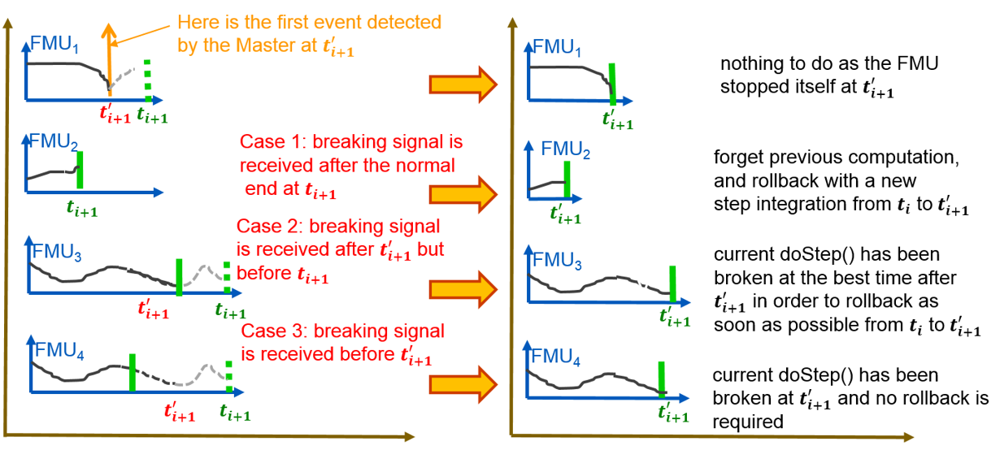

==== Mathematical Description
:DOSTEP: fmi3DoStep()
===== Basics

//=== Improving efficiency in multi-FMU environment when asynchronous mode is used

If an FMU prematurely stops its current `{DOSTEP}`  computation due to an unpredictable internal event before the normal end of the `{DOSTEP}`, i.e. before reaching `currentCommunicationPoint + communicationStepSize`, all other concurrently running FMUs are to be stopped as soon as possible in order to minimize the time needed for the co-simulation master to resynchronize all the FMUs at the same event time.

On a multi-node architecture, in particular, significant co-simulation speed-up may be obtained if the master can avoid waiting until the end of the slowest `{DOSTEP}` when many FMUs are integrating in parallel.

In this context based on parallel calculations, the following figure illustrates different possibilities to synchronize FMUs at the same event time.

//TODO: (review the below text descriptions of the four cases) text form (like below) instead of only png (i.e. no text search and noch tracking of changes possible in png form)
//TODO: add a visual more accurate diagram of the four cases
In the case of FMU1, the event time is also the new t_{i+1} time, i.e. this is the source of event.
In the case of FMU2, a complete rollback to latexmath:[t^{'}_{i+1}] is necessary.
In the case of FMU3, a partial rollback is neccessary.
In the case of FMU4, how did we inform to it that a new t_{i+1} has been defined -> well we dont, we only interrupt it.

.different possibilities to synchronize parallel FMUs at the same event time.
[caption="Figure 12: "]

{DOSTEP} routines run in parallel on different cores, so that each FMU starts integration from communication point latexmath:[t_{i}] to reach the next communication point latexmath:[t_{i+1}].
Assuming an unexpected internal event is detected at latexmath:[t^{'}_{i+1}< t_{i+1}] during FMU~1~ integration, the Master is immediately informed thanks to the early-return feature. 
//TODO: for the sake of good readability, it is imho ambiguous to use here "thanks to" "Early Return" because this is actually the name of the callback used to interrupt other FMUs running concurrently. instead I would say:
//TODO: "the master is informed of an early return using `fmi3IntermediateStepFinished()` callback function" 
So the Master would like now avoid others FMUs exceed the event time, since all FMUs should be resynchronized at the event time which will be the next new communication point.
On the figure, ongoing FMU computations can be broken either immediately (refer to case 2 for FMU~3~) or at latexmath:[t^{'}_{i+1}] (refer to case 3 for FMU~4~). 
Only FMU~2~ and FMU~3~ will be rolled back to latexmath:[t^{'}_{i+1}] by the Master as FMU~1~ and FMU~4~ have already reached the new communication point latexmath:[t^{'}_{i+1}].
Due to the early-return mechanism, the overall execution time of the simulation is reduced.

In order to stop the execution of ongoing `{DOSTEP}`, the Master invokes `fmi3DoEarlyReturn()` during (i.e. within)  the `fmi3IntermediateStepFinished()` callback function and provides an `earlyReturnTime`.

The prototype of this function whose return code is always `fmi3OK`, follows: 

[source, c]
----
include::../headers/fmi3FunctionTypes.h[tag=DoEarlyReturn]
----

After returning from the callback function, if the `fmi3DoEarlyReturn()` has been invoked inside the callback function, the FMU stops the integration either exactly at `earlyReturnTime` (if `current-FMU-time {lt}= earlyReturnTime`) or immediately after the its next internal intermediate step (if `current-FMU-time {gt} earlyReturnTime`). 
Afterwards, the FMU goes into the `stepComplete` state and  `{DOSTEP}`  returns and signals the premature stop (early-return) to the master by setting `earlyReturn` variable to `fmi3True`.
// TODO: I propose to add the following line or clarification: 
// TODO: Even if `current-FMU-time {lt}= earlyReturnTime`, there is no guarantee that FMU can stop exactly at earlyReturnTime. The only way to enforce this is to roll back and request a doStep of appropiate length to match earlyReturnTime
