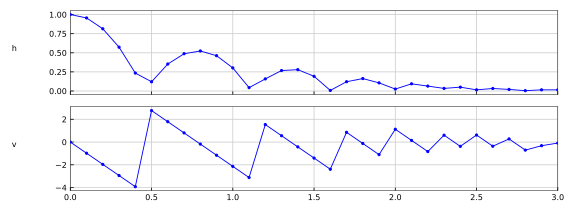
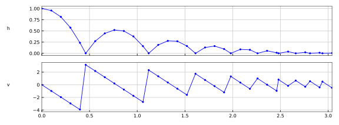
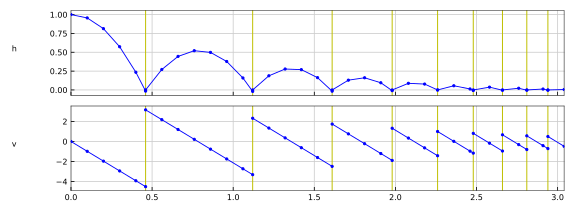
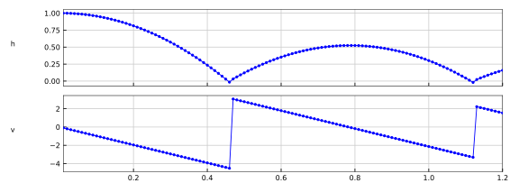

=== Code Examples

==== Basic Co-Simulation

[source, C]
----
include::Reference-FMUs/examples/simulate_fmi3_cs.c[tags=CoSimulation]
----

The plot below shows the output for the https://github.com/modelica/Reference-FMUs[BouncingBall Reference FMU] with a communication step size of 0.1 s.
Note that the points where the ball hits the floor are missed.

==== Early Return

[source, C]
----
include::Reference-FMUs/examples/cs_early_return.c[tags=EarlyReturn]
----

The plot below shows the output for the https://github.com/modelica/Reference-FMUs[BouncingBall Reference FMU] with a communication step size of 0.1 s.
Note that the points where the ball hits the floor are available, but only the outputs after the events are recorded.

==== Event Mode without Clocks

In the following example, the usage of the fmi3XXX functions is sketched for a co-simulation FMU that supports <<EventMode>>, but does not have any <<Clock,Clocks>> or <<clocked-variable,clocked variables>>.

[source, C]
----
include::Reference-FMUs/examples/cs_event_mode.c[tags=EventMode]
----

The plot below shows the output for the https://github.com/modelica/Reference-FMUs[BouncingBall Reference FMU] with a communication step size of 0.1 s.
Note that the points where the ball hits the floor are available and the outputs before and after the event are recorded.

==== Event Mode with Clocks

In the following example, the usage of the fmi3XXX functions is sketched for a co-simulation FMU that supports <<EventMode>> (but neither <<early-return,Early Return>> nor <<IntermediateUpdateMode,Intermediate Update>>) and has <<Clock,Clocks>> and <<clocked-variable,clocked variables>>.

[source, C]
----
 CALL(FMI3InstantiateCoSimulation(S,
        INSTANTIATION_TOKEN, // instantiationToken
        NULL,                // resourcePath
        fmi3False,           // visible
        fmi3False,           // loggingOn
        fmi3True,            // eventModeUsed
        fmi3False,           // earlyReturnAllowed
        NULL,                // requiredIntermediateVariables
        0,                   // nRequiredIntermediateVariables
        NULL                 // intermediateUpdate
    ));

    // set start values
    CALL(applyStartValues(S));

    fmi3Float64 time = startTime;

    // initialize the FMU
    CALL(FMI3EnterInitializationMode(S, fmi3False, 0.0, time, fmi3True, stopTime));

    // apply continuous and discrete inputs
    CALL(applyContinuousInputs(S, time, true));
    CALL(applyDiscreteInputs(S, time));

    CALL(FMI3ExitInitializationMode(S));

    // update discrete states
    do {
        CALL(FMI3UpdateDiscreteStates(S,
            &discreteStatesNeedUpdate,
            &terminateSimulation,
            &nominalsChanged,
            &statesChanged,
            &nextEventTimeDefined,
            &nextEventTime
        ));

        if (terminateSimulation) {
            goto TERMINATE;
        }
    } while (discreteStatesNeedUpdate);

    CALL(FMI3EnterStepMode(S));

    // communication step size
    const fmi3Float64 stepSize = 10 * FIXED_SOLVER_STEP;

    while (true) {

        CALL(recordVariables(S, time, outputFile));

        if (terminateSimulation || time + stepSize > stopTime) {
            break;
        }

        CALL(FMI3DoStep(S,
            time,                 // currentCommunicationPoint
            stepSize,             // communicationStepSize
            fmi3True,             // noSetFMUStatePriorToCurrentPoint
            &eventEncountered,    // eventEncountered
            &terminateSimulation, // terminate
            &earlyReturn,         // earlyReturn
            &time                 // lastSuccessfulTime
        ));

        if (eventEncountered) {

            // record non-clocked variables before event update
            CALL(recordVariables(S, time, outputFile));

            // enter Event Mode
            CALL(FMI3EnterEventMode(S));

            // apply non-clocked continuous and discrete inputs
            CALL(applyContinuousInputs(S, time, true));
            CALL(applyDiscreteInputs(S, time));

            // activate input clocks and apply clocked inputs
            CALL(applyInputClocks(S, time));
            CALL(applyClockedInputs(S, time));

            // update discrete states
            do {
                CALL(FMI3UpdateDiscreteStates(S,
                    &discreteStatesNeedUpdate,
                    &terminateSimulation,
                    &nominalsChanged,
                    &statesChanged,
                    &nextEventTimeDefined,
                    &nextEventTime
                ));

                // Note: clocks and clocked variables are neither applied nor recorded here again

                if (terminateSimulation) {
                    break;
                }
            } while (discreteStatesNeedUpdate);

            // return to Step Mode
            CALL(FMI3EnterStepMode(S));
        }
    }

TERMINATE:
    return tearDown();
----

==== Intermediate Update

[source, C]
----
include::Reference-FMUs/examples/cs_intermediate_update.c[tags=IntermediateUpdateCallback]
----

The plot below shows the output for the https://github.com/modelica/Reference-FMUs[BouncingBall Reference FMU] with a communication step size of 0.1 s.
Note that the outputs at all intermediate steps are recorded, too.

==== Connected FMUs

In the following example, the usage of the FMI functions is sketched in order to clarify the typical calling sequence of the functions in a simulation environment.
We consider two FMUs, where both have one <<continuous>> floating point <<input>> and one <<continuous>> floating point <<output>> which are connected in the following way:

.Connection graph of FMUs.
image::images/co-simulation-connection-of-FMUs.svg[width=300]

We assume no algebraic dependency between input and <<output>> of each FMU.
The code demonstrates the simplest importer as shown in <<state-machine-co-simulation>>:

- Constant communication step size.
- No repeating of communication steps.
- The error handling is implemented in a very rudimentary way.

[source, C]
----
include::examples/snippets.c[tags=ConnectedFMUs]
----
