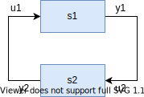

=== Code Examples

==== Co-Simulation

[source, C]
----
include::Reference-FMUs/examples/simulate_fmi3_cs.c[tags=CoSimulation]
----

==== Early Return

[source, C]
----
include::Reference-FMUs/examples/cs_early_return.c[tags=EarlyReturn]
----

==== Event Mode

[source, C]
----
include::Reference-FMUs/examples/cs_event_mode.c[tags=EventMode]
----

==== Intermediate Update

[source, C]
----
include::Reference-FMUs/examples/cs_intermediate_update.c[tags=IntermediateUpdateCallback]
----

==== Connected FMUs

In the following example, the usage of the FMI functions is sketched in order to clarify the typical calling sequence of the functions in a simulation environment.
We consider two FMUs, where both have one <<continuous>> floating point <<input>> and one <<continuous>> floating point <<output>> which are connected in the following way:

.Connection graph of FMUs.

We assume no algebraic dependency between input and <<output>> of each FMU.
The code demonstrates the simplest importer as shown in <<state-machine-co-simulation>>:

- Constant communication step size.
- No repeating of communication steps.
- The error handling is implemented in a very rudimentary way.

[source, C]
----
include::Reference-FMUs/examples/co_simulation.c[tags=CoSimulation]
----

==== Clocks [[code-example-clocked-co-simulation]]

In the following example, the usage of the FMI functions is sketched in order to clarify the typical calling sequence of the functions in a simulation environment.
We consider ...

The error handling is implemented in a very rudimentary way.

// TODO: add code example

//[source, C]
//----
//include::examples/c-code/co_simulation_clocked.c[tags=CoSimulation]
//----
