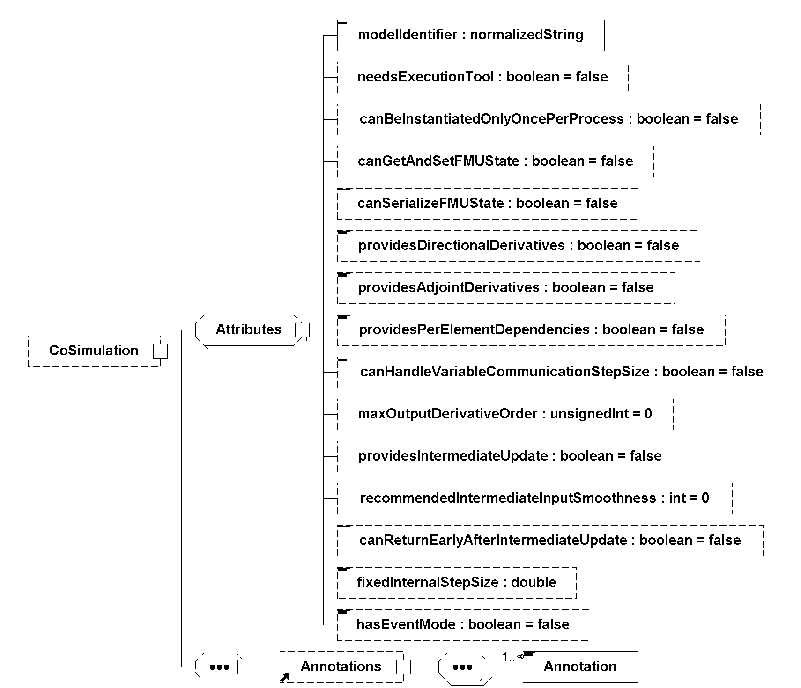

=== Description Schema [[co-simulation-schema]]

This is defined in <<fmi-description-schema>>.
Additionally, the Co-Simulation specific element `Implementation` is defined in the next section.

==== Co-Simulation FMU

If the XML file defines an FMU for Co-Simulation, element `CoSimulation` must be present.
It is defined as:

[[recommendedIntermediateInputSmoothness,`recommendedIntermediateInputSmoothness`]]

These attributes have the following meaning (all attributes are optional with exception of `modelIdentifier`):

[cols="1,1",options="header"]
|====
|Attribute
|Description

|`modelIdentifier`
|Short class name according to C syntax, for example, `A_B_C`.
Used as prefix for FMI functions if the functions are provided in C source code or in static libraries, but not if the functions are provided by a DLL/SharedObject.
`modelIdentifier` is also used as name of the static library or DLL/SharedObject.
See also <<header-files-and-naming-of-functions>>.

|`needsExecutionTool`
|If `true`, a tool is needed to execute the model.
The FMU just contains the communication to this tool.
_[Typically, this information is only utilized for information purposes._
_For example, a co-simulation algorithm can inform the user that a tool has to be available on the computer where the FMU is instantiated._
_The name of the tool can be taken from the attribute `generationTool` in `<fmiModelDescription>`.]_

|`canBeInstantiatedOnlyOncePerProcess`
|This flag indicates cases (especially for embedded code), where only one instance per FMU is possible.
(For multiple instantiation the default is `false`; if multiple instances are needed, the FMUs must be instantiated in different processes.).

|`canGetAndSetFMUState`
|If `true`, the environment can inquire the internal FMU state and restore it.
That is, <<fmi3GetFMUState>>, <<fmi3SetFMUState>>, and <<fmi3FreeFMUState>> are supported by the FMU.

|`canSerializeFMUState`
|If `true`, the environment can serialize the internal FMU state, in other words, <<fmi3SerializedFMUStateSize>>, <<fmi3SerializeFMUState>>, <<fmi3DeSerializeFMUState>> are supported by the FMU.
If this is the case, then flag `canGetAndSetFMUState` must be `true` as well.

|`providesDirectionalDerivatives`
|If `true`, the directional derivative of the equations at communication points can be computed with `fmi3GetDirectionalDerivative`.

|`providesAdjointDerivatives`
|If `true`, the adjoint derivatives of the equations can be computed with `fmi3GetAdjointDerivative`

|`maxOutputDerivativeOrder`
|The FMU is able to provide <<derivative,`derivatives`>> of <<output,`outputs`>> with maximum order.
Calling of `fmi3GetOutputDerivatives` is allowed up to the order defined by `maxOutputDerivativeOrder`.

|[[canHandleVariableCommunicationStepSize,`canHandleVariableCommunicationStepSize`]]`canHandleVariableCommunicationStepSize`
|The FMU can handle variable communication step size.
The communication step size (argument <<communicationStepSize>> of <<fmi3DoStep>>) has not to be constant for each call.

|`providesIntermediateUpdate`
|The FMU is able to provide access to selected variables during callback function call <<intermediateUpdate>>.
The accessible variables are marked with attribute <<intermediateUpdateAttr,`intermediateUpdate = true`>>.

|<<canReturnEarlyAfterIntermediateUpdate>>
|If `true`, the FMU is able to return early from <<fmi3DoStep>> if the co-simulation algorithm returns <<earlyReturnRequested,`earlyReturnRequested == fmi3True`>> from the callback <<intermediateUpdate>> and <<canReturnEarly,`canReturnEarly == fmi3True`>>.
_[If set to `true`, a Co-Simulation FMU supports ending <<fmi3DoStep>> before the planned next communication point._
_This can be used by the co-simulation algorithm to avoid unnecessary computations and roll backs of the FMU due to external events known by the co-simulation algorithm.]_

|<<recommendedIntermediateInputSmoothness>>
|A value of latexmath:[k] with latexmath:[k>0] signals to the co-simulation algorithm, that it is beneficial for the solver to receive intermediate inputs that are k-time continuously differentiable (latexmath:[C^k]) on the current communication interval. latexmath:[k=0] means continuous.
_[If for example the FMU uses internally a variable step BDF solver of order 4, in order to fulfill the convergence rate, latexmath:[C^4] is required for the inputs. If on the other hand, an FMU sub-samples the communication step with 10 fixed steps and uses a first order explicit Euler method as solver,_ latexmath:[C^0] _smoothness will be suffient.]_

|`fixedInternalStepSize`
|The fixed internal step size of the FMU (optional).
_[This information can be used by the co-simulation algorithm to synchronize the communication interval with the internal step size of the FMU._
_The co-simulation algorithm should calculate the communication points by multiplying (`number_of_steps * step_size`) instead of repeatedly incrementing (`time += step_size`) to avoid the accumulation of numerical errors.]_

|`hasEventMode`
|If `true` the FMU supports `fmi3EnterEventMode` and `fmi3ExitEventMode`.
Even if this flag is `true`, the co-simulation algorithm can chose to delegate event handling to the FMU by calling <<fmi3InstantiateCoSimulation>> with `eventModeUsed == fmi3False`.
If `eventModeUsed == fmi3True`, the co-simulation algorithm will have to actively trigger event handling in the FMU using <<fmi3NewDiscreteStates>>.
Calling <<fmi3InstantiateCoSimulation>> with `eventModeUsed == fmi3True` when the flag `hasEventMode = false` must raise an error from the FMU during instantiation.
If the FMU has synchronous clocks, then `eventModeUsed == fmi3True` and the importer must call <<fmi3InstantiateCoSimulation>> with `eventModeUsed == fmi3True`.
_[As with other optional features, these functions have to be present regardless of this flag._
_The co-simulation algorithm is informed this way if calling these functions triggers event handling functionalities._
|====

Note that if `needsExecutionTool = true`, then it is required that the original tool is available to be executed during co-simulation.
If `needsExecutionTool = false`, the FMU is completely contained inside the FMU in source code or binary format (DLL/SharedObject).

==== Clocks in Co-Simulation [[clocks-in-co-simulation]]

The co-simulation algorithm collects the information about the number and properties of <<clock,`clocks`>> supported by the FMU by analyzing the <<modelDescription.xml>>, see <<clock-type-definition>>.

The definition of <<clock,`clocks`>> is optional.

Each <<inputClock>> that ticks outside of the FMU, is activated for an FMU based on their <<valueReference>>.
<<outputClock,`Output clocks`>> inside of an FMU signal their activation based on their <<valueReference>>.

_[If <<dependencies>> (`fmi3Unknown`) are defined in the `<ModelStructure>` section of the <<modelDescription.xml>>, it is recommended to define such <<dependencies>> only within a model partition of a model (i.e. between variables that are assigned to the same <<clock>>).]_

If <<dependencies>> are defined for variables across model partitions, such variables can not be assigned to a <<clock>> via <<clockReference>>.

For FMI for Co-Simulation, variables that are assigned to a model partition of the model based on <<clockReference>> are not necessarily `clocked`.
Such variables can be continuous-time or discrete-time variables if the <<clock>> is of `clockType = communicationPoint`.

==== Example XML Description File

===== Example XML Description File with Early Return [[xml-example-co-simulation]]

The <<xml-example-fmimodeldescription-cosimulation>> below is the same as shown in <<xml-example-model-exchange>> for a Model Exchange FMU.
The only differences are the replacement of the element `<ModelExchange>` with the element `<CoSimulation>` (with additional attributes),  and the removal of <<local>> variables, which are associated with continuous <<state,`states`>> and their <<derivative,`derivatives`>> and presence of the capability flags <<canHandleVariableCommunicationStepSize>> and <<canReturnEarlyAfterIntermediateUpdate>> with value `true`.

.Example fmiModelDescription
[#xml-example-fmimodeldescription-cosimulation]
[source, xml]
----
include::examples/co_simulation_early_return.xml[]
----

===== Example XML Description File with Clocks [[xml-example-clocked-co-simulation]]

// TODO: Add example and rewrite paragraph

The example below is the same one as shown in <<xml-example-co-simulation>> for a Co-Simulation FMU.
The only differences are, that the element `<fmiModelDescription><CoSimulation>` is present and <<clock,`clocks`>> are defined in the <<modelDescription.xml>>.
The XML file may have the following content:

[source, xml]
----
//include::examples/co_simulation_clocked_cosimulation.xml[]
----
