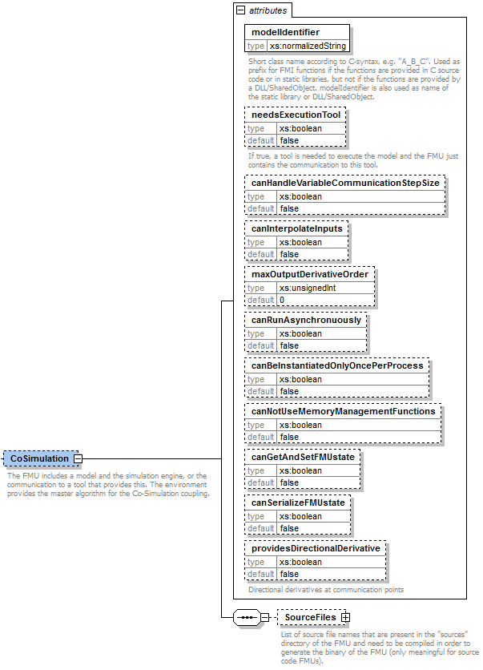
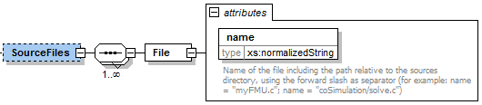

=== FMI Description Schema

This is defined in section 2.2.
Additionally, the co-simulation specific element "Implementation" is defined in the next section.

==== Co-Simulation FMU (CoSimulation) [[schema-CoSimulation]]

If the XML file defines an FMU for Co-Simulation, element "CoSimulation" must be present.
It is defined as:

These attributes have the following meaning (all attributes are optional with exception of `modelIdentifier`):

[cols="1,1",options="header"]
|====
|Attribute Name
|_Description_

|`modelIdentifier`
|Short class name according to C syntax, for example, "A_B_C".
Used as prefix for FMI functions if the functions are provided in C source code or in static libraries, but not if the functions are provided by a DLL/SharedObject.
`modelIdentifier` is also used as name of the static library or DLL/SharedObject.
See also section 2.1.1.

|`needsExecutionTool`
|If true, a tool is needed to execute the model.
The FMU just contains the communication to this tool (see Figure 8).
_[Typically, this information is only utilized for information purposes.
For example, a co-simulation master can inform the user that a tool has to be available on the computer where the slave is instantiated.
The name of the tool can be taken from attribute `generationTool` of `fmiModelDescription`.]_

|`canHandleVariableCommunicationStepSize`
|The slave can handle variable communication step size.
The communication step size (parameter communicationStepSize of `fmi3DoStep`) has not to be constant for each call.

|`canInterpolateInputs`
|The slave is able to interpolate continuous inputs.
Calling of `fmi3SetRealInputDerivatives` has an effect for the slave.

|`maxOutputDerivativeOrder`
|The slave is able to provide derivatives of outputs with maximum order.
Calling of `fmi3GetRealOutputDerivatives` is allowed up to the order defined by `maxOutputDerivativeOrder`.

|`canRunAsynchronuously`
|This flag describes the ability to carry out the `fmi3DoStep` call asynchronously.

|`canBeInstantiatedOnlyOncePerProcess`
|This flag indicates cases (especially for embedded code), where only one instance per FMU is possible. (For multiple instantiation the default is `false`; if multiple instances are needed, the FMUs must be instantiated in different processes.).

|`canNotUseMemoryManagementFunctions`
|If true, the slave uses its own functions for memory allocation and freeing only.
The callback functions `allocateMemory` and `freeMemory` given in `fmi3Instantiate` are ignored.

|`canGetAndSetFMUstate`
|If true, the environment can inquire the internal FMU state and restore it.
That is, `fmi3GetFMUstate`, `fmi3SetFMUstate`, and `fmi3FreeFMUstate` are supported by the FMU.

|`canSerializeFMUstate`
|If true, the environment can serialize the internal FMU state, in other words, `fmi3SerializedFMUstateSize`, `fmi3SerializeFMUstate`, `fmi3DeSerializeFMUstate` are supported by the FMU.
If this is the case, then flag `canGetAndSetFMUstate` must be true as well.

|`providesDirectionalDerivative`
|If true, the directional derivative of the equations at communication points can be computed with `fmi3GetDirectionalDerivative`.
|====

The flags have the following default values. +
boolean: false +
unsignedInt: 0 +

Note that if `needsExecutionTool = true`, then it is required that the original tool is available to be executed in co-simulation mode.
If `needsExecutionTool = false`, the slave is completely contained inside the FMU in source code or binary format (DLL/SharedObject).

==== Example XML Description File

The example below is the same one as shown in section 3.3.2 for a ModelExchange FMU.
The only difference is the replacement of element ModelExchange by element CoSimulation (with additional attributes) and the removal of local variables, which are associated with continuous states and their derivatives.
The XML file may have the following content:

[source, xml]
----
include::examples/co_simulation.xml[]
----
