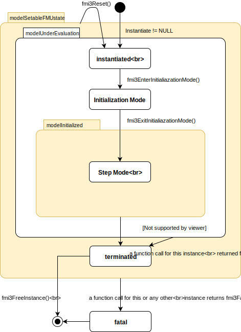

==== FMI Application Programming Interface
:stem: latexmath

This section contains the interface description for supporting the scheduled excecution mode from a C program.

The direct scheduling of model partitions based on clock ticks requires an additional handling mode for FMUs. 
The FMU signals its support for direct model partition scheduling in the modelDescription.xml via the flag `providesScheduledExecutionSimulation` equals true. 
The co-simulation master signals to the FMU that it supports and has recognized the clock and model partition scheduling capabilities of the FMU via setting the co-simulation mode to `fmi3ModeScheduledExecutionSimulation` in the function `fmi3Instantiate()`.

If the flag `providesScheduledExecutionSimulation` equals false, it is not allowed to set the co-simulation mode to `fmi3ModeScheduledExecutionSimulation`.

If no inferred clocks are defined by the FMU it is not allowed to set `providesScheduledExecutionSimulation` to true in the modelDescription.xml.

===== Transfer of Input / Output Values and Parameters

The simulation master sets and gets variable values as defined in section 4.2.

Before scheduling a model partition it is allowed to set all variables assigned to that model partition via its associated clock (including all global variables that are not associated to a clock) via `fmi3SetXXX()`. 
After the computation of a model partition (call of `fmi3ActivateModelPartition()` with the clockReference of the clock that is associated to the model partition) all variables that are assigned to this model partition (including all global variables that are not associated to a clock) can be retrieved via `fmi3GetXXX()`.
Set/get operations have to be atomic for a single variable.

_[The value of global variables can be influenced by more than one model partition if multiple model partitions are active at the same time.]_

The computational effort has to be predictable, thus all computationally expensive operations needed to calculate a model partition have to be contained within the `fmi3ActivateModelPartition()` function. 
The simulation master can assume that `get/setXXX` operations are not computationaly expensive.
In mode `fmi3ModeScheduledExecutionSimulation` the handling of `fmi3IntermediateUpdate()` callbacks is the same as in section <<clocked-co-simulation>>. 
The only difference is that an early return has no meaning in this mode and  no additional event handling based on `fmi3NewDiscreteStates()` is conducted. 
All internal events that shall be handled by the co-simulation master are signaled via `fmi3IntermediateUpdate()`. 
_[In this mode it is recommended to restrict such updates by the FMU to triggered clock ticks for reducing the computational load in real-time simulations.]_

===== Computation

If this mode is set, the master has to directly control the time of computation of model partitions.
The activation states of triggered clocks are transported via `fmi3IntermediateUpdate()` and `fmi3GetClock()`.

Each `fmi3ActivateModelPartition()` call is now associated to a (publicly disclosed, externally controlled) model partition of the model and therefore to a single defined inferred clock. 

[source, C]
----
include::../headers/fmi3FunctionTypes.h[tag=ActivateModelPartition]
----

The `fmi3ActivateModelPartition()` function has the following parameters:

- `fmi3Component c`: same meaning as for other fmi3 functions

- `fmi3ValueReference clockReference`: valueReference of an inferred clock defined in the modelDescription.XML which shall be activated

-	`fmi3Float64 activationTime`: simulation (i.e. virtual) time of the clock tick

Scheduling of `fmi3ActivateModelPartition()` calls for each FMU is done by the simulation master. Calls are based on ticks of periodic or aperiodic inferred clocks.
These inferred clock ticks can be based on triggered clock ticks from FMU external sources (e.g. triggered clocks of other FMUs) or other external clocks/events/interrupts assigned via the simulation master configuration (such external events can be based on a potentially unpredictable process or can be just simulation time based events e.g. the planned Communication Point). 
The `fmi3ActivateModelPartition()` function is not called for triggered clocks of an FMU.

The `fmi3DoStep()`, `fmi3SetClock()`, `fmi3SetIntervalDecimal()`, `fmi3SetIntervalFraction()`, `fmi3DoEarlyReturn()` functions are not called in this co-simulation mode.

The value for the `fmi3ActivateModelPartition()` parameter `activationTime` is the clock tick time latexmath:[t_i] from the  assigned inferred clock (which is known to the co-simulation master).
Refer to the clock time progress definition (<<clock-types-for-evaluation-of-clocked-model-partitions>>) for inferred periodic clocks.

If required, the FMU can internally derive the clock interval stem:[\Delta T_i] based on the last clock tick time stem:[t_{i-1}] i.e. last activationTime for this clockReference (based on last `fmi3ActivateModelPartition()` call)

A `fmi3ActivateModelPartition()` call will compute the results of the model partition defined by clockReference for the current clock tick latexmath:[t_i].

_[This is a different timing concept compared to `fmi3DoStep()` calls. 
This is required to cover clock ticks for aperiodic inferred clocks that tick at time instances that are not predictable in advance for the simulation master. 
Typically, hardware I/O or virtual ECU software events belong to this category.]_

It is not allowed to call `fmi3ActivateModelPartition()` for a clockReference (i.e. valueReference of clock variable) more than once for the same activationTime latexmath:[t_i].

==== State Machine

This section summarizes the avalable states and the allowed function calls in the respective states

.Calling sequence of scheduled execution simulation mode.
[caption="Figure 10: "]

===== State: instantiated

In this state, start and guess values (= variables that have `initial` equals `"exact"` or `"approx"`) can be set.

====== Allowed Function Calls

`fmi3EnterInitializationMode()`::
Restrictions in this state:
+
test2

===== State: Initialization Mode
In this state, equations are active to determine all outputs (and optionally other variables exposed by the exporting tool).
The variables that can be retrieved by `fmi3GetXXX` calls are (1) defined in the XML file under `<ModelStructure><InitialUnknowns>`, and (2) variables with `causality` equals `"output"`.
Variables with `initial` equals `"exact"`, as well as variables with `variability` equals `"input"` can be set.

====== Allowed Function Calls

`fmi3EnterInitializationMode()`::
Restrictions in this state:
+
test2

===== State: Step Mode
====== Allowed Function Calls

`fmi3EnterInitializationMode()`::
Restrictions in this state:
+
test2

===== State: terminated
====== Allowed Function Calls

`fmi3EnterInitializationMode()`::
Restrictions in this state:
+
test2

===== State: fatal
====== Allowed Function Calls

`fmi3EnterInitializationMode()`::
Restrictions in this state:
+
test2

Examples:_

[cols="3,4",options="header"]
|====
|_Correct calling sequence for a model partition of an FMU_ |_Wrong calling sequence_
|_fmi3SetXXX on inputs_ +
fmi3ActivateModelPartition +
_fmi3GetXXX on outputs_ +
_fmi3SetXXX on inputs_ +
fmi3ActivateModelPartition +
_fmi3GetXXX on outputs_ +

|_fmi3SetXXX on inputs_ +
fmi3ActivateModelPartition +
_fmi3GetXXX on outputs_ +
_fmi3SetXXX on inputs_ +
_fmi3GetXXX on outputs // not allowed_ +
fmi3ActivateModelPartition +
_fmi3GetXXX on outputs_ +
|====
_]_

===== Preemption Support

For real-time applications the simulation time equals real wall clock time, thus each `fmi3ActivateModelPartition()` computation step has to be finished in real-time within its current period time length (computation time is not only defined by the runtime of `fmi3ActivateModelPartition()` but also by the time for setting and getting variables and related operations). 
Usually a preemptive scheduling of the `fmi3ActivateModelPartition()`, `fmi3GetXXX()`, `fmi3SetXXX()` calls is required for respecting this constraint.

The FMU’s code has to be prepared for being able to correctly handle preemptive calls of `fmi3ActivateModelPartition()`,`fmi3GetXXX()`,`fmi3SetXXX()`. 
That requires a secured internal and external access to global states and variable values. 
Thus in this co-simulation mode a support for a correct handling of the preemption of model partition computations is required. 
That also requires that the FMU reports the active state of a triggered clock only with the first call of `fmi3GetClock()` for a specific activation of this clock and sets the reported activation state back to false for the following `fmi3GetClock()` calls for that clock until this triggered clock is internally activated again.

If a preemptive multitasking regime is intended an individual task (or thread, task and thread are used synonymously here) for each model partition (associated to an inferred clock) has to be created. 
The task for computing each `fmi3ActivateModelPartition()` is created and controlled by the simulation master, not by the FMU. 
So the FMU exporting tool does not need to take care for that (except for preparing its code to support preemption).

_[If only one single model partition (inferred clock) is available via the interface of an FMU, preemptive calls of the related `fmi3ActivateModelPartition()` function are possible by default (since there are no external cross dependencies within one model partition between communication points).]_

Based on the inferred clock settings defined in the XML the master calls `fmi3setXXX()`, `fmi3ActivateModelPartition()`, `fmi3getXXX()` calls. 
Set/get calls for each task are only allowed for variables that are associated to the inferred clock associated to that task or – here preemption issues become important – to variables that are associated to no clocks (global variables), based on the XML information (see 4.4.3).

_[The recommendation is to avoid global variable associations as much as possible in the XML. 
It is also recommended to reduce dependencies (defined in XML model structure) between variables located in different model partitions of one FMU, since this also requires in most cases that the related variables have to be global variables.]_

The co-simulation master has no knowledge about the FMU internal communication between the model partitions of a single FMU and does not handle it.

Error, reset or terminate information are global states of the FMU. If e.g. an `fmi3XXX` function returns `fmi3Discard` or `fmi3Error` this is also assumed for all preempted model partitions. 
Please note that in case of `fmi3Discard` or `fmi3Error` no repetition of the step is possible, the only possible ways to go forward are to end or to reset the simulation.

The simulation master schedules the `fmi3ActivateModelPartition()` (as well as related get/setXXX) calls based on given priorities for inferred clocks defined in the modelDescription.xml.

Priority (see <<definition-of-clocks>>):

- Same priority: Tasks cannot preempt each other. Arbitrary execution order is possible for tasks of the same priority.
- Different priorities: Tasks of a higher priority preempt tasks of a lower priority as soon as the higher priority task needs to be computed. 

Inferred clock ticks (see <<variants-of-clocks>>): 

- (strict) periodic (period can be predefined by FMU or be defined by master, depending on XML information)
- aperiodic (based on external possibly unpredictable events)

Based on the period and priority definitions the exporting tool can restrict the code execution order. 
It nevertheless has to secure its code against concurrent execution (not parallel execution) along the defined priority restrictions. 
Mostly this is required for internal inter-model-partition communication and in general for the joint use of global variables within the FMU. 
The exporting tool has to consider external events i.e. interrupts (if inferred aperiodic clocks are defined) and the influences of computing speed, so the exact preemption occurrence points cannot be foreseen (within the given priority and period restrictions).

To provide more options to secure the code against unwanted preemption new callback functions are defined that can be used to prevent preemption for certain code parts.
If `providesScheduledExecutionSimulation` equals true the default setting is that preemption is permitted. 
The preemption lock has to be actively started and stoped in the FMU’s code.
Such locks should be used with care and only for securing very short code parts that cannot be secured otherwise.

A lock can be created and released to prevent preemption of that task (i.e. model partition):

[source, C]
----
include::../headers/fmi3FunctionTypes.h[tag=PreemptionLock]
----

Even if the co-simulation master does not support preemption and the mode `fmi3ModeScheduledExecutionSimulation`, at least an empty implementation of these callback functions is required.

Example for the use of `fmi3CallbackStartPreemptionLock()` and `fmi3CallbackStopPreemptionLock()` callback functions in the FMU code:

[source, C]
----
Int16 DataBuffer[3];   // global buffer

void Task1(void) //low priority
{
   ...
   // write data to DataBuffer
   fmi3CallbackStartPreemptionLock();
   DataBuffer[0] = internal_out_RootSys1_1;
   DataBuffer[1] = internal_out_RootSys1_2;
   DataBuffer[2] = internal_out_RootSys1_3;
   fmi3CallbackStopPreemptionLock();
   ...
 }

...
void Task2(void) //high priority
{
   ...
   // read data from DataBuffer
   fmi3CallbackStartPreemptionLock();
   internal_in_RootSys2_1 = DataBuffer[0]; 
   internal_in_RootSys2_2 = DataBuffer[1];   
   internal_in_RootSys2_3 = DataBuffer[2]; 
   fmi3CallbackStopPreemptionLock();
   ...
}
----

===== Pseudo-code Example

In the following example, the usage of the FMI functions is sketched in order to clarify the typical calling sequence of the functions in a simulation environment.
The example is given in a mix of pseudo-code and C, in order to keep it small and understandable.
We consider one slave with three model partitions. Two model partitions associated to two periodic inferred clocks (clock periods 1 ms and 2 ms) and one aperiodic inferred clock.  

[source, c]
----
include::examples/pseudo_code_co_simulation_scheduled_execution_simulation.txt[]
----