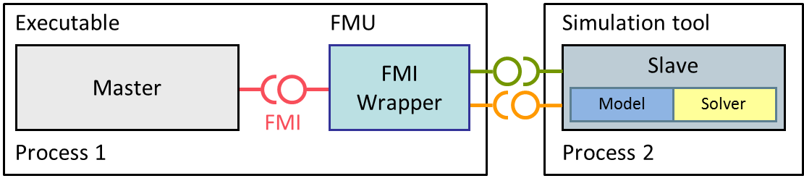
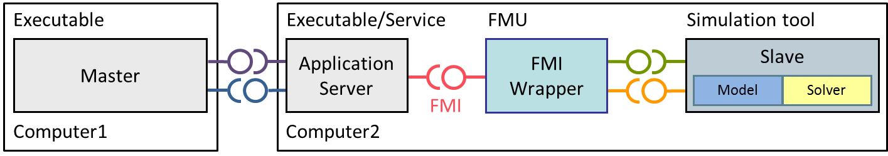

== FMI for Co‑Simulation

This chapter defines the Functional Mock-up Interface (FMI) for the coupling of two or more simulation models in a co-simulation environment (FMI for Co-Simulation).
Co-simulation is a rather general approach to the simulation of coupled technical systems and coupled physical phenomena in engineering with focus on instationary (time-dependent) problems.

FMI for Co-Simulation is designed both for coupling with subsystem models,
which have been exported by their simulators together with its solvers as runnable code (Figure 7),
and for coupling of simulation tools (simulator coupling,
tool coupling (Figure 8 and Figure 7)).

.Co-simulation with generated code on a single computer (for simplicity shown for one slave only).
[caption="Figure 7: "]
image::images/figure7.png[width=50%]

.Co-simulation with tool coupling on a single computer (for simplicity shown for one slave only).
[caption="Figure 8: "]

In the tool coupling case the FMU implementation wraps the FMI function calls to API calls which are provided by the simulation tool (for example, a COM or CORBA API).
Additionally to the FMU the simulation tool is needed to run a co-simulation.

In its most general form,
a tool coupling based co-simulation is implemented on distributed hardware with subsystems being handled by different computers with different OS
(cluster computer, computer farm, computers at different locations).
The data exchange and communication between the subsystems is typically done using one of the network communication technologies (for example, MPI, TCP/IP).
The definition of this communication layer is not part of the FMI standard.
However, distributed co-simulation scenarios can be implemented using FMI as shown in Figure 9.

.Distributed co-simulation infrastructure (for simplicity shown for one slave only).
[caption="Figure 9: "]

The master has to implement the communication layer.
Additional parameters for establishing the network communication (for example, identification of the remote computer, port numbers, user account) are to be set via the GUI of the master.
These data are not transferred via the FMI API.
