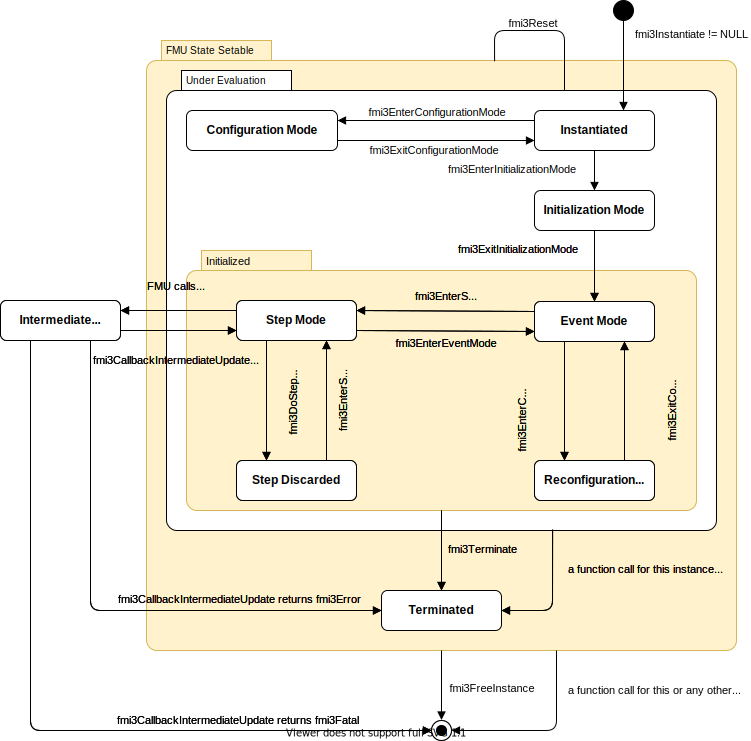

=== Application Programming Interface [[hybrid-co-simulation-api]]

==== Communication of event time and input/output values

The <<fmi3CallbackIntermediateUpdate>> callback described in <<earlyreturn-co-simulation>> is also used in order to communicate the <<input>> and <<output>> and, in particular, the event and <<clock>> time from the FMU to the Co-Simulation master.
The <<fmi3CallbackIntermediateUpdate>> callback allows internal events (e.g. associated to <<outputClock>> ticks) to be signaled from an FMU to the Co-Simulation master.
If the interface type is Hybrid Co-Simulation, the <<fmi3CallbackIntermediateUpdate>> callback must be defined in the instantiate function.
In other cases a null pointer can be assigned to the <<fmi3CallbackIntermediateUpdate>> callback, for instance when the interface type is Model Exchange.

The output arguments of <<fmi3CallbackIntermediateUpdate>> are used to signal <<outputClock>> ticks and internal events to the master.

[source, C]
----
include::../headers/fmi3FunctionTypes.h[tag=CallbackIntermediateUpdate]
----

* Argument <<intermediateUpdateTime>> is the internal simulation time of the FMU at which the callback has been called.
If an event happens or a <<outputClock>> ticks, <<intermediateUpdateTime>> is the time of event or <<outputClock>> tick.
If the FMU signals an `earlyReturn = fmi3True` and `fmi3OK` after returning from <<fmi3DoStep>> then <<intermediateUpdateTime>> is the internal simulation time of the FMU of the last <<fmi3CallbackIntermediateUpdate>> call that signaled <<canReturnEarly,`canReturnEarly = fmi3True`>>.
<<intermediateUpdateTime>> is also the time of intermediate steps of the internal FMU solver.

The following `fmi3Boolean` variables define the reasons for the <<fmi3CallbackIntermediateUpdate>> call.
Several variables can be set by the FMU.
Default value of variables is `fmi3False`.

* When <<eventOccurred,`eventOccurred = fmi3True`>>, the master must call <<fmi3DoEarlyReturn>> to do an early return and handle the event via entering *Event Mode*.
In this case, `earlyReturnTime` argument of <<fmi3DoEarlyReturn>> is ignored.
In *Event Mode* the master shall call the <<fmi3NewDiscreteStates>> function for gathering related information about the event that occurred at <<intermediateUpdateTime>>.

* When <<clocksTicked,`clocksTicked = fmi3True`>>, it means that <<fmi3GetClock>> function should be called for gathering all <<clock>> related information about ticking <<outputClock,`output clocks`>> at <<intermediateUpdateTime>>.
If this flag is `fmi3True` the master must call <<fmi3DoEarlyReturn>> to do an early return and handle the <<clock>> event in *Event Mode*.
In this case, `earlyReturnTime` argument of <<fmi3DoEarlyReturn>> is ignored.

* When <<intermediateVariableSetAllowed,`intermediateVariableSetAllowed = fmi3True`>>, the FMU signals that intermediate output values can be collected by the Co-Simulation master.

* When <<intermediateVariableGetAllowed,`intermediateVariableGetAllowed = fmi3True`>>, the FMU signals that intermediate input values can be set by the Co-Simulation master.

* When <<intermediateStepFinished, `intermediateStepFinished = fmi3True`>>, the FMU signals that the internal solver step for this time instant is complete.

* When <<canReturnEarly,`canReturnEarly = fmi3True`>> the master can request the FMU to return early at the current <<intermediateUpdateTime>> time instant via calling <<fmi3DoEarlyReturn>> within the callback function <<fmi3CallbackIntermediateUpdate>>.
If <<canReturnEarly,`canReturnEarly = fmi3False`>> the FMU will not do the early return, regardless of the master request.

Note that only the first discontinuity event at a Newtonian time instant shall be signaled that way.
But in *Event Mode*, there may be an event iteration at a Newtonian time instant and have super-dense time instants.

Based on the information provided by <<fmi3CallbackIntermediateUpdate>>, additional information about the discontinuity at that time instant can be obtained by calling <<fmi3NewDiscreteStates>> and <<fmi3GetClock>>.

The FMU must not call the callback function <<fmi3CallbackIntermediateUpdate>> with an <<intermediateUpdateTime>> that is smaller than the <<intermediateUpdateTime>> given in a previous call of <<fmi3CallbackIntermediateUpdate>> with `intermediateStepFinished = fmi3True`.

==== Handling a Successful Early-Return by the Co-Simulation Master in Hybrid Co-Simulation

If the FMU is successful in conducting an early return, the return value of the `earlyReturn` argument in <<fmi3DoStep>> is `fmi3True`, otherwise `fmi3False`.
If the FMU returns from <<fmi3DoStep>> with the `earlyReturn = fmi3True` the Co-Simulation master has to call <<fmi3EnterEventMode>> for that FMU.

[source, C]
----
include::../headers/fmi3FunctionTypes.h[tag=EnterEventMode]
----

The Co-Simulation master can also call <<fmi3EnterEventMode>> at communication instants to handle input events, as will be discussed in following sections.

If an FMU provides the early-return capability that includes the handling of events in *Event Mode*,
the FMU signals this via `canReturnEarlyAfterIntermediateUpdate` in the `modelDescription.xml`.

The FMU stops computation at the first encountered internal event (if any) and the event time is provided through <<intermediateUpdateTime>>.
If <<fmi3DoStep>> returns with `earlyReturn = fmi3True` and an event has happened, i.e. <<eventOccurred,`eventOccurred = fmi3True`>>, then an event handling has to be done by the Co-Simulation master.
In order to start event handling the Co-Simulation master has to call <<fmi3EnterEventMode>> for that FMU to push the FMU into *Event Mode*.
In this mode the Co-Simulation master is supposed to catch all events through the <<fmi3NewDiscreteStates>> function.

If the early-return request of the Co-Simulation master is ignored by the FMU, then <<fmi3DoStep>> returns with `earlyReturn = fmi3False`.
The master can start a resynchronization of FMUs at an event time, if the `currentCommunicationPoint` has passed the event time, the master can roll-back the FMU and repeat the step with a suitable `communicationStepSize` (if the FMU supports the roll-back).

In *Event Mode* and only after <<fmi3DoStep>> returned with `earlyReturn = fmi3True` the function <<fmi3NewDiscreteStates>> may be called.
Only the following output arguments may be considered:

- When `newDiscreteStatesNeeded = true`, the master should stay in *Event Mode* and another call to <<fmi3NewDiscreteStates>> is required.

- When `nextEventTimeDefined = fmi3True`, an event time is available and the value is given by `nextEventTime`.
This is the case when the model can report in advance the accurate time of the next predictable time event.

- When `terminateSimulation = fmi3True`, the model requested to stop integration and the Co-Simulation master should call <<fmi3Terminate>>.

In *Event Mode* it is allowed to call `fmi3Get{VariableType}` after <<fmi3NewDiscreteStates>> has been called and it is allowed to call `fmi3Set{VariableType}` before calling <<fmi3NewDiscreteStates>>.
The FMU leaves *Event Mode* when the master calls <<fmi3EnterStepMode>>.

It is not allowed to call <<fmi3EnterEventMode>> or <<fmi3EnterStepMode>> for an FMU with interface type Basic Co-Simulation and Scheduled Co-Simulation.

==== Co-Simulation with Clock Support in Hybrid Co-Simulation [[api-clocked-co-simulation]]

In this section, signaling and retrieving <<clock>> ticks as well as the interface for supporting <<clock,`clocks`>> in FMI for Co-Simulation will be discussed.
If an FMU for Co-Simulation declares <<clock,`clocks`>> and clocked variables in the `modelDescription.xml` file, it supports <<clock,`clocks`>>.
The Co-Simulation master should indicate the FMU that the master has recognized the <<clock>> capabilities of the FMU and supports the <<clock>> handling by calling the Hybrid Co-Simulation interface instantiation function <<fmi3InstantiateHybridCoSimulation>>.
Note, even if no <<clock>> is defined by an FMU in `modelDescription.xml`, the master can instantiate a Hybrid Co-Simulation FMU to be able to use early return with event handling in *Event Mode*.

If an FMU provides <<clock,`clocks`>>, but the Co-Simulation master does not support or does not want to support early-return or <<clock,`clocks`>>, by setting the interface to Hybrid Co-Simulation, the activation of model partitions inside of the FMU has to be handled internally within <<fmi3DoStep>>.

_[Remark: Wrapping towards other Co-Simulation interfaces can influence the simulation results._
_Depending on the model especially wrapping towards Hybrid Co-Simulation may result in divergent simulation results._
_Especially aperiodic <<inputClock,`input clocks`>> can not always be sufficiently emulated in modes that do not directly support <<clock,`clocks`>>._
_Therefore it is recommended that the FMU provides logging information to the user about the influence of the current mode on simulation results, if non-optimal modes are used by the simulation environment.]_

[[fmi3EnterStepMode,`fmi3EnterStepMode`]]
[source, C]
----
include::../headers/fmi3FunctionTypes.h[tag=EnterStepMode]
----

===== Transfer of Input / Output Values and Parameters in Hybrid Co-Simulation [[transfer-of-input-output-and-parameters-clocked-co-simulation]]

If the Co-Simulation master supports <<clock,`clocks`>>, all <<inputClock,`input clocks`>> of the model should be handled and <<inputClock>> events should be scheduled by the master.
If an <<outputClock>> ticks, the FMU calls <<fmi3CallbackIntermediateUpdate>> with <<clocksTicked,`clocksTicked = fmi3True`>>.
Then the master must call <<fmi3DoEarlyReturn>> to do an early return from <<fmi3DoStep>> and push the FMU into *Event Mode* by calling <<fmi3EnterEventMode>>.
Once the FMU is in *Event Mode*, the activation status of <<outputClock,`output clocks`>> are retrieved by <<fmi3GetClock>> function.
Then <<fmi3SetClock>> (and <<fmi3SetIntervalDecimal>> or <<fmi3SetIntervalFraction>> if necessary) should be invoked to enable the ticked <<inputClock,`input clocks`>>.
Each <<clock>>, that ticks outside of the FMU (i.e. <<inputClock>>), is activated for an FMU based on its <<clockReference>> and an associated <<fmi3SetClock>> in *Event Mode*.
<<fmi3SetClock>> can activate multiple <<clock,`clocks`>> with each call.
An event iteration is possible.
Once all <<clock>> events are handled for this time instant, the FMU should be pushed into *Step Mode* by calling <<fmi3EnterStepMode>>.
In *Step Mode*, the Co-Simulation master can call <<fmi3DoStep>> for the time interval from the current event time instant until the next input event instant.
Note that <<fmi3DoStep>> may not reach the next input event instant because an early return may occur.

The simulation master sets and gets <<clock>> variable values similar to the FMI for Model Exchange, as defined in <<fmi-api-setting-getting-clock-activation-state>>.

===== Computation in Hybrid Co-Simulation [[computation-clocked-co-simulation]]

Similar to FMI for Model Exchange, in order to activate <<inputClock,`input clocks`>> of an FMU, it is required to push the FMU into *Event Mode* by calling <<fmi3EnterEventMode>>.
If <<fmi3DoStep>> returns with `earlyReturn = fmi3True` and <<eventOccurred,`eventOccurred = fmi3True`>> or <<clocksTicked,`clocksTicked = fmi3True`>>, the FMU must be pushed into the *Event Mode* by calling <<fmi3EnterEventMode>>.

In order to retrieve the status of <<outputClock,`output clocks`>>, <<fmi3GetClock>> and <<fmi3GetIntervalDecimal>> or <<fmi3GetIntervalFraction>> need to be called in the *Event Mode*.
If the <<fmi3DoStep>> return value is `fmi3OK` and `earlyReturn = fmi3False`, the calling of <<fmi3GetClock>>, <<fmi3GetIntervalDecimal>>, <<fmi3GetIntervalFraction>>, <<fmi3NewDiscreteStates>> is only meaningful after <<fmi3SetClock>> in the case of super-dense time iterations are desired.

Similar to the Model Exchange case, the allowed call order is <<fmi3GetClock>>, <<fmi3GetIntervalDecimal>>, <<fmi3GetIntervalFraction>>, `fmi3Get{VariableType}`, `fmi3Set{VariableType}`.
Function calls of this call order can be omitted.

The handling of return values of function calls is identical to Basic Co-Simulation.

If `terminateSimulation` becomes `fmi3True` after calling <<fmi3NewDiscreteStates>> then the co-simulation should be terminated by calling <<fmi3Terminate>>.
Once handling of the <<clock>> events finished, the master calls <<fmi3EnterStepMode>> for that FMU to push it into *Step Mode*.
Note that it is not allowed to call <<fmi3EnterEventMode>> or <<fmi3EnterStepMode>> in Basic and Scheduled Co-Simulation.

_[Usually the Co-Simulation master should be able to derive (but is not forced to do so) the correct communication point times for <<inputClock,`input clocks`>> in advance and thus it should be able to set the proper `communicationStepSize` for <<fmi3DoStep>>._
_This might not be possible if an aperiodic <<inputClock>> of an FMU depends on the ticking of an aperiodic <<outputClock>> of another FMU or other aperiodic tick sources.]_

==== State Machine for Hybrid Co-Simulation [[state-machine-calling-sequence-clocked-co-simulation]]

The following state machine defines the supported calling sequences.

.Calling sequence of Hybrid Co-Simulation interface.

[#figure-hybrid-co-simulation-state-machine]

In this Co-Simulation interface the following functions must not be called: <<fmi3ActivateModelPartition>> including all functions that are specific to Model Exchange.

Unlike the state machine in <<state-machine-co-simulation>> the entry state after *Initialization Mode* is the *Event Mode* in order to allow the FMU to handle the very first discrete event.
Each state of the state machine corresponds to a certain phase of a simulation as follows:

===== State: FMU State Setable

This super state in Hybrid Co-Simulation does not differ from Basic Co-Simulation described in <<state-fmu-state-setable-co-simulation>>.

===== State: Under Evaluation

This super state in Hybrid Co-Simulation does not differ from Basic Co-Simulation described in <<state-under-evaluation-co-simulation>>.

===== State: Initialized

This super state in Hybrid Co-Simulation does not differ from Basic Co-Simulation described in <<state-initialized-co-simulation>>.

===== State: Instantiated

This super state in Hybrid Co-Simulation does not differ from Basic Co-Simulation described in <<state-instantiated-co-simulation>>.

===== State: Configuration Mode

This state in Hybrid Co-Simulation does not differ from Basic Co-Simulation described in <<state-configuration-mode-co-simulation>>.

===== State: Initialization Mode

This state in Hybrid Co-Simulation does not differ from Basic Co-Simulation described in <<state-initialization-mode-co-simulation>>.

===== State: Event Mode

The master and the FMU enter this state when the master calls <<fmi3ExitInitializationMode>> in state *Initialization Mode* or <<fmi3ExitConfigurationMode>> in state *Reconfiguration Mode* or <<fmi3EnterEventMode>> in state *Step Mode*.
In order to handle discrete events and <<clock>> ticks, the FMU is pushed into the *Event Mode* by calling <<fmi3EnterEventMode>>

Allowed Function Calls::
<<fmi3Terminate>>::
Upon return of <<fmi3NewDiscreteStates>>, if `terminateSimulation = fmi3True`, the master should finish the Co-Simulation by calling `fmi3Terminate` on all FMU instances.

<<fmi3EnterConfigurationMode>>::
With this function call the *Reconfiguration Mode* is entered.
This function must not be called if the FMU contains no <<tunable>> <<structuralParameter,`structural parameters`>> (i.e. with <<causality>> = <<structuralParameter>> and <<variability>> = <<tunable>>).

<<fmi3NewDiscreteStates>>::
In order to handle discrete events <<fmi3NewDiscreteStates>> is called.
When the output argument `newDiscreteStatesNeeded = fmi3True`, the FMU should stay in *Event Mode* and another call to <<fmi3NewDiscreteStates>> is required.

<<fmi3EnterStepMode>>::
Once all events are handled and `newDiscreteStatesNeeded = fmi3False`, the FMU should be pushed to *Step Mode* by calling <<fmi3EnterStepMode>>, unless it requests to terminate the Co-Simulation by setting  `terminateSimulation` to `fmi3True`.
In this case, a new step can be started from the current communication point time.

<<fmi3GetClock>>::
The status of <<clock,`clocks`>> can be inquired by this function.

<<fmi3SetClock>>::
For <<inputClock,`input clocks`>>, <<fmi3SetClock>> is called after entering *Event Mode* to set the activation status of <<clock,`clocks`>>.
For both <<input>> and trigerred <<clock,`clocks`>>, this function can be called several times, only if recomputations of clock state are needed during *Event Mode*.

<<fmi3GetIntervalDecimal>> & <<fmi3GetIntervalFraction>>::
For both <<outputClock,`output clocks`>> and <<inputClock,`input clocks`>> it is allowed to call these functions during *Event Mode*.

<<fmi3SetIntervalDecimal>> & <<fmi3SetIntervalFraction>>::
It is not allowed to call these functions for <<output>>, aperiodic and strictly periodic <<clock,`clocks`>>.
For <<input>> periodic <<clock,`clocks`>>, these functions are called after the first <<clock>> activaion.

===== State: Step Mode

This state in Hybrid Co-Simulation does not differ from Basic Co-Simulation described in <<state-step-mode-co-simulation>>.

===== State: Intermediate Update Mode

This state in Hybrid Co-Simulation differ from Basic Co-Simulation described in <<state-step-mode-co-simulation>> as following:

Allowed Function Calls::

<<fmi3DoEarlyReturn>>::
If <<canReturnEarly,`canReturnEarly = fmi3True`>>, the Co-Simulation master can request the FMU to end the <<fmi3DoStep>> and to do an early return by calling this function.

Forbidden Function Calls::
All API functions not listed in the allowed function list, including <<fmi3GetClock>> and  <<fmi3SetClock>> are forbidden in this mode.

===== State: Reconfiguration Mode

This state in Hybrid Co-Simulation does not differ from Basic Co-Simulation described in <<state-reconfiguration-mode-co-simulation>>.

===== State: Step Discarded

This state in Hybrid Co-Simulation does not differ from Basic Co-Simulation described in <<state-step-discarded-co-simulation>>.

===== State: Terminated

This state in Hybrid Co-Simulation does not differ from Basic Co-Simulation described in <<state-terminated-co-simulation>>.

// TODO: Update table. Remove stepComplete, stepInProgress, stepCanceled? Where is the state Error described in the state machine?

_[The allowed function calls in the respective states are summarized in the following table (functions marked in [yellow-background]#"yellow"# are only available for Co-Simulation, the other functions are available both for Model Exchange and Co-Simulation):_

[cols="10,1,1,1,1,1,1,1,1,1,1,1,1,1,1",width="40%"]
|====
.2+.>|*Function*
14+|*FMI 3.0 for Co-Simulation*
|[vertical-text]#start, end#
|[vertical-text]#Instantiated#
|[vertical-text]#Configuration Mode#
|[vertical-text]#Initialization Mode#
|[vertical-text]#Event Mode#
|[vertical-text]#Reconfiguration Mode#
|[vertical-text]#Step Mode#
|[vertical-text]#stepComplete#
|[vertical-text]#stepInProgress#
|[vertical-text]#Step Discarded#
|[vertical-text]#Intermediate Update Mode#
|[vertical-text]#stepCanceled#
|[vertical-text]#Terminated#
|[vertical-text]#error#

|<<fmi3GetVersion>>               |x |x |  |x |  |  |  |x |x |  |x |x |x |x
|<<fmi3SetDebugLogging>>          |  |x |  |x |  |  |  |x |x |  |x |x |x |x
|<<fmi3Instantiate>>              |x |  |  |  |  |  |  |  |  |  |  |  |  |
|<<fmi3FreeInstance>>             |  |x |  |x |  |  |  |x |  |  |x |x |x |x
|<<fmi3EnterInitializationMode>>  |  |x |  |  |  |  |  |  |  |  |  |  |  |
|<<fmi3ExitInitializationMode>>   |  |  |  |x |  |  |  |  |  |  |  |  |  |
|<<fmi3Terminate>>                |  |  |  |  |  |  |  |x |  |  |x |  |  |
|<<fmi3Reset>>                    |  |x |  |x |  |  |  |x |  |  |x |x |x |x
|`fmi3GetReal`                    |  |  |  |2 |  |  |  |x |  |  |8 |7 |x |7
|`fmi3GetInteger`                 |  |  |  |2 |  |  |  |x |  |  |8 |7 |x |7
|`fmi3GetBoolean`                 |  |  |  |2 |  |  |  |x |  |  |8 |7 |x |7
|`fmi3GetString`                  |  |  |  |2 |  |  |  |x |  |  |8 |7 |x |7
|`fmi3SetReal`                    |  |1 |  |3 |  |  |  |6 |  |  |  |  |  |
|`fmi3SetInteger`                 |  |1 |  |3 |  |  |  |6 |  |  |  |  |  |
|`fmi3SetBoolean`                 |  |1 |  |3 |  |  |  |6 |  |  |  |  |  |
|`fmi3SetString`                  |  |1 |  |3 |  |  |  |6 |  |  |  |  |  |
|<<fmi3GetFMUState>>              |  |x |  |x |  |  |  |x |  |  |8 |7 |x |7
|<<fmi3SetFMUState>>              |  |x |  |x |  |  |  |x |  |  |x |x |x |x
|<<fmi3FreeFMUState>>             |  |x |  |x |  |  |  |x |  |  |x |x |x |x
|<<fmi3SerializedFMUStateSize>>   |  |x |  |x |  |  |  |x |  |  |x |x |x |x
|<<fmi3SerializeFMUState>>        |  |x |  |x |  |  |  |x |  |  |x |x |x |x
|<<fmi3DeSerializeFMUState>>      |  |x |  |x |  |  |  |x |  |  |x |x |x |x
|<<fmi3GetDirectionalDerivative>> |  |  |  |x |  |  |  |x |  |  |8 |7 |x |7
|<<fmi3EnterStepMode>>            {set:cellbgcolor:yellow} |  {set:cellbgcolor!} |  |  |  |  |  |  |  |  |  |  |  |  |
|<<fmi3SetInputDerivatives>>      {set:cellbgcolor:yellow} |  {set:cellbgcolor!} |x |  |x |  |  |  |  |x |  |  |  |  |
|<<fmi3GetOutputDerivatives>>     {set:cellbgcolor:yellow} |  {set:cellbgcolor!} |  |  |  |  |  |  |  |x |  |8 |x |x |7
|<<fmi3DoStep>>                   {set:cellbgcolor:yellow} |  {set:cellbgcolor!} |  |  |  |  |  |  |  |x |  |  |  |  |
|<<fmi3ActivateModelPartition>>   {set:cellbgcolor:yellow} |  {set:cellbgcolor!} |  |  |  |  |  |  |  |  |  |  |  |  |
|<<fmi3DoEarlyReturn>>            {set:cellbgcolor:yellow} |  {set:cellbgcolor!} |  |  |  |  |  |  |  |  |x |  |  |  |
|<<fmi3GetDoStepDiscardedStatus>> {set:cellbgcolor:yellow} |  {set:cellbgcolor!} |  |  |  |  |  |  |  |  |  |x |  |  |
|====

_]_

==== Code Example for Hybrid Co-Simulation [[code-example-clocked-co-simulation]]

In the following example, the usage of the FMI functions is sketched in order to clarify the typical calling sequence of the functions in a simulation environment.
We consider ...

// TODO: Description of code example. Explained once validated, after examples are ready?

The error handling is implemented in a very rudimentary way.

// TODO: add code example

[source, C]
----
//include::examples/c-code/co_simulation_clocked.c[tags=CoSimulation]
----
