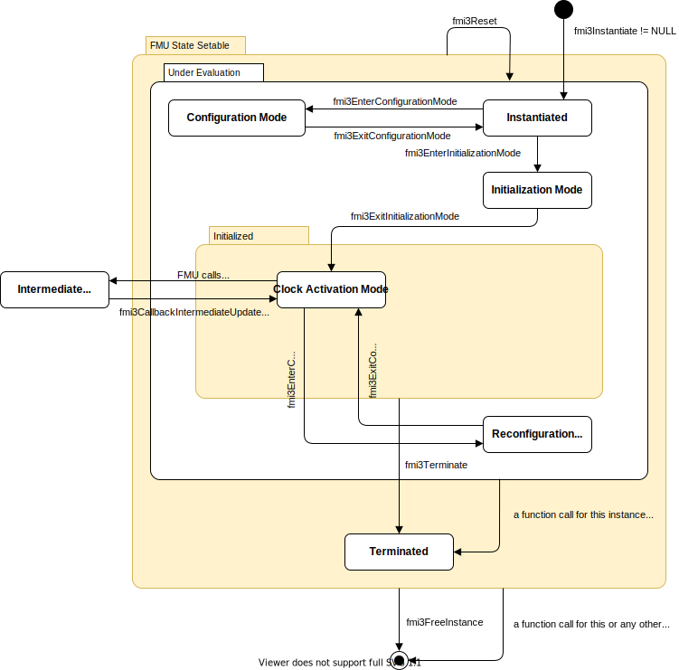

=== State Machine for Scheduled Execution [[state-machine-scheduled-execution]]

The state machine in <<figure-scheduled-execution-state-machine>> defines the allowed calling sequences for FMI for Scheduled Execution.

.Calling sequence of Scheduled Execution C functions.
[#figure-scheduled-execution-state-machine]

Common states are defined in <<common-state-machine>>, such as super states <<FMUStateSetable>> and  <<Initialized>>, states <<Instantiated>>, <<ConfigurationMode>>, <<ReconfigurationMode>>, <<InitializationMode>>, <<EventMode>>, and <<Terminated>>.

Error, reset or terminate information is a global state of the FMU.
If any function call returns <<fmi3Discard>> or <<fmi3Error>>, all active or preempted model partitions are in the same state.
In case of <<fmi3Discard>> or <<fmi3Error>> no repetition of the step is possible, the only possible way to continue is to enter the <<Terminated>> state and to end or to reset the simulation or - if supported by the FMU - to set the FMU back to a previous state.

If the simulation algorithm intends to enter the state <<Terminated>>, it must ensure that all computations related to model partitions of the FMU have ended.
Hence, if in states <<ClockActivationMode>>, <<ClockUpdateMode>>, or <<ReconfigurationMode>> a function returns <<fmi3Fatal>>, the simulation algorithm may prematurely end all computations of model partitions of this FMU.
If in these states a function returns <<fmi3Discard>> or <<fmi3Error>> the simulation algorithm may wait until all other model partitions of this FMU have ended, but new model partitions must not be started.

The FMU signals its support for Scheduled Execution in the <<modelDescription.xml>> via the element `<fmiModelDescription><ScheduledExecution>`.
The simulation algorithm signals to the FMU that it supports and has recognized the <<Clock,Clocks>> and model partition scheduling capabilities of the FMU by instantiating it as Scheduled Execution.

==== Super State: Initialized [[Initialized-SE,*Initialized*]]

The following specific constraints apply to the state <<Initialized>> of Scheduled Execution.
The FMU enters state <<Terminated>> only after all computations of model partitions of this FMU have ended.
After <<fmi3Terminate>> has been called, no new model partitions can be started (e.g. related to <<countdown-aperiodic-clock,countdown Clock>> ticks) and all other function calls for this FMU must return <<fmi3Error>> until the state <<Terminated>> is reached.

==== State: Clock Activation Mode [[ClockActivationMode,*Clock Activation Mode*]]

The FMU enters this state when the simulation algorithm calls <<fmi3ExitInitializationMode>> in state <<InitializationMode>> or <<fmi3ExitConfigurationMode>> in state <<ReconfigurationMode>>.

An FMU of type Schedule Execution exposes its provided <<model-partition,model partitions>> by defining associated Clocks.
The FMU's <<modelDescription.xml>> contains a <<Clock, Clock>> for every <<model partition>> of the FMU.
It is on the scheduler to activate the model partitions by calling <<fmi3ActivateModelPartition>> (as well as related <<get-and-set-variable-values,`fmi3Get{VariableType}`>> and `fmi3Set{VariableType}`) for each associated Clock.
When activating the model partitions of an FMU the scheduler is expected to respect the Clock properties, e.g. <<intervalDecimal>> and <<priority>>.
Detailed information on Clocks can be found in chapter <<Clock,Clocks>>.
By scheduling the exposed <<model-partition, model partitions>> of an FMU and executing them at dedicated points in time it is the scheduler that defines how time progresses.
The current time latexmath:[\mathbf{t}_i] is communicated to the FMU as <<activationTime>> argument of <<fmi3ActivateModelPartition>>.
<<fmi3ActivateModelPartition>> must only be called once for the same Clock and time.
_[The basic differences of the three interface types on how time is advanced is pointed out in <<advancing-time>>.]_

During the computation of a model partition of an <<inputClock,input Clock>>, the FMU may inform the importer that an <<outputClock>> ticked or a <<countdown-aperiodic-clock, countdown Clock>> has to be ticked.
To do so the FMU switches into <<ClockUpdateMode>>.
Subsequently it is up to the importer to react on this information.
I.e. the importer may activate potential sinks (e.g. a model partition of another FMU) connected to this <<outputClock>> or the model partition of the respective <<countdown-aperiodic-clock,countdown Clock>>.

[cols="2,1",options="header"]
|====
|<<each-state-description,Equations and Actions>>
|Functions Influencing Equations

|Set <<tunable>> <<parameter,`parameters`>> latexmath:[\mathbf{p}_{\mathit{variability = tunable}}] .
|<<get-and-set-variable-values,`fmi3Set{VariableType}`>>

|Set discrete-time <<input,`inputs`>> latexmath:[\mathbf{u}_{d}(\mathbf{t})].
|<<get-and-set-variable-values,`fmi3Set{VariableType}`>>

|Get values of variables latexmath:[\mathbf{v}(\mathbf{t})].
|<<get-and-set-variable-values,`fmi3Get{VariableType}`>>

a|When an input Clock latexmath:[\mathbf{k}_i] ticks, activate the corresponding model partition:

* latexmath:[(\mathbf{y}_\mathit{d,k_i}, \mathbf{x}_\mathit{d,k_i}, \mathbf{w}_\mathit{d,k_i}) := \mathbf{f}_{\mathit{activate}}({}^{\bullet}\mathbf{x}_\mathit{d}, \mathbf{w}_d, \mathbf{u}_\mathit{d}, \mathbf{p}, \mathbf{k_i})] +
* Update previous values of discrete states of the corresponding model partition: latexmath:[{}^\bullet\mathbf{x}_\mathit{d,k_i}:=\mathbf{x}_\mathit{d,k_i}].
|<<fmi3ActivateModelPartition>>

|====

Allowed Function Calls::

Function <<get-and-set-variable-values,`fmi3Set{VariableTypeExclClock}`>>::
This function can be called before scheduling a model partition for variables assigned to that model partition via its associated <<Clock>> and all variables not associated with any <<Clock>>.

Function <<get-and-set-variable-values,`fmi3Get{VariableTypeExclClock}`>>::
These functions can be called after the computation of a model partition for variables assigned to that model partition via its associated <<Clock>> and all variables not associated with any <<Clock>>.
+
Because of real-time constraints, the computational effort has to be predictable for all operations in Scheduled Execution.
Therefore, all computationally expensive operations to compute a model partition have to be contained within the <<fmi3ActivateModelPartition>> function.
The simulation algorithm can assume that <<get-and-set-variable-values,`fmi3Get{VariableTypeExclClock}`>> and <<get-and-set-variable-values,`fmi3Set{VariableTypeExclClock}`>> operations are not computationally expensive.
+
The restrictions related to variable <<causality>> and <<variability>> defined for <<StepMode>> in <<fmi-for-co-simulation,`Co-Simulation`>> apply.
+
It is not allowed to call <<get-and-set-variable-values,`fmi3Get{VariableTypeExclClock}`>> functions after <<get-and-set-variable-values,`fmi3Set{VariableTypeExclClock}`>> functions without an <<fmi3ActivateModelPartition>> call in between.
_[It is recommended, to call <<get-and-set-variable-values,`fmi3Set{VariableTypeExclClock}`>>, <<fmi3ActivateModelPartition>> and <<get-and-set-variable-values,`fmi3Get{VariableTypeExclClock}`>> in a sequence._
_The reason is to avoid different interpretations of the caching, since contrary to <<fmi-for-model-exchange, `FMI for Model Exchange`>>, <<fmi3ActivateModelPartition>> will perform the actual calculation instead of <<get-and-set-variable-values,`fmi3Get{VariableTypeExclClock}`>>, and therefore, dummy algebraic loops at communication points cannot be handled by an appropriate sequence of <<get-and-set-variable-values,`fmi3Get{VariableTypeExclClock}`>> and <<get-and-set-variable-values,`fmi3Set{VariableTypeExclClock}`>> calls as for Model Exchange.]_
+
Set/get calls before and after <<fmi3ActivateModelPartition>> are only allowed for variables that define a reference to the <<inputClock>> by the <<clocks>> attribute or variables that are associated to no <<Clock>>.
_[Note, that to avoid data inconsistencies and safeguard predictable behavior with <<get-and-set-variable-values,`fmi3Get{VariableType}`>>, <<get-and-set-variable-values,`fmi3Set{VariableType}`>> a unique assignment of the respective variables to model partitions via its associated <<Clock>> is strongly recommended._
_Observe the example in <<preemption-support>>.]_

Function <<fmi3GetDirectionalDerivative>>::
See <<fmi3GetDirectionalDerivative>>.

Function <<fmi3GetAdjointDerivative>>::
See <<fmi3GetAdjointDerivative>>.

[[fmi3ActivateModelPartition, `fmi3ActivateModelPartition`]]
Function `fmi3ActivateModelPartition`::

Each <<fmi3ActivateModelPartition>> call is associated with the computation of an exposed model partition of the FMU and therefore to an <<inputClock>>.
+
[source, C]
----
include::../headers/fmi3FunctionTypes.h[tag=ActivateModelPartition]
----
+
The <<fmi3ActivateModelPartition>> function has the following arguments:

* [[clockReference,`clockReference`]] `clockReference`: <<valueReference>> of the <<inputClock>> associated to the model partition which shall be activated.

* [[activationTime, `activationTime`]] `activationTime`: value of the <<independent>> variable of the assigned <<Clock>> tick time latexmath:[\mathbf{t}_i] _[typically: simulation (i.e. virtual) time]_ (which is known to the simulation algorithm).

+
The importer schedules calls of <<fmi3ActivateModelPartition>> for each FMU.
These calls are based on ticks of <<inputClock,input Clocks>>.
The <<fmi3ActivateModelPartition>> function must not be called on <<outputClock,output Clocks>> of an FMU.

+
_[Note, that other than <<fmi3DoStep>> for Co-Simulation, <<fmi3ActivateModelPartition>> will compute the results of the model partition for the current <<Clock>> tick latexmath:[\mathbf{t}_i].]_

+
_[If required, the FMU can internally derive the <<Clock>> interval_ latexmath:[\mathbf{T}_\mathit{interval, i}] _based on the last <<Clock>> tick time_ latexmath:[\mathbf{t}_\mathit{i-1}] _i.e. last <<activationTime>> for this <<clockReference>> (based on last <<fmi3ActivateModelPartition>> call).]_

+
Consecutive calls to <<fmi3ActivateModelPartition>> for a <<clockReference>> (i.e. <<valueReference>> of <<Clock>> variable) must have strictly monotonically increasing <<activationTime>> latexmath:[\mathbf{t}_i].

Functions <<fmi3GetIntervalDecimal>> & <<fmi3GetIntervalFraction>>::
These function calls are allowed for <<tunableClock>> and <<changing-aperiodic-clock>> Clocks.

[[fmi3ClockUpdateCallback,`fmi3ClockUpdateCallback`]]
Function `fmi3ClockUpdateCallback`::

+
[source, C]
----
include::../headers/fmi3FunctionTypes.h[tag=CallbackClockUpdate]
----
+
[[activateClockReferences,`activateClockReferences`]]
<<fmi3ClockUpdateCallback>> switches the FMU itself into the <<ClockUpdateMode>>.
The callback may be called from several <<model-partition, model partitions>>.

Functions <<fmi3GetFMUState>>, <<fmi3SetFMUState>>, <<fmi3FreeFMUState>>, <<fmi3SerializedFMUStateSize>>, <<fmi3SerializeFMUState>>, <<fmi3DeSerializeFMUState>>::
These functions must not be called if any model partition is currently active or preempted.
_[This is because these functions apply to the whole FMU and not only to a specific model partition.]_

==== State: Clock Update Mode [[ClockUpdateMode,*Clock Update Mode*]]

A model partition of a Scheduled Execution FMU calls <<fmi3ClockUpdateCallback>> to signal that a <<triggered, `triggered output`>> <<Clock>> ticked or a new interval for a <<countdown-aperiodic-clock,`countdown`>> <<Clock>> is available.

This means that <<fmi3GetClock>> must be called for gathering all <<Clock>> related information about ticking <<outputClock,output Clocks>> and <<fmi3GetInterval>> must be called for all <<countdown-aperiodic-clock,`countdown`>> <<Clock,Clocks>> whose associated model partitions have to be scheduled afterwards if a new interval is provided.

Allowed Functions::

Function <<fmi3GetClock>>::
The scheduling algorithm uses <<fmi3GetClock>> to determine which <<triggered, triggered output clock>> is active. +
For an <<outputClock>> only the first call of <<fmi3GetClock>> for a specific activation of this <<Clock>> signals `fmi3ClockActive`.
The FMU sets the reported activation state immediately back to fmi3ClockInactive` for following <<fmi3GetClock>> calls for that <<Clock>> until this <<outputClock>> is activated again.

Functions <<fmi3GetIntervalDecimal>> & <<fmi3GetIntervalFraction>>::
These function calls are allowed for <<countdown-aperiodic-clock,`countdown`>> Clocks.

_[In Scheduled Execution it cannot be determined which model partition has called <<fmi3ClockUpdateCallback>>, because multiple model partitions can be active at the same time._
_Since all information about which model partition to activate is coded into its corresponding Clock, there is no need to know which potentially other model partition activated this Clock.]_
