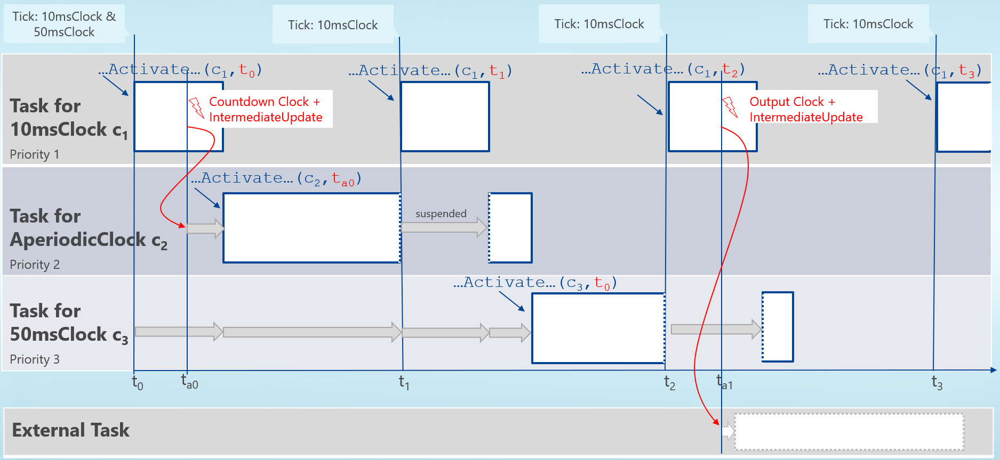

=== Application Programming Interface [[scheduled-execution-api]]

This section contains the description of the Scheduled Execution interface for a C program.

The direct scheduling of model partitions based on <<clock>> ticks requires an additional handling mode for FMUs.
The FMU signals its support for direct model partition scheduling in the <<modelDescription.xml>> via the element `<fmiModelDescription><ScheduledExecution>`.
The simulation algorithm signals to the FMU that it supports and has recognized the <<clock>> and model partition scheduling capabilities of the FMU by instantiating it as Scheduled Execution.

Error, reset or terminate information is a global state of the FMU.
If e.g. an function returns <<fmi3Discard>> or <<fmi3Error>> this is also assumed for all active or preempted model partitions.
In case of <<fmi3Discard>> or <<fmi3Error>> no repetition of the step is possible, the only possible way to go forward is to enter the *Terminated* state and to end or to reset the simulation or - if supported - to set the FMU back to a former state.

==== Transfer of Input and Output Values and Parameters

The simulation algorithm sets and gets variable values as defined in <<get-and-set-variable-values>>.

Before scheduling a model partition it is allowed to set all variables assigned to that model partition via its associated <<clock>> (including all global variables that are not associated to a <<clock>>) via `fmi3Set{VariableType}`.
After the computation of a model partition (call of <<fmi3ActivateModelPartition>> with the <<clockReference>> and <<clockElementIndex>> of the <<clock>> that is associated to the model partition) all variables that are assigned to this model partition (including all global variables that are not associated to a <<clock>>) can be retrieved via `fmi3Get{VariableType}`.
Set/get operations have to be atomic for a single variable.

_[The value of global variables can be influenced by more than one model partition if multiple model partitions are active at the same time.]_

The computational effort has to be predictable, thus all computationally expensive operations needed to calculate a model partition have to be contained within the <<fmi3ActivateModelPartition>> function.
The simulation algorithm can assume that `fmi3Get{VariableType} and fmi3Set{VariableType}` operations are not computationally expensive.
In Scheduled Execution the handling of <<fmi3CallbackIntermediateUpdate>> callbacks is the same as in <<fmi-for-co-simulation>>.
The only difference is that an early return has no meaning in this mode and no additional event handling based on <<fmi3NewDiscreteStates>> is conducted.
All internal events that shall be handled by the simulation algorithm are signaled via <<fmi3CallbackIntermediateUpdate>>.
_[In this mode it is recommended to restrict such updates by the FMU to <<outputClock>> ticks for reducing the computational load in real-time simulations.]_

==== Scheduled Execution and Clocks

If this mode is set, the simulation algorithm has to directly control the time of computation of model partitions associated to <<inputClock,`input clocks`>>.
The activation states of <<outputClock,`output clocks`>> are transported via <<fmi3CallbackIntermediateUpdate>> and <<fmi3GetClock>>.

[[fmi3ActivateModelPartition, `fmi3ActivateModelPartition`]]
Each <<fmi3ActivateModelPartition>> call is now associated to the computation of a (publicly disclosed, externally controlled) model partition of the model and therefore to a single defined <<inputClock>>.

[source, C]
----
include::../headers/fmi3FunctionTypes.h[tag=ActivateModelPartition]
----

The <<fmi3ActivateModelPartition>> function has the following arguments:

- `fmi3Instance instance`: same meaning as for other `fmi3*` functions

- `fmi3ValueReference` <<clockReference>>: <<valueReference>> of an <<inputClock>> variable defined in the <<modelDescription.xml>> which shall be activated

- `size_t` <<clockElementIndex>>:: The element index of the <<inputClock>> variable which shall be activated.
For a scalar <<clock>> variable this must be 0; for array <<clock>> variables the element clock to activate is specified using the 1-based element index.
Using the element index 0 means all elements of the <<clock>> variable.
(Note: If an array has more than one dimension the indices are serialized in the same order as defined for values).

[[activationTime, `activationTime`]]
- `fmi3Float64 activationTime`: value of the <<independent>> variable of the assigned <<inputClock>> tick time latexmath:[t_i] _[typically: simulation (i.e. virtual) time]_ (which is known to the simulation algorithm).

Scheduling of <<fmi3ActivateModelPartition>> calls for each FMU is done by the simulation algorithm.
Calls are based on ticks of <<periodic>> or <<periodic,aperiodic>> <<inputClock,`input clocks`>>.
These <<inputClock>> ticks can be based on <<clock>> ticks from FMU external sources (e.g. <<outputClock,`output clocks`>> of other FMUs) or other external <<clock,`clocks`>>/events/interrupts assigned via the simulation algorithm configuration (such external events can be based on a potentially unpredictable process or can be just simulation time based events e.g. the planned communication point).
The <<inputClock>> ticks can also be based on <<outputClock,`output clock`>> ticks of the same FMU.
Refer to <<math-scheduled-execution>> and <<CommunicationPointClocks>>.
The <<fmi3ActivateModelPartition>> function is not called for <<outputClock,`output clocks`>> of an FMU.

Note that this is a different timing concept compared to <<fmi3DoStep>> calls for Co-Simulation FMUs or the <<fmi3SetTime>> for Model Exchange FMUs.
A <<fmi3ActivateModelPartition>> call will compute the results of the model partition defined by <<clockReference>> and <<clockElementIndex>> (i.e. <<valueReference>> of the variable that defines a <<clock>> and an element index into that for arrays) for the current <<clock>> tick latexmath:[t_i].

If required, the FMU can internally derive the <<clock>> interval latexmath:[\Delta T_i] based on the last <<clock>> tick time latexmath:[t_{i-1}] i.e. last `activationTime` for this <<clockReference>> and <<clockElementIndex>> (based on last <<fmi3ActivateModelPartition>> call).

Consecutive calls to <<fmi3ActivateModelPartition>> for a <<clockReference>> and <<clockElementIndex>> (i.e. <<valueReference>> of <<clock>> variable and element index into that for arrays) must have strictly monotonically increasing `activationTime` latexmath:[t_i].

==== State Machine for Scheduled Execution [[state-machine-scheduled-execution]]

This section summarizes the available states and the allowed function calls in the respective states.

.Calling sequence of Scheduled Execution C functions.
[#figure-scheduled-execution-state-machine]
image::images/state-machine-scheduled-execution.svg[width=80%, align="center"]

If the simulation algorithm intends to enter the state *Terminated* it must ensure that all tasks related to model partitions of the FMU have ended.
Hence if in states *Clock Activation Mode*, *Intermediate Update Mode*, or *Reconfiguration Mode* a function returns <<fmi3Fatal>> the simulation algorithm may prematurely end all tasks related to the computation of model partitions of this FMU.
If in these states a function returns <<fmi3Discard>> or <<fmi3Error>> the simulation algorithm may wait until all other tasks of the model partitions of this FMU have ended, but new tasks must not be started.

Each state of the state machine corresponds to a certain phase of a simulation.
Common states are defined in <<state-machine-and-common-states>>, such as super states <<FMUStateSetable,*FMU State Setable*>>, <<UnderEvaluation,*Under Evaluation*>> and  <<Initialized,*Initialized*>>, states <<Instantiated,*Instantiated*>>, <<ConfigurationMode,*Configuration Mode*>>, <<ReconfigurationMode,*Reconfiguration Mode*>>, <<InitializationMode,*Initialization Mode*>>, <<Terminated,*Terminated*>> and <<IntermediateUpdateMode,*Intermediate Update Mode*>>.

===== Super State: Initialized [[Initialized-SE]]

Special to Scheduled Execution, the following additional constrains apply to the state *Initialized* (see <<Initialized>>).
The FMU enters state *Terminated* only after all other tasks related to the computation of model partitions of this FMU have ended.
After <<fmi3Terminate>> has been called no new tasks can be started (e.g. related to <<outputClock>> ticks) and all other function calls for this FMU must return <<fmi3Error>> until the state *Terminated* is reached.

===== State: Clock Activation Mode

The FMU enters this state when the simulation algorithm calls <<fmi3ExitInitializationMode>> in state *Initialization Mode* or <<fmi3ExitConfigurationMode>> in state *Reconfiguration Mode*.

In this state the simulation algorithm can create multiple concurrent tasks related to an FMU and in each task the simulation algorithm can activate one or multiple <<inputClock,`input clocks`>> of an FMU based on the defined <<clock>> properties via a <<fmi3ActivateModelPartition>> call for each <<clock>>.

Allowed Function Calls::

<<fmi3ActivateModelPartition>>::
It is recommended to call `fmi3Set{VariableType}` and `fmi3Get{VariableType}` in the same task as <<fmi3ActivateModelPartition>> for setting and retrieving variable values associated with the same <<clock>> activation.

<<get-and-set-variable-values,`fmi3Set{VariableType}`>>::
This function can be called before the start of the computation of a model partition.

<<get-and-set-variable-values,`fmi3Get{VariableType}>>`, `fmi3GetOutputDerivatives`, <<fmi3GetDirectionalDerivative>>::
These functions can be called after the end of the computation of a model partition.

For <<get-and-set-variable-values,`fmi3Set{VariableType}`>> <<get-and-set-variable-values,`fmi3Get{VariableType}>>`, `fmi3GetOutputDerivatives` and <<fmi3GetDirectionalDerivative>> it is not allowed to access variables associated to clocks other than the model partition's <<inputClock>>.
The restrictions related to variable <<causality>> and <<variability>> defined for *Step Mode* in <<fmi-for-co-simulation,`Co-Simulation`>> apply.

It is not allowed to call `fmi3Get{VariableType}` functions after `fmi3Set{VariableType}` functions without an <<fmi3ActivateModelPartition>> call in between.

_[The reason is to avoid different interpretations of the caching, since contrary to <<fmi-for-model-exchange, `FMI for Model Exchange`>>, <<fmi3ActivateModelPartition>> will perform the actual calculation instead of `fmi3Get{VariableType}`, and therefore, dummy algebraic loops at communication points cannot be handled by an appropriate sequence of `fmi3Get{VariableType}` and `fmi3Set{VariableType}` calls as for Model Exchange._

_Example:_

[cols="3,4",options="header"]
|====
|_Correct calling sequence for a model partition_
|_Illegal calling sequence_

|_fmi3Set{VariableType} on inputs_ +
fmi3ActivateModelPartition +
_fmi3Get{VariableType} on outputs_ +
_fmi3Set{VariableType} on inputs_ +
fmi3ActivateModelPartition +
_fmi3Get{VariableType} on outputs_ +

|_fmi3Set{VariableType} on inputs_ +
fmi3ActivateModelPartition +
_fmi3Get{VariableType} on outputs_ +
_fmi3Set{VariableType} on inputs_ +
_fmi3Get{VariableType} on outputs // not allowed_ +
fmi3ActivateModelPartition +
_fmi3Get{VariableType} on outputs_ +
|====

_]_

<<fmi3CallbackIntermediateUpdate>>::
Only in this state the FMU is allowed to call the callback <<fmi3CallbackIntermediateUpdate>>.
The callback may be called from concurrent tasks within <<fmi3ActivateModelPartition>>.
The function must not return <<fmi3Discard>>.

<<fmi3EnterConfigurationMode>>::
This function must not be called if the FMU contains no <<structuralParameter,`structural parameters`>> or other tasks related to the computation of model partitions of this FMU are currently active or preempted.
Thus this function can not be called concurrently for model partitions of an FMU but only for the whole FMU instance.
+
If the function returns with <<fmi3OK>> or <<fmi3Warning>> the FMU goes into state *Reconfiguration Mode*.

`fmi3Terminate`, `fmi3Reset`, <<fmi3FreeInstance>>::
These functions can not be called concurrently for model partitions of an FMU but only for the whole FMU instance.
If these functions are called while a model partition of an FMU is currently active or preempted, the FMU changes its state after the computation of all model partitions of this FMU has ended.

<<fmi3GetFMUState>>, <<fmi3SetFMUState>>, <<fmi3FreeFMUState>>,<<fmi3SerializedFMUStateSize>>, <<fmi3SerializeFMUState>>, <<fmi3DeSerializeFMUState>>::
These functions can be called if no other task related to the computation of model partitions of this FMU is currently active or preempted and the prerequisites defined for these functions in Co-Simulation are fulfilled.
Thus these functions can not be called concurrently for model partitions of an FMU but only for the whole FMU instance.

===== State: Intermediate Update Mode [[IntermediateUpdateModeSE]]

The FMU enters this state when the FMU calls <<fmi3CallbackIntermediateUpdate>> in state *Clock Activation Mode*.
When the callback function returns, the FMU returns to *Clock Activation Mode*.

Here only special remarks w.r.t. *Intermediate Update Mode* in Scheduled Execution are made.
For the general mechanism see <<IntermediateUpdateMode>>.

The FMU transports activation states of <<outputClock,`output clocks`>> to the simulation algorithm by calling <<fmi3CallbackIntermediateUpdate>> and providing <<fmi3GetClock>>.
The simulation algorithm provides the implementation of <<fmi3CallbackIntermediateUpdate>>.
If the simulation algorithm detects that an <<outputClock,`output clocks`>> ticked and this <<outputClock,`output clock`>> is configured to <<triggeredBy,`trigger`>> an <<inputClock,`input clock`>> the simulation algorithm schedules a task associated to this <<inputClock,`input clock`>>.

Allowed Function Calls::

Additionally to the functions listed in <<IntermediateUpdateMode>>, SE allows calling the following functions (in ME and CS, the following functions can be called in *Event Mode*):

<<fmi3GetClock>>::
For an <<outputClock>> only the first call of `fmi3GetClock` for a specific activation of this <<clock>> signals `fmi3ClockActive`.
The FMU sets the reported activation state immediately back to `fmi3ClockInactive` for the following `fmi3GetClock` calls for that <<clock>> (in the same or other model partitions of the FMU) until this <<outputClock>> is internally activated again.
The simulation algorithm can call `fmi3Set{VariableType}` and `fmi3Get{VariableType}` during the callback for variables associated to an <<outputClock>> that is active during this callback.

<<fmi3GetIntervalDecimal>> & <<fmi3GetIntervalFraction>>::
For <<outputClock,`output clocks`>> and <<localClock,`local clocks`>> it is allowed to call these functions during *Intermediate Update Mode*.
These functions can be called only at the first activation of <<periodic>> <<outputClock,`output clocks`>>.
For <<periodic,`aperiodic`>> <<outputClock,`output clocks`>>, these functions must be called at every activation _[to inquire when triggered <<inputClock,`input clocks`>> must tick]_.

_[Based on the FMI standard it cannot be determined which part of the code of an FMU has called the callback function <<fmi3CallbackIntermediateUpdate>>._
_This is especially the case for Scheduled Execution where multiple model partitions can be active at the same time._
_This causes no issues since all function call prerequisites are connected to the activation state of <<clock,`clocks`>>, <<modelDescription.xml>> information and additionally available information from <<fmi3CallbackIntermediateUpdate>>]_

==== Preemption Support [[preemption-support]]

For real-time applications the simulation time equals the real wall <<clock>> time, thus each <<fmi3ActivateModelPartition>> computation step has to be finished in real-time within its current period time length (computation time is not only defined by the runtime of <<fmi3ActivateModelPartition>> but also by the time for setting and getting variables and related operations).
Usually a preemptive scheduling of the <<fmi3ActivateModelPartition>>, `fmi3Get{VariableType}`, `fmi3Set{VariableType}` calls is required for respecting this constraint.

The FMU's code has to be prepared for being able to correctly handle preemptive calls of <<fmi3ActivateModelPartition>>, `fmi3Get{VariableType}`, `fmi3Set{VariableType}`.
That requires a secured internal and external access to global states and variable values.
Thus in Scheduled Execution a support for a correct handling of the preemption of model partition computations is required.
That also requires that the FMU reports the active state of a <<outputClock>> only with the first call of <<fmi3GetClock>> for a specific activation of this <<clock>> and sets the reported activation state immediately back to `false` for the following <<fmi3GetClock>> calls for that <<clock>> until this <<outputClock>> is internally activated again.

If a preemptive multitasking regime is intended an individual task (or thread -- task and thread are used synonymously here) for each model partition (associated to an <<inputClock>>) has to be created.
The task for computing each <<fmi3ActivateModelPartition>> is created and controlled by the simulation algorithm, not by the FMU.
So the FMU exporting tool does not need to take care for that (except for preparing its code to support preemption).

_[If only one single model partition (<<inputClock>>) is available via the interface of an FMU, preemptive calls of the related <<fmi3ActivateModelPartition>> function are possible by default since there are no external cross dependencies within one model partition between communication points.]_

Based on the <<inputClock>> settings defined in the XML the simulation algorithm calls `fmi3Set{VariableType}`, <<fmi3ActivateModelPartition>>, `fmi3Get{VariableType}` calls.
Set/get calls for each task are only allowed for variables that are associated to the <<inputClock>> associated to that task or - here preemption issues become important - to variables that are associated to no <<clock,`clocks`>> (global variables), based on the XML information (see <<clock-type-definition>>).

_[The recommendation is to avoid global variable associations as much as possible in the XML._
_It is also recommended to reduce dependencies (defined in XML model structure) between variables located in different model partitions of one FMU, since this also requires in most cases that the related variables have to be global variables.]_

The simulation algorithm has no knowledge about the FMU internal communication between the model partitions of a single FMU and does not handle it.

The simulation algorithm schedules the <<fmi3ActivateModelPartition>> (as well as related `fmi3Get{VariableType}` and `fmi3Set{VariableType}`) calls based on given priorities for <<inputClock,`input clocks`>> defined in the <<modelDescription.xml>>.

Priority (see <<clock-type-definition>>):

- Same priority: Model partitions (e.g. tasks) cannot preempt each other.
Arbitrary evaluation order is possible for model partitions of the same priority.

- Different priorities: Model partitions of a higher priority preempt partitions of a lower priority as soon as the higher priority partition needs to be computed.

_[If multiple tasks are needed to be scheduled for computation at a certain time instant a simulation algorithm must schedule a task of a higher priority always before a task of a lower priority]_

<<input,`Input`>> <<clock>> ticks (see <<inputClockVariant>>):

- (<<strict>>) <<periodic>> (period can be predefined by FMU or be defined by simulation algorithm, depending on XML information)
- <<periodic,aperiodic>> (based on external possibly unpredictable events or on an <<outputClock>> of the same FMU)

Based on the period and priority definitions the exporting tool can restrict the code evaluation order.
It nevertheless has to secure its code against concurrent evaluation _[not against parallel evaluation, as this is not supported for model partitions of an FMU in the interface description of this mode]_ along the defined priority restrictions.
Mostly this is required for internal inter-model-partition communication and in general for the joint use of global variables within the FMU.
The exporting tool has to consider external events i.e. interrupts (if <<input>> <<periodic,aperiodic>> <<clock,`clocks`>> are defined) and the influences of computing speed, so the exact preemption occurrence points cannot be foreseen (within the given priority and period restrictions).

To guard certain code parts against preemption they must be enclosed with the callback functions `lockPreemption` and `unlockPreemption`.

_[Such locks should be used with care and only for securing very short code parts that cannot be secured otherwise.]_

[source, C]
----
include::../headers/fmi3FunctionTypes.h[tag=CallbackPreemptionLock]
----

Even if the scheduler does not support preemption, at least an empty implementation of these callback functions must be provided to allow the reuse of code for different modes together with an efficient preemption.
_[This avoids checks for null function pointers._
_A function call to a void-void function with an immediate return is hardly any overhead.]_

Example for the use of `fmi3CallbackLockPreemption` and `fmi3CallbackUnlockPreemption` callback functions in the FMU code:

[source, C]
----
Int16 DataBuffer[3];   // global buffer

void Task1(void) //low priority
{
   ...
   // write data to DataBuffer
   fmi3CallbackLockPreemption();
   DataBuffer[0] = internal_out_RootSys1_1;
   DataBuffer[1] = internal_out_RootSys1_2;
   DataBuffer[2] = internal_out_RootSys1_3;
   fmi3CallbackUnlockPreemption();
   ...
 }

...
void Task2(void) //high priority
{
   ...
   // read data from DataBuffer
   fmi3CallbackLockPreemption();
   internal_in_RootSys2_1 = DataBuffer[0];
   internal_in_RootSys2_2 = DataBuffer[1];
   internal_in_RootSys2_3 = DataBuffer[2];
   fmi3CallbackUnlockPreemption();
   ...
}
----

==== Example for Scheduled Execution [[example-scheduled-execution]]

The FMU ThreeInputClocks sketches the usage of the FMI functions.
The example is given in a mix of pseudo-code and C, in order to keep it small and understandable.
We consider one FMU with three model partitions.
Two model partitions associated to two <<periodic>> <<inputClock,`input clocks`>> 10msClock and 50msClock (<<clock>> periods 10 ms and 50 ms) and one <<periodic,aperiodic>> <<inputClock>> AperiodicClock.

During the execution of the model partition of <<inputClock,`input clock`>> 10msClock the <<outputClock,`output clock`>> OutClock may tick and invoke the execution of model partition of <<periodic,aperiodic>> <<inputClock>> AperiodicClock.

The function calls <<fmi3ActivateModelPartition>> are executed in the context of preemptable tasks whose priorities are derived from the respective <<inputClock>> configurations of the FMU.
In this example the execution of the task of <<inputClock>> AperiodicClock is waiting for the task of <<inputClock>> 10msClock to finish.
Likewise the task of AperiodicClock is suspended when the task of higher priority is scheduled again.

The example also depicts how a task associated to an even lower prior <<inputClock>> 50msClock is delayed several times by tasks of higher priority.
Note that the point of time when the task was scheduled is the `activationTime` of <<fmi3ActivateModelPartition>> (...Activate...(`input clock`, `activationTime`)).

.Scheduled Execution Example ThreeInputClocks
[[figure-scs_example]]

===== Description Schema [[scheduled-execution-schema]]

The simulation algorithm collects the information about the number and properties of <<clock,`clocks`>> supported by the FMU via analyzing the <<modelDescription.xml>> as defined in <<fmi-description-schema>>.
For every <<inputClock,`input clock`>> the simulation algorithm defines a task.
The properties `period` and `priority` are defined based on the <<inputClock,`input clocks'`>> `period` and `priority` defined in the <<modelDescription.xml>>.
The simulation algorithm can read from the <<modelDescription.xml>> that <<outputClock,`output clock`>> OutClock may tick triggered by <<inputClock>> 10msClock and that <<inputClock>> AperiodicClock is triggered by OutClock.

[source, xml]
----
include::examples/se_example_modelDescription.xml[]
----

===== Simulation Algorithm Implementation

To enable the computation of a Scheduled Execution FMU a simulation algorithm has to provide a task scheduler.
Depending on the particular configuration the simulation algorithm sets up tasks for every <<inputClock,`input clock`>> (compare <<scheduled-execution-schema>> above).
When executed each task calls <<fmi3ActivateModelPartition>> for its respective <<inputClock,`input clock`>>.
The `activationTime` is provided by the simulation algorithm.
Periodic tasks can be scheduled on initialization of the simulation application.
Aperiodic tasks are scheduled explicitly during the execution.

[source, C]
----
Task10ms.Execute()
{
   // Set inputs with valueReference 0 and 1 associated to clockIndex 5
   fmi3SetFloat64(s, {0,1}, &AIn);
   // call for 10msClock tick (clockIndex 5)
   fmi3ActivateModelPartition(s, 5, 0, Task10ms.ActivationTime);
   // Get output with valueReference 2 associated to clockIndex 0
   fmi3GetFloat64(s, {2}, &AOut);
};
----

As specified in the XML file, <<inputClock,`input clock`>> AperiodicClock is triggered by <<outputClock,`output clock`>> OutClock thus the simulation algorithm ensures the task associated to AperiodicClock is scheduled when <<fmi3CallbackIntermediateUpdate>> is called by the FMU and OutClock has ticked.

[source, C]
----
void CallbackIntermediateUpdate(..., fmi3Boolean clocksTicked, ...)
{
   fmi3ValueReference outputClockReferences = {7};
   fmi3Boolean[] clocksActivationState = {fmi3ClockInactive};
   if (clocksTicked)
   {
      // ask FMU if output clock has ticked
      fmi3GetClocks(... outputClockReferences, &clocksActivationState, ...);
   }
   if (clocksActivationState[0])
   {
      // schedule task for AperiodicClock
      Scheduler->ScheduleTask(TaskAperiodic);
   }
}
----

===== FMU Implementation

The FMU implements <<fmi3ActivateModelPartition>> dispatching for every <<inputClock,`input clock`>> so the code might look like this:

[source, C]
----
fmi3Status fmi3ActivateModelPartition(fmi3Instance *instance,
   fmi3ValueReference clockReference, fmi3Float64 activationTime)
{
   switch (clockReference)
   {
      case 5:
         // Input clock 10msClock
         activateModelPartition10ms(instance, activationTime);
      case 6:
         // Input clock AperiodicClock
         activateModelPartitionAperiodic(instance, activationTime);
      case 8:
         // Input clock AperiodicClock
         activateModelPartition50ms(instance, activationTime);
      ...
   }
}
----

In the context of the task being executed every 10 ms, the FMU lets <<outputClock,`output clock`>> OutClock tick and calls <<fmi3CallbackIntermediateUpdate>>.

[source, C]
----
void activateModelPartition10ms(fmi3Instance *instance, ...)
{
   ...
   if (...)
   {
      // outputClock ticks
      fmi3SetClock({7});
      // inform simulation algorithm that output clock has ticked
      fmi3Boolean clocksTicked = fmi3True;
      instance->fmi3CallbackIntermediateUpdate(..., clocksTicked, ...);
   }
   ...
}
----

If <<fmi3GetClock>> is called for a certain <<outputClock,`output clock`>> the <<outputClock,`output clock`>> is reset.

[source, C]
----
fmi3Status fmi3GetClock(..., fmi3ValueReference outputClockReferences,
   fmi3Clock *clocksActivationState, ...)
{
   if (outputClockReferences[0] == 7)
   {
      clocksActivationState[0] = outClockActivationState;
      outClockActivationState = fmi3ClockInactive;
   }
}
----
