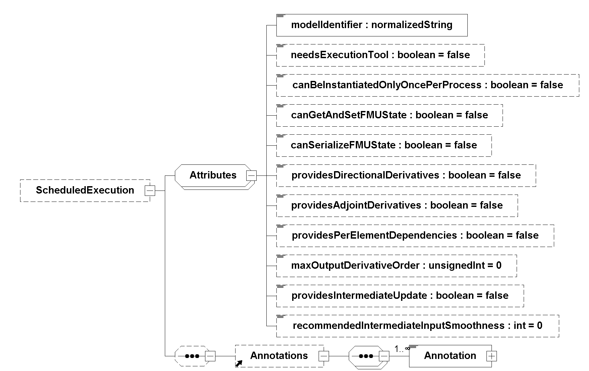

=== Description Schema [[scheduled-execution-schema]]

The common XML elements and attributes are defined in <<fmi-description-schema>>.
Additional elements and attributes are defined subsequently.
If the FMU implements the Scheduled Execution interface type, the element `<ScheduledExecution>` must be present.
It is defined as:

.ScheduledExecution element.
[[figure-schema-ScheduledExecution]]

The attribute in the following table is defined on top of the <<common-capability-flags, common attributes>> and have the following meaning (all attributes are optional with exception of <<modelIdentifier>>):

.ScheduledExecution attribute details.
[[table-ScheduledExecution-details]]
[cols="1,1",options="header"]
|====
|Attribute
|Description

|<<modelIdentifier>>
|Short class name according to C syntax, for example, `A_B_C`.
Used as prefix for FMI functions if the functions are provided in C source code or in static libraries, but not if the functions are provided by a DLL/SharedObject.
<<modelIdentifier>> is also used as name of the static library or DLL/SharedObject.
See also <<header-files-and-naming-of-functions>>.

|====

==== Example XML Description File

The simulation algorithm collects the information about the number and properties of <<Clock,`Clocks`>> supported by the FMU via analyzing the <<modelDescription.xml>> as defined in <<fmi-description-schema>>.
For every <<inputClock>> the simulation algorithm defines a task.
The properties <<intervalDecimal>> (or <<intervalCounter>>) and <<priority>> are defined based on the <<inputClock,input clocks'>> <<intervalDecimal>> (or <<intervalCounter>>) and <<priority>> defined in the <<modelDescription.xml>>.
The simulation algorithm can read from the <<modelDescription.xml>> that <<outputClock>> `OutClock` may tick triggered by <<inputClock>> `10msClock` and that <<inputClock>> `AperiodicClock` is triggered by `OutClock`.

[source, xml]
----
include::examples/scheduled_execution.xml[]
----
