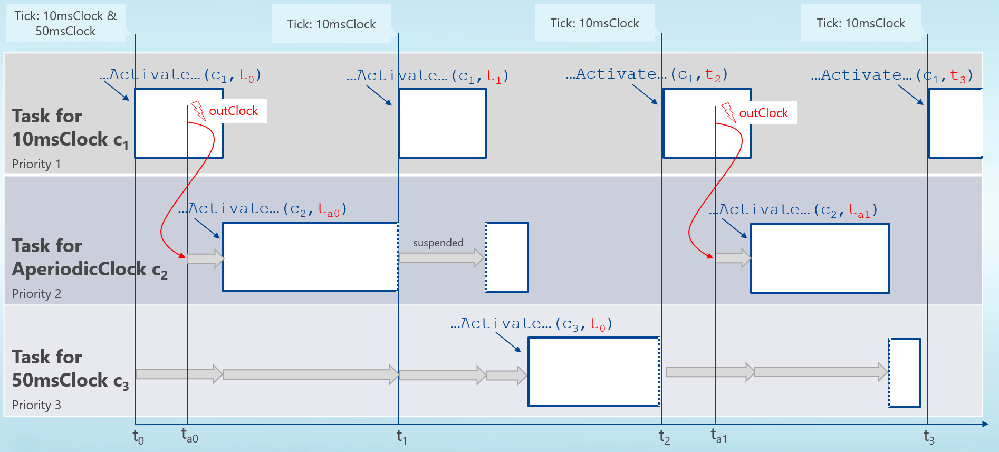

=== Description Schema [[scheduled-co-simulation-schema]]

The simulation master collects the information about the number and properties of <<clock,`clocks`>> supported by the FMU via analyzing the <<modelDescription.xml>> as defined in section 2.2. and 4.3.

Each <<clock>> that ticks outside of the FMU is activated for an FMU based on its <<clockReference>>.
There is a direct one-to-one relation for a <<clock>> and a model partition.

A Scheduled Co-Simulation FMU must have at least one <<inputClock,`input clock`>>.

==== Example XML Description File

The example below is the same one as shown in section [TBD] for a `fmi3ClockedCoSimulation` FMU.

[source, C]
----
include::examples/scs_example_fmu.c[]
----

[source, C]
----
include::examples/scs_example_master.c[]
----

[source, xml]
----
include::examples/scs_example_modelDescription.xml[]
----

.Scheduled Co-Simulation Example
[[figure-scs_example]]

TODO: describe capabilities
